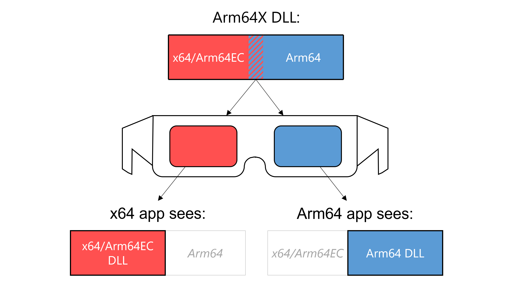
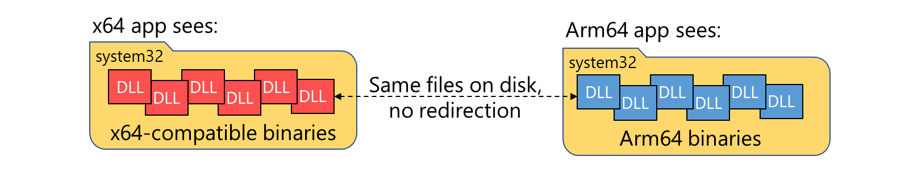
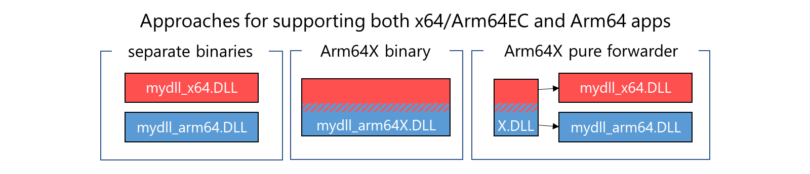

# Arm64X PE files

Arm64X is a new type of binary that can contain both the classic Arm64 code and [Arm64EC code](./arm64ec.md) together. This dual compatibility makes Arm64X suitable for both classic Arm64 and Arm64EC processes on a Windows on Arm device. It's an especially good fit for middleware or plugins that both ABIs use.

Introduced in the Windows 11 SDK, the Arm64X binary is a type of Portable Executable (PE) file that works with both Windows 11 on Arm and Windows 10 on Arm. To build Arm64X binaries, see [Build Arm64X Binaries](./arm64x-build.md).

## How do Arm64X binaries work?

Fundamentally, an Arm64X binary contains all of the content that would be in separate x64/Arm64EC and Arm64 binaries, but merges them into one more efficient file on disk. The built Arm64X binary has two sets of code, entry points, and other elements, while eliminating redundant parts to save space on disk.

When an application loads an Arm64X binary, the operating system applies transformations to expose the correct sections depending on the architecture of the process. You can think of an Arm64X binary like old 3D images, with both a red and blue image that can be viewed through the red or blue lenses on a pair of 3D glasses. An x64 app sees the DLL as though it's an x64 DLL, while an Arm64 app sees the same DLL as an Arm64 DLL.

The transparent operating system transformations allow both x64 and Arm64 applications to load the same Arm64X binary without ever knowing that it also contains code for the other architecture. For that reason, people nickname Arm64X binaries 'chameleon' as they take on the 'color' of their surroundings.

By default, Arm64X binaries appear to be Arm64 binaries. This default setting allows a system running Windows 10 on Arm, which doesn't recognize the Arm64X format or know how to apply transformations, to load the Arm64X binary into an Arm64 process successfully.

## How does the operating system use Arm64X binaries?

Windows 11 on Arm introduced the ability to run x64 applications on Arm64. However, unlike [x86 emulation](./apps-on-arm-x86-emulation.md), which includes a `SysWoW64` folder, there's no separate folder of pure x64 operating system binaries. With Windows 11 on Arm, both x64 applications and Arm64 applications can load binaries and call APIs by using the binaries in `System32`. This flexibility is possible because developers recompile any binaries in `System32` that an app might need to load as Arm64X binaries.

Both x64 and Arm64 applications can load and interact with the binaries in `System32`, without needing a separate copy of all system binaries like `SysWoW64` for x86.

## Arm64X for use with middleware or plugins

The core function of an Arm64X binary is to enable one file on disk to support both x64/Arm64EC and Arm64 processes. Most app developers focus on building their application as either Arm64EC or Arm64, not both, so you likely don't need Arm64X.

However, developers of **middleware** or **plugins** should consider Arm64X because such code can load into x64 or Arm64 processes.

You can support both x64 and Arm64 processes without using Arm64X, but you might find it easier to let the operating system handle loading the correct architecture of binary into a given 64-bit process.

Three conceptual ways to support both architectures on Windows 11 on Arm include:

- **Separate binaries**: Since standard practices today use separate binaries when supporting multiple architectures, you might find that building and shipping separate x64 and Arm64 binaries works better for your solution. You can use your existing mechanisms to ensure that the correct binary loads into the associated architecture process.

- **Arm64X binary**: You can build an Arm64X binary that contains all of the x64/Arm64EC and Arm64 code in one binary.  

- **Arm64X pure forwarder**: If you need the flexibility of Arm64X but want to avoid putting all of your app code into an Arm64X binary, you can use the pure forwarder approach. A small Arm64X binary with no code redirects the loader to the correct architecture of DLL.

## Example situations that require Arm64X

Some situations require using an Arm64X binary to support both x64 and Arm64 apps.  Those situations include:

- A 64-bit COM server that both x64 and Arm64 apps call
- A plugin that loads into either an x64 or Arm64 app
- A single binary that gets injected into an x64 or Arm64 process

In each of these cases, you can use an Arm64X binary or an Arm64X pure forwarder to enable one binary to support both architectures.

For details on building Arm64X binaries, see [Build Arm64X binaries](./arm64x-build.md).
