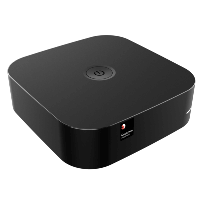
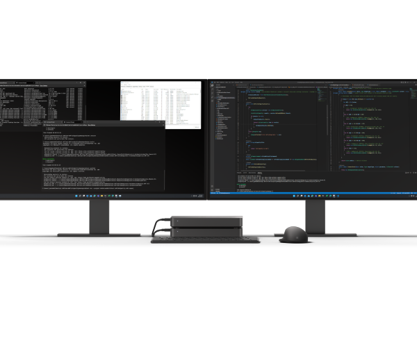

# Developer Kits for Arm64-powered Windows devices

Microsoft has been working hard to enable Windows developers to build Arm64-native apps and tools for Windows on Arm hardware. While there is still lots to be done, there have been some big advances with [ARM64EC](./arm64ec.md) and new developer kits. These kits will enable you to test your apps and find ways to take advantage of the speed and performance improvements possible with Arm64, including steps forward toward better power consumption, battery life, and accelerated AI & ML workloads.

:::row:::
    :::column:::
        
        **[Qualcomm Mini Box Desktop powered by Snapdragon](https://www.microsoft.com/d/ecs-liva-mini-box-qc710-desktop/8z247h1h3skp?activetab=pivot:overviewtab)** 
        A mini-PC powered by Snapdragon and designed for application development. Learn more about the [Snapdragon Developer Kit on the Qualcomm developer network](https://developer.qualcomm.com/hardware/windows-on-snapdragon/snapdragon-developer-kit).
    :::column-end:::
    :::column:::
        
        **"Project Volterra" (coming soon!)** 
        The new "Project Volterra" Arm64-powered Windows device is coming soon! Check back for more details.
    :::column-end:::
:::row-end:::

## Set up your Windows on Arm device for development

Most Microsoft tools and services can be installed and run on these Arm64-powered devices just like on an x64 device. We've listed some of the most popular developer tools that can be installed below.

### Install Visual Studio on your Arm device

- [Install Visual Studio Code for Arm](https://code.visualstudio.com/download)

- [Visual Studio on ARM-powered devices](/visualstudio/install/visual-studio-on-arm-devices): Visual Studio can run on ARM-powered devices via x64 emulation, though some features are not currently supported on ARM. As such, we don't recommend running Visual Studio on devices that use ARM-based processors, and instead recommend remotely targeted ARM devices.

### Install Windows developer tools on your Arm device

- [Install Windows Terminal](/windows/terminal/install)
- [Install Windows Package Manager](/windows/package-manager/winget/#install-winget)
- [Install Windows Subsystem for Linux](/windows/wsl/install)
- [Install PowerToys](/windows/powertoys/install)
- [Install Git for Windows](https://git-scm.com/download/win)
- [Install Docker Desktop for Windows](https://docs.docker.com/desktop/windows/install/)

### Build a Windows desktop app that runs on Arm devices

We recommend [Using ARM64EC to build Windows 11 apps that run on ARM devices](./arm64ec.md).

### Additional development environment set up for your Arm device

Get started with a variety of development frameworks using Windows on your Arm device. Try exploring our guide to help you get started with using React on Windows, NodeJS on Windows, Windows Subsystem for Android, Python, Rust, Blazor, and more.

[Set up your development environment on Windows](/windows/dev-environment/)
