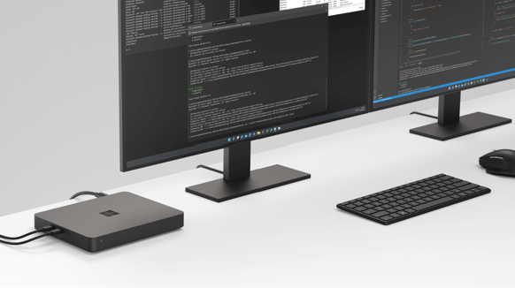

# Windows Dev Kit 2023

The Windows Dev Kit 2023 (code name “Project Volterra”) offered Windows developers one of the first opportunities to support development and testing on a device with a Neural Processing Unit (NPU) that provides best-in-class AI computing capacity, multiple ports, and a stackable design for desktops and rack deployment. This dev kit was purpose-built to develop, debug, and test native Windows apps for Arm.

Windows Dev Kit 2023 is no longer available for new purchases, but now you can find [Copilot+ PCs](https://www.microsoft.com/windows/copilot-plus-pcs) offering NPUs and the latest in AI features and computing capacity.

## Device specifics

- 32GB LPDDR4x RAM and 512GB fast NVMe storage
- Snapdragon® 8cx Gen 3 compute platform
- Ports: 3x USB-A, 2x USB-C, Mini-Display (HBR2 support), Ethernet (RJ45)
- Made with 20% recycled ocean plastic

## Device set up

When you turn on the device and connect to the Internet for the first time, follow the getting started prompts and configuration for Windows Update to ensure the latest software is running on the device.

### Identify buttons and external ports

With the device flat on the table, the three buttons on the left side of the device, from left to right, are:

- **Boot to USB button**: Hold the Power button and the Boot to USB button to boot to the USB-C thumb drive. Use this method to reimage the device with the latest [Recovery Image](https://support.microsoft.com/en-us/surface-recovery-image).
- **UEFI button**: Hold the Power button and the UEFI button to boot into the UEFI menu. *(USB-C monitor connections aren't compatible when exploring UEFI.)*
- **Power button**

All external ports are available after the device boots into Windows 11, including:

- RJ45 for ethernet
- 3 x USB-A ports
- 2 x USB-C ports
- Bluetooth & WiFi

The device supports up to three displays by using the mDP port and the two USB-C ports.

> [!NOTE]
> Unified Extensible Firmware Interface (UEFI) replaces the standard basic input/output system (BIOS) with new features including faster startup and improved security. You can use UEFI to manage the firmware features on your device.

### Set up power

The dev kit includes a 90W power supply. Attach the power supply to the back on the far left of the device.

- The device defaults into "Connected Standby Mode" when not in use. You can choose to [hibernate the device](/windows-hardware/customize/power-settings/adaptive-hibernate) by using OS controls.
- Firmware supports and controls fan control. The fan comes on as needed to manage thermal load.
- The device has no battery, so the system runs only on AC. There's no DC mode to test against.

### Set up display - How to connect monitors

For the best experience, use the **mDP port** as your main display when setting up this device.  Until the device boots into Windows, all display output defaults to the monitor connected to the mDP port.

Use the mDP port for these scenarios:

- Seeing the startup logo when turning on the device.
- Booting into the UEFI to change firmware settings.
- Installing the recovery image for the device, downloaded from the [Recovery Image page](https://support.microsoft.com/surface-recovery-image).
- BitLocker processes (such as a recovery key prompt or a pre-boot PIN).
- Any Windows OS boot (startup) activity that requires seeing something on the screen before Windows loads, like a Windows startup error or a bug-check boot loop.
- Windows Automatic Recovery.
- Booting into Windows Recovery Environment (WinRE) or Windows PE (WinPE) by using a USB boot disk.
- Taking ownership of firmware by using SEMM.

Requirements and notes for using Windows Developer Kit device display ports:

- If the only display connected to the device is USB-C and you don't use the mDP port (as noted earlier), you won't see a startup screen output when you turn on the device until Windows boots. The Windows boot process should take about 25 seconds.
- If you connect an HDMI or a DVI monitor to the mDP port, you need an active **mini-DP to HDMI** or active **mini-DP to DVI adapter**. *If the connection isn't working, you might be using a passive adapter or a cable with a passive adapter built in. Cables should be 2m/6ft or less.
- When connecting an external keyboard or mouse, use the USB-A ports, not USB-C. Using USB-C to connect a keyboard or mouse works only intermittently.

|Ports | Transmission Mode | Max Data Speed | Supported Displays (max resolution) | Comments |
|---|---|---|---|---|
|mDP| HBR2| 4 lane x 5.4 Gbps/lane | SST: 3840 x 2160 @ 60Hz, MST: (x2) 2560 x 1600 @ 60Hz | Default monitor port to boot with UEFI menu |
|USB-C (x2) | HBR3 |4 lane x 8.1 Gbps/lane | SST: 5120x2880 @ 60Hz, SST: 4096x2160 @ 60Hz, MST: (x2) 3840x2160 @ 60Hz (RB2), MST: (x2) 2560x1600 @ 60Hz (CVT, RB) | Default monitor port to boot without UEFI menu |

## Install Arm-native developer tools

You can install a fully Arm-native suite of developer tools on Windows 11, including:

- **[Visual Studio 2022 17.4 for Arm64](/visualstudio/install/visual-studio-on-arm-devices)**

    This version is the first native Arm64 version of Visual Studio. It includes workloads for desktop development with C++ (for MSBuild-based projects), .NET desktop development, web development, game development, and Node.js development. It also supports Windows SDK and Win App SDK components (Win UI).

- **[.NET 7 Arm64 SDK](https://dotnet.microsoft.com/download/dotnet/7.0)**

    Native support for Arm64 is [available starting with .NET 6](/dotnet/core/install/windows?tabs=net60#arm-based-windows-pcs), along with the [.NET Framework 4.8.1 runtime](https://devblogs.microsoft.com/dotnet/announcing-dotnet-framework-481/) and SDK. .NET 7 extends that support. Read more about [Arm64 performance improvements in .NET 7](https://devblogs.microsoft.com/dotnet/arm64-performance-improvements-in-dotnet-7/).

- **[Visual Studio Code for Arm](https://code.visualstudio.com/download)**

    VS Code has supported an Arm64 architecture since the September 2020 version 1.50 release, including [extensions for Remote Development](https://code.visualstudio.com/docs/remote/remote-overview).

Windows 11 brings together local compute on the CPU, GPU, and NPU and cloud compute with Azure, including:

- **[ONNX Runtime + Windows Dev Kit 2023 = NPU powered AI](https://onnxruntime.ai/winarm)**

    Unlock the NPU power to accelerate AI/ML workloads by using ONNX Runtime with frameworks like PyTorch or TensorFlow. Get started with these instructions and tutorials.

- **[Qualcomm developer network: Windows on Snapdragon](https://www.qualcomm.com/developer/windows-on-snapdragon#overview)**

    Learn more about the Snapdragon compute platform that powers Windows on Snapdragon® devices with native AArch64 (64-bit Arm) app support. You can also download the **Qualcomm Neural Processing SDK for Windows**. The Qualcomm® Neural Processing SDK helps developers save time and effort in optimizing performance of trained neural networks on devices with Qualcomm® AI products.

- **[QNN Execution Provider for ONNX Runtime](https://onnxruntime.ai/docs/execution-providers/QNN-ExecutionProvider.html)**

    The QNN Execution Provider for ONNX Runtime enables hardware-accelerated execution on Qualcomm chipsets. It uses the [Qualcomm AI Engine Direct SDK (QNN SDK)](https://qpm.qualcomm.com/main/tools/details/qualcomm_ai_engine_direct) to construct a QNN graph from an ONNX model. A supported accelerator backend library can execute the graph.

- **[Azure Virtual Machines with Ampere Altra Arm-based processors](https://azure.microsoft.com/blog/now-in-preview-azure-virtual-machines-with-ampere-altra-armbased-processors/)**

    These virtual machines efficiently run scale-out workloads, web servers, application servers, open-source databases, cloud-native as well as rich .NET applications, Java applications, gaming servers, media servers, and more.

Support for building Arm-native apps and porting existing x64 apps is also available, including:

- **[Arm64EC](../arm64ec.md)**

    Arm64EC ("Emulation Compatible") is a new application binary interface (ABI) that enables you to build new native apps or incrementally transition existing x64 apps. Take advantage of the native speed and performance possible with Arm-powered devices, including better power consumption, battery life, and accelerated AI & ML workloads.

- **[Arm64X](../arm64x-pe.md)**

    Arm64X is a new type of binary that can contain both the classic Arm64 code and Arm64EC code together. It's a good fit for middleware or plugins that both ABIs use.

Additional developer tools supported by Windows 11 on Arm include:

- **[Windows Subsystem for Linux](/windows/wsl)**

    Enables you to install Linux distributions on Windows without the overhead of a traditional virtual machine or dual-boot setup.

- **[Windows Terminal](/windows/terminal)**

    A modern way to run multiple command lines side-by-side in tabs or panes. It's fully customizable with a GPU-accelerated text rendering engine and command palette.

- **[Windows Package Manager](/windows/package-manager)**

    A comprehensive package manager solution that consists of a command line tool (winget) and set of services for installing applications. It chooses the best available package based on your hardware architecture.

- **[Microsoft PowerToys](/windows/powertoys)**

    A set of utilities for power users to tune and streamline their Windows experience for greater productivity, including the FancyZones window manager, a keyboard manager, mouse utilities, PowerRename, and more.

## Support

For hardware or warranty support with your Windows on Arm developer kit, open a support request on the **[Support for business](https://support.serviceshub.microsoft.com/supportforbusiness/create?sapid=616952e0-c5eb-fa95-eb62-ee5e66edb0b0)** services hub page.

## FAQs

- **How do I set up a recovery drive?**

    To create a USB recovery drive that captures the default device state, you need an empty 16 GB USB drive. (This process erases any data already stored on the drive.)

    1. In the search box on the taskbar, search for **Create a recovery drive**. After selecting it, you might be asked to enter an admin password or confirm your choice.

    1. When the tool opens, make sure **Back up system files to the recovery drive** is selected. Select **Next**.

    1. Connect a USB drive, select it, select **Next**, then select **Create**. Many files are copied to the recovery drive, so this process takes some time.

    To boot your dev kit device from a recovery drive:

    1. Connect your USB drive, then hold the Power button + the UEFI button to boot into the UEFI menu.

    1. Once in UEFI, use the external USB-A keyboard or mouse to navigate to the Boot Configuration menu.

    1. Double-click on **USB Storage** to boot to the USB key.

- **How do I update a driver to work on a Windows 11 Arm-based PC?**

    Drivers for hardware, games, and apps might only work if they're designed for a Windows 11 Arm-based PC. Check directly with the organization that developed the driver to find relevant Arm64 updates.

- **Does this device support assistive technology?**

    Windows 11 provides [built-in accessibility features](https://www.microsoft.com/Accessibility/windows) that help you do more on your device.

- **Where can I download a recovery image to reset Windows Developer Kit 2023 to the factory condition?**

    The [Recovery Image page](https://support.microsoft.com/surface-recovery-image) offers an image specifically for "Windows Dev Kit 2023". You need to enter the device serial number.

- **Are custom OS images supported?**

    No, currently custom operating system images aren't supported on Microsoft Arm devices. Only the Windows OS image provided on the device when purchased is supported. You can reinstall this image if necessary by using the downloadable recovery image on the [Recovery Image page](https://support.microsoft.com/surface-recovery-image).

- **Where can I see Windows Dev Kit?**

    While you can no longer purchase Windows Dev Kit through Microsoft Store, you can see the device demo video in the following section.

> [!VIDEO https://learn-video.azurefd.net/vod/player?show=tabs-vs-spaces&ep=windows-developer-kit-for-arm]

To learn more, see **[FAQs for Windows Arm-based PCs](https://support.microsoft.com/en-us/windows/windows-arm-based-pcs-faq-477f51df-2e3b-f68f-31b0-06f5e4f8ebb5)**.
