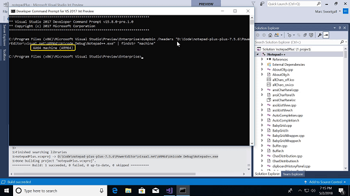
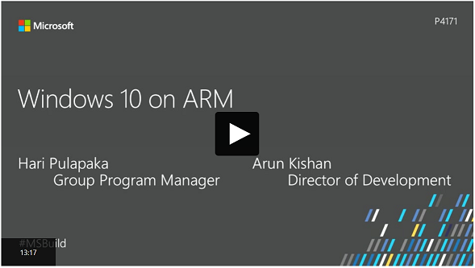
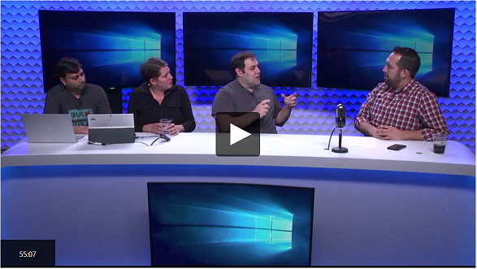

# Windows 10 on ARM
Windows 10 runs on PCs powered by ARM processors. This page provides the information for you to learn more about the platform and get started developing apps. We also encourage you to provide your feedback by using the links at the bottom of the page.

## Introductory videos
Watch and learn how Windows 10 runs on ARM.

<ul class="cols cols3">
    <li>
        
        <h3>Building ARM64 Win32 C++ Apps</h3>
Learn how to install the ARM64 tools for Visual Studio. Then we’ll walk you through the steps of creating and compiling a new ARM 64 project.

    </li>
    <li>
        
        <h3>Build 2018 Windows 10 on ARM for developers</h3>
Learn about the Windows 10 on ARM devices, how the magic of x86 emulation works, and finally how to submit and build apps for Windows 10 on ARM. We will be showing how to build ARM64 apps for desktop and UWP.

    </li>
    <li>
        
        <h3>Windows Community Standup with Kevin Gallo</h3>
Get deep understanding of how Windows 10 runs on ARM64, and get a feel for apps and experiences on this platform.

    </li>
</ul>

## Understanding Windows 10 on ARM
Get to know the platform by looking at these resources.

<ul class="cardsF panelContent cols cols2">
    <li>
        

            

                <a class="card" href="/windows/uwp/porting/apps-on-arm" title="Get started" data-linktype="absolute-path">
                    

                            
                    

                </a>
                

                    <h3>Get started with Windows 10 on ARM</h3>
                    
Check out the documentation to understand the basics.

                

            

        

    </li>
    <li>
        

            

                <a class="card" href="/windows/uwp/porting/apps-on-arm-x86-emulation" title="Topic about x86 emulation" data-linktype="absolute-path">
                    

                             
                    

                </a>
                

                    <h3>Learn how x86 emulation works</h3>
                    
Find out all about this key feature of Windows 10 on ARM.

                

            

        

    </li>
    <!--<li>
        

            

                <a class="card" href="https://blogs.msdn.microsoft.com/harip/" data-linktype="absolute-path">
                    

                            
                            </a>
                    

                </a>
                

                    <h3>Read the Kernel blog</h3>
                    
Get a deep understanding of the Windows by reading articles that are written by the creators of the kernel.

                

            

        

    </li>-->
</ul>

## Developing for Windows 10 on ARM
Start tailoring your apps to Windows 10 on ARM and take advantage of the features available there.  

<ul class="cardsF panelContent cols cols3">
    <li>
        

            

                <a class="card" href="https://blogs.windows.com/buildingapps/?p=52087" title="Building ARM64 apps" data-linktype="absolute-path">
                    

                            
                    

                    </a>
                

                    <h3>Building ARM64 apps with the SDK</h3>
                    
Check out this blog post where we walk you through compiling your apps as ARM64 to run natively on Windows 10 on ARM.

                

            

        

    </li>
    <li>
        

            

                <a class="card" href="/windows/uwp/porting/apps-on-arm-troubleshooting-arm32" title="Troubleshooting arm32 apps" data-linktype="absolute-path">
                    

                            
                    

                </a>
                

                    <h3>UWP apps on ARM</h3>
                    
Follow this guidance to set your Universal Windows Platform (UWP) apps up for success.
                    
                

            

        

    </li>
    <li>
        

            

                <a class="card" href="/windows-hardware/drivers/debugger/debugging-arm64" title="Debugging ARM64 apps" data-linktype="absolute-path">
                    

                             
                    

                </a>
                

                    <h3>Debugging on ARM</h3>
                    
Get your code running smoothly on Windows 10 on ARM.

                

            

        

    </li>
    <li>
        

            

                <a class="card" href="/windows-hardware/drivers/develop/building-arm64-drivers" title="Building ARM64 drivers" data-linktype="absolute-path">
                    

                            
                            </a>
                    

                </a>
                

                    <h3>Building ARM64 Drivers with the WDK</h3>
                    
Recompile your drivers for ARM64.

                

            

        

    </li>
    <li>
        

            

                <a class="card" href="/windows/uwp/porting/apps-on-arm-troubleshooting-x86" title="Troubleshooting x86 apps" data-linktype="absolute-path">
                    

                            
                            </a>
                    

                </a>
                

                    <h3>x86 apps on ARM</h3>
                    
Develop your x86 apps to perform their best on Windows 10 on ARM.

                

            

        

    </li>
</ul>

<!--## Other videos
<ul class="cols cols4">
<li>
        
            
TBD
    
    </li>
<li>
        
            
TBD
    
    </li>
<li>
        
            
TBD
    
    </li>
<li>
        
            
TBD
    
    </li>
</ul>-->

## Let us know if you have feedback
We are continuously improving our product by leveraging feedback from you and our existing customers. If you have an idea, are stuck on a problem, or just want to share how great your experience is, these links will help you.

<ul class="cardsM cols cols3">
<li>
        <a class="card" href="feedback-hub://?tabid=2&contextid=803" data-linktype="absolute-path">
            
            

                <h3>Use the feedback hub</h3>
                
Did we miss something? Do you have a great idea? Let us know in the Feedback Hub.

            

        </a>
    </li>
    <li>
        <a class="card" href="mailto:woafeedback@microsoft.com" data-linktype="absolute-path">
            
            

                <h3>Report a bug</h3>
                
Found a bug in our platform? Email us with the details.

            

        </a>
    </li>
    <li>
        <a class="card" href="https://github.com/MicrosoftDocs/windows-uwp" data-linktype="absolute-path">
            
            

                <h3>Give doc feedback</h3>
                
Have you found an issue with our docs? Do you want us to make something clearer? Create an issue on our docs GitHub repo.

            

        </a>
    </li>
</ul>