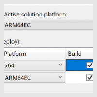

# Windows on Arm

Windows has traditionally run on machines that are powered by x86 / x64 processors, but more recently, also runs on devices powered by Arm processors.

Arm-powered devices are particularly interesting because the power-frugal nature of the Arm architecture enables these devices to offer longer battery life while delivering great performance. Arm Systems on Chip (SoC) often include other key features such as a powerful CPU, GPU, Wi-Fi & mobile data networks, as well as Neural Processor Units (NPUs) for accelerating AI workloads.

## Build Windows apps that run on Arm

Windows 10 enables existing unmodified x86 apps to run on Arm devices. Windows 11 adds the ability to run unmodified x64 Windows apps on Arm devices! This ability to run x86 & x64 apps on Arm devices gives end-users confidence that the majority of their existing apps & tools will run well even on new Arm-powered devices.

For the best performance, responsiveness, and battery life, users will want and need Arm-native Windows apps, which means that developers will need to build or port Arm-native Windows apps.

### Virtual Machines

You can create and deploy Windows 11 Arm64 VMs with Ampere Altra Arm–based processors on Azure. Learn how in this [Quickstart article](./create-arm-vm.md).

Learn more about using Windows on Arm Virtual Machines:

- [Windows on Arm Virtual Machine FAQ](./faq.yml#windows-on-arm-virtual-machine-faq)
- [Azure Virtual Machines with Ampere Altra Arm–based processors—generally available](https://azure.microsoft.com/blog/azure-virtual-machines-with-ampere-altra-arm-based-processors-generally-available/)
- [Deploy an Arm-based Azure Kubernetes Service (AKS) Cluster using Terraform - ARM Developer Hub](https://learn.arm.com/learning-paths/servers-and-cloud-computing/aks/cluster_deployment/)
- Learn more about build and test automation via Continual Integration / Continual Deployment (CI/CD) hosted in the cloud, such as [Azure DevOps](/azure/architecture/example-scenario/apps/devops-dotnet-webapp) or [GitHub](https://resources.github.com/ci-cd/).

### Arm developer devices

Developers need Arm devices upon which to build and test Arm-native Windows apps. Several Arm-powered devices are already available from Microsoft partners. These portable devices, whether a laptop form-factor device or convertible-tablet, offer great performance, battery life, and run the growing array of Arm-native developer tools.

[Windows Dev Kit 2023](./dev-kit/index.md) (code name “Project Volterra”) is the latest Arm device built to support Windows developers, AI researchers, and developers looking to integrate AI into their apps and experiences.

## Support for existing Windows apps on Arm

:::row:::
    :::column span="":::
       
    :::column-end:::
    :::column span="2":::
        Windows on Arm runs native Arm apps, as well as many unmodified x86 & x64 apps, but for the best performance and battery life, apps should be built to be Arm-native wherever possible. Windows apps can be built using many different tools and technologies, including native C/C++ Win32 apps, classic .NET Framework WinForms/WPF apps, modern .NET or MAUI apps, or even apps built using Java, Python, node, etc.
    :::column-end:::
:::row-end:::

## Find tools for Arm development

:::row:::
    :::column:::
       
    :::column-end:::
    :::column span="2":::
        Microsoft is continuously delivering Arm-native developer toolset updates to build and port apps that natively target Windows ARM-powered devices just as easily as when targeting x64. Supporting app development for Arm, on Arm.
        - **[Arm-native Visual Studio](/visualstudio/install/visual-studio-on-arm-devices)** includes **Visual C++**, **.NET & .NET Framework** and **Java** and will enable developers to natively build and debug Arm apps on Arm-based devices. Learn more:  [Arm64 Visual Studio is officially here!(Nov 2022)](https://devblogs.microsoft.com/visualstudio/arm64-visual-studio-is-officially-here/), [MSVC ARM64 Optimizations in Visual Studio 2022 17.7 (Sept 2023)](https://devblogs.microsoft.com/cppblog/msvc-arm64-optimizations-in-visual-studio-2022-17-7/).
        - **[Visual Studio Code](https://code.visualstudio.com/download)** natively supports Arm and can be installed on Arm devices. The [VS Code C++ extension](https://marketplace.visualstudio.com/items?itemName=ms-vscode.cpptools) also offers C++ IntelliSense and build support for developing Windows apps that run natively on Arm64 devices.
        - [**.NET 6+** already supports Arm](/dotnet/core/whats-new/dotnet-6#arm64-support), both for native Arm execution and x64 emulation. To develop .NET apps that run natively on Arm64 devices, we recommend installing the new Arm native Visual Studio 2022 17.4, and [.NET 8](https://dotnet.microsoft.com/en-us/download/dotnet/8.0) Arm64 SDK. Learn more about .NET 8 support for Arm and the performance improvements for Arm64 on the .NET Blog: **[Arm64 Performance Improvements in .NET 8 (Oct 2023)](https://devblogs.microsoft.com/dotnet/this-arm64-performance-in-dotnet-8)**.
        - **.NET 6 Arm64 SDK:** By default, if you `dotnet run` a .NET 6 app with the Arm64 SDK, it will run as Arm64. The `dotnet-runtimeinfo` tool can be used to discover the environment that .NET is running on. See the [.NET 6 blog announcement on Arm64 support](https://devblogs.microsoft.com/dotnet/announcing-net-6/#windows-arm64) to learn more.
        - **[VC++ toolchain (Arm Developer)](https://developer.arm.com/Tools%20and%20Software/GNU%20Toolchain)** is the GNU toolchain for Arm Architecture releases produced by Arm, enabling partners, developers and the community to use new features from recent Arm Architecture and from open-source projects GCC, Binutils, glibc, Newlib, and GDB.
        - **Java support for Arm in the OpenJDK**: [Announcing OpenJDK for Windows on ARM (June 2020)](https://devblogs.microsoft.com/java/announcing-openjdk-windows-arm/)
        - **[GitHub Actions](https://github.com/features/actions)**: GitHub Actions, GitHub's CI/CD workflow engine is an integral part of many developers’ workflows, they use this to continuously build, test, and deploy apps. GitHub Actions is now available for Windows on Arm in 2 flavors: 1. **[self-hosted runners](https://github.blog/changelog/2022-09-28-github-actions-self-hosted-runners-now-support-windows-arm-hardware/)** that can be hosted on an Arm VM or Arm device, and 2. **[GitHub hosted runners](https://github.blog/changelog/2023-10-30-accelerate-your-ci-cd-with-arm-based-hosted-runners-in-github-actions/)** (currently available in private beta, but general release is coming soon).
        - **[Docker Desktop](https://www.docker.com/products/docker-desktop/)**: Containers are a pretty popular deployment target for many reasons - a streamlined development workflow, isolation and security, efficient resource utilization, portability, and Reproducibility. Docker desktop is now runs natively on Windows on Arm.
    :::column-end:::
:::row-end:::

> [!NOTE]
> We use the term *Arm* as a shorthand for PCs that run the desktop version of Windows on Arm64 (also commonly called *AArch64*) processors.  We use the term *Arm32* here as a shorthand for the 32-bit Arm architecture (commonly called *Arm* in other documentation). PCs powered by Arm provide great application compatibility and allow you to run your existing unmodified x86 win32 applications. Arm apps run natively without any emulation, while x86 and x64 apps run under emulation on Arm devices.

## Arm64EC - Help for updating Windows apps to run on Arm

:::row:::
    :::column span="":::
       
    :::column-end:::
    :::column span="2":::
        Arm64EC (“Emulation Compatible”) enables you to incrementally build new apps, or port existing apps, to take advantage of native Arm performance where possible, while utilizing existing x64 code & libraries until fully migrated. Learn more:
        - [Using Arm64EC to build apps for Arm devices](./arm64ec.md)
        - [Understanding Arm64EC ABI and assembly code](./arm64ec-abi.md)
    :::column-end:::
:::row-end:::

## Additional tips for developing Windows apps that run on Arm devices

- We recommend using [MSIX](/windows/msix/overview/) to package your app for distribution. For more information on how MSIX supports Arm and Arm64, see [App package architectures: Arm and Arm64](/windows/msix/package/device-architecture#arm-and-arm64).

- Not all Visual Studio projects are configured to launch projects locally when you start debugging (F5) from an Arm device. You may need to configure Visual Studio for remote debugging, even though your app is running locally. For more information, see [remote debugging](/visualstudio/debugger/remote-debugging).

- To find and install the recommended packages on Visual Studio, visit the [Visual Studio downloads page](https://visualstudio.microsoft.com/downloads/).
  - For the **Remote Tools for Visual Studio 2022**, scroll below the **All downloads** section and expand the **Tools for Visual Studio 2022** drop-down menu. **Remote Tools for Visual Studio 2022** will be listed there. Be sure to check the **Arm64** radio button, then **Download**.
  - For the **Microsoft Visual C++ Redistributable**, scroll below the **All downloads** section and expand the **Other tools and Frameworks** drop-down menu. **Microsoft Visual C++ Redistributable for Visual Studio 2022** will be listed there. Be sure to check the **Arm64** radio button, then **Download**.
  - If you are using an older version of Visual Studio, select the [Older Downloads](https://visualstudio.microsoft.com/vs/older-downloads/) link at the bottom of the page to search for the downloads associated with your version of Visual Studio.

- When a user installs your app on an Arm device from the Microsoft Store, Windows 11 will automatically select the optimal version of your app that is available. If you submit x86, Arm32, and Arm64 versions of your app to the Microsoft Store, the operating system will automatically install the Arm64 version of your app. If you only submit x86 and Arm32 versions of your app, the operating system will install the Arm32 version. If you only submit the x86 version of your app, the operating system will install that version and run it under emulation.
- When given the choice of app architecture, choose the 32-bit x86 version to run the app's 32-bit version on a Windows on Arm PC. If an app's x64 Win32 version doesn't work, most apps will have an x86 version available.
- For more information about architectures, see [App package architectures](/windows/msix/package/device-architecture).

## App Assure Arm Advisory Service

While our guidance to [Add Arm support to your Windows app](add-arm-support.md) walks through how to create an Arm-optimized version of your app(s). The App Assure Arm Advisory Service is available to help if you get stuck. This service is in addition to our existing promise: your apps will run on Windows on Arm, and if you encounter any issues, Microsoft will help you remediate them. [Learn more](https://blogs.windows.com/windowsdeveloper/2023/10/16/windows-launching-arm-advisory-service-for-developers/).

[Sign up for Windows Arm Advisory Service](https://forms.office.com/Pages/ResponsePage.aspx?id=v4j5cvGGr0GRqy180BHbR0hAZezl6y5Om22d_0SBAstUOU9OSlBDQ0dBNkUwTU0ySlNZRklSMFJMViQlQCN0PWcu).

## Additional resources

- [Satya Nadella's Build 2022 keynote announcing "Project Volterra"](https://youtu.be/BmGiJDeIiY0?t=63)
- [How x86 emulation works on Arm](./apps-on-arm-x86-emulation.md)
- [Troubleshooting x86 desktop apps](./apps-on-arm-troubleshooting-x86.md)
- [Troubleshooting Arm UWP apps](./apps-on-arm-troubleshooting-arm32.md)
- [Program Compatibility Troubleshooter on Arm](./apps-on-arm-program-compat-troubleshooter.md)
- [Building Arm64 Drivers with the WDK](/windows-hardware/drivers/develop/building-arm64-drivers): Instructions for building an Arm64 driver.
- [Debugging x86 apps on Arm](/windows-hardware/drivers/debugger/debugging-arm64) | Guidance for debugging x86 apps on Arm.
- [Video: Building Arm64 Win32 C++ Apps](https://www.youtube.com/watch?v=OZtVBDeVqCE)
- [Windows 10 on Arm for developers (Microsoft Build 2018 video presentation)](/events/build-2018/brk2438)
- [Blog: Original announcement of Windows 10 support for Arm development](https://blogs.windows.com/windowsdeveloper/2018/11/15/official-support-for-windows-10-on-arm-development/)
- [Report a bug](mailto:woafeedback@microsoft.com)

## External resources

- [Developer Resources for Windows on Snapdragon by Qualcomm](https://www.qualcomm.com/developer/windows-on-snapdragon#overview)
- [Developer.arm.com: Windows on Arm](https://developer.arm.com/solutions/os/windows-on-arm)
- [Developer.arm.com: Port applications to Windows on Arm](https://developer.arm.com/documentation/102341/0400/Overview)
- [Developer.arm.com: Building a Native Windows on Arm App with WinUI 3](https://developer.arm.com/documentation/102767/0100/)
- [Developer.arm.com: Building libraries for Windows on Arm](https://developer.arm.com/documentation/102528/)
