# Create a "Hello, World!" UWP app (XAML) with .NET 9

This tutorial teaches you how to use XAML, C#, and .NET 9 with [Native AOT](/dotnet/core/deploying/native-aot/) (Ahead-of-Time) to create a simple "Hello, World!" app for the Universal Windows Platform (UWP) on Windows. With a single project in Microsoft Visual Studio, you can build an app that runs on all supported versions of Windows 10 and Windows 11.

Here you'll learn how to:

-   Create a new **UWP** project targeting .NET 9 in **Visual Studio**.
-   Write XAML to change the UI on your start page.
-   Run the project on the local desktop in Visual Studio.
-   Use a [SpeechSynthesizer](/uwp/api/windows.media.speechsynthesis.speechsynthesizer) to make the app talk when you press a button.

## Prerequisites

-   [What's a Universal Windows app?](universal-application-platform-guide.md)
-   [Download Visual Studio (and Windows)](https://developer.microsoft.com/windows/downloads). If you need a hand, learn how to [get set up](/windows/apps/get-started/get-set-up).
-   We also assume you're using the default window layout in Visual Studio. If you change the default layout, you can reset it in the **Window** menu by using the **Reset Window Layout** command.

> [!NOTE]
> This tutorial is using Visual Studio 2022. If you are using a different version of Visual Studio, it may look a little different for you.

## Step 1: Create a new project in Visual Studio

1. Launch Visual Studio.

1. From the **File** menu, select **New > Project** to open the *New Project* dialog.

1. Filter the list of available templates by choosing **C#** from the **Languages** dropdown list and **UWP** from the **Project types** dropdown list to see the list of available UWP project templates for C# developers.

   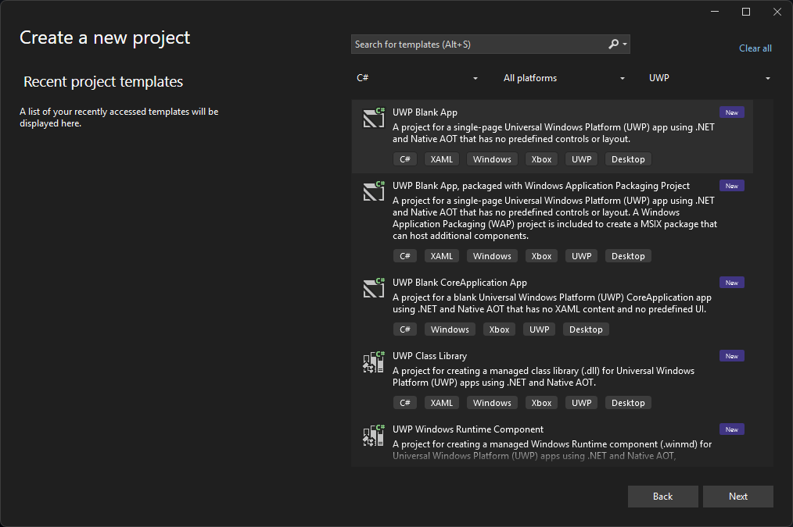

   (If you don't see any UWP templates, you might be missing the components for creating UWP apps. You can repeat the installation process and add UWP support by opening the **Visual Studio Installer** from your Windows Start menu. See [Set up Visual Studio for UWP development](./winui2/getting-started.md#set-up-visual-studio-for-uwp-development) for more information.)

1. Choose the **UWP Blank App** template.

   > [!IMPORTANT]
   > Make sure to select the **UWP Blank App** template. If you select the **UWP Blank App (.NET Native)** template, it will target the .NET Native runtime, not .NET 9. Apps targeting .NET Native do not have access to the latest .NET and C# features or security and performance improvements. For more information about the differences between the two project types, see [Modernize your UWP app with preview UWP support for .NET 9 and Native AOT](https://devblogs.microsoft.com/ifdef-windows/preview-uwp-support-for-dotnet-9-native-aot/).

1. Select **Next**, and enter "HelloWorld" as the **Project name**. Select **Create**.

   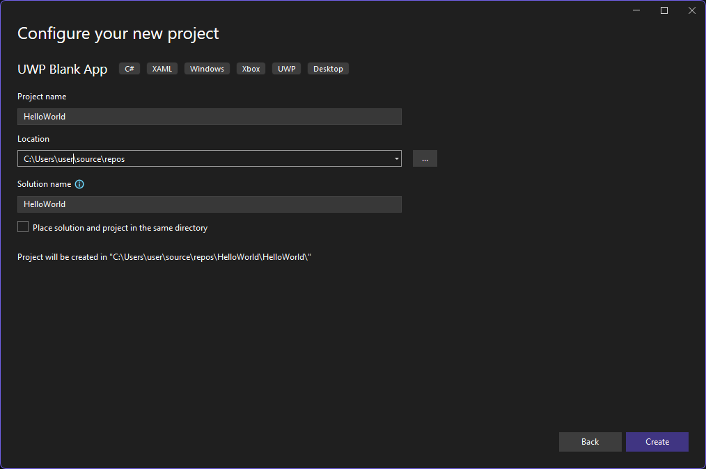

   > [!NOTE]
   > If this is the first time you have used Visual Studio, you might see a Settings dialog asking you to enable **Developer mode**. Developer mode is a special setting that enables certain features, such as permission to run apps directly, rather than only from the Store. For more information, please read [Enable your device for development](/windows/apps/get-started/enable-your-device-for-development). To continue with this guide, select **Developer mode**, click **Yes**, and close the dialog.
   >
   > 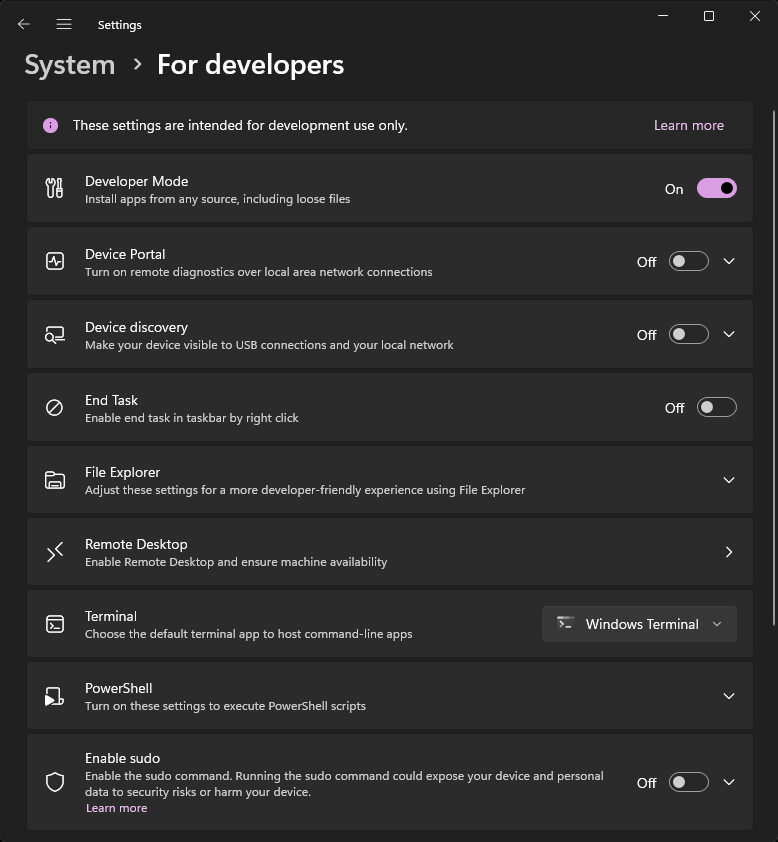
   >

1. The Target version/Minimum version dialog appears. The default settings are fine for this tutorial, so select **OK** to create the project.

   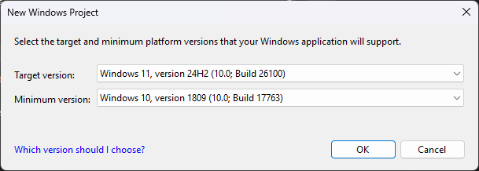

1. When your new project opens, its files are displayed in the **Solution Explorer** pane on the right. You may need to choose the **Solution Explorer** tab instead of the **Properties** or **GitHub Copilot Chat** tabs to see your files.

   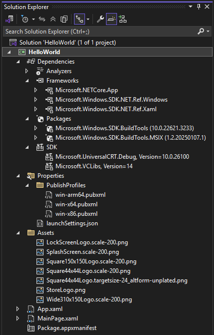

Although the **UWP Blank App** is a minimal template, it still contains a lot of files. These files are essential to all UWP apps using C#. Every UWP project that you create in Visual Studio contains them.

### What's in the files?

To view and edit a file in your project, double-click the file in the **Solution Explorer**. Expand a XAML file just like a folder to see its associated code file. XAML files open in a split view that shows both the design surface and the XAML editor.

> [!NOTE]
> What is XAML? Extensible Application Markup Language (XAML) is the language used to define your app's user interface. It can be entered manually, or created using the Visual Studio design tools. A .xaml file has a .xaml.cs code-behind file which contains the logic. Together, the XAML and code-behind make a complete class. For more information, see [XAML overview](../xaml-platform/xaml-overview.md).

*App.xaml and App.xaml.cs*

- App.xaml is the file where you declare resources that are used across the app.
- App.xaml.cs is the code-behind file for App.xaml. Like all code-behind pages, it contains a constructor that calls the `InitializeComponent` method. You don't write the `InitializeComponent` method. It's generated by Visual Studio, and its main purpose is to initialize the elements declared in the XAML file.
- App.xaml.cs is the entry point for your app.
- App.xaml.cs also contains methods to handle [activation](../launch-resume/activate-an-app.md) and [suspension](../launch-resume/suspend-an-app.md) of the app.

*MainPage.xaml*

- MainPage.xaml is where you define the UI for your app. You can add elements directly using XAML markup, or you can use the design tools provided by Visual Studio.
- MainPage.xaml.cs is the code-behind page for MainPage.xaml. It's where you add your app logic and event handlers.
- Together these two files define a new class called `MainPage`, which inherits from [Page](/uwp/api/Windows.UI.Xaml.Controls.Page), in the `HelloWorld` namespace.

*Package.appxmanifest*

- A manifest file that describes your app: its name, description, tile, start page, etc.
- Includes a list of dependencies, resources and files that your app contains.

*A set of logo images*

- Assets/Square150x150Logo.scale-200.png and Wide310x150Logo.scale-200.png represent your app (either Medium or Wide size) in the start menu.
- Assets/Square44x44Logo.png represents your app in the app list of the start menu, task bar and task manager.
- Assets/StoreLogo.png represents your app in the Microsoft Store.
- Assets/SplashScreen.scale-200.png is the splash screen that appears when your app starts.
- Assets/LockScreenLogo.scale-200.png can be used to represent the app on the lock screen, when the system is locked.

## Step 2: Add a button

### Using the designer view

Let's add a button to our page. In this tutorial, you work with just a few of the files listed previously: App.xaml, MainPage.xaml, and MainPage.xaml.cs.

1. Double-click on **MainPage.xaml** to open it in the XAML editor.

   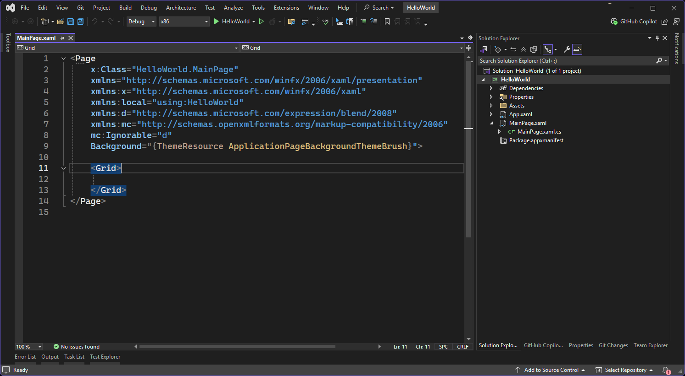

   > [!NOTE]
   > You won't see a design view when working with the **UWP Blank App** template that uses .NET 9. If you want to work with a UWP project with a XAML design view, you can use the **UWP Blank App (.NET Native)** template instead. As previously noted, the **UWP Blank App (.NET Native)** template is a little different from the **UWP Blank App** template, but it has the same basic structure. The main difference is that the **UWP Blank App (.NET Native)** template uses .NET Native to compile your app. See [Modernize your UWP app with preview UWP support for .NET 9 and Native AOT](https://devblogs.microsoft.com/ifdef-windows/preview-uwp-support-for-dotnet-9-native-aot/) for information about the advantages of using the new .NET 9 template.

1. Add the following XAML code to the `<Grid>` element in MainPage.xaml. You can type it in, or copy and paste it from here:

   ```XAML
   <Button x:Name="button" Content="Button" HorizontalAlignment="Left" Margin = "152,293,0,0" VerticalAlignment="Top"/>
   ```

1. At this point, you've created a very simple app. This is a good time to build, deploy, and launch your app and see what it looks like. You can debug your app on the local machine, in a simulator or emulator, or on a remote device. Here's the target device menu in Visual Studio:

   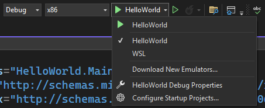

   By default, the app runs on the local machine. The target device menu provides several options for debugging your app on devices from the desktop device family.

   - **HelloWorld** (this runs it on the local machine)
   - **WSL**
   - **Download new emulators...**

1. Run the app to see the button in action. To start debugging on the local machine, you can run the app by selecting the **Debug | Start Debugging** item in the menu, by clicking the start debugging button in the toolbar (with the **HelloWorld** label), or by pressing F5.

   The app opens in a window, and a default splash screen appears first. The splash screen is defined by an image (SplashScreen.png) and a background color (specified in your app's manifest file).

   The splash screen disappears, and then your app appears. It looks like this:

   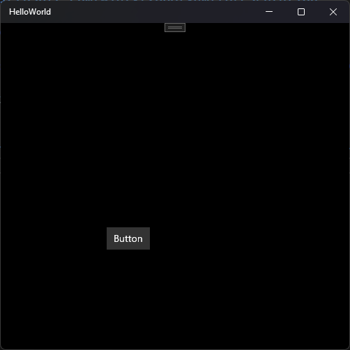

1. Press the Windows key to open the **Start** menu, then select **All** to show all apps. Notice that deploying the app locally adds it to the list of programs in the **Start** menu. To run the app again later (not in debugging mode), you can select it in the **Start** menu.

   It doesn't do much—yet—but congratulations, you've built and deployed your first UWP app to your local machine!

1. To stop debugging:

   Click the **Stop Debugging** button (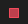) in the toolbar.

   –or–

   From the **Debug** menu, click **Stop debugging**.

   –or–

   Close the app window.

1. Change the button's text by changing the `Content` value from `Button` to `Hello, world!`.

   ```XAML
   <Button x:Name="button" Content="Hello, world!" HorizontalAlignment="Left" Margin = "152,293,0,0" VerticalAlignment="Top"/>
   ```

   If you run the app again, the button updates to display the new text.

## Step 3: Event handlers

An "event handler" sounds complicated, but it's just another name for the code that is called when an event happens (such as the user clicking on your button).

1. Stop the app from running, if you haven't already.

1. Start typing `Click` in the XAML editor, and Visual Studio will show you a list of possible events. Select **Click** from the list.

   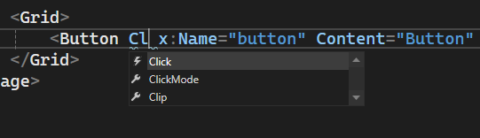

1. Next, select `<New Event Handler>` from the list. This creates a new event handler method in the code-behind file (MainPage.xaml.cs) and adds the `Click` event to the button element in your XAML code.

   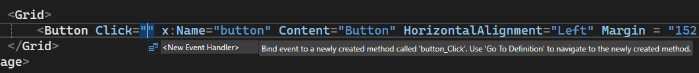

   The XAML editor automatically adds the `Click` event to the button element in your XAML code:

   ```XAML
   <Button x:Name="button" Content="Hello, world!" HorizontalAlignment="Left" Margin = "152,293,0,0" VerticalAlignment="Top" Click="button_Click"/>
   ```

   This also adds an event handler to the code-behind file (MainPage.xaml.cs). The event handler is a method that will be called when the button is clicked. The name of the method is `button_Click`, and it has two parameters: `object sender` and `RoutedEventArgs e`.

   ```cs
   private void button_Click(object sender, Windows.UI.Xaml.RoutedEventArgs e)
   {

   }
   ```

   The `Click` event is a standard event for buttons. When the user clicks the button, the `button_Click` method is called.

1. Edit the event handler code in *MainPage.xaml.cs*, the code-behind page. This is where things get interesting. Let's change it, so it looks like this:

   ```cs
   private async void button_Click(object sender, Windows.UI.Xaml.RoutedEventArgs e)
   {
       var mediaElement = new MediaElement();
       var synth = new Windows.Media.SpeechSynthesis.SpeechSynthesizer();
       Windows.Media.SpeechSynthesis.SpeechSynthesisStream stream = await synth.SynthesizeTextToStreamAsync("Hello, World!");
       mediaElement.SetSource(stream, stream.ContentType);
       mediaElement.Play();
   }
   ```

   Make sure the method signature now includes the **async** keyword, or you'll get an error when you try to run the app.

### What did we just do?

This code uses some Windows APIs to create a speech synthesis object, and then gives it some text to say. (For more information on using **SpeechSynthesis**, see the [SpeechSynthesis namespace](/uwp/api/windows.media.speechsynthesis) in the Windows Runtime (WinRT) API documentation.)

When you run the app and click on the button, your computer (or phone) will literally say "Hello, World!".

## Summary

Congratulations, you've created your first UWP app for Windows with .NET 9!

To learn how to use XAML for laying out the controls your app will use, try the [grid tutorial](/windows/apps/design/layout/grid-tutorial), or jump straight to [next steps](create-uwp-apps.md)?

## Related content

- [Publishing your UWP app](/windows/apps/publish/index).
- [How-to articles on developing UWP apps](../develop/index.md)
- [Code Samples for UWP developers](https://developer.microsoft.com/windows/samples)
