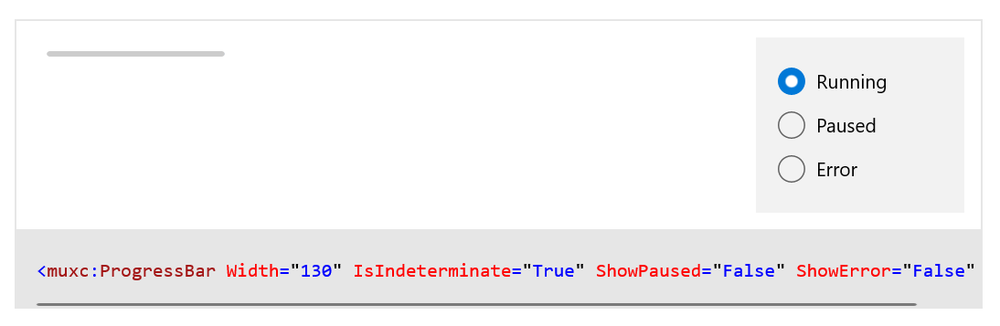
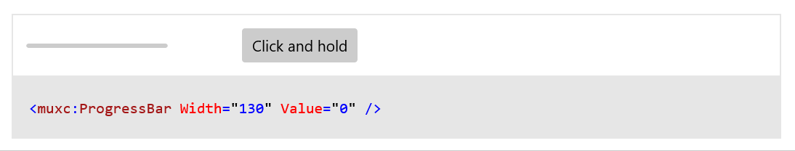
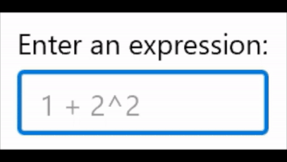
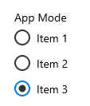

# WinUI 2.3

WinUI 2.3 is the January 2020 release of WinUI.

WinUI is hosted on [GitHub](https://github.com/microsoft/microsoft-ui-xaml) where we encourage you to file bug reports.

WinUI Releases: [GitHub release page](https://github.com/microsoft/microsoft-ui-xaml/releases)

WinUI packages can be added to Visual Studio projects through the NuGet package manager. For more information, see [Get Started with WinUI 2 for UWP](../getting-started.md).

NuGet package download: [Microsoft.UI.Xaml](https://www.nuget.org/packages/Microsoft.UI.Xaml)

## New Features

### Progress Bar Visual Refresh

The **ProgressBar** has two different visual representations.

#### Indeterminate Progress Bar

Shows that a task is ongoing, but doesn't block user interaction.

#### Determinate Progress Bar

Shows how much progress has been made on a known amount of work.

Doc and sample link: [Progress controls](/windows/apps/design/controls/progress-controls)

### NumberBox

A **NumberBox** represents a control that can be used to display and edit numbers. This supports validation, increment stepping, and computing inline calculations of basic equations, such as multiplication, division, addition, and subtraction.

Doc and sample link: [Number box](/windows/apps/design/controls/number-box)

### RadioButtons

**RadioButtons** is a new container control that enables you to create related groups of RadioButton elements easily, while also correctly supporting keyboarding and narrator/screen reader functionality

Doc and sample link: [Radio buttons](/windows/apps/design/controls/radio-button)

## Examples

> [!TIP]
> For more info, design guidance, and code examples, see [Design for Windows apps](/windows/apps/design/).
>
> The **WinUI 2 Gallery** app includes interactive examples of most WinUI 2 controls, features, and functionality.
>
> If the gallery app is installed already, click [**WinUI 2 Gallery**](winui2gallery:) to open it.
>
> If it's not installed, download the [**WinUI 2 Gallery**](https://apps.microsoft.com/detail/9MSVH128X2ZT) from the Microsoft Store.
>
> You can also get the source code from [GitHub](https://github.com/Microsoft/WinUI-Gallery) (select the *winui2* branch).

## Documentation

How-to articles for WinUI controls are included with the [Controls for Windows apps](/windows/apps/design/controls/) documentation.

API reference docs are located here: [WinUI APIs](/windows/winui/api/).
