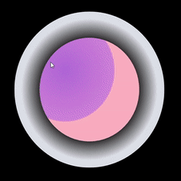

# WinUI 2.4

WinUI 2.4 is the May 2020 release of WinUI.

WinUI is hosted on [GitHub](https://github.com/microsoft/microsoft-ui-xaml) where we encourage you to file bug reports.

WinUI Releases: [GitHub release page](https://github.com/microsoft/microsoft-ui-xaml/releases)

WinUI packages can be added to Visual Studio projects through the NuGet package manager. For more information, see [Get Started with WinUI 2 for UWP](../getting-started.md).

NuGet package download: [Microsoft.UI.Xaml](https://www.nuget.org/packages/Microsoft.UI.Xaml)

## New Features

### RadialGradientBrush

A RadialGradientBrush is drawn within an ellipse defined by Center, RadiusX, and RadiusY properties. Colors for the gradient start at the center of the ellipse and end at the radius.

 
*Radial gradient brush*

[Usage guidelines](/windows/apps/develop/platform/xaml/brushes#radial-gradient-brushes)

[API reference](/windows/winui/api/microsoft.ui.xaml.media.radialgradientbrush)

### ProgressRing

The ProgressRing control is used for modal interactions where the user is blocked until the ProgressRing disappears. Use this control if an operation requires that most interaction with the app be suspended until the operation is complete.

 
*ProgressRing control*

[Usage guidelines](/windows/apps/design/controls/progress-controls)

[API reference](/windows/winui/api/microsoft.ui.xaml.controls.progressring)

### TabView updates

The TabView control updates provide you with more control over how to render tabs.

You can set the width of unselected tabs and show just an icon to save screen space:

 
*TabView control tab sizes*

You can also hide the close button on unselected tabs until the user hovers over the tab (in previous versions it was always shown):

 
*TabView control hover to close*

[Usage guidelines](/windows/apps/design/controls/tab-view)

[API reference](/windows/winui/api/microsoft.ui.xaml.controls.tabview)

### Dark theme updates to TextBox family of controls

When dark theme is enabled, the background color of TextBox family controls remains dark by default on text insertion (in previous versions, the background color changes to white during text insertion).

| Before | After |
| - | - |
|  *TextBox dark theme updates (before)* |  *TextBox dark theme updates (after)* |
|  *TextBox dark theme updates (before)* |  *TextBox dark theme updates (after)* |

The following are some of the controls included in the TextBox family of controls:

- [TextBox](/uwp/api/windows.ui.xaml.controls.textbox)
- [RichEditBox](/uwp/api/windows.ui.xaml.controls.richtextblock)
- [PasswordBox](/uwp/api/windows.ui.xaml.controls.passwordbox)
- [Editable ComboBox](/uwp/api/windows.ui.xaml.controls.combobox)
- [AutoSuggestBox](/uwp/api/windows.ui.xaml.controls.autosuggestbox)

### Hierarchical navigation

The [NavigationView](/windows/winui/api/microsoft.ui.xaml.controls.navigationview) control now supports hierarchical navigation and includes Left, Top, and LeftCompact display modes. A hierarchical NavigationView is useful for displaying categories of pages, identifying pages with related child-pages, or using within apps that have hub-style pages linking to many other pages.

 *Hierarchical NavigationView control*

[Usage guidelines](/windows/apps/design/controls/navigationview#hierarchical-navigation)

[API reference](/windows/winui/api/microsoft.ui.xaml.controls.navigationview)

## Samples

> [!TIP]
> For more info, design guidance, and code examples, see [Design for Windows apps](/windows/apps/design/).
>
> The **WinUI 2 Gallery** app includes interactive examples of most WinUI 2 controls, features, and functionality.
>
> If the gallery app is installed already, click [**WinUI 2 Gallery**](winui2gallery:) to open it.
>
> If it's not installed, download the [**WinUI 2 Gallery**](https://apps.microsoft.com/detail/9MSVH128X2ZT) from the Microsoft Store.
>
> You can also get the source code from [GitHub](https://github.com/Microsoft/WinUI-Gallery) (select the *winui2* branch).
