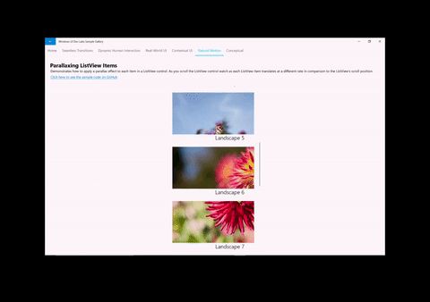
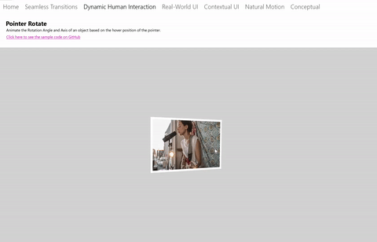
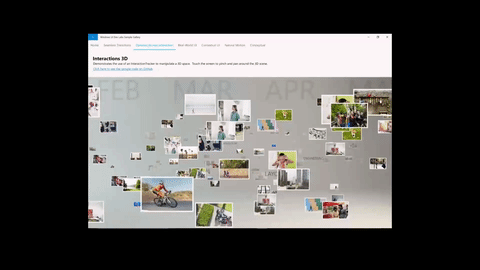

# Input-driven animations

This article provides an introduction to the InputAnimation API, and recommends how to use these types of animations in your UI.

## Prerequisites

Here, we assume that you're familiar with the concepts discussed in these articles:

- [Relation based animations](relation-animations.md)

## Smooth motion driven from user interactions

In the Fluent Design language, interaction between end users and apps is of the utmost importance. Apps not only have to look the part, but also respond naturally and dynamically to the users that interact with them. This means when a finger is placed on the screen, the UI should gracefully react to changing degrees of input; scrolling should feel smooth, and stick to a finger panning across the screen.

Building UI that dynamically and fluidly responds to user input results in higher user engagement - Motion now not only looks good, but feels good and natural when users interact with your different UI experiences. This enables end users to more easily connect with your application, making the experience more memorable and delightful.

## Expanding past just touch

Although touch is one of the more common interfaces end users use to manipulate UI content, they will also use various other input modalities such mouse and pen. In these cases, it is important that end users perceive that your UI responds dynamically to their input, regardless of what input modality they choose to use. You should be cognizant of the different input modalities when designing input-driven motion experiences.

## Different Input-Driven Motion Experiences

The InputAnimation space provides several different experiences for you to create dynamically responding motion. Like the rest of the Windows UI Animation system, these input-driven animations operate on an independent thread, which helps contribute to the dynamic motion experience. However, in some cases where the experience leverages existing XAML controls and components, parts of those experiences are still UI thread bound.

There are three core experiences that you create when building dynamic input-driven motion animations:

1. Enhancing Existing ScrollView Experiences – enable the position of a XAML ScrollViewer to drive dynamic animation experiences.
1. Pointer Position-driven Experiences – utilize the position of a cursor on a hit tested UIElement to drive dynamic animation experiences.
1. Custom Manipulation experiences with InteractionTracker – create a fully customized, off-thread manipulation experiences with InteractionTracker (such as a scrolling/zooming canvas).

## Enhancing Existing ScrollViewer Experiences

One of the common ways to create more dynamic experiences is to build on top of an existing XAML ScrollViewer control. In these situations, you leverage the scroll position of a ScrollViewer to create additional UI components that make a simple scrolling experience more dynamic. Some examples include Sticky/Shy Headers and Parallax.

When creating these types of experiences, there is a general formula to follow:

1. Access the ScrollManipulationPropertySet off of the XAML ScrollViewer you wish to drive an animation.
    - Done via the ElementCompositionPreview.GetScrollViewerManipulationPropertySet(UIElement element) API
    - Returns a CompositionPropertySet containing a property called **Translation**
1. Create a Composition ExpressionAnimation with an equation that references the Translation property.
1. Start the animation on a CompositionObject’s property.

For more info on building these experiences, see [Enhance existing ScrollViewer experiences](scroll-input-animations.md).

## Pointer Position-driven experiences

Another common dynamic experience involving input is to drive an animation based on the position of a pointer such as a Mouse cursor. In these situations, developers leverage the location of a cursor when hit tested within a XAML UIElement that makes experiences like Spotlight Reveal possible to create.

When creating these types of experiences, there is a general formula to follow:

1. Access the PointerPositionPropertySet off a XAML UIElement that you wish to know the cursor position when hit tested.
    - Done via the ElementCompositionPreview.GetPointerPositionPropertySet(UIElement element) API
    - Returns a CompositionPropertySet containing a property called **Position**
1. Create a CompositionExpressionAnimation with an equation that references the Position property.
1. Start the animation on a CompositionObject’s property.

## Custom manipulation experiences with InteractionTracker

One of the challenges with utilizing a XAML ScrollViewer is that it is bound to the UI thread. As a result, the scrolling and zooming experience can often lag and jitter if the UI thread becomes busy and results in an unappealing experience. In addition, it is not possible to customize many aspects of the ScrollViewer experience. InteractionTracker was created to solve both issues by providing a set of building blocks to create custom manipulation experiences that are run on an independent thread.

When creating experiences with InteractionTracker, there is a general formula to follow:

1. Create your InteractionTracker object and define its properties.
1. Create VisualInteractionSources for any CompositionVisual that should capture input for InteractionTracker to consume.
1. Create a Composition ExpressionAnimation with an equation that references the Position property of InteractionTracker.
1. Start the animation on a Composition Visual’s property that you wish to be driven by InteractionTracker.
