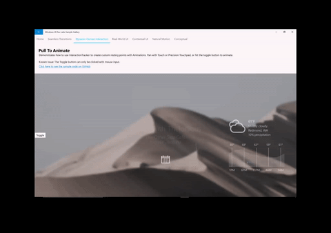

# Custom manipulation experiences with InteractionTracker

In this article, we show how to use InteractionTracker to create custom manipulation experiences.

## Prerequisites

Here, we assume that you're familiar with the concepts discussed in these articles:

- [Input-driven animations](input-driven-animations.md)
- [Relation based animations](relation-animations.md)

## Why create custom manipulation experiences?

In most cases, utilizing the pre-built manipulation controls are good enough to create UI experiences. But what if you wanted to differentiate from the common controls? What if you wanted to create a specific experience driven by input or have a UI where a traditional manipulation motion is not sufficient? This is where creating custom experiences comes in. They enable app developers and designers to be more creative – bring to life motion experiences that better exemplify their branding and custom design language. From the ground up, you are given access to the right set of building blocks to completely customize a manipulation experience – from how motion should respond with the finger on and off the screen to snap points and input chaining.

Below are some common examples of when you’d create a custom manipulation experience:

- Adding a custom swipe, delete/dismiss behavior
- Input driven effects (panning causes content to blur)
- Custom Controls with tailored manipulation motions (custom ListView, ScrollViewer, etc.)




## Why use InteractionTracker?

InteractionTracker was introduced to the Windows.UI.Composition.Interactions namespace in the 10586 SDK version. InteractionTracker enables:

- **Complete Flexibility** – we want you to be able to customize and tailor every aspect of a manipulation experience; specifically, the exact motions that occur during, or in response to, input. When building a custom manipulation experience with InteractionTracker, all the knobs you need are at your disposal.
- **Smooth Performance** – one of the challenges with manipulation experiences is that their performance is dependent on the UI thread. This can negatively impact any manipulation experience when the UI is busy. InteractionTracker was built to utilize the new Animation engine that operates on an independent thread at 60 FPS,resulting in smooth motion.

## Overview: InteractionTracker

When creating custom manipulation experiences, there are two primary components you interact with. We’ll discuss these first:

- [InteractionTracker](/uwp/api/windows.ui.composition.interactions.interactiontracker) – the core object maintaining a state machine whose properties are driven by active user input or direct updates and animations. It is intended to then tie to a CompositionAnimation to create the custom manipulation motion.
- [VisualInteractionSource](/uwp/api/windows.ui.composition.interactions.visualinteractionsource) – a complement object that defines when and under what conditions input gets sent to InteractionTracker. It defines both the CompositionVisual used for Hit-testing as well as other input configuration properties.

As a state machine, properties of InteractionTracker can be driven by any of the following:

- Direct User Interaction – the end user is directly manipulating within the VisualInteractionSource hit-test region
- Inertia – either from programmatic velocity or a user gesture, properties of InteractionTracker animate under an inertia curve
- CustomAnimation – a custom animation directly targeting a property of InteractionTracker

### InteractionTracker State Machine

As mentioned previously, InteractionTracker is a state machine with 4 states – each of which can transition to any of the other four states. (For more info about how InteractionTracker transitions between these states, see the [InteractionTracker](/uwp/api/windows.ui.composition.interactions.interactiontracker) class documentation.)

| State | Description |
|-------|-------------|
| Idle | No active, driving inputs or animations |
| Interacting | Active user input detected |
| Inertia | Active motion resulting from active input or programmatic velocity |
| CustomAnimation | Active motion resulting from a custom animation |

In each of the cases where the state of InteractionTracker changes, an event (or callback) is generated that you can listen for. In order for you to listen for these events, they must implement the [IInteractionTrackerOwner](/uwp/api/windows.ui.composition.interactions.iinteractiontrackerowner) interface and create their InteractionTracker object with the CreateWithOwner method. The following diagram also outlines when the different events get triggered.


## Using the VisualInteractionSource

For InteractionTracker to be driven by Input, you need to connect a VisualInteractionSource (VIS) to it. The VIS is created as a complement object using a CompositionVisual to define:

1. The hit-test region that input will be tracked, and the coordinate space gestures are detected in
1. The configurations of input that will get detected and routed, a few include:
    - Detectable gestures: Position X and Y (horizontal and vertical panning), Scale (pinch)
    - Inertia
    - Rails & Chaining
    - Redirection Modes: what input data is redirected automatically to InteractionTracker

> [!NOTE]
> Because the VisualInteractionSource is created based off the hit-test position and coordinate space of a Visual, it recommended not to use a Visual that will be in motion or changing position.

> [!NOTE]
> You can use multiple VisualInteractionSource instances with the same InteractionTracker if there are multiple hit-test regions. However, the most common case is to use only one VIS.

The VisualInteractionSource is also responsible for managing when input data from different modalities (touch, PTP, Pen) get routed to InteractionTracker. This behavior is defined by the ManipulationRedirectionMode property. By default, all Pointer input is sent to the UI thread and Precision Touchpad input goes to the VisualInteractionSource and InteractionTracker.

Thus, if you want to have Touch and Pen (Creators Update) to drive a manipulation through a VisualInteractionSource and InteractionTracker, you must call the VisualInteractionSource.TryRedirectForManipulation method. In the short snippet below from a XAML app, the method is called when a touch pressed event occurs at the top most UIElement Grid:

```csharp
private void root_PointerPressed(object sender, PointerRoutedEventArgs e)
{
    if (e.Pointer.PointerDeviceType == Windows.Devices.Input.PointerDeviceType.Touch)
    {
        _source.TryRedirectForManipulation(e.GetCurrentPoint(root));
    }
}
```

## Tie-in with ExpressionAnimations

When utilizing InteractionTracker to drive a manipulation experience, you interact primarily with the Scale and Position properties. Like other CompositionObject properties, these properties can be both the target and referenced in a CompositionAnimation, most commonly ExpressionAnimations.

To use InteractionTracker within an Expression, reference the tracker’s Position (or Scale) property like in the example below. As the property of InteractionTracker is modified due to any of the conditions described earlier, the output of the Expression changes as well.

```csharp
// With Strings
var opacityExp = _compositor.CreateExpressionAnimation("-tracker.Position");
opacityExp.SetReferenceParameter("tracker", _tracker);

// With ExpressionBuilder
var opacityExp = -_tracker.GetReference().Position;
```

> [!NOTE]
> When referencing InteractionTracker’s position in an Expression, you must negate the value for the resulting Expression to move in the correct direction. This is because InteractionTracker’s progression from origin on a graph and allow you to think about InteractionTracker’s progression in "real world" coordinates, such as distance from its origin.

## Get Started

To get started with using InteractionTracker to create custom manipulation experiences:

1. Create your InteractionTracker object using InteractionTracker.Create or InteractionTracker.CreateWithOwner.
    - (If you use CreateWithOwner, ensure you implement the IInteractionTrackerOwner interface.)
1. Set the Min and Max position of your newly created InteractionTracker.
1. Create your VisualInteractionSource with a CompositionVisual.
    - Ensure the visual you pass in has a non-zero size. Otherwise, it will not get hit-tested correctly.
1. Set the properties of the VisualInteractionSource.
    - VisualInteractionSourceRedirectionMode
    - PositionXSourceMode, PositionYSourceMode, ScaleSourceMode
    - Rails & Chaining
1. Add the VisualInteractionSource to InteractionTracker using InteractionTracker.InteractionSources.Add.
1. Setup TryRedirectForManipulation for when Touch and Pen input is detected.
    - For XAML, this is typically done on the UIElement’s PointerPressed event.
1. Create an ExpressionAnimation that references InteractionTracker’s position and target a CompositionObject’s property.

Here is a short code snippet that shows #1 – 5 in action:

```csharp
private void InteractionTrackerSetup(Compositor compositor, Visual hitTestRoot)
{ 
    // #1 Create InteractionTracker object
    var tracker = InteractionTracker.Create(compositor);

    // #2 Set Min and Max positions
    tracker.MinPosition = new Vector3(-1000f);
    tracker.MaxPosition = new Vector3(1000f);

    // #3 Setup the VisualInteractionSource
    var source = VisualInteractionSource.Create(hitTestRoot);

    // #4 Set the properties for the VisualInteractionSource
    source.ManipulationRedirectionMode =
        VisualInteractionSourceRedirectionMode.CapableTouchpadOnly;
    source.PositionXSourceMode = InteractionSourceMode.EnabledWithInertia;
    source.PositionYSourceMode = InteractionSourceMode.EnabledWithInertia;

    // #5 Add the VisualInteractionSource to InteractionTracker
    tracker.InteractionSources.Add(source);
}
```

For more advanced usages of InteractionTracker, see the following articles:

- [Create snap points with InertiaModifiers](inertia-modifiers.md)
- [Pull-to-refresh with SourceModifiers](source-modifiers.md)