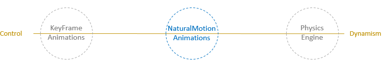

# Natural motion animations

This article provides a brief overview of the NaturalMotionAnimation space and how to conceptually think about using these types of animations in your UI.

## Making motion feel familiar and natural

Great apps are ones that create experiences that capture and retain user attention, and help guide users through tasks. Motion is the key differentiating factor that separates a User Interface from a User Experience – eliciting a connection between users and the application they are interacting with. The better the connection, the higher engagement and satisfaction from end users.

One way motion can help build this connection is by creating experiences that look and feel familiar to users. Users have an unconscious expectation for how they perceive motion that is based on real life experiences. We see how objects slide across the floor, fall off the table, bounce into one another and oscillate with a spring. Motion that leverages this expectation by being based on real-world physics looks and feels more natural in our eyes. The motion becomes more natural and interactive, but more importantly, the entire experience becomes more memorable and delightful.


The net result is higher user engagement and retention with the app.

## Balancing Control and Dynamism

In traditional UI, [KeyFrameAnimation](/uwp/api/windows.ui.composition.keyframeanimation)s are the predominant way to describe motion. KeyFrames provided the utmost control to designers and developers to define the start, end, and interpolation. Although this is very useful in many cases, KeyFrame Animations are not very dynamic; the motion is not adaptive and looks the same under any condition.

On the other end of the spectrum, there are simulations often seen in gaming and physics engines. These experiences often are the most life-like and dynamic that users interact with – creating that sense of ambiance and randomness that users see every day. Although this makes motion feel more alive and dynamic, designers and developers have less control, therefore making it more difficult to integrate into traditional UI.



[NaturalMotionAnimation](/uwp/api/windows.ui.composition.naturalmotionanimation)s exist to help bridge this divide – enabling a balance of control for the important elements of an animation like start/finish, but maintaining motion that looks and feels natural and dynamic.

> [!NOTE]
> NaturalMotionAnimations are not meant as a replacement for KeyFrame Animations – there are still places in the Fluent design language where KeyFrames are recommended. NaturalMotionAnimations are meant to be used in places where motion is required but KeyFrame Animations are not dynamic enough.

## Using NaturalMotionAnimations

Starting with the Fall Creators Update, you have access to a new motion experience: **spring animations**. See [Spring animations](spring-animations.md) for a more in depth walkthrough of springs.

This motion type is achieved by using the new NaturalMotionAnimation – a new animation type centered on enabling developers to build more familiar and natural feeling motion into their UI, with a balance of control and dynamism. They expose the following capabilities:

- Define the start and end values.
- Define InitialVelocity and tie to input with InteractionTracker.
- Define motion specific properties (such as DampingRatio for springs.)

General Formula to get started:

1. Create the NaturalMotionAnimation off the Compositor using one of the **Create** methods.
1. Define the properties of the animation.
1. Pass the NaturalMotionAnimation as a parameter to the StartAnimation call off of a CompositionObject.
    - Or set to the Motion property of an InteractionTracker InertiaModifier.

A basic example using a spring NaturalMotionAnimation to make a Visual "spring" to a new X Offset location:

```csharp
_springAnimation = _compositor.CreateSpringScalarAnimation();
_springAnimation.Period = TimeSpan.FromSeconds(0.07);
_springAnimation.DelayTime = TimeSpan.FromSeconds(1);
_springAnimation.EndPoint = 500f;
sectionNav.StartAnimation("Offset.X", _springAnimation);
```