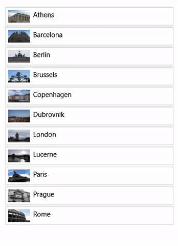
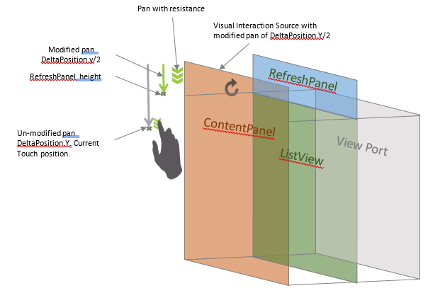

# Pull-to-refresh with source modifiers

In this article, we take a deeper dive into how to use an InteractionTracker’s SourceModifier feature and demonstrate its use by creating a custom pull-to-refresh control.

## Prerequisites

Here, we assume that you're familiar with the concepts discussed in these articles:

- [Input-driven animations](input-driven-animations.md)
- [Custom manipulation experiences with InteractionTracker](interaction-tracker-manipulations.md)
- [Relation based animations](relation-animations.md)

## What is a SourceModifier and why are they useful?

Like [InertiaModifiers](inertia-modifiers.md), SourceModifiers give you finer grain control over the motion of an InteractionTracker. But unlike InertiaModifiers that define the motion after InteractionTracker enters inertia, SourceModifiers define the motion while InteractionTracker is still in its interacting state. In these cases, you want a different experience than the traditional "stick to the finger".

A classic example of this is the pull-to-refresh experience - when the user pulls the list to refresh the contents and the list pans at the same speed as the finger and stops after a certain distance, the motion would feel abrupt and mechanical. A more natural experience would be to introduce a feel of resistance while the user actively interacts with the list. This small nuance helps make the overall end user experience of interacting with a list more dynamic and appealing. In the Example section, we go into more detail about how to build this.

There are 2 types of Source Modifiers:

- DeltaPosition – is the delta between the current frame position and the previous frame position of the finger during the touch pan interaction. This source modifier allows you to modify the delta position of the interaction before sending it for further processing. This is a Vector3 type parameter and the developer can choose to modify any of the X or Y or Z attributes of the position before passing it to the InteractionTracker.
- DeltaScale - is the delta between the current frame scale and the previous frame scale that was applied during the touch zoom interaction. This source modifier allows you to modify the zooming level of the interaction. This is a float type attribute that the developer can modify before passing it to the InteractionTracker.

When InteractionTracker is in its Interacting state, it evaluates each of the Source Modifiers assigned to it and determines if any of them apply. This means you can create and assign multiple Source Modifiers to an InteractionTracker. But, when defining each, you need to do the following:

1. Define the Condition – an Expression that defines the conditional statement when this specific Source Modifier should be applied.
1. Define the DeltaPosition/DeltaScale – The source modifier expression that alters the DeltaPosition or DeltaScale when the above defined condition is met.

## Example

Now let’s look at how you can use Source Modifiers to create a custom pull-to-refresh experience with an existing XAML ListView Control. We will be using a Canvas as the “Refresh Panel” that will be stacked on top of a XAML ListView to build this experience.

For the end user experience, we want to create the effect of "resistance" as the user is actively panning the list (with touch) and stop panning after the position goes beyond a certain point.



The working code for this experience can be found in the [Window UI Dev Labs repo on GitHub](https://github.com/microsoft/WindowsCompositionSamples). Here is the step-by-step walk through of building that experience.
In your XAML markup code, you have the following:

```xaml
<StackPanel Height="500" MaxHeight="500" x:Name="ContentPanel" HorizontalAlignment="Left" VerticalAlignment="Top" >
 <Canvas Width="400" Height="100" x:Name="RefreshPanel" >
<Image x:Name="FirstGear" Source="ms-appx:///Assets/Loading.png" Width="20" Height="20" Canvas.Left="200" Canvas.Top="70"/>
 </Canvas>
 <ListView x:Name="ThumbnailList"
 MaxWidth="400"
 Height="500"
ScrollViewer.VerticalScrollMode="Enabled" ScrollViewer.IsScrollInertiaEnabled="False" ScrollViewer.IsVerticalScrollChainingEnabled="True" >
 <ListView.ItemTemplate>
 ……
 </ListView.ItemTemplate>
 </ListView>
</StackPanel>
```

Because the ListView (`ThumbnailList`) is a XAML control that already scrolls, you need the scrolling to be chained up to its parent (`ContentPanel`) when it reaches the topmost item and can’t scroll anymore. (ContentPanel is where you will apply the Source Modifiers.) For this to happen you need to set ScrollViewer.IsVerticalScrollChainingEnabled to **true** in the ListView markup. You will also need to set the chaining mode on the VisualInteractionSource to **Always**.

You need to set PointerPressedEvent handler with the _handledEventsToo_ parameter as **true**. Without this option, the PointerPressedEvent will not be chained to the ContentPanel as the ListView control will mark those events as handled and they will not be sent up the visual chain.

```csharp
//The PointerPressed handler needs to be added using AddHandler method with the //handledEventsToo boolean set to "true"
//instead of the XAML element's "PointerPressed=Window_PointerPressed",
//because the list view needs to chain PointerPressed handled events as well.
ContentPanel.AddHandler(PointerPressedEvent, new PointerEventHandler( Window_PointerPressed), true);
```

Now, you're ready to tie this with InteractionTracker. Start by setting up InteractionTracker, the VisualInteractionSource and the Expression that will leverage the position of InteractionTracker.

```csharp
// InteractionTracker and VisualInteractionSource setup.
_root = ElementCompositionPreview.GetElementVisual(Root);
_compositor = _root.Compositor;
_tracker = InteractionTracker.Create(_compositor);
_interactionSource = VisualInteractionSource.Create(_root);
_interactionSource.PositionYSourceMode = InteractionSourceMode.EnabledWithInertia;
_interactionSource.PositionYChainingMode = InteractionChainingMode.Always;
_tracker.InteractionSources.Add(_interactionSource);
float refreshPanelHeight = (float)RefreshPanel.ActualHeight;
_tracker.MaxPosition = new Vector3((float)Root.ActualWidth, 0, 0);
_tracker.MinPosition = new Vector3(-(float)Root.ActualWidth, -refreshPanelHeight, 0);

// Use the Tacker's Position (negated) to apply to the Offset of the Image.
// The -{refreshPanelHeight} is to hide the refresh panel
m_positionExpression = _compositor.CreateExpressionAnimation($"-tracker.Position.Y - {refreshPanelHeight} ");
m_positionExpression.SetReferenceParameter("tracker", _tracker);
_contentPanelVisual.StartAnimation("Offset.Y", m_positionExpression);
```

With this set up, the refresh panel is out of the viewport in its starting position and all the user sees is the listView
When the panning reaches the ContentPanel, the PointerPressed event will be fired, where you ask the System to use InteractionTracker to drive the manipulation experience.

```csharp
private void Window_PointerPressed(object sender, PointerRoutedEventArgs e)
{
if (e.Pointer.PointerDeviceType == Windows.Devices.Input.PointerDeviceType.Touch) {
 // Tell the system to use the gestures from this pointer point (if it can).
 _interactionSource.TryRedirectForManipulation(e.GetCurrentPoint(null));
 }
}
```

> [!NOTE]
> If chaining Handled events is not needed, adding PointerPressedEvent handler can be done directly through XAML markup using the attribute (`PointerPressed="Window_PointerPressed"`).

The next step is to set up the source modifiers. You will be using 2 source modifiers to get this behavior; _Resistance_ and _Stop_.

- Resistance – Move the DeltaPosition.Y at half the speed until it reaches the height of the RefreshPanel.

```csharp
CompositionConditionalValue resistanceModifier = CompositionConditionalValue.Create (_compositor);
ExpressionAnimation resistanceCondition = _compositor.CreateExpressionAnimation(
 $"-tracker.Position.Y < {pullToRefreshDistance}");
resistanceCondition.SetReferenceParameter("tracker", _tracker);
ExpressionAnimation resistanceAlternateValue = _compositor.CreateExpressionAnimation(
 "source.DeltaPosition.Y / 3");
resistanceAlternateValue.SetReferenceParameter("source", _interactionSource);
resistanceModifier.Condition = resistanceCondition;
resistanceModifier.Value = resistanceAlternateValue;
```

- Stop – Stop moving after the entire RefreshPanel is on the screen.

```csharp
CompositionConditionalValue stoppingModifier = CompositionConditionalValue.Create (_compositor);
ExpressionAnimation stoppingCondition = _compositor.CreateExpressionAnimation(
 $"-tracker.Position.Y >= {pullToRefreshDistance}");
stoppingCondition.SetReferenceParameter("tracker", _tracker);
ExpressionAnimation stoppingAlternateValue = _compositor.CreateExpressionAnimation("0");
stoppingModifier.Condition = stoppingCondition;
stoppingModifier.Value = stoppingAlternateValue;
Now add the 2 source modifiers to the InteractionTracker.
List<CompositionConditionalValue> modifierList = new List<CompositionConditionalValue>()
{ resistanceModifier, stoppingModifier };
_interactionSource.ConfigureDeltaPositionYModifiers(modifierList);
```

This diagram gives a visualization of the SourceModifiers setup.



Now with the SourceModifiers, you will notice when panning the ListView down and reach the topmost item, the refresh panel is pulled down at half the pace of the pan until it reaches the RefreshPanel height and then stops moving.

In the full sample, a keyframe animation is used to spin an icon during interaction in the RefreshPanel canvas. Any content can be used in its place or utilize InteractionTracker’s position to drive that animation separately.
