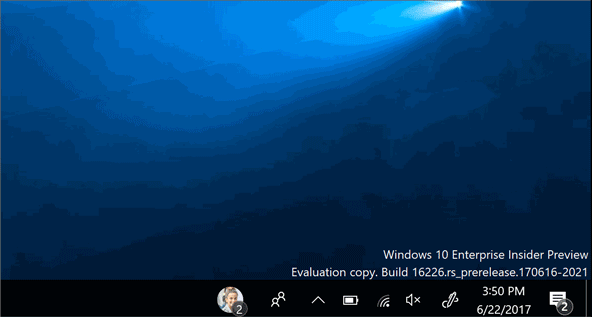

# My People notifications

> [!IMPORTANT]
> My people is no longer supported in Windows 11 and Windows 10 versions with KB5034203 applied.

My People notifications provide a new way for users to connect with the people they care about, through quick expressive gestures. This article shows how to design and implement My People notifications in your application. For complete implementations, see the [My People Notifications Sample.](https://github.com/microsoft/Windows-universal-samples/tree/dev/archived/MyPeopleNotifications)


## Requirements

+ Windows 10 and Microsoft Visual Studio 2019 or later. For installation details, see [Get set up with Visual Studio](/windows/apps/get-started/get-set-up).
+ Basic knowledge of C# or a similar object-oriented programming language. To get started with C#, see [Create a "Hello, world" app](../get-started/create-a-hello-world-app-xaml-universal.md).

## How it works

As an alternative to generic toast notifications, you can now send notifications through the My People feature to provide a more personal experience to users. This is a new kind of toast, sent from a contact pinned on the user's taskbar with the My People feature. When the notification is received, the sender’s contact picture will animate in the taskbar and a sound will play, signaling that the notification is starting. The animation or image specified in the payload will be displayed for 5 seconds (or, if the payload is an animation less than 5 seconds long, it will loop until 5 seconds have passed).

## Supported image types

+ GIF
+ Static Image (JPEG, PNG)
+ Spritesheet (vertical only)

> [!NOTE]
> A spritesheet is an animation derived from a static image (JPEG or PNG). Individual frames are arranged vertically, such that the first frame is on top (though you can specify a different starting frame in the toast payload). Each frame must have the same height, which the program loops through to create an animated sequence (like a flipbook with its pages laid out vertically). An example of a spritesheet is shown below.


## Notification parameters

My People notifications use the [toast notification](/windows/apps/design/shell/tiles-and-notifications/adaptive-interactive-toasts) framework, but require an additional binding node in the toast payload. This second binding must include the following parameter:

```xml
experienceType="shoulderTap"
```

This indicates that the toast should be treated as a My People notification.

The image node inside the binding should include the following parameters:

+ **src**
    + The URI of the asset. This can be either HTTP/HTTPS web URI, an msappx URI, or a path to a local file.
+ **spritesheet-src**
    + The URI of the asset. This can be either HTTP/HTTPS web URI, an msappx URI, or a path to a local file. Only required for spritesheet animations.
+ **spritesheet-height**
    + The frame height (in pixels). Only required for spritesheet animations.
+ **spritesheet-fps**
    + Frames per second (FPS). Only required for spritesheet animations. Only values 1-120 are supported.
+ **spritesheet-startingFrame**
    + The frame number to begin the animation. Only used for spritesheet animations and defaults to 0 if not provided.
+ **alt**
    + Text string used for screen reader narration.

> [!NOTE]
> When making an animated notification, you should still specify a static image in the "src" parameter. It will be used as a fall-back if the animation fails to display.

In addition, the top-level toast node must include the **hint-people** parameter to specify the sending contact. This parameter can have any the following values:

+ **Email address**
    + E.g. ` mailto:johndoe@mydomain.com `
+ **Telephone number**
    + E.g. tel:888-888-8888
+ **Remote ID**
    + E.g. remoteid:1234

> [!NOTE]
> If your app uses the [ContactStore APIs](/uwp/api/windows.applicationmodel.contacts.contactstore) and uses the [StoredContact.RemoteId](/uwp/api/Windows.Phone.PersonalInformation.StoredContact.RemoteId) property to link contacts stored on the PC with contacts stored remotely, it is essential that the value for the RemoteId property is both stable and unique. This means that the remote ID must consistently identify a single user account, and should contain a unique tag to guarantee that it does not conflict with the remote IDs of other contacts on the PC, including contacts that are owned by other apps.
> If the remote IDs used by your app are not guaranteed to be stable and unique, you can use the [RemoteIdHelper class](/previous-versions/windows/apps/jj207024(v=vs.105)#BKMK_UsingtheRemoteIdHelperclass) in order to add a unique tag to all of your remote IDs before you add them to the system. Alternatively, you can choose to not use the RemoteId property at all, and instead create a custom extended property in which to store remote IDs for your contacts.

In addition to the second binding and payload, you must include another payload in the first binding for the fallback toast. The notification will use this if it is forced to revert to a regular toast (explained further at the [end of this article](#falling-back-to-toast)).

## Creating the notification

You can create a My People notification template just like you would a [toast notification](/windows/apps/design/shell/tiles-and-notifications/adaptive-interactive-toasts).

Here's an example of how to create a My People notification with a static image payload:

```xml
<toast hint-people="mailto:johndoe@mydomain.com">
    <visual lang="en-US">
        <binding template="ToastGeneric">
            <text hint-style="body">Toast fallback</text>
            <text>Add your fallback toast content here</text>
        </binding>
        <binding template="ToastGeneric" experienceType="shoulderTap">
            <image src="https://learn.microsoft.com/windows/uwp/contacts-and-calendar/images/shoulder-tap-static-payload.png"/>
        </binding>
    </visual>
</toast>
```

When you start the notification, it should look like this:


Here's an example of how to create a notification with an animated spritesheet payload. This spritesheet has a frame-height of 80 pixels, which we'll animate at 25 frames per second. We set the starting frame to 15 and provide it with a static fallback image in the “src” parameter. The fallback image is used if the spritesheet animation fails to display.

```xml
<toast hint-people="mailto:johndoe@mydomain.com">
    <visual lang="en-US">
        <binding template="ToastGeneric">
            <text hint-style="body">Toast fallback</text>
            <text>Add your fallback toast content here</text>
        </binding>
        <binding template="ToastGeneric" experienceType="shoulderTap">
            <image src="https://learn.microsoft.com/windows/uwp/contacts-and-calendar/images/shoulder-tap-pizza-static.png"
                spritesheet-src="https://learn.microsoft.com/windows/uwp/contacts-and-calendar/images/shoulder-tap-pizza-spritesheet.png"
                spritesheet-height='80' spritesheet-fps='25' spritesheet-startingFrame='15'/>
        </binding>
    </visual>
</toast>
```

When you start the notification, it should look like this:



## Starting the notification

To start a My People notification, we need to convert the toast template into an [XmlDocument](/uwp/api/windows.data.xml.dom.xmldocument) object. When you have defined the toast in an XML file (here named "content.xml"), you can use this code to start it:

```CSharp
string xmlText = File.ReadAllText("content.xml");
XmlDocument xmlContent = new XmlDocument();
xmlContent.LoadXml(xmlText);
```

You can then use this code to create and send the toast:

```CSharp
ToastNotification notification = new ToastNotification(xmlContent);
ToastNotificationManager.CreateToastNotifier().Show(notification);
```

## Falling back to toast

There are some cases when a My People notification will instead display as a regular toast notification. A My People notification will fall back to toast under the following conditions:

+ The notification fails to display
+ My People notifications are not enabled by the recipient
+ The sender’s contact is not pinned to the receiver’s taskbar

If a My People notification falls back to toast, the second My-People-specific binding is ignored, and only the first binding is used to display the toast. This is why it is critical to provide a fallback payload in the first toast binding.

## See also

+ [My People Notifications Sample](https://github.com/microsoft/Windows-universal-samples/tree/dev/archived/MyPeopleNotifications)
+ [Adding My People support](my-people-support.md)
+ [Adaptive toast notifications](/windows/apps/design/shell/tiles-and-notifications/adaptive-interactive-toasts)
+ [ToastNotification Class](/uwp/api/windows.ui.notifications.toastnotification)
