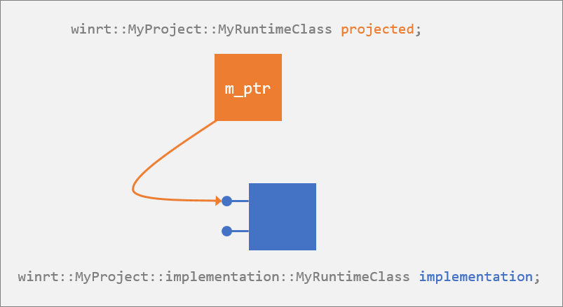

# Author APIs with C++/WinRT

This topic shows how to author [C++/WinRT](./intro-to-using-cpp-with-winrt.md) APIs by using the [**winrt::implements**](/uwp/cpp-ref-for-winrt/implements) base struct, either directly or indirectly. Synonyms for *author* in this context are *produce*, or *implement*. This topic covers the following scenarios for implementing APIs on a C++/WinRT type, in this order.

> [!NOTE]
> This topic touches on the subject of Windows Runtime components, but only in the context of C++/WinRT. If you're looking for content about Windows Runtime components that covers all Windows Runtime languages, then see [Windows Runtime components](../winrt-components/index.md).

- You're *not* authoring a Windows Runtime class (runtime class); you just want to implement one or more Windows Runtime interfaces for local consumption within your app. You derive directly from **winrt::implements** in this case, and implement functions.
- You *are* authoring a runtime class. You might be authoring a component to be consumed from an app. Or you might be authoring a type to be consumed from XAML user interface (UI), and in that case you're both implementing and consuming a runtime class within the same compilation unit. In these cases, you let the tools generate classes for you that derive from **winrt::implements**.

In both cases, the type that implements your C++/WinRT APIs is called the *implementation type*.

> [!IMPORTANT]
> It's important to distinguish the concept of an implementation type from that of a projected type. The projected type is described in [Consume APIs with C++/WinRT](consume-apis.md).

## If you're *not* authoring a runtime class

The simplest scenario is where your type is implementing a Windows Runtime interface, and you'll be consuming that type within the same app. In that case, your type doesn't need to be a runtime class; just an ordinary C++ class. For example, you might be writing an app based around [**CoreApplication**](/uwp/api/windows.applicationmodel.core.coreapplication).

If your type is referenced by XAML UI, then it *does* need to be a runtime class, *even though it's in the same project* as the XAML. For that case, see the section [If you're authoring a runtime class to be referenced in your XAML UI](#if-youre-authoring-a-runtime-class-to-be-referenced-in-your-xaml-ui).

> [!NOTE]
> For info about installing and using the C++/WinRT Visual Studio Extension (VSIX) and the NuGet package (which together provide project template and build support), see [Visual Studio support for C++/WinRT](intro-to-using-cpp-with-winrt.md#visual-studio-support-for-cwinrt-xaml-the-vsix-extension-and-the-nuget-package).

In Visual Studio, the **Visual C++** > **Windows Universal** > **Core App (C++/WinRT)** project template illustrates the **CoreApplication** pattern. The pattern begins with passing an implementation of [**Windows::ApplicationModel::Core::IFrameworkViewSource**](/uwp/api/windows.applicationmodel.core.iframeworkviewsource) to [**CoreApplication::Run**](/uwp/api/windows.applicationmodel.core.coreapplication.run).

```cppwinrt
using namespace Windows::ApplicationModel::Core;
int __stdcall wWinMain(HINSTANCE, HINSTANCE, PWSTR, int)
{
    IFrameworkViewSource source = ...
    CoreApplication::Run(source);
}
```

**CoreApplication** uses the interface to create the app's first view. Conceptually, **IFrameworkViewSource** looks like this.

```cppwinrt
struct IFrameworkViewSource : IInspectable
{
    IFrameworkView CreateView();
};
```

Again conceptually, the implementation of **CoreApplication::Run** does this.

```cppwinrt
void Run(IFrameworkViewSource viewSource) const
{
    IFrameworkView view = viewSource.CreateView();
    ...
}
```

So you, as the developer, implement the **IFrameworkViewSource** interface. C++/WinRT has the base struct template [**winrt::implements**](/uwp/cpp-ref-for-winrt/implements) to make it easy to implement an interface (or several) without resorting to COM-style programming. You just derive your type from **implements**, and then implement the interface's functions. Here's how.

```cppwinrt
// App.cpp
...
struct App : implements<App, IFrameworkViewSource>
{
    IFrameworkView CreateView()
    {
        return ...
    }
}
...
```

That's taken care of **IFrameworkViewSource**. The next step is to return an object that implements the **IFrameworkView** interface. You can choose to implement that interface on **App**, too. This next code example represents a minimal app that will at least get a window up and running on the desktop.

```cppwinrt
// App.cpp
...
struct App : implements<App, IFrameworkViewSource, IFrameworkView>
{
    IFrameworkView CreateView()
    {
        return *this;
    }

    void Initialize(CoreApplicationView const &) {}

    void Load(hstring const&) {}

    void Run()
    {
        CoreWindow window = CoreWindow::GetForCurrentThread();
        window.Activate();

        CoreDispatcher dispatcher = window.Dispatcher();
        dispatcher.ProcessEvents(CoreProcessEventsOption::ProcessUntilQuit);
    }

    void SetWindow(CoreWindow const & window)
    {
        // Prepare app visuals here
    }

    void Uninitialize() {}
};
...
```

Since your **App** type *is an* **IFrameworkViewSource**, you can just pass one to **Run**.

```cppwinrt
using namespace Windows::ApplicationModel::Core;
int __stdcall wWinMain(HINSTANCE, HINSTANCE, PWSTR, int)
{
    CoreApplication::Run(winrt::make<App>());
}
```

## If you're authoring a runtime class in a Windows Runtime component

If your type is packaged in a Windows Runtime component for consumption from another binary (the other binary is usually an application), then your type needs to be a runtime class. You declare a runtime class in a Microsoft Interface Definition Language (IDL) (.idl) file (see [Factoring runtime classes into Midl files (.idl)](#factoring-runtime-classes-into-midl-files-idl)).

Each IDL file results in a `.winmd` file, and Visual Studio merges all of those into a single file with the same name as your root namespace. That final `.winmd` file will be the one that the consumers of your component will reference.

Here's an example of declaring a runtime class in an IDL file.

```idl
// MyRuntimeClass.idl
namespace MyProject
{
    runtimeclass MyRuntimeClass
    {
        // Declaring a constructor (or constructors) in the IDL causes the runtime class to be
        // activatable from outside the compilation unit.
        MyRuntimeClass();
        String Name;
    }
}
```

This IDL declares a Windows Runtime (runtime) class. A runtime class is a type that can be activated and consumed via modern COM interfaces, typically across executable boundaries. When you add an IDL file to your project, and build, the C++/WinRT toolchain (`midl.exe` and `cppwinrt.exe`) generate an implementation type for you. For an example of the IDL file workflow in action, see [XAML controls; bind to a C++/WinRT property](binding-property.md).

Using the example IDL above, the implementation type is a C++ struct stub named **winrt::MyProject::implementation::MyRuntimeClass** in source code files named `\MyProject\MyProject\Generated Files\sources\MyRuntimeClass.h` and `MyRuntimeClass.cpp`.

The implementation type looks like this.

```cppwinrt
// MyRuntimeClass.h
...
namespace winrt::MyProject::implementation
{
    struct MyRuntimeClass : MyRuntimeClassT<MyRuntimeClass>
    {
        MyRuntimeClass() = default;

        winrt::hstring Name();
        void Name(winrt::hstring const& value);
    };
}

// winrt::MyProject::factory_implementation::MyRuntimeClass is here, too.
```

Notice that the F-bound polymorphism pattern being used (**MyRuntimeClass** uses itself as a template argument to its base, **MyRuntimeClassT**). This is also called the curiously recurring template pattern (CRTP). If you follow the inheritance chain upwards, you'll come across **MyRuntimeClass_base**.

You can simplify the implementation of simple properties by using [Windows Implementation Libraries (WIL)](https://github.com/Microsoft/wil). Here's how:

```cppwinrt
// MyRuntimeClass.h
...
namespace winrt::MyProject::implementation
{
    struct MyRuntimeClass : MyRuntimeClassT<MyRuntimeClass>
    {
        MyRuntimeClass() = default;

        wil::single_threaded_rw_propertywinrt::hstring Name;
    };
}
```

See [Simple properties](https://github.com/microsoft/wil/wiki/CppWinRT-authoring-helpers#simple-properties).

```cppwinrt
template <typename D, typename... I>
struct MyRuntimeClass_base : implements<D, MyProject::IMyRuntimeClass, I...>
```

So, in this scenario, at the root of the inheritance hierarchy is the [**winrt::implements**](/uwp/cpp-ref-for-winrt/implements) base struct template once again.

For more details, code, and a walkthrough of authoring APIs in a Windows Runtime component, see [Windows Runtime components with C++/WinRT](../winrt-components/create-a-windows-runtime-component-in-cppwinrt.md) and [Author events in C++/WinRT](./author-events.md).

## If you're authoring a runtime class to be referenced in your XAML UI

If your type is referenced by your XAML UI, then it needs to be a runtime class, even though it's in the same project as the XAML. Although they are typically activated across executable boundaries, a runtime class can instead be used within the compilation unit that implements it.

In this scenario, you're both authoring *and* consuming the APIs. The procedure for implementing your runtime class is essentially the same as that for a Windows Runtime component. So, see the previous section&mdash;[If you're authoring a runtime class in a Windows Runtime component](#if-youre-authoring-a-runtime-class-in-a-windows-runtime-component). The only detail that differs is that, from the IDL, the C++/WinRT toolchain generates not only an implementation type but also a projected type. It's important to appreciate that saying only "**MyRuntimeClass**" in this scenario may be ambiguous; there are several entities with that name, of different kinds.

- **MyRuntimeClass** is the name of a runtime class. But this is really an abstraction: declared in IDL, and implemented in some programming language.
- **MyRuntimeClass** is the name of the C++ struct **winrt::MyProject::implementation::MyRuntimeClass**, which is the C++/WinRT implementation of the runtime class. As we've seen, if there are separate implementing and consuming projects, then this struct exists only in the implementing project. This is *the implementation type*, or *the implementation*. This type is generated (by the `cppwinrt.exe` tool) in the files `\MyProject\MyProject\Generated Files\sources\MyRuntimeClass.h` and `MyRuntimeClass.cpp`.
- **MyRuntimeClass** is the name of the projected type in the form of the C++ struct **winrt::MyProject::MyRuntimeClass**. If there are separate implementing and consuming projects, then this struct exists only in the consuming project. This is *the projected type*, or *the projection*. This type is generated (by `cppwinrt.exe`) in the file `\MyProject\MyProject\Generated Files\winrt\impl\MyProject.2.h`.



Here are the parts of the projected type that are relevant to this topic.

```cppwinrt
// MyProject.2.h
...
namespace winrt::MyProject
{
    struct MyRuntimeClass : MyProject::IMyRuntimeClass
    {
        MyRuntimeClass(std::nullptr_t) noexcept {}
        MyRuntimeClass();
    };
}
```

For an example walkthrough of implementing the **INotifyPropertyChanged** interface on a runtime class, see [XAML controls; bind to a C++/WinRT property](binding-property.md).

The procedure for consuming your runtime class in this scenario is described in [Consume APIs with C++/WinRT](consume-apis.md#if-the-api-is-implemented-in-the-consuming-project).

## Factoring runtime classes into Midl files (.idl)

The Visual Studio project and item templates produce a separate IDL file for each runtime class. That gives a logical correspondence between an IDL file and its generated source code files.

However, if you consolidate all of your project's runtime classes into a single IDL file, then that can significantly improve build time. If you would otherwise have complex (or circular) `import` dependencies among them, then consolidating may actually be necessary. And you may find it easier to author and review your runtime classes if they're together.

## Runtime class constructors

Here are some points to take away from the listings we've seen above.

- Each constructor you declare in your IDL causes a constructor to be generated on both your implementation type and on your projected type. IDL-declared constructors are used to consume the runtime class from *a different* compilation unit.
- Whether you have IDL-declared constructor(s) or not, a constructor overload that takes **std::nullptr_t** is generated on your projected type. Calling the **std::nullptr_t** constructor is *the first of two steps* in consuming the runtime class from *the same* compilation unit. For more details, and a code example, see [Consume APIs with C++/WinRT](consume-apis.md#if-the-api-is-implemented-in-the-consuming-project).
- If you're consuming the runtime class from *the same* compilation unit, then you can also implement non-default constructors directly on the implementation type (which, remember, is in `MyRuntimeClass.h`).

> [!NOTE]
> If you expect your runtime class to be consumed from a different compilation unit (which is common), then include constructor(s) in your IDL (at least a default constructor). By doing that, you'll also get a factory implementation alongside your implementation type.
> 
> If you want to author and consume your runtime class only within the same compilation unit, then don't declare any constructor(s) in your IDL. You don't need a factory implementation, and one won't be generated. Your implementation type's default constructor will be deleted, but you can easily edit it and default it instead.
> 
> If you want to author and consume your runtime class only within the same compilation unit, and you need constructor parameters, then author the constructor(s) that you need directly on your implementation type.

## Runtime class methods, properties, and events

We've seen that the workflow is to use IDL to declare your runtime class and its members, and then the tooling generates prototypes and stub implementations for you. As for those autogenerated prototypes for the members of your runtime class, you *can* edit them so that they pass around different types from the types that you declare in your IDL. But you can do that only as long as the type that you declare in IDL can be forwarded to the type that you declare in the implemented version.

Here are some examples.

- You can relax parameter types. For example, if in IDL your method takes a **SomeClass**, then you could choose to change that to **IInspectable** in your implementation. This works because any **SomeClass** can be forwarded to **IInspectable** (the reverse, of course, wouldn't work).
- You can accept a copyable parameter by value, instead of by reference. For example, change `SomeClass const&` to `SomeClass`. That's necessary when you need to avoid capturing a reference into a coroutine (see [Parameter-passing](./concurrency.md#parameter-passing)).
- You can relax the return value. For example, you can change **void** to [**winrt::fire_and_forget**](/uwp/cpp-ref-for-winrt/fire-and-forget).

The last two are very useful when you're writing an asynchronous event handler.

## Instantiating and returning implementation types and interfaces

For this section, let's take as an example an implementation type named **MyType**, which implements the [**IStringable**](/uwp/api/windows.foundation.istringable) and [**IClosable**](/uwp/api/windows.foundation.iclosable) interfaces.

You can derive **MyType** directly from [**winrt::implements**](/uwp/cpp-ref-for-winrt/implements) (it's not a runtime class).

```cppwinrt
#include <winrt/Windows.Foundation.h>

using namespace winrt;
using namespace Windows::Foundation;

struct MyType : implements<MyType, IStringable, IClosable>
{
    winrt::hstring ToString(){ ... }
    void Close(){}
};
```

Or you can generate it from IDL (it's a runtime class).

```idl
// MyType.idl
namespace MyProject
{
    runtimeclass MyType: Windows.Foundation.IStringable, Windows.Foundation.IClosable
    {
        MyType();
    }    
}
```

You can't directly allocate your implementation type.

```cppwinrt
MyType myimpl; // error C2259: 'MyType': cannot instantiate abstract class
```

But you can go from **MyType** to an **IStringable** or **IClosable** object that you can use or return as part of your projection by calling the [**winrt::make**](/uwp/cpp-ref-for-winrt/make) function template. **make** returns the implementation type's default interface.

```cppwinrt
IStringable istringable = winrt::make<MyType>();
```

> [!NOTE]
> However, if you're referencing your type from your XAML UI, then there will be both an implementation type and a projected type in the same project. In that case, **make** returns an instance of the projected type. For a code example of that scenario, see [XAML controls; bind to a C++/WinRT property](binding-property.md#add-a-property-of-type-bookstoreviewmodel-to-mainpage).

We can use `istringable` (in the code example above) only to call the members of the **IStringable** interface. But a C++/WinRT interface (which is a projected interface) derives from [**winrt::Windows::Foundation::IUnknown**](/uwp/cpp-ref-for-winrt/windows-foundation-iunknown). So, you can call [**IUnknown::as**](/uwp/cpp-ref-for-winrt/windows-foundation-iunknown#iunknownas-function) (or [**IUnknown::try_as**](/uwp/cpp-ref-for-winrt/windows-foundation-iunknown#iunknowntry_as-function)) on it to query for other projected types or interfaces, which you can also either use or return.

> [!TIP]
> A scenario where you *shouldn't* call **as** or **try_as** is runtime class derivation ("composable classes"). When an implementation type composes another class, don't call **as** or **try_as** in order to perform an unchecked or checked **QueryInterface** of the class being composed. Instead, access the (`this->`) `m_inner` data member, and call **as** or **try_as** on that. For more info, see [Runtime class derivation](#runtime-class-derivation) in this topic.

```cppwinrt
istringable.ToString();
IClosable iclosable = istringable.as<IClosable>();
iclosable.Close();
```

If you need to access all of the implementation's members, and then later return an interface to a caller, then use the [**winrt::make_self**](/uwp/cpp-ref-for-winrt/make-self) function template. **make_self** returns a [**winrt::com_ptr**](/uwp/cpp-ref-for-winrt/com-ptr) wrapping the implementation type. You can access the members of all of its interfaces (using the arrow operator), you can return it to a caller as-is, or you can call **as** on it and return the resulting interface object to a caller.

```cppwinrt
winrt::com_ptr<MyType> myimpl = winrt::make_self<MyType>();
myimpl->ToString();
myimpl->Close();
IClosable iclosable = myimpl.as<IClosable>();
iclosable.Close();
```

The **MyType** class is not part of the projection; it's the implementation. But this way you can call its implementation methods directly, without the overhead of a virtual function call. In the example above, even though **MyType::ToString** uses the same signature as the projected method on **IStringable**, we're calling the non-virtual method directly, without crossing the application binary interface (ABI). The **com_ptr** simply holds a pointer to the **MyType** struct, so you can also access any other internal details of **MyType** via the `myimpl` variable and the arrow operator.

In the case where you have an interface object, and you happen to know that it's an interface on your implementation, then you can get back to the implementation using the [**winrt::get_self**](/uwp/cpp-ref-for-winrt/get-self) function template. Again, it's a technique that avoids virtual function calls, and lets you get directly at the implementation.

> [!NOTE]
> If you haven't installed the Windows SDK version 10.0.17763.0 (Windows 10, version 1809), or later, then you need to call [**winrt::from_abi**](/uwp/cpp-ref-for-winrt/from-abi) instead of [**winrt::get_self**](/uwp/cpp-ref-for-winrt/get-self).

Here's an example. There's another example in [Implement the **BgLabelControl** custom control class](xaml-cust-ctrl.md#implement-the-bglabelcontrol-custom-control-class).

```cppwinrt
void ImplFromIClosable(IClosable const& from)
{
    MyType* myimpl = winrt::get_self<MyType>(from);
    myimpl->ToString();
    myimpl->Close();
}
```

But only the original interface object holds on to a reference. If *you* want to hold on to it, then you can call [**com_ptr::copy_from**](/uwp/cpp-ref-for-winrt/com-ptr#com_ptrcopy_from-function).

```cppwinrt
winrt::com_ptr<MyType> impl;
impl.copy_from(winrt::get_self<MyType>(from));
// com_ptr::copy_from ensures that AddRef is called.
```

The implementation type itself doesn't derive from **winrt::Windows::Foundation::IUnknown**, so it has no **as** function. Even so, as you can see in the **ImplFromIClosable** function above, you can access the members of all of its interfaces. But if you do that, then don't return the raw implementation type instance to the caller. Instead, use one of the techniques already shown, and return a projected interface, or a **com_ptr**.

If you have an instance of your implementation type, and you need to pass it to a function that expects the corresponding projected type, then you can do so, as shown in the code example below. A conversion operator exists on your implementation type (provided that the implementation type was generated by the `cppwinrt.exe` tool) that makes this possible. You can pass an implementation type value directly to a method that expects a value of the corresponding projected type. From an implementation type member function, you can pass `*this` to a method that expects a value of the corresponding projected type.

```cppwinrt
// MyClass.idl
import "MyOtherClass.idl";
namespace MyProject
{
    runtimeclass MyClass
    {
        MyClass();
        void MemberFunction(MyOtherClass oc);
    }
}

// MyClass.h
...
namespace winrt::MyProject::implementation
{
    struct MyClass : MyClassT<MyClass>
    {
        MyClass() = default;
        void MemberFunction(MyProject::MyOtherClass const& oc) { oc.DoWork(*this); }
    };
}
...

// MyOtherClass.idl
import "MyClass.idl";
namespace MyProject
{
    runtimeclass MyOtherClass
    {
        MyOtherClass();
        void DoWork(MyClass c);
    }
}

// MyOtherClass.h
...
namespace winrt::MyProject::implementation
{
    struct MyOtherClass : MyOtherClassT<MyOtherClass>
    {
        MyOtherClass() = default;
        void DoWork(MyProject::MyClass const& c){ /* ... */ }
    };
}
...

//main.cpp
#include "pch.h"
#include <winrt/base.h>
#include "MyClass.h"
#include "MyOtherClass.h"
using namespace winrt;

// MyProject::MyClass is the projected type; the implementation type would be MyProject::implementation::MyClass.

void FreeFunction(MyProject::MyOtherClass const& oc)
{
    auto defaultInterface = winrt::make<MyProject::implementation::MyClass>();
    MyProject::implementation::MyClass* myimpl = winrt::get_self<MyProject::implementation::MyClass>(defaultInterface);
    oc.DoWork(*myimpl);
}
...
```

## Runtime class derivation

You can create a runtime class that derives from another runtime class, provided that the base class is declared as "unsealed". The Windows Runtime term for class derivation is "composable classes". The code for implementing a derived class depends on whether the base class is provided by another component or by the same component. Fortunately, you don't have to learn these rules&mdash;you can just copy the sample implementations from the `sources` output folder produced by the `cppwinrt.exe` compiler.

Consider this example.

```idl
// MyProject.idl
namespace MyProject
{
    [default_interface]
    runtimeclass MyButton : Windows.UI.Xaml.Controls.Button
    {
        MyButton();
    }

    unsealed runtimeclass MyBase
    {
        MyBase();
        overridable Int32 MethodOverride();
    }

    [default_interface]
    runtimeclass MyDerived : MyBase
    {
        MyDerived();
    }
}
```

In the above example, **MyButton** is derived from the XAML **Button** control, which is provided by another component. In that case, the implementation looks just like the implementation of a non-composable class:

```cpp
namespace winrt::MyProject::implementation
{
    struct MyButton : MyButtonT<MyButton>
    {
    };
}

namespace winrt::MyProject::factory_implementation
{
    struct MyButton : MyButtonT<MyButton, implementation::MyButton>
    {
    };
}
```

On the other hand, in the above example, **MyDerived** is derived from another class in the same component. In this case, the implementation requires an additional template parameter specifying the implementation class for the base class.

```cpp
namespace winrt::MyProject::implementation
{
    struct MyDerived : MyDerivedT<MyDerived, implementation::MyBase>
    {                                     // ^^^^^^^^^^^^^^^^^^^^^^
    };
}

namespace winrt::MyProject::factory_implementation
{
    struct MyDerived : MyDerivedT<MyDerived, implementation::MyDerived>
    {
    };
}
```

In either case, your implementation can call a method from the base class by qualifying it with the `base_type` type alias:

```cpp
namespace winrt::MyProject::implementation
{
    struct MyButton : MyButtonT<MyButton>
    {
        void OnApplyTemplate()
        {
            // Call base class method
            base_type::OnApplyTemplate();

            // Do more work after the base class method is done
            DoAdditionalWork();
        }
    };

    struct MyDerived : MyDerivedT<MyDerived, implementation::MyBase>
    {
        int MethodOverride()
        {
            // Return double what the base class returns
            return 2 * base_type::MethodOverride();
        }
    };
}
```

> [!TIP]
> When an implementation type composes another class, don't call **as** or **try_as** in order to perform an unchecked or checked **QueryInterface** of the class being composed. Instead, access the (`this->`) `m_inner` data member, and call **as** or **try_as** on that.

## Deriving from a type that has a non-default constructor

[**ToggleButtonAutomationPeer::ToggleButtonAutomationPeer(ToggleButton)**](/uwp/api/windows.ui.xaml.automation.peers.togglebuttonautomationpeer.-ctor#Windows_UI_Xaml_Automation_Peers_ToggleButtonAutomationPeer__ctor_Windows_UI_Xaml_Controls_Primitives_ToggleButton_) is an example of a non-default constructor. There's no default constructor so, to construct a **ToggleButtonAutomationPeer**, you need to pass an *owner*. Consequently, if you derive from **ToggleButtonAutomationPeer**, then you need to provide a constructor that takes an *owner* and passes it to the base. Let's see what that looks like in practice.

```idl
// MySpecializedToggleButton.idl
namespace MyNamespace
{
    runtimeclass MySpecializedToggleButton :
        Windows.UI.Xaml.Controls.Primitives.ToggleButton
    {
        ...
    };
}
```

```idl
// MySpecializedToggleButtonAutomationPeer.idl
namespace MyNamespace
{
    runtimeclass MySpecializedToggleButtonAutomationPeer :
        Windows.UI.Xaml.Automation.Peers.ToggleButtonAutomationPeer
    {
        MySpecializedToggleButtonAutomationPeer(MySpecializedToggleButton owner);
    };
}
```

The generated constructor for your implementation type looks like this.

```cppwinrt
// MySpecializedToggleButtonAutomationPeer.cpp
...
MySpecializedToggleButtonAutomationPeer::MySpecializedToggleButtonAutomationPeer
    (MyNamespace::MySpecializedToggleButton const& owner)
{
    ...
}
...
```

The only piece missing is that you need to pass that constructor parameter on to the base class. Remember the F-bound polymorphism pattern that we mentioned above? Once you're familiar with the details of that pattern as used by C++/WinRT, you can figure out what your base class is called (or you can just look in your implementation class's header file). This is how to call the base class constructor in this case.

```cppwinrt
// MySpecializedToggleButtonAutomationPeer.cpp
...
MySpecializedToggleButtonAutomationPeer::MySpecializedToggleButtonAutomationPeer
    (MyNamespace::MySpecializedToggleButton const& owner) : 
    MySpecializedToggleButtonAutomationPeerT<MySpecializedToggleButtonAutomationPeer>(owner)
{
    ...
}
...
```

The base class constructor expects a **ToggleButton**. And **MySpecializedToggleButton** *is a* **ToggleButton**.

Until you make the edit described above (to pass that constructor parameter on to the base class), the compiler will flag your constructor and point out that there's no appropriate default constructor available on a type called (in this case) **MySpecializedToggleButtonAutomationPeer_base&lt;MySpecializedToggleButtonAutomationPeer&gt;**. That's actually the base class of the bass class of your implementation type.

## Namespaces: projected types, implementation types, and factories

As you've seen previously in this topic, a C++/WinRT runtime class exists in the form of more than one C++ class in more than one namespace. So, the name **MyRuntimeClass** has one meaning in the **winrt::MyProject** namespace, and a different meaning in the **winrt::MyProject::implementation** namespace. Be aware of which namespace you currently have in context, and then use namespace prefixes if you need a name from a different namespace. Let's look more closely at the namespaces in question.

- **winrt::MyProject**. This namespace contains projected types. An object of a projected type is a proxy; it's essentially a smart pointer to a backing object, where that backing object might be implemented here in your project, or it might be implemented in another compilation unit.
- **winrt::MyProject::implementation**. This namespace contains implementation types. An object of an implementation type is not a pointer; it's a value&mdash;a full C++ stack object. Don't construct an implementation type directly; instead, call [**winrt::make**](/uwp/cpp-ref-for-winrt/make), passing your implementation type as the template parameter. We've shown examples of **winrt::make** in action previously in this topic, and there's another example in [XAML controls; bind to a C++/WinRT property](binding-property.md#add-a-property-of-type-bookstoreviewmodel-to-mainpage). Also see [Diagnosing direct allocations](./diag-direct-alloc.md).
- **winrt::MyProject::factory_implementation**. This namespace contains factories. An object in this namespace supports [**IActivationFactory**](/windows/win32/api/activation/nn-activation-iactivationfactory).

This table shows the minimum namespace qualification you need to use in different contexts.

|The namespace that's in context|To specify the projected type|To specify the implementation type|
|-|-|-|
|**winrt::MyProject**|`MyRuntimeClass`|`implementation::MyRuntimeClass`|
|**winrt::MyProject::implementation**|`MyProject::MyRuntimeClass`|`MyRuntimeClass`|

> [!IMPORTANT]
> When you want to return a projected type from your implementation, be careful not to instantiate the implementation type by writing `MyRuntimeClass myRuntimeClass;`. The correct techniques and code for that scenario are shown previously in this topic in the section [Instantiating and returning implementation types and interfaces](#instantiating-and-returning-implementation-types-and-interfaces).
>
> The problem with `MyRuntimeClass myRuntimeClass;` in that scenario is that it creates a **winrt::MyProject::implementation::MyRuntimeClass** object on the stack. That object (of implementation type) behaves like the projected type in some ways&mdash;you can invoke methods on it in the same way; and it even converts to a projected type. But the object destructs, as per normal C++ rules, when the scope exits. So, if you returned a projected type (a smart pointer) to that object, then that pointer is now dangling.
>
> This memory corruption type of bug is difficult to diagnose. So, for debug builds, a C++/WinRT assertion helps you catch this mistake, using a stack-detector. But coroutines are allocated on the heap, so you won't get help with this mistake if you make it inside a coroutine. For more info, see [Diagnosing direct allocations](./diag-direct-alloc.md).

## Using projected types and implementation types with various C++/WinRT features

Here are various places where a C++/WinRT features expects a type, and what kind of type it expects (projected type, implementation type, or both).

|Feature|Accepts|Notes|
|-|-|-|
|`T` (representing a smart pointer)|Projected|See the caution in [Namespaces: projected types, implementation types, and factories](#namespaces-projected-types-implementation-types-and-factories) about using the implementation type by mistake.|
|`agile_ref<T>`|Both|If you use the implementation type, then the constructor argument must be `com_ptr<T>`.|
|`com_ptr<T>`|Implementation|Using the projected type generates the error: `'Release' is not a member of 'T'`.|
|`default_interface<T>`|Both|If you use the implementation type, then the first implemented interface is returned.|
|`get_self<T>`|Implementation|Using the projected type generates the error: `'_abi_TrustLevel': is not a member of 'T'`.|
|`guid_of<T>()`|Both|Returns the GUID of the default interface.|
|`IWinRTTemplateInterface<T>`<br>|Projected|Using the implementation type compiles, but it's a mistake&mdash;see the caution in [Namespaces: projected types, implementation types, and factories](#namespaces-projected-types-implementation-types-and-factories).|
|`make<T>`|Implementation|Using the projected type generates the error: `'implements_type': is not a member of any direct or indirect base class of 'T'`|
| `make_agile(T const&amp;)`|Both|If you use the implementation type, then the argument must be `com_ptr<T>`.|
| `make_self<T>`|Implementation|Using the projected type generates the error: `'Release': is not a member of any direct or indirect base class of 'T'`|
| `name_of<T>`|Projected|If you use the implementation type, then you get the stringified GUID of the default interface.|
| `weak_ref<T>`|Both|If you use the implementation type, then the constructor argument must be `com_ptr<T>`.|

## Opt in to uniform construction, and direct implementation access

This section describes a C++/WinRT 2.0 feature that's opt-in, although it is enabled by default for new projects. For an existing project, you'll need to opt in by configuring the `cppwinrt.exe` tool. In Visual Studio, set project property **Common Properties** > **C++/WinRT** > **Optimized** to *Yes*. That has the effect of adding `<CppWinRTOptimized>true</CppWinRTOptimized>` to your project file. And it has the same effect as adding the  switch when invoking `cppwinrt.exe` from the command line.

The `-opt[imize]` switch enables what's often called *uniform construction*. With uniform (or *unified*) construction, you use the C++/WinRT language projection itself to create and use your implmentation types (types implemented by your component, for consumption by applications) efficiently and without any loader difficulties.

Before describing the feature, let's first show the situation *without* uniform construction. To illustrate, we'll begin with this example Windows Runtime class.

```idl
// MyClass.idl
namespace MyProject
{
    runtimeclass MyClass
    {
        MyClass();
        void Method();
        static void StaticMethod();
    }
}
```

As a C++ developer familiar with using the C++/WinRT library, you might want to use the class like this.

```cppwinrt
using namespace winrt::MyProject;

MyClass c;
c.Method();
MyClass::StaticMethod();
```

And that would be perfectly reasonable provided that the consuming code shown didn't reside within the same component that implements this class. As a language projection, C++/WinRT shields you as a developer from the ABI (the COM-based application binary interface that the Windows Runtime defines). C++/WinRT doesn't call directly into the implementation; it travels through the ABI.

Consequently, on the line of code where you're constructing a **MyClass** object (`MyClass c;`), the C++/WinRT projection calls [**RoGetActivationFactory**](/windows/win32/api/roapi/nf-roapi-rogetactivationfactory) to retrieve the class or activation factory, and then uses that factory to create the object. The last line likewise uses the factory to make what appears to be a static method call. All of this requires that your class be registered, and that your module implements the [**DllGetActivationFactory**](/previous-versions/br205771(v=vs.85)) entry point. C++/WinRT has a very fast factory cache, so none of this causes a problem for an application consuming your component. The trouble is that, within your component, you've just done something that's a little problematic.

Firstly, no matter how fast the C++/WinRT factory cache is, calling through **RoGetActivationFactory** (or even subsequent calls through the factory cache) will always be slower than calling directly into the implementation. A call to **RoGetActivationFactory** followed by [**IActivationFactory::ActivateInstance**](/windows/win32/api/activation/nf-activation-iactivationfactory-activateinstance) followed by [**QueryInterface**](/windows/win32/api/unknwn/nf-unknwn-iunknown-queryinterface(refiid_void)) is obviously not going to be as efficient as using a C++ `new` expression for a locally-defined type. As a consequence, seasoned C++/WinRT developers are accustomed to using the [**winrt::make**](/uwp/cpp-ref-for-winrt/make) or [**winrt::make_self**](/uwp/cpp-ref-for-winrt/make-self) helper functions when creating objects within a component.

```cppwinrt
// MyClass c;
MyProject::MyClass c{ winrt::make<implementation::MyClass>() };
```

But, as you can see, that's not nearly as convenient nor concise. You must use a helper function to create the object, and you must also disambiguate between the implementation type and the projected type.

Secondly, using the projection to create the class means that its activation factory will be cached. Normally, that's what you want, but if the factory resides in the same module (DLL) that's making the call, then you've effectively pinned the DLL and prevented it from ever unloading. In many cases, that doesn't matter; but some system components *must* support unloading.

This is where the term *uniform construction* comes in. Regardless of whether creation code resides in a project that's merely consuming the class, or whether it resides in the project that's actually *implementing* the class, you can freely use the same syntax to create the object.

```cppwinrt
// MyProject::MyClass c{ winrt::make<implementation::MyClass>() };
MyClass c;
```

When you build your component project with the `-opt[imize]` switch, the call through the language projection compiles down to the same efficient call to the **winrt::make** function that directly creates the implementation type. That makes your syntax simple and predictable, it avoids any performance hit of calling through the factory, and it avoids pinning the component in the process. In addition to component projects, this is also useful for XAML applications. Bypassing **RoGetActivationFactory** for classes implemented in the same application allows you to construct them (without needing to be registered) in all the same ways you could if they were outside your component.

Uniform construction applies to *any* call that's served by the factory under the hood. Practically, that means that the optimization serves both constructors and static members. Here's that original example again.

```cppwinrt
MyClass c;
c.Method();
MyClass::StaticMethod();
```

Without `-opt[imize]`, the first and last statements require calls through the factory object. *With* `-opt[imize]`, neither of them do. And those calls are compiled directly against the implementation, and even have the potential to be inlined. Which speaks to the other term often used when talking about `-opt[imize]`, namely *direct implementation* access.

Language projections are convenient but, when you can directly access the implementation, you can and should take advantage of that to produce the most efficient code possible. C++/WinRT can do that for you, without forcing you to leave the safety and productivity of the projection.

This is a breaking change because the component must cooperate in order to allow the language projection to reach in and directly access its implementation types. As C++/WinRT is a header-only library, you can look inside and see what's going on. Without `-opt[imize]`, the **MyClass** constructor, and **StaticMethod** member, are defined by the projection like this.

```cppwinrt
namespace winrt::MyProject
{
    inline MyClass::MyClass() :
        MyClass(impl::call_factory<MyClass>([](auto&& f){
		    return f.template ActivateInstance<MyClass>(); }))
    {
    }
    inline void MyClass::StaticMethod()
    {
        impl::call_factory<MyClass, MyProject::IClassStatics>([&](auto&& f) {
		    return f.StaticMethod(); });
    }
}
```

It's not necessary to follow all of the above; the intent is to show that both calls involve a call to a function named **call_factory**. That's your clue that these calls involve the factory cache, and they're not directly accessing the implementation. *With* `-opt[imize]`, these same functions aren't defined at all. Instead, they're declared by the projection, and their definitions are left up to the component.

The component can then provide definitions that call directly into the implementation. Now we've arrived at the breaking change. Those definitions are generated for you when you use both `-component` and `-opt[imize]`, and they appear in a file named `Type.g.cpp`, where *Type* is the name of the runtime class being implemented. That's why you may hit various linker errors when you first enable `-opt[imize]` in an existing project. You need to include that generated file into your implementation in order to stitch things up.

In our example, `MyClass.h` might look like this (regardless of whether `-opt[imize]` is being used).

```cppwinrt
// MyClass.h
#pragma once
#include "MyClass.g.h"
 
namespace winrt::MyProject::implementation
{
    struct MyClass : ClassT<MyClass>
    {
        MyClass() = default;
 
        static void StaticMethod();
        void Method();
    };
}
namespace winrt::MyProject::factory_implementation
{
    struct MyClass : ClassT<MyClass, implementation::MyClass>
    {
    };
}
```

Your `MyClass.cpp` is where it all comes together.

```cppwinrt
#include "pch.h"
#include "MyClass.h"
#include "MyClass.g.cpp" // !!It's important that you add this line!!
 
namespace winrt::MyProject::implementation
{
    void MyClass::StaticMethod()
    {
    }
 
    void MyClass::Method()
    {
    }
}
```

So, to use uniform construction in an existing project, you need to edit each implementation's `.cpp` file so that you `#include <Sub/Namespace/Type.g.cpp>` after the inclusion (and definition) of the implementation class. That file provides the definitions of those functions that the projection left undefined. Here's what those definitions look like inside the `MyClass.g.cpp` file.

```cppwinrt
namespace winrt::MyProject
{
    MyClass::MyClass() :
        MyClass(make<MyProject::implementation::MyClass>())
    {
    }
    void MyClass::StaticMethod()
    {
        return MyProject::implementation::MyClass::StaticMethod();
    }
}
```

And that nicely completes the projection with efficient calls directly into the implementation, avoiding calls to the factory cache, and satisfying the linker.

The final thing that `-opt[imize]` does for you is to change the implementation of your project's `module.g.cpp` (the file that helps you to implement your DLL's **DllGetActivationFactory** and **DllCanUnloadNow** exports) in such a way that incremental builds will tend to be much faster by eliminating the strong type coupling that was required by C++/WinRT 1.0. This is often referred to as *type-erased factories*. Without `-opt[imize]`, the `module.g.cpp` file that's generated for your component starts off by including the definitions of all of your implementation classes&mdash;the `MyClass.h`, in this example. It then directly creates the implementation factory for each class like this.

```cppwinrt
if (requal(name, L"MyProject.MyClass"))
{
    return winrt::detach_abi(winrt::make<winrt::MyProject::factory_implementation::MyClass>());
}
```

Again, you don't need to follow all of the details. What's useful to see is that this requires the complete definition for any and all classes implemented by your component. This can have a dramatic effect on your inner loop, as any change to a single implementation will cause `module.g.cpp` to recompile. With `-opt[imize]`, this is no longer the case. Instead, two things happen to the generated `module.g.cpp` file. The first is that it no longer includes any implementation classes. In this example, it won't include `MyClass.h` at all. Instead, it creates the implementation factories without any knowledge of their implementation.

```cppwinrt
void* winrt_make_MyProject_MyClass();
 
if (requal(name, L"MyProject.MyClass"))
{
    return winrt_make_MyProject_MyClass();
}
```

Obviously, there's no need to include their definitions, and it's up to the linker to resolve the **winrt_make_Component_Class** function's definition. Of course, you don't need to think about this, because the `MyClass.g.cpp` file that gets generated for you (and that you previously included in order to support uniform construction) also defines this function. Here's the entirety of the `MyClass.g.cpp` file that's generated for this example.

```cppwinrt
void* winrt_make_MyProject_MyClass()
{
    return winrt::detach_abi(winrt::make<winrt::MyProject::factory_implementation::MyClass>());
}
namespace winrt::MyProject
{
    MyClass::MyClass() :
        MyClass(make<MyProject::implementation::MyClass>())
    {
    }
    void MyClass::StaticMethod()
    {
        return MyProject::implementation::MyClass::StaticMethod();
    }
}
```

As you can see, the **winrt_make_MyProject_MyClass** function directly creates your implementation's factory. This all means that you can happily change any given implementation, and the `module.g.cpp` needn't be recompiled at all. It's only when you add or remove Windows Runtime classes that `module.g.cpp` will be updated, and need to be recompiled.

## Overriding base class virtual methods

Your derived class can have issues with virtual methods if both the base and the derived class are app-defined classes, but the virtual method is defined in a grandparent Windows Runtime class. In practice, this happens if you derive from XAML classes. The rest of this section continues from the example in [Derived classes](./move-to-winrt-from-cx.md#derived-classes).

```cppwinrt
namespace winrt::MyNamespace::implementation
{
    struct BasePage : BasePageT<BasePage>
    {
        void OnNavigatedFrom(Windows::UI::Xaml::Navigation::NavigationEventArgs const& e);
    };

    struct DerivedPage : DerivedPageT<DerivedPage>
    {
        void OnNavigatedFrom(Windows::UI::Xaml::Navigation::NavigationEventArgs const& e);
    };
}
```

The hierarchy is [**Windows::UI::Xaml::Controls::Page**](/uwp/api/windows.ui.xaml.controls.page) \<- **BasePage** \<- **DerivedPage**. The **BasePage::OnNavigatedFrom** method correctly overrides [**Page::OnNavigatedFrom**](/uwp/api/windows.ui.xaml.controls.page.onnavigatedfrom), but **DerivedPage::OnNavigatedFrom** doesn't override **BasePage::OnNavigatedFrom**.

Here, **DerivedPage** reuses the **IPageOverrides** vtable from **BasePage**, which means that it fails to override the **IPageOverrides::OnNavigatedFrom** method. One potential solution requires **BasePage** to itself be a template class, and to have its implementation entirely in a header file, but that makes things unacceptably complicated.

As a workaround, declare the **OnNavigatedFrom** method as explicitly virtual in the base class. That way, when the vtable entry for **DerivedPage::IPageOverrides::OnNavigatedFrom** calls **BasePage::IPageOverrides::OnNavigatedFrom**, the producer calls **BasePage::OnNavigatedFrom**, which (due to its virtualness), ends up calling **DerivedPage::OnNavigatedFrom**.

```cppwinrt
namespace winrt::MyNamespace::implementation
{
    struct BasePage : BasePageT<BasePage>
    {
        // Note the `virtual` keyword here.
        virtual void OnNavigatedFrom(Windows::UI::Xaml::Navigation::NavigationEventArgs const& e);
    };

    struct DerivedPage : DerivedPageT<DerivedPage>
    {
        void OnNavigatedFrom(Windows::UI::Xaml::Navigation::NavigationEventArgs const& e);
    };
}
```

This requires that all members of the class hierarchy agree on the return value and parameter types of the **OnNavigatedFrom** method. If they disagree, then you should use the version above as the virtual method, and wrap the alternates.

> [!NOTE]
> Your IDL doesn't need to declare the overridden method. For more details, see [Implementing overridable methods](./xaml-cust-ctrl.md).

## Important APIs
* [winrt::com_ptr struct template](/uwp/cpp-ref-for-winrt/com-ptr)
* [winrt::com_ptr::copy_from function](/uwp/cpp-ref-for-winrt/com-ptr#com_ptrcopy_from-function)
* [winrt::from_abi function template](/uwp/cpp-ref-for-winrt/from-abi)
* [winrt::get_self function template](/uwp/cpp-ref-for-winrt/get-self)
* [winrt::implements struct template](/uwp/cpp-ref-for-winrt/implements)
* [winrt::make function template](/uwp/cpp-ref-for-winrt/make)
* [winrt::make_self function template](/uwp/cpp-ref-for-winrt/make-self)
* [winrt::Windows::Foundation::IUnknown::as function](/uwp/cpp-ref-for-winrt/windows-foundation-iunknown#iunknownas-function)
* [winrt::Windows::Foundation::IUnknown::try_as function](/uwp/cpp-ref-for-winrt/windows-foundation-iunknown#iunknowntry_as-function)

## Related topics
* [Author events in C++/WinRT](./author-events.md)
* [Consume APIs with C++/WinRT](./consume-apis.md)
* [Windows Runtime components with C++/WinRT](../winrt-components/create-a-windows-runtime-component-in-cppwinrt.md)
* [XAML controls; bind to a C++/WinRT property](./binding-property.md)
