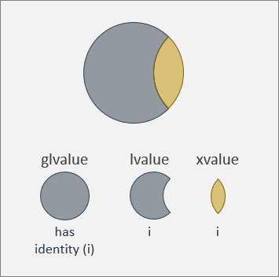
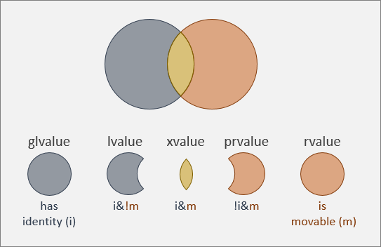

# Value categories, and references to them
This topic introduces and describes the various categories of values (and references to values) that exist in C++:

* glvalue
* lvalue
* xlvalue
* prvalue
* rvalue

You'll doubtless have heard of *lvalues* and *rvalues*. But you might not think of them in the terms that this topic presents.

Every expression in C++ yields a value that belongs to one of the five categories listed above. There are aspects of the C++ language&mdash;its facilities and rules&mdash;that demand a proper understanding of these value categories, as well as references to them. These aspects include taking the address of a value, copying a value, moving a value, and forwarding a value on to another function. This topic doesn't go into all of those aspects in depth, but it provides foundational information for a solid understanding of them.

The info in this topic is framed in terms of Stroustrup's analysis of value categories by the two independent properties of identity and movability [Stroustrup, 2013].

## An lvalue has identity
What does it mean for a value to have *identity*? If you have (or you can take) the memory address of a value, and use it safely, then the value has identity. That way, you can do more than compare the contents of values&mdash;you can compare or distinguish them by identity.

An *lvalue* has identity. It's now a matter of only historical interest that the "l" in "lvalue" is an abbreviation of "left" (as in, the left-hand-side of an assignment). In C++, an lvalue can appear on the left *or* on the right of an assignment. The "l" in "lvalue", then, doesn't actually help you to comprehend nor define what they are. You need only to understand that what we call an lvalue is a value that has identity.

Examples of expressions that are lvalues include: a named variable or constant; or a function that returns a reference. Examples of expressions that are *not* lvalues include: a temporary; or a function that returns by value.

```cppwinrt
int& get_by_ref() { ... }
int get_by_val() { ... }

int main()
{
    std::vector<byte> vec{ 99, 98, 97 };
    std::vector<byte>* addr1{ &vec }; // ok: vec is an lvalue.
    int* addr2{ &get_by_ref() }; // ok: get_by_ref() is an lvalue.

    int* addr3{ &(get_by_ref() + 1) }; // Error: get_by_ref() + 1 is not an lvalue.
    int* addr4{ &get_by_val() }; // Error: get_by_val() is not an lvalue.
}
```

Now, while it's a true statement that lvalues have identity, that's also true of xvalues. We'll go into exactly what an *xvalue* is later in this topic. For now, just be aware that there's a value category called *glvalue* (for "generalized lvalue"). The set of glvalues is the superset of both lvalues (also known as *classical lvalues*) and xvalues. So, while "an lvalue has identity" is true, the complete set of things that have identity is the set of glvalues, as shown in this illustration.



## An rvalue is movable; an lvalue is not
But there are values that are not glvalues. In other words, there are values that you *can't* obtain a memory address for (or you can't rely on it to be valid). We saw some such values in the code example above.

Not having a reliable memory address sounds like a disadvantage. But in fact the advantage of a value like that is that you can *move* it (which is generally cheap), rather than copy it (which is generally expensive). Moving a value means that it's no longer in the place where it used to be. So trying to access it in the place where it used to be is something to be avoided. A discussion of when and *how* to move a value is out of scope for this topic. For this topic, we just need to know that a movable value is known as an *rvalue* (or *classical rvalue*).

The "r" in "rvalue" is an abbreviation of "right" (as in, the right-hand-side of an assignment). But you can use rvalues, and references to rvalues, outside of assignments. The "r" in "rvalue", then, is not the thing to focus on. You need only to understand that what we call an rvalue is a value that is movable.

An lvalue, conversely, is not movable, as shown in this illustration. If an lvalue were to move, then that would contradict the very definition of *lvalue*. And it would be an unexpected problem for code that very reasonably expected to be able to continue to access the lvalue.


So you can't move an lvalue. But there *is* a kind of glvalue (the set of things with identity) that you can move&mdash;if you know what you're doing (including being careful not to access it after the move)&mdash;and that's the xvalue. We'll revisit that idea one more time later in this topic when we look at the complete picture of value categories.

## Rvalue references, and reference-binding rules
This section introduces the syntax for a reference to an rvalue. We'll have to wait for another topic to go into a substantial treatment of moving and forwarding, but suffice to say that rvalue references are a necessary piece of the solution of those problems. Before we look at rvalue references, though, we first need to be clearer about `T&`&mdash;the thing we've formerly been calling just "a reference". It's really "an lvalue (non-const) reference", which refers to a value to which the user of the reference can write.

```cppwinrt
template<typename T> T& get_by_lvalue_ref() { ... } // Get by lvalue (non-const) reference.
template<typename T> void set_by_lvalue_ref(T&) { ... } // Set by lvalue (non-const) reference.
```

An lvalue reference can bind to an lvalue, but not to an rvalue.

Then there are lvalue const references (`T const&`), which refer to objects to which the user of the reference *can't* write (for example, a constant).

```cppwinrt
template<typename T> T const& get_by_lvalue_cref() { ... } // Get by lvalue const reference.
template<typename T> void set_by_lvalue_cref(T const&) { ... } // Set by lvalue const reference.
```

An lvalue const reference can bind to an lvalue or to an rvalue.

The syntax for a reference to an rvalue of type `T` is written as `T&&`. An rvalue reference refers to a movable value&mdash;a value whose contents we don't need to preserve after we've used it (for example, a temporary). Since the whole point is to move from (thereby modifying) the value bound to an rvalue reference, `const` and `volatile` qualifiers (also known as cv-qualifiers) don't apply to rvalue references.

```cppwinrt
template<typename T> T&& get_by_rvalue_ref() { ... } // Get by rvalue reference.
struct A { A(A&& other) { ... } }; // A move constructor takes an rvalue reference.
```

An rvalue reference binds to an rvalue. In fact, in terms of overload resolution, an rvalue *prefers* to be bound to an rvalue reference than to an lvalue const reference. But an rvalue reference can't bind to an lvalue because, as we've said, an rvalue reference refers to a value whose contents it's assumed we don't need to preserve (say, the parameter for a move constructor).

You can also pass an rvalue where a by-value argument is expected, via copy construction (or via move construction if the rvalue is an xvalue).

## A glvalue has identity; a prvalue does not
At this stage, we know what has identity. And we know what's movable and what isn't. But we haven't yet named the set of values that *don't* have identity. That set is known as the *prvalue*, or *pure rvalue*.

```cppwinrt
int& get_by_ref() { ... }
int get_by_val() { ... }

int main()
{
    int* addr3{ &(get_by_ref() + 1) }; // Error: get_by_ref() + 1 is a prvalue.
    int* addr4{ &get_by_val() }; // Error: get_by_val() is a prvalue.
}
```


## The complete picture of value categories
It only remains to combine the info and illustrations above into a single, big picture.



### glvalue (i)
A glvalue (generalized lvalue) has identity. We'll use "i" as a shorthand for "has identity".

### lvalue (i\&\!m)
An lvalue (a kind of glvalue) has identity, but isn't movable. These are typically read-write values that you pass around by reference or by const reference, or by value if copying is cheap. An lvalue can't be bound to an rvalue reference.

### xvalue (i\&m)
An xvalue (a kind of glvalue, but also a kind of rvalue) has identity, and is also movable. This might be an erstwhile lvalue that you've decided to move because copying is expensive, and you'll be careful not to access it afterward. Here's how you can turn an lvalue into an xvalue.

```cppwinrt
struct A { ... };
A a; // a is an lvalue...
static_cast<A&&>(a); // ...but this expression is an xvalue.
```

In the code example above, we haven't moved anything yet. We've merely created an xvalue by casting an lvalue to an unnamed rvalue reference. It can still be identified by its lvalue name; but, as an xvalue, it is now *capable* of being moved. The reasons for moving it, and what moving actually looks like, will have to wait for another topic. But you can think of the "x" in "xvalue" as meaning "expert-only" if that helps. By casting an lvalue into an xvalue (a kind of rvalue, remember), the value then becomes capable of being bound to an rvalue reference.

Here are two other examples of xvalues&mdash;calling a function that returns an unnamed rvalue reference, and accessing a member of an xvalue.

```cppwinrt
struct A { int m; };
A&& f();
f(); // This expression is an xvalue...
f().m; // ...and so is this.
```

### prvalue (\!i\&m)
A prvalue (pure rvalue; a kind of rvalue) doesn't have identity, but is movable. These are typically temporaries, or the result of calling a function that returns by value, or the result of evaluating any other expression that's not a glvalue.

### rvalue (m)
An rvalue is movable. We'll use "m" as a shorthand for "is movable".

An rvalue *reference* always refers to an rvalue (a value whose contents it's assumed we don't need to preserve).

But, is an rvalue reference itself an rvalue? An *unnamed* rvalue reference (like the ones shown in the xvalue code examples above) is an xvalue so, yes, it's an rvalue. It prefers to be bound to an rvalue reference function parameter, such as that of a move constructor. Conversely (and perhaps counter-intuitively), if an rvalue reference has a name, then the expression consisting of that name is an lvalue. So it *can't* be bound to an rvalue reference parameter. But it's easy to make it do so&mdash;just cast it to an unnamed rvalue reference (an xvalue) again.

```cppwinrt
void foo(A&) { ... }
void foo(A&&) { ... }
void bar(A&& a) // a is a named rvalue reference; so it's an lvalue.
{
    foo(a); // Calls foo(A&).
    foo(static_cast<A&&>(a)); // Calls foo(A&&).
}
A&& get_by_rvalue_ref() { ... } // This unnamed rvalue reference is an xvalue.
```

### \!i\&\!m
The kind of value that doesn't have identity and isn't movable is the one combination that we haven't yet discussed. But we can disregard it, because that category isn't a useful idea in the C++ language.

## Reference-collapsing rules
Multiple like references in an expression (an lvalue reference to an lvalue reference, or an rvalue reference to an rvalue reference) cancel one another out.

- `A& &` collapses into `A&`.
- `A&& &&` collapses into `A&&`.

Multiple unlike references in an expression collapse to an lvalue reference.

- `A& &&` collapses into `A&`.
- `A&& &` collapses into `A&`.

## Forwarding references
This final section contrasts rvalue references, which we've already discussed, with the different concept of a *forwarding reference*. Before the term "forwarding reference" was coined, some folks used the term "universal reference".

```cppwinrt
void foo(A&& a) { ... }
```

- `A&&` is an rvalue reference, as we've seen. Const and volatile don't apply to rvalue references.
- `foo` accepts only rvalues of type **A**.
- The reason rvalue references (such as `A&&`) exist is so that you can author an overload that's optimized for the case of a temporary (or other rvalue) being passed.

```cppwinrt
template <typename _Ty> void bar(_Ty&& ty) { ... }
```

- `_Ty&&` is a *forwarding reference*. Depending what you pass to `bar`, type **_Ty** could be const/non-const independently of volatile/non-volatile.
- `bar` accepts any lvalue or rvalue of type **_Ty**.
- Passing an lvalue causes the forwarding reference to become `_Ty& &&`, which collapses to the lvalue reference `_Ty&`.
- Passing an rvalue causes the forwarding reference to become the rvalue reference `_Ty&&`.
- The reason forwarding references (such as `_Ty&&`) exist is *not* for optimization, but to take what you pass to them and to forward it on transparently and efficiently. You're likely to encounter a forwarding reference only if you write (or closely study) library code&mdash;for example, a factory function that forwards on constructor arguments.

## Sources
* \[Stroustrup, 2013\] B. Stroustrup: The C++ Programming Language, Fourth Edition. Addison-Wesley. 2013.
