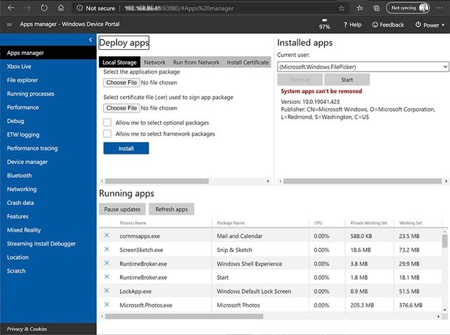

# Windows Device Portal for Desktop

Windows Device Portal (WDP) is a device management and debugging tool that lets you configure and manage device settings and view diagnostic information over HTTP from a web browser. For WDP details on other devices, see [Windows Device Portal overview](device-portal.md).

You can use the WDP for the following:

- Manage device settings (similar to the **Windows Settings** app)
- See and manipulate a list of running processes
- Install, delete, launch, and terminate apps
- Change Wi-Fi profiles, view signal strength, and see ipconfig details
- View live graphs of CPU, memory, I/O, network, and GPU usage
- Collect process dumps
- Collect ETW traces
- Manipulate the isolated storage of sideloaded apps

## Set up Windows Device Portal on a Desktop device

### Turn on developer mode

Starting in Windows 10, version 1607, some of the newer features for desktop are only available when developer mode is enabled. For information about how to enable developer mode, see [Enable your device for development](/windows/apps/get-started/enable-your-device-for-development).

> [!IMPORTANT]
> Sometimes, due to network or compatibility issues, developer mode won't install correctly on your device. See the [relevant section of Enable your device for development](/windows/apps/get-started/enable-your-device-for-development#failure-to-install-developer-mode-package) for help troubleshooting these issues.

### Turn on Windows Device Portal

You can enable WDP in the **For developers** section of **Settings** (Settings -> Privacy & security -> For developers). When you enable it, you must also create a corresponding username and password. Do not use your Microsoft account or other Windows credentials.

Once WDP is enabled, you will see web links at the bottom of the section. Take note of the port number appended to the end of the listed URLs: this number is randomly generated when WDP is enabled but should remain consistent between reboots of the desktop.

These links offer two ways to connect to WDP: over the local network (including VPN) or through the local host. Once you connect, it should look something like this:

### Turn off Windows Device Portal

You can disable WDP in the **For developers** section of **Windows Settings**.

### Connect to Windows Device Portal

To connect through local host, open a browser window and enter the one of the URIs shown here (based on the connection type you're using).

- Localhost: `http://127.0.0.1:<PORT>` or `http://localhost:<PORT>`
- Local Network: `https://<IP address of the desktop>:<PORT>`

HTTPS is required for authentication and secure communication.

If you are using WDP in a protected environment, for example, in a test lab, in which you trust everyone on your local network, have no personal information on the device, and have unique requirements, you can disable the Authentication option. This enables unencrypted communication, and allows anyone with the IP address of your computer to connect to and control it.

## Windows Device Portal content

WDP provides the following set of pages.

- Apps manager
- Xbox Live
- File explorer
- Running Processes
- Performance
- Debug
- ETW (Event Tracing for Windows) logging
- Performance tracing
- Device manager
- Bluetooth
- Networking
- Crash data
- Features
- Mixed Reality
- Streaming Install Debugger
- Location
- Scratch

## Using Windows Device Portal to test and debug MSIX apps

The following video describes how to test and debug [MSIX apps](/windows/msix/overview) remotely using Windows Device Portal.

> [!VIDEO https://www.youtube.com/embed/PdgXeOMt4hk]

## More Windows Device Portal options

The following sections provide details on other Windows Device Portal options.

### Registry-based configuration

If you would like to select port numbers for WDP (such as 80 and 443), you can set the following regkeys:

- Under `HKEY_LOCAL_MACHINE\SOFTWARE\Microsoft\Windows\CurrentVersion\WebManagement\Service`
  - `UseDynamicPorts`: A required DWORD. Set this to 0 in order to retain the port numbers you've chosen.
  - `HttpPort`: A required DWORD. Contains the port number on which WDP listens for HTTP connections.
  - `HttpsPort`: A required DWORD. Contains the port number on which WDP listens for HTTPS connections.

Under the same regkey path, you can also turn off the authentication requirement:

- `UseDefaultAuthorizer` - `0` for disabled, `1` for enabled.  
  - This controls both the basic auth requirement for each connection and the redirect from HTTP to HTTPS.  

### Command line options for Windows Device Portal

From an administrative command prompt, you can enable and configure parts of WDP. To see the latest set of commands supported on your build, you can run `webmanagement /?`

- `sc start webmanagement` or `sc stop webmanagement`
  - Turn the service on or off. This still requires developer mode to be enabled.
- `-Credentials <username> <password>`
  - Set a username and password for WDP. The username must conform to Basic Auth standards, so cannot contain a colon (:) and should be built out of standard ASCII characters for example, [a-zA-Z0-9] as browsers do not parse the full character set in a standard way.  
- `-DeleteSSL`
  - This resets the SSL certificate cache used for HTTPS connections. If you encounter TLS connection errors that cannot be bypassed (as opposed to the expected certificate warning), this option may fix the problem for you.
- `-SetCert <pfxPath> <pfxPassword>`
  - See [Provisioning Windows Device Portal with a custom SSL certificate](./device-portal-ssl.md) for details.  
  - This allows you to install your own SSL certificate to fix the SSL warning page that is typically seen in WDP.
- `-Debug <various options for authentication, port selection, and tracing level>`
  - Run a standalone version of WDP with a specific configuration and visible debug messages. This is most useful for building a [packaged plugin](./device-portal-plugin.md).
  - See the [MSDN Magazine article](/archive/msdn-magazine/2017/october/windows-device-portal-write-a-windows-device-portal-packaged-plug-in) for details on how to run this as System to fully test your packaged plugin.

## Troubleshooting

Below are some common errors that you may encounter when setting up Windows Device Portal.

### WindowsUpdateSearch returns invalid number of updates (0x800f0950)

You may get this error when trying to install the developer packages on a pre-release build of Windows. These Feature-on-Demand (FoD) packages are hosted on Windows Update, and downloading them on pre-release builds requires that you opt into flighting. If your installation is not opted into flighting for the right build and ring combination, the payload will not be downloadable. Double-check the following:

1. Navigate to **Settings > Update & Security > Windows Insider Program** and confirm that the **Windows Insider account** section has your correct account info. If you don't see that section, select **Link a Windows Insider account**, add your email account, and confirm that it shows up under the **Windows Insider account** heading (you may need to select **Link a Windows Insider account** a second time to actually link a newly added account).

2. Under **What kind of content would you like to receive?**, make sure **Active development of Windows** is selected.

3. Under **What pace do you want to get new builds?**, make sure **Windows Insider Fast** is selected.

4. You should now be able to install the FoDs. If you've confirmed that you're on Windows Insider Fast and still cannot install the FoDs, please provide feedback and attach the log files under **C:\Windows\Logs\CBS**.

### [SC] StartService: OpenService FAILED 1060: The specified service does not exist as an installed service

You may get this error if the developer packages aren't installed. Without the developer packages, there is no web management service. Try installing the developer packages again.

### CBS cannot start download because the system is on metered network (CBS_E_METERED_NETWORK)

You may get this error if you're on a metered internet connection. You won't be able to download the developer packages on a metered connection.

## See also

- [Windows Device Portal overview](device-portal.md)
- [Windows Device Portal core API reference](./device-portal-api-core.md)
