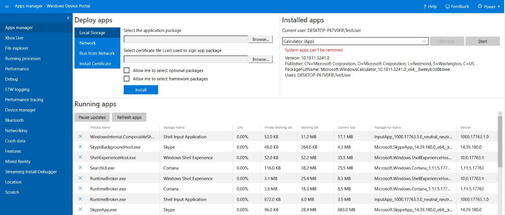
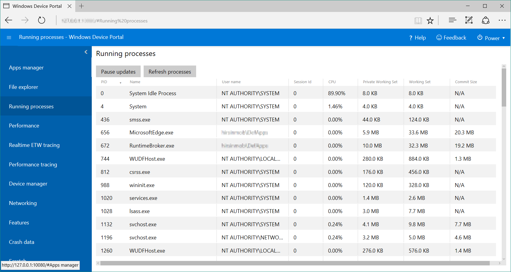
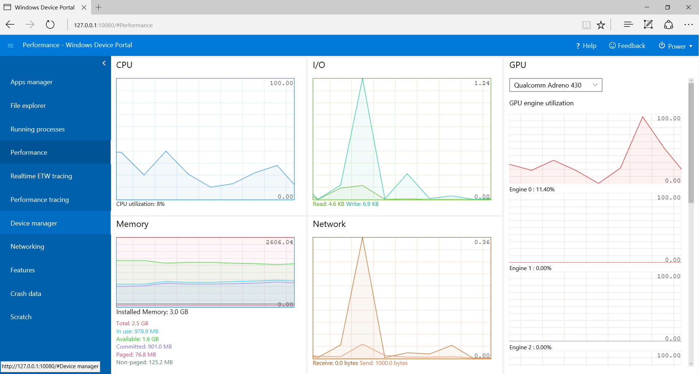
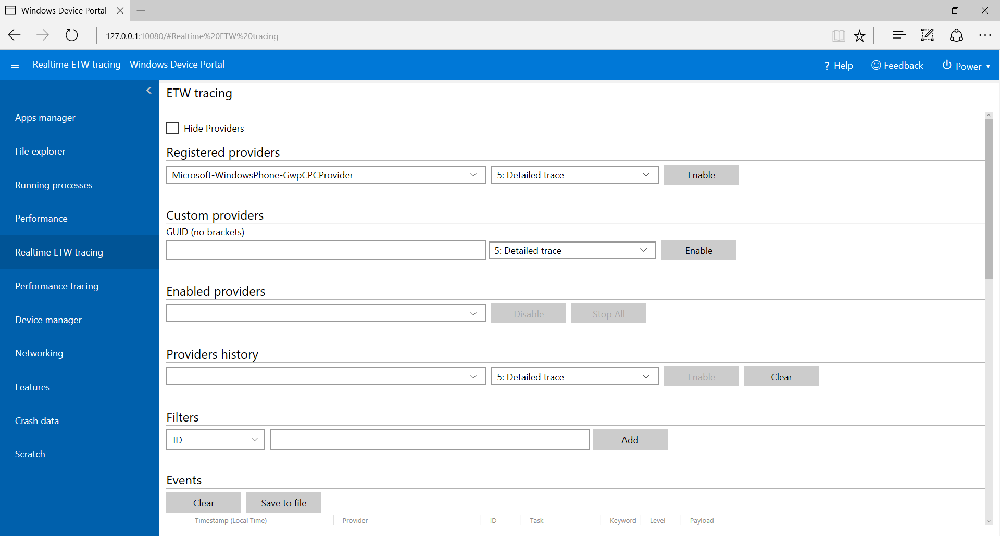
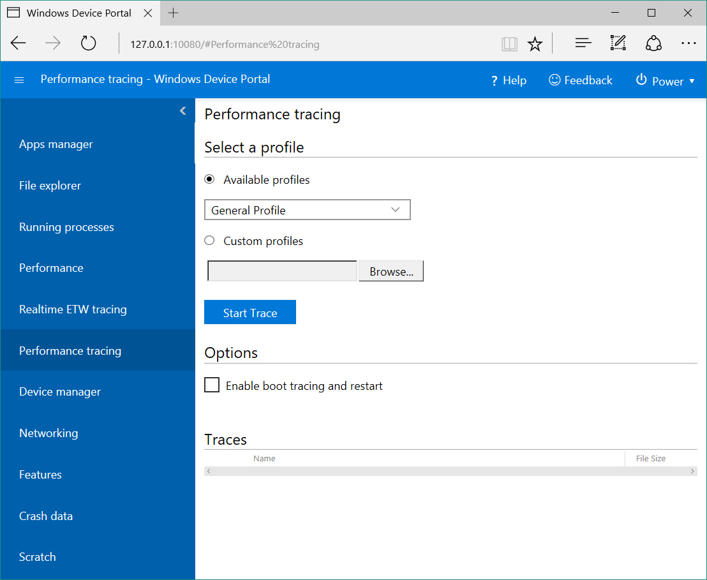
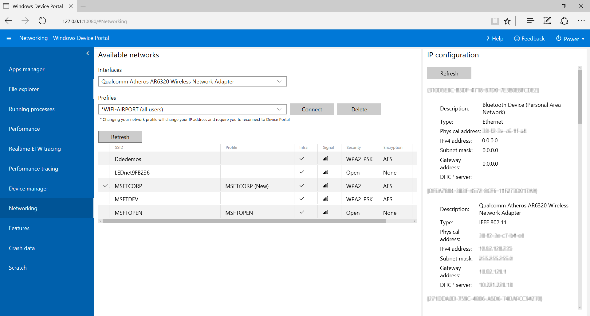

# Windows Device Portal overview

The Windows Device Portal (WDP) is a web server included with Windows devices that lets you configure and manage the settings for the device over a network or USB connection (local connections are also supported on devices with a web browser).

WDP also provides advanced diagnostic tools for troubleshooting and viewing the real-time performance of your Windows device.

WDP functionality is programmatically exposed through a collection of [REST APIs](device-portal-api-core.md).

This article provides a general description of the Windows Device Portal and includes links to articles with more specific information on each Windows device family.

> [!NOTE]
> A device family identifies the APIs, system characteristics, and behaviors that you can expect across a class of devices.

## Setup

Each device family provides a version of the WDP, but features and setup vary based on the requirements of a device.

These are the basic steps for all devices.

1. Enable Developer Mode and Device Portal on your device (Settings -> Privacy & security -> For developers).

2. Connect your device and PC through a local network or with USB.

3. Navigate to the Device Portal page in your browser. This table shows the ports and protocols used by each device family.

The following table includes device-specific details for the WDP.

> [!NOTE]
> Windows Mixed Reality runs on regular desktop, so it’s the same portal as Desktop.

Device family | On by default? | HTTP | HTTPS | USB | Instructions |
--------------|----------------|------|-------|-----|--------------|
Desktop and IoT Enterprise| Enable inside Dev Mode | 50080\* | 50043\* | N/A | [Device Portal for Desktop or IoT Enterprise device](device-portal-desktop.md#set-up-windows-device-portal-on-a-desktop-device) |
Xbox | Enable inside Dev Mode | Disabled | 11443 | N/A | [Device Portal for Xbox](../xbox-apps/device-portal-xbox.md) |
HoloLens | Yes, in Dev Mode | 80 (default) | 443 (default) | `http://127.0.0.1:10080` | [Device Portal for HoloLens](/windows/mixed-reality/develop/platform-capabilities-and-apis/using-the-windows-device-portal) |
IoT Core| Yes, in Dev Mode | 8080 | Enable via regkey | N/A | [Device Portal for IoT Core](/windows/iot-core/manage-your-device/DevicePortal) |
Phone | Enable inside Dev Mode | 80| 443 | `http://127.0.0.1:10080` | [Device Portal for Mobile](device-portal-mobile.md) |

\* This is not always the case, as Device Portal on desktop claims ports in the ephemeral range (>50,000) to prevent collisions with existing port claims on the device. To learn more, see the [Registry-based configuration](device-portal-desktop.md#registry-based-configuration) section in [Windows Device Portal for Desktop](device-portal-desktop.md).  

## Features

### Toolbar and navigation

The toolbar at the top of the page provides access to commonly used features.

- **Power**: Access power options.
  - **Shutdown**: Turns off the device.
  - **Restart**: Cycles power on the device.
- **Help**: Opens the help page.

Use the links in the navigation pane along the left side of the page to navigate to the available management and monitoring tools for your device.

Tools that are common across device families are described here. Other options might be available depending on the device. For more info, see the specific page for your device type.

### Apps manager

The Apps manager provides install/uninstall and management functionality for app packages and bundles on the host device.



- **Deploy apps**: Deploy packaged apps from local, network, or web hosts and register loose files from network shares.
- **Installed apps**: Use the dropdown menu to remove or start apps that are installed on the device.
- **Running apps**: Get information about the apps that are currently running and close them as necessary.

#### Install (sideload) an app

You can sideload apps during development using Windows Device Portal:

1. When you've created an app package, you can remotely install it onto your device. After you build it in Visual Studio, an output folder is generated.

    

2. In Windows Device Portal, navigate to the **Apps manager** page.

3. In the **Deploy apps** section, select **Local Storage**.

4. Under **Select the application package**, select **Choose File** and browse to the app package that you want to sideload.

5. Under **Select certificate file (.cer) used to sign app package**, select **Choose File** and browse to the certificate associated with that app package.

6. Check the respective boxes if you want to install optional or framework packages along with the app installation, and select **Next** to choose them.

7. Select **Install** to initiate the installation.

8. If the device is running Windows 10 in S mode, and it is the first time that the given certificate has been installed on the device, restart the device.

#### Install a certificate

Alternatively, you can install the certificate via Windows Device Portal, and install the app through other means:

1. In Windows Device Portal, navigate to the **Apps manager** page.

2. In the **Deploy apps** section, select **Install Certificate**.

3. Under **Select certificate file (.cer) used to sign an app package**, select **Choose File** and browse to the certificate associated with the app package that you want to sideload.

4. Select **Install** to initiate the installation.

5. If the device is running Windows 10 in S mode, and it is the first time that the given certificate has been installed on the device, restart the device.

#### Uninstall an app

1. Ensure that your app is not running.
2. If it is, go to **Running apps** and close it. If you attempt to uninstall while the app is running, it will cause issues when you attempt to reinstall the app.
3. Select the app from the dropdown and click **Remove**.

### Running processes

This page shows details about processes currently running on the host device. This includes both apps and system processes. On some platforms (Desktop, IoT, and HoloLens), you can terminate processes.



### File explorer

This page allows you to view and manipulate files stored by any sideloaded apps. See the [Using the App File Explorer](https://blogs.windows.com/buildingapps/2016/06/08/using-the-app-file-explorer-to-see-your-app-data/) blog post to learn more about the File explorer and how to use it.


### Performance

The Performance page shows real-time graphs of system diagnostic info like power usage, frame rate, and CPU load.

These are the available metrics:

- **CPU**: Percent of total available CPU utilization
- **Memory**: Total, in use, available, committed, paged, and non-paged
- **I/O**: Read and write data quantities
- **Network**: Received and sent data
- **GPU**: Percent of total available GPU engine utilization



### Event Tracing for Windows (ETW) logging

The ETW logging page manages real-time Event Tracing for Windows (ETW) information on the device.



Check **Hide providers** to show the Events list only.

- **Registered providers**: Select the event provider and the tracing level. The tracing level is one of these values:
  1. Abnormal exit or termination
  2. Severe errors
  3. Warnings
  4. Non-error warnings
  5. Detailed trace

  Click or tap **Enable** to start tracing. The provider is added to the **Enabled Providers** dropdown.
- **Custom providers**: Select a custom ETW provider and the tracing level. Identify the provider by its GUID. Do not include brackets in the GUID.
- **Enabled providers**: This lists the enabled providers. Select a provider from the dropdown and click or tap **Disable** to stop tracing. Click or tap **Stop all** to suspend all tracing.
- **Providers history**: This shows the ETW providers that were enabled during the current session. Click or tap **Enable** to activate a provider that was disabled. Click or tap **Clear** to clear the history.
- **Filters / Events**: The **Events** section lists ETW events from the selected providers in table format. The table is updated in real time. Use the **Filters** menu to set up custom filters for which events will be displayed. Click the **Clear** button to delete all ETW events from the table. This does not disable any providers. You can click **Save to file** to export the currently collected ETW events to a local CSV file.

For more details on using ETW logging, see the [Use Device Portal to view debug logs](https://blogs.windows.com/buildingapps/2016/06/10/using-device-portal-to-view-debug-logs-for-uwp/) blog post.

### Performance tracing

The [Windows Performance Toolkit](/windows-hardware/test/wpt/) includes the Performance tracing page, which allows you for view the  [Windows Performance Recorder (WPR)](/windows-hardware/test/wpt/#windows-performance-recorder) traces from the host device.



- **Available profiles**: Select the WPR profile from the dropdown, and click or tap **Start** to start tracing.
- **Custom profiles**: Click or tap **Browse** to choose a WPR profile from your PC. Click or tap **Upload and start** to start tracing.

To stop the trace, click **Stop**. Stay on this page until the trace file (.ETL) has finished downloading.

Captured .ETL files can be opened for analysis in the [Windows Performance Analyzer](/windows-hardware/test/wpt/#windows-performance-analyzer).

### Device manager

The Device manager page enumerates all peripherals attached to your device. You can click the settings icons to view the properties of each.


### Networking

The Networking page manages network connections on the device. Unless you are connected to Device Portal through USB, changing these settings will likely disconnect you from Device Portal.

- **Available networks**: Shows the WiFi networks available to the device. Clicking or tapping on a network will allow you to connect to it and supply a passkey if needed. Device Portal does not yet support Enterprise Authentication. You can also use the **Profiles** dropdown to attempt to connect to any of the WiFi profiles known to the device.
- **IP configuration**: Shows address information about each of the host device's network ports.



## Service features and notes

### DNS-SD

Device Portal advertises its presence on the local network using DNS-SD. All Device Portal instances, regardless of their device type, advertise under "WDP._wdp._tcp.local". The TXT records for the service instance provide the following:

Key | Type | Description
----|------|-------------
S | int | Secure port for Device Portal. If 0 (zero), Device Portal is not listening for HTTPS connections.
D | string | Type of device. This will be in the format "Windows.*", for example, Windows.Xbox or Windows.Desktop
A | string | Device architecture. This will be Arm, x86, or AMD64.  
T | null-character delineated list of strings | User-applied tags for the device. See the Tags REST API for how to use this. List is double-null terminated.  

Connecting on the HTTPS port is suggested, as not all devices are listening on the HTTP port advertised by the DNS-SD record.

### CSRF Protection and Scripting

In order to protect against [CSRF attacks](https://en.wikipedia.org/wiki/Cross-site_request_forgery), a unique token is required on all non-GET requests. This token, the X-CSRF-Token request header, is derived from a session cookie, CSRF-Token. In the Device Portal web UI, the CSRF-Token cookie is copied into the X-CSRF-Token header on each request.

> [!IMPORTANT]
> This protection prevents usages of the REST APIs from a standalone client (such as command-line utilities). This can be solved in 3 ways:
>
> - Use an "auto-" username. Clients that prepend "auto-" to their username will bypass CSRF protection. It is important that this username not be used to log in to Device Portal through the browser, as it will open up the service to CSRF attacks. Example: If Device Portal's username is "admin", ```curl -u auto-admin:password <args>``` should be used to bypass CSRF protection.
> - Implement the cookie-to-header scheme in the client. This requires a GET request to establish the session cookie, and then the inclusion of both the header and the cookie on all subsequent requests.
> - Disable authentication and use HTTP. CSRF protection only applies to HTTPS endpoints, so connections on HTTP endpoints will not need to do either of the above.

#### Cross-Site WebSocket Hijacking (CSWSH) protection

To protect against [CSWSH attacks](https://www.christian-schneider.net/CrossSiteWebSocketHijacking.html), all clients opening a WebSocket connection to Device Portal must also provide an Origin header that matches the Host header. This proves to Device Portal that the request comes either from the Device Portal UI or a valid client application. Without the Origin header your request will be rejected.

## See also

[Device Portal core API reference](device-portal-api-core.md)
