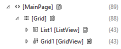

# Optimize your XAML markup


Parsing XAML markup to construct objects in memory is time-consuming for a complex UI. Here are some things you can do to improve the parse and load time of your XAML markup and the memory efficiency of your app.

At app startup, limit the XAML markup that is loaded to only what you need for your initial UI. Examine the markup in your initial page (including page resources) and confirm that you aren't loading extra elements that aren't needed right away. These elements can come from a variety of sources, such as resource dictionaries, elements that are initially collapsed, and elements drawn over other elements.

Optimizing your XAML for efficiency requires making trade-offs; there's not always a single solution for every situation. Here, we look at some common issues and provide guidelines you can use to make the right trade-offs for your app.

## Minimize element count

Although the XAML platform is capable of displaying large numbers of elements, you can make your app lay out and render faster by using the fewest number of elements to achieve the visuals you want.

The choices you make in how you lay out your UI controls will affect the number of UI elements that are created when your app starts. For more detailed information about optimizing layout, see [Optimize your XAML layout](optimize-your-xaml-layout.md).

Element count is extremely important in data templates because each element is created again for each data item. For info about reducing element count in a list or grid, see *Element reduction per item* in the [ListView and GridView UI optimization](optimize-gridview-and-listview.md) article.

Here, we look at some other ways you can reduce the number of elements your app has to load at startup.

### Defer item creation

If your XAML markup contains elements that you don't show right away, you can defer loading those elements until they are shown. For example, you can delay the creation of non-visible content such as a secondary tab in a tab-like UI. Or, you might show items in a grid view by default, but provide an option for the user to view the data in a list instead. You can delay loading the list until it's needed.

Use the [x:Load attribute](../xaml-platform/x-load-attribute.md) instead of the [Visibility](/uwp/api/windows.ui.xaml.uielement.Visibility) property to control when an element is shown. When an element's visibility is set to **Collapsed**, then it is skipped during the render pass, but you still pay the object instance costs in memory. When you use x:Load instead, the framework does not create the object instance until it is needed, so the memory costs are even lower. The drawback is you pay a small memory overhead (approx 600 bytes) when the UI is not loaded.

> [!NOTE]
> You can delay loading elements using the [x:Load](../xaml-platform/x-load-attribute.md) or [x:DeferLoadStrategy](../xaml-platform/x-deferloadstrategy-attribute.md) attribute. The x:Load attribute is available starting in Windows 10 Creators Update (version 1703, SDK build 15063). The min version targeted by your Visual Studio project must be *Windows 10 Creators Update (10.0, Build 15063)* in order to use x:Load. To target earlier versions, use x:DeferLoadStrategy.

The following examples show the difference in element count and memory use when different techniques are used to hide UI elements. A ListView and a GridView containing identical items are placed in a page's root Grid. The ListView is not visible, but the GridView is shown. The XAML in each of these examples produces the same UI on the screen. We use Visual Studio's [tools for profiling and performance](tools-for-profiling-and-performance.md) to check the element count and memory use.

#### Option 1 - Inefficient

Here, the ListView is loaded, but is not visible because it's Width is 0. The ListView and each of its child elements is created in the visual tree and loaded into memory.

```xaml
<!-- NOTE: EXAMPLE OF INEFFICIENT CODE; DO NOT COPY-PASTE.-->
<Grid Background="{ThemeResource ApplicationPageBackgroundThemeBrush}">

    <ListView x:Name="List1" Width="0">
        <ListViewItem>Item 1</ListViewItem>
        <ListViewItem>Item 2</ListViewItem>
        <ListViewItem>Item 3</ListViewItem>
        <ListViewItem>Item 4</ListViewItem>
        <ListViewItem>Item 5</ListViewItem>
        <ListViewItem>Item 6</ListViewItem>
        <ListViewItem>Item 7</ListViewItem>
        <ListViewItem>Item 8</ListViewItem>
        <ListViewItem>Item 9</ListViewItem>
        <ListViewItem>Item 10</ListViewItem>
    </ListView>

    <GridView x:Name="Grid1">
        <GridViewItem>Item 1</GridViewItem>
        <GridViewItem>Item 2</GridViewItem>
        <GridViewItem>Item 3</GridViewItem>
        <GridViewItem>Item 4</GridViewItem>
        <GridViewItem>Item 5</GridViewItem>
        <GridViewItem>Item 6</GridViewItem>
        <GridViewItem>Item 7</GridViewItem>
        <GridViewItem>Item 8</GridViewItem>
        <GridViewItem>Item 9</GridViewItem>
        <GridViewItem>Item 10</GridViewItem>
    </GridView>
</Grid>
```

Live visual tree with the ListView loaded. Total element count for the page is 89.



ListView and its children are loaded into memory.


#### Option 2 - Better

Here, the ListView's Visibility is set to collapsed (the other XAML is identical to the original). The ListView is created in the visual tree, but its child elements are not. However, they are loaded into memory, so memory use is identical to the previous example.

```xaml
<ListView x:Name="List1" Visibility="Collapsed">
```

Live visual tree with the ListView collapsed. Total element count for the page is 46.


ListView and its children are loaded into memory.


#### Option 3 - Most Efficient

Here, the ListView has the x:Load attribute set to **False** (the other XAML is identical to the original). The ListView is not created in the visual tree or loaded into memory at start up.

```xaml
<ListView x:Name="List1" Visibility="Collapsed" x:Load="False">
```

Live visual tree with the ListView not loaded. Total element count for the page is 45.


ListView and its children are not loaded into memory.


> [!NOTE]
> The element counts and memory use in these examples are very small and are shown only to demonstrate the concept. In these examples, the overhead of using x:Load is greater than the memory savings, so the app would not benefit. You should use the profiling tools on your app to determine whether or not your app will benefit from deferred loading.

### Use layout panel properties

Layout panels have a [Background](/uwp/api/windows.ui.xaml.controls.panel.background) property so there's no need to put a [Rectangle](/uwp/api/Windows.UI.Xaml.Shapes.Rectangle) in front of a Panel just to color it.

**Inefficient**

```xaml
<!-- NOTE: EXAMPLE OF INEFFICIENT CODE; DO NOT COPY-PASTE. -->
<Grid>
    <Rectangle Fill="Black"/>
</Grid>
```

**Efficient**

```xaml
<Grid Background="Black"/>
```

Layout panels also have built-in border properties, so you don't need to put a [Border](/uwp/api/windows.ui.xaml.controls.border) element around a layout panel. See [Optimize your XAML layout](optimize-your-xaml-layout.md) for more info and examples.

### Use images in place of vector-based elements

If you reuse the same vector-based element enough times, it becomes more efficient to use an [Image](/uwp/api/windows.ui.xaml.controls.image) element instead. Vector-based elements can be more expensive because the CPU must create each individual element separately. The image file needs to be decoded only once.

## Optimize resources and resource dictionaries

You typically use [resource dictionaries](/windows/apps/design/style/xaml-resource-dictionary) to store, at a somewhat global level, resources that you want to reference in multiple places in your app. For example, styles, brushes, templates, and so on.

In general, we have optimized [ResourceDictionary](/uwp/api/Windows.UI.Xaml.ResourceDictionary) to not instantiate resources unless they're asked for. But there are situations you should avoid so that resources aren’t instantiated unnecessarily.

### Resources with x:Name

Use the [x:Key attribute](../xaml-platform/x-key-attribute.md) to reference your resources. Any resource with the [x:Name attribute](../xaml-platform/x-name-attribute.md) will not benefit from the platform optimization; instead, it is instantiated as soon as the ResourceDictionary is created. This happens because x:Name tells the platform that your app needs field access to this resource, so the platform needs to create something to create a reference to.

### ResourceDictionary in a UserControl

A ResourceDictionary defined inside of a [UserControl](/uwp/api/windows.ui.xaml.controls.usercontrol) carries a penalty. The platform creates a copy of such a ResourceDictionary for every instance of the UserControl. If you have a UserControl that is used a lot, then move the ResourceDictionary out of the UserControl and put it at the page level.

### Resource and ResourceDictionary scope

If a page references a user control or a resource defined in a different file, then the framework parses that file, too.

Here, because _InitialPage.xaml_ uses one resource from _ExampleResourceDictionary.xaml_, the whole of _ExampleResourceDictionary.xaml_ must be parsed at startup.

**InitialPage.xaml.**

```xaml
<Page x:Class="ExampleNamespace.InitialPage" ...>
    <Page.Resources>
        <ResourceDictionary>
            <ResourceDictionary.MergedDictionaries>
                <ResourceDictionary Source="ExampleResourceDictionary.xaml"/>
            </ResourceDictionary.MergedDictionaries>
        </ResourceDictionary>
    </Page.Resources>

    <Grid>
        <TextBox Foreground="{StaticResource TextBrush}"/>
    </Grid>
</Page>
```

**ExampleResourceDictionary.xaml.**

```xaml
<ResourceDictionary>
    <SolidColorBrush x:Key="TextBrush" Color="#FF3F42CC"/>

    <!--This ResourceDictionary contains many other resources that
        are used in the app, but are not needed during startup.-->
</ResourceDictionary>
```

If you use a resource on many pages throughout your app, then storing it in _App.xaml_ is a good practice, and avoids duplication. But _App.xaml_ is parsed at app startup so any resource that is used in only one page (unless that page is the initial page) should be put into the page's local resources. This example shows _App.xaml_ containing resources that are used by only one page (that's not the initial page). This needlessly increases app startup time.

**App.xaml**

```xaml
<!-- NOTE: EXAMPLE OF INEFFICIENT CODE; DO NOT COPY-PASTE. -->
<Application ...>
     <Application.Resources>
        <SolidColorBrush x:Key="DefaultAppTextBrush" Color="#FF3F42CC"/>
        <SolidColorBrush x:Key="InitialPageTextBrush" Color="#FF3F42CC"/>
        <SolidColorBrush x:Key="SecondPageTextBrush" Color="#FF3F42CC"/>
        <SolidColorBrush x:Key="ThirdPageTextBrush" Color="#FF3F42CC"/>
    </Application.Resources>
</Application>
```

**InitialPage.xaml.**

```xaml
<!-- NOTE: EXAMPLE OF INEFFICIENT CODE; DO NOT COPY-PASTE. -->
<Page x:Class="ExampleNamespace.InitialPage" ...>
    <StackPanel>
        <TextBox Foreground="{StaticResource InitialPageTextBrush}"/>
    </StackPanel>
</Page>
```

**SecondPage.xaml.**

```xaml
<!-- NOTE: EXAMPLE OF INEFFICIENT CODE; DO NOT COPY-PASTE. -->
<Page x:Class="ExampleNamespace.SecondPage" ...>
    <StackPanel>
        <Button Content="Submit" Foreground="{StaticResource SecondPageTextBrush}"/>
    </StackPanel>
</Page>
```

To make this example more efficient, move `SecondPageTextBrush` into _SecondPage.xaml_ and move `ThirdPageTextBrush` into _ThirdPage.xaml_. `InitialPageTextBrush` can remain in _App.xaml_ because application resources must be parsed at app startup in any case.

### Consolidate multiple brushes that look the same into one resource

The XAML platform tries to cache commonly-used objects so that they can be reused as often as possible. But XAML cannot easily tell if a brush declared in one piece of markup is the same as a brush declared in another. The example here uses [SolidColorBrush](/uwp/api/Windows.UI.Xaml.Media.SolidColorBrush) to demonstrate, but the case is more likely and more important with [GradientBrush](/uwp/api/Windows.UI.Xaml.Media.GradientBrush). Also check for brushes that use predefined colors; for example, `"Orange"` and `"#FFFFA500"` are the same color.

**Inefficient.**

```xaml
<!-- NOTE: EXAMPLE OF INEFFICIENT CODE; DO NOT COPY-PASTE. -->
<Page ... >
    <StackPanel>
        <TextBlock>
            <TextBlock.Foreground>
                <SolidColorBrush Color="#FFFFA500"/>
            </TextBlock.Foreground>
        </TextBlock>
        <Button Content="Submit">
            <Button.Foreground>
                <SolidColorBrush Color="#FFFFA500"/>
            </Button.Foreground>
        </Button>
    </StackPanel>
</Page>
```

To fix the duplication, define the brush as a resource. If controls in other pages use the same brush, move it to _App.xaml_.

**Efficient.**

```xaml
<Page ... >
    <Page.Resources>
        <SolidColorBrush x:Key="BrandBrush" Color="#FFFFA500"/>
    </Page.Resources>

    <StackPanel>
        <TextBlock Foreground="{StaticResource BrandBrush}" />
        <Button Content="Submit" Foreground="{StaticResource BrandBrush}" />
    </StackPanel>
</Page>
```

## Minimize overdrawing

Overdrawing occurs where more than one object is drawn in the same screen pixels. Note that there is sometimes a trade-off between this guidance and the desire to minimize element count.

Use [**DebugSettings.IsOverdrawHeatMapEnabled**](/uwp/api/windows.ui.xaml.debugsettings.isoverdrawheatmapenabled) as a visual diagnostic. You might find objects being drawn that you didn't know were in the scene.

### Transparent or hidden elements

If an element isn't visible because it's transparent or hidden behind other elements, and it's not contributing to layout, then delete it. If the element is not visible in the initial visual state but it is visible in other visual states, then use x:Load to control its state or set [Visibility](/uwp/api/windows.ui.xaml.uielement.visibility) to **Collapsed** on the element itself and change the value to **Visible** in the appropriate states. There will be exceptions to this heuristic: in general, the value a property has in the majority of visual states is best set locally on the element.

### Composite elements

Use a composite element instead of layering multiple elements to create an effect. In this example, the result is a two-toned shape where the top half is black (from the background of the [Grid](/uwp/api/Windows.UI.Xaml.Controls.Grid)) and the bottom half is gray (from the semi-transparent white [Rectangle](/uwp/api/Windows.UI.Xaml.Shapes.Rectangle) alpha-blended over the black background of the **Grid**). Here, 150% of the pixels necessary to achieve the result are being filled.

**Inefficient.**

```xaml
<!-- NOTE: EXAMPLE OF INEFFICIENT CODE; DO NOT COPY-PASTE. -->
<Grid Background="Black">
    <Grid.RowDefinitions>
        <RowDefinition Height="*"/>
        <RowDefinition Height="*"/>
    </Grid.RowDefinitions>
    <Rectangle Grid.Row="1" Fill="White" Opacity=".5"/>
</Grid>
```

**Efficient.**

```xaml
<Grid>
    <Grid.RowDefinitions>
        <RowDefinition Height="*"/>
        <RowDefinition Height="*"/>
    </Grid.RowDefinitions>
    <Rectangle Fill="Black"/>
    <Rectangle Grid.Row="1" Fill="#FF7F7F7F"/>
</Grid>
```

### Layout panels

A layout panel can have two purposes: to color an area, and to lay out child elements. If an element further back in z-order is already coloring an area then a layout panel in front does not need to paint that area: instead it can just focus on laying out its children. Here's an example.

**Inefficient.**

```xaml
<!-- NOTE: EXAMPLE OF INEFFICIENT CODE; DO NOT COPY-PASTE. -->
<GridView Background="Blue">
    <GridView.ItemTemplate>
        <DataTemplate>
            <Grid Background="Blue"/>
        </DataTemplate>
    </GridView.ItemTemplate>
</GridView>
```

**Efficient.**

```xaml
<GridView Background="Blue">
    <GridView.ItemTemplate>
        <DataTemplate>
            <Grid/>
        </DataTemplate>
    </GridView.ItemTemplate>
</GridView>
```

If the [Grid](/uwp/api/Windows.UI.Xaml.Controls.Grid) has to be hit-testable then set a background value of transparent on it.

### Borders

Use a [Border](/uwp/api/windows.ui.xaml.controls.border) element to draw a border around an object. In this example, a [Grid](/uwp/api/Windows.UI.Xaml.Controls.Grid) is used as a makeshift border around a [TextBox](/uwp/api/Windows.UI.Xaml.Controls.TextBox). But all the pixels in the center cell are overdrawn.

**Inefficient.**

```xaml
<!-- NOTE: EXAMPLE OF INEFFICIENT CODE; DO NOT COPY-PASTE. -->
<Grid Background="Blue" Width="300" Height="45">
    <Grid.RowDefinitions>
        <RowDefinition Height="5"/>
        <RowDefinition/>
        <RowDefinition Height="5"/>
    </Grid.RowDefinitions>
    <Grid.ColumnDefinitions>
        <ColumnDefinition Width="5"/>
        <ColumnDefinition/>
        <ColumnDefinition Width="5"/>
    </Grid.ColumnDefinitions>
    <TextBox Grid.Row="1" Grid.Column="1"></TextBox>
</Grid>
```

**Efficient.**

```xaml
<Border BorderBrush="Blue" BorderThickness="5" Width="300" Height="45">
    <TextBox/>
</Border>
```

### Margins

Be aware of margins. Two neighboring elements will overlap (possibly accidentally) if negative margins extend into another’s render bounds and cause overdrawing.

### Cache static content

Another source of overdrawing is a shape made from many overlapping elements. If you set [CacheMode](/uwp/api/Windows.UI.Xaml.Media.CacheMode) to **BitmapCache** on the [UIElement](/uwp/api/Windows.UI.Xaml.UIElement) that contains the composite shape then the platform renders the element to a bitmap once and then uses that bitmap each frame instead of overdrawing.

**Inefficient.**

```xaml
<Canvas Background="White">
    <Ellipse Height="40" Width="40" Fill="Blue"/>
    <Ellipse Canvas.Left="21" Height="40" Width="40" Fill="Blue"/>
    <Ellipse Canvas.Top="13" Canvas.Left="10" Height="40" Width="40" Fill="Blue"/>
</Canvas>
```


The image above is the result, but here's a map of the overdrawn regions. Darker red indicates higher amounts of overdraw.


**Efficient.**

```xaml
<Canvas Background="White" CacheMode="BitmapCache">
    <Ellipse Height="40" Width="40" Fill="Blue"/>
    <Ellipse Canvas.Left="21" Height="40" Width="40" Fill="Blue"/>
    <Ellipse Canvas.Top="13" Canvas.Left="10" Height="40" Width="40" Fill="Blue"/>
</Canvas>
```

Note the use of [CacheMode](/uwp/api/Windows.UI.Xaml.Media.CacheMode). Don't use this technique if any of the sub-shapes animate because the bitmap cache will likely need to be regenerated every frame, defeating the purpose.

## Use XBF2

XBF2 is a binary representation of XAML markup that avoids all text-parsing costs at runtime. It also optimizes your binary for load and tree creation, and allows "fast-path" for XAML types to improve heap and object creation costs, for example VSM, ResourceDictionary, Styles, and so on. It is completely memory-mapped so there is no heap footprint for loading and reading a XAML Page. In addition, it reduces the disk footprint of stored XAML pages in an appx. XBF2 is a more compact representation and it can reduce disk footprint of comparative XAML/XBF1 files by up to 50%. For example, the built-in Photos app saw around a 60% reduction after conversion to XBF2 dropping from around ~1mb of XBF1 assets to ~400kb of XBF2 assets. We have also seen apps benefit anywhere from 15 to 20% in CPU and 10 to 15% in Win32 heap.

XAML built-in controls and dictionaries that the framework provides are already fully XBF2-enabled. For your own app, ensure that your project file declares TargetPlatformVersion 8.2 or later.

To check whether you have XBF2, open your app in a binary editor; the 12th and 13th bytes are 00 02 if you have XBF2.

## Related articles

- [Best practices for your app's startup performance](best-practices-for-your-app-s-startup-performance.md)
- [Optimize your XAML layout](optimize-your-xaml-layout.md)
- [ListView and GridView UI optimization](optimize-gridview-and-listview.md)
- [Tools for profiling and performance](tools-for-profiling-and-performance.md)
