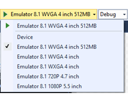
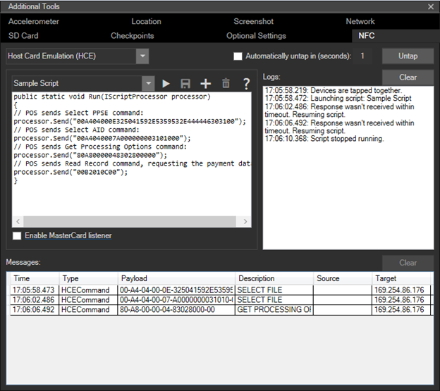
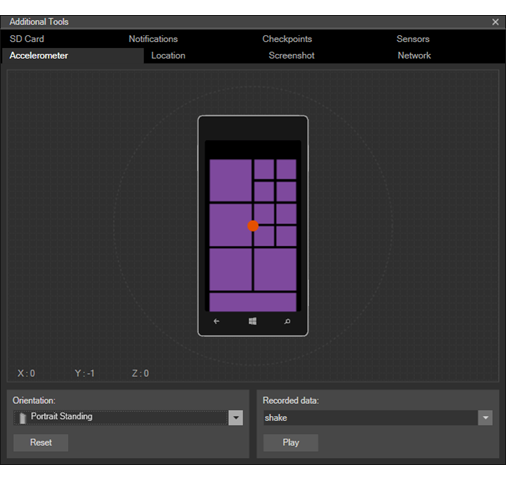
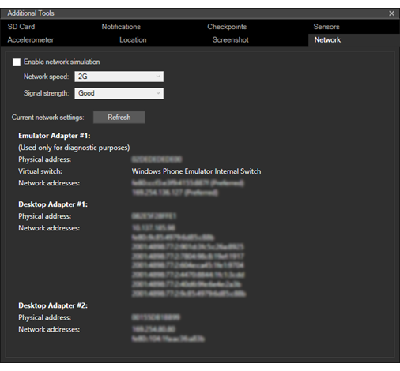
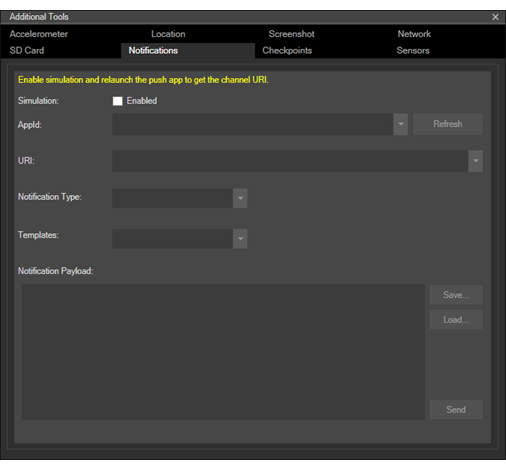
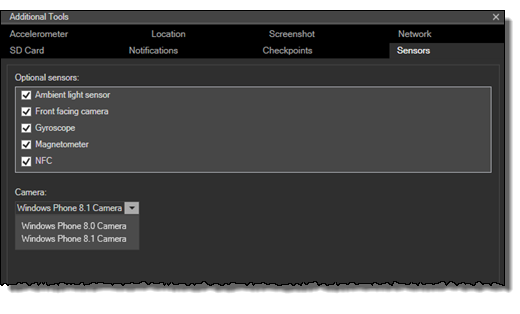
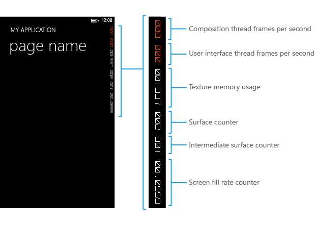

# Test with the Microsoft Emulator for Windows 10 Mobile

Simulate real-world interaction with a device and test the features of your app by using the tools included with Microsoft Emulator for Windows 10 Mobile. The emulator is a desktop application that emulates a mobile device running Windows 10. It provides a virtualized environment in which you can debug and test Windows apps without a physical device. It also provides an isolated environment for your application prototypes.

The emulator is designed to provide comparable performance to an actual device. Before you publish your app to the Microsoft Store, however, we recommend that you test your app on a physical device.

You can test your universal app using a unique Windows 10 Mobile emulator image for various screen resolution and screen size configurations. You can simulate real-world interaction with a device and test various features of your app by using the tools included in the Microsoft Emulator.

## System requirements

Your computer must meet the following requirements:

CPU (these settings, if available, can be enabled in the BIOS)

- Hardware-assisted virtualization.
- Second Level Address Translation (SLAT).
- Hardware-based Data Execution Prevention (DEP).

RAM

- 4 GB or more.

Operating system

- Windows 10 or later
- 64-bit
- Pro edition or later

See [Install Hyper-V on Windows 10](/virtualization/hyper-v-on-windows/quick-start/enable-hyper-v).

To check requirements for RAM and operating system, in Control Panel, select **System and Security**, and then select **System**.

Microsoft Emulator for Windows 10 Mobile requires Visual Studio 2015 or later; it is not backward compatible with earlier versions of Visual Studio.

Microsoft Emulator for Windows 10 Mobile cannot load apps that target the Windows Phone OS version earlier than Windows Phone OS 7.1.

## Installing, uninstalling, and running the emulator

### Installing

[Windows 10 Mobile emulator](https://www.microsoft.com/download/details.aspx?id=53424) ships as part of the Windows 10 SDK. The Windows 10 SDK and emulator can be installed as part of the Visual Studio installation. See the [Visual Studio download page](https://visualstudio.microsoft.com/vs/older-downloads/).

### Uninstalling

You can uninstall the Microsoft Emulator for Windows 10 Mobile using Visual Studio setup/repair. Or you can use **Programs and Features** under **Control Panel** to remove the emulator.

When you uninstall the Microsoft Emulator for Windows 10 Mobile, the Hyper-V Virtual Ethernet Adapter that was created for the emulator to use is not automatically removed. You can manually remove this virtual adapter from **Network Connections** in **Control Panel**.

### Running

To run an app in the emulator, simply select an emulated device from the **run** drop-down menu in Visual Studio.



## What's new in Microsoft Emulator for Windows 10 Mobile

In addition to providing support for Universal Windows Platform (UWP), the emulator has added the following functionality:

- Mouse input mode support to differentiate between mouse and single touch input.
- NFC Support. The emulator allows you to simulate NFC and make it possible to test and develop NFC/Proximity-enabled universal apps.
- Native hardware acceleration improves graphics performance in the emulator by using the local graphics card. You must have a supported graphics card installed, and enable acceleration on the **Sensors** tab of the emulator's **Additional Tools** settings user interface in order to use acceleration.

## Features that you can test in the emulator

In addition to the new features mentioned in the previous section, you can test the following commonly used features in the Microsoft Emulator for Windows 10 Mobile.

- **Screen resolution, screen size, and memory**. Reach a broad market for your app by testing it on various emulator images to simulate various screen resolutions, physical sizes, and memory constraints.


- **Screen configuration**. Change the emulator from portrait to landscape mode. Change the zoom setting to fit the emulator to your desktop screen.

- **Networking**. Networking support is integrated with Windows Phone Emulator. Networking is enabled by default. You do not have to install network drivers for Windows Phone Emulator or configure networking options manually in most environments.

    The emulator uses the network connection of the host computer. It does not appear as a separate device on the network.

- **Language and region settings**. Prepare your app for an international market by changing the display language and region settings in Windows Phone Emulator.

    On the running emulator, go to the **Settings** app, then select the **system** settings, then select **language** or **region**. Change the settings that you want to test. If you're prompted, click **restart phone** to apply the new settings and restart the emulator.

- **Application lifecycle and tombstoning**. Test the behavior or your app when it's deactivated or tombstoned by changing the value of the option **Tombstone upon deactivation while debugging** on the **Debug** page of project properties.

- **Local folder storage (previously known as isolated storage)**. Data in isolated storage persists while the emulator is running, but is lost once the emulator closes.

- **Microphone**. Requires and uses the microphone on the host computer.

- **Phone keyboard**. The emulator supports mapping of the hardware keyboard on your development computer to the keyboard on a Windows Phone. The behavior of the keys is the same as on a Windows Phone device

- **Lock screen**. With the emulator open, press F12 on your computer keyboard twice. The F12 key emulates the power button on the phone. The first key press turns off the display. The second key press turns the display on again with the lock screen engaged. Unlock the screen by using the mouse to slide the lock screen upward.

## Features that you can't test in the emulator

Test the following features only on a physical device.

- Compass
- Gyroscope
- Vibration controller
- Brightness. The brightness level of the emulator is always High.
- High-resolution video. Videos with a resolution higher than VGA resolution (640 x 480) cannot be displayed reliably, especially on emulator images with only 512MB of memory.

## Mouse input

Simulate mouse input using the physical mouse or trackpad on your Windows PC and the mouse input button on the emulator toolbar. This feature is useful if your app provides the user with an ability to utilize a mouse paired to their Windows 10 device to provide input.

Tap the mouse input button on the emulator toolbar to enable mouse input. Any click events within the emulator chrome will now be sent to the Windows 10 Mobile OS running inside the emulator VM as mouse events.


The emulator screen with the mouse input enabled.


The mouse input button on the emulator toolbar.

## Keyboard input

The emulator supports mapping of the hardware keyboard on your development computer to the keyboard on a Windows Phone. The behavior of the keys is the same as on a Windows Phone device. 

By default, the hardware keyboard is not enabled. This implementation is equivalent to a sliding keyboard that must be deployed before you can use it. Before you enable the hardware keyboard, the emulator accepts key input only from the control keys.

Special characters on the keyboard of a localized version of a Windows development computer are not supported by the emulator. To enter special characters that are present on a localized keyboard, use the Software Input Panel (SIP) instead. 

To use your computer’s keyboard in the emulator, press F4.

To stop using your computer’s keyboard in the emulator, press F4.

The following table lists the keys on a hardware keyboard that you can use to emulate the buttons and other controls on a Windows Phone.

Note that in Emulator Build 10.0.14332 the computer hardware key mapping was changed. Values in the second column of the table below represent these new keys. 

Computer hardware keys (Emulator Build 10.0.14295 and earlier) | Computer hardware keys (Emulator Build 10.0.14332 and newer) | Windows Phone hardware button | Notes
--------------------- | ------------------------- | ----------------------------- | -----
F1 | WIN + ESC | BACK | Long presses work as expected.
F2 | WIN + F2 | START | Long presses work as expected.
F3 | WIN + F3 | SEARCH |  
F4 | F4 (no change) | Toggles between using the local computer’s keyboard and not using the local computer’s keyboard. | 
F6 | WIN + F6 | CAMERA HALF | A dedicated camera button that is pressed halfway.
F7 | WIN + F7 | CAMERA FULL | A dedicated camera button.
F9 | WIN + F9 | VOLUME UP | 
F10 | WIN + F10 | VOLUME DOWN | 
F12 | WIN + F12 | POWER | Press the F12 key twice to enable the lock screen. Long presses work as expected.
ESC | WIN + ESC | BACK | Long presses work as expected.
 


## Near Field Communications (NFC)

Build and test apps that use Near Field Communication (NFC) enabled features on Windows 10 Mobile by using the **NFC** tab of the emulator’s **Additional Tools** menu. NFC is useful for a number of scenarios ranging from Proximity scenarios (such as tap to share) to card emulation (such as tap to pay).

You can test your app by simulating a pair of phones tapping together by using a pair of emulators, or you can test your app by simulating a tap to a tag. Also in Windows 10, mobile devices are enabled with HCE (Host Card Emulation) feature and by using the phone emulator you can simulate tapping your device to a payment terminal for APDU command-response traffic.

The NFC tab supports three modes:

- Proximity Mode
- HCE (Host Card Emulation) Mode
- Smart Card Reader Mode

In all modes, the emulator window has three areas of interest.

- The top left section is specific to the mode selected. The features of this section depend on the mode, and are detailed in the mode-specific sections below.
- The top right section lists the logs. When you tap a pair of devices together (or tap to the POS terminal) the tap event is logged and when the devices are untapped the untap event is logged. This section also records if your app responded before the connection is broken or any other action you have taken in the emulator UI with time stamps. Logs are persistent between mode switches, and you can clear the logs at any point by hitting the **Clear** button above the **Logs** screen.
- The bottom half of the screen is the message log and shows the transcript of all messages sent or received over the currently selected connection, depending on the mode selected.

> **Important**  When you first launch the tapper tool, you will get a Windows Firewall prompt. You MUST select ALL 3 check boxes and allow the tool through the firewall, or the tool will silently fail to work.

After launching the quick start installer, make sure you follow the above instruction to select all 3 check boxes on the firewall prompt. Also, the tapper tool must be installed and used on the same physical host machine as the Microsoft Emulator.

### Proximity mode

To simulate a pair of phones tapping together you'll need to launch a pair of Windows Mobile emulators. Since Visual Studio doesn't support running two identical emulators at the same time, you'll need to select different resolutions for each of the emulators as a workaround.


When you check the **Enable discovery of peer devices** checkbox, the **Peer device** dropdown box shows Microsoft Emulators (running on the same physical host machine or in the local network) as well as the Windows machines running the simulator driver (running on the same machine or in the local network).

Once both emulators are running:

- Select the emulator you would like to target in the **Peer device** list.
- Select the **Send to peer device** radio button.
- Click **Tap** button. This will simulate the two devices tapping together and you should be hearing the NFC tap notification sound
- To disconnect the 2 devices, simply hit the **Untap** button.

Alternatively, you can enable **Automatically untap in (seconds)** check box where you can specify the number of seconds you want the devices to be tapped and they will be automatically untapped after the specified number of seconds (simulating what would be expected of a user in real life, they would only hold their phones together for a short time). Note however that currently the message log isn't available after the connection has been untapped.

To simulate reading messages from a tag or receiving messages from another device:

- Select the **Send to self** radio button to test scenarios that require only one NFC enabled device.
- Click **Tap** button. This will simulate the tapping a device to a tag and you should be hearing the NFC tap notification sound
- To disconnect, simply hit the **Untap** button.

Using the proximity mode you can inject messages as if they came from a tag or another peer device. The toolallows you to send messages of the following types.

- WindowsURI
- WindowsMime
- WritableTag
- Pairing:Bluetooth
- NDEF
- NDEF:MIME
- NDEF:URI
- NDEF:wkt.U

You can either create these messages by editing the **Payload** windows or providing them in a file. For more information about these types and how to use them please refer to the Remarks section of the[**ProximityDevice.PublishBinaryMessage**](/uwp/api/windows.networking.proximity.proximitydevice.publishbinarymessage) reference page.

The Windows Driver Kit (WDK) includes an [NFC CX client driver sample](/samples/microsoft/windows-driver-samples/nfc-cx-client-driver-sample/).

### Host Card Emulation (HCE) Mode

In Host Card Emulation (HCE) mode you can test your HCE-based card emulation application by writing your own custom scripts to simulate a smart card reader terminal, such as a Point of Sale (POS) terminal. This tool assumes that you are familiar with the command response pairs (compliant with ISO-7816-4) that are sent between a reader terminal (such as POS, badge reader or transit card reader) and the smart card (that you are emulating in your application).



- Create a new script by clicking the **Add** button in the script editor section. You can provide a name for your script and after you are done with editing, you can save your script using the **Save** button.
- Your saved scripts will be available the next time you launch the emulator.
- Run your scripts by hitting the **Play** button in the scripts editor window. This action results in simulating of tapping your phone to the terminal and sending commands written in your script. Alternatively you can hit the **Tap** button and then the **Play** button, until you hit **Play** the script will not run.
- Stop sending commands by hitting the **Stop** button, which stops sending the commands to your application but the devices remain tapped until you hit the **Untap** button.
- Delete your scripts by selecting the script in the dropdown menu and hitting **Delete** button.
- The emulator tool does not check for the syntax of your scripts until you run the script using the **Play** button. The messages sent by your script are dependent on your implementation of your card emulation app.

To learn more about HCE support and how to develop HCE apps in Windows 10 Mobile, please refer to the [Microsoft NFC Team Blog](https://blogs.msdn.com/b/nfc/).

### How to Create Scripts for HCE Testing

The scripts are written as C# code and your script’s Run method is called when you click the **Play** button, this method takes an IScriptProcessor interface which is used to transceive APDU commands, output to the log window, and control the timeout for waiting on an APDU response from the phone.

Below is a reference on what functionality is available:

```csharp     
        public interface IScriptProcessor
        {
            // Sends an APDU command given as a hex-encoded string, and returns the APDU response
            string Send(string s);

            // Sends an APDU command given as a byte array, and returns the APDU response
            byte[] Send(byte[] s);

            // Logs a string to the log window
            void Log(string s);

            // Logs a byte array to the log window
            void Log(byte[] s);

            // Sets the amount of time the Send functions will wait for an APDU response, after which
            // the function will fail
            void SetResponseTimeout(double seconds);
        }
```

### Smart Card Reader Mode

The emulator can be connected to a smart card reader device on your host computer, such that smart cards inserted or tapped will show up to your phone application and can be communicated to with APDUs using the [**Windows.Devices.SmartCards.SmartCardConnection**](/uwp/api/Windows.Devices.SmartCards.SmartCardConnection) class. For this to work, you will need a compatible smart card reader device attached to your computer, USB smart card readers (both NFC/contactless and insert/contact) are widely available. To enable the emulator to work with an attached smart card reader, first choose the **Card Reader** mode which should show a dropdown box listing all the compatible smart card readers attached to the host system, then choose the smart card reader device you’d like to be connected from the dropdown.

Note that not all NFC-capable smart card readers support some types of NFC cards, and some do not support the standard PC/SC storage card APDU commands.

## Multi-point input

Simulate multi-touch input for pinching and zooming, rotating, and panning objects by using the **Multi-touch Input** button on the emulator toolbar. This feature is useful if your app displays photos, maps, or other visual elements that users can pinch and zoom, rotate, or pan.

1.  Tap the **Multi-touch Input** button on the emulator toolbar to enable multi-point input. Two touch points appear on the emulator screen around a center point.
2.  Right-click and drag one of the touch points to position them without touching the screen.
3.  Left-click and drag one of the touch points to simulate pinching and zooming, rotating, or panning.
4.  Tap the **Single Point Input** button on the emulator toolbar to restore normal input.

The following screenshot shows multi-touch input.

1.  The small left image shows the **Multi-touch Input** button on the emulator toolbar.
2.  The middle image shows the emulator screen after tapping the **Multi-touch Input** button to display the touch points.
3.  The right image shows the emulator screen after dragging the touch points to zoom the image.


## Accelerometer

Test apps that track the movement of the phone by using the **Accelerometer** tab of the emulator's **Additional Tools**.

You can test the accelerometer sensor with live input or pre-recorded input. The only type of recorded data that’s available simulates shaking the phone. You can’t record or save your own simulations for the accelerometer.

1.  Select the desired starting orientation in the **Orientation** drop-down list.

2.  - Select the type of input.

        **To run the simulation with live input**

        In the middle of the accelerometer simulator, drag the colored dot to simulate movement of the device in a 3D plane.

        Moving the dot on the horizontal access rotates the simulator from side to side. Moving the dot on the vertical access rotates the simulator back and forth, rotating around the x-axis. As you drag the dot, the X, Y, and Z coordinates update based on the rotation calculations. You cannot move the dot outside the bounding circle in the touch pad area.

        Optionally, click **Reset** to restore the starting orientation.

    - **To run the simulation with recorded input**

        In the **Recorded Data** section, click the **Play** button to start playback of the simulated data. The only option available in the **Recorded Data** list is shake. The simulator does not move on the screen when it plays back the data.



## Location and driving

Test apps that use navigation or geofencing by using the **Location** tab of the emulator's **Additional Tools**. This feature is useful for simulating driving, biking, or walking in conditions similar to the real world.

You can test your app while you simulate moving from one location to another at different speeds and with different accuracy profiles. The location simulator can help you to identify changes in your usage of the location APIs usage that improve the user experience. For example, the tool can help you identify that you have to tune geofence parameters, such as size or dwell time, to detect the geofences successfully in different scenarios.

The **Location** tab supports three modes. In all modes, when the emulator receives a new position, that position is available to trigger the [**PositionChanged**](/uwp/api/windows.devices.geolocation.geolocator.positionchanged) event or to respond to a [**GetGeopositionAsync**](/uwp/api/windows.devices.geolocation.geolocator.getgeopositionasync) call in your location-aware app.

- In **Pin** mode, you place pushpins on the map. When you click **Play all points**, the location simulator sends the location of each pin to the emulator one after another, at the interval specified in the **Seconds per pin** text box.

- In **Live** mode, you place pushpins on the map. The location simulator sends the location of each pin to the emulator immediately as you place them on the map.

- In **Route** mode, you place pushpins on the map to indicate waypoints, and the location simulator automatically calculates a route. The route includes invisible pins at one-second intervals along the route. For example, if you have select the **Walking** speed profile, which assumes a speed of 5 kilometers per hour, then invisible pins are generated at intervals of 1.39 meters. When you click **Play all points**, the location simulator sends the location of each pin to the emulator one after another, at the interval determined by the speed profile selected in the drop-down list.

In all modes of the location simulator, you can do the following things.

- You can search for a location by using the **Search** box.

- You can **Zoom in** and **Zoom out** on the map.

- You can save the current set of data points to an XML file, and reload the file later to reuse the same data points.

- You can **Toggle pushpin mode on or off** and **Clear all points**.

In Pin and Route mode, you can also do the following things.

- Save a route you created for later use.

- Load a route previously created. You can even load route files created in previous versions of the tool.

- Modify a route by deleting pushpins (in Pin mode) or waypoints (in Route mode).

**Accuracy profiles**

In all modes of the location simulator, you can select one of the following accuracy profiles in the **Accuracy profile** drop-down list.

| Profile  | Description                                        |
|----------|----------------------------------------------------|
| Pinpoint | Assumes perfectly accurate location readings. This setting is not realistic, but it's useful for testing the logic of your app.  |
| Urban    | Assumes that buildings are restricting the number of satellites in view, but there is often a high density of cell towers and Wi-Fi access points that can be used for positioning. |
| Suburban | Assumes that satellite positioning is relatively good and there is good density of cell towers, but the density of Wi-Fi access points is not high.  |
| Rural    | Assumes that satellite positioning is good, but there is low density of cell towers and almost no Wi-Fi access points that can be used for positioning. |

**Speed profiles**

In **Route** mode, you can select one of the following speed profiles in the drop-down list.

| Profile | Speed per hour               | Speed per second | Description | 
|---------|------------------------------|------------------|-------------|
| Speed Limit | Speed limit of the route | Not applicable   | Traverse the route at the posted speed limit. |
| Walking     | 5 km/h                   | 1.39 m           | Traverse the route at a natural walking pace of 5 km/h. |
| Biking      | 25 km/h                  | 6.94 m           | Traverse the route at a natural biking pace of 25 km/h. |
| Fast        |                          |                  |Traverse the route faster than the posted speed limit. |

**Route mode**

Route mode has the following features and limitations.

- Route mode requires an Internet connection.

- When the Urban, Suburban, or Rural accuracy profile is selected, the location simulator calculates a simulated satellite-based position, a simulated Wi-Fi position, and a simulated cellular position for each pin. Your app receives only one of these positions. The three sets of coordinates for the current location are displayed in different colors on the map and in the **Current location** list.

- The accuracy of the pins along route the route is not uniform. Some of the pins use satellite accuracy, some use Wi-Fi accuracy, and some use cellular accuracy.

- You cannot select more than 20 waypoints for the route.

- Positions for the visible and invisible pins on the map are generated only once when you select a new accuracy profile. When you play the route more than once with the same accuracy profile during the same emulator session, the previously generated positions are reused.

The following screenshot shows Route mode. The orange line indicates the route. The blue dot indicates the accurate location of the car determined by satellite-based positioning. The red and green dots indicate less accurate locations calculated by using Wi-Fi and cellular positioning and the Suburban accuracy profile. The three calculated locations are also displayed in the **Current location** list.


**More info about the location simulator**

- You can request a position with the accuracy set to Default.

- When you test geofencing in the emulator, create a simulation that gives the geofencing engine a “warm-up” period to learn and adjust to the movement patterns.

- The only position properties that are simulated are the Latitude, Longitude, Accuracy, and PositionSource. The location simulator does not simulate other properties such as Speed, Heading, and so forth.

## Network

Test your app with different network speeds and different signal strengths by using the **Network** tab of the emulator's **Additional Tools**. This feature is useful if your app calls web services or transfers data.

The network simulation feature helps you to make sure that your app runs well in the real world. The Windows Phone Emulator runs on a computer that usually has a fast WiFi or Ethernet connection. Your app, however, runs on phones that are typically connected over a slower cellular connection.

1.  Check **Enable network simulation** to test your app with different network speeds and different signal strengths.
2.  In the **Network speed** dropdown list, select one of the following options:
    - No network
    - 2G
    - 3G
    - 4G

3.  In the **Signal strength** dropdown list, select one of the following options:
    - Good
    - Average
    - Poor

4.  Clear **Enable network simulation** to restore the default behavior, which uses the network settings of your development computer.

You can also review the current network settings on the **Network** tab.



## SD card

Test your app with a simulated removable SD card by using the **SD Card** tab of the emulator's **Additional Tools**. This feature is useful if your app reads or write files.


The **SD Card** tab uses a folder on the development computer to simulate a removable SD card in the phone.

1.  **Select a folder**.

    Click **Browse** to pick a folder on the development computer to hold the contents of the simulated SD card.

2.  **Insert the SD card**.

    After selecting a folder, click **Insert SD card**. When you insert the SD card, the following things happen:

    - If you didn't specify a folder, or the folder's not valid, an error occurs.
    - The files in the specified folder on the development computer are copied to the root folder of the simulated SD card on the emulator. A progress bar indicates the progress of the sync operation.
    - The **Insert the SD card** button changes to **Eject SD card**.
    - If you click **Eject SD card** while the sync operation is in progress, the operation is canceled.

3.  Optionally, select or clear **Sync updated files back to the local folder when I eject the SD card**.

    This option is enabled by default. When this option is enabled, files are synced from the emulator back to the folder on the development computer when you eject the SD card.

4.  **Eject the SD card**.

    Click **Eject SD card**. When you eject the SD card, the following things happen:

    - if you have selected **Sync updated files back to the local folder when I eject the SD card**, the following things happen:
        - The files on the simulated SD card on the emulator are copied to the specified folder on the development computer. A progress bar indicates the progress of the sync operation.
        - The **Eject SD card** button changes to **Cancel sync**.
        - If you click **Cancel sync** while the sync operation is in progress, the card is ejected and the results of the sync operation are incomplete.
    - The **Eject SD card** button changes back to **Insert SD card**.

> **Note**  Since an SD card used by the phone is formatted with the FAT32 file system, 32GB is the maximum size.

The speed of reading from and writing to the simulated SD card is throttled to imitate real-world speeds. Accessing an SD card is slower than accessing the computer's hard drive.

## Notifications

Send push notifications to your app by using the **Notifications** tab of the emulator's **Additional Tools**. This feature is useful if your app receives push notifications.

You can easily test push notifications without creating the working cloud service that's required after you publish your app.

1.  **Enable simulation.**

    After you select **Enabled**, all apps deployed on the emulator use the simulation engine instead of the WNS or MPN service until you disable simulation.

2.  **Select an app to receive notifications.**

    The **AppId** list is automatically populated with all apps deployed to the emulator that are enabled for push notifications. Select an app in the drop-down list.

    If you deploy another push-enabled app after enabling simulation, click **Refresh** to add the app to the list.

3.  **Select a notification channel.**

    After you select an app in the **AppId** list, the **URI** list is automatically populated with all the notification channels registered for the selected app. Select a notification channel in the drop-down list.

4.  **Select a notification type.**

    After you select a notification channel in the **URI** list, the **Notification Type** list is automatically populated with all the types available for the notification service. Select a notification type in the drop-down list.

    The simulator uses the Uri format of the notification channel to determine whether the app is using WNS or MPN push notifications.

    Simulation supports all notification types. The default notification type is **Tile**.

    - The following WNS notification types are supported.

        - Raw
        - Toast

            When your app uses WNS notifications and you select the **Toast** notification type, the simulation tab displays the **Tag** and **Group** fields. You can select these options and enter **Tag** and **Group** values to manage toast notifications in the Notification Center.

        - Tile
        - Badge

    - The following MPN notification types are supported.

        - Raw
        - Toast
        - Tile

5.  **Select a notification template.**

    After you select a notification type in the **Notification Type** list, the **Templates** list is automatically populated with all the templates available for the notification type. Select a template in the drop-down list.

    Simulation supports all template types.

6.  **Optionally, change the notification payload.**

    After you select a template in the **Templates** list, the **Notification Payload** text box is automatically populated with a sample payload for the template. Review the sample payload in the **Notification Payload** text box.

    - You can send the sample payload without changing it.

    - You can edit the sample payload in the text box.

    - You can click **Load** to load a payload from a text or XML file.

    - You can click **Save** to save the XML text of the payload to use again later.

    The simulator does not validate the XML text of the payload.

7.  **Send the push notification.**

    Click **Send** to deliver the push notification to the selected app.

    The screen displays a message to indicate success or failure.



## Sensors

Test how your app works on low-cost phones that don't have all the optional sensors or camera features by using the **Sensors** tab of the emulator's **Additional Tools**. This feature is useful if your app uses the camera or some of the phone's sensors, and you want your app to reach the largest possible market.

- By default, all sensors are enabled in the **Optional sensors** list. Select or clear individual check boxes to enable or disable individual sensors.
- After you change your selections, click **Apply**. Then you have to restart the emulator.
- If you make changes, and then you switch tabs or close the **Additional Tools** window without clicking **Apply**, your changes are discarded.
- Your settings are persisted between for the emulator session until you change them or reset them. If you capture a checkpoint, the settings are saved with the checkpoint. The settings are persisted only for the specific emulator that you're using.



**Sensor options**

You can enable or disable the following optional hardware sensors:

- Ambient light sensor
- Front-facing camera
- Gyroscope
- Compass (magnetometer)
- NFC
- Software buttons (only on some high-resolution emulator images)

**Camera options**

You can enable or disable the optional front-facing camera by selecting or clearing the check box in the **Optional sensors** list.

You can also select a camera profile in the **Camera** dropdown list.

## Frame rate counters

Use the frame rate counters in Windows Phone emulator to monitor the performance of your running app.



**Descriptions of the frame rate counters**

The following table describes each frame rate counter.

| Frame rate counter                           | Description        |
|----------------------------------------------|--------------------|
| Composition (Render) Thread Frame Rate (FPS) | The rate at which the screen is updated.  |
| User Interface Thread Frame Rate (FPS)       | The rate at which the UI thread is running.    |
| Texture Memory Usage                         | The video memory and system memory copies of textures being used in the app.    |
| Surface Counter                              | The number of explicit surfaces being passed to the GPU for processing.     |
| Intermediate Surface Counter                 | The number of implicit surfaces generated as a result of cached surfaces.    |
| Screen Fill Rate Counter                     | The number of pixels being painted per frame in terms of screens. A value of 1 represents the number of pixels in the current screen resolution – for example, 480 x 800 pixels. |

**Enabling and disabling the frame rate counters**

You can enable or disable the display of the frame rate counters in your code. When you create a Windows Phone app project in Visual Studio, the following code to enable the frame rate counters is added by default in the file App.xaml.cs. To disable the frame rate counters, set **EnableFrameRateCounter** to **false** or comment out the line of code.

> [!div class="tabbedCodeSnippets"]
>```csharp
>// Show graphics profiling information while debugging.
>if (System.Diagnostics.Debugger.IsAttached)
>{
>    // Display the current frame rate counters.
>    Application.Current.Host.Settings.EnableFrameRateCounter = true;
>    
>    // other code…
>}
>```
>```vb
>' Show graphics profiling information while debugging.
>If System.Diagnostics.Debugger.IsAttached Then
>
>    ' Display the current frame rate counters.
>    Application.Current.Host.Settings.EnableFrameRateCounter = True
>
>    ' other code...
>End If
>```

## Known Issues

The following are known issues with the emulator, with suggested ways to work around problems if you encounter them.

### Error message: “Failed while removing virtual Ethernet switch”

In certain situations, including after you update to a new Windows 10 flight, a virtual network switch associated with the emulator can get into a state where it can't be deleted through the user interface.

To recover from this situation run "netcfg -d" from an administrator command prompt: `C:\Program Files (x86)\Microsoft XDE\<version>\XdeCleanup.exe`. When the command is finished running, reboot your computer to complete the recovery process.

**Note**  This command will delete all networking devices, not just those associated with the emulator. When your computer starts again, all hardware networking devices will be discovered automatically.
 
### Unable to launch the emulators

Microsoft Emulator includes XDECleanup.exe, a tool that deletes all VMs, diff disks, and emulator specific network switches, and it ships with the emulator (XDE) binaries already. You should use this tool to clean up emulator VMs if they get into a bad state. Run the tool from an administrator command prompt:`C:\Program Files (x86)\Microsoft XDE\<version>\XdeCleanup.exe`

> **Note**  XDECleanup.exe deletes all emulator specific Hyper-V VMs, and it also deletes any VM checkpoints or saved states.

### Uninstall Windows 10 for Mobile Image

When you install the emulator, a Windows 10 for Mobile VHD image is installed, which gets its own entry in the **Programs and Features** list in the Control Panel. If you wish to uninstall the image, find **Windows 10 for Mobile Image -\<version\>** in the list of installed programs, right-click on it, and choose **Uninstall**.

In the current release, you must then manually delete the VHD file for the emulator. If you installed the emulator to the default path, the VHD file is at C:\\Program Files (x86)\\Windows Kits\\10\\Emulation\\Mobile\\\<version\>\\flash.vhd.

### How to disable hardware accelerated graphics

By default, Windows 10 Mobile Emulator uses hardware accelerated graphics. If you are having trouble launching the emulator with hardware acceleration enabled, you can turn it off by setting a registry value.

To disable hardware acceleration:

1. Start Registry Editor.
2. Create the following registry subkey if it doesn't exist:
   HKEY_LOCAL_MACHINE\SOFTWARE\Wow6432Node\Microsoft\Xde\10.0
3. Right click the 10.0 folder, point to **New**, and then click **DWORD Value**.
4. Type **DisableRemoteFx**, and then press Enter.
5. Double-click **DisableRemoteFx**, enter 1 in the **Value** data box, select the **Decimal** option, and then click **OK**.
6. Close Registry Editor.

**Note:** After setting this registry value, you must delete the virtual machine in Hyper-V manager for the configuration that you launched in Visual Studio, and then relaunch the emulator with software-rendered graphics.

## Support Resources

To find answers and solve problems as you start working with the Windows 10 tools, please visit [Windows 10 Tools forum](https://social.msdn.microsoft.com/Forums/home?forum=Win10SDKToolsIssues). To see all the forums for Windows 10 development, visit [this link](https://social.msdn.microsoft.com/Forums/windowsapps/home?forum=wpdevelop).

## Related topics

* [Run Windows Phone apps in the emulator](/visualstudio/debugger/run-windows-phone-apps-in-the-emulator?view=vs-2015&preserve-view=true)
* [Windows and Windows Phone SDK archive](https://developer.microsoft.com/windows/downloads/sdk-archive)
 
