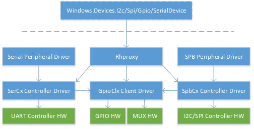
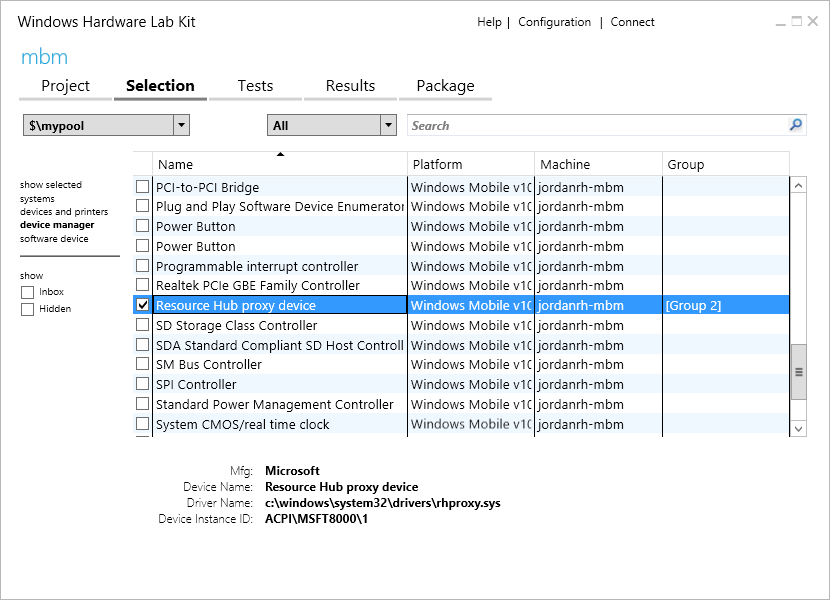

# Enable user mode access to GPIO, I2C, and SPI

In Windows 10 and later, APIs are provided with direct access from user mode to general-purpose input/output (GPIO), Inter-Integrated Circuit (I2C), Serial Peripheral Interface (SPI), and universal asynchronous receiver-transmitter (UART). Development boards such as Raspberry Pi 2 expose a subset of these connections, which enable you to extend a base compute module with custom circuitry to address a particular application. These low level buses are usually shared with other critical onboard functions, with only a subset of GPIO pins and buses exposed on headers. To preserve system stability, it is necessary to specify which pins and buses are safe for modification by user mode applications.

This document describes how to specify this configuration in Advanced Configuration and Power Interface (ACPI), and provides tools to validate that the configuration was specified correctly.

> [!IMPORTANT]
> The audience for this document is Unified Extensible Firmware Interface (UEFI) and ACPI developers. Some familiarity with ACPI, ACPI Source Language (ASL) authoring, and SpbCx/GpioClx is assumed.

User mode access to low level buses on Windows is plumbed through the existing `GpioClx` and `SpbCx` frameworks. A new driver called *RhProxy*, available on Windows IoT Core and Windows Enterprise, exposes `GpioClx` and `SpbCx` resources to user mode. To enable the APIs, a device node for rhproxy must be declared in your ACPI tables with each of the GPIO and SPB resources that should be exposed to user mode. This document walks through authoring and verifying the ASL.

## ASL by example

Let’s walk through the rhproxy device node declaration on Raspberry Pi 2. First, create the ACPI device declaration in the \\_SB scope.

```cpp
Device(RHPX)
{
    Name(_HID, "MSFT8000")
    Name(_CID, "MSFT8000")
    Name(_UID, 1)
}
```

- _HID – Hardware Id. Set this to a vendor-specific hardware ID.
- _CID – Compatible Id. Must be “MSFT8000”.
- _UID – Unique Id. Set to 1.

Next we declare each of the GPIO and SPB resources that should be exposed to user mode. The order in which resources are declared is important because resource indexes are used to associate properties with resources. If there are multiple I2C or SPI busses exposed, the first declared bus is considered the ‘default’ bus for that type, and will be the instance returned by the `GetDefaultAsync()` methods of [Windows.Devices.I2c.I2cController](/uwp/api/windows.devices.i2c.i2ccontroller) and [Windows.Devices.Spi.SpiController](/uwp/api/windows.devices.spi.spicontroller).

### SPI

Raspberry Pi has two exposed SPI buses. SPI0 has two hardware chip select lines and SPI1 has one hardware chip select line. One SPISerialBus() resource declaration is required for each chip select line for each bus. The following two SPISerialBus resource declarations are for the two chip select lines on SPI0. The DeviceSelection field contains a unique value which the driver interprets as a hardware chip select line identifier. The exact value that you put in the DeviceSelection field depends on how your driver interprets this field of the ACPI connection descriptor.

> [!NOTE]
> This article contains references to the term slave&mdash;a term that Microsoft doesn't condone, and has stopped using in new products and documentation. When the term is removed from the software, we’ll remove it from this article.

```cpp
// Index 0
SPISerialBus(              // SCKL - GPIO 11 - Pin 23
                           // MOSI - GPIO 10 - Pin 19
                           // MISO - GPIO 9  - Pin 21
                           // CE0  - GPIO 8  - Pin 24
    0,                     // Device selection (CE0)
    PolarityLow,           // Device selection polarity
    FourWireMode,          // wiremode
    0,                     // databit len: placeholder
    ControllerInitiated,   // slave mode
    0,                     // connection speed: placeholder
    ClockPolarityLow,      // clock polarity: placeholder
    ClockPhaseFirst,       // clock phase: placeholder
    "\\_SB.SPI0",          // ResourceSource: SPI bus controller name
    0,                     // ResourceSourceIndex
                           // Resource usage
    )                      // Vendor Data

// Index 1
SPISerialBus(              // SCKL - GPIO 11 - Pin 23
                           // MOSI - GPIO 10 - Pin 19
                           // MISO - GPIO 9  - Pin 21
                           // CE1  - GPIO 7  - Pin 26
    1,                     // Device selection (CE1)
    PolarityLow,           // Device selection polarity
    FourWireMode,          // wiremode
    0,                     // databit len: placeholder
    ControllerInitiated,   // slave mode
    0,                     // connection speed: placeholder
    ClockPolarityLow,      // clock polarity: placeholder
    ClockPhaseFirst,       // clock phase: placeholder
    "\\_SB.SPI0",          // ResourceSource: SPI bus controller name
    0,                     // ResourceSourceIndex
                           // Resource usage
    )                      // Vendor Data

```

How does software know that these two resources should be associated with the same bus? The mapping between bus friendly name and resource index is specified in the DSD:

```cpp
Package(2) { "bus-SPI-SPI0", Package() { 0, 1 }},
```

This creates a bus named “SPI0” with two chip select lines – resource indexes 0 and 1. Several more properties are required to declare the capabilities of the SPI bus.

```cpp
Package(2) { "SPI0-MinClockInHz", 7629 },
Package(2) { "SPI0-MaxClockInHz", 125000000 },
```

The **MinClockInHz** and **MaxClockInHz** properties specify the minimum and maximum clock speeds that are supported by the controller. The API will prevent users from specifying values outside this range. The clock speed is passed to your SPB driver in the _SPE field of the connection descriptor (ACPI section 6.4.3.8.2.2).

```cpp
Package(2) { "SPI0-SupportedDataBitLengths", Package() { 8 }},
```

The **SupportedDataBitLengths** property lists the data bit lengths supported by the controller. Multiple values can be specified in a comma-separated list. The API will prevent users from specifying values outside this list. The data bit length is passed to your SPB driver in the _LEN field of the connection descriptor (ACPI section 6.4.3.8.2.2).

You can think of these resource declarations as “templates.” Some of the fields are fixed at system boot while others are specified dynamically at runtime. The following fields of the SPISerialBus descriptor are fixed:

- DeviceSelection
- DeviceSelectionPolarity
- WireMode
- SlaveMode
- ResourceSource

The following fields are placeholders for values specified by the user at runtime:

- DataBitLength
- ConnectionSpeed
- ClockPolarity
- ClockPhase

Since SPI1 contains only a single chip select line, a single `SPISerialBus()` resource is declared:

```cpp
// Index 2
SPISerialBus(              // SCKL - GPIO 21 - Pin 40
                           // MOSI - GPIO 20 - Pin 38
                           // MISO - GPIO 19 - Pin 35
                           // CE1  - GPIO 17 - Pin 11
    1,                     // Device selection (CE1)
    PolarityLow,           // Device selection polarity
    FourWireMode,          // wiremode
    0,                     // databit len: placeholder
    ControllerInitiated,   // slave mode
    0,                     // connection speed: placeholder
    ClockPolarityLow,      // clock polarity: placeholder
    ClockPhaseFirst,       // clock phase: placeholder
    "\\_SB.SPI1",          // ResourceSource: SPI bus controller name
    0,                     // ResourceSourceIndex
                           // Resource usage
    )                      // Vendor Data

```

The accompanying friendly name declaration – which is required – is specified in the DSD and refers to the index of this resource declaration.

```cpp
Package(2) { "bus-SPI-SPI1", Package() { 2 }},
```

This creates a bus named “SPI1” and associates it with resource index 2.

#### SPI Driver Requirements

- Must use `SpbCx` or be SpbCx-compatible
- Must have passed the [MITT SPI Tests](/windows-hardware/drivers/spb/spi-tests-in-mitt)
- Must support 4Mhz clock speed
- Must support 8-bit data length
- Must support all SPI Modes: 0, 1, 2, 3

### I2C

Next, we declare the I2C resources. Raspberry Pi exposes a single I2C bus on pins 3 and 5.

```cpp
// Index 3
I2CSerialBus(              // Pin 3 (GPIO2, SDA1), 5 (GPIO3, SCL1)
    0xFFFF,                // SlaveAddress: placeholder
    ,                      // SlaveMode: default to ControllerInitiated
    0,                     // ConnectionSpeed: placeholder
    ,                      // Addressing Mode: placeholder
    "\\_SB.I2C1",          // ResourceSource: I2C bus controller name
    ,
    ,
    )                      // VendorData

```

The accompanying friendly name declaration – which is required – is specified in the DSD:

```cpp
Package(2) { "bus-I2C-I2C1", Package() { 3 }},
```

This declares an I2C bus with friendly name “I2C1” that refers to resource index 3, which is the index of the I2CSerialBus() resource that we declared above.

The following fields of the I2CSerialBus() descriptor are fixed:

- SlaveMode
- ResourceSource

The following fields are placeholders for values specified by the user at runtime.

- SlaveAddress
- ConnectionSpeed
- AddressingMode

#### I2C Driver Requirements

- Must use SpbCx or be SpbCx-compatible
- Must have passed the [MITT I2C Tests](/windows-hardware/drivers/spb/run-mitt-tests-for-an-i2c-controller-)
- Must support 7-bit addressing
- Must support 100kHz clock speed
- Must support 400kHz clock speed

### GPIO

Next, we declare all the GPIO pins that are exposed to user mode. We offer the following guidance in deciding which pins to expose:

- Declare all pins on exposed headers.
- Declare pins that are connected to useful onboard functions like buttons and LEDs.
- Do not declare pins that are reserved for system functions or are not connected to anything.

The following block of ASL declares two pins – GPIO4 and GPIO5. The other pins are not shown here for brevity. Appendix C contains a sample powershell script which can be used to generate the GPIO resources.

```cpp
// Index 4 – GPIO 4
GpioIO(Shared, PullUp, , , , “\\_SB.GPI0”, , , , ) { 4 }
GpioInt(Edge, ActiveBoth, Shared, PullUp, 0, “\\_SB.GPI0”,) { 4 }

// Index 6 – GPIO 5
GpioIO(Shared, PullUp, , , , “\\_SB.GPI0”, , , , ) { 5 }
GpioInt(Edge, ActiveBoth, Shared, PullUp, 0, “\\_SB.GPI0”,) { 5 }
```

The following requirements must be observed when declaring GPIO pins:

- Only memory mapped GPIO controllers are supported. GPIO controllers interfaced over I2C/SPI are not supported. The controller driver is a memory mapped controller if it sets the [MemoryMappedController](/windows-hardware/drivers/ddi/content/gpioclx/ns-gpioclx-_controller_attribute_flags) flag in the [CLIENT_CONTROLLER_BASIC_INFORMATION](/windows-hardware/drivers/ddi/content/gpioclx/ns-gpioclx-_client_controller_basic_information) structure in response to the [CLIENT_QueryControllerBasicInformation](/windows-hardware/drivers/ddi/content/gpioclx/nc-gpioclx-gpio_client_query_controller_basic_information) callback.
- Each pin requires both a GpioIO and a GpioInt resource. The GpioInt resource must immediately follow the GpioIO resource and must refer to the same pin number.
- GPIO resources must be ordered by increasing pin number.
- Each GpioIO and GpioInt resource must contain exactly one pin number in the pin list.
- The ShareType field of both descriptors must be Shared
- The EdgeLevel field of the GpioInt descriptor must be Edge
- The ActiveLevel field of the GpioInt descriptor must be ActiveBoth
- The PinConfig field
  - Must be the same in both the GpioIO and GpioInt descriptors
  - Must be one of PullUp, PullDown, or PullNone. It cannot be PullDefault.
  - The pull configuration must match the power-on state of the pin. Putting the pin in the specified pull mode from power-on state must not change the state of the pin. For example, if the datasheet specifies that the pin comes up with a pull up, specify PinConfig as PullUp.

Firmware, UEFI, and driver initialization code should not change the state of a pin from its power-on state during boot. Only the user knows what’s attached to a pin and therefore which state transitions are safe. The power-on state of each pin must be documented so that users can design hardware that correctly interfaces with a pin. A pin must not change state unexpectedly during boot.

#### Supported Drive Modes

If your GPIO controller supports built-in pull up and pull down resistors in addition to high impedance input and CMOS output, you must specify this with the optional SupportedDriveModes property.

```cpp
Package (2) { “GPIO-SupportedDriveModes”, 0xf },
```

The SupportedDriveModes property indicates which drive modes are supported by the GPIO controller. In the example above, all of the following drive modes are supported. The property is a bitmask of the following values:

| Flag Value | Drive Mode | Description |
|------------|------------|-------------|
| 0x1        | InputHighImpedance | The pin supports high impedance input, which corresponds to the “PullNone” value in ACPI. |
| 0x2        | InputPullUp | The pin supports a built-in pull-up resistor, which corresponds to the “PullUp” value in ACPI. |
| 0x4        | InputPullDown | The pin supports a built-in pull-down resistor, which corresponds to the “PullDown” value in ACPI. |
| 0x8        | OutputCmos | The pin supports generating both strong highs and strong lows (as opposed to open drain). |

InputHighImpedance and OutputCmos are supported by almost all GPIO controllers. If the SupportedDriveModes property is not specified, this is the default.

If a GPIO signal goes through a level shifter before reaching an exposed header, declare the drive modes supported by the SOC, even if the drive mode would not be observable on the external header. For example, if a pin goes through a bidirectional level shifter that makes a pin appear as open drain with resistive pull up, you will never observe a high impedance state on the exposed header even if the pin is configured as a high impedance input. You should still declare that the pin supports high impedance input.

#### Pin Numbering

Windows supports two pin numbering schemes:

- Sequential Pin Numbering – Users see numbers like 0, 1, 2... up to the number of exposed pins. 0 is the first GpioIo resource declared in ASL, 1 is the second GpioIo resource declared in ASL, and so on.
- Native Pin Numbering – Users see the pin numbers specified in GpioIo descriptors, for example, 4, 5, 12, 13, ...

```cpp
Package (2) { “GPIO-UseDescriptorPinNumbers”, 1 },
```

The **UseDescriptorPinNumbers** property tells Windows to use native pin numbering instead of sequential pin numbering. If the UseDescriptorPinNumbers property is not specified or its value is zero, Windows will default to Sequential pin numbering.

If native pin numbering is used, you must also specify the **PinCount** property.

```cpp
Package (2) { “GPIO-PinCount”, 54 },
```

The **PinCount** property should match the value returned through the **TotalPins** property in the [CLIENT_QueryControllerBasicInformation](/windows-hardware/drivers/ddi/content/gpioclx/nc-gpioclx-gpio_client_query_controller_basic_information) callback of the `GpioClx` driver.

Choose the numbering scheme that is most compatible with existing published documentation for your board. For example, Raspberry Pi uses native pin numbering because many existing pinout diagrams use the BCM2835 pin numbers. MinnowBoardMax uses sequential pin numbering because there are few existing pinout diagrams, and sequential pin numbering simplifies the developer experience because only 10 pins are exposed out of more than 200 pins. The decision to use sequential or native pin numbering should aim to reduce developer confusion.

#### GPIO Driver Requirements

- Must use `GpioClx`
- Must be on-SOC memory mapped
- Must use emulated ActiveBoth interrupt handling

### UART

If your UART driver uses `SerCx` or `SerCx2`, you can use rhproxy to expose the driver to user mode. UART drivers that create a device interface of type `GUID_DEVINTERFACE_COMPORT` do not need to use rhproxy. The inbox `Serial.sys` driver is one of these cases.

To expose a `SerCx`-style UART to user mode, declare a `UARTSerialBus` resource as follows.

```cpp
// Index 2
UARTSerialBus(           // Pin 17, 19 of JP1, for SIO_UART2
    115200,                // InitialBaudRate: in bits ber second
    ,                      // BitsPerByte: default to 8 bits
    ,                      // StopBits: Defaults to one bit
    0xfc,                  // LinesInUse: 8 1-bit flags to declare line enabled
    ,                      // IsBigEndian: default to LittleEndian
    ,                      // Parity: Defaults to no parity
    ,                      // FlowControl: Defaults to no flow control
    32,                    // ReceiveBufferSize
    32,                    // TransmitBufferSize
    "\\_SB.URT2",          // ResourceSource: UART bus controller name
    ,
    ,
    ,
    )
```

Only the ResourceSource field is fixed while all other fields are placeholders for values specified at runtime by the user.

The accompanying friendly name declaration is:

```cpp
Package(2) { "bus-UART-UART2", Package() { 2 }},
```

This assigns the friendly name “UART2” to the controller, which is the identifier users will use to access the bus from user mode.

## Runtime Pin Muxing

Pin muxing is the ability to use the same physical pin for different functions. Several different on-chip peripherals, such as an I2C controller, SPI controller, and GPIO controller, might be routed to the same physical pin on a SOC. The mux block controls which function is active on the pin at any given time. Traditionally, firmware is responsible for establishing function assignments at boot, and this assignment remains static through the boot session. Runtime pin muxing adds the ability to reconfigure pin function assignments at runtime. Enabling users to choose a pin’s function at runtime speeds development by enabling users to quickly reconfigure a board’s pins, and enables hardware to support a broader range of applications than would a static configuration.

Users consume muxing support for GPIO, I2C, SPI, and UART without writing any additional code. When a user opens a GPIO or bus using [OpenPin()](/uwp/api/windows.devices.gpio.gpiocontroller.openpin) or [FromIdAsync()](/uwp/api/windows.devices.i2c.i2cdevice.fromidasync), the underlying physical pins are automatically muxed to the requested function. If the pins are already in use by a different function, the OpenPin() or FromIdAsync() call will fail. When the user closes the device by disposing the [GpioPin](/uwp/api/windows.devices.gpio.gpiopin), [I2cDevice](/uwp/api/windows.devices.i2c.i2cdevice), [SpiDevice](/uwp/api/windows.devices.spi.spidevice), or [SerialDevice](/uwp/api/windows.devices.serialcommunication.serialdevice) object, the pins are released, allowing them to later be opened for a different function.

Windows contains built-in support for pin muxing in the [GpioClx](/windows-hardware/drivers/ddi/content/index), [SpbCx](/windows-hardware/drivers/spb/spb-framework-extension), and [SerCx](/windows-hardware/drivers/ddi/content/index) frameworks. These frameworks work together to automatically switch a pin to the correct function when a GPIO pin or bus is accessed. Access to the pins is arbitrated to prevent conflicts among multiple clients. In addition to this built-in support, the interfaces and protocols for pin muxing are general purpose and can be extended to support additional devices and scenarios.

This document first describes the underlying interfaces and protocols involved in pin muxing, and then describes how to add support for pin muxing to GpioClx, SpbCx, and SerCx controller drivers.

### Pin Muxing Architecture

This section describes the underlying interfaces and protocols involved in pin muxing. Knowledge of the underlying protocols is not necessarily needed to support pin muxing with GpioClx/SpbCx/SerCx drivers. For details on how to support pin muxing with GpioCls/SpbCx/SerCx drivers, see [Implementing pin muxing support in GpioClx client drivers](#supporting-muxing-support-in-gpioclx-client-drivers) and [Consuming muxing support in SpbCx and SerCx controller drivers](#supporting-muxing-in-spbcx-and-sercx-controller-drivers).

Pin muxing is accomplished by the cooperation of several components.

- Pin muxing servers – these are drivers that control the pin muxing control block. Pin muxing servers receive pin muxing requests from clients via requests to reserve muxing resources (via *IRP_MJ_CREATE*) requests, and requests to switch a pin’s function (via *IOCTL_GPIO_COMMIT_FUNCTION_CONFIG_PINS- requests). The pin muxing server is usually the GPIO driver, since the muxing block is sometimes part of the GPIO block. Even if the muxing block is a separate peripheral, the GPIO driver is a logical place to put muxing functionality.
- Pin muxing clients – these are drivers that consume pin muxing. Pin muxing clients receive pin muxing resources from ACPI firmware. Pin muxing resources are a type of connection resource and are managed by the resource hub. Pin muxing clients reserve pin muxing resources by opening a handle to the resource. To effect a hardware change, clients must commit the configuration by sending an *IOCTL_GPIO_COMMIT_FUNCTION_CONFIG_PINS* request. Clients release pin muxing resources by closing the handle, at which point muxing configuration is reverted to its default state.
- ACPI firmware – specifies muxing configuration with `MsftFunctionConfig()` resources. MsftFunctionConfig resources express which pins, in which muxing configuration, are required by a client. MsftFunctionConfig resources contain function number, pull configuration, and list of pin numbers. MsftFunctionConfig resources are supplied to pin muxing clients as hardware resources, which are received by drivers in their PrepareHardware callback similarly to GPIO and SPB connection resources. Clients receive a resource hub ID which can be used to open a handle to the resource.

> You must pass the `/MsftInternal` command line switch to `asl.exe` to compile ASL files containing `MsftFunctionConfig()` descriptors since these descriptors are currently under review by the ACPI working committee. For example: `asl.exe /MsftInternal dsdt.asl`

The sequence of operations involved in pin muxing is shown below.


1. The client receives MsftFunctionConfig resources from ACPI firmware in its [EvtDevicePrepareHardware()](/windows-hardware/drivers/ddi/content/wdfdevice/nc-wdfdevice-evt_wdf_device_prepare_hardware) callback.
2. The client uses the resource hub helper function `RESOURCE_HUB_CREATE_PATH_FROM_ID()` to create a path from the resource ID, then opens a handle to the path (using [ZwCreateFile()](/windows-hardware/drivers/ddi/content/ntifs/nf-ntifs-ntcreatefile), [IoGetDeviceObjectPointer()](/windows-hardware/drivers/ddi/content/wdm/nf-wdm-iogetdeviceobjectpointer), or [WdfIoTargetOpen()](/windows-hardware/drivers/ddi/content/wdfiotarget/nf-wdfiotarget-wdfiotargetopen)).
3. The server extracts the resource hub ID from the file path using resource hub helper functions `RESOURCE_HUB_ID_FROM_FILE_NAME()`, then queries the resource hub to get the resource descriptor.
4. The server performs sharing arbitration for each pin in the descriptor and completes the IRP_MJ_CREATE request.
5. The client issues an *IOCTL_GPIO_COMMIT_FUNCTION_CONFIG_PINS* request on the received handle.
6. In response to *IOCTL_GPIO_COMMIT_FUNCTION_CONFIG_PINS*, the server performs the hardware muxing operation by making the specified function active on each pin.
7. The client proceeds with operations that depend on the requested pin muxing configuration.
8. When the client no longer requires the pins to be muxed, it closes the handle.
9. In response to the handle being closed, the server reverts the pins back to their initial state.

### Protocol description for pin muxing clients

This section describes how a client consumes pin muxing functionality. This does not apply to `SerCx` and `SpbCx` controller drivers, since the frameworks implement this protocol on behalf of controller drivers.

#### Parsing resources

A WDF driver receives `MsftFunctionConfig()` resources in its [EvtDevicePrepareHardware()](/windows-hardware/drivers/ddi/content/wdfdevice/nc-wdfdevice-evt_wdf_device_prepare_hardware) routine. MsftFunctionConfig resources can be identified by the following fields:

```cpp
CM_PARTIAL_RESOURCE_DESCRIPTOR::Type = CmResourceTypeConnection
CM_PARTIAL_RESOURCE_DESCRIPTOR::u.Connection.Class = CM_RESOURCE_CONNECTION_CLASS_FUNCTION_CONFIG
CM_PARTIAL_RESOURCE_DESCRIPTOR::u.Connection.Type = CM_RESOURCE_CONNECTION_TYPE_FUNCTION_CONFIG
```

An `EvtDevicePrepareHardware()` routine might extract MsftFunctionConfig resources as follows:

```cpp
EVT_WDF_DEVICE_PREPARE_HARDWARE evtDevicePrepareHardware;

_Use_decl_annotations_
NTSTATUS
evtDevicePrepareHardware (
    WDFDEVICE WdfDevice,
    WDFCMRESLIST ResourcesTranslated
    )
{
    PAGED_CODE();

    LARGE_INTEGER connectionId;
    ULONG functionConfigCount = 0;

    const ULONG resourceCount = WdfCmResourceListGetCount(ResourcesTranslated);
    for (ULONG index = 0; index < resourceCount; ++index) {
        const CM_PARTIAL_RESOURCE_DESCRIPTOR* resDescPtr =
            WdfCmResourceListGetDescriptor(ResourcesTranslated, index);

        switch (resDescPtr->Type) {
        case CmResourceTypeConnection:
            switch (resDescPtr->u.Connection.Class) {
            case CM_RESOURCE_CONNECTION_CLASS_FUNCTION_CONFIG:
                switch (resDescPtr->u.Connection.Type) {
                case CM_RESOURCE_CONNECTION_TYPE_FUNCTION_CONFIG:
                    switch (functionConfigCount) {
                    case 0:
                        // save the connection ID
                        connectionId.LowPart = resDescPtr->u.Connection.IdLowPart;
                        connectionId.HighPart = resDescPtr->u.Connection.IdHighPart;
                        break;
                    } // switch (functionConfigCount)
                    ++functionConfigCount;
                    break; // CM_RESOURCE_CONNECTION_TYPE_FUNCTION_CONFIG

                } // switch (resDescPtr->u.Connection.Type)
                break; // CM_RESOURCE_CONNECTION_CLASS_FUNCTION_CONFIG
            } // switch (resDescPtr->u.Connection.Class)
            break;
        } // switch
    } // for (resource list)

    if (functionConfigCount < 1) {
        return STATUS_INVALID_DEVICE_CONFIGURATION;
    }
    // TODO: save connectionId in the device context for later use

    return STATUS_SUCCESS;
}
```

#### Reserving and committing resources

When a client wants to mux pins, it reserves and commits the MsftFunctionConfig resource. The following example shows how a client might reserve and commit MsftFunctionConfig resources.

```cpp
_IRQL_requires_max_(PASSIVE_LEVEL)
NTSTATUS AcquireFunctionConfigResource (
    WDFDEVICE WdfDevice,
    LARGE_INTEGER ConnectionId,
    _Out_ WDFIOTARGET* ResourceHandlePtr
    )
{
    PAGED_CODE();

    //
    // Form the resource path from the connection ID
    //
    DECLARE_UNICODE_STRING_SIZE(resourcePath, RESOURCE_HUB_PATH_CHARS);
    NTSTATUS status = RESOURCE_HUB_CREATE_PATH_FROM_ID(
            &resourcePath,
            ConnectionId.LowPart,
            ConnectionId.HighPart);
    if (!NT_SUCCESS(status)) {
        return status;
    }

    //
    // Create a WDFIOTARGET
    //
    WDFIOTARGET resourceHandle;
    status = WdfIoTargetCreate(WdfDevice, WDF_NO_ATTRIBUTES, &resourceHandle);
    if (!NT_SUCCESS(status)) {
        return status;
    }

    //
    // Reserve the resource by opening a WDFIOTARGET to the resource
    //
    WDF_IO_TARGET_OPEN_PARAMS openParams;
    WDF_IO_TARGET_OPEN_PARAMS_INIT_OPEN_BY_NAME(
        &openParams,
        &resourcePath,
        FILE_GENERIC_READ | FILE_GENERIC_WRITE);

    status = WdfIoTargetOpen(resourceHandle, &openParams);
    if (!NT_SUCCESS(status)) {
        return status;
    }
    //
    // Commit the resource
    //
    status = WdfIoTargetSendIoctlSynchronously(
            resourceHandle,
            WDF_NO_HANDLE,      // WdfRequest
            IOCTL_GPIO_COMMIT_FUNCTION_CONFIG_PINS,
            nullptr,            // InputBuffer
            nullptr,            // OutputBuffer
            nullptr,            // RequestOptions
            nullptr);           // BytesReturned

    if (!NT_SUCCESS(status)) {
        WdfIoTargetClose(resourceHandle);
        return status;
    }

    //
    // Pins were successfully muxed, return the handle to the caller
    //
    *ResourceHandlePtr = resourceHandle;
    return STATUS_SUCCESS;
}
```

The driver should store the WDFIOTARGET in one of its context areas so that it can be closed later. When the driver is ready to release the muxing configuration, it should close the resource handle by calling [WdfObjectDelete()](/windows-hardware/drivers/ddi/content/wdfobject/nf-wdfobject-wdfobjectdelete), or [WdfIoTargetClose()](/windows-hardware/drivers/ddi/content/wdfiotarget/nf-wdfiotarget-wdfiotargetclose) if you intend to reuse the WDFIOTARGET.

```cpp
    WdfObjectDelete(resourceHandle);
```

When the client closes its resource handle, the pins are muxed back to their initial state, and can now be acquired by a different client.

### Protocol description for pin muxing servers

This section describes how a pin muxing server exposes its functionality to clients. This does not apply to `GpioClx` miniport drivers, since the framework implements this protocol on behalf of client drivers. For details on how to support pin muxing in `GpioClx` client drivers, see [Implementing muxing support in GpioClx Client Drivers](#supporting-muxing-support-in-gpioclx-client-drivers).

#### Handling IRP_MJ_CREATE requests

Clients open a handle to a resource when they want to reserve a pin muxing resource. A pin muxing server receives *IRP_MJ_CREATE* requests by way of a reparse operation from the resource hub. The trailing path component of the *IRP_MJ_CREATE* request contains the resource hub ID, which is a 64-bit integer in hexadecimal format. The server should extract the resource hub ID from the filename using `RESOURCE_HUB_ID_FROM_FILE_NAME()` from reshub.h, and send *IOCTL_RH_QUERY_CONNECTION_PROPERTIES* to the resource hub to obtain the `MsftFunctionConfig()` descriptor.

The server should validate the descriptor and extract the sharing mode and pin list from the descriptor. It should then perform sharing arbitration for the pins, and if successful, mark the pins as reserved before completing the request.

Sharing arbitration succeeds overall if sharing arbitration succeeds for each pin in the pin list. Each pin should be arbitrated as follows:

- If the pin is not already reserved, sharing arbitration succeeds.
- If the pin is already reserved as exclusive, sharing arbitration fails.
- If the pin is already reserved as shared,
  - and the incoming request is shared, sharing arbitration succeeds.
  - and the incoming request is exclusive, sharing arbitration fails.

If sharing arbitration fails, the request should be completed with *STATUS_GPIO_INCOMPATIBLE_CONNECT_MODE*. If sharing arbitration succeeds, the request should completed with *STATUS_SUCCESS*.

Note that the sharing mode of the incoming request should be taken from the MsftFunctionConfig descriptor, not [IrpSp->Parameters.Create.ShareAccess](/windows-hardware/drivers/ifs/irp-mj-create).

#### Handling IOCTL_GPIO_COMMIT_FUNCTION_CONFIG_PINS requests

After the client has successfully reserved a MsftFunctionConfig resource by opening a handle, it can send *IOCTL_GPIO_COMMIT_FUNCTION_CONFIG_PINS* to request the server to perform the actual hardware muxing operation. When the server receives *IOCTL_GPIO_COMMIT_FUNCTION_CONFIG_PINS*, for each pin in the pin list it should

- Set the pull mode specified in the PinConfiguration member of the PNP_FUNCTION_CONFIG_DESCRIPTOR structure into hardware.
- Mux the pin to the function specified by the FunctionNumber member of the PNP_FUNCTION_CONFIG_DESCRIPTOR structure.

The server should then complete the request with *STATUS_SUCCESS*.

The meaning of FunctionNumber is defined by the server, and it is understood that the MsftFunctionConfig descriptor was authored with knowledge of how the server interprets this field.

Remember that when the handle is closed, the server will have to revert the pins to the configuration they were in when IOCTL_GPIO_COMMIT_FUNCTION_CONFIG_PINS was received, so the server may need to save the pins’ state before modifying them.

#### Handling IRP_MJ_CLOSE requests

When a client no longer requires a muxing resource, it closes its handle. When a server receives a *IRP_MJ_CLOSE* request, it should revert the pins to the state they were in when *IOCTL_GPIO_COMMIT_FUNCTION_CONFIG_PINS* was received. If the client never sent a *IOCTL_GPIO_COMMIT_FUNCTION_CONFIG_PINS*, no action is necessary. The server should then mark the pins as available with respect to sharing arbitration, and complete the request with *STATUS_SUCCESS*. Be sure to properly synchronize *IRP_MJ_CLOSE* handling with *IRP_MJ_CREATE* handling.

### Authoring guidelines for ACPI tables

This section describes how to supply muxing resources to client drivers. Note that you will need Microsoft ASL compiler build 14327 or later to compile tables containing `MsftFunctionConfig()` resources. `MsftFunctionConfig()` resources are supplied to pin muxing clients as hardware resources. `MsftFunctionConfig()` resources should be supplied to drivers that require pin muxing changes, which are typically SPB and serial controller drivers, but should not be supplied to SPB and serial peripheral drivers, since the controller driver handles muxing configuration.
The `MsftFunctionConfig()` ACPI macro is defined as follows:

```cpp
  MsftFunctionConfig(Shared/Exclusive
                PinPullConfig,
                FunctionNumber,
                ResourceSource,
                ResourceSourceIndex,
                ResourceConsumer/ResourceProducer,
                VendorData) { Pin List }

```

- Shared/Exclusive – If exclusive, this pin can be acquired by a single client at a time. If shared, multiple shared clients can acquire the resource. Always set this to exclusive since allowing multiple uncoordinated clients to access a mutable resource can lead to data races and therefore unpredictable results.
- PinPullConfig – one of
  - PullDefault – use the SOC-defined power-on default pull configuration
  - PullUp – enable pull-up resistor
  - PullDown – enable pull-down resistor
  - PullNone – disable all pull resistors
- FunctionNumber – the function number to program into the mux.
- ResourceSource – The ACPI namespace path of the pin muxing server
- ResourceSourceIndex – set this to 0
- ResourceConsumer/ResourceProducer – set this to ResourceConsumer
- VendorData – optional binary data whose meaning is defined by the pin muxing server. This should usually be left blank
- Pin List – a comma separated list of pin numbers to which the configuration applies. When the pin muxing server is a GpioClx driver, these are GPIO pin numbers and have the same meaning as pin numbers in a GpioIo descriptor.

The following example shows how one might supply a MsftFunctionConfig() resource to an I2C controller driver.

```cpp
Device(I2C1)
{
    Name(_HID, "BCM2841")
    Name(_CID, "BCMI2C")
    Name(_UID, 0x1)
    Method(_STA)
    {
        Return(0xf)
    }
    Method(_CRS, 0x0, NotSerialized)
    {
        Name(RBUF, ResourceTemplate()
        {
            Memory32Fixed(ReadWrite, 0x3F804000, 0x20)
            Interrupt(ResourceConsumer, Level, ActiveHigh, Shared) { 0x55 }
            MsftFunctionConfig(Exclusive, PullUp, 4, "\\_SB.GPI0", 0, ResourceConsumer, ) { 2, 3 }
        })
        Return(RBUF)
    }
}
```

In addition to the memory and interrupt resources typically required by a controller driver, a `MsftFunctionConfig()` resource is also specified. This resource enables the I2C controller driver to put pins 2 and 3 - managed by the device node at \\_SB.GPIO0 – in function 4 with pull-up resistor enabled.

## Supporting muxing support in GpioClx client drivers

`GpioClx` has built-in support for pin muxing. GpioClx miniport drivers (also referred to as “GpioClx client drivers”), drive GPIO controller hardware. As of Windows 10 build 14327, GpioClx miniport drivers can add support for pin muxing by implementing two new DDIs:

- CLIENT_ConnectFunctionConfigPins – called by `GpioClx` to command the miniport driver to apply the specified muxing configuration.
- CLIENT_DisconnectFunctionConfigPins – called by `GpioClx` to command the miniport driver to revert the muxing configuration.

See [GpioClx Event Callback Functions](/previous-versions/hh439464(v=vs.85)) for a description of these routines.

In addition to these two new DDIs, existing DDIs should be audited for pin muxing compatibility:

- CLIENT_ConnectIoPins/CLIENT_ConnectInterrupt – CLIENT_ConnectIoPins is called by GpioClx to command the miniport driver to configure a set pins for GPIO input or output. GPIO is mutually exclusive with MsftFunctionConfig, meaning a pin will never be connected for GPIO and MsftFunctionConfig at the same time. Since a pin’s default function is not required to be GPIO, a pin may not necessarily not be muxed to GPIO when ConnectIoPins is called. ConnectIoPins is required to perform all operations necessary to make the pin ready for GPIO IO, including muxing operations. *CLIENT_ConnectInterrupt* should behave similarly, since interrupts can be thought of as a special case of GPIO input.
- CLIENT_DisconnectIoPins/CLIENT_DisconnectInterrupt – These routine should return pins to the state they were in when CLIENT_ConnectIoPins/CLIENT_ConnectInterrupt was called, unless the PreserveConfiguration flag is specified. In addition to reverting the direction of pins to their default state, the miniport should also revert each pin’s muxing state to the state it was in when the _Connect routine was called.

For example, assume that a pin’s default muxing configuration is UART, and the pin can also be used as GPIO. When CLIENT_ConnectIoPins is called to connect the pin for GPIO, it should mux the pin to GPIO, and in CLIENT_DisconnectIoPins, it should mux the pin back to UART. In general, the Disconnect routines should undo operations done by the Connect routines.

## Supporting muxing in SpbCx and SerCx controller drivers

As of Windows 10 build 14327, the `SpbCx` and `SerCx` frameworks contain built-in support for pin muxing that enables `SpbCx` and `SerCx` controller drivers to be pin muxing clients without any code changes to the controller drivers themselves. By extension, any SpbCx/SerCx peripheral driver that connects to a muxing-enabled SpbCx/SerCx controller driver will trigger pin muxing activity.

The following diagram shows the dependencies between each of these components. As you can see, pin muxing introduces a dependency from SerCx and SpbCx controller drivers to the GPIO driver, which is usually responsible for muxing.



At device initialization time, the `SpbCx` and `SerCx` frameworks parse all `MsftFunctionConfig()` resources supplied as hardware resources to the device. SpbCx/SerCx then acquire and release the pin muxing resources on demand.

`SpbCx` applies pin muxing configuration in its *IRP_MJ_CREATE* handler, just before calling the client driver’s [EvtSpbTargetConnect()](/windows-hardware/drivers/ddi/content/spbcx/nc-spbcx-evt_spb_target_connect) callback. If muxing configuration could not be applied, the controller driver’s `EvtSpbTargetConnect()` callback will not be called. Therefore, an SPB controller driver may assume that pins are muxed to the SPB function by the time `EvtSpbTargetConnect()` is called.

`SpbCx` reverts pin muxing configuration in its *IRP_MJ_CLOSE* handler, just after invoking the controller driver’s [EvtSpbTargetDisconnect()](/windows-hardware/drivers/ddi/content/spbcx/nc-spbcx-evt_spb_target_disconnect) callback. The result is that pins are muxed to the SPB function whenever a peripheral driver opens a handle to the SPB controller driver, and are muxed away when the peripheral driver closes their handle.

`SerCx` behaves similarly. `SerCx` acquires all `MsftFunctionConfig()` resources in its *IRP_MJ_CREATE* handler just before invoking the controller driver’s [EvtSerCx2FileOpen()](/windows-hardware/drivers/ddi/content/sercx/nc-sercx-evt_sercx2_fileopen) callback, and releases all resources in its IRP_MJ_CLOSE handler, just after invoking the controller driver’s [EvtSerCx2FileClose](/windows-hardware/drivers/ddi/content/sercx/nc-sercx-evt_sercx2_fileclose) callback.

The implication of dynamic pin muxing for `SerCx` and `SpbCx` controller drivers is that they must be able to tolerate pins being muxed away from SPB/UART function at certain times. Controller drivers need to assume that pins will not be muxed until `EvtSpbTargetConnect()` or `EvtSerCx2FileOpen()` is called. Pins are not necessary muxed to SPB/UART function during the following callbacks. The following is not a complete list, but represents the most common PNP routines implemented by controller drivers.

- DriverEntry
- EvtDriverDeviceAdd
- EvtDevicePrepareHardware/EvtDeviceReleaseHardware
- EvtDeviceD0Entry/EvtDeviceD0Exit

## Verification

When you're ready to test rhproxy, it's helpful to use the following step-by-step procedure.

1. Verify that each `SpbCx`, `GpioClx`, and `SerCx` controller driver is loading and operating correctly
1. Verify that `rhproxy` is present on the system. Some editions and builds of Windows do not have it.
1. Compile and load your rhproxy node using `ACPITABL.dat`
1. Verify that the `rhproxy` device node exists
1. Verify that `rhproxy` is loading and starting
1. Verify that the expected devices are exposed to user mode
1. Verify that you can interact with each device from the command line
1. Verify that you can interact with each device from a UWP app
1. Run HLK tests

### Verify controller drivers

Since rhproxy exposes other devices on the system to user mode, it only works if those devices are already working. The first step is to verify that those devices - the I2C, SPI, GPIO controllers you wish to expose - are already working.

At the command prompt, run

```ps
devcon status *
```

Look at the output and verify that all devices of interest are started. If a device has a problem code, you need to troubleshoot why that device is not loading. All devices should have been enabled during initial platform bringup. Troubleshooting `SpbCx`, `GpioClx`, or `SerCx` controller drivers is beyond the scope of this document.

### Verify that rhproxy is present on the system

Verify that the `rhproxy` service is present on the system.

```ps
reg query HKEY_LOCAL_MACHINE\SYSTEM\ControlSet001\Services\rhproxy
```

If the reg key is not present, rhproxy doesn't exist on your system. Rhproxy is present on all builds of IoT Core and Windows Enterprise build 15063 and later.

### Compile and load ASL with ACPITABL.dat

Now that you've authored an rhproxy ASL node, it's time to compile and load it. You can compile the rhproxy node into a standalone AML file that can be appended to the system ACPI tables. Alternatively, if you have access to your system's ACPI sources, you can insert the rhproxy node directly to your platform's ACPI tables. However, during initial bringup it may be easier to use `ACPITABL.dat`.

1. Create a file named yourboard.asl and put the RHPX device node inside a DefinitionBlock:

    ```cpp
    DefinitionBlock ("ACPITABL.dat", "SSDT", 1, "MSFT", "RHPROXY", 1)
    {
        Scope (\_SB)
        {
            Device(RHPX)
            {
            ...
            }
        }
    }
    ```

2. Download the [WDK](/windows-hardware/drivers/download-the-wdk) and find `asl.exe` at `C:\Program Files (x86)\Windows Kits\10\Tools\x64\ACPIVerify`
3. Run the following command to generate ACPITABL.dat:

    ```ps
    asl.exe yourboard.asl
    ```

4. Copy the resulting ACPITABL.dat file to c:\windows\system32 on your system under test.
5. Turn on testsigning on your system under test:

    ```ps
    bcdedit /set testsigning on
    ```

6. Reboot the system under test. The system will append the ACPI tables defined in ACPITABL.dat to the system firmware tables.

### Verify that the rhproxy device node exists

Run the following command to enumerate the rhproxy device node.

```ps
devcon status *msft8000
```

The output of devcon should indicate that the device is present. If the device node is not present, the ACPI tables were not successfully added to the system.

### Verify that rhproxy is loading and starting

Check the status of rhproxy:

```ps
devcon status *msft8000
```

If the output indicates that rhproxy is started, rhproxy has loaded and started successfully. If you see a problem code, you need to investigate. Some common problem codes are:

- Problem 51 - `CM_PROB_WAITING_ON_DEPENDENCY` - The system is not starting rhproxy because one of it's dependencies has failed to load. This means that either the resources passed to rhproxy point to invalid ACPI nodes, or the target devices are not starting. First, double check that all devices are running successfully (see 'Verify controller drivers' above). Then, double check your ASL and ensure that all your resource paths (for example, `\_SB.I2C1`) are correct and point to valid nodes in your DSDT.
- Problem 10 - `CM_PROB_FAILED_START` - Rhproxy failed to start, most likely because of a resource parsing issue. Go over your ASL and double check resource indices in the DSD, and verify that GPIO resources are specified in increasing pin number order.

### Verify that the expected devices are exposed to user mode

Now that rhproxy is running, it should have created devices interfaces that can be accessed by user mode. We will use several command line tools to enumerate devices and see that they're present.

Clone the [https://github.com/ms-iot/samples](https://github.com/ms-iot/samples) repository and build the `GpioTestTool`, `I2cTestTool`, `SpiTestTool`, and `Mincomm` samples. Copy the tools to your device under test and use the following commands to enumerate devices.

```ps
I2cTestTool.exe -list
SpiTestTool.exe -list
GpioTestTool.exe -list
MinComm.exe -list
```

You should see your devices and friendly names listed. If you don't see the right devices and friendly names, double check your ASL.

### Verify each device on the command line

The next step is to use the command line tools to open and interact with the devices.

I2CTestTool example:

```ps
I2cTestTool.exe 0x55 I2C1
> write {1 2 3}
> read 3
> writeread {1 2 3} 3
```

SpiTestTool example:

```ps
SpiTestTool.exe -n SPI1
> write {1 2 3}
> read 3
```

GpioTestTool example:

```ps
GpioTestTool.exe 12
> setdrivemode output
> write 0
> write 1
> setdrivemode input
> read
> interrupt on
> interrupt off
```

MinComm (serial) example. Connect Rx to Tx before running:

```ps
MinComm "\\?\ACPI#FSCL0007#3#{86e0d1e0-8089-11d0-9ce4-08003e301f73}\0000000000000006"
(type characters and see them echoed back)
```

### Verify each device from a UWP app

Use the following samples to validate that devices work from UWP.

- [IoT-GPIO](https://github.com/Microsoft/Windows-universal-samples/tree/main/Samples/IoT-GPIO)
- [IoT-I2C](https://github.com/Microsoft/Windows-universal-samples/tree/main/Samples/IoT-I2C)
- [IoT-SPI](https://github.com/Microsoft/Windows-universal-samples/tree/main/Samples/IoT-SPI)
- [CustomSerialDeviceAccess](https://github.com/Microsoft/Windows-universal-samples/tree/main/Samples/CustomSerialDeviceAccess)

### Run the HLK Tests

Download the [Hardware Lab Kit (HLK)](/windows-hardware/test/hlk/windows-hardware-lab-kit). The following tests are availble:

- [GPIO WinRT Functional and Stress Tests](/windows-hardware/test/hlk/testref/f1fc0922-1186-48bd-bfcd-c7385a2f6f96)
- [I2C WinRT Write Tests (EEPROM Required)](/windows-hardware/test/hlk/testref/2ab0df1b-3369-4aaf-a4d5-d157cb7bf578)
- [I2C WinRT Read Tests (EEPROM Required)](/windows-hardware/test/hlk/testref/ca91c2d2-4615-4a1b-928e-587ab2b69b04)
- [I2C WinRT Nonexistent Slave Address Tests](/windows-hardware/test/hlk/testref/2746ad72-fe5c-4412-8231-f7ed53d95e71)
- [I2C WinRT Advanced Functional Tests (mbed LPC1768 Required)](/windows-hardware/test/hlk/testref/a60f5a94-12b2-4905-8416-e9774f539f1d)
- [SPI WinRT Clock Frequency Verification Tests (mbed LPC1768 Required)](/windows-hardware/test/hlk/testref/50cf9ccc-bbd3-4514-979f-b0499cb18ed8)
- [SPI WinRT IO Transfer Tests (mbed LPC1768 Required)](/windows-hardware/test/hlk/testref/00c892e8-c226-4c71-9c2a-68349fed7113)
- [SPI WinRT Stride Verification Tests](/windows-hardware/test/hlk/testref/20c6b079-62f7-4067-953f-e252bd271938)
- [SPI WinRT Transfer Gap Detection Tests (mbed LPC1768 Required)](/windows-hardware/test/hlk/testref/6da79d04-940b-4c49-8f00-333bf0cfbb19)

When you select the rhproxy device node in HLK manager, the applicable tests will automatically be selected.

In the HLK manager, select “Resource Hub Proxy device”:



Then click the Tests tab, and select I2C WinRT, Gpio WinRT, and Spi WinRT tests.


Click Run Selected. Further documentation on each test is available by right clicking on the test and clicking “Test Description.”

## Resources

- [ACPI 5.0 specification](https://uefi.org/specifications)
- [Asl.exe (Microsoft ASL Compiler)](/windows-hardware/drivers/bringup/microsoft-asl-compiler)
- [Windows.Devices.Gpio](/uwp/api/Windows.Devices.Gpio)
- [Windows.Devices.I2c](/uwp/api/Windows.Devices.I2c)
- [Windows.Devices.Spi](/uwp/api/Windows.Devices.Spi)
- [Windows.Devices.SerialCommunication](/uwp/api/Windows.Devices.SerialCommunication)
- [Test Authoring and Execution Framework (TAEF)](/windows-hardware/drivers/taef/)
- [SpbCx](https://msdn.microsoft.com/library/windows/hardware/hh450906.aspx)
- [GpioClx](https://msdn.microsoft.com/library/windows/hardware/hh439508.aspx)
- [SerCx](/previous-versions//ff546939(v=vs.85))
- [MITT I2C Tests](/windows-hardware/drivers/spb/run-mitt-tests-for-an-i2c-controller-)
- [GpioTestTool](https://github.com/microsoft/Windows-iotcore-samples/tree/6e473075bbe616e4d9ce90e67c6412fba661c337/BusTools/GpioTestTool)
- [I2cTestTool](https://github.com/microsoft/Windows-iotcore-samples/tree/6e473075bbe616e4d9ce90e67c6412fba661c337/BusTools/I2cTestTool)
- [SpiTestTool](https://github.com/microsoft/Windows-iotcore-samples/tree/6e473075bbe616e4d9ce90e67c6412fba661c337/BusTools/SpiTestTool)
- [MinComm (Serial)](https://github.com/microsoft/Windows-iotcore-samples/tree/6e473075bbe616e4d9ce90e67c6412fba661c337/BusTools/MinComm)
- [Hardware Lab Kit (HLK)](/windows-hardware/drivers/)

## Appendix

### Appendix A - Raspberry Pi ASL Listing

See also [Raspberry Pi 2 & 3 Pin Mappings](/windows/iot-core/learn-about-hardware/pinmappings/pinmappingsrpi)

```cpp
DefinitionBlock ("ACPITABL.dat", "SSDT", 1, "MSFT", "RHPROXY", 1)
{

    Scope (\_SB)
    {
        //
        // RHProxy Device Node to enable WinRT API
        //
        Device(RHPX)
        {
            Name(_HID, "MSFT8000")
            Name(_CID, "MSFT8000")
            Name(_UID, 1)

            Name(_CRS, ResourceTemplate()
            {
                // Index 0
                SPISerialBus(              // SCKL - GPIO 11 - Pin 23
                                           // MOSI - GPIO 10 - Pin 19
                                           // MISO - GPIO 9  - Pin 21
                                           // CE0  - GPIO 8  - Pin 24
                    0,                     // Device selection (CE0)
                    PolarityLow,           // Device selection polarity
                    FourWireMode,          // wiremode
                    0,                     // databit len: placeholder
                    ControllerInitiated,   // slave mode
                    0,                     // connection speed: placeholder
                    ClockPolarityLow,      // clock polarity: placeholder
                    ClockPhaseFirst,       // clock phase: placeholder
                    "\\_SB.SPI0",          // ResourceSource: SPI bus controller name
                    0,                     // ResourceSourceIndex
                                           // Resource usage
                    )                      // Vendor Data

                // Index 1
                SPISerialBus(              // SCKL - GPIO 11 - Pin 23
                                           // MOSI - GPIO 10 - Pin 19
                                           // MISO - GPIO 9  - Pin 21
                                           // CE1  - GPIO 7  - Pin 26
                    1,                     // Device selection (CE1)
                    PolarityLow,           // Device selection polarity
                    FourWireMode,          // wiremode
                    0,                     // databit len: placeholder
                    ControllerInitiated,   // slave mode
                    0,                     // connection speed: placeholder
                    ClockPolarityLow,      // clock polarity: placeholder
                    ClockPhaseFirst,       // clock phase: placeholder
                    "\\_SB.SPI0",          // ResourceSource: SPI bus controller name
                    0,                     // ResourceSourceIndex
                                           // Resource usage
                    )                      // Vendor Data

                // Index 2
                SPISerialBus(              // SCKL - GPIO 21 - Pin 40
                                           // MOSI - GPIO 20 - Pin 38
                                           // MISO - GPIO 19 - Pin 35
                                           // CE1  - GPIO 17 - Pin 11
                    1,                     // Device selection (CE1)
                    PolarityLow,           // Device selection polarity
                    FourWireMode,          // wiremode
                    0,                     // databit len: placeholder
                    ControllerInitiated,   // slave mode
                    0,                     // connection speed: placeholder
                    ClockPolarityLow,      // clock polarity: placeholder
                    ClockPhaseFirst,       // clock phase: placeholder
                    "\\_SB.SPI1",          // ResourceSource: SPI bus controller name
                    0,                     // ResourceSourceIndex
                                           // Resource usage
                    )                      // Vendor Data
                // Index 3
                I2CSerialBus(              // Pin 3 (GPIO2, SDA1), 5 (GPIO3, SCL1)
                    0xFFFF,                // SlaveAddress: placeholder
                    ,                      // SlaveMode: default to ControllerInitiated
                    0,                     // ConnectionSpeed: placeholder
                    ,                      // Addressing Mode: placeholder
                    "\\_SB.I2C1",          // ResourceSource: I2C bus controller name
                    ,
                    ,
                    )                      // VendorData

                // Index 4 - GPIO 4 -
                GpioIO(Shared, PullUp, , , , "\\_SB.GPI0", , , , ) { 4 }
                GpioInt(Edge, ActiveBoth, Shared, PullUp, 0, "\\_SB.GPI0",) { 4 }
                // Index 6 - GPIO 5 -
                GpioIO(Shared, PullUp, , , , "\\_SB.GPI0", , , , ) { 5 }
                GpioInt(Edge, ActiveBoth, Shared, PullUp, 0, "\\_SB.GPI0",) { 5 }
                // Index 8 - GPIO 6 -
                GpioIO(Shared, PullUp, , , , "\\_SB.GPI0", , , , ) { 6 }
                GpioInt(Edge, ActiveBoth, Shared, PullUp, 0, "\\_SB.GPI0",) { 6 }
                // Index 10 - GPIO 12 -
                GpioIO(Shared, PullDown, , , , "\\_SB.GPI0", , , , ) { 12 }
                GpioInt(Edge, ActiveBoth, Shared, PullDown, 0, "\\_SB.GPI0",) { 12 }
                // Index 12 - GPIO 13 -
                GpioIO(Shared, PullDown, , , , "\\_SB.GPI0", , , , ) { 13 }
                GpioInt(Edge, ActiveBoth, Shared, PullDown, 0, "\\_SB.GPI0",) { 13 }
                // Index 14 - GPIO 16 -
                GpioIO(Shared, PullDown, , , , "\\_SB.GPI0", , , , ) { 16 }
                GpioInt(Edge, ActiveBoth, Shared, PullDown, 0, "\\_SB.GPI0",) { 16 }
                // Index 16 - GPIO 18 -
                GpioIO(Shared, PullDown, , , , "\\_SB.GPI0", , , , ) { 18 }
                GpioInt(Edge, ActiveBoth, Shared, PullDown, 0, "\\_SB.GPI0",) { 18 }
                // Index 18 - GPIO 22 -
                GpioIO(Shared, PullDown, , , , "\\_SB.GPI0", , , , ) { 22 }
                GpioInt(Edge, ActiveBoth, Shared, PullDown, 0, "\\_SB.GPI0",) { 22 }
                // Index 20 - GPIO 23 -
                GpioIO(Shared, PullDown, , , , "\\_SB.GPI0", , , , ) { 23 }
                GpioInt(Edge, ActiveBoth, Shared, PullDown, 0, "\\_SB.GPI0",) { 23 }
                // Index 22 - GPIO 24 -
                GpioIO(Shared, PullDown, , , , "\\_SB.GPI0", , , , ) { 24 }
                GpioInt(Edge, ActiveBoth, Shared, PullDown, 0, "\\_SB.GPI0",) { 24 }
                // Index 24 - GPIO 25 -
                GpioIO(Shared, PullDown, , , , "\\_SB.GPI0", , , , ) { 25 }
                GpioInt(Edge, ActiveBoth, Shared, PullDown, 0, "\\_SB.GPI0",) { 25 }
                // Index 26 - GPIO 26 -
                GpioIO(Shared, PullDown, , , , "\\_SB.GPI0", , , , ) { 26 }
                GpioInt(Edge, ActiveBoth, Shared, PullDown, 0, "\\_SB.GPI0",) { 26 }
                // Index 28 - GPIO 27 -
                GpioIO(Shared, PullDown, , , , "\\_SB.GPI0", , , , ) { 27 }
                GpioInt(Edge, ActiveBoth, Shared, PullDown, 0, "\\_SB.GPI0",) { 27 }
                // Index 30 - GPIO 35 -
                GpioIO(Shared, PullUp, , , , "\\_SB.GPI0", , , , ) { 35 }
                GpioInt(Edge, ActiveBoth, Shared, PullUp, 0, "\\_SB.GPI0",) { 35 }
                // Index 32 - GPIO 47 -
                GpioIO(Shared, PullUp, , , , "\\_SB.GPI0", , , , ) { 47 }
                GpioInt(Edge, ActiveBoth, Shared, PullUp, 0, "\\_SB.GPI0",) { 47 }
            })

            Name(_DSD, Package()
            {
                ToUUID("daffd814-6eba-4d8c-8a91-bc9bbf4aa301"),
                Package()
                {
                    // Reference http://www.raspberrypi.org/documentation/hardware/raspberrypi/spi/README.md
                    // SPI 0
                    Package(2) { "bus-SPI-SPI0", Package() { 0, 1 }},                       // Index 0 & 1
                    Package(2) { "SPI0-MinClockInHz", 7629 },                               // 7629 Hz
                    Package(2) { "SPI0-MaxClockInHz", 125000000 },                          // 125 MHz
                    Package(2) { "SPI0-SupportedDataBitLengths", Package() { 8 }},          // Data Bit Length
                    // SPI 1
                    Package(2) { "bus-SPI-SPI1", Package() { 2 }},                          // Index 2
                    Package(2) { "SPI1-MinClockInHz", 30518 },                              // 30518 Hz
                    Package(2) { "SPI1-MaxClockInHz", 125000000 },                          // 125 MHz
                    Package(2) { "SPI1-SupportedDataBitLengths", Package() { 8 }},          // Data Bit Length
                    // I2C1
                    Package(2) { "bus-I2C-I2C1", Package() { 3 }},
                    // GPIO Pin Count and supported drive modes
                    Package (2) { "GPIO-PinCount", 54 },
                    Package (2) { "GPIO-UseDescriptorPinNumbers", 1 },
                    Package (2) { "GPIO-SupportedDriveModes", 0xf },                        // InputHighImpedance, InputPullUp, InputPullDown, OutputCmos
                }
            })
        }
    }
}

```

### Appendix B - MinnowBoardMax ASL Listing

See also [MinnowBoard Max Pin Mappings](/windows/iot-core/learn-about-hardware/pinmappings/pinmappingsmbm)

```cpp
DefinitionBlock ("ACPITABL.dat", "SSDT", 1, "MSFT", "RHPROXY", 1)
{
    Scope (\_SB)
    {
        Device(RHPX)
        {
            Name(_HID, "MSFT8000")
            Name(_CID, "MSFT8000")
            Name(_UID, 1)

            Name(_CRS, ResourceTemplate()
            {
                // Index 0
                SPISerialBus(            // Pin 5, 7, 9 , 11 of JP1 for SIO_SPI
                    1,                     // Device selection
                    PolarityLow,           // Device selection polarity
                    FourWireMode,          // wiremode
                    8,                     // databit len
                    ControllerInitiated,   // slave mode
                    8000000,               // Connection speed
                    ClockPolarityLow,      // Clock polarity
                    ClockPhaseSecond,      // clock phase
                    "\\_SB.SPI1",          // ResourceSource: SPI bus controller name
                    0,                     // ResourceSourceIndex
                    ResourceConsumer,      // Resource usage
                    JSPI,                  // DescriptorName: creates name for offset of resource descriptor
                    )                      // Vendor Data

                // Index 1
                I2CSerialBus(            // Pin 13, 15 of JP1, for SIO_I2C5 (signal)
                    0xFF,                  // SlaveAddress: bus address
                    ,                      // SlaveMode: default to ControllerInitiated
                    400000,                // ConnectionSpeed: in Hz
                    ,                      // Addressing Mode: default to 7 bit
                    "\\_SB.I2C6",          // ResourceSource: I2C bus controller name (For MinnowBoard Max, hardware I2C5(0-based) is reported as ACPI I2C6(1-based))
                    ,
                    ,
                    JI2C,                  // Descriptor Name: creates name for offset of resource descriptor
                    )                      // VendorData

                // Index 2
                UARTSerialBus(           // Pin 17, 19 of JP1, for SIO_UART2
                    115200,                // InitialBaudRate: in bits ber second
                    ,                      // BitsPerByte: default to 8 bits
                    ,                      // StopBits: Defaults to one bit
                    0xfc,                  // LinesInUse: 8 1-bit flags to declare line enabled
                    ,                      // IsBigEndian: default to LittleEndian
                    ,                      // Parity: Defaults to no parity
                    ,                      // FlowControl: Defaults to no flow control
                    32,                    // ReceiveBufferSize
                    32,                    // TransmitBufferSize
                    "\\_SB.URT2",          // ResourceSource: UART bus controller name
                    ,
                    ,
                    UAR2,                  // DescriptorName: creates name for offset of resource descriptor
                    )

                // Index 3
                GpioIo (Shared, PullNone, 0, 0, IoRestrictionNone, "\\_SB.GPO2",) {0}  // Pin 21 of JP1 (GPIO_S5[00])
                // Index 4
                GpioInt(Edge, ActiveBoth, SharedAndWake, PullNone, 0,"\\_SB.GPO2",) {0}

                // Index 5
                GpioIo (Shared, PullNone, 0, 0, IoRestrictionNone, "\\_SB.GPO2",) {1}  // Pin 23 of JP1 (GPIO_S5[01])
                // Index 6
                GpioInt(Edge, ActiveBoth, SharedAndWake, PullNone, 0,"\\_SB.GPO2",) {1}

                // Index 7
                GpioIo (Shared, PullNone, 0, 0, IoRestrictionNone, "\\_SB.GPO2",) {2}  // Pin 25 of JP1 (GPIO_S5[02])
                // Index 8
                GpioInt(Edge, ActiveBoth, SharedAndWake, PullNone, 0,"\\_SB.GPO2",) {2}

                // Index 9
                UARTSerialBus(           // Pin 6, 8, 10, 12 of JP1, for SIO_UART1
                    115200,                // InitialBaudRate: in bits ber second
                    ,                      // BitsPerByte: default to 8 bits
                    ,                      // StopBits: Defaults to one bit
                    0xfc,                  // LinesInUse: 8 1-bit flags to declare line enabled
                    ,                      // IsBigEndian: default to LittleEndian
                    ,                      // Parity: Defaults to no parity
                    FlowControlHardware,   // FlowControl: Defaults to no flow control
                    32,                    // ReceiveBufferSize
                    32,                    // TransmitBufferSize
                    "\\_SB.URT1",          // ResourceSource: UART bus controller name
                    ,
                    ,
                    UAR1,              // DescriptorName: creates name for offset of resource descriptor
                    )

                // Index 10
                GpioIo (Shared, PullNone, 0, 0, IoRestrictionNone, "\\_SB.GPO0",) {62}  // Pin 14 of JP1 (GPIO_SC[62])
                // Index 11
                GpioInt(Edge, ActiveBoth, SharedAndWake, PullNone, 0,"\\_SB.GPO0",) {62}

                // Index 12
                GpioIo (Shared, PullNone, 0, 0, IoRestrictionNone, "\\_SB.GPO0",) {63}  // Pin 16 of JP1 (GPIO_SC[63])
                // Index 13
                GpioInt(Edge, ActiveBoth, SharedAndWake, PullNone, 0,"\\_SB.GPO0",) {63}

                // Index 14
                GpioIo (Shared, PullNone, 0, 0, IoRestrictionNone, "\\_SB.GPO0",) {65}  // Pin 18 of JP1 (GPIO_SC[65])
                // Index 15
                GpioInt(Edge, ActiveBoth, SharedAndWake, PullNone, 0,"\\_SB.GPO0",) {65}

                // Index 16
                GpioIo (Shared, PullNone, 0, 0, IoRestrictionNone, "\\_SB.GPO0",) {64}  // Pin 20 of JP1 (GPIO_SC[64])
                // Index 17
                GpioInt(Edge, ActiveBoth, SharedAndWake, PullNone, 0,"\\_SB.GPO0",) {64}

                // Index 18
                GpioIo (Shared, PullNone, 0, 0, IoRestrictionNone, "\\_SB.GPO0",) {94}  // Pin 22 of JP1 (GPIO_SC[94])
                // Index 19
                GpioInt(Edge, ActiveBoth, SharedAndWake, PullNone, 0,"\\_SB.GPO0",) {94}

                // Index 20
                GpioIo (Shared, PullNone, 0, 0, IoRestrictionNone, "\\_SB.GPO0",) {95}  // Pin 24 of JP1 (GPIO_SC[95])
                // Index 21
                GpioInt(Edge, ActiveBoth, SharedAndWake, PullNone, 0,"\\_SB.GPO0",) {95}

                // Index 22
                GpioIo (Shared, PullNone, 0, 0, IoRestrictionNone, "\\_SB.GPO0",) {54}  // Pin 26 of JP1 (GPIO_SC[54])
                // Index 23
                GpioInt(Edge, ActiveBoth, SharedAndWake, PullNone, 0,"\\_SB.GPO0",) {54}
            })

            Name(_DSD, Package()
            {
                ToUUID("daffd814-6eba-4d8c-8a91-bc9bbf4aa301"),
                Package()
                {
                    // SPI Mapping
                    Package(2) { "bus-SPI-SPI0", Package() { 0 }},

                    Package(2) { "SPI0-MinClockInHz", 100000 },
                    Package(2) { "SPI0-MaxClockInHz", 15000000 },
                    // SupportedDataBitLengths takes a list of support data bit length
                    // Example : Package(2) { "SPI0-SupportedDataBitLengths", Package() { 8, 7, 16 }},
                    Package(2) { "SPI0-SupportedDataBitLengths", Package() { 4, 5, 6, 7, 8, 9, 10, 11, 12, 13, 14, 15, 16, 17, 18, 19, 20, 21, 22, 23, 24, 25, 26, 27, 28, 29, 30, 31, 32 }},
                     // I2C Mapping
                    Package(2) { "bus-I2C-I2C5", Package() { 1 }},
                    // UART Mapping
                    Package(2) { "bus-UART-UART2", Package() { 2 }},
                    Package(2) { "bus-UART-UART1", Package() { 9 }},
                }
            })
        }
    }
}
```

### Appendix C - Sample Powershell script to generate GPIO resources

The following script can be used to generate the GPIO resource declarations for Raspberry Pi:

```ps
$pins = @(
    @{PinNumber=4;PullConfig='PullUp'},
    @{PinNumber=5;PullConfig='PullUp'},
    @{PinNumber=6;PullConfig='PullUp'},
    @{PinNumber=12;PullConfig='PullDown'},
    @{PinNumber=13;PullConfig='PullDown'},
    @{PinNumber=16;PullConfig='PullDown'},
    @{PinNumber=18;PullConfig='PullDown'},
    @{PinNumber=22;PullConfig='PullDown'},
    @{PinNumber=23;PullConfig='PullDown'},
    @{PinNumber=24;PullConfig='PullDown'},
    @{PinNumber=25;PullConfig='PullDown'},
    @{PinNumber=26;PullConfig='PullDown'},
    @{PinNumber=27;PullConfig='PullDown'},
    @{PinNumber=35;PullConfig='PullUp'},
    @{PinNumber=47;PullConfig='PullUp'})

# generate the resources
$FIRST_RESOURCE_INDEX = 4
$resourceIndex = $FIRST_RESOURCE_INDEX
$pins | % {
    $a = @"
// Index $resourceIndex - GPIO $($_.PinNumber) - $($_.Name)
GpioIO(Shared, $($_.PullConfig), , , , "\\_SB.GPI0", , , , ) { $($_.PinNumber) }
GpioInt(Edge, ActiveBoth, Shared, $($_.PullConfig), 0, "\\_SB.GPI0",) { $($_.PinNumber) }
"@
    Write-Host $a
    $resourceIndex += 2;
}
```