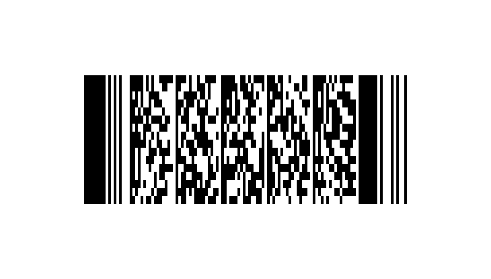

# Camera barcode scanner symbologies

**Requires Windows 10 Version 1803 or later.**

A camera barcode scanner consists of a standard lens camera with auto-focus capabilities (attached to a computer) combined with a software decoder. This topic describes the symbologies supported by the software decoder.

> [!NOTE]
> The software decoder built into Windows 10/11 is provided by [*Digimarc Corporation*](https://www.digimarc.com/).

To determine the specific symbologies supported by a barcode scanner, call [GetSupportedSymbologiesAsync](/uwp/api/windows.devices.pointofservice.barcodescanner.getsupportedsymbologiesasync).

Additional symbologies might be supported by dedicated barcode scanner devices that have built-in hardware decoders, please contact your barcode scanner manufacturer for details.

## 1D Symbologies

| Symbology               |Min Build | Sample |
|-------------------------|----------|--------|
| Code 39                 | 17134  |  |
| Code 128                | 17134  |  |
| Databar Omnidirectional | 17134  |  |
| Databar Stacked         | 17134  |  | 
| EAN-8                   | 17134  |  |
| EAN-13                  | 17134  |  |
| Interleaved 2 of 5      | 17134  |  |
| UPC-A                   | 17134  |  |
| UPC-E                   | 17134  |  |

## 2D Symbologies

| Symbology               | Min Build | Sample |
|-------------------------|-----------|--------|
|  PDF417                 | 19044  |   |
|  QR Code                | 17134  |  |

## Digital Watermark

| Symbology               | Min Build | Sample |
|-------------------------|-----------|--------|
| GS1-DWCode              | 17134  | Scan the image of a package below with your camera barcode scanner application to see GS1DWCode in action.  The image is encoded with UPCA 856107006854.  Please visit http://www.digimarc.com for more information about GS1DWCode capabilities. |

## See also

- [JustScanIt - Windows Store app](https://aka.ms/justscanit)
- [BarcodeScanner sample](https://github.com/microsoft/Windows-universal-samples/tree/main/Samples/BarcodeScanner)
