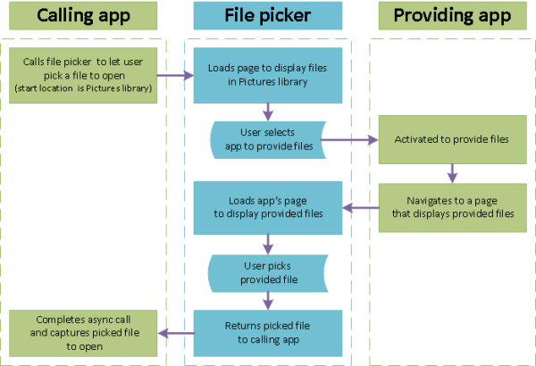

# Open files and folders with a picker

**Important APIs**

- [**FileOpenPicker**](/uwp/api/Windows.Storage.Pickers.FileOpenPicker)
- [**FolderPicker**](/uwp/api/Windows.Storage.Pickers.FolderPicker)
- [**StorageFile**](/uwp/api/Windows.Storage.StorageFile)

Access files and folders by letting the user interact with a picker. You can use the [**FileOpenPicker**](/uwp/api/Windows.Storage.Pickers.FileOpenPicker) and [**FileSavePicker**](/uwp/api/Windows.Storage.Pickers.FileSavePicker) classes to access files, and the [**FolderPicker**](/uwp/api/Windows.Storage.Pickers.FolderPicker) to access a folder.

> [!NOTE]
> For a complete sample, see the [File picker sample](https://github.com/Microsoft/Windows-universal-samples/tree/master/Samples/FilePicker).

> [!NOTE]
> In a desktop app (which includes WinUI 3 apps), you can use file and folder pickers from [Windows.Storage.Pickers](/uwp/api/windows.storage.pickers). However, if the desktop app requires elevation to run, you'll need a different approach because these APIs aren't designed to be used in an elevated app. For an example, see [FileSavePicker](/uwp/api/windows.storage.pickers.filesavepicker#in-a-desktop-app-that-requires-elevation).

## Prerequisites

- **Understand async programming for Universal Windows Platform (UWP) apps**

    You can learn how to write asynchronous apps in C# or Visual Basic, see [Call asynchronous APIs in C# or Visual Basic](../threading-async/call-asynchronous-apis-in-csharp-or-visual-basic.md). To learn how to write asynchronous apps in C++, see [Asynchronous programming in C++](../threading-async/asynchronous-programming-in-cpp-universal-windows-platform-apps.md).

- **Access permissions to the location**

    See [File access permissions](file-access-permissions.md).

## File picker UI

A file picker displays information to orient users and provide a consistent experience when opening or saving files.

That information includes:

- The current location
- The item or items that the user picked
- A tree of locations that the user can browse to. These locations include file system locations—such as the Music or Downloads folder—as well as apps that implement the file picker contract (such as Camera, Photos, and Microsoft OneDrive).

An email app might display a file picker for the user to pick attachments.


## How pickers work

With a picker your app can access, browse, and save files and folders on the user's system. Your app receives those picks as [**StorageFile**](/uwp/api/Windows.Storage.StorageFile) and [**StorageFolder**](/uwp/api/Windows.Storage.StorageFolder) objects, which you can then operate on.

The picker uses a single, unified interface to let the user pick files and folders from the file system or from other apps. Files picked from other apps are like files from the file system: they are returned as [**StorageFile**](/uwp/api/Windows.Storage.StorageFile) objects. In general, your app can operate on them in the same ways as other objects. Other apps make files available by participating in file picker contracts. If you want your app to provide files, a save location, or file updates to other apps, see [Integrating with file picker contracts](/previous-versions/windows/apps/hh465192(v=win.10)).

For example, you might call the file picker in your app so that your user can open a file. This makes your app the calling app. The file picker interacts with the system and/or other apps to let the user navigate and pick the file. When your user chooses a file, the file picker returns that file to your app. Here's the process for the case of the user choosing a file from a providing app, such as OneDrive.



## Pick a single file: complete code listing

```cs
var picker = new Windows.Storage.Pickers.FileOpenPicker();
picker.ViewMode = Windows.Storage.Pickers.PickerViewMode.Thumbnail;
picker.SuggestedStartLocation = Windows.Storage.Pickers.PickerLocationId.PicturesLibrary;
picker.FileTypeFilter.Add(".jpg");
picker.FileTypeFilter.Add(".jpeg");
picker.FileTypeFilter.Add(".png");

Windows.Storage.StorageFile file = await picker.PickSingleFileAsync();
if (file != null)
{
    // Application now has read/write access to the picked file
    this.textBlock.Text = "Picked photo: " + file.Name;
}
else
{
    this.textBlock.Text = "Operation cancelled.";
}
```

## Pick a single file: step-by-step

Using a file picker involves creating and customizing a file picker object, and then showing the file picker so the user can pick one or more items.

1. **Create and customize a FileOpenPicker**

    ```cs
    var picker = new Windows.Storage.Pickers.FileOpenPicker();
    picker.ViewMode = Windows.Storage.Pickers.PickerViewMode.Thumbnail;
    picker.SuggestedStartLocation = Windows.Storage.Pickers.PickerLocationId.PicturesLibrary;
    picker.FileTypeFilter.Add(".jpg");
    picker.FileTypeFilter.Add(".jpeg");
    picker.FileTypeFilter.Add(".png");
    ```

    Set properties on the file picker object relevant to your users and app.

    This example creates a rich, visual display of pictures in a convenient location that the user can pick from by setting three properties: [**ViewMode**](/uwp/api/windows.storage.pickers.fileopenpicker.viewmode), [**SuggestedStartLocation**](/uwp/api/windows.storage.pickers.fileopenpicker.suggestedstartlocation), and [**FileTypeFilter**](/uwp/api/windows.storage.pickers.fileopenpicker.filetypefilter).

    - Setting [**ViewMode**](/uwp/api/windows.storage.pickers.fileopenpicker.viewmode) to the [**PickerViewMode**](/uwp/api/Windows.Storage.Pickers.PickerViewMode) **Thumbnail** enum value creates a rich, visual display by using picture thumbnails to represent files in the file picker. Do this for picking visual files such as pictures or videos. Otherwise, use [**PickerViewMode.List**](/uwp/api/Windows.Storage.Pickers.PickerViewMode). A hypothetical email app with **Attach Picture or Video** and **Attach Document** features would set the **ViewMode** appropriate to the feature before showing the file picker.

    - Setting [**SuggestedStartLocation**](/uwp/api/windows.storage.pickers.fileopenpicker.suggestedstartlocation) to Pictures using [**PickerLocationId.PicturesLibrary**](/uwp/api/Windows.Storage.Pickers.PickerLocationId) starts the user in a location where they're likely to find pictures. Set **SuggestedStartLocation** to a location appropriate for the type of file being picked, for example Music, Pictures, Videos, or Documents. From the start location, the user can navigate to other locations.

    - Using [**FileTypeFilter**](/uwp/api/windows.storage.pickers.fileopenpicker.filetypefilter) to specify file types keeps the user focused on picking files that are relevant. To replace previous file types in the **FileTypeFilter** with new entries, use [**ReplaceAll**](/uwp/api/windows.storage.pickers.fileextensionvector.replaceall) instead of [**Add**](/uwp/api/windows.storage.pickers.fileextensionvector.append).

2. **Show the FileOpenPicker**

    - **To pick a single file**

        ```cs
        Windows.Storage.StorageFile file = await picker.PickSingleFileAsync();
        if (file != null)
        {
            // Application now has read/write access to the picked file
            this.textBlock.Text = "Picked photo: " + file.Name;
        }
        else
        {
            this.textBlock.Text = "Operation cancelled.";
        }
        ```

    - **To pick multiple files**  

        ```cs
        var files = await picker.PickMultipleFilesAsync();
        if (files.Count > 0)
        {
            StringBuilder output = new StringBuilder("Picked files:\n");
    
            // Application now has read/write access to the picked file(s)
            foreach (Windows.Storage.StorageFile file in files)
            {
                output.Append(file.Name + "\n");
            }
            this.textBlock.Text = output.ToString();
        }
        else
        {
            this.textBlock.Text = "Operation cancelled.";
        }
        ```

## Pick a folder: complete code listing

```cs
var folderPicker = new Windows.Storage.Pickers.FolderPicker();
folderPicker.SuggestedStartLocation = Windows.Storage.Pickers.PickerLocationId.Desktop;
folderPicker.FileTypeFilter.Add("*");

Windows.Storage.StorageFolder folder = await folderPicker.PickSingleFolderAsync();
if (folder != null)
{
    // Application now has read/write access to all contents in the picked folder
    // (including other sub-folder contents)
    Windows.Storage.AccessCache.StorageApplicationPermissions.
    FutureAccessList.AddOrReplace("PickedFolderToken", folder);
    this.textBlock.Text = "Picked folder: " + folder.Name;
}
else
{
    this.textBlock.Text = "Operation cancelled.";
}
```

> [!TIP]
> Whenever your app accesses a file or folder through a picker, add it to your app's [**FutureAccessList**](/uwp/api/windows.storage.accesscache.storageapplicationpermissions.futureaccesslist) or [**MostRecentlyUsedList**](/uwp/api/windows.storage.accesscache.storageapplicationpermissions.mostrecentlyusedlist) to keep track of it. You can learn more about using these lists in [How to track recently-used files and folders](how-to-track-recently-used-files-and-folders.md).

## See also

[Windows.Storage.Pickers](/uwp/api/windows.storage.pickers)

[Files, folders, and libraries](index.md)

[Integrating with file picker contracts](/previous-versions/windows/apps/hh465192(v=win.10))
