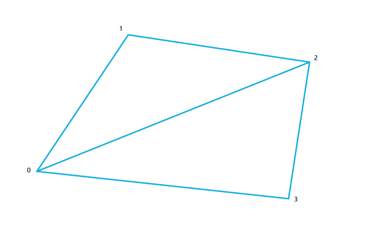

# Create and display a basic mesh


3-D Universal Windows Platform (UWP) games typically use polygons to represent objects and surfaces in the game. The lists of vertices that comprise the structure of these polygonal objects and surfaces are called meshes. Here, we create a basic mesh for a cube object and provide it to the shader pipeline for rendering and display.

> **Important**   The example code included here uses types (such as DirectX::XMFLOAT3 and DirectX::XMFLOAT4X4) and inline methods declared in DirectXMath.h. If you're cutting and pasting this code, \#include &lt;DirectXMath.h&gt; in your project.

 

## What you need to know


### Technologies

-   [Direct3D](/windows/desktop/getting-started-with-direct3d)

### Prerequisites

-   Basic knowledge of linear algebra and 3-D coordinate systems
-   A Visual Studio 2015 or later Direct3D template

## Instructions

These steps will show you how to create a basic mesh cube.

### Step 1: Construct the mesh for the model

In most games, the mesh for a game object is loaded from a file that contains the specific vertex data. The ordering of these vertices is app-dependent, but they are usually serialized as strips or fans. Vertex data can come from any software source, or it can be created manually. It's up to your game to interpret the data in a way that the vertex shader can effectively process it.

In our example, we use a simple mesh for a cube. The cube, like any object mesh at this stage in the pipeline, is represented using its own coordinate system. The vertex shader takes its coordinates and, by applying the transformation matrices you provide, returns the final 2-D view projection in a homogeneous coordinate system.

Define the mesh for a cube. (Or load it from a file. It's your call!)

```cpp
SimpleCubeVertex cubeVertices[] =
{
    { DirectX::XMFLOAT3(-0.5f, 0.5f, -0.5f), DirectX::XMFLOAT3(0.0f, 1.0f, 0.0f) }, // +Y (top face)
    { DirectX::XMFLOAT3( 0.5f, 0.5f, -0.5f), DirectX::XMFLOAT3(1.0f, 1.0f, 0.0f) },
    { DirectX::XMFLOAT3( 0.5f, 0.5f,  0.5f), DirectX::XMFLOAT3(1.0f, 1.0f, 1.0f) },
    { DirectX::XMFLOAT3(-0.5f, 0.5f,  0.5f), DirectX::XMFLOAT3(0.0f, 1.0f, 1.0f) },

    { DirectX::XMFLOAT3(-0.5f, -0.5f,  0.5f), DirectX::XMFLOAT3(0.0f, 0.0f, 1.0f) }, // -Y (bottom face)
    { DirectX::XMFLOAT3( 0.5f, -0.5f,  0.5f), DirectX::XMFLOAT3(1.0f, 0.0f, 1.0f) },
    { DirectX::XMFLOAT3( 0.5f, -0.5f, -0.5f), DirectX::XMFLOAT3(1.0f, 0.0f, 0.0f) },
    { DirectX::XMFLOAT3(-0.5f, -0.5f, -0.5f), DirectX::XMFLOAT3(0.0f, 0.0f, 0.0f) },
};
```

The cube's coordinate system places the center of the cube at the origin, with the y-axis running top to bottom using a left-handed coordinate system. Coordinate values are expressed as 32-bit floating values between -1 and 1.

In each bracketed pairing, the second DirectX::XMFLOAT3 value group specifies the color associated with the vertex as an RGB value. For example, the first vertex at (-0.5, 0.5, -0.5) has a full green color (the G value is set to 1.0, and the "R" and "B" values are set to 0).

Therefore, you have 8 vertices, each with a specific color. Each vertex/color pairing is the complete data for a vertex in our example. When you specify our vertex buffer, you must keep this specific layout in mind. We provide this input layout to the vertex shader so it can understand your vertex data.

### Step 2: Set up the input layout

Now, you have the vertices in memory. But, your graphics device has its own memory, and you use Direct3D to access it. To get your vertex data into the graphics device for processing, you need to clear the way, as it were: you must declare how the vertex data is laid out so that the graphics device can interpret it when it gets it from your game. To do that, you use [**ID3D11InputLayout**](/windows/desktop/api/d3d11/nn-d3d11-id3d11inputlayout).

Declare and set the input layout for the vertex buffer.

```cpp
const D3D11_INPUT_ELEMENT_DESC basicVertexLayoutDesc[] =
{
    { "POSITION", 0, DXGI_FORMAT_R32G32B32_FLOAT, 0,  0, D3D11_INPUT_PER_VERTEX_DATA, 0 },
    { "COLOR",    0, DXGI_FORMAT_R32G32B32_FLOAT, 0, 12, D3D11_INPUT_PER_VERTEX_DATA, 0 },
};

ComPtr<ID3D11InputLayout> inputLayout;
m_d3dDevice->CreateInputLayout(
                basicVertexLayoutDesc,
                ARRAYSIZE(basicVertexLayoutDesc),
                vertexShaderBytecode->Data,
                vertexShaderBytecode->Length,
                &inputLayout)
);
```

In this code, you specify a layout for the vertices, specifically, what data each element in the vertex list contains. Here, in **basicVertexLayoutDesc**, you specify two data components:

-   **POSITION**: This is an HLSL semantic for position data provided to a shader. In this code, it's a DirectX::XMFLOAT3, or more specifically, a structure with 3 32-bit floating point values that correspond to a 3D coordinate (x, y, z). You could also use a float4 if you are supplying the homogeneous "w" coordinate, and in that case, you specify DXGI\_FORMAT\_R32G32B32A32\_FLOAT. Whether you use a DirectX::XMFLOAT3 or a float4 is up to the specific needs of your game. Just make sure that the vertex data for your mesh corresponds correctly to the format you use!

    Each coordinate value is expressed as a floating point value between -1 and 1, in the object's coordinate space. When the vertex shader completes, the transformed vertex is in the homogeneous (perspective corrected) view projection space.

    "But the enumeration value indicates RGB, not XYZ!" you smartly note. Good eye! In both the cases of color data and coordinate data, you typically use 3 or 4 component values, so why not use the same format for both? The HLSL semantic, not the format name, indicates how the shader treats the data.

-   **COLOR**: This is an HLSL semantic for color data. Like **POSITION**, it consists of 3 32-bit floating point values (DirectX::XMFLOAT3). Each value contains a color component: red (r), blue (b), or green (g), expressed as a floating number between 0 and 1.

    **COLOR** values are typically returned as a 4-component RGBA value at the end of the shader pipeline. For this example, you will be setting the "A" alpha value to 1.0 (maximum opacity) in the shader pipeline for all pixels.

For a complete list of formats, see [**DXGI\_FORMAT**](/windows/desktop/api/dxgiformat/ne-dxgiformat-dxgi_format). For a complete list of HLSL semantics, see [Semantics](/windows/desktop/direct3dhlsl/dx-graphics-hlsl-semantics).

Call [**ID3D11Device::CreateInputLayout**](/windows/desktop/api/d3d11/nf-d3d11-id3d11device-createinputlayout) and create the input layout on the Direct3D device. Now, you need to create a buffer that can actually hold the data!

### Step 3: Populate the vertex buffers

Vertex buffers contain the list of vertices for each triangle in the mesh. Every vertex must be unique in this list. In our example, you have 8 vertices for the cube. The vertex shader runs on the graphics device and reads from the vertex buffer, and it interprets the data based on the input layout you specified in the previous step.

In the next example, you provide a description and a subresource for the buffer, which tell Direct3D a number of things about the physical mapping of the vertex data and how to treat it in memory on the graphics device. This is necessary because you use a generic [**ID3D11Buffer**](/windows/desktop/api/d3d11/nn-d3d11-id3d11buffer), which could contain anything! The [**D3D11\_BUFFER\_DESC**](/windows/desktop/api/d3d11/ns-d3d11-d3d11_buffer_desc) and [**D3D11\_SUBRESOURCE\_DATA**](/windows/desktop/api/d3d11/ns-d3d11-d3d11_subresource_data) structures are supplied to ensure that Direct3D understands the physical memory layout of the buffer, including the size of each vertex element in the buffer as well as the maximum size of the vertex list. You can also control access to the buffer memory here and how it is traversed, but that's a bit beyond the scope of this tutorial.

After you configure the buffer, you call [**ID3D11Device::CreateBuffer**](/windows/desktop/api/d3d11/nf-d3d11-id3d11device-createbuffer) to actually create it. Obviously, if you have more than one object, create buffers for each unique model.

Declare and create the vertex buffer.

```cpp
D3D11_BUFFER_DESC vertexBufferDesc = {0};
vertexBufferDesc.ByteWidth = sizeof(SimpleCubeVertex) * ARRAYSIZE(cubeVertices);
vertexBufferDesc.Usage = D3D11_USAGE_DEFAULT;
vertexBufferDesc.BindFlags = D3D11_BIND_VERTEX_BUFFER;
vertexBufferDesc.CPUAccessFlags = 0;
vertexBufferDesc.MiscFlags = 0;
vertexBufferDesc.StructureByteStride = 0;

D3D11_SUBRESOURCE_DATA vertexBufferData;
vertexBufferData.pSysMem = cubeVertices;
vertexBufferData.SysMemPitch = 0;
vertexBufferData.SysMemSlicePitch = 0;

ComPtr<ID3D11Buffer> vertexBuffer;
m_d3dDevice->CreateBuffer(
                &vertexBufferDesc,
                &vertexBufferData,
                &vertexBuffer);
```

Vertices loaded. But what's the order of processing these vertices? That's handled when you provide a list of indices to the vertices—the ordering of these indices is the order in which the vertex shader processes them.

### Step 4: Populate the index buffers

Now, you provide a list of the indices for each of the vertices. These indices correspond to the position of the vertex in the vertex buffer, starting with 0. To help you visualize this, consider that each unique vertex in your mesh has a unique number assigned to it, like an ID. This ID is the integer position of the vertex in the vertex buffer.


In our example cube, you have 8 vertices, which create 6 quads for the sides. You split the quads into triangles, for a total of 12 triangles that use our 8 vertices. At 3 vertices per triangle, you have 36 entries in our index buffer. In our example, this index pattern is known as a triangle list, and you indicate it to Direct3D as a **D3D11\_PRIMITIVE\_TOPOLOGY\_TRIANGLELIST** when you set the primitive topology.

This is probably the most inefficient way to list indices, as there are many redundancies when triangles share points and sides. For example, when a triangle shares a side in a rhombus shape, you list 6 indices for the four vertices, like this:



-   Triangle 1: \[0, 1, 2\]
-   Triangle 2: \[0, 2, 3\]

In a strip or fan topology, you order the vertices in a way that eliminates many redundant sides during traversal (such as the side from index 0 to index 2 in the image.) For large meshes, this dramatically reduces the number of times the vertex shader is run, and improves performance significantly. However, we'll keep it simple and stick with the triangle list.

Declare the indices for the vertex buffer as a simple triangle list topology.

```cpp
unsigned short cubeIndices[] =
{   0, 1, 2,
    0, 2, 3,

    4, 5, 6,
    4, 6, 7,

    3, 2, 5,
    3, 5, 4,

    2, 1, 6,
    2, 6, 5,

    1, 7, 6,
    1, 0, 7,

    0, 3, 4,
    0, 4, 7 };
```

Thirty six index elements in the buffer is very redundant when you only have 8 vertices! If you choose to eliminate some of the redundancies and use a different vertex list type, such as a strip or a fan, you must specify that type when you provide a specific [**D3D11\_PRIMITIVE\_TOPOLOGY**](/previous-versions/windows/desktop/legacy/ff476189(v=vs.85)) value to the [**ID3D11DeviceContext::IASetPrimitiveTopology**](/windows/desktop/api/d3d11/nf-d3d11-id3d11devicecontext-iasetprimitivetopology) method.

For more information about different index list techniques, see [Primitive Topologies](/windows/desktop/direct3d11/d3d10-graphics-programming-guide-primitive-topologies).

### Step 5: Create a constant buffer for your transformation matrices

Before you can start processing vertices, you need to provide the transformation matrices that will be applied (multiplied) to each vertex when it runs. For most 3-D games, there are three of them:

-   The 4x4 matrix that transforms from the object (model) coordinate system to the overall world coordinate system.
-   The 4x4 matrix that transforms from the world coordinate system to the camera (view) coordinate system.
-   The 4x4 matrix that transforms from the camera coordinate system to the 2-D view projection coordinate system.

These matrices are passed to the shader in a *constant buffer*. A constant buffer is a region of memory that remains constant throughout the execution of the next pass of the shader pipeline, and which can be directly accessed by the shaders from your HLSL code. You define each constant buffer two times: first in your game's C++ code, and (at least) one time in the C-like HLSL syntax for your shader code. The two declarations must directly correspond in terms of types and data alignment. It's easy to introduce hard to find errors when the shader uses the HLSL declaration to interpret data declared in C++, and the types don't match or the alignment of data is off!

Constant buffers don't get changed by the HLSL. You can change them when your game updates specific data. Often, game devs create 4 classes of constant buffers: one type for updates per frame; one type for updates per model/object; one type for updates per game state refresh; and one type for data that never changes through the lifetime of the game.

In this example, we just have one that never changes: the DirectX::XMFLOAT4X4 data for the three matrices.

> **Note**   The example code presented here uses column-major matrices. You can use row-major matrices instead by using the **row\_major** keyword in HLSL, and ensuring your source matrix data is also row-major. DirectXMath uses row-major matrices and can be used directly with HLSL matrices defined with the **row\_major** keyword.

 

Declare and create a constant buffer for the three matrices you use to transform each vertex.

```cpp
struct ConstantBuffer
{
    DirectX::XMFLOAT4X4 model;
    DirectX::XMFLOAT4X4 view;
    DirectX::XMFLOAT4X4 projection;
};
ComPtr<ID3D11Buffer> m_constantBuffer;
ConstantBuffer m_constantBufferData;

// ...

// Create a constant buffer for passing model, view, and projection matrices
// to the vertex shader.  This allows us to rotate the cube and apply
// a perspective projection to it.

D3D11_BUFFER_DESC constantBufferDesc = {0};
constantBufferDesc.ByteWidth = sizeof(m_constantBufferData);
constantBufferDesc.Usage = D3D11_USAGE_DEFAULT;
constantBufferDesc.BindFlags = D3D11_BIND_CONSTANT_BUFFER;
constantBufferDesc.CPUAccessFlags = 0;
constantBufferDesc.MiscFlags = 0;
constantBufferDesc.StructureByteStride = 0;
m_d3dDevice->CreateBuffer(
                &constantBufferDesc,
                nullptr,
                &m_constantBuffer
             );

m_constantBufferData.model = DirectX::XMFLOAT4X4( // Identity matrix, since you are not animating the object
            1.0f, 0.0f, 0.0f, 0.0f,
            0.0f, 1.0f, 0.0f, 0.0f,
            0.0f, 0.0f, 1.0f, 0.0f,
            0.0f, 0.0f, 0.0f, 1.0f);

);
// Specify the view (camera) transform corresponding to a camera position of
// X = 0, Y = 1, Z = 2.  

m_constantBufferData.view = DirectX::XMFLOAT4X4(
            -1.00000000f, 0.00000000f,  0.00000000f,  0.00000000f,
             0.00000000f, 0.89442718f,  0.44721359f,  0.00000000f,
             0.00000000f, 0.44721359f, -0.89442718f, -2.23606800f,
             0.00000000f, 0.00000000f,  0.00000000f,  1.00000000f);
```

> **Note**  You usually declare the projection matrix when you set up device specific resources, because the results of multiplication with it must match the current 2-D viewport size parameters (which often correspond with the pixel height and width of the display). If those change, you must scale the x- and y-coordinate values accordingly.

 

```cpp
// Finally, update the constant buffer perspective projection parameters
// to account for the size of the application window.  In this sample,
// the parameters are fixed to a 70-degree field of view, with a depth
// range of 0.01 to 100.  

float xScale = 1.42814801f;
float yScale = 1.42814801f;
if (backBufferDesc.Width > backBufferDesc.Height)
{
    xScale = yScale *
                static_cast<float>(backBufferDesc.Height) /
                static_cast<float>(backBufferDesc.Width);
}
else
{
    yScale = xScale *
                static_cast<float>(backBufferDesc.Width) /
                static_cast<float>(backBufferDesc.Height);
}
m_constantBufferData.projection = DirectX::XMFLOAT4X4(
            xScale, 0.0f,    0.0f,  0.0f,
            0.0f,   yScale,  0.0f,  0.0f,
            0.0f,   0.0f,   -1.0f, -0.01f,
            0.0f,   0.0f,   -1.0f,  0.0f
            );
```

While you're here, set the vertex and index buffers on the[ID3D11DeviceContext](/windows/desktop/direct3d11/d3d11-graphics-reference-10level9-context), plus the topology you're using.

```cpp
// Set the vertex and index buffers, and specify the way they define geometry.
UINT stride = sizeof(SimpleCubeVertex);
UINT offset = 0;
m_d3dDeviceContext->IASetVertexBuffers(
                0,
                1,
                vertexBuffer.GetAddressOf(),
                &stride,
                &offset);

m_d3dDeviceContext->IASetIndexBuffer(
                indexBuffer.Get(),
                DXGI_FORMAT_R16_UINT,
                0);

 m_d3dDeviceContext->IASetPrimitiveTopology(D3D11_PRIMITIVE_TOPOLOGY_TRIANGLELIST);
```

All right! Input assembly complete. Everything's in place for rendering. Let's get that vertex shader going.

### Step 6: Process the mesh with the vertex shader

Now that you have a vertex buffer with the vertices that define your mesh, and the index buffer that defines the order in which the vertices are processed, you send them to the vertex shader. The vertex shader code, expressed as compiled high-level shader language, runs one time for each vertex in the vertex buffer, allowing you to perform your per-vertex transforms. The final result is typically a 2-D projection.

(Did you load your vertex shader? If not, review [How to load resources in your DirectX game](load-a-game-asset.md).)

Here, you create the vertex shader...

``` syntax
// Set the vertex and pixel shader stage state.
m_d3dDeviceContext->VSSetShader(
                vertexShader.Get(),
                nullptr,
                0);
```

...and set the constant buffers.

``` syntax
m_d3dDeviceContext->VSSetConstantBuffers(
                0,
                1,
                m_constantBuffer.GetAddressOf());
```

Here's the vertex shader code that handles the transformation from object coordinates to world coordinates and then to the 2-D view projection coordinate system. You also apply some simple per-vertex lighting to make things pretty. This goes in your vertex shader's HLSL file (SimplerVertexShader.hlsl, in this example).

``` syntax
cbuffer simpleConstantBuffer : register( b0 )
{
    matrix model;
    matrix view;
    matrix projection;
};

struct VertexShaderInput
{
    DirectX::XMFLOAT3 pos : POSITION;
    DirectX::XMFLOAT3 color : COLOR;
};

struct PixelShaderInput
{
    float4 pos : SV_POSITION;
    float4 color : COLOR;
};

PixelShaderInput SimpleVertexShader(VertexShaderInput input)
{
    PixelShaderInput vertexShaderOutput;
    float4 pos = float4(input.pos, 1.0f);

    // Transform the vertex position into projection space.
    pos = mul(pos, model);
    pos = mul(pos, view);
    pos = mul(pos, projection);
    vertexShaderOutput.pos = pos;

    // Pass the vertex color through to the pixel shader.
    vertexShaderOutput.color = float4(input.color, 1.0f);

    return vertexShaderOutput;
}
```

See that **cbuffer** at the top? That's the HLSL analogue to the same constant buffer we declared in our C++ code previously. And the **VertexShaderInputstruct**? Why, that looks just like your input layout and vertex data declaration! It's important that the constant buffer and vertex data declarations in your C++ code match the declarations in your HLSL code—and that includes signs, types, and data alignment.

**PixelShaderInput** specifies the layout of the data that is returned by the vertex shader's main function. When you finish processing a vertex, you'll return a vertex position in the 2-D projection space and a color used for per-vertex lighting. The graphics card uses data output by the shader to calculate the "fragments" (possible pixels) that must be colored when the pixel shader is run in the next stage of the pipeline.

### Step 7: Passing the mesh through the pixel shader

Typically, at this stage in the graphics pipeline, you perform per-pixel operations on the visible projected surfaces of your objects. (People like textures.) For the purposes of sample, though, you simply pass it through this stage.

First, let's create an instance of the pixel shader. The pixel shader runs for every pixel in the 2-D projection of your scene, assigning a color to that pixel. In this case, we pass the color for the pixel returned by the vertex shader straight through.

Set the pixel shader.

``` syntax
m_d3dDeviceContext->PSSetShader( pixelShader.Get(), nullptr, 0 );
```

Define a passthrough pixel shader in HLSL.

``` syntax
struct PixelShaderInput
{
    float4 pos : SV_POSITION;
};

float4 SimplePixelShader(PixelShaderInput input) : SV_TARGET
{
    // Draw the entire triangle yellow.
    return float4(1.0f, 1.0f, 0.0f, 1.0f);
}
```

Put this code in an HLSL file separate from the vertex shader HLSL (such as SimplePixelShader.hlsl). This code is run one time for every visible pixel in your viewport (an in-memory representation of the portion of the screen you are drawing to), which, in this case, maps to the entire screen. Now, your graphics pipeline is completely defined!

### Step 8: Rasterizing and displaying the mesh

Let's run the pipeline. This is easy: call [**ID3D11DeviceContext::DrawIndexed**](/windows/desktop/api/d3d10/nf-d3d10-id3d10device-drawindexed).

Draw that cube!

```cpp
// Draw the cube.
m_d3dDeviceContext->DrawIndexed( ARRAYSIZE(cubeIndices), 0, 0 );
            
```

Inside the graphics card, each vertex is processed in the order specified in your index buffer. After your code has executed the vertex shader and the 2-D fragments are defined, the pixel shader is invoked and the triangles colored.

Now, put the cube on the screen.

Present that frame buffer to the display.

```cpp
// Present the rendered image to the window.  Because the maximum frame latency is set to 1,
// the render loop is generally  throttled to the screen refresh rate, typically around
// 60 Hz, by sleeping the app on Present until the screen is refreshed.

m_swapChain->Present(1, 0);
```

And you're done! For a scene full of models, use multiple vertex and index buffers, and you might even have different shaders for different model types. Remember that each model has its own coordinate system, and you need to transform them to the shared world coordinate system using the matrices you defined in the constant buffer.

## Remarks

This topic covers creating and displaying simple geometry that you create yourself. For more info about loading more complex geometry from a file and converting it to the sample-specific vertex buffer object (.vbo) format, see [How to load resources in your DirectX game](load-a-game-asset.md).  

 

## Related topics


* [How to load resources in your DirectX game](load-a-game-asset.md)

 

 