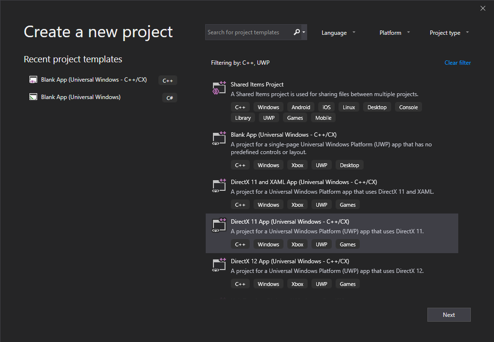
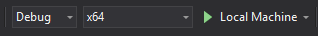

# Marble Maze sample fundamentals


This topic describes the fundamental characteristics of the Marble Maze project&mdash;for example, how it uses Visual C++ in the Windows Runtime environment, how it is created and structured, and how it is built. The topic also describes several of the conventions that are used in the code.

> [!NOTE]
> The sample code that corresponds to this document is found in the [DirectX Marble Maze game sample](https://github.com/microsoft/Windows-appsample-marble-maze).

Here are some of the key points that this document discusses for when you plan and develop your Universal Windows Platform (UWP) game.

-   Use the **DirectX 11 App (Universal Windows - C++/CX)** template in Visual Studio to create your DirectX UWP game.
-   The Windows Runtime provides classes and interfaces so that you can develop UWP apps in a more modern, object-oriented manner.
-   Use object references with the hat (^) symbol to manage the lifetime of Windows Runtime variables, [Microsoft::WRL::ComPtr](/cpp/windows/comptr-class) to manage the lifetime of COM objects, and [std::shared\_ptr](/cpp/standard-library/shared-ptr-class) or [std::unique\_ptr](/cpp/standard-library/unique-ptr-class) to manage the lifetime of all other heap-allocated C++ objects.
-   In most cases, use exception handling, instead of result codes, to deal with unexpected errors.
-   Use [SAL annotations](/visualstudio/code-quality/using-sal-annotations-to-reduce-c-cpp-code-defects) together with code analysis tools to help discover errors in your app.

## Creating the Visual Studio project


If you've downloaded and extracted the sample, you can open the **MarbleMaze_VS2017.sln** file (in the **C++** folder) in Visual Studio, and you'll have the code in front of you.

When we created the Visual Studio project for Marble Maze, we started with an existing project. However, if you do not already have an existing project that provides the basic functionality that your DirectX UWP game requires, we recommend that you create a project based on the Visual Studio **DirectX 11 App (Universal Windows - C++/CX)** template because it provides a basic working 3D application. To do this, follow these steps:

1. In Visual Studio 2019, select **File > New > Project...**

2. In the **Create a new project** window, select **DirectX 11 App (Universal Windows - C++/CX)**. If you don't see this option, you may not have the required components installed&mdash;see [Modify Visual Studio 2019 by adding or removing workloads and components](/visualstudio/install/modify-visual-studio) for information about how to install additional components.



3. Select **Next**, and then enter  a **Project name**, a **Location** for the files to be stored, and a **Solution name**, and then select **Create**.


One important project setting in the **DirectX 11 App (Universal Windows - C++/CX)** template is the **/ZW** option, which enables the program to use the Windows Runtime language extensions. This option is enabled by default when you use the Visual Studio template. See [Compiler and Linker options (C++/CX)](/cpp/cppcx/compiler-and-linker-options-c-cx) for more info about how to set compiler options in Visual Studio.

> **Caution**   The **/ZW** option is not compatible with options such as **/clr**. In the case of **/clr**, this means that you cannot target both the .NET Framework and the Windows Runtime from the same Visual C++ project.

 

Every UWP app that you acquire from the Microsoft Store comes in the form of an app package. An app package contains a package manifest, which contains information about your app. For example, you can specify the capabilities (that is, the required access to protected system resources or user data) of your app. If you determine that your app requires certain capabilities, use the package manifest to declare the required capabilities. The manifest also lets you specify project properties such as supported device rotations, tile images, and the splash screen. You can edit the manifest by opening **Package.appxmanifest** in your project. For more info about app packages, see [Packaging apps](../packaging/index.md).

##  Building, deploying, and running the game

In the dropdown menus at the top of Visual Studio, to the left of the green play button, select your deployment configuration. We recommend setting it as **Debug** targeting your device's architecture (**x86** for 32-bit, **x64** for 64-bit) and to your **Local Machine**. You can also test on a **Remote Machine**, or to a **Device** that's connected via USB. Then click the green play button to build and deploy to your device.



###  Controlling the game

You can use touch, the accelerometer, a game controller, or the mouse to control Marble Maze.

-   Use the directional pad on the controller to change the active menu item.
-   Use touch, the A or Start button on the controller, or the mouse to pick a menu item.
-   Use touch, the accelerometer, the left thumbstick, or the mouse to tilt the maze.
-   Use touch, the A or Start button on the controller, or the mouse to close menus such as the high score table.
-   Use the Start button on the controller or the P key on the keyboard to pause or resume the game.
-   Use the Back button on the controller or the Home key on the keyboard to restart the game.
-   When the high-score table is visible, use the Back button on the controller or the Home key on the keyboard to clear all scores.

##  Code conventions


The Windows Runtime is a programming interface that you can use to create UWP apps that run only in a special application environment. Such apps use authorized functions, data types, and devices, and are distributed from the Microsoft Store. At the lowest level, the Windows Runtime consists of an Application Binary Interface (ABI). The ABI is a low-level binary contract that makes Windows Runtime APIs accessible to multiple programming languages such as JavaScript, the .NET languages, and Visual C++.

In order to call Windows Runtime APIs from JavaScript and .NET, those languages require projections that are specific to each language environment. When you call a Windows Runtime API from JavaScript or .NET, you are invoking the projection, which in turn calls the underlying ABI function. Although you can call the ABI functions directly in C++, Microsoft provides projections for C++ as well, because they make it much simpler to consume the Windows Runtime APIs, while still maintaining high performance. Microsoft also provides language extensions to Visual C++ that specifically support the Windows Runtime projections. Many of these language extensions resemble the syntax for the C++/CLI language. However, instead of targeting the common language runtime (CLR), native apps use this syntax to target the Windows Runtime. The object reference, or hat (^), modifier is an important part of this new syntax because it enables the automatic deletion of runtime objects by means of reference counting. Instead of calling methods such as [AddRef](/windows/desktop/api/unknwn/nf-unknwn-iunknown-addref) and [Release](/windows/desktop/api/unknwn/nf-unknwn-iunknown-release) to manage the lifetime of a Windows Runtime object, the runtime deletes the object when no other component references it, for example, when it leaves scope or you set all references to **nullptr**. Another important part of using Visual C++ to create UWP apps is the **ref new** keyword. Use **ref new** instead of **new** to create reference-counted Windows Runtime objects. For more info, see [Type System (C++/CX)](/cpp/cppcx/type-system-c-cx).

> [!IMPORTANT]
> You only have to use **^** and **ref new** when you create Windows Runtime objects or create Windows Runtime components. You can use the standard C++ syntax when you write core application code that does not use the Windows Runtime.

Marble Maze uses **^** together with **Microsoft::WRL::ComPtr** to manage heap-allocated objects and minimize memory leaks. We recommend that you use ^ to manage the lifetime of Windows Runtime variables, **ComPtr** to manage the lifetime of COM variables (such as when you use DirectX), and **std::shared\_ptr** or **std::unique\_ptr** to manage the lifetime of all other heap-allocated C++ objects.

 

For more info about the language extensions that are available to a C++ UWP app, see [Visual C++ Language Reference (C++/CX)](/cpp/cppcx/visual-c-language-reference-c-cx).

###  Error handling

Marble Maze uses exception handling as the primary way to deal with unexpected errors. Although game code traditionally uses logging or error codes, such as **HRESULT** values, to indicate errors, exception handling has two main advantages. First, it can make the code easier to read and maintain. From a code perspective, exception handling is a more efficient way to propagate an error to a routine that can handle that error. The use of error codes typically requires each function to explicitly propagate errors. A second advantage is that you can configure the Visual Studio debugger to break when an exception occurs so that you can stop immediately at the location and context of the error. The Windows Runtime also uses exception handling extensively. Therefore, by using exception handling in your code, you can combine all error handling into one model.

We recommend that you use the following conventions in your error handling model:

-   Use exceptions to communicate unexpected errors.
-   Do not use exceptions to control the flow of code.
-   Catch only the exceptions that you can safely handle and recover from. Otherwise, do not catch the exception and allow the app to terminate.
-   When you call a DirectX routine that returns **HRESULT**, use the **DX::ThrowIfFailed** function. This function is defined in [DirectXHelper.h](https://github.com/Microsoft/Windows-appsample-marble-maze/blob/master/C%2B%2B/Shared/DirectXHelper.h). **ThrowIfFailed** throws an exception if the provided **HRESULT** is an error code. For example, **E\_POINTER** causes **ThrowIfFailed** to throw [Platform::NullReferenceException](/cpp/cppcx/platform-nullreferenceexception-class).

    When you use **ThrowIfFailed**, put the DirectX call on a separate line to help improve code readability, as shown in the following example.

    ```cpp
    // Identify the physical adapter (GPU or card) this device is running on.
    ComPtr<IDXGIAdapter> dxgiAdapter;
    DX::ThrowIfFailed(
        dxgiDevice->GetAdapter(&dxgiAdapter)
        );
    ```

-   Although we recommend that you avoid the use of **HRESULT** for unexpected errors, it is more important to avoid the use of exception handling to control the flow of code. Therefore, it is preferred to use an **HRESULT** return value when necessary to control the flow of code.

###  SAL annotations

Use SAL annotations together with code analysis tools to help discover errors in your app.

By using Microsoft source-code annotation language (SAL), you can annotate, or describe, how a function uses its parameters. SAL annotations also describe return values. SAL annotations work with the C/C++ Code Analysis tool to discover possible defects in C and C++ source code. Common coding errors reported by the tool include buffer overruns, uninitialized memory, null pointer dereferences, and memory and resource leaks.

Consider the **BasicLoader::LoadMesh** method, which is declared in [BasicLoader.h](https://github.com/Microsoft/Windows-appsample-marble-maze/blob/e62d68a85499e208d591d2caefbd9df62af86809/C%2B%2B/Shared/BasicLoader.h). This method uses `_In_` to specify that *filename* is an input parameter (and therefore will only be read from), `_Out_` to specify that *vertexBuffer* and *indexBuffer* are output parameters (and therefore will only be written to), and `_Out_opt_` to specify that *vertexCount* and *indexCount* are optional output parameters (and might be written to). Because *vertexCount* and *indexCount* are optional output parameters, they are allowed to be **nullptr**. The C/C++ Code Analysis tool examines calls to this method to ensure that the parameters it passes meet these criteria.

```cpp
void LoadMesh(
    _In_ Platform::String^ filename,
    _Out_ ID3D11Buffer** vertexBuffer,
    _Out_ ID3D11Buffer** indexBuffer,
    _Out_opt_ uint32* vertexCount,
    _Out_opt_ uint32* indexCount
    );
```

To perform code analysis on your app, on the menu bar, choose **Build > Run Code Analysis on Solution**. For more info about code analysis, see [Analyzing C/C++ Code Quality by Using Code Analysis](/visualstudio/code-quality/analyzing-c-cpp-code-quality-by-using-code-analysis).

The complete list of available annotations is defined in sal.h. For more info, see [SAL Annotations](/cpp/c-runtime-library/sal-annotations).

## Next steps


Read [Marble Maze application structure](marble-maze-application-structure.md) for information about how the Marble Maze application code is structured and how the structure of a DirectX UWP app differs from that of a traditional desktop application.

## Related topics


* [Marble Maze application structure](marble-maze-application-structure.md)
* [Developing Marble Maze, a UWP game in C++ and DirectX](developing-marble-maze-a-windows-store-game-in-cpp-and-directx.md)

 

 
