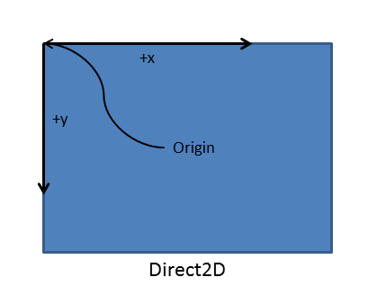

# Supporting screen orientation (DirectX and C++)

Your Universal Windows Platform (UWP) app can support multiple screen orientations when you handle the [**DisplayInformation::OrientationChanged**](/uwp/api/windows.graphics.display.displayinformation.orientationchanged) event. Here, we'll discuss best practices for handling screen rotation in your UWP DirectX app, so that the Windows 10 device's graphics hardware are used efficiently and effectively.

Before you start, remember that graphics hardware always outputs pixel data in the same way, regardless of the orientation of the device. Windows 10 devices can determine their current display orientation (with some sort of sensor, or with a software toggle) and allow users to change the display settings. Because of this, Windows 10 itself handles the rotation of the images to ensure they are "upright" based on the orientation of the device. By default, your app receives the notification that something has changed in orientation, for example, a window size. When this happens, Windows 10 immediately rotates the image for final display. For three of the four specific screen orientations (discussed later), Windows 10 uses additional graphic resources and computation to display the final image.

For UWP DirectX apps, the [**DisplayInformation**](/uwp/api/Windows.Graphics.Display.DisplayInformation) object provides basic display orientation data that your app can query. The default orientation is *landscape*, where the pixel width of the display is greater than the height; the alternative orientation is *portrait*, where the display is rotated 90 degrees in either direction and the width becomes less than the height.

Windows 10 defines four specific display orientation modes:

-   Landscape—the default display orientation for Windows 10, and is considered the base or identity angle for rotation (0 degrees).
-   Portrait—the display has been rotated clockwise 90 degrees (or counter-clockwise 270 degrees).
-   Landscape, flipped—the display has been rotated 180 degrees (turned upside-down).
-   Portrait, flipped—the display has been rotated clockwise 270 degrees (or counter-clockwise 90 degrees).

When the display rotates from one orientation to another, Windows 10 internally performs a rotation operation to align the drawn image with the new orientation, and the user sees an upright image on the screen.

Also, Windows 10 displays automatic transition animations to create a smooth user experience when shifting from one orientation to another. As the display orientation shifts, the user sees these shifts as a fixed zoom and rotation animation of the displayed screen image. Time is allocated by Windows 10 to the app for layout in the new orientation.

Overall, this is the general process for handling changes in screen orientation:

1.  Use a combination of the window bounds values and the display orientation data to keep the swap chain aligned with the native display orientation of the device.
2.  Notify Windows 10 of the orientation of the swap chain using [**IDXGISwapChain1::SetRotation**](/windows/desktop/api/dxgi1_2/nf-dxgi1_2-idxgiswapchain1-setrotation).
3.  Change the rendering code to generate images aligned with the user orientation of the device.

## Resizing the swap chain and pre-rotating its contents


To perform a basic display resize and pre-rotate its contents in your UWP DirectX app , implement these steps:

1.  Handle the [**DisplayInformation::OrientationChanged**](/uwp/api/windows.graphics.display.displayinformation.orientationchanged) event.
2.  Resize the swap chain to the new dimensions of the window.
3.  Call [**IDXGISwapChain1::SetRotation**](/windows/desktop/api/dxgi1_2/nf-dxgi1_2-idxgiswapchain1-setrotation) to set the orientation of the swap chain.
4.  Recreate any window size dependent resources, such as your render targets and other pixel data buffers.

Now's let's look at those steps in a bit more detail.

Your first step is to register a handler for the [**DisplayInformation::OrientationChanged**](/uwp/api/windows.graphics.display.displayinformation.orientationchanged) event. This event is raised in your app every time the screen orientation changes, such as when the display is rotated.

To handle the [**DisplayInformation::OrientationChanged**](/uwp/api/windows.graphics.display.displayinformation.orientationchanged) event, you connect your handler for **DisplayInformation::OrientationChanged** in the required [**SetWindow**](/uwp/api/windows.applicationmodel.core.iframeworkview.setwindow) method, which is one of the methods of the [**IFrameworkView**](/uwp/api/Windows.ApplicationModel.Core.IFrameworkView) interface that your view provider must implement.

In this code example, the event handler for [**DisplayInformation::OrientationChanged**](/uwp/api/windows.graphics.display.displayinformation.orientationchanged) is a method called **OnOrientationChanged**. When **DisplayInformation::OrientationChanged** is raised, it in turn calls a method called **SetCurrentOrientation** which then calls **CreateWindowSizeDependentResources**.

```cpp
void App::SetWindow(CoreWindow^ window)
{
  // ... Other UI event handlers assigned here ...
  
    currentDisplayInformation->OrientationChanged +=
        ref new TypedEventHandler<DisplayInformation^, Object^>(this, &App::OnOrientationChanged);

  // ...
}
}
```

```cpp
void App::OnOrientationChanged(DisplayInformation^ sender, Object^ args)
{
    m_deviceResources->SetCurrentOrientation(sender->CurrentOrientation);
    m_main->CreateWindowSizeDependentResources();
}

// This method is called in the event handler for the OrientationChanged event.
void DX::DeviceResources::SetCurrentOrientation(DisplayOrientations currentOrientation)
{
    if (m_currentOrientation != currentOrientation)
    {
        m_currentOrientation = currentOrientation;
        CreateWindowSizeDependentResources();
    }
}
```

Next, you resize the swap chain for the new screen orientation and prepare it to rotate the contents of the graphic pipeline when the rendering is performed. In this example, **DirectXBase::CreateWindowSizeDependentResources** is a method that handles calling IDXGISwapChain::ResizeBuffers, setting a 3D and a 2D rotation matrix, calling SetRotation, and recreating your resources.

```cpp
void DX::DeviceResources::CreateWindowSizeDependentResources() 
{
    // Clear the previous window size specific context.
    ID3D11RenderTargetView* nullViews[] = {nullptr};
    m_d3dContext->OMSetRenderTargets(ARRAYSIZE(nullViews), nullViews, nullptr);
    m_d3dRenderTargetView = nullptr;
    m_d2dContext->SetTarget(nullptr);
    m_d2dTargetBitmap = nullptr;
    m_d3dDepthStencilView = nullptr;
    m_d3dContext->Flush();

    // Calculate the necessary render target size in pixels.
    m_outputSize.Width = DX::ConvertDipsToPixels(m_logicalSize.Width, m_dpi);
    m_outputSize.Height = DX::ConvertDipsToPixels(m_logicalSize.Height, m_dpi);
    
    // Prevent zero size DirectX content from being created.
    m_outputSize.Width = max(m_outputSize.Width, 1);
    m_outputSize.Height = max(m_outputSize.Height, 1);

    // The width and height of the swap chain must be based on the window's
    // natively-oriented width and height. If the window is not in the native
    // orientation, the dimensions must be reversed.
    DXGI_MODE_ROTATION displayRotation = ComputeDisplayRotation();

    bool swapDimensions = displayRotation == DXGI_MODE_ROTATION_ROTATE90 || displayRotation == DXGI_MODE_ROTATION_ROTATE270;
    m_d3dRenderTargetSize.Width = swapDimensions ? m_outputSize.Height : m_outputSize.Width;
    m_d3dRenderTargetSize.Height = swapDimensions ? m_outputSize.Width : m_outputSize.Height;

    if (m_swapChain != nullptr)
    {
        // If the swap chain already exists, resize it.
        HRESULT hr = m_swapChain->ResizeBuffers(
            2, // Double-buffered swap chain.
            lround(m_d3dRenderTargetSize.Width),
            lround(m_d3dRenderTargetSize.Height),
            DXGI_FORMAT_B8G8R8A8_UNORM,
            0
            );

        if (hr == DXGI_ERROR_DEVICE_REMOVED || hr == DXGI_ERROR_DEVICE_RESET)
        {
            // If the device was removed for any reason, a new device and swap chain will need to be created.
            HandleDeviceLost();

            // Everything is set up now. Do not continue execution of this method. HandleDeviceLost will reenter this method 
            // and correctly set up the new device.
            return;
        }
        else
        {
            DX::ThrowIfFailed(hr);
        }
    }
    else
    {
        // Otherwise, create a new one using the same adapter as the existing Direct3D device.
        DXGI_SWAP_CHAIN_DESC1 swapChainDesc = {0};

        swapChainDesc.Width = lround(m_d3dRenderTargetSize.Width); // Match the size of the window.
        swapChainDesc.Height = lround(m_d3dRenderTargetSize.Height);
        swapChainDesc.Format = DXGI_FORMAT_B8G8R8A8_UNORM; // This is the most common swap chain format.
        swapChainDesc.Stereo = false;
        swapChainDesc.SampleDesc.Count = 1; // Don't use multi-sampling.
        swapChainDesc.SampleDesc.Quality = 0;
        swapChainDesc.BufferUsage = DXGI_USAGE_RENDER_TARGET_OUTPUT;
        swapChainDesc.BufferCount = 2; // Use double-buffering to minimize latency.
        swapChainDesc.SwapEffect = DXGI_SWAP_EFFECT_FLIP_SEQUENTIAL; // All UWP apps must use this SwapEffect.
        swapChainDesc.Flags = 0;    
        swapChainDesc.Scaling = DXGI_SCALING_NONE;
        swapChainDesc.AlphaMode = DXGI_ALPHA_MODE_IGNORE;

        // This sequence obtains the DXGI factory that was used to create the Direct3D device above.
        ComPtr<IDXGIDevice3> dxgiDevice;
        DX::ThrowIfFailed(
            m_d3dDevice.As(&dxgiDevice)
            );

        ComPtr<IDXGIAdapter> dxgiAdapter;
        DX::ThrowIfFailed(
            dxgiDevice->GetAdapter(&dxgiAdapter)
            );

        ComPtr<IDXGIFactory2> dxgiFactory;
        DX::ThrowIfFailed(
            dxgiAdapter->GetParent(IID_PPV_ARGS(&dxgiFactory))
            );

        DX::ThrowIfFailed(
            dxgiFactory->CreateSwapChainForCoreWindow(
                m_d3dDevice.Get(),
                reinterpret_cast<IUnknown*>(m_window.Get()),
                &swapChainDesc,
                nullptr,
                &m_swapChain
                )
            );

        // Ensure that DXGI does not queue more than one frame at a time. This both reduces latency and
        // ensures that the application will only render after each VSync, minimizing power consumption.
        DX::ThrowIfFailed(
            dxgiDevice->SetMaximumFrameLatency(1)
            );
    }

    // Set the proper orientation for the swap chain, and generate 2D and
    // 3D matrix transformations for rendering to the rotated swap chain.
    // Note the rotation angle for the 2D and 3D transforms are different.
    // This is due to the difference in coordinate spaces.  Additionally,
    // the 3D matrix is specified explicitly to avoid rounding errors.

    switch (displayRotation)
    {
    case DXGI_MODE_ROTATION_IDENTITY:
        m_orientationTransform2D = Matrix3x2F::Identity();
        m_orientationTransform3D = ScreenRotation::Rotation0;
        break;

    case DXGI_MODE_ROTATION_ROTATE90:
        m_orientationTransform2D = 
            Matrix3x2F::Rotation(90.0f) *
            Matrix3x2F::Translation(m_logicalSize.Height, 0.0f);
        m_orientationTransform3D = ScreenRotation::Rotation270;
        break;

    case DXGI_MODE_ROTATION_ROTATE180:
        m_orientationTransform2D = 
            Matrix3x2F::Rotation(180.0f) *
            Matrix3x2F::Translation(m_logicalSize.Width, m_logicalSize.Height);
        m_orientationTransform3D = ScreenRotation::Rotation180;
        break;

    case DXGI_MODE_ROTATION_ROTATE270:
        m_orientationTransform2D = 
            Matrix3x2F::Rotation(270.0f) *
            Matrix3x2F::Translation(0.0f, m_logicalSize.Width);
        m_orientationTransform3D = ScreenRotation::Rotation90;
        break;

    default:
        throw ref new FailureException();
    }


    //SDM: only instance of SetRotation
    DX::ThrowIfFailed(
        m_swapChain->SetRotation(displayRotation)
        );

    // Create a render target view of the swap chain back buffer.
    ComPtr<ID3D11Texture2D> backBuffer;
    DX::ThrowIfFailed(
        m_swapChain->GetBuffer(0, IID_PPV_ARGS(&backBuffer))
        );

    DX::ThrowIfFailed(
        m_d3dDevice->CreateRenderTargetView(
            backBuffer.Get(),
            nullptr,
            &m_d3dRenderTargetView
            )
        );

    // Create a depth stencil view for use with 3D rendering if needed.
    CD3D11_TEXTURE2D_DESC depthStencilDesc(
        DXGI_FORMAT_D24_UNORM_S8_UINT, 
        lround(m_d3dRenderTargetSize.Width),
        lround(m_d3dRenderTargetSize.Height),
        1, // This depth stencil view has only one texture.
        1, // Use a single mipmap level.
        D3D11_BIND_DEPTH_STENCIL
        );

    ComPtr<ID3D11Texture2D> depthStencil;
    DX::ThrowIfFailed(
        m_d3dDevice->CreateTexture2D(
            &depthStencilDesc,
            nullptr,
            &depthStencil
            )
        );

    CD3D11_DEPTH_STENCIL_VIEW_DESC depthStencilViewDesc(D3D11_DSV_DIMENSION_TEXTURE2D);
    DX::ThrowIfFailed(
        m_d3dDevice->CreateDepthStencilView(
            depthStencil.Get(),
            &depthStencilViewDesc,
            &m_d3dDepthStencilView
            )
        );
    
    // Set the 3D rendering viewport to target the entire window.
    m_screenViewport = CD3D11_VIEWPORT(
        0.0f,
        0.0f,
        m_d3dRenderTargetSize.Width,
        m_d3dRenderTargetSize.Height
        );

    m_d3dContext->RSSetViewports(1, &m_screenViewport);

    // Create a Direct2D target bitmap associated with the
    // swap chain back buffer and set it as the current target.
    D2D1_BITMAP_PROPERTIES1 bitmapProperties = 
        D2D1::BitmapProperties1(
            D2D1_BITMAP_OPTIONS_TARGET | D2D1_BITMAP_OPTIONS_CANNOT_DRAW,
            D2D1::PixelFormat(DXGI_FORMAT_B8G8R8A8_UNORM, D2D1_ALPHA_MODE_PREMULTIPLIED),
            m_dpi,
            m_dpi
            );

    ComPtr<IDXGISurface2> dxgiBackBuffer;
    DX::ThrowIfFailed(
        m_swapChain->GetBuffer(0, IID_PPV_ARGS(&dxgiBackBuffer))
        );

    DX::ThrowIfFailed(
        m_d2dContext->CreateBitmapFromDxgiSurface(
            dxgiBackBuffer.Get(),
            &bitmapProperties,
            &m_d2dTargetBitmap
            )
        );

    m_d2dContext->SetTarget(m_d2dTargetBitmap.Get());

    // Grayscale text anti-aliasing is recommended for all UWP apps.
    m_d2dContext->SetTextAntialiasMode(D2D1_TEXT_ANTIALIAS_MODE_GRAYSCALE);

}

```

After saving the current height and width values of the window for the next time this method is called, convert the device independent pixel (DIP) values for the display bounds to pixels. In the sample, you call **ConvertDipsToPixels**, which is a simple function that runs this code:

` floor((dips * dpi / 96.0f) + 0.5f);`

You add the 0.5f to ensure rounding to the nearest integer value.

As an aside, [**CoreWindow**](/uwp/api/Windows.UI.Core.CoreWindow) coordinates are always defined in DIPs. For Windows 10 and earlier versions of Windows, a DIP is defined as 1/96th of an inch, and aligned to the OS's definition of *up*. When the display orientation rotates to portrait mode, the app flips the width and height of the **CoreWindow**, and the render target size (bounds) must change accordingly. Because Direct3D’s coordinates are always in physical pixels, you must convert from **CoreWindow**'s DIP values to integer pixel values before you pass these values to Direct3D to set up the swap chain.

Process-wise, you're doing a bit more work than you would if you simply resized the swap chain: you're actually rotating the Direct2D and Direct3D components of your image before you composite them for presentation, and you're telling the swap chain that you've rendered the results in a new orientation. Here's a little more detail on this process, as shown in the code example for **DX::DeviceResources::CreateWindowSizeDependentResources**:

-   Determine the new orientation of the display. If the display has flipped from landscape to portrait, or vice versa, swap the height and width values—changed from DIP values to pixels, of course—for the display bounds.

-   Then, check to see if the swap chain has been created. If it hasn't been created, create it by calling [**IDXGIFactory2::CreateSwapChainForCoreWindow**](/windows/desktop/api/dxgi1_2/nf-dxgi1_2-idxgifactory2-createswapchainforcorewindow). Otherwise, resize the existing swap chain's buffers to the new display dimensions by calling [**IDXGISwapchain:ResizeBuffers**](/windows/desktop/api/dxgi/nf-dxgi-idxgiswapchain-resizebuffers). Although you don't need to resize the swap chain for the rotation event—you're outputting the content already rotated by your rendering pipeline, after all—there are other size change events, such as snap and fill events, that require resizing.

-   After that, set the appropriate 2-D or 3-D matrix transformation to apply to the pixels or the vertices (respectively) in the graphics pipeline when rendering them to the swap chain. We have 4 possible rotation matrices:

    -   landscape (DXGI\_MODE\_ROTATION\_IDENTITY)
    -   portrait (DXGI\_MODE\_ROTATION\_ROTATE270)
    -   landscape, flipped (DXGI\_MODE\_ROTATION\_ROTATE180)
    -   portrait, flipped (DXGI\_MODE\_ROTATION\_ROTATE90)

    The correct matrix is selected based on the data provided by Windows 10 (such as the results of [**DisplayInformation::OrientationChanged**](/uwp/api/windows.graphics.display.displayinformation.orientationchanged)) for determining display orientation, and it will be multiplied by the coordinates of each pixel (Direct2D) or vertex (Direct3D) in the scene, effectively rotating them to align to the orientation of the screen. (Note that in Direct2D, the screen origin is defined as the upper-left corner, while in Direct3D the origin is defined as the logical center of the window.)

> **Note**   For more info about the 2-D transformations used for rotation and how to define them, see [Defining matrices for screen rotation (2-D)](#appendix-a-applying-matrices-for-screen-rotation-2-d). For more info about the 3-D transformations used for rotation, see [Defining matrices for screen rotation (3-D)](#appendix-b-applying-matrices-for-screen-rotation-3-d).

 

Now, here's the important bit: call [**IDXGISwapChain1::SetRotation**](/windows/desktop/api/dxgi1_2/nf-dxgi1_2-idxgiswapchain1-setrotation) and provide it with your updated rotation matrix, like this:

`m_swapChain->SetRotation(rotation);`

You also store the selected rotation matrix where your render method can get it when it computes the new projection. You'll use this matrix when you render your final 3-D projection or composite your final 2-D layout. (It doesn't automatically apply it for you.)

After that, create a new render target for the rotated 3-D view, as well as a new depth stencil buffer for the view. Set the 3-D rendering viewport for the rotated scene by calling [**ID3D11DeviceContext:RSSetViewports**](/windows/desktop/api/d3d11/nf-d3d11-id3d11devicecontext-rssetviewports).

Lastly, if you have 2-D images to rotate or lay out, create a 2-D render target as a writable bitmap for the resized swap chain using [**ID2D1DeviceContext::CreateBitmapFromDxgiSurface**](/windows/desktop/api/d2d1_1/nf-d2d1_1-id2d1devicecontext-createbitmapfromdxgisurface(idxgisurface_constd2d1_bitmap_properties1__id2d1bitmap1)) and composite your new layout for the updated orientation. Set any properties you need to on the render target, such as the anti-aliasing mode (as seen in the code example).

Now, present the swap chain.

## Reduce the rotation delay by using CoreWindowResizeManager


By default, Windows 10 provides a short but noticeable window of time for any app, regardless of app model or language, to complete the rotation of the image. However, chances are that when your app performs the rotation calculation using one of the techniques described here, it will be done well before this window of time has closed. You'd like to get that time back and complete the rotation animation, right? That's where [**CoreWindowResizeManager**](/uwp/api/Windows.UI.Core.CoreWindowResizeManager) comes in.

Here's how to use [**CoreWindowResizeManager**](/uwp/api/Windows.UI.Core.CoreWindowResizeManager): when a [**DisplayInformation::OrientationChanged**](/uwp/api/windows.graphics.display.displayinformation.orientationchanged) event is raised, call [**CoreWindowResizeManager::GetForCurrentView**](/previous-versions/hh404170(v=vs.85)) within the handler for the event to obtain an instance of **CoreWindowResizeManager** and, when the layout for the new orientation is complete and presented, call the [**NotifyLayoutCompleted**](/uwp/api/windows.ui.core.corewindowresizemanager.notifylayoutcompleted) to let Windows know that it can complete the rotation animation and display the app screen.

Here's what the code in your event handler for [**DisplayInformation::OrientationChanged**](/uwp/api/windows.graphics.display.displayinformation.orientationchanged) might look like:

```cpp
CoreWindowResizeManager^ resizeManager = Windows::UI::Core::CoreWindowResizeManager::GetForCurrentView();

// ... build the layout for the new display orientation ...

resizeManager->NotifyLayoutCompleted();
```

When a user rotates the orientation of the display, Windows 10 shows an animation independent of your app as feedback to the user. There are three parts to that animation that happen in the following order:

-   Windows 10 shrinks the original image.
-   Windows 10 holds the image for the time it takes to rebuild the new layout. This is the window of time that you'd like to reduce, because your app probably doesn't need all of it.
-   When the layout window expires, or when a notification of layout completion is received, Windows rotates the image and then cross-fade zooms to new orientation.

As suggested in the third bullet, when an app calls [**NotifyLayoutCompleted**](/uwp/api/windows.ui.core.corewindowresizemanager.notifylayoutcompleted), Windows 10 stops the timeout window, completes the rotation animation and returns control to your app, which is now drawing in the new display orientation. The overall effect is that your app now feels a little bit more fluid and responsive, and works a little more efficiently!

## Appendix A: Applying matrices for screen rotation (2-D)


In the example code in [Resizing the swap chain and pre-rotating its contents](#resizing-the-swap-chain-and-pre-rotating-its-contents) (and in the [DXGI swap chain rotation sample](https://github.com/microsoft/VCSamples/tree/master/VC2012Samples/Windows%208%20samples/C%2B%2B/Windows%208%20app%20samples/DXGI%20swap%20chain%20rotation%20sample%20(Windows%208))), you might have noticed that we had separate rotation matrices for Direct2D output and Direct3D output. Let's look at the 2-D matrices, first.

There are two reasons that we can't apply the same rotation matrices to Direct2D and Direct3D content:

-   One, they use different Cartesian coordinate models. Direct2D uses the right-handed rule, where the y-coordinate increases in positive value moving upward from the origin. However, Direct3D uses the left-handed rule, where the y-coordinate increases in positive value rightward from the origin. The result is the origin for the screen coordinates is located in the upper-left for Direct2D, while the origin for the screen (the projection plane) is in the lower-left for Direct3D. (See [3-D coordinate systems](/previous-versions/windows/desktop/bb324490(v=vs.85)) for more info.)

    

-   Two, the 3-D rotation matrices must be specified explicitly to avoid rounding errors.

The swap chain assumes that the origin is located in the lower-left, so you must perform a rotation to align the right-handed Direct2D coordinate system with the left-handed one used by the swap chain. Specifically, you reposition the image under the new left-handed orientation by multiplying the rotation matrix with a translation matrix for the rotated coordinate system origin, and transform the image from the [**CoreWindow**](/uwp/api/Windows.UI.Core.CoreWindow)'s coordinate space to the swap chain's coordinate space. Your app also must consistently apply this transform when the Direct2D render target is connected with the swap chain. However, if your app is drawing to intermediate surfaces that are not associated directly with the swap chain, don't apply this coordinate space transformation.

Your code to select the correct matrix from the four possible rotations might look like this (be aware of the translation to the new coordinate system origin):

```cpp
   
// Set the proper orientation for the swap chain, and generate 2D and
// 3D matrix transformations for rendering to the rotated swap chain.
// Note the rotation angle for the 2D and 3D transforms are different.
// This is due to the difference in coordinate spaces.  Additionally,
// the 3D matrix is specified explicitly to avoid rounding errors.

switch (displayRotation)
{
case DXGI_MODE_ROTATION_IDENTITY:
    m_orientationTransform2D = Matrix3x2F::Identity();
    m_orientationTransform3D = ScreenRotation::Rotation0;
    break;

case DXGI_MODE_ROTATION_ROTATE90:
    m_orientationTransform2D = 
        Matrix3x2F::Rotation(90.0f) *
        Matrix3x2F::Translation(m_logicalSize.Height, 0.0f);
    m_orientationTransform3D = ScreenRotation::Rotation270;
    break;

case DXGI_MODE_ROTATION_ROTATE180:
    m_orientationTransform2D = 
        Matrix3x2F::Rotation(180.0f) *
        Matrix3x2F::Translation(m_logicalSize.Width, m_logicalSize.Height);
    m_orientationTransform3D = ScreenRotation::Rotation180;
    break;

case DXGI_MODE_ROTATION_ROTATE270:
    m_orientationTransform2D = 
        Matrix3x2F::Rotation(270.0f) *
        Matrix3x2F::Translation(0.0f, m_logicalSize.Width);
    m_orientationTransform3D = ScreenRotation::Rotation90;
    break;

default:
    throw ref new FailureException();
}
    
```

After you have the correct rotation matrix and origin for the 2-D image, set it with a call to [**ID2D1DeviceContext::SetTransform**](/windows/desktop/Direct2D/id2d1rendertarget-settransform) between your calls to [**ID2D1DeviceContext::BeginDraw**](/windows/desktop/api/d2d1/nf-d2d1-id2d1rendertarget-begindraw) and [**ID2D1DeviceContext::EndDraw**](/windows/desktop/api/d2d1/nf-d2d1-id2d1rendertarget-enddraw).

**Warning**   Direct2D doesn't have a transformation stack. If your app is also using the [**ID2D1DeviceContext::SetTransform**](/windows/desktop/Direct2D/id2d1rendertarget-settransform) as a part of its drawing code, this matrix needs to be post-multiplied to any other transform you have applied.

 

```cpp
    ID2D1DeviceContext* context = m_deviceResources->GetD2DDeviceContext();
    Windows::Foundation::Size logicalSize = m_deviceResources->GetLogicalSize();

    context->SaveDrawingState(m_stateBlock.Get());
    context->BeginDraw();

    // Position on the bottom right corner.
    D2D1::Matrix3x2F screenTranslation = D2D1::Matrix3x2F::Translation(
        logicalSize.Width - m_textMetrics.layoutWidth,
        logicalSize.Height - m_textMetrics.height
        );

    context->SetTransform(screenTranslation * m_deviceResources->GetOrientationTransform2D());

    DX::ThrowIfFailed(
        m_textFormat->SetTextAlignment(DWRITE_TEXT_ALIGNMENT_TRAILING)
        );

    context->DrawTextLayout(
        D2D1::Point2F(0.f, 0.f),
        m_textLayout.Get(),
        m_whiteBrush.Get()
        );

    // Ignore D2DERR_RECREATE_TARGET here. This error indicates that the device
    // is lost. It will be handled during the next call to Present.
    HRESULT hr = context->EndDraw();
```

The next time you present the swap chain, your 2-D image will be rotated to match the new display orientation.

## Appendix B: Applying matrices for screen rotation (3-D)


In the example code in [Resizing the swap chain and pre-rotating its contents](#resizing-the-swap-chain-and-pre-rotating-its-contents) (and in the [DXGI swap chain rotation sample](https://github.com/microsoft/VCSamples/tree/master/VC2012Samples/Windows%208%20samples/C%2B%2B/Windows%208%20app%20samples/DXGI%20swap%20chain%20rotation%20sample%20(Windows%208))), we defined a specific transformation matrix for each possible screen orientation. Now, let's look at the matrices for rotating 3-D scenes. As before, you create a set of matrices for each of the 4 possible orientations. To prevent rounding errors and thus minor visual artifacts, declare the matrices explicitly in your code.

You set up these 3-D rotation matrices as follows. The matrices shown in the following code example are standard rotation matrices for 0, 90, 180, and 270 degree rotations of the vertices that define points in the camera's 3-D scene space. Each vertex's \[x, y, z\] coordinate value in the scene is multiplied by this rotation matrix when the 2-D projection of the scene is computed.

```cpp
   
// 0-degree Z-rotation
static const XMFLOAT4X4 Rotation0( 
    1.0f, 0.0f, 0.0f, 0.0f,
    0.0f, 1.0f, 0.0f, 0.0f,
    0.0f, 0.0f, 1.0f, 0.0f,
    0.0f, 0.0f, 0.0f, 1.0f
    );

// 90-degree Z-rotation
static const XMFLOAT4X4 Rotation90(
    0.0f, 1.0f, 0.0f, 0.0f,
    -1.0f, 0.0f, 0.0f, 0.0f,
    0.0f, 0.0f, 1.0f, 0.0f,
    0.0f, 0.0f, 0.0f, 1.0f
    );

// 180-degree Z-rotation
static const XMFLOAT4X4 Rotation180(
    -1.0f, 0.0f, 0.0f, 0.0f,
    0.0f, -1.0f, 0.0f, 0.0f,
    0.0f, 0.0f, 1.0f, 0.0f,
    0.0f, 0.0f, 0.0f, 1.0f
    );

// 270-degree Z-rotation
static const XMFLOAT4X4 Rotation270( 
    0.0f, -1.0f, 0.0f, 0.0f,
    1.0f, 0.0f, 0.0f, 0.0f,
    0.0f, 0.0f, 1.0f, 0.0f,
    0.0f, 0.0f, 0.0f, 1.0f
    );            
    }
```

You set the rotation type on the swap chain with a call to [**IDXGISwapChain1::SetRotation**](/windows/desktop/api/dxgi1_2/nf-dxgi1_2-idxgiswapchain1-setrotation), like this:

`   m_swapChain->SetRotation(rotation);`

Now, in your render method, implement some code similar to this:

``` syntax
struct ConstantBuffer // This struct is provided for illustration.
{
    // Other constant buffer matrices and data are defined here.

    float4x4 projection; // Current matrix for projection
} ;
ConstantBuffer  m_constantBufferData;          // Constant buffer resource data

// ...

// Rotate the projection matrix as it will be used to render to the rotated swap chain.
m_constantBufferData.projection = mul(m_constantBufferData.projection, m_rotationTransform3D);
```

Now, when you call your render method, it multiplies the current rotation matrix (as specified by the class variable **m\_orientationTransform3D**) with the current projection matrix, and assigns the results of that operation as the new projection matrix for your renderer. Present the swap chain to see the scene in the updated display orientation.

 

 