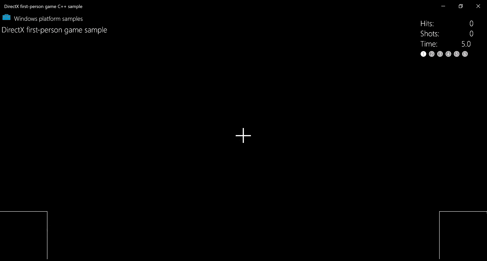
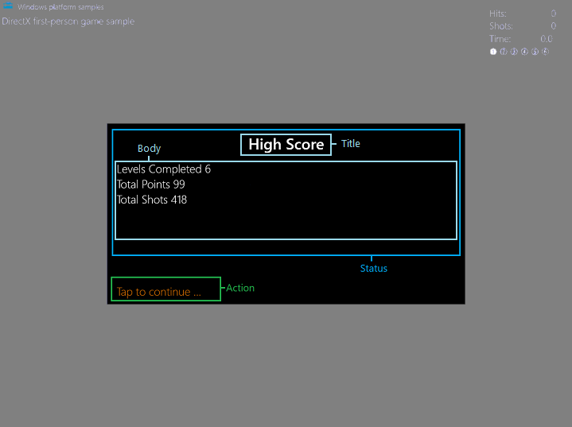

# Add a user interface

> [!NOTE]
> This topic is part of the [Create a simple Universal Windows Platform (UWP) game with DirectX](tutorial--create-your-first-uwp-directx-game.md) tutorial series. The topic at that link sets the context for the series.

Now that our game has its 3D visuals in place, it's time to focus on adding some 2D elements so that the game can provide feedback about game state to the player. This can be accomplished by adding simple menu options and heads-up display components on top of the 3-D graphics pipeline output.

>[!Note]
>If you haven't downloaded the latest game code for this sample, go to [Direct3D sample game](https://github.com/Microsoft/Windows-universal-samples/tree/master/Samples/Simple3DGameDX). This sample is part of a large collection of UWP feature samples. For instructions on how to download the sample, see [Sample applications for Windows development](/windows/apps/get-started/samples).

## Objective

Using Direct2D, add a number of user interface graphics and behaviors to our UWP DirectX game including:
- Heads-up display, including [move-look controller](tutorial--adding-controls.md) boundry rectangles
- Game state menus


## The user interface overlay


While there are many ways to display text and user interface elements in a DirectX game, we're going to focus on using [Direct2D](/windows/desktop/Direct2D/direct2d-portal). We'll also be using [DirectWrite](/windows/desktop/DirectWrite/direct-write-portal) for the text elements.


Direct2D is a set of 2D drawing APIs used to draw pixel-based primitives and effects. When starting out with Direct2D, it's best to keep things simple. Complex layouts and interface behaviors need time and planning. If your game requires a complex user interface, like those found in simulation and strategy games, consider using XAML instead.

> [!NOTE]
> For info about developing a user interface with XAML in a UWP DirectX game, see [Extending the sample game](tutorial-resources.md).

Direct2D isn't specifically designed for user interfaces or layouts like HTML and XAML. It doesn't provide user interface components like lists, boxes, or buttons. It also doesn't provide layout components like divs, tables, or grids.


For this sample game we have two major UI components.
1. A heads-up display for the score and in-game controls.
2. An overlay used to display game state text and options such as pause info and level start options.

### Using Direct2D for a heads-up display

The following image shows the in-game heads-up display for the sample. It's simple and uncluttered, allowing the player to focus on navigating the 3D world and shooting targets. A good interface or heads-up display must never complicate the ability of the player to process and react to the events in the game.



The overlay consists of the following basic primitives.
- [**DirectWrite**](/windows/desktop/DirectWrite/direct-write-portal) text in the upper-right corner that informs the player of 
    - Successful hits
    - Number of shots the player has made
    - Time remaining in the level
    - Current level number 
- Two intersecting line segments used to form a cross hair
- Two rectangles at the bottom corners for the [move-look controller](tutorial--adding-controls.md) boundries. 


The in-game heads-up display state of the overlay is drawn in the [**GameHud::Render**](https://github.com/Microsoft/Windows-universal-samples/blob/5f0d0912214afc1c2a7c7470203933ddb46f7c89/Samples/Simple3DGameDX/cpp/GameHud.cpp#L234-L358) method of the [**GameHud**](https://github.com/Microsoft/Windows-universal-samples/blob/5f0d0912214afc1c2a7c7470203933ddb46f7c89/Samples/Simple3DGameDX/cpp/GameHud.h) class. Within this method, the Direct2D overlay that represents our UI is updated to reflect the changes in the number of hits, time remaining, and level number.

If the game has been initialized, we add `TotalHits()`, `TotalShots()`, and `TimeRemaining()` to a [**swprintf_s**](/cpp/c-runtime-library/reference/sprintf-s-sprintf-s-l-swprintf-s-swprintf-s-l) buffer and specify the print format. We can then draw it using the [**DrawText**](/windows/desktop/Direct2D/id2d1rendertarget-drawtext) method. We do the same for the current level indicator, drawing empty numbers to show uncompleted levels like ➀, and filled numbers like ➊ to show that the specific level was completed.


The following code snippet walks through the **GameHud::Render** method's process for 
- Creating a Bitmap using [**ID2D1RenderTarget::DrawBitmap **](/windows/desktop/api/d2d1/nf-d2d1-id2d1rendertarget-drawbitmap(id2d1bitmap_constd2d1_rect_f__float_d2d1_bitmap_interpolation_mode_constd2d1_rect_f_))
- Sectioning off UI areas into rectangles using [**D2D1::RectF**](/windows/desktop/api/dcommon/ns-dcommon-d2d_rect_f)
- Using **DrawText** to make text elements

```cppwinrt
void GameHud::Render(_In_ std::shared_ptr<Simple3DGame> const& game)
{
    auto d2dContext = m_deviceResources->GetD2DDeviceContext();
    auto windowBounds = m_deviceResources->GetLogicalSize();

    if (m_showTitle)
    {
        d2dContext->DrawBitmap(
            m_logoBitmap.get(),
            D2D1::RectF(
                GameUIConstants::Margin,
                GameUIConstants::Margin,
                m_logoSize.width + GameUIConstants::Margin,
                m_logoSize.height + GameUIConstants::Margin
                )
            );
        d2dContext->DrawTextLayout(
            Point2F(m_logoSize.width + 2.0f * GameUIConstants::Margin, GameUIConstants::Margin),
            m_titleHeaderLayout.get(),
            m_textBrush.get()
            );
        d2dContext->DrawTextLayout(
            Point2F(GameUIConstants::Margin, m_titleBodyVerticalOffset),
            m_titleBodyLayout.get(),
            m_textBrush.get()
            );
    }

    // Draw text for number of hits, total shots, and time remaining
    if (game != nullptr)
    {
        // This section is only used after the game state has been initialized.
        static const int bufferLength = 256;
        static wchar_t wsbuffer[bufferLength];
        int length = swprintf_s(
            wsbuffer,
            bufferLength,
            L"Hits:\t%10d\nShots:\t%10d\nTime:\t%8.1f",
            game->TotalHits(),
            game->TotalShots(),
            game->TimeRemaining()
            );

        // Draw the upper right portion of the HUD displaying total hits, shots, and time remaining
        d2dContext->DrawText(
            wsbuffer,
            length,
            m_textFormatBody.get(),
            D2D1::RectF(
                windowBounds.Width - GameUIConstants::HudRightOffset,
                GameUIConstants::HudTopOffset,
                windowBounds.Width,
                GameUIConstants::HudTopOffset + (GameUIConstants::HudBodyPointSize + GameUIConstants::Margin) * 3
                ),
            m_textBrush.get()
            );

        // Using the unicode characters starting at 0x2780 ( ➀ ) for the consecutive levels of the game.
        // For completed levels start with 0x278A ( ➊ ) (This is 0x2780 + 10).
        uint32_t levelCharacter[6];
        for (uint32_t i = 0; i < 6; i++)
        {
            levelCharacter[i] = 0x2780 + i + ((static_cast<uint32_t>(game->LevelCompleted()) == i) ? 10 : 0);
        }
        length = swprintf_s(
            wsbuffer,
            bufferLength,
            L"%lc %lc %lc %lc %lc %lc",
            levelCharacter[0],
            levelCharacter[1],
            levelCharacter[2],
            levelCharacter[3],
            levelCharacter[4],
            levelCharacter[5]
            );
        // Create a new rectangle and draw the current level info text inside
        d2dContext->DrawText(
            wsbuffer,
            length,
            m_textFormatBodySymbol.get(),
            D2D1::RectF(
                windowBounds.Width - GameUIConstants::HudRightOffset,
                GameUIConstants::HudTopOffset + (GameUIConstants::HudBodyPointSize + GameUIConstants::Margin) * 3 + GameUIConstants::Margin,
                windowBounds.Width,
                GameUIConstants::HudTopOffset + (GameUIConstants::HudBodyPointSize + GameUIConstants::Margin) * 4
                ),
            m_textBrush.get()
            );

        if (game->IsActivePlay())
        {
            // Draw the move and fire rectangles
            ...
            // Draw the crosshairs
            ...
        }
    }
}
```

Breaking the method down further, this piece of the [**GameHud::Render**](https://github.com/Microsoft/Windows-universal-samples/blob/5f0d0912214afc1c2a7c7470203933ddb46f7c89/Samples/Simple3DGameDX/cpp/GameHud.cpp#L320-L358) method draws our move and fire rectangles with [**ID2D1RenderTarget::DrawRectangle**](/windows/desktop/api/d2d1/nf-d2d1-id2d1rendertarget-drawrectangle(constd2d1_rect_f__id2d1brush_float_id2d1strokestyle)), and crosshairs using two calls to [**ID2D1RenderTarget::DrawLine**](/windows/desktop/api/d2d1/nf-d2d1-id2d1rendertarget-drawline).

```cppwinrt
// Check if game is playing
if (game->IsActivePlay())
{
    // Draw a rectangle for the touch input for the move control.
    d2dContext->DrawRectangle(
        D2D1::RectF(
            0.0f,
            windowBounds.Height - GameUIConstants::TouchRectangleSize,
            GameUIConstants::TouchRectangleSize,
            windowBounds.Height
            ),
        m_textBrush.get()
        );
    // Draw a rectangle for the touch input for the fire control.
    d2dContext->DrawRectangle(
        D2D1::RectF(
            windowBounds.Width - GameUIConstants::TouchRectangleSize,
            windowBounds.Height - GameUIConstants::TouchRectangleSize,
            windowBounds.Width,
            windowBounds.Height
            ),
        m_textBrush.get()
        );

    // Draw the cross hairs
    d2dContext->DrawLine(
        D2D1::Point2F(windowBounds.Width / 2.0f - GameUIConstants::CrossHairHalfSize,
            windowBounds.Height / 2.0f),
        D2D1::Point2F(windowBounds.Width / 2.0f + GameUIConstants::CrossHairHalfSize,
            windowBounds.Height / 2.0f),
        m_textBrush.get(),
        3.0f
        );
    d2dContext->DrawLine(
        D2D1::Point2F(windowBounds.Width / 2.0f, windowBounds.Height / 2.0f -
            GameUIConstants::CrossHairHalfSize),
        D2D1::Point2F(windowBounds.Width / 2.0f, windowBounds.Height / 2.0f +
            GameUIConstants::CrossHairHalfSize),
        m_textBrush.get(),
        3.0f
        );
}
```

In the **GameHud::Render** method we store the logical size of the game window in the `windowBounds` variable. This uses the [`GetLogicalSize`](https://github.com/Microsoft/Windows-universal-samples/blob/5f0d0912214afc1c2a7c7470203933ddb46f7c89/Samples/Simple3DGameDX/cpp/Common/DeviceResources.h#L41) method of the **DeviceResources** class. 

```cppwinrt
auto windowBounds = m_deviceResources->GetLogicalSize();
```

Obtaining the size of the game window is essential for UI programming. The size of the window is given in a measurement called DIPs (device independent pixels), where a DIP is defined as 1/96 of an inch. Direct2D scales the drawing units to actual pixels when the drawing occurs, doing so by using the Windows dots per inch (DPI) setting. Similarly, when you draw text using [**DirectWrite**](/windows/desktop/DirectWrite/direct-write-portal), you specify DIPs rather than points for the size of the font. DIPs are expressed as floating point numbers. 

### Displaying game state info

Besides the heads-up display, the sample game has an overlay that represents six game states. All states feature a large black rectangle primitive with text for the player to read. The move-look controller rectangles and crosshairs are not drawn because they are not active in these states.

The overlay is created using the [**GameInfoOverlay**](https://github.com/Microsoft/Windows-universal-samples/blob/5f0d0912214afc1c2a7c7470203933ddb46f7c89/Samples/Simple3DGameDX/cpp/GameInfoOverlay.h) class, allowing us to switch out what text is displayed to align with the state of the game.



The overlay is broken up into two sections: **Status** and **Action**. The **Status** section is further broken down into **Title** and **Body** rectangles. The **Action** section only has one rectangle. Each rectangle has a different purpose.

-   `titleRectangle` contains the title text.
-   `bodyRectangle` contains the body text.
-   `actionRectangle` contains the text that informs the player to take a specific action.

The game has six states that can be set. The state of the game conveyed using the **Status** portion of the overlay. The **Status** rectangles are updated using a number of methods corresponding with the following states.

- Loading
- Initial start/high score stats
- Level start
- Game paused
- Game over
- Game won


The **Action** portion of the overlay is updated using the [**GameInfoOverlay::SetAction**](https://github.com/Microsoft/Windows-universal-samples/blob/5f0d0912214afc1c2a7c7470203933ddb46f7c89/Samples/Simple3DGameDX/cpp/GameInfoOverlay.cpp#L522-L564) method, allowing the action text to be set to one of the following.
- "Tap to play again..."
- "Level loading, please wait ..."
- "Tap to continue ..."
- None

> [!NOTE]
> Both of these methods will be discussed further in the [Representing game state](#representing-game-state) section.

Depending on the what's going on in the game, the **Status** and **Action** section text fields are adjusted.
Let's look at how we initialize and draw the overlay for these six states.

### Initializing and drawing the overlay

The six **Status** states have a few things in common, making the resources and methods they need very similar.
    - They all use a black rectangle in the center of the screen as their background.
    - The displayed text is either **Title** or **Body** text.
    - The text uses the Segoe UI font and is drawn on top of the back rectangle. 


The sample game has four methods that come into play when creating the overlay.
 

#### GameInfoOverlay::GameInfoOverlay
The [**GameInfoOverlay::GameInfoOverlay**](https://github.com/Microsoft/Windows-universal-samples/blob/5f0d0912214afc1c2a7c7470203933ddb46f7c89/Samples/Simple3DGameDX/cpp/GameInfoOverlay.cpp#L30-L78) constructor initializes the overlay, maintaining the bitmap surface that we will use to display info to the player on. The constructor obtains a factory from the [**ID2D1Device**](/windows/desktop/api/d2d1_1/nn-d2d1_1-id2d1device) object passed to it, which it uses to create an [**ID2D1DeviceContext**](/windows/desktop/api/d2d1_1/nn-d2d1_1-id2d1devicecontext) that the overlay object itself can draw to. [IDWriteFactory::CreateTextFormat](/windows/desktop/api/dwrite/nf-dwrite-idwritefactory-createtextformat) 


#### GameInfoOverlay::CreateDeviceDependentResources
[**GameInfoOverlay::CreateDeviceDependentResources**](https://github.com/Microsoft/Windows-universal-samples/blob/5f0d0912214afc1c2a7c7470203933ddb46f7c89/Samples/Simple3DGameDX/cpp/GameInfoOverlay.cpp#L82-L104) is our method for creating brushes that will be used to draw our text. To do this, we obtain a [**ID2D1DeviceContext2**](/windows/desktop/api/d2d1_3/nn-d2d1_3-id2d1devicecontext2) object which enables the creation and drawing of geometry, plus functionality such as ink and gradient mesh rendering. We then create a series of colored brushes using [**ID2D1SolidColorBrush**](/windows/desktop/api/d2d1/nn-d2d1-id2d1solidcolorbrush) to draw the following UI elements.
- Black brush for rectangle backgrounds
- White brush for status text
- Orange brush for action text

#### DeviceResources::SetDpi

The [**DeviceResources::SetDpi**](https://github.com/Microsoft/Windows-universal-samples/blob/5f0d0912214afc1c2a7c7470203933ddb46f7c89/Samples/Simple3DGameDX/cpp/Common/DeviceResources.cpp#L514-L527) method sets the dots per inch of the window. This method gets called when the DPI is changed and needs to be readjusted which happens when the game window is resized. After updating the DPI, this method also calls[**DeviceResources::CreateWindowSizeDependentResources**](https://github.com/Microsoft/Windows-universal-samples/blob/5f0d0912214afc1c2a7c7470203933ddb46f7c89/Samples/Simple3DGameDX/cpp/Common/DeviceResources.cpp#L214-L487) to make sure necessary resources are recreated every time the window is resized.

#### GameInfoOverlay::CreateWindowsSizeDependentResources

The [**GameInfoOverlay::CreateWindowsSizeDependentResources**](https://github.com/Microsoft/Windows-universal-samples/blob/5f0d0912214afc1c2a7c7470203933ddb46f7c89/Samples/Simple3DGameDX/cpp/GameInfoOverlay.cpp#L108-L225) method is where all our drawing takes place. The following is an outline of the method's steps.
- Three rectangles are created to section off the UI text for the **Title**, **Body**, and **Action** text.
    ```cppwinrt 
    m_titleRectangle = D2D1::RectF(
        GameInfoOverlayConstant::SideMargin,
        GameInfoOverlayConstant::TopMargin,
        overlaySize.width - GameInfoOverlayConstant::SideMargin,
        GameInfoOverlayConstant::TopMargin + GameInfoOverlayConstant::TitleHeight
        );
    m_actionRectangle = D2D1::RectF(
        GameInfoOverlayConstant::SideMargin,
        overlaySize.height - (GameInfoOverlayConstant::ActionHeight + GameInfoOverlayConstant::BottomMargin),
        overlaySize.width - GameInfoOverlayConstant::SideMargin,
        overlaySize.height - GameInfoOverlayConstant::BottomMargin
        );
    m_bodyRectangle = D2D1::RectF(
        GameInfoOverlayConstant::SideMargin,
        m_titleRectangle.bottom + GameInfoOverlayConstant::Separator,
        overlaySize.width - GameInfoOverlayConstant::SideMargin,
        m_actionRectangle.top - GameInfoOverlayConstant::Separator
        );
    ```

- A Bitmap is created named `m_levelBitmap`, taking the current DPI into account using **CreateBitmap**.
- `m_levelBitmap` is set as our 2D render target using [**ID2D1DeviceContext::SetTarget**](/windows/desktop/api/d2d1_1/nf-d2d1_1-id2d1devicecontext-settarget).
- The Bitmap is cleared with every pixel made black using [**ID2D1RenderTarget::Clear**](/windows/win32/direct2d/id2d1rendertarget-clear).
- [**ID2D1RenderTarget::BeginDraw**](/windows/desktop/api/d2d1/nf-d2d1-id2d1rendertarget-begindraw) is called to initiate drawing. 
- **DrawText** is called to draw the text stored in `m_titleString`, `m_bodyString`, and `m_actionString` in the appropriate rectangle using the corresponding **ID2D1SolidColorBrush**.
- [**ID2D1RenderTarget::EndDraw**](/windows/desktop/api/d2d1/nf-d2d1-id2d1rendertarget-enddraw) is called to stop all drawing operations on `m_levelBitmap`.
- Another Bitmap is created using **CreateBitmap** named `m_tooSmallBitmap` to use as a fallback, showing only if the display configuration is too small for the game.
- Repeat process for drawing on `m_levelBitmap` for `m_tooSmallBitmap`, this time only drawing the string `Paused` in the body.


Now all we need are six methods to fill the text of our six overlay states!

### Representing game state


Each of the six overlay states in the game has a corresponding method in the **GameInfoOverlay** object. These methods draw a variation of the overlay to communicate explicit info to the player about the game itself. This communication is represented with a **Title** and **Body** string. Because the sample already configured the resources and layout for this info when it was initialized and with the [**GameInfoOverlay::CreateDeviceDependentResources**](https://github.com/Microsoft/Windows-universal-samples/blob/5f0d0912214afc1c2a7c7470203933ddb46f7c89/Samples/Simple3DGameDX/cpp/GameInfoOverlay.cpp#L82-L104) method, it only needs to provide the overlay state-specific strings.

The **Status** portion of the overlay is set with a call to one of the following methods.

Game state | Status set method | Status fields
:----- | :------- | :---------
Loading | [GameInfoOverlay::SetGameLoading](https://github.com/Microsoft/Windows-universal-samples/blob/5f0d0912214afc1c2a7c7470203933ddb46f7c89/Samples/Simple3DGameDX/cpp/GameInfoOverlay.cpp#L254-L306) |**Title**</br>Loading Resources </br>**Body**</br> Incrementally prints "." to imply loading activity.
Initial start/high score stats | [GameInfoOverlay::SetGameStats](https://github.com/Microsoft/Windows-universal-samples/blob/5f0d0912214afc1c2a7c7470203933ddb46f7c89/Samples/Simple3DGameDX/cpp/GameInfoOverlay.cpp#L310-L354) |**Title**</br>High Score</br> **Body**</br> Levels Completed # </br>Total Points #</br>Total Shots #
Level start | [GameInfoOverlay::SetLevelStart](https://github.com/Microsoft/Windows-universal-samples/blob/5f0d0912214afc1c2a7c7470203933ddb46f7c89/Samples/Simple3DGameDX/cpp/GameInfoOverlay.cpp#L413-L471) |**Title**</br>Level #</br>**Body**</br>Level objective description.
Game paused | [GameInfoOverlay::SetPause](https://github.com/Microsoft/Windows-universal-samples/blob/5f0d0912214afc1c2a7c7470203933ddb46f7c89/Samples/Simple3DGameDX/cpp/GameInfoOverlay.cpp#L475-L502) |**Title**</br>Game Paused</br>**Body**</br>None
Game over | [GameInfoOverlay::SetGameOver](https://github.com/Microsoft/Windows-universal-samples/blob/5f0d0912214afc1c2a7c7470203933ddb46f7c89/Samples/Simple3DGameDX/cpp/GameInfoOverlay.cpp#L358-L409) |**Title**</br>Game Over</br> **Body**</br> Levels Completed # </br>Total Points #</br>Total Shots #</br>Levels Completed #</br>High Score #
Game won | [GameInfoOverlay::SetGameOver](https://github.com/Microsoft/Windows-universal-samples/blob/5f0d0912214afc1c2a7c7470203933ddb46f7c89/Samples/Simple3DGameDX/cpp/GameInfoOverlay.cpp#L358-L409) |**Title**</br>You WON!</br> **Body**</br> Levels Completed # </br>Total Points #</br>Total Shots #</br>Levels Completed #</br>High Score #

With the [**GameInfoOverlay::CreateWindowSizeDependentResources**](https://github.com/Microsoft/Windows-universal-samples/blob/5f0d0912214afc1c2a7c7470203933ddb46f7c89/Samples/Simple3DGameDX/cpp/GameInfoOverlay.cpp#L117-L134) method, the sample declared three rectangular areas that correspond to specific regions of the overlay.

With these areas in mind, let's look at one of the state-specific methods, **GameInfoOverlay::SetGameStats**, and see how the overlay is drawn.

```cppwinrt
void GameInfoOverlay::SetGameStats(int maxLevel, int hitCount, int shotCount)
{
    int length;

    auto d2dContext = m_deviceResources->GetD2DDeviceContext();

    d2dContext->SetTarget(m_levelBitmap.get());
    d2dContext->BeginDraw();
    d2dContext->SetTransform(D2D1::Matrix3x2F::Identity());
    d2dContext->FillRectangle(&m_titleRectangle, m_backgroundBrush.get());
    d2dContext->FillRectangle(&m_bodyRectangle, m_backgroundBrush.get());
    m_titleString = L"High Score";

    d2dContext->DrawText(
        m_titleString.c_str(),
        m_titleString.size(),
        m_textFormatTitle.get(),
        m_titleRectangle,
        m_textBrush.get()
        );
    length = swprintf_s(
        wsbuffer,
        bufferLength,
        L"Levels Completed %d\nTotal Points %d\nTotal Shots %d",
        maxLevel,
        hitCount,
        shotCount
        );
    m_bodyString = std::wstring(wsbuffer, length);
    d2dContext->DrawText(
        m_bodyString.c_str(),
        m_bodyString.size(),
        m_textFormatBody.get(),
        m_bodyRectangle,
        m_textBrush.get()
        );

    // We ignore D2DERR_RECREATE_TARGET here. This error indicates that the device
    // is lost. It will be handled during the next call to Present.
    HRESULT hr = d2dContext->EndDraw();
    if (hr != D2DERR_RECREATE_TARGET)
    {
        // The D2DERR_RECREATE_TARGET indicates there has been a problem with the underlying
        // D3D device. All subsequent rendering will be ignored until the device is recreated.
        // This error will be propagated and the appropriate D3D error will be returned from the
        // swapchain->Present(...) call. At that point, the sample will recreate the device
        // and all associated resources. As a result, the D2DERR_RECREATE_TARGET doesn't
        // need to be handled here.
        winrt::check_hresult(hr);
    }
}
```

Using the Direct2D device context that the **GameInfoOverlay** object initialized, this method fills the title and body rectangles with black using the background brush. It draws the text for the "High Score" string to the title rectangle and a string containing the updates game state information to the body rectangle using the white text brush.


The action rectangle is updated by a subsequent call to [**GameInfoOverlay::SetAction**](https://github.com/Microsoft/Windows-universal-samples/blob/5f0d0912214afc1c2a7c7470203933ddb46f7c89/Samples/Simple3DGameDX/cpp/GameInfoOverlay.cpp#L522-L564) from a method on the **GameMain** object, which provides the game state info needed by **GameInfoOverlay::SetAction** to determine the right message to the player, such as "Tap to continue".

The overlay for any given state is chosen in the [**GameMain::SetGameInfoOverlay**](https://github.com/Microsoft/Windows-universal-samples/blob/5f0d0912214afc1c2a7c7470203933ddb46f7c89/Samples/Simple3DGameDX/cpp/GameMain.cpp#L606-L661) method like this:

```cppwinrt
void GameMain::SetGameInfoOverlay(GameInfoOverlayState state)
{
    m_gameInfoOverlayState = state;
    switch (state)
    {
    case GameInfoOverlayState::Loading:
        m_uiControl->SetGameLoading(m_loadingCount);
        break;

    case GameInfoOverlayState::GameStats:
        m_uiControl->SetGameStats(
            m_game->HighScore().levelCompleted + 1,
            m_game->HighScore().totalHits,
            m_game->HighScore().totalShots
            );
        break;

    case GameInfoOverlayState::LevelStart:
        m_uiControl->SetLevelStart(
            m_game->LevelCompleted() + 1,
            m_game->CurrentLevel()->Objective(),
            m_game->CurrentLevel()->TimeLimit(),
            m_game->BonusTime()
            );
        break;

    case GameInfoOverlayState::GameOverCompleted:
        m_uiControl->SetGameOver(
            true,
            m_game->LevelCompleted() + 1,
            m_game->TotalHits(),
            m_game->TotalShots(),
            m_game->HighScore().totalHits
            );
        break;

    case GameInfoOverlayState::GameOverExpired:
        m_uiControl->SetGameOver(
            false,
            m_game->LevelCompleted(),
            m_game->TotalHits(),
            m_game->TotalShots(),
            m_game->HighScore().totalHits
            );
        break;

    case GameInfoOverlayState::Pause:
        m_uiControl->SetPause(
            m_game->LevelCompleted() + 1,
            m_game->TotalHits(),
            m_game->TotalShots(),
            m_game->TimeRemaining()
            );
        break;
    }
}
```

Now the game has a way to communicate text info to the player based on game state, and we have a way of switching what's displayed to them throughout the game.

### Next steps

In the next topic, [Adding controls](tutorial--adding-controls.md), we look at how the player interacts with the sample game, and how input changes game state.