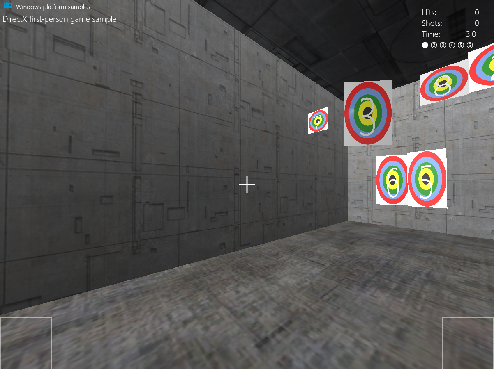

# Add controls

> [!NOTE]
> This topic is part of the [Create a simple Universal Windows Platform (UWP) game with DirectX](tutorial--create-your-first-uwp-directx-game.md) tutorial series. The topic at that link sets the context for the series.

\[ Updated for UWP apps on Windows 10. For Windows 8.x articles, see the [archive](/previous-versions/windows/apps/mt244353(v=win.10)?redirectedfrom=MSDN) \]

A good Universal Windows Platform (UWP) game supports a wide variety of interfaces. A potential player might have Windows 10 on a tablet with no physical buttons, a PC with a game controller attached, or the latest desktop gaming rig with a high-performance mouse and gaming keyboard. In our game the controls are implemented in the [**MoveLookController**](https://github.com/Microsoft/Windows-universal-samples/blob/ef073ed8a2007d113af1d88eddace479e3bf0e07/SharedContent/cpp/GameContent/MoveLookController.cpp) class. This class aggregates all three types of input (mouse and keyboard, touch, and gamepad) into a single controller. The end result is a first-person shooter that uses genre standard move-look controls that work with multiple devices.

> [!NOTE]
> For more info about controls, see [Move-look controls for games](tutorial--adding-move-look-controls-to-your-directx-game.md) and [Touch controls for games](tutorial--adding-touch-controls-to-your-directx-game.md).


## Objective

At this point we have a game that renders, but we can't move our player around or shoot the targets. 
We'll take a look at how our game implements first person shooter move-look controls for the following types of input in our UWP DirectX game.
- Mouse and keyboard
- Touch
- Gamepad

>[!Note]
>If you haven't downloaded the latest game code for this sample, go to [Direct3D sample game](https://github.com/Microsoft/Windows-universal-samples/tree/master/Samples/Simple3DGameDX). This sample is part of a large collection of UWP feature samples. For instructions on how to download the sample, see [Sample applications for Windows development](/windows/apps/get-started/samples).

## Common control behaviors


Touch controls and mouse/keyboard controls have a very similar core implementation. In a UWP app, a pointer is simply a point on the screen. You can move it by sliding the mouse or sliding your finger on the touch screen. As a result, you can register for a single set of events, and not worry about whether the player is using a mouse or a touch screen to move and press the pointer.

When the **MoveLookController** class in the sample game is initialized, it registers for four pointer-specific events and one mouse-specific event:

Event | Description
:------ | :-------
[**CoreWindow::PointerPressed**](/uwp/api/windows.ui.core.corewindow.pointerpressed) | The left or right mouse button was pressed (and held), or the touch surface was touched.
[**CoreWindow::PointerMoved**](/uwp/api/windows.ui.core.corewindow.pointermoved) |The mouse moved, or a drag action was made on the touch surface.
[**CoreWindow::PointerReleased**](/uwp/api/windows.ui.core.corewindow.pointerreleased) |The left mouse button was released, or the object contacting the touch surface was lifted.
[**CoreWindow::PointerExited**](/uwp/api/windows.ui.core.corewindow.pointerexited) |The pointer moved out of the main window.
[**Windows::Devices::Input::MouseMoved**](/uwp/api/windows.devices.input.mousedevice.mousemoved) | The mouse moved a certain distance. Be aware that we are only interested in mouse movement delta values, and not the current X-Y position.


These event handlers are set to start listening for user input as soon as the **MoveLookController** is initialized in the application window.
```cppwinrt
void MoveLookController::InitWindow(_In_ CoreWindow const& window)
{
    ResetState();

    window.PointerPressed({ this, &MoveLookController::OnPointerPressed });

    window.PointerMoved({ this, &MoveLookController::OnPointerMoved });

    window.PointerReleased({ this, &MoveLookController::OnPointerReleased });

    window.PointerExited({ this, &MoveLookController::OnPointerExited });

    ...

    // There is a separate handler for mouse-only relative mouse movement events.
    MouseDevice::GetForCurrentView().MouseMoved({ this, &MoveLookController::OnMouseMoved });

    ...
}
```

Complete code for [**InitWindow**](https://github.com/Microsoft/Windows-universal-samples/blob/ef073ed8a2007d113af1d88eddace479e3bf0e07/SharedContent/cpp/GameContent/MoveLookController.cpp#L68-L92) can be seen on GitHub.


To determine when the game should be listening for certain input, the **MoveLookController** class has three controller-specific states, regardless of the controller type:

State | Description
:----- | :-------
**None** | This is the initialized state for the controller. All input is ignored since the game is not anticipating any controller input.
**WaitForInput** | The controller is waiting for the player to acknowledge a message from the game by either using a left mouse click, a touch event, ot the menu button on a gamepad.
**Active** | The controller is in active game play mode.


### WaitForInput state and pausing the game

The game enters the **WaitForInput** state when the game has been paused. This happens when the player moves the pointer outside the main window of the game, or presses the pause button (the P key or the gamepad **Start** button). The **MoveLookController** registers the press, and informs the game loop when it calls the [**IsPauseRequested**](https://github.com/Microsoft/Windows-universal-samples/blob/ef073ed8a2007d113af1d88eddace479e3bf0e07/SharedContent/cpp/GameContent/MoveLookController.cpp#L107-L127) method. At that point if **IsPauseRequested** returns **true**, the game loop then calls **WaitForPress** on the **MoveLookController** to move the controller into the **WaitForInput** state. 


Once in the **WaitForInput** state, the game stops processing almost all gameplay input events until it returns to the **Active** state. The exception is the pause button, with a press of this causing the game to go back to the active state. Other than the pause button, in order for the game to go back to the **Active** state the player needs to select a menu item. 


### The Active state

During the **Active** state, the **MoveLookController** instance is processing events from all enabled input devices and interpreting the player's intentions. As a result, it updates the velocity and look direction of the player's view and shares the updated data with the game after **Update** is called from the game loop.


All pointer input is tracked in the **Active** state, with different pointer IDs corresponding to different pointer actions.
When a [**PointerPressed**](/uwp/api/windows.ui.core.corewindow.pointerpressed) event is received, the **MoveLookController** obtains the pointer ID value created by the window. The pointer ID represents a specific type of input. For example, on a multi-touch device, there may be several different active inputs at the same time. The IDs are used to keep track of which input the player is using. If one event is in the move rectangle of the touch screen, a pointer ID is assigned to track any pointer events in the move rectangle. Other pointer events in the fire rectangle are tracked separately, with a separate pointer ID.


> [!NOTE]
> Input from the mouse and right thumbstick of a gamepad also have IDs that are handled separately.

After the pointer events have been mapped to a specific game action, it's time to update the data the **MoveLookController** object shares with the main game loop.

When called, the [**Update**](https://github.com/Microsoft/Windows-universal-samples/blob/ef073ed8a2007d113af1d88eddace479e3bf0e07/SharedContent/cpp/GameContent/MoveLookController.cpp#L1005-L1096) method in the sample game processes the input and updates the velocity and look direction variables (**m\_velocity** and **m\_lookdirection**), which the game loop then retrieves by calling the public [**Velocity**](https://github.com/Microsoft/Windows-universal-samples/blob/ef073ed8a2007d113af1d88eddace479e3bf0e07/SharedContent/cpp/GameContent/MoveLookController.cpp#L906-L909) and [**LookDirection**](https://github.com/Microsoft/Windows-universal-samples/blob/ef073ed8a2007d113af1d88eddace479e3bf0e07/SharedContent/cpp/GameContent/MoveLookController.cpp#L913-L923) methods.

> [!NOTE]
> More details about the [**Update**](#the-update-method) method can be seen later on this page.


The game loop can test to see if the player is firing by calling the **IsFiring** method on the **MoveLookController** instance. The **MoveLookController** checks to see if the player has pressed the fire button on one of the three input types.

```cppwinrt
bool MoveLookController::IsFiring()
{
    if (m_state == MoveLookControllerState::Active)
    {
        if (m_autoFire)
        {
            return (m_fireInUse || (m_mouseInUse && m_mouseLeftInUse) || PollingFireInUse());
        }
        else
        {
            if (m_firePressed)
            {
                m_firePressed = false;
                return true;
            }
        }
    }
    return false;
}
```

Now let's look at the implementation of each of the three control types in a little more detail.

## Adding relative mouse controls


If mouse movement is detected, we want to use that movement to determine the new pitch and yaw of the camera. We do that by implementing relative mouse controls, where we handle the relative distance the mouse has moved—the delta between the start of the movement and the stop—as opposed to recording the absolute x-y pixel coordinates of the motion.

To do that, we obtain the changes in the X (the horizontal motion) and the Y (the vertical motion) coordinates by examining the [**MouseDelta::X**](/uwp/api/Windows.Devices.Input.MouseDelta) and **MouseDelta::Y** fields on the [**Windows::Device::Input::MouseEventArgs::MouseDelta**](/uwp/api/windows.devices.input.mouseeventargs.mousedelta) argument object returned by the [**MouseMoved**](/uwp/api/windows.devices.input.mousedevice.mousemoved) event.

```cppwinrt
void MoveLookController::OnMouseMoved(
    _In_ MouseDevice const& /* mouseDevice */,
    _In_ MouseEventArgs const& args
    )
{
    // Handle Mouse Input via dedicated relative movement handler.

    switch (m_state)
    {
    case MoveLookControllerState::Active:
        XMFLOAT2 mouseDelta;
        mouseDelta.x = static_cast<float>(args.MouseDelta().X);
        mouseDelta.y = static_cast<float>(args.MouseDelta().Y);

        XMFLOAT2 rotationDelta;
        // Scale for control sensitivity.
        rotationDelta.x = mouseDelta.x * MoveLookConstants::RotationGain;
        rotationDelta.y = mouseDelta.y * MoveLookConstants::RotationGain;

        // Update our orientation based on the command.
        m_pitch -= rotationDelta.y;
        m_yaw += rotationDelta.x;

        // Limit pitch to straight up or straight down.
        float limit = XM_PI / 2.0f - 0.01f;
        m_pitch = __max(-limit, m_pitch);
        m_pitch = __min(+limit, m_pitch);

        // Keep longitude in sane range by wrapping.
        if (m_yaw > XM_PI)
        {
            m_yaw -= XM_PI * 2.0f;
        }
        else if (m_yaw < -XM_PI)
        {
            m_yaw += XM_PI * 2.0f;
        }
        break;
    }
}
```

## Adding touch support

Touch controls are great for supporting users with tablets. This game gathers touch input by zoning off certain areas of the screen with each aligning to specific in-game actions.
This game's touch input uses three zones.


The following commands summarize our touch control behavior.
User input | Action
:------- | :--------
Move rectangle | Touch input is converted into a virtual joystick where the vertical motion will be translated into forward/backward position motion and horizontal motion will be translated into left/right position motion.
Fire rectangle | Fire a sphere.
Touch outside of move and fire rectangle | Change the rotation (the pitch and yaw) of the camera view.

The **MoveLookController** checks the pointer ID to determine where the event occurred, and takes one of the following actions:

-   If the [**PointerMoved**](/uwp/api/windows.ui.core.corewindow.pointermoved) event occurred in the move or fire rectangle, update the pointer position for the controller.
-   If the [**PointerMoved**](/uwp/api/windows.ui.core.corewindow.pointermoved) event occurred somewhere in the rest of the screen (defined as the look controls), calculate the change in pitch and yaw of the look direction vector.


Once we've implemented our touch controls, the rectangles we drew earlier using Direct2D will indicate to players where the move, fire, and look zones are.





Now let's take a look at how we implement each control.


### Move and fire controller
The move controller rectangle in the lower left quadrant of the screen is used as a directional pad. Sliding your thumb left and right within this space moves the player left and right, while up and down moves the camera forward and backward.
After setting this up, tapping the fire controller in the lower right quadrant of the screen fires a sphere.

The [**SetMoveRect**](https://github.com/Microsoft/Windows-universal-samples/blob/ef073ed8a2007d113af1d88eddace479e3bf0e07/SharedContent/cpp/GameContent/MoveLookController.cpp#L843-L853) and [**SetFireRect**](https://github.com/Microsoft/Windows-universal-samples/blob/ef073ed8a2007d113af1d88eddace479e3bf0e07/SharedContent/cpp/GameContent/MoveLookController.cpp#L857-L867) methods create our input rectangles, taking two, 2D vectors to specify each rectangles' upper left and lower right corner positions on the screen. 


The parameters are then assigned to **m\_fireUpperLeft** and **m\_fireLowerRight** that will help us determine if the user is touching within on of the rectangles. 
```cppwinrt
m_fireUpperLeft = upperLeft;
m_fireLowerRight = lowerRight;
```

If the screen is resized, these rectangles are redrawn to the approperiate size.

Now that we've zoned off our controls, it's time to determine when a user is actually using them.
To do this, we set up some event handlers in the **MoveLookController::InitWindow** method for when the user presses, moves, or releases their pointer.

```cppwinrt
window.PointerPressed({ this, &MoveLookController::OnPointerPressed });

window.PointerMoved({ this, &MoveLookController::OnPointerMoved });

window.PointerReleased({ this, &MoveLookController::OnPointerReleased });
```

We'll first determine what happens when the user first presses within the move or fire rectangles using the [**OnPointerPressed**](https://github.com/Microsoft/Windows-universal-samples/blob/ef073ed8a2007d113af1d88eddace479e3bf0e07/SharedContent/cpp/GameContent/MoveLookController.cpp#L179-L313) method.
Here we check where they're touching a control and if a pointer is already in that controller. If this is the first finger to touch the specific control, we do the following.
- Store the location of the touchdown in **m\_moveFirstDown** or **m\_fireFirstDown** as a 2D vector.
- Assign the pointer ID to **m\_movePointerID** or **m\_firePointerID**.
- Set the proper **InUse** flag (**m\_moveInUse** or **m\_fireInUse**) to `true` since we now have an active pointer for that control.

```cppwinrt
PointerPoint point = args.CurrentPoint();
uint32_t pointerID = point.PointerId();
Point pointerPosition = point.Position();
PointerPointProperties pointProperties = point.Properties();
auto pointerDevice = point.PointerDevice();
auto pointerDeviceType = pointerDevice.PointerDeviceType();

XMFLOAT2 position = XMFLOAT2(pointerPosition.X, pointerPosition.Y);

...
case MoveLookControllerState::Active:
    switch (pointerDeviceType)
    {
    case winrt::Windows::Devices::Input::PointerDeviceType::Touch:
        // Check to see if this pointer is in the move control.
        if (position.x > m_moveUpperLeft.x &&
            position.x < m_moveLowerRight.x &&
            position.y > m_moveUpperLeft.y &&
            position.y < m_moveLowerRight.y)
        {
            // If no pointer is in this control yet.
            if (!m_moveInUse)
            {
                // Process a DPad touch down event.
                // Save the location of the initial contact
                m_moveFirstDown = position;
                // Store the pointer using this control
                m_movePointerID = pointerID;
                // Set InUse flag to signal there is an active move pointer
                m_moveInUse = true;
            }
        }
        // Check to see if this pointer is in the fire control.
        else if (position.x > m_fireUpperLeft.x &&
            position.x < m_fireLowerRight.x &&
            position.y > m_fireUpperLeft.y &&
            position.y < m_fireLowerRight.y)
        {
            if (!m_fireInUse)
            {
                // Save the location of the initial contact
                m_fireLastPoint = position;
                // Store the pointer using this control
                m_firePointerID = pointerID;
                // Set InUse flag to signal there is an active fire pointer
                m_fireInUse = true;
                ...
            }
        }
        ...
```

Now that we've determined whether the user is touching a move or fire control, we see if the player is making any movements with their pressed finger.
Using the [**MoveLookController::OnPointerMoved**](https://github.com/Microsoft/Windows-universal-samples/blob/ef073ed8a2007d113af1d88eddace479e3bf0e07/SharedContent/cpp/GameContent/MoveLookController.cpp#L317-L395) method, we check what pointer has moved and then store its new position as a 2D vector.  

```cppwinrt
PointerPoint point = args.CurrentPoint();
uint32_t pointerID = point.PointerId();
Point pointerPosition = point.Position();
PointerPointProperties pointProperties = point.Properties();
auto pointerDevice = point.PointerDevice();

// convert to allow math
XMFLOAT2 position = XMFLOAT2(pointerPosition.X, pointerPosition.Y);

switch (m_state)
{
case MoveLookControllerState::Active:
    // Decide which control this pointer is operating.

    // Move control
    if (pointerID == m_movePointerID)
    {
        // Save the current position.
        m_movePointerPosition = position;
    }
    // Look control
    else if (pointerID == m_lookPointerID)
    {
        ...
    }
    // Fire control
    else if (pointerID == m_firePointerID)
    {
        m_fireLastPoint = position;
    }
    ...
```

Once the user has made their gestures within the controls, they'll release the pointer. 
Using the [**MoveLookController::OnPointerReleased**](https://github.com/Microsoft/Windows-universal-samples/blob/ef073ed8a2007d113af1d88eddace479e3bf0e07/SharedContent/cpp/GameContent/MoveLookController.cpp#L441-L500) method, we determine which pointer has been released and do a series of resets.


If the move control has been released, we do the following.
- Set the velocity of the player to `0` in all directions to prevent them from moving in the game.
- Switch **m\_moveInUse** to `false` since the user is no longer touching the move controller.
- Set the move pointer ID to `0` since there's no longer a pointer in the move controller.

```cppwinrt
if (pointerID == m_movePointerID)
{
    // Stop on release.
    m_velocity = XMFLOAT3(0, 0, 0);
    m_moveInUse = false;
    m_movePointerID = 0;
}
```

For the fire control, if it has been released all we do is switch the **m_fireInUse** flag to `false` and the fire pointer ID to `0` since there's no longer a pointer in the fire control.
```cppwinrt
else if (pointerID == m_firePointerID)
{
    m_fireInUse = false;
    m_firePointerID = 0;
}
```

### Look controller
We treat touch device pointer events for the unused regions of the screen as the look controller. 
Sliding your finger around this zone changes the pitch and yaw (rotation) of the player camera.

If the **MoveLookController::OnPointerPressed** event is raised on a touch device in this region and the game state is set to **Active**, it's assigned a pointer ID.

```cppwinrt
// If no pointer is in this control yet.
if (!m_lookInUse)
{
    // Save point for later move.
    m_lookLastPoint = position;
    // Store the pointer using this control.
    m_lookPointerID = pointerID;
    // These are for smoothing.
    m_lookLastDelta.x = m_lookLastDelta.y = 0;
    m_lookInUse = true;
}
```

Here the **MoveLookController** assigns the pointer ID for the pointer that fired the event to a specific variable that corresponds to the look region. In the case of a touch occurring in the look region, the **m\_lookPointerID** variable is set to the pointer ID that fired the event. A boolean variable, **m\_lookInUse**, is also set to indicate that the control has not yet been released.

Now, let's look at how the sample game handles the [**PointerMoved**](/uwp/api/windows.ui.core.corewindow.pointermoved) touch screen event.

Within the **MoveLookController::OnPointerMoved** method, we check to see what kind of pointer ID has been assigned to the event. If it's **m_lookPointerID**, we calculate the change in position of the pointer.
We then use this delta to calculate how much the rotation should change. Finally we're at a point where we can update the **m\_pitch** and **m\_yaw** to be used in the game to change the player rotation. 

```cppwinrt
// This is the look pointer.
else if (pointerID == m_lookPointerID)
{
    // Look control.
    XMFLOAT2 pointerDelta;
    // How far did the pointer move?
    pointerDelta.x = position.x - m_lookLastPoint.x;
    pointerDelta.y = position.y - m_lookLastPoint.y;

    XMFLOAT2 rotationDelta;
    // Scale for control sensitivity.
    rotationDelta.x = pointerDelta.x * MoveLookConstants::RotationGain;
    rotationDelta.y = pointerDelta.y * MoveLookConstants::RotationGain;
    // Save for next time through.
    m_lookLastPoint = position;

    // Update our orientation based on the command.
    m_pitch -= rotationDelta.y;
    m_yaw += rotationDelta.x;

    // Limit pitch to straight up or straight down.
    float limit = XM_PI / 2.0f - 0.01f;
    m_pitch = __max(-limit, m_pitch);
    m_pitch = __min(+limit, m_pitch);
    ...
}
```

The last piece we'll look at is how the sample game handles the [**PointerReleased**](/uwp/api/windows.ui.core.corewindow.pointerreleased) touch screen event.
Once the user has finished the touch gesture and removed their finger from the screen, [**MoveLookController::OnPointerReleased**](https://github.com/Microsoft/Windows-universal-samples/blob/ef073ed8a2007d113af1d88eddace479e3bf0e07/SharedContent/cpp/GameContent/MoveLookController.cpp#L441-L500) is initiated.
If the ID of the pointer that fired the [**PointerReleased**](/uwp/api/windows.ui.core.corewindow.pointerreleased) event is the ID of the previously recorded move pointer, the **MoveLookController** sets the velocity to `0` because the player has stopped touching the look area.

```cppwinrt
else if (pointerID == m_lookPointerID)
{
    m_lookInUse = false;
    m_lookPointerID = 0;
}
```

## Adding mouse and keyboard support

This game has the following control layout for keyboard and mouse.

User input | Action
:------- | :--------
W | Move player forward
A | Move player left
S | Move player backward
D | Move player right
X | Move view up
Space bar | Move view down
P | Pause the game
Mouse movement | Change the rotation (the pitch and yaw) of the camera view
Left mouse button | Fire a sphere


To use the keyboard, the sample game registers two new events, [**CoreWindow::KeyUp**](/uwp/api/windows.ui.core.corewindow.keyup) and [**CoreWindow::KeyDown**](/uwp/api/windows.ui.core.corewindow.keydown), within the [**MoveLookController::InitWindow**](https://github.com/Microsoft/Windows-universal-samples/blob/ef073ed8a2007d113af1d88eddace479e3bf0e07/SharedContent/cpp/GameContent/MoveLookController.cpp#L84-L88) method. These events handle the press and release of a key.

```cppwinrt
window.KeyDown({ this, &MoveLookController::OnKeyDown });

window.KeyUp({ this, &MoveLookController::OnKeyUp });
```

The mouse is treated a little differently from the touch controls even though it uses a pointer. To align with our control layout, the **MoveLookController** rotates the camera whenever the mouse is moved, and fires when the left mouse button is pressed.

This is handled in the [**OnPointerPressed**](https://github.com/Microsoft/Windows-universal-samples/blob/ef073ed8a2007d113af1d88eddace479e3bf0e07/SharedContent/cpp/GameContent/MoveLookController.cpp#L179-L313) method of the **MoveLookController**.

In this method we check to see what type of pointer device is being used with the [`Windows::Devices::Input::PointerDeviceType`](/uwp/api/Windows.Devices.Input.PointerDeviceType) enum. 
If the game is **Active** and the **PointerDeviceType** isn't **Touch**, we assume it's mouse input.

```cppwinrt
case MoveLookControllerState::Active:
    switch (pointerDeviceType)
    {
    case winrt::Windows::Devices::Input::PointerDeviceType::Touch:
        // Behavior for touch controls
        ...

    default:
        // Behavior for mouse controls
        bool rightButton = pointProperties.IsRightButtonPressed();
        bool leftButton = pointProperties.IsLeftButtonPressed();

        if (!m_autoFire && (!m_mouseLeftInUse && leftButton))
        {
            m_firePressed = true;
        }

        if (!m_mouseInUse)
        {
            m_mouseInUse = true;
            m_mouseLastPoint = position;
            m_mousePointerID = pointerID;
            m_mouseLeftInUse = leftButton;
            m_mouseRightInUse = rightButton;
            // These are for smoothing.
            m_lookLastDelta.x = m_lookLastDelta.y = 0;
        }
        break;
    }
    break;
```

When the player stops pressing one of the mouse buttons, the [CoreWindow::PointerReleased](/uwp/api/Windows.UI.Core.CoreWindow.PointerReleased) mouse event is raised, calling the [MoveLookController::OnPointerReleased](https://github.com/Microsoft/Windows-universal-samples/blob/ef073ed8a2007d113af1d88eddace479e3bf0e07/SharedContent/cpp/GameContent/MoveLookController.cpp#L441-L500) method, and the input is complete. At this point, spheres will stop firing if the left mouse button was being pressed and is now released. Because look is always enabled, the game continues to use the same mouse pointer to track the ongoing look events.

```cppwinrt
case MoveLookControllerState::Active:
    // Touch points
    if (pointerID == m_movePointerID)
    {
        // Stop movement
        ...
    }
    else if (pointerID == m_lookPointerID)
    {
        // Stop look rotation
        ...
    }
    // Fire button has been released
    else if (pointerID == m_firePointerID)
    {
        // Stop firing
        ...
    }
    // Mouse point
    else if (pointerID == m_mousePointerID)
    {
        bool rightButton = pointProperties.IsRightButtonPressed();
        bool leftButton = pointProperties.IsLeftButtonPressed();

        // Mouse no longer in use so stop firing
        m_mouseInUse = false;

        // Don't clear the mouse pointer ID so that Move events still result in Look changes.
        // m_mousePointerID = 0;
        m_mouseLeftInUse = leftButton;
        m_mouseRightInUse = rightButton;
    }
    break;
```

Now let's look at the last control type we'll be supporting: gamepads. Gamepads are handled separately from the touch and mouse controls since they doesn't use the pointer object. Because of this, a few new event handlers and methods will need to be added.

## Adding gamepad support

For this game, gamepad support is added by calls to the [Windows.Gaming.Input](/uwp/api/windows.gaming.input) APIs. This set of APIs provides access to game controller inputs like racing wheels and flight sticks. 

The following will be our gamepad controls.

User input | Action
:------- | :--------
Left analog stick | Move player
Right analog stick | Change the rotation (the pitch and yaw) of the camera view
Right trigger | Fire a sphere
Start/Menu button | Pause or resume the game

In the [**InitWindow**](https://github.com/Microsoft/Windows-universal-samples/blob/ef073ed8a2007d113af1d88eddace479e3bf0e07/SharedContent/cpp/GameContent/MoveLookController.cpp#L68-L103) method, we add two new events to determine if a gamepad has been [added](https://github.com/Microsoft/Windows-universal-samples/blob/ef073ed8a2007d113af1d88eddace479e3bf0e07/SharedContent/cpp/GameContent/MoveLookController.cpp#L1100-L1105) or [removed](https://github.com/Microsoft/Windows-universal-samples/blob/ef073ed8a2007d113af1d88eddace479e3bf0e07/SharedContent/cpp/GameContent/MoveLookController.cpp#L1109-L1114). These events update the **m_gamepadsChanged** property. This is used in the **UpdatePollingDevices** method to check if the list of known gamepads has changed. 

```cppwinrt
// Detect gamepad connection and disconnection events.
Gamepad::GamepadAdded({ this, &MoveLookController::OnGamepadAdded });

Gamepad::GamepadRemoved({ this, &MoveLookController::OnGamepadRemoved });
```

> [!NOTE]
> UWP apps cannot receive input from a game controller while the app is not in focus.

### The UpdatePollingDevices method

The [**UpdatePollingDevices**](https://github.com/Microsoft/Windows-universal-samples/blob/ef073ed8a2007d113af1d88eddace479e3bf0e07/SharedContent/cpp/GameContent/MoveLookController.cpp#L654-L782) method of the **MoveLookController** instance immediately checks to see if a gamepad is connected. If one is, we'll start reading its state with [**Gamepad.GetCurrentReading**](/uwp/api/windows.gaming.input.gamepad.GetCurrentReading). This returns the [**GamepadReading**](/uwp/api/Windows.Gaming.Input.GamepadReading) struct, allowing us to check what buttons have been clicked or thumbsticks moved.

If the state of the game is **WaitForInput**, we only listen for the Start/Menu button of the controller so that the game can be resumed.

If it's **Active**, we check the user's input and determine what in-game action needs to happen.
For instance, if the user moved the left analog stick in a specific direction, this lets the game know we need to move the player in the direction the stick is being moved. The movement of the stick in a specific direction must register as larger than the radius of the **dead zone**; otherwise, nothing will happen. This dead zone radius is necessary to prevent "drifting," which is when the controller picks up small movements from the player's thumb as it rests on the stick. Without dead zones, the controls can appear too sensitive to the user.

Thumbstick input is between -1 and 1 for both the x and y axis. The following consant specifies the radius of the thumbstick dead zone.

```cppwinrt
#define THUMBSTICK_DEADZONE 0.25f
```

Using this variable, we'll then begin processing actionable thumbstick input. Movement would occur with a value from [-1, -.26] or [.26, 1] on either axis.


This piece of the **UpdatePollingDevices** method handles the left and right thumbsticks.
Each stick's X and Y values are checked to see if they are outside of the dead zone. 
If one or both are, we'll update the corresponding component.
For example, if the left thumbstick is being moved left along the X axis, we'll add -1 to the **x** component of the **m_moveCommand** vector. This vector is what will be used to aggregate all movements across all devices and will later be used to calculate where the player should move. 

```cppwinrt
// Use the left thumbstick to control the eye point position
// (position of the player).

// Check if left thumbstick is outside of dead zone on x axis
if (reading.LeftThumbstickX > THUMBSTICK_DEADZONE ||
    reading.LeftThumbstickX < -THUMBSTICK_DEADZONE)
{
    // Get value of left thumbstick's position on x axis
    float x = static_cast<float>(reading.LeftThumbstickX);
    // Set the x of the move vector to 1 if the stick is being moved right.
    // Set to -1 if moved left. 
    m_moveCommand.x -= (x > 0) ? 1 : -1;
}

// Check if left thumbstick is outside of dead zone on y axis
if (reading.LeftThumbstickY > THUMBSTICK_DEADZONE ||
    reading.LeftThumbstickY < -THUMBSTICK_DEADZONE)
{
    // Get value of left thumbstick's position on y axis
    float y = static_cast<float>(reading.LeftThumbstickY);
    // Set the y of the move vector to 1 if the stick is being moved forward.
    // Set to -1 if moved backwards.
    m_moveCommand.y += (y > 0) ? 1 : -1;
}
```

Similar to how the left stick controls movement, the right stick controls the rotation of the camera.

The right thumb stick behavior aligns with the behavior of mouse movement in our mouse and keyboard control setup.
If the stick is outside of the dead zone, we calculate the difference between the current pointer position and where the user is now trying to look.
This change in pointer position (**pointerDelta**) is then used to update the pitch and yaw of the camera rotation that later get applied in our **Update** method.
The **pointerDelta** vector may look familiar because it's also used in the [MoveLookController::OnPointerMoved](https://github.com/Microsoft/Windows-universal-samples/blob/ef073ed8a2007d113af1d88eddace479e3bf0e07/SharedContent/cpp/GameContent/MoveLookController.cpp#L318-L395) method to keep track of change in pointer position for our mouse and touch inputs.

```cppwinrt
// Use the right thumbstick to control the look at position

XMFLOAT2 pointerDelta;

// Check if right thumbstick is outside of deadzone on x axis
if (reading.RightThumbstickX > THUMBSTICK_DEADZONE ||
    reading.RightThumbstickX < -THUMBSTICK_DEADZONE)
{
    float x = static_cast<float>(reading.RightThumbstickX);
    // Register the change in the pointer along the x axis
    pointerDelta.x = x * x * x;
}
// No actionable thumbstick movement. Register no change in pointer.
else
{
    pointerDelta.x = 0.0f;
}
// Check if right thumbstick is outside of deadzone on y axis
if (reading.RightThumbstickY > THUMBSTICK_DEADZONE ||
    reading.RightThumbstickY < -THUMBSTICK_DEADZONE)
{
    float y = static_cast<float>(reading.RightThumbstickY);
    // Register the change in the pointer along the y axis
    pointerDelta.y = y * y * y;
}
else
{
    pointerDelta.y = 0.0f;
}

XMFLOAT2 rotationDelta;
// Scale for control sensitivity.
rotationDelta.x = pointerDelta.x * 0.08f;
rotationDelta.y = pointerDelta.y * 0.08f;

// Update our orientation based on the command.
m_pitch += rotationDelta.y;
m_yaw += rotationDelta.x;

// Limit pitch to straight up or straight down.
m_pitch = __max(-XM_PI / 2.0f, m_pitch);
m_pitch = __min(+XM_PI / 2.0f, m_pitch);
```

The game's controls wouldn't be complete without the ability to fire spheres!

This **UpdatePollingDevices** method also checks if the right trigger is being pressed. If it is, our **m_firePressed** property is flipped to true, signaling to the game that spheres should start firing.
```cppwinrt
if (reading.RightTrigger > TRIGGER_DEADZONE)
{
    if (!m_autoFire && !m_gamepadTriggerInUse)
    {
        m_firePressed = true;
    }

    m_gamepadTriggerInUse = true;
}
else
{
    m_gamepadTriggerInUse = false;
}
```

## The Update method

To wrap things up, let's dig deeper into the [**Update**](https://github.com/Microsoft/Windows-universal-samples/blob/ef073ed8a2007d113af1d88eddace479e3bf0e07/SharedContent/cpp/GameContent/MoveLookController.cpp#L1005-L1096) method.
This method merges any movements or rotations that the player made with any supported input to generate a velocity vector and update our pitch and yaw values for our game loop to access.

The **Update** method kicks things off by calling [**UpdatePollingDevices**](#the-updatepollingdevices-method) to update the state of the controller. This method also gathers any input from a gamepad and adds its movements to the **m_moveCommand** vector. 

In our **Update** method we then perform the following input checks.
- If the player is using the move controller rectangle, we'll then determine the change in pointer position and use that to calculate if the user has moved the pointer out of the controller's dead zone. If outside of the dead zone, the **m_moveCommand** vector property is then updated with the virtual joystick value.
- If any of the movement keyboard inputs are pressed, a value of `1.0f` or `-1.0f` are added in the corresponding component of the **m_moveCommand** vector&mdash;`1.0f` for forward, and `-1.0f` for backward.

Once all movement input has been taken into account, we then run the **m_moveCommand** vector through some calculations to generate a new vector that represents the direction of the player with regards to the game world.
We then take our movements in relation to the world and apply them to the player as velocity in that direction.
Finally we reset the **m_moveCommand** vector to `(0.0f, 0.0f, 0.0f)` so that everything is ready for the next game frame.

```cppwinrt
void MoveLookController::Update()
{
    // Get any gamepad input and update state
    UpdatePollingDevices();

    if (m_moveInUse)
    {
        // Move control.
        XMFLOAT2 pointerDelta;

        pointerDelta.x = m_movePointerPosition.x - m_moveFirstDown.x;
        pointerDelta.y = m_movePointerPosition.y - m_moveFirstDown.y;

        // Figure out the command from the virtual joystick.
        XMFLOAT3 commandDirection = XMFLOAT3(0.0f, 0.0f, 0.0f);
        // Leave 32 pixel-wide dead spot for being still.
        if (fabsf(pointerDelta.x) > 16.0f)
            m_moveCommand.x -= pointerDelta.x / fabsf(pointerDelta.x);

        if (fabsf(pointerDelta.y) > 16.0f)
            m_moveCommand.y -= pointerDelta.y / fabsf(pointerDelta.y);
    }

    // Poll our state bits set by the keyboard input events.
    if (m_forward)
    {
        m_moveCommand.y += 1.0f;
    }
    if (m_back)
    {
        m_moveCommand.y -= 1.0f;
    }
    if (m_left)
    {
        m_moveCommand.x += 1.0f;
    }
    if (m_right)
    {
        m_moveCommand.x -= 1.0f;
    }
    if (m_up)
    {
        m_moveCommand.z += 1.0f;
    }
    if (m_down)
    {
        m_moveCommand.z -= 1.0f;
    }

    // Make sure that 45deg cases are not faster.
    if (fabsf(m_moveCommand.x) > 0.1f ||
        fabsf(m_moveCommand.y) > 0.1f ||
        fabsf(m_moveCommand.z) > 0.1f)
    {
        XMStoreFloat3(&m_moveCommand, XMVector3Normalize(XMLoadFloat3(&m_moveCommand)));
    }

    // Rotate command to align with our direction (world coordinates).
    XMFLOAT3 wCommand;
    wCommand.x = m_moveCommand.x * cosf(m_yaw) - m_moveCommand.y * sinf(m_yaw);
    wCommand.y = m_moveCommand.x * sinf(m_yaw) + m_moveCommand.y * cosf(m_yaw);
    wCommand.z = m_moveCommand.z;

    // Scale for sensitivity adjustment.
    // Our velocity is based on the command. Y is up.
    m_velocity.x = -wCommand.x * MoveLookConstants::MovementGain;
    m_velocity.z = wCommand.y * MoveLookConstants::MovementGain;
    m_velocity.y = wCommand.z * MoveLookConstants::MovementGain;

    // Clear movement input accumulator for use during next frame.
    m_moveCommand = XMFLOAT3(0.0f, 0.0f, 0.0f);
}
```

## Next steps

Now that we have added our controls, there's another feature we need to add to create an immersive game: sound!
Music and sound effects are important to any game, so let's discuss [adding sound](tutorial--adding-sound.md) next.