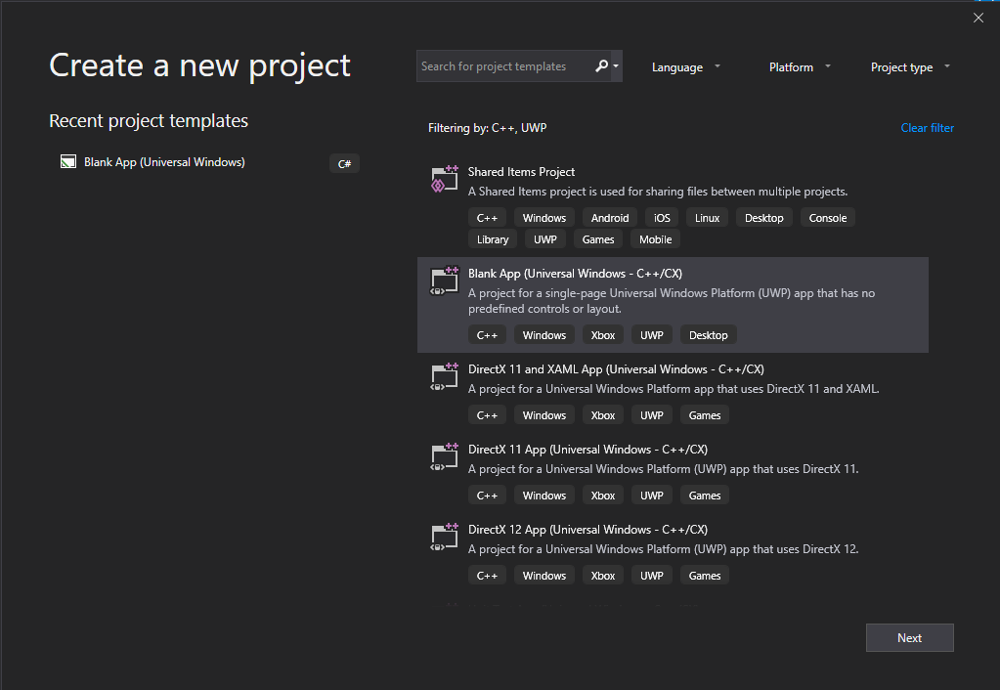
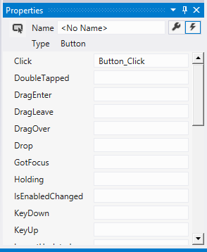
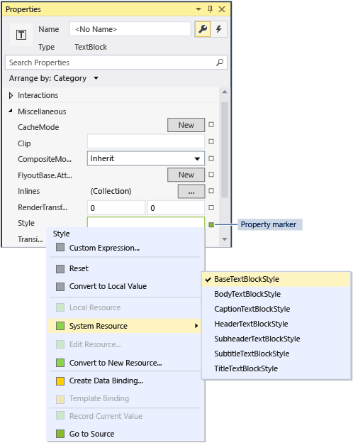
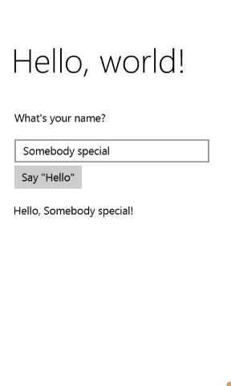

# Create a "Hello, World!" UWP app in C++/CX

> [!IMPORTANT]
> This tutorial uses C++/CX. Microsoft has released C++/WinRT: an entirely standard modern C++17 language projection for Windows Runtime (WinRT) APIs. For more information on this language, please see [C++/WinRT](../cpp-and-winrt-apis/index.md).

With Microsoft Visual Studio, you can use C++/CX to develop an app that runs on Windows with a UI that's defined in Extensible Application Markup Language (XAML).

> [!NOTE]
> This tutorial uses Visual Studio Community 2019. If you are using a different version of Visual Studio, it may look a little different for you.

## Before you start

-   To complete this tutorial, you must use Visual Studio Community, or one of the non-Community versions of Visual Studio, on a computer that's running Windows. To download, see [Get the tools](https://visualstudio.microsoft.com/downloads/).
-   To follow along, you should have a basic understanding of C++/CX, XAML, and the concepts in the [XAML overview](../xaml-platform/xaml-overview.md).
-   To follow along, you should use the default window layout in Visual Studio. To reset to the default layout, on the menu bar, choose **Window** > **Reset Window Layout**.

## Comparing C++ desktop apps to UWP apps

If you're coming from a background in Windows desktop programming in C++, then you'll probably find that some aspects of writing apps for the UWP are familiar, but other aspects require some learning.

### What's the same?

-   You can use the STL, the CRT (with some exceptions), and any other C++ library as long as the code calls only Windows functions that are accessible from the Windows Runtime environment.

-   If you're accustomed to visual design surfaces, then you can still use the designer built into Microsoft Visual Studio, or you can use the more full-featured Blend for Visual Studio. If you're accustomed to coding UI by hand, then you can hand-code your XAML.

-   You're still creating apps that use Windows operating system types and your own custom types.

-   You're still using the Visual Studio debugger, profiler, and other development tools.

-   You're still creating apps that are compiled to native machine code by the Visual C++ compiler. UWP apps in C++/CX don't execute in a managed runtime environment.

### What's new?

-   The design principles for UWP apps are very different from those for desktop apps. Window borders, labels, dialog boxes, and so on, are de-emphasized. Content is foremost. Great UWP apps incorporate these principles from the very beginning of the planning stage.

-   You're using XAML to define the entire UI. The separation between UI and core program logic is much clearer in a UWP app than in an MFC or Win32 app. Other people can work on the appearance of the UI in the XAML file while you're working on the behavior in the code file.

-   You're primarily programming against a new, easy-to-navigate, object-oriented API, the Windows Runtime, although on Windows devices Win32 is still available for some functionality.

-   You use C++/CX to consume and create Windows Runtime objects. C++/CX enables C++ exception handling, delegates, events, and automatic reference counting of dynamically created objects. When you use C++/CX, the details of the underlying COM and Windows architecture are hidden from your app code. For more information, see [C++/CX Language Reference](/cpp/cppcx/visual-c-language-reference-c-cx).

-   Your app is compiled into a package that also contains metadata about the types that your app contains, the resources that it uses, and the capabilities that it requires (file access, internet access, camera access, and so forth).

-   In the Microsoft Store and Windows Phone Store your app is verified as safe by a certification process and made discoverable to millions of potential customers.

## Hello World Store app in C++/CX

Our first app is a "Hello World" that demonstrates some basic features of interactivity, layout, and styles. We'll create an app from the Windows Universal app project template. If you've developed apps for Windows 8.1 and Windows Phone 8.1 before, you might remember that you had to have three projects in Visual Studio, one for the Windows app, one for the phone app, and another with shared code. The Windows Universal Windows Platform (UWP) makes it possible to have just one project, which runs on all devices, including desktop and laptop computers running Windows, devices such as tablets, mobile phones, VR devices and so on.

We'll start with the basics:

-   How to create a Universal Windows project in Visual Studio.

-   How to understand the projects and files that are created.

-   How to understand the extensions in Visual C++ component extensions (C++/CX), and when to use them.

**First, create a solution in Visual Studio**

1.  In Visual Studio, on the menu bar, choose **File** > **New** > **Project...**.

2.  In the **Create a new project** dialog box, select **Blank App (Universal Windows - C++/CX)**.  If you don't see this option, make sure you have the Universal Windows App Development Tools installed. See [Get set up](/windows/apps/get-started/get-set-up) for more information.



3.  Choose **Next**, and then enter a name for the project. We'll name it HelloWorld.

4.  Choose the **Create** button.

> [!NOTE]
> If this is the first time you have used Visual Studio, you might see a Settings dialog asking you to enable **Developer mode**. Developer mode is a special setting that enables certain features, such as permission to run apps directly, rather than only from the Store. For more information, please read [Enable your device for development](/windows/apps/get-started/enable-your-device-for-development). To continue with this guide, select **Developer mode**, click **Yes**, and close the dialog.

   Your project files are created.

Before we go on, let's look at what's in the solution.


### About the project files

Every .xaml file in a project folder has a corresponding .xaml.h file and .xaml.cpp file in the same folder and a .g file and a .g.hpp file in the Generated Files folder, which is on disk but not part of the project. You modify the XAML files to create UI elements and connect them to data sources (DataBinding). You modify the .h and .cpp files to add custom logic for event handlers. The auto-generated files represent the transformation of the XAML markup into C++/CX. Don't modify these files, but you can study them to better understand how the code-behind works. Basically, the generated file contains a partial class definition for a XAML root element; this class is the same class that you modify in the \*.xaml.h and .cpp files. The generated files declare the XAML UI child elements as class members so that you can reference them in the code you write. At build time, the generated code and your code are merged into a complete class definition and then compiled.

Let's look first at the project files.

-   **App.xaml, App.xaml.h, App.xaml.cpp:** Represent the Application object, which is an app's entry point. App.xaml contains no page-specific UI markup, but you can add UI styles and other elements that you want to be accessible from any page. The code-behind files contain handlers for the **OnLaunched** and **OnSuspending** events. Typically, you add custom code here to initialize your app when it starts and perform cleanup when it's suspended or terminated.
-   **MainPage.xaml, MainPage.xaml.h, MainPage.xaml.cpp:** Contain the XAML markup and code-behind for the default "start" page in an app. It has no navigation support or built-in controls.
-   **pch.h, pch.cpp:** A precompiled header file and the file that includes it in your project. In pch.h, you can include any headers that do not change often and are included in other files in the solution.
-   **Package.appxmanifest:** An XML file that describes the device capabilities that your app requires, and the app version info and other metadata. To open this file in the **Manifest Designer**, just double-click it.
-   **HelloWorld\_TemporaryKey.pfx:** A key that enables deployment of the app on this machine, from Visual Studio.

## A first look at the code

If you examine the code in App.xaml.h, App.xaml.cpp in the shared project, you'll notice that it's mostly C++ code that looks familiar. However, some syntax elements might not be as familiar if you are new to Windows Runtime apps, or you've worked with C++/CLI. Here are the most common non-standard syntax elements you'll see in C++/CX:

**Ref classes**

Almost all Windows Runtime classes, which includes all the types in the Windows API--XAML controls, the pages in your app, the App class itself, all device and network objects, all container types--are declared as a **ref class**. (A few Windows types are **value class** or **value struct**). A ref class is consumable from any language. In C++/CX, the lifetime of these types is governed by automatic reference counting (not garbage collection) so that you never explicitly delete these objects. You can create your own ref classes as well.

```cpp
namespace HelloWorld
{
   /// <summary>
   /// An empty page that can be used on its own or navigated to within a Frame.
   /// </summary>
   public ref class MainPage sealed
   {
      public:
      MainPage();
   };
}
```    

All Windows Runtime types must be declared within a namespace and unlike in ISO C++ the types themselves have an accessibility modifier. The **public** modifier makes the class visible to Windows Runtime components outside the namespace. The **sealed** keyword means the class cannot serve as a base class. Almost all ref classes are sealed; class inheritance is not broadly used because JavaScript does not understand it.

**ref new** and **^ (hats)**

You declare a variable of a ref class by using the ^ (hat) operator, and you instantiate the object with the ref new keyword. Thereafter you access the object's instance methods with the -> operator just like a C++ pointer. Static methods are accessed with the :: operator just as in ISO C++.

In the following code, we use the fully qualified name to instantiate an object, and use the -> operator to call an instance method.

```cpp
Windows::UI::Xaml::Media::Imaging::BitmapImage^ bitmapImage =
     ref new Windows::UI::Xaml::Media::Imaging::BitmapImage();

bitmapImage->SetSource(fileStream);
```

Typically, in a .cpp file we would add a `using namespace  Windows::UI::Xaml::Media::Imaging` directive and the auto keyword, so that the same code would look like this:

```cpp
auto bitmapImage = ref new BitmapImage();
bitmapImage->SetSource(fileStream);
```

**Properties**

A ref class can have properties, which, just as in managed languages, are special member functions that appear as fields to consuming code.

```cpp
public ref class SaveStateEventArgs sealed
{
   public:
   // Declare the property
   property Windows::Foundation::Collections::IMap<Platform::String^, Platform::Object^>^ PageState
   {
      Windows::Foundation::Collections::IMap<Platform::String^, Platform::Object^>^ get();
   }
   ...
};

   ...
   // consume the property like a public field
   void PhotoPage::SaveState(Object^ sender, Common::SaveStateEventArgs^ e)
   {    
      if (mruToken != nullptr && !mruToken->IsEmpty())
   {
      e->PageState->Insert("mruToken", mruToken);
   }
}
```

**Delegates**

Just as in managed languages, a delegate is a reference type that encapsulates a function with a specific signature. They are most often used with events and event handlers

```cpp
// Delegate declaration (within namespace scope)
public delegate void LoadStateEventHandler(Platform::Object^ sender, LoadStateEventArgs^ e);

// Event declaration (class scope)
public ref class NavigationHelper sealed
{
   public:
   event LoadStateEventHandler^ LoadState;
};

// Create the event handler in consuming class
MainPage::MainPage()
{
   auto navigationHelper = ref new Common::NavigationHelper(this);
   navigationHelper->LoadState += ref new Common::LoadStateEventHandler(this, &MainPage::LoadState);
}
```

## Adding content to the app

Let's add some content to the app.

**Step 1: Modify your start page**

1.  In **Solution Explorer**, open MainPage.xaml.
2.  Create controls for the UI by adding the following XAML to the root [**Grid**](/uwp/api/Windows.UI.Xaml.Controls.Grid), immediately before its closing tag. It contains a [**StackPanel**](/uwp/api/Windows.UI.Xaml.Controls.StackPanel) that has a [**TextBlock**](/uwp/api/Windows.UI.Xaml.Controls.TextBlock) that asks the user's name, a [**TextBox**](/uwp/api/Windows.UI.Xaml.Controls.TextBox) element that accepts the user's name, a [**Button**](/uwp/api/Windows.UI.Xaml.Controls.Button), and another **TextBlock** element.

    ```xaml
    <StackPanel x:Name="contentPanel" Margin="120,30,0,0">
        <TextBlock HorizontalAlignment="Left" Text="Hello World" FontSize="36"/>
        <TextBlock Text="What's your name?"/>
        <StackPanel x:Name="inputPanel" Orientation="Horizontal" Margin="0,20,0,20">
            <TextBox x:Name="nameInput" Width="300" HorizontalAlignment="Left"/>
            <Button x:Name="inputButton" Content="Say &quot;Hello&quot;"/>
        </StackPanel>
        <TextBlock x:Name="greetingOutput"/>
    </StackPanel>
    ```

3.  At this point, you have created a very basic Universal Windows app. To see what the UWP app looks like, press F5 to build, deploy, and run the app in debugging mode.

The default splash screen appears first. It has an image—Assets\\SplashScreen.scale-100.png—and a background color that are specified in the app's manifest file. To learn how to customize the splash screen, see [Adding a splash screen](/previous-versions/windows/apps/hh465332(v=win.10)).

When the splash screen disappears, your app appears. It displays the main page of the App.


It doesn't do much—yet—but congratulations, you've built your first Universal Windows Platform app!

To stop debugging and close the app, return to Visual Studio and press Shift+F5.

For more information, see [Run a Store app from Visual Studio](/visualstudio/debugger/run-store-apps-from-visual-studio).

In the app, you can type in the [**TextBox**](/uwp/api/Windows.UI.Xaml.Controls.TextBox), but clicking the [**Button**](/uwp/api/Windows.UI.Xaml.Controls.Button) doesn't do anything. In later steps, you create an event handler for the button's [**Click**](/uwp/api/windows.ui.xaml.controls.primitives.buttonbase.click) event, which displays a personalized greeting.

## Step 2: Create an event handler

1.  In MainPage.xaml, in either XAML or design view, select the "Say Hello" [**Button**](/uwp/api/Windows.UI.Xaml.Controls.Button) in the [**StackPanel**](/uwp/api/Windows.UI.Xaml.Controls.StackPanel) you added earlier.
2.  Open the **Properties Window** by pressing F4, and then choose the Events button ().
3.  Find the [**Click**](/uwp/api/windows.ui.xaml.controls.primitives.buttonbase.click) event. In its text box, type the name of the function that handles the **Click** event. For this example, type "Button\_Click".

    

4.  Press Enter. The event handler method is created in MainPage.xaml.cpp and opened so that you can add the code that's executed when the event occurs.

   At the same time, in MainPage.xaml, the XAML for the [**Button**](/uwp/api/Windows.UI.Xaml.Controls.Button) is updated to declare the [**Click**](/uwp/api/windows.ui.xaml.controls.primitives.buttonbase.click) event handler, like this:

```xaml
<Button Content="Say &quot;Hello&quot;" Click="Button_Click"/>
```

   You could also have simply added this to the xaml code manually, which can be helpful if the designer doesn't load. If you enter this manually, type "Click" and then let IntelliSense pop up the option to add a new event handler. That way, Visual Studio creates the necessary method declaration and stub.

   The designer fails to load if an unhandled exception occurs during rendering. Rendering in the designer involves running a design-time version of the page. It can be helpful to disable running user code. You can do this by changing the setting in the **Tools, Options** dialog box. Under **XAML Designer**, uncheck **Run project code in XAML designer (if supported)**.

5.  In MainPage.xaml.cpp, add the following code to the **Button\_Click** event handler that you just created. This code retrieves the user's name from the `nameInput` [**TextBox**](/uwp/api/Windows.UI.Xaml.Controls.TextBox) control and uses it to create a greeting. The `greetingOutput` [**TextBlock**](/uwp/api/Windows.UI.Xaml.Controls.TextBlock) displays the result.

```cpp
void HelloWorld::MainPage::Button_Click(Platform::Object^ sender, Windows::UI::Xaml::RoutedEventArgs^ e)
{
    greetingOutput->Text = "Hello, " + nameInput->Text + "!";
}
```

6.  Set the project as the startup, and then press F5 to build and run the app. When you type a name in the text box and click the button, the app displays a personalized greeting.


## Step 3: Style the start page

### Choosing a theme

It's easy to customize the look and feel of your app. By default, your app uses resources that have a light style. The system resources also include a light theme. Let's try it out and see what it looks like.

**To switch to the dark theme**

1.  Open App.xaml.
2.  In the opening [**Application**](/uwp/api/Windows.UI.Xaml.Application) tag, edit the [**RequestedTheme**](/uwp/api/windows.ui.xaml.application.requestedtheme) property and set its value to **Dark**:

    ```xaml
    RequestedTheme="Dark"
    ```

    Here's the full [**Application**](/uwp/api/Windows.UI.Xaml.Application) tag with the dark theme :

    ```xaml
    <Application
    x:Class="HelloWorld.App"
    xmlns="http://schemas.microsoft.com/winfx/2006/xaml/presentation"
    xmlns:x="http://schemas.microsoft.com/winfx/2006/xaml"
    xmlns:local="using:HelloWorld"
    RequestedTheme="Dark">
    ```

3.  Press F5 to build and run it. Notice that it uses the dark theme.

    

Which theme should you use? Whichever one you want. Here's our take: for apps that mostly display images or video, we recommend the dark theme; for apps that contain a lot of text, we recommend the light theme. If you're using a custom color scheme, use the theme that goes best with your app's look and feel. In the rest of this tutorial, we use the Light theme in screenshots.

**Note**  The theme is applied when the app is started and can't be changed while the app is running.

### Using system styles

Right now, in the Windows app the text is very small and difficult to read. Let's fix that by applying a system style.

**To change the style of an element**

1.  In the Windows project, open MainPage.xaml.
2.  In either XAML or design view, select the "What's your name?"[**TextBlock**](/uwp/api/Windows.UI.Xaml.Controls.TextBlock) that you added earlier.
3.  In the **Properties** window (**F4**), choose the Properties button () in the upper right.
4.  Expand the **Text** group and set the font size to 18 px.
5.  Expand the **Miscellaneous** group and find the **Style** property.
6.  Click the property marker (the green box to the right of the **Style** property), and then, on the menu, choose **System Resource** > **BaseTextBlockStyle**.

     **BaseTextBlockStyle** is a resource that's defined in the [**ResourceDictionary**](/uwp/api/Windows.UI.Xaml.ResourceDictionary) in \<root>\\Program Files\\Windows Kits\\10\\Include\\winrt\\xaml\\design\\generic.xaml.

    

     On the XAML design surface, the appearance of the text changes. In the XAML editor, the XAML for the [**TextBlock**](/uwp/api/Windows.UI.Xaml.Controls.TextBlock) is updated:

```xaml
<TextBlock Text="What's your name?" Style="{ThemeResource BaseTextBlockStyle}"/>
```

7.  Repeat the process to set the font size and assign the **BaseTextBlockStyle** to the `greetingOutput`[**TextBlock**](/uwp/api/Windows.UI.Xaml.Controls.TextBlock) element.

    **Tip**  Although there's no text in this [**TextBlock**](/uwp/api/Windows.UI.Xaml.Controls.TextBlock), when you move the pointer over the XAML design surface, a blue outline shows where it is so that you can select it.  

    Your XAML now looks like this:

```xaml
<StackPanel x:Name="contentPanel" Margin="120,30,0,0">
    <TextBlock Style="{ThemeResource BaseTextBlockStyle}" FontSize="18" Text="What's your name?"/>
    <StackPanel x:Name="inputPanel" Orientation="Horizontal" Margin="0,20,0,20">
        <TextBox x:Name="nameInput" Width="300" HorizontalAlignment="Left"/>
        <Button x:Name="inputButton" Content="Say &quot;Hello&quot;" Click="Button_Click"/>
    </StackPanel>
    <TextBlock Style="{ThemeResource BaseTextBlockStyle}" FontSize="18" x:Name="greetingOutput"/>
</StackPanel>
```

8.  Press F5 to build and run the app. It now looks like this:


### Step 4: Adapt the UI to different window sizes

Now we'll make the UI adapt to different screen sizes so it looks good on mobile devices. To do this, you add a [**VisualStateManager**](/uwp/api/Windows.UI.Xaml.VisualStateManager) and set properties that are applied for different visual states.

**To adjust the UI layout**

1.  In the XAML editor, add this block of XAML after the opening tag of the root [**Grid**](/uwp/api/Windows.UI.Xaml.Controls.Grid) element.

```xaml
<VisualStateManager.VisualStateGroups>
    <VisualStateGroup>
        <VisualState x:Name="wideState">
            <VisualState.StateTriggers>
                <AdaptiveTrigger MinWindowWidth="641" />
            </VisualState.StateTriggers>
        </VisualState>
        <VisualState x:Name="narrowState">
            <VisualState.StateTriggers>
                <AdaptiveTrigger MinWindowWidth="0" />
            </VisualState.StateTriggers>
            <VisualState.Setters>
                <Setter Target="contentPanel.Margin" Value="20,30,0,0"/>
                <Setter Target="inputPanel.Orientation" Value="Vertical"/>
                <Setter Target="inputButton.Margin" Value="0,4,0,0"/>
            </VisualState.Setters>
        </VisualState>
    </VisualStateGroup>
</VisualStateManager.VisualStateGroups>
```

2.  Debug the app on the local machine. Notice that the UI looks the same as before unless the window gets narrower than 641 device-independent pixels (DIPs).
3.  Debug the app on the mobile device emulator. Notice that the UI uses the properties you defined in the `narrowState` and appears correctly on the small screen.



If you've used a [**VisualStateManager**](/uwp/api/Windows.UI.Xaml.VisualStateManager) in previous versions of XAML, you might notice that the XAML here uses a simplified syntax.

The [**VisualState**](/uwp/api/Windows.UI.Xaml.VisualState) named `wideState` has an [**AdaptiveTrigger**](/uwp/api/Windows.UI.Xaml.AdaptiveTrigger) with its [**MinWindowWidth**](/uwp/api/windows.ui.xaml.adaptivetrigger.minwindowwidth) property set to 641. This means that the state is to be applied only when the window width is not less than the minimum of 641 DIPs. You don't define any [**Setter**](/uwp/api/Windows.UI.Xaml.Setter) objects for this state, so it uses the layout properties you defined in the XAML for the page content.

The second [**VisualState**](/uwp/api/Windows.UI.Xaml.VisualState), `narrowState`, has an [**AdaptiveTrigger**](/uwp/api/Windows.UI.Xaml.AdaptiveTrigger) with its [**MinWindowWidth**](/uwp/api/windows.ui.xaml.adaptivetrigger.minwindowwidth) property set to 0. This state is applied when the window width is greater than 0, but less than 641 DIPs. (At 641 DIPs, the `wideState` is applied.) In this state, you do define some [**Setter**](/uwp/api/Windows.UI.Xaml.Setter) objects to change the layout properties of controls in the UI:

-   You reduce the left margin of the `contentPanel` element from 120 to 20.
-   You change the [**Orientation**](/uwp/api/windows.ui.xaml.controls.stackpanel.orientation) of the `inputPanel` element from **Horizontal** to **Vertical**.
-   You add a top margin of 4 DIPs to the `inputButton` element.

### Summary

Congratulations, you've completed the first tutorial! It taught how to add content to Windows Universal apps, how to add interactivity to them, and how to change their appearance.

## Next steps

If you have a Windows Universal app project that targets Windows 8.1 and/or Windows Phone 8.1, you can port it to Windows 10 or Windows 11. There is no automatic process for this, but you can do it manually. Start with a new Windows Universal project to get the latest project system structure and manifest files, copy your code files into the project's directory structure, add the items to your project, and rewrite your XAML using the [**VisualStateManager**](/uwp/api/Windows.UI.Xaml.VisualStateManager) according to the guidance in this topic. For more information, see [Porting a Windows Runtime 8 project to a Universal Windows Platform (UWP) project](../porting/w8x-to-uwp-porting-to-a-uwp-project.md) and [Porting to the Universal Windows Platform (C++)](/cpp/porting/porting-to-the-universal-windows-platform-cpp).

If you have existing C++ code that you want to integrate with a UWP app, such as to create a new UWP UI for an existing application, see [How to: Use existing C++ code in a Universal Windows project](/cpp/porting/how-to-use-existing-cpp-code-in-a-universal-windows-platform-app).
