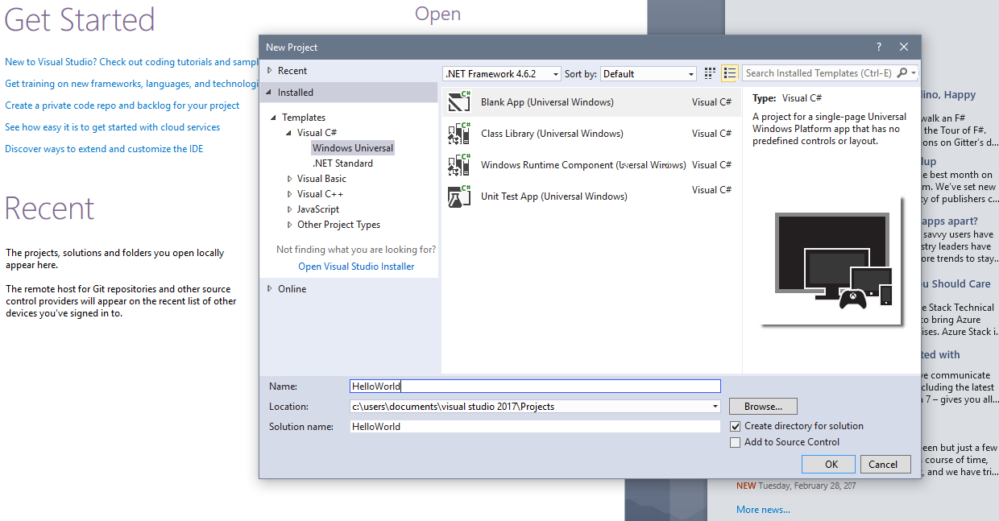
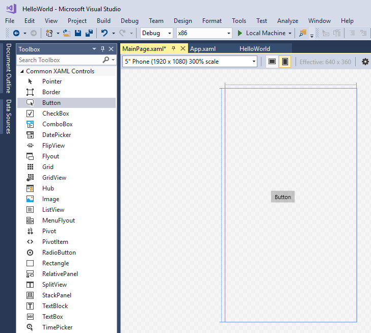

# Create a "Hello, World!" UWP app (XAML)

This tutorial teaches you how to use XAML and C# to create a simple "Hello, World!" app for the Universal Windows Platform (UWP) on Windows. With a single project in Microsoft Visual Studio, you can build an app that runs on all versions of Windows 10 and Windows 11.

Here you'll learn how to:

-   Create a new **Visual Studio** project that targets **Windows 10** and the **UWP**.
-   Write XAML to change the UI on your start page.
-   Run the project on the local desktop in Visual Studio.
-   Use a SpeechSynthesizer to make the app talk when you press a button.

## Before you start..

-   [What's a Universal Windows app?](universal-application-platform-guide.md)
-   [Download Visual Studio (and Windows)](https://developer.microsoft.com/windows/downloads). If you need a hand, learn how to [get set up](/windows/apps/get-started/get-set-up).
-   We also assume you're using the default window layout in Visual Studio. If you change the default layout, you can reset it in the **Window** menu by using the **Reset Window Layout** command.

> [!NOTE]
> This tutorial is using Visual Studio Community 2017. If you are using a different version of Visual Studio, it may look a little different for you.

## Step 1: Create a new project in Visual Studio

1.  Launch Visual Studio.

2.  From the **File** menu, select **New > Project** to open the *New Project* dialog.

3.  From the list of templates on the left, choose **Installed > Visual C# > Windows Universal** to see the list of UWP project templates.

    (If you don't see any Universal templates, you might be missing the components for creating UWP apps. You can repeat the installation process and add UWP support by clicking **Open Visual Studio installer** on the *New Project* dialog. See [Get set up](/windows/apps/get-started/get-set-up).)

    

4.  Choose the **Blank App (Universal Windows)** template, and enter "HelloWorld" as the **Name**. Select **OK**.

    

    > [!NOTE]
    > If this is the first time you have used Visual Studio, you might see a Settings dialog asking you to enable **Developer mode**. Developer mode is a special setting that enables certain features, such as permission to run apps directly, rather than only from the Store. For more information, please read [Enable your device for development](/windows/apps/get-started/enable-your-device-for-development). To continue with this guide, select **Developer mode**, click **Yes**, and close the dialog.
    >
    > 
    >

5.  The target version/minimum version dialog appears. The default settings are fine for this tutorial, so select **OK** to create the project.

    

6.  When your new project opens, its files are displayed in the **Solution Explorer** pane on the right. You may need to choose the **Solution Explorer** tab instead of the **Properties** tab to see your files.

    

Although the **Blank App (Universal Window)** is a minimal template, it still contains a lot of files. These files are essential to all UWP apps using C#. Every project that you create in Visual Studio contains them.

### What's in the files?

To view and edit a file in your project, double-click the file in the **Solution Explorer**. Expand a XAML file just like a folder to see its associated code file. XAML files open in a split view that shows both the design surface and the XAML editor.
> [!NOTE]
> What is XAML? Extensible Application Markup Language (XAML) is the language used to define your app's user interface. It can be entered manually, or created using the Visual Studio design tools. A .xaml file has a .xaml.cs code-behind file which contains the logic. Together, the XAML and code-behind make a complete class. For more information, see [XAML overview](../xaml-platform/xaml-overview.md).

*App.xaml and App.xaml.cs*

-   App.xaml is where you declare resources that are used across the app.
-   App.xaml.cs is the code-behind file for App.xaml. Like all code-behind pages, it contains a constructor that calls the `InitializeComponent` method. You don't write the `InitializeComponent` method. It's generated by Visual Studio, and its main purpose is to initialize the elements declared in the XAML file.
-   App.xaml.cs is the entry point for your app.
-   App.xaml.cs also contains methods to handle [activation](../launch-resume/activate-an-app.md) and [suspension](../launch-resume/suspend-an-app.md) of the app.

*MainPage.xaml*

-   MainPage.xaml is where you define the UI for your app. You can add elements directly using XAML markup, or you can use the design tools provided by Visual Studio.
-   MainPage.xaml.cs is the code-behind page for MainPage.xaml. It's where you add your app logic and event handlers.
-   Together these two files define a new class called `MainPage`, which inherits from [**Page**](/uwp/api/Windows.UI.Xaml.Controls.Page), in the `HelloWorld` namespace.

*Package.appxmanifest*
-   A manifest file that describes your app: its name, description, tile, start page, etc.
-   Includes a list of dependencies, resources and files that your app contains.

*A set of logo images*
-   Assets/Square150x150Logo.scale-200.png and Wide310x150Logo.scale-200.png represent your app (either Medium or Wide size) in the start menu.
-   Assets/Square44x44Logo.png represents your app in the app list of the start menu, task bar and task manager.
-   Assets/StoreLogo.png represents your app in the Microsoft Store.
-   Assets/SplashScreen.scale-200.png is the splash screen that appears when your app starts.
-   Assets/LockScreenLogo.scale-200.png can be used to represent the app on the lock screen, when the system is locked.

## Step 2: Add a button

### Using the designer view

Let's add a button to our page. In this tutorial, you work with just a few of the files listed previously: App.xaml, MainPage.xaml, and MainPage.xaml.cs.

1.  Double-click on **MainPage.xaml** to open it in the Design view.

    You'll notice there is a graphical view on the top part of the screen, and the XAML code view underneath. You can make changes to either, but for now we'll use the graphical view.

    

2.  Click on the vertical **Toolbox** tab on the left to open the list of UI controls. (You can click the pin icon in its title bar to keep it visible.)

    

3.  Expand **Common XAML Controls**, and drag the **Button** out to the middle of the design canvas.

    

    If you look at the XAML code window, you'll see that the Button has been added there too:

 ```XAML
<Button x:Name="button" Content="Button" HorizontalAlignment="Left" Margin = "152,293,0,0" VerticalAlignment="Top"/>
 ```

4.  Change the button's text.

    Click in the XAML code view, and change the Content from "Button" to "Hello, world!".

```XAML
<Button x:Name="button" Content="Hello, world!" HorizontalAlignment="Left" Margin = "152,293,0,0" VerticalAlignment="Top"/>
```

Notice how the button displayed in the design canvas updates to display the new text.


## Step 3: Start the app


At this point, you've created a very simple app. This is a good time to build, deploy, and launch your app and see what it looks like. You can debug your app on the local machine, in a simulator or emulator, or on a remote device. Here's the target device menu in Visual Studio.


### Start the app on a Desktop device

By default, the app runs on the local machine. The target device menu provides several options for debugging your app on devices from the desktop device family.

-   **Simulator**
-   **Local Machine**
-   **Remote Machine**

**To start debugging on the local machine**

1.  In the target device menu () on the **Standard** toolbar, make sure that **Local Machine** is selected. (It's the default selection.)
2.  Click the **Start Debugging** button () on the toolbar.

   –or–

   From the **Debug** menu, click **Start Debugging**.

   –or–

   Press F5.

The app opens in a window, and a default splash screen appears first. The splash screen is defined by an image (SplashScreen.png) and a background color (specified in your app's manifest file).

The splash screen disappears, and then your app appears. It looks like this.


Press the Windows key to open the **Start** menu, then show all apps. Notice that deploying the app locally adds its tile to the **Start** menu. To run the app again later (not in debugging mode), tap or click its tile in the **Start** menu.

It doesn't do much—yet—but congratulations, you've built your first UWP app!

**To stop debugging**

   Click the **Stop Debugging** button () in the toolbar.

   –or–

   From the **Debug** menu, click **Stop debugging**.

   –or–

   Close the app window.

## Step 4: Event handlers

An "event handler" sounds complicated, but it's just another name for the code that is called when an event happens (such as the user clicking on your button).

1.  Stop the app from running, if you haven't already.

2.  Double-click on the button control on the design canvas to make Visual Studio create an event handler for your button.

  You can of course, create all the code manually too. Or you can click on the button to select it, and look in the **Properties** pane on the lower right. If you switch to **Events** (the little lightning bolt) you can add the name of your event handler.

3.  Edit the event handler code in *MainPage.xaml.cs*, the code-behind page. This is where things get interesting. The default event handler looks like this:

```cs
private void Button_Click(object sender, RoutedEventArgs e)
{

}
```

  Let's change it, so it looks like this:

```cs
private async void Button_Click(object sender, RoutedEventArgs e)
{
    MediaElement mediaElement = new MediaElement();
    var synth = new Windows.Media.SpeechSynthesis.SpeechSynthesizer();
    Windows.Media.SpeechSynthesis.SpeechSynthesisStream stream = await synth.SynthesizeTextToStreamAsync("Hello, World!");
    mediaElement.SetSource(stream, stream.ContentType);
    mediaElement.Play();
}
```

Make sure the method signature now includes the **async** keyword, or you'll get an error when you try to run the app.

### What did we just do?

This code uses some Windows APIs to create a speech synthesis object, and then gives it some text to say. (For more information on using SpeechSynthesis, see the [SpeechSynthesis namespace](/uwp/api/windows.media.speechsynthesis) docs.)

When you run the app and click on the button, your computer (or phone) will literally say "Hello, World!".


## Summary

Congratulations, you've created your first app for Windows and the UWP!

To learn how to use XAML for laying out the controls your app will use, try the [grid tutorial](/windows/apps/design/layout/grid-tutorial), or jump straight to [next steps](./create-uwp-apps.md)?

## See Also

* [Your first app](your-first-app.md)
* [Publishing your UWP app](/windows/apps/publish/index).
* [How-to articles on developing UWP apps](../develop/index.md)
* [Code Samples for UWP developers](https://developer.microsoft.com/windows/samples)
* [What's a Universal Windows app?](universal-application-platform-guide.md)
* [Sign up for Windows account](/windows/apps/get-started/sign-up)
