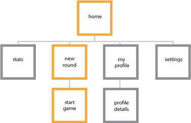

#  Building a complex Universal Windows Platform (UWP) app

On Microsoft design teams, our process for creating apps consists of five distinct stages: concept, structure, dynamics, visual, and prototype. We encourage you to adopt a similar process and have fun making new experiences for the world to enjoy.

> [!NOTE]
> It is recommended that developers who are creating new projects consider using the [Windows App SDK](/windows/apps/windows-app-sdk/) and [WinUI](/windows/apps/winui/) rather than UWP. Please see [Migrate from UWP to the Windows App SDK](/windows/apps/windows-app-sdk/migrate-to-windows-app-sdk/migrate-to-windows-app-sdk-ovw) for more details.

## Concept

**Focus your app**

When planning your Universal Windows Platform (UWP) app, you should determine not only what your app will do and who it's for, but also what your app will be great at. At the core of every great app is a strong concept that provides a solid foundation.

Say you want to create a photo app. Thinking about the reasons users work with, save, and share their photos, you'll realize that they want to relive memories, connect with others through the photos, and keep the photos safe. These, then, are the things that you want the app to be great at, and you use these experience goals to guide you through the rest of the design process.

**What's your app about?** Start with a broad concept and list all of the things that you want to help users do with your app.

For example, suppose you want to build an app that helps people plan their trips. Here are some ideas you might sketch out on the back of a napkin:

-   Get maps of all the places on an itinerary, and take them with you on the trip.
-   Find out about special events happening while you're in a city.
-   Let travel buddies create separate but shareable lists of must-do activities and must-see attractions.
-   Let travel buddies compile all of their photos to share with friends and family.
-   Get recommended destinations based on flight prices.
-   Find a consolidated list of deals for restaurants, shops, and activities around your destination.

**What's your app great at?** Take a step back and look at your list of ideas to see if a particular scenario really jumps out at you. Challenge yourself to trim the list to just a single scenario that you want to focus on. In the process, you might cross off many good ideas, but saying "no" to them is crucial to making a single scenario great.

After you choose a single scenario, decide how you would explain to an average person what your app is great at by writing it down in one sentence. For example:

-   My travel app is great at helping friends create itineraries collaboratively for group trips.
-   My workout app is great at letting friends track their workout progress and share their achievements with each other.
-   My grocery app is great at helping families coordinate their weekly grocery shopping so they never miss or duplicate a purchase.

This is your app's "great at" statement, and it can guide many design decisions and tradeoffs that you make as you build your app. Focus on the scenarios you want users to experience in your app, and be careful not to turn this into a feature list. It should be about what your users will be able to do, as opposed to what your app will be able to do.

**The design funnel**

It's very tempting—having thought of an idea you like—to go ahead and develop it, perhaps even taking it quite a ways into production. But let's say you do that and then another interesting idea comes along. It's natural that you'll be tempted to stick with the idea you've already invested in regardless of the relative merits of the two ideas. If only you'd thought of that other idea earlier in the process! Well, the design funnel is a technique to help uncover your best ideas as early as possible.

The term "funnel" comes from its shape. At the wide end of the funnel, many ideas go in and each one is realized as a very low-fidelity design artifact (a sketch, perhaps, or a paragraph of text). As this collection of ideas travels through toward the narrow end of the funnel, the number of ideas is trimmed down while the fidelity of the artifacts representing the ideas increases. Each artifact should capture only the information necessary to judge one idea against another, or to answer a particular question such as "is this usable, or intuitive?". *Put no more time and effort into each than that*. Some ideas will fall by the wayside as you test them, and you'll be okay with that because you won't be invested in them any more than was necessary to judge the idea. Ideas that survive to move further into the funnel will receive successively high-fidelity treatments. In the end, you'll have a single design artifact that represents the winning idea. This is the idea that won because of its merits, not merely because it came along first. You will have designed the best app you could.

## Structure

**Organization makes everything easier**

When you're happy with your concept, you're ready for the next stage—creating your app's blueprint. Information architecture (IA) gives your content the structural integrity it needs. It helps define your app's navigational model and, ultimately, your app's identity. By planning how your content will be organized—and how your users will discover that content—you can get a better idea of how users will experience your app.

Good IA not only facilitates user scenarios, but it helps you envision the key screens to start with. The [Audible](https://www.windowsphone.com/store/app/audible-for-windows-phone/bdc813dd-c20b-41f8-8646-de72fa0b365d) app, for example, launches directly into a hub that provides access to the user's library, store, news, and stats. The experience is focused, so users can get and enjoy audiobooks quickly. Deeper levels of the app focus on more specific tasks.

For related guidelines, see [Navigation design basics](/windows/apps/design/basics/navigation-basics).

## Dynamics

**Execute your concept**

If the concept stage is about defining your app's purpose, the dynamics stage is all about executing that purpose. This can be accomplished in many ways, such as using wireframes to sketch out your page flows (how you get from one place to the next within the app to achieve their goals), and thinking about the voice and the words used throughout your app's UI. Wireframes are a quick, low-fidelity tool to help you make critical decisions about your app's user flow.

Your app flow should be tightly tied to your "great at" statement, and should help users achieve that single scenario that you want to light up. Great apps have flows that are easy to learn, and require minimal effort. Start thinking on a screen-to-screen level—see your app as if you're using it for the first time. When you pinpoint user scenarios for pages you create, you'll give people exactly what they want without lots of unnecessary screen touches. Dynamics are also about motion. The right motion capabilities will determine fluidity and ease of use from one page to the next.

Common techniques to help with this step:

-   Outline the flow: What comes first, what comes next?
-   Storyboard the flow: How should users move through your UI to complete the flow?
-   Prototype: Try out the flow with a quick prototype.

**What should users be able to do?** For example, the travel app is "great at helping friends collaboratively create itineraries for group trips." Let's list the flows that we want to enable:

-   Create a trip with general information.
-   Invite friends to join a trip.
-   Join a friend's trip.
-   See itineraries recommended by other travelers.
-   Add destinations and activities to trips.
-   Edit and comment on destinations and activities that friends added.
-   Share itineraries for friends and families to follow.

## Visual

**Speak without words**

Once you've established the dynamics of your app, you can make your app shine with the right visual polish. Great visuals define not only how your app looks, but how it feels and comes alive through animation and motion. Your choice of color palette, icon, and artwork are just a few examples of this visual language.

All apps have their own unique identity, so explore the visual directions you can take with your app. Let the content guide the look and feel; don't let the look dictate your content.

## Prototype

**Refine your masterpiece**

Prototyping is a stage in the *design funnel*—a technique we talked about earlier—at which the artifact representing your idea develops into something more than a sketch, but less complicated than a complete app. A prototype might be a flow of hand-drawn screens shown to a user. The person running the test might respond to cues from the user by placing different screens down, or sticking or unsticking smaller pieces of UI on the pages, to simulate a running app. Or, a prototype might be a very simple app that simulates some workflows, provided the operator sticks to a script and pushes the right buttons. At this stage, your ideas begin to really come alive and your hard work is tested in earnest. When prototyping areas of your app, take the time to sculpt and refine the components that need it the most.

To new developers, we can't stress enough: Making great apps is an iterative process. We recommend that you prototype early and often. Like any creative endeavor, the best apps are the product of intensive trial and error.

## Decide what features to include

When you know what your users want and how you can help them get there, you can look at the specific tools in your toolbox. Explore the Universal Windows Platform (UWP) and associate features with your app's needs. Be sure to follow the [user experience (UX) guidelines](https://developer.microsoft.com/windows/apps/design) for each feature.
<!--need URL for landing page -->

Common techniques:

-   Platform research: Find out what features the platform offers and how you can use them.
-   Association diagrams: Connect your flows with features.
-   Prototype: Exercise the features to ensure that they do what you need.

**App contracts**  Your app can participate in app contracts that enable broad, cross-app, cross-feature user flows.

-   **Share**  Let your users share content from your app with other people through other apps, and receive shareable content from other people and apps, too.
-   **Play To**  Let your users enjoy audio, video, or images streamed from your app to other devices in their home network.
-   **File picker and file picker extensions**   Let your users load and save their files from the local file system, connected storage devices, HomeGroup, or even other apps. You can also provide a file picker extension so other apps can load your app's content.

For more info, see [App contracts and extensions](/previous-versions/windows/apps/hh464906(v=win.10)).
<!-- Win 8 page. Should have replacement. -->

**Different views, form factors, and hardware configurations**  Windows puts users in charge and your app in the forefront. You want your app UI to shine on any device, using any input mode, in any orientation, in any hardware configuration, and in whatever circumstance the user decides to use it.

**Touch first**  Windows provides a unique and distinctive touch experience that does more than simply emulate mouse functionality.

For example, semantic zoom is a touch-optimized way to navigate through a large set of content. Users can pan or scroll through categories of content, and then zoom in on those categories to view more and more detailed information. You can use this to present your content in a more tactile, visual, and informative way than with traditional navigation and layout patterns like tabs.

Of course, you can take advantage of a number of touch interactions, like rotate, pan, swipe, and others. Learn more about [Touch and other user interactions](/windows/apps/design/input/input-primer).

**Engaging and fresh**  Be sure your app feels fresh and engages users with these standard experiences:

-   **Animations**  Use our library of animations to make your app fast and fluid for your users. Help users understand context changes and tie experiences together with visual transitions. Learn more about [animating your UI](/windows/apps/design/motion/xaml-animation).
-   **Toast notifications**  Let your users know about time-sensitive or personally relevant content through toast notifications, and invite them back to your app even when your app is closed. Learn more about [tiles, badges, and toast notifications](/windows/apps/design/shell/tiles-and-notifications/index).
-   **App tiles**  Provide fresh and relevant updates to entice users back into your app. There's more info about this in the next section. Learn more about [app tiles](/windows/apps/design/shell/tiles-and-notifications/creating-tiles).

**Personalization**

-   **Settings**  Let your users create the experience they want by saving app settings. Consolidate all of your settings on one screen, and then users can configure your app through a common mechanism that they are already familiar with. Learn more about [Adding app settings](/windows/apps/design/app-settings/guidelines-for-app-settings).
-   **User tiles**   Make your app more personal to your users by loading their user tile image, or let the users set content from your app as their personal tile throughout Windows.

**Device capabilities**  Be sure your app takes full advantage of the capabilities of today's devices.

-   **Proximity gestures**  Let your users connect devices with other users who are physically in close proximity, by physically tapping the devices together (multiplayer games). Learn more about [proximity and tapping](/previous-versions/windows/apps/hh465229(v=win.10)).
-   **Cameras and external storage devices**  Connect your users to their built-in or plugged-in cameras for chatting and conferencing, recording vlogs, taking profile pics, documenting the world around them, or whatever activity your app is great at. Learn more about [Accessing content on removable storage](/previous-versions/windows/apps/hh465189(v=win.10)).
-   **Accelerometers and other sensors**     Devices come with a number of sensors nowadays. Your app can dim or brighten the display based on ambient light, reflow the UI if the user rotates the display, or react to any physical movement. Learn more about [sensors](../devices-sensors/sensors.md).
-   **Geolocation**  Use geolocation information from standard web data or from geolocation sensors to help your users get around, find their position on a map, or get notices about nearby people, activities, and destinations. Learn more about [geolocation](/previous-versions/windows/apps/hh465139(v=win.10)).

Let's consider the travel app example again. To be great at helping friends collaboratively create itineraries for group trips, you could use some of these features, just to name a few:

-   Share: Users share upcoming trips and their itineraries to multiple social networks to share the pre-trip excitement with their friends and families.
-   Search: Users search for and find activities or destinations from others' shared or public itineraries that they can include in their own trips.
-   Notifications: Users are notified when travel companions update their itineraries.
-   Settings: Users configure the app to their preference, like which trip should bring up notifications or which social groups are allowed to search the users' itineraries.
-   Semantic zoom: Users navigate through the timeline of their itinerary and zoom in to see greater details of the long list of activities they've planned.
-   User tiles: Users choose the picture they want to appear when they share their trip with friends.

## Decide how to monetize your app

You have a lot of options for earning money from your app. If you decide to use in-app ads or sales, you'll want to design your UI to support that. For more information, see [Plan for monetization](../monetize/index.md).

## Design the UX for your app

This is about getting the basics right. Now that you know what your app is great at, and you've figured out the flows that you want to support, you can start to think about the fundamentals of user experience (UX) design.

**How should you organize UI content?**   Most app content can be organized into some form of groupings or hierarchies. What you choose as the top-level grouping of your content should match the focus of your "great at" statement.

To use the travel app as an example, there are multiple ways to group itineraries. If the focus of the app is discovering interesting destinations, you might group them based on interest, like adventure, fun in the sun, or romantic getaways. However, because the focus of the app is planning trips with friends, it makes more sense to organize itineraries based on social circles, like family, friends, or work.

Choosing how you want to group your content helps you decide what pages or views you need in your app. See UI basics for more info.

**How should you present UI content?** After you've decided how to organize your UI, you can define UX goals that specify how your UI gets built and presented to your user. In any scenario, you want to make sure that your user can continue using and enjoying your app as quickly as possible. To do this, decide what parts of your UI need to be presented first, and make sure that those parts are complete before you spend time building the noncritical parts.

In the travel app, probably the first thing the user will want to do in the app is find a specific trip itinerary. To present this info as fast as possible, you should show the list of trips first, using a **ListView** control.

After showing the trips list, you could start loading other features, like a news feed of their friends' trips.

**What UI surfaces and commands do you need?**   Review the flows that you identified earlier. For each flow, create a rough outline of the steps users take.

Let's look at the "Share itineraries for friends and families to follow" flow. We'll assume that the user has already created a trip. Sharing a trip itinerary might require these steps:

1.  The user opens the app and sees a list of trips she created.
2.  The user taps on the trip she wants to share.
3.  The details of the trip appear on screen.
4.  The user accesses some UI to initiate sharing.
5.  The user selects or enters the email address or name of the friend she wants to share the trip with.
6.  The user accesses some UI to finalize sharing.
7.  Your app updates the trip details with the list of people she has shared her trip with.

During this process, you begin to see what UI you need to create and the additional details you need to figure out (like drafting a standard email boilerplate for friends who aren't using your app yet). You also can start eliminating unnecessary steps. Perhaps the user doesn't actually need to see the details of the trip before sharing, for example. The cleaner the flow, the easier to use.

For more details on how to use different surfaces, take a look at <!--[Command design basics](/windows/apps/design/basics/commanding-basics)-->.

**What should the flow feel like?** When you have defined the steps your user will take, you can turn that flow into performance goals. For more info, see [Plan for performance](../debug-test-perf/planning-and-measuring-performance.md).

**How should you organize commands?**  Use your outline of the flow steps to identify potential commands that you need to design for. Then think about where to use those commands in your app.

-   **Always try to use the content.**  Whenever possible, let users directly manipulate the content on the app's canvas, rather than adding commands that act on the content. For example, in the travel app, let users rearrange their itinerary by dragging and dropping activities in a list on the canvas, rather than by selecting the activity and using Up or Down command buttons.
-   **If you can't use the content.** Place commands on one of these UI surfaces if you are not able to use the content:

    -   In the [command bar](/windows/apps/design/controls/command-bar): You should put most commands on the command bar, which is usually hidden until the user taps to make it visible.
    -   On the app's canvas: If the user is on a page or view that has a single purpose, you can provide commands for that purpose directly on the canvas. There should be very few of these commands.
    -   In a [context menu](/windows/apps/design/controls/menus): You can use context menus for clipboard actions (such as cut, copy, and paste), or for commands that apply to content that cannot be selected (like adding a push pin to a location on a map).

**Decide how to lay out your app in each view.**  Windows supports landscape and portrait orientations and supports resizing apps to any width, from full screen to a minimum width. You want your app to look and work great at any size, on any screen, in either orientation. This means you need to plan the layout of your UI elements for different sizes and views. When you do this, your app UI changes fluidly to meet your user's needs and preferences.

For more info on designing for different screen sizes, see [Screen sizes and break points for responsive design](/windows/apps/design/layout/screen-sizes-and-breakpoints-for-responsive-design).

## Make a good first impression

Think about what you want users to think, feel, or do when they first launch your app. Refer back to your "great at" statement. Even though you won't get a chance to personally tell your users what your app is great at, you can convey the message to them when you make your first impression. Take advantage of these:

**Tile and notifications**    The tile is the face of your app. Among the many other apps on a user's Start screen, what will make the user want to launch your app? Be sure your tile highlights your app's brand and shows what the app is great at. Use tile notifications so your app will always feel fresh and relevant, bringing the user back to your app again and again.

**Splash screen**  The splash screen should load as fast as possible, and remain on the screen only as long as you need to initialize your app state. What you show on the splash screen should express your app's personality.

**First launch**  Before users sign up for your service, log in to their account, or add their own content, what will they see? Try to demonstrate the value of your app before asking users for information. Consider showing sample content so people can look around and understand what your app does before you ask them to commit.

**Home page**  The home page is where you bring users each time they launch your app. The content here should have a clear focus, and immediately showcase what your app is tailored to do. Make this page great at one thing and trust that people will explore the rest of your app. Focus on eliminating distractions on the landing page, and not on discoverability.

## Validate your design

Before you get too far into developing your app, you should validate your design or prototype against guidelines, user impressions, and requirements to avoid having to rework it later. Each feature has a set of UX guidelines to help you polish your app, and a set of Store requirements that you must meet to publish your app in the Microsoft Store. You can use [the Windows App Certification Kit](https://developer.microsoft.com/windows/develop/app-certification-kit) to test for technical compliance with Store requirements. You can also use the performance tools in Microsoft Visual Studio to make sure that you're giving your users a great experience in every scenario.

Use the [detailed UX guidelines for UWP apps](https://developer.microsoft.com/windows/apps/design) to stay focused on important features. Use the [Visual Studio performance tools](/visualstudio/profiling/profiling-feature-tour) to analyze the performance of each of your app's scenarios.