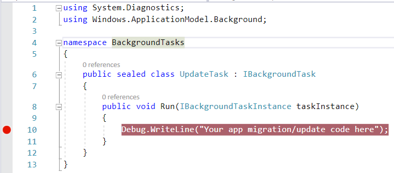

# Run a background task when your UWP app is updated

Learn how to write a background task that runs after your Universal Windows Platform (UWP) store app is updated.

The Update Task background task is invoked by the operating system after the user installs an update to an app that is installed on the device. This allows your app to perform initialization tasks such as initializing a new push notification channel, updating database schema, and so on, before the user launches your updated app.

The Update Task differs from launching a background task using the [ServicingComplete](/uwp/api/Windows.ApplicationModel.Background.SystemTriggerType) trigger because in that case your app must run at least once before it is updated in order to register the background task that will be activated by the **ServicingComplete** trigger.  The Update Task isn't registered and so an app that has never been run, but that is upgraded, will still have its update task triggered.

## Step 1: Create the background task class

As with other types of background tasks, you implement the Update Task background task as a Windows Runtime component. To create this component, follow the steps in the **Create the Background Task class** section of [Create and register an out-of-process background task](./create-and-register-a-background-task.md). The steps include:

- Adding a Windows Runtime component project to your solution.
- Creating a reference from your app to the component.
- Creating a public, sealed class in the component that implements [**IBackgroundTask**](/uwp/api/Windows.ApplicationModel.Background.IBackgroundTask).
- Implementing the [**Run**](/uwp/api/windows.applicationmodel.background.ibackgroundtask.run) method, which is the required entry point that is called when the Update Task is run. If you are going to make asynchronous calls from your background task, [Create and register an out-of-process background task](./create-and-register-a-background-task.md) explains how to use a deferral in your **Run** method.

You don't need to register this background task (the "Register the background task to run" section in the **Create and register an out-of-process background task** topic) to use the Update Task. This is the main reason to use an Update Task because you don't need to add any code to your app to register the task and the app doesn't have to at least run once before being updated to register the background task.

The following sample code shows a basic starting point for an Update Task background task class in C#. The background task class itself - and all other classes in the background task project - need to be **public** and **sealed**. Your background task class must derive from **IBackgroundTask** and have a public **Run()** method with the signature shown below:

```cs
using Windows.ApplicationModel.Background;

namespace BackgroundTasks
{
    public sealed class UpdateTask : IBackgroundTask
    {
        public void Run(IBackgroundTaskInstance taskInstance)
        {
            // your app migration/update code here
        }
    }
}
```

## Step 2: Declare your background task in the package manifest

In the Visual Studio Solution Explorer, right-click **Package.appxmanifest** and click **View Code** to view the package manifest. Add the following `<Extensions>` XML to declare your update task:

```XML
<Package ...>
    ...
  <Applications>  
    <Application ...>  
        ...
      <Extensions>  
        <Extension Category="windows.updateTask"  EntryPoint="BackgroundTasks.UpdateTask">  
        </Extension>  
      </Extensions>

    </Application>  
  </Applications>  
</Package>
```

In the XML above, ensure that the `EntryPoint` attribute is set to the namespace.class name of your update task class. The name is case-sensitive.

## Step 3: Debug/test your Update task

Ensure that you have deployed your app to your machine so that there is something to update.

Set a breakpoint in the Run() method of your background task.



Next, in the solution explorer, right-click your app's project (not the background task project) and then click **Properties**. In the application Properties window, click **Debug** on the left, then select **Do not launch, but debug my code when it starts**:


Next, to ensure that the UpdateTask is triggered, increase the package's version number. In the Solution Explorer, double-click your app's **Package.appxmanifest** file to open the package designer, and then update the **Build** number:


Now, in Visual Studio 2019 when you press F5, your app will be updated and the system will activate your UpdateTask component in the background. The debugger will automatically attach to the background process. Your breakpoint will get hit and you can step through your update code logic.

When the background task completes, you can launch the foreground app from the Windows start menu within the same debug session. The debugger will again automatically attach, this time to your foreground process, and you can step through your app's logic.

> [!NOTE]
> Visual Studio 2015 users: The above steps apply to Visual Studio 2017 or Visual Studio 2019. If you are using Visual Studio 2015, you can use the same techniques to trigger and test the UpdateTask, except Visual Studio will not attach to it. An alternative procedure in VS 2015 is to setup an [ApplicationTrigger](./trigger-background-task-from-app.md) that sets the UpdateTask as its Entry Point, and trigger the execution directly from the foreground app.

## See also

[Create and register an out-of-process background task](./create-and-register-a-background-task.md)