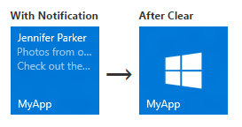

# Send a local tile notification

[!INCLUDE [notes](includes/live-tiles-note.md)]

Primary app tiles in Windows 10 are defined in your app manifest, while secondary tiles are programmatically created and defined by your app code. This article describes how to send a local tile notification to a primary tile and a secondary tile using adaptive tile templates. (A local notification is one that's sent from app code as opposed to one that's pushed or pulled from a web server.)


> [!NOTE]
>Learn about [creating adaptive tiles](create-adaptive-tiles.md) and [tile content schema](tile-schema.md).

## Install the NuGet package

We recommend installing the [Notifications library NuGet package](https://www.nuget.org/packages/Microsoft.Toolkit.Uwp.Notifications/), which simplifies things by generating tile payloads with objects instead of raw XML.

The inline code examples in this article are for C# using the Notifications library. (If you'd prefer to create your own XML, you can find code examples without the Notifications library toward the end of the article.)

## Add namespace declarations

To access the tile APIs, include the [**Windows.UI.Notifications**](/uwp/api/Windows.UI.Notifications) namespace. We also recommend including the **Microsoft.Toolkit.Uwp.Notifications** namespace so that you can take advantage of our tile helper APIs (you must install the [Notifications library](https://www.nuget.org/packages/Microsoft.Toolkit.Uwp.Notifications/) NuGet package to access these APIs).

```csharp
using Windows.UI.Notifications;
using Microsoft.Toolkit.Uwp.Notifications; // Notifications library
```

## Create the notification content

In Windows 10, tile payloads are defined using adaptive tile templates, which allow you to create custom visual layouts for your notifications. (To learn what's possible with adaptive tiles, see [Create adaptive tiles](create-adaptive-tiles.md).)

This code example creates adaptive tile content for medium and wide tiles.

```csharp
// In a real app, these would be initialized with actual data
string from = "Jennifer Parker";
string subject = "Photos from our trip";
string body = "Check out these awesome photos I took while in New Zealand!";

// Construct the tile content
TileContent content = new TileContent()
{
    Visual = new TileVisual()
    {
        TileMedium = new TileBinding()
        {
            Content = new TileBindingContentAdaptive()
            {
                Children =
                {
                    new AdaptiveText()
                    {
                        Text = from
                    },

                    new AdaptiveText()
                    {
                        Text = subject,
                        HintStyle = AdaptiveTextStyle.CaptionSubtle
                    },

                    new AdaptiveText()
                    {
                        Text = body,
                        HintStyle = AdaptiveTextStyle.CaptionSubtle
                    }
                }
            }
        },

        TileWide = new TileBinding()
        {
            Content = new TileBindingContentAdaptive()
            {
                Children =
                {
                    new AdaptiveText()
                    {
                        Text = from,
                        HintStyle = AdaptiveTextStyle.Subtitle
                    },

                    new AdaptiveText()
                    {
                        Text = subject,
                        HintStyle = AdaptiveTextStyle.CaptionSubtle
                    },

                    new AdaptiveText()
                    {
                        Text = body,
                        HintStyle = AdaptiveTextStyle.CaptionSubtle
                    }
                }
            }
        }
    }
};
```

The notification content looks like the following when displayed on a medium tile:


## Create the notification

Once you have your notification content, you'll need to create a new [**TileNotification**](/uwp/api/Windows.UI.Notifications.TileNotification). The **TileNotification** constructor takes a Windows Runtime [**XmlDocument**](/uwp/api/windows.data.xml.dom.xmldocument) object, which you can obtain from the **TileContent.GetXml** method if you're using the [Notifications library](https://www.nuget.org/packages/Microsoft.Toolkit.Uwp.Notifications/).

This code example creates a notification for a new tile.

```csharp
// Create the tile notification
var notification = new TileNotification(content.GetXml());
```

## Set an expiration time for the notification (optional)

By default, local tile and badge notifications don't expire, while push, periodic, and scheduled notifications expire after three days. Because tile content shouldn't persist longer than necessary, it's a best practice to set an expiration time that makes sense for your app, especially on local tile and badge notifications.

This code example creates a notification that expires and will be removed from the tile after ten minutes.

```csharp
tileNotification.ExpirationTime = DateTimeOffset.UtcNow.AddMinutes(10);
```

## Send the notification

Although locally sending a tile notification is simple, sending the notification to a primary or secondary tile is a bit different.

**Primary tile**

To send a notification to a primary tile, use the [**TileUpdateManager**](/uwp/api/Windows.UI.Notifications.TileUpdateManager) to create a tile updater for the primary tile, and send the notification by calling "Update". Regardless of whether it's visible, your app's primary tile always exists, so you can send notifications to it even when it's not pinned. If the user pins your primary tile later, the notifications that you sent will appear then.

This code example sends a notification to a primary tile.

```csharp
// Send the notification to the primary tile
TileUpdateManager.CreateTileUpdaterForApplication().Update(notification);
```

**Secondary tile**

To send a notification to a secondary tile, first make sure that the secondary tile exists. If you try to create a tile updater for a secondary tile that doesn't exist (for example, if the user unpinned the secondary tile), an exception will be thrown. You can use [**SecondaryTile.Exists**](/uwp/api/windows.ui.startscreen.secondarytile.exists)(tileId) to discover if your secondary tile is pinned, and then create a tile updater for the secondary tile and send the notification.

This code example sends a notification to a secondary tile.

```csharp
// If the secondary tile is pinned
if (SecondaryTile.Exists("MySecondaryTile"))
{
    // Get its updater
    var updater = TileUpdateManager.CreateTileUpdaterForSecondaryTile("MySecondaryTile");

    // And send the notification
    updater.Update(notification);
}
```


## Clear notifications on the tile (optional)

In most cases, you should clear a notification once the user has interacted with that content. For example, when the user launches your app, you might want to clear all the notifications from the tile. If your notifications are time-bound, we recommend that you set an expiration time on the notification instead of explicitly clearing the notification.

This code example clears the tile notification for the primary tile. You can do the same for secondary tiles by creating a tile updater for the secondary tile.

```csharp
TileUpdateManager.CreateTileUpdaterForApplication().Clear();
```

For a tile with the notification queue enabled and notifications in the queue, calling the Clear method empties the queue. You can't, however, clear a notification via your app's server; only the local app code can clear notifications.

Periodic or push notifications can only add new notifications or replace existing notifications. A local call to the Clear method will clear the tile whether or not the notifications themselves came via push, periodic, or local. Scheduled notifications that haven't yet appeared are not cleared by this method.



## Next steps

**Using the notification queue**

Now that you have done your first tile update, you can expand the functionality of the tile by enabling a [notification queue](/previous-versions/windows/apps/hh868234(v=win.10)).

**Other notification delivery methods**

This article shows you how to send the tile update as a notification. To explore other methods of notification delivery, including scheduled, periodic, and push, see [Delivering notifications](/windows/apps/design/shell/tiles-and-notifications/choosing-a-notification-delivery-method).

**XmlEncode delivery method**

If you're not using the [Notifications library](https://www.nuget.org/packages/Microsoft.Toolkit.Uwp.Notifications/), this notification delivery method is another alternative.

```csharp
public string XmlEncode(string text)
{
    StringBuilder builder = new StringBuilder();
    using (var writer = XmlWriter.Create(builder))
    {
        writer.WriteString(text);
    }

    return builder.ToString();
}
```

## Code examples without Notifications library

If you prefer to work with raw XML instead of the [Notifications library](https://www.nuget.org/packages/Microsoft.Toolkit.Uwp.Notifications/) NuGet package, use these alternate code examples to first three examples provided in this article. The rest of the code examples can be used either with the [Notifications library](https://www.nuget.org/packages/Microsoft.Toolkit.Uwp.Notifications/) or with raw XML.

Add namespace declarations

```csharp
using Windows.UI.Notifications;
using Windows.Data.Xml.Dom;
```

Create the notification content

```csharp
// In a real app, these would be initialized with actual data
string from = "Jennifer Parker";
string subject = "Photos from our trip";
string body = "Check out these awesome photos I took while in New Zealand!";

// TODO - all values need to be XML escaped

// Construct the tile content as a string
string content = $@"
<tile>
    <visual>

        <binding template='TileMedium'>
            <text>{from}</text>
            <text hint-style='captionSubtle'>{subject}</text>
            <text hint-style='captionSubtle'>{body}</text>
        </binding>

        <binding template='TileWide'>
            <text hint-style='subtitle'>{from}</text>
            <text hint-style='captionSubtle'>{subject}</text>
            <text hint-style='captionSubtle'>{body}</text>
        </binding>

    </visual>
</tile>";
```

Create the notification

```csharp
// Load the string into an XmlDocument
XmlDocument doc = new XmlDocument();
doc.LoadXml(content);

// Then create the tile notification
var notification = new TileNotification(doc);
```

## Related topics

* [Create adaptive tiles](create-adaptive-tiles.md)
* [Tile content schema](tile-schema.md)
* [Notifications library](https://www.nuget.org/packages/Microsoft.Toolkit.Uwp.Notifications/)
* [Full code sample on GitHub](https://github.com/WindowsNotifications/quickstart-sending-local-tile-win10)
* [**Windows.UI.Notifications namespace**](/uwp/api/Windows.UI.Notifications)
* [How to use the notification queue (XAML)](/previous-versions/windows/apps/hh868234(v=win.10))
* [Delivering notifications](/windows/apps/design/shell/tiles-and-notifications/choosing-a-notification-delivery-method)
