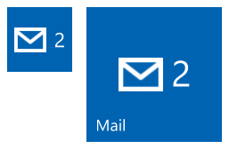
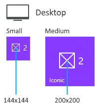
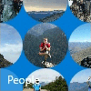

# Special tile templates

[!INCLUDE [notes](includes/live-tiles-note.md)]

Special tile templates are unique templates that are either animated, or just allow you to do things that aren't possible with adaptive tiles. Each special tile template was specifically built for Windows 10, except for the iconic tile template, a classic special template that has been updated for Windows 10. This article covers three special tile templates: Iconic, Photos, and People.

## Iconic tile template

The iconic template (also known as the "IconWithBadge" template) lets you display a small image in the center of the tile.



### How to create an iconic tile

The following steps cover everything you need to know to create an iconic tile for Windows 10. At a high level, you need your iconic image asset, then you send a notification to the tile using the iconic template, and finally you send a badge notification that provides the number to be displayed on the tile.


**Step 1: Create your image assets in PNG format**

Create the icon assets for your tile and place those in your project resources with your other assets. At a bare minimum, create a 200x200 pixel icon, which works for both small and medium tiles. To provide the best user experience, create an icon for each size. No padding is needed on these assets. See sizing details in the below image. Windows 10 on tablet, laptop, and desktop only supports square icon assets.

Save icon assets in PNG format and with transparency.



**Step 2: Create your base tile**

You can use the iconic template on both primary and secondary tiles. If you're using it on a secondary tile, you'll first have to create the secondary tile or use an already-pinned secondary tile. Primary tiles are implicitly pinned and can always be sent notifications.

**Step 3: Send a notification to your tile**

Although this step can vary based on whether the notification is sent locally or via server push, the XML payload that you send remains the same. To send a local tile notification, create a [**TileUpdater**](/uwp/api/Windows.UI.Notifications.TileUpdater) for your tile (either primary or secondary tile), then send a notification to the tile that uses the iconic tile template as seen below. Ideally, you should also include bindings for wide and large tile sizes using [adaptive tile templates](create-adaptive-tiles.md).

Here's sample code for the XML payload:

```xml
<tile>
  <visual>

    <binding template="TileSquare150x150IconWithBadge">
      <image id="1" src="Iconic.png" alt="alt text"/>
    </binding>
    
    <binding template="TileSquare71x71IconWithBadge">
      <image id="1" src="Iconic.png" alt="alt text"/>
    </binding>

  </visual>
</tile>
```

This iconic tile template XML payload uses an image element that points to the image that you created in Step 1. Now your tile is ready to display the badge next to your icon; all that's left is sending badge notifications.

**Step 4: Send a badge notification to your tile**

As with step 3, this step can vary based on whether the notification is sent locally or via server push, yet the XML payload that you send remains the same. To send a local badge notification, create a [**BadgeUpdater**](/uwp/api/Windows.UI.Notifications.BadgeUpdater) for your tile (either primary or secondary tile), then send a badge notification with your desired value (or clear the badge).

Here's sample code for the XML payload:

```xml
<badge value="2"/>
```

The tile's badge will update accordingly.

**Step 5: Putting it all together**

The following image illustrates how the various APIs and payloads are associated with each aspect of the iconic tile template. A [tile notification](sending-a-local-tile-notification.md) (which contains those &lt;binding&gt; elements) is used to specify the iconic template and the image asset; a [badge notification](/windows/apps/design/shell/tiles-and-notifications/badges) specifies the numerical value; tile properties control your tile's display name, color, and more.


## Photos tile template

The photos tile template lets you display a slideshow of photos on your live tile. The template is supported on all tile sizes, including small, and behaves the same on each tile size. The below example shows five frames of a medium tile that uses the photos template. The template has a zoom and cross-fade animation that cycles through selected photos and loops indefinitely.


### How to use the photos template

Using the photos template is easy if you've installed the [Notifications library](https://www.nuget.org/packages/Microsoft.Toolkit.Uwp.Notifications/). Although you can use raw XML, we highly recommend using the library so you don't have to worry about generating valid XML or XML-escaping content.

Windows displays up to 12 photos in a slideshow.

For information about sending the tile notification, see the [Send notifications article](index.md).

```xml
<!--
 
To use the Photos template...
 
 - On any adaptive tile binding (like TileMedium or TileWide)
   - Set the hint-presentation attribute to "photos"
   - Add up to 12 images as children of the binding.
    
-->
 
<tile>
  <visual>
     
    <binding template="TileMedium" hint-presentation="photos">
       
      <image src="Assets/1.jpg" />
      <image src="ms-appdata:///local/Images/2.jpg"/>
      <image src="http://msn.com/images/3.jpg"/>
       
      <!--TODO: Can have 12 images total-->
       
    </binding>
     
    <!--TODO: Add bindings for other tile sizes-->
     
  </visual>
</tile>
```

```csharp
/*
To use the Photos template...
 
 - On any TileBinding object
   - Set Content property to new instance of TileBindingContentPhotos
   - Add up to 12 images to Images property of TileBindingContentPhotos. 
*/
 
TileContent content = new TileContent()
{
    Visual = new TileVisual()
    {
        TileMedium = new TileBinding()
        {
            Content = new TileBindingContentPhotos()
            {
                Images =
                {
                    new TileBasicImage() { Source = "Assets/1.jpg" },
                    new TileBasicImage() { Source = "ms-appdata:///local/Images/2.jpg" },
                    new TileBasicImage() { Source = "http://msn.com/images/3.jpg" }
 
                    // TODO: Can have 12 images total
                }
            }
        }
 
        // TODO: Add other tile sizes
    }
};
```

## People tile template

The People app in Windows 10 uses a special tile template that displays a collection of images in circles that slide around vertically or horizontally on the tile. This tile template has been available since Windows 10 Build 10572, and anyone is welcome to use it in their app.

The People tile template works on tiles of these sizes:

**Medium tile** (TileMedium)



**Wide tile** (TileWide)


**Large tile (desktop only)** (TileLarge)


If you're using the [Notifications library](https://www.nuget.org/packages/Microsoft.Toolkit.Uwp.Notifications/), all you have to do to make use of the People tile template is create a new *TileBindingContentPeople* object for your *TileBinding* content. The *TileBindingContentPeople* class has an Images property where you add your images.

If you're using raw XML, set the *hint-presentation* to "people" and add your images as children of the binding element.

The following C# code sample assumes that you're using the [Notifications library](https://www.nuget.org/packages/Microsoft.Toolkit.Uwp.Notifications/).

```csharp
TileContent content = new TileContent()
{
    Visual = new TileVisual()
    {
        TileMedium = new TileBinding()
        {
            Content = new TileBindingContentPeople()
            {
                Images =
                {
                    new TileBasicImage() { Source = "Assets/ProfilePics/1.jpg" },
                    new TileBasicImage() { Source = "Assets/ProfilePics/2.jpg" },
                    new TileBasicImage() { Source = "Assets/ProfilePics/3.jpg" },
                    new TileBasicImage() { Source = "Assets/ProfilePics/4.jpg" },
                    new TileBasicImage() { Source = "Assets/ProfilePics/5.jpg" },
                    new TileBasicImage() { Source = "Assets/ProfilePics/6.jpg" },
                    new TileBasicImage() { Source = "Assets/ProfilePics/7.jpg" },
                    new TileBasicImage() { Source = "Assets/ProfilePics/8.jpg" },
                    new TileBasicImage() { Source = "Assets/ProfilePics/9.jpg" }
                }
            }
        }
    }
};
```

```xml
<tile>
  <visual>
 
    <binding template="TileMedium" hint-presentation="people">
      <image src="Assets/ProfilePics/1.jpg"/>
      <image src="Assets/ProfilePics/2.jpg"/>
      <image src="Assets/ProfilePics/3.jpg"/>
      <image src="Assets/ProfilePics/4.jpg"/>
      <image src="Assets/ProfilePics/5.jpg"/>
      <image src="Assets/ProfilePics/6.jpg"/>
      <image src="Assets/ProfilePics/7.jpg"/>
      <image src="Assets/ProfilePics/8.jpg"/>
      <image src="Assets/ProfilePics/9.jpg"/>
    </binding>
 
  </visual>
</tile>
```

For the best user experience, we recommend that you provide the following number of photos for each tile size:

- Medium tile: 9 photos
- Wide tile: 15 photos
- Large tile: 20 photos

Having that number of photos allows for a few empty circles, which means that the tile won't be too visually busy. Feel free to tweak the number of photos to get the look that works best for you.

To send the notification, see [Choose a notification delivery method](/windows/apps/design/shell/tiles-and-notifications/choosing-a-notification-delivery-method).

## Related topics

- [Full code sample on GitHub](https://github.com/WindowsNotifications/quickstart-people-tile-template)
- [Notifications library](https://www.nuget.org/packages/Microsoft.Toolkit.Uwp.Notifications/)
- [Create adaptive tiles](create-adaptive-tiles.md)
- [Tile content schema](tile-schema.md)
  