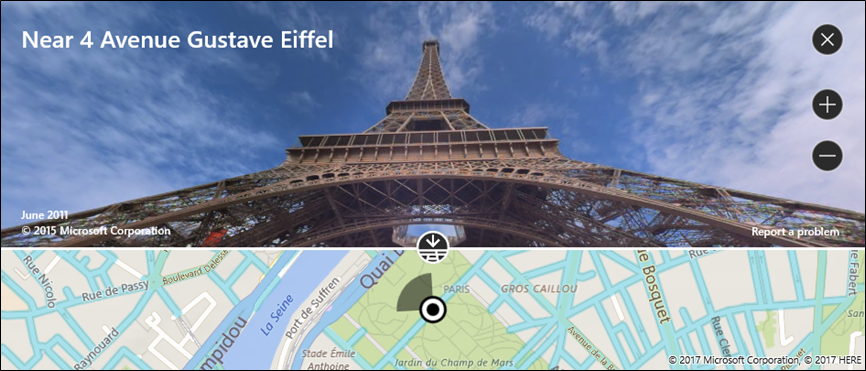

# Display maps with 2D, 3D, and Streetside views

> [!IMPORTANT]
> **Bing Maps for Enterprise service retirement**
>
> The UWP [**MapControl**](/uwp/api/Windows.UI.Xaml.Controls.Maps.MapControl) and map services from the [**Windows.Services.Maps**](/uwp/api/Windows.Services.Maps) namespace rely on Bing Maps. Bing Maps for Enterprise is deprecated and will be retired, at which point the MapControl and services will no longer receive data.
>
> For more information, see the [Bing Maps Developer Center](https://www.bingmapsportal.com/) and [Bing Maps documentation](/bingmaps/getting-started/).
You can show a map in light dismissable window called a map *placecard* or in a full featured map control.

Download the [map sample](https://github.com/Microsoft/Windows-universal-samples/tree/master/Samples/MapControl) to try out some the features described in this guide.

## Display map in a placecard

You can show users a map inside of a light-weight pop-up window above, below or to the side of a UI element or an area of an app where the user touches. The map can show a city or address that relates to information in your app.  

This placecard shows the city of Seattle.


Here's the code that makes Seattle appear in a placecard below a button.

```csharp
private void Seattle_Click(object sender, RoutedEventArgs e)
{
    Geopoint seattlePoint = new Geopoint
        (new BasicGeoposition { Latitude = 47.6062, Longitude = -122.3321 });

    PlaceInfo spaceNeedlePlace = PlaceInfo.Create(seattlePoint);

    FrameworkElement targetElement = (FrameworkElement)sender;

    GeneralTransform generalTransform =
        targetElement.TransformToVisual((FrameworkElement)targetElement.Parent);

    Rect rectangle = generalTransform.TransformBounds(new Rect(new Point
        (targetElement.Margin.Left, targetElement.Margin.Top), targetElement.RenderSize));

    spaceNeedlePlace.Show(rectangle, Windows.UI.Popups.Placement.Below);
}
```

This placecard shows the location of the Space Needle in Seattle.


Here's the code that makes the Space Needle appear in a placecard below a button.

```csharp
private void SpaceNeedle_Click(object sender, RoutedEventArgs e)
{
    Geopoint spaceNeedlePoint = new Geopoint
        (new BasicGeoposition { Latitude = 47.6205, Longitude = -122.3493 });

    PlaceInfoCreateOptions options = new PlaceInfoCreateOptions();

    options.DisplayAddress = "400 Broad St, Seattle, WA 98109";
    options.DisplayName = "Seattle Space Needle";

    PlaceInfo spaceNeedlePlace =  PlaceInfo.Create(spaceNeedlePoint, options);

    FrameworkElement targetElement = (FrameworkElement)sender;

    GeneralTransform generalTransform =
        targetElement.TransformToVisual((FrameworkElement)targetElement.Parent);

    Rect rectangle = generalTransform.TransformBounds(new Rect(new Point
        (targetElement.Margin.Left, targetElement.Margin.Top), targetElement.RenderSize));

    spaceNeedlePlace.Show(rectangle, Windows.UI.Popups.Placement.Below);
}
```

## Display map in a control

Use a map control to show rich and customizable map data in your app. A map control can display road maps, aerial, 3D, views, directions, search results, and traffic. On a map, you can display the user's location, directions, and points of interest. A map can also show aerial 3D views, Streetside views, traffic, transit, and local businesses.

Use a map control when you want a map within your app that allows users to view app-specific or general geographic information. Having a map control in your app means that users don't have to go outside your app to get that information.

> [!NOTE]
> If you don't mind users going outside your app, consider using the Windows Maps app to provide that information. Your app can launch the Windows Maps app to display specific maps, directions, and search results. For more info, see [Launch the Windows Maps app](../launch-resume/launch-maps-app.md).

### Add a map control to your app

Display a map on a XAML page by adding a [**MapControl**](/uwp/api/Windows.UI.Xaml.Controls.Maps.MapControl). To use the **MapControl**, you must declare the [**Windows.UI.Xaml.Controls.Maps**](/uwp/api/Windows.UI.Xaml.Controls.Maps) namespace in the XAML page or in your code. If you drag the control from the Toolbox, this namespace declaration is added automatically. If you add the **MapControl** to the XAML page manually, you must add the namespace declaration manually at the top of the page.

The following example displays a basic map control and configures the map to display the zoom and tilt controls in addition to accepting touch inputs.

```xaml
<Page
    x:Class="MapsAndLocation1.DisplayMaps"
    xmlns="http://schemas.microsoft.com/winfx/2006/xaml/presentation"
    xmlns:x="http://schemas.microsoft.com/winfx/2006/xaml"
    xmlns:local="using:MapsAndLocation1"
    xmlns:d="http://schemas.microsoft.com/expression/blend/2008"
    xmlns:mc="http://schemas.openxmlformats.org/markup-compatibility/2006"
    xmlns:Maps="using:Windows.UI.Xaml.Controls.Maps"
    mc:Ignorable="d">

 <Grid x:Name="pageGrid" Background="{ThemeResource ApplicationPageBackgroundThemeBrush}">

    <Maps:MapControl
       x:Name="MapControl1"            
       ZoomInteractionMode="GestureAndControl"
       TiltInteractionMode="GestureAndControl"   
       MapServiceToken="EnterYourAuthenticationKeyHere"/>

 </Grid>
</Page>
```

If you add the map control in your code, you must declare the namespace manually at the top of the code file.

```csharp
using Windows.UI.Xaml.Controls.Maps;
...

// Add the MapControl and the specify maps authentication key.
MapControl MapControl2 = new MapControl();
MapControl2.ZoomInteractionMode = MapInteractionMode.GestureAndControl;
MapControl2.TiltInteractionMode = MapInteractionMode.GestureAndControl;
MapControl2.MapServiceToken = "EnterYourAuthenticationKeyHere";
pageGrid.Children.Add(MapControl2);
```

### Get and set a maps authentication key

Before you can use [**MapControl**](/uwp/api/Windows.UI.Xaml.Controls.Maps.MapControl) and map services, you must specify the maps authentication key as the value of the [**MapServiceToken**](/uwp/api/windows.ui.xaml.controls.maps.mapcontrol.mapservicetoken) property. In the previous examples, replace `EnterYourAuthenticationKeyHere` with the key you get from the [Bing Maps Developer Center](https://www.bingmapsportal.com/). The text **Warning: MapServiceToken not specified** continues to appear below the control until you specify the maps authentication key. For more info about getting and setting a maps authentication key, see [Request a maps authentication key](authentication-key.md).

## Set the location of a map

Point the map to any location that you want or use the user's current location.  

### Set a starting location for the map

Set the location to display on the map by specifying the [**Center**](/uwp/api/windows.ui.xaml.controls.maps.mapcontrol.center) property of the [**MapControl**](/uwp/api/Windows.UI.Xaml.Controls.Maps.MapControl) in your code or by binding the property in your XAML markup. The following example displays a map with the city of Seattle as its center.

> [!NOTE]
> Since a string can't be converted to a [**Geopoint**](/uwp/api/Windows.Devices.Geolocation.Geopoint), you can't specify a value for the [**Center**](/uwp/api/windows.ui.xaml.controls.maps.mapcontrol.center) property in XAML markup unless you use data binding. (This limitation also applies to the [**MapControl.Location**](/uwp/api/windows.ui.xaml.controls.maps.mapcontrol.setlocation) attached property.)

```csharp
protected override void OnNavigatedTo(NavigationEventArgs e)
{
   // Specify a known location.
   BasicGeoposition cityPosition = new BasicGeoposition() { Latitude = 47.604, Longitude = -122.329 };
   Geopoint cityCenter = new Geopoint(cityPosition);

   // Set the map location.
   MapControl1.Center = cityCenter;
   MapControl1.ZoomLevel = 12;
   MapControl1.LandmarksVisible = true;
}
```


### Set the current location of the map

Before your app can access the user’s location, your app must call the [**RequestAccessAsync**](/uwp/api/windows.devices.geolocation.geolocator.requestaccessasync) method. At that time, your app must be in the foreground and **RequestAccessAsync** must be called from the UI thread. Until the user grants your app permission to their location, your app can't access location data.

Get the current location of the device (if location is available) by using the [**GetGeopositionAsync**](/uwp/api/windows.devices.geolocation.geolocator.getgeopositionasync) method of the [**Geolocator**](/uwp/api/Windows.Devices.Geolocation.Geolocator) class. To obtain the corresponding [**Geopoint**](/uwp/api/Windows.Devices.Geolocation.Geopoint), use the [**Point**](/uwp/api/windows.devices.geolocation.geocoordinate.point) property of the geoposition's geocoordinate. For more info, see [Get current location](get-location.md).

```csharp
// Set your current location.
var accessStatus = await Geolocator.RequestAccessAsync();
switch (accessStatus)
{
   case GeolocationAccessStatus.Allowed:

      // Get the current location.
      Geolocator geolocator = new Geolocator();
      Geoposition pos = await geolocator.GetGeopositionAsync();
      Geopoint myLocation = pos.Coordinate.Point;

      // Set the map location.
      MapControl1.Center = myLocation;
      MapControl1.ZoomLevel = 12;
      MapControl1.LandmarksVisible = true;
      break;

   case GeolocationAccessStatus.Denied:
      // Handle the case  if access to location is denied.
      break;

   case GeolocationAccessStatus.Unspecified:
      // Handle the case if  an unspecified error occurs.
      break;
}
```

When you display your device's location on a map, consider displaying graphics and setting the zoom level based on the accuracy of the location data. For more info, see [Guidelines for location-aware apps](./guidelines-and-checklist-for-detecting-location.md).

### Change the location of the map

To change the location that appears in a 2D map, call one of the overloads of the [**TrySetViewAsync**](/uwp/api/windows.ui.xaml.controls.maps.mapcontrol.trysetviewasync) method. Use that method to specify new values for [**Center**](/uwp/api/windows.ui.xaml.controls.maps.mapcontrol.center), [**ZoomLevel**](/uwp/api/windows.ui.xaml.controls.maps.mapcontrol.zoomlevel), [**Heading**](/uwp/api/windows.ui.xaml.controls.maps.mapcontrol.heading), and [**Pitch**](/uwp/api/windows.ui.xaml.controls.maps.mapcontrol.pitch). You can also specify an optional animation to use when the view changes by providing a constant from the [**MapAnimationKind**](/uwp/api/Windows.UI.Xaml.Controls.Maps.MapAnimationKind) enumeration.

To change the location of a 3D map, use the [**TrySetSceneAsync**](/uwp/api/windows.ui.xaml.controls.maps.mapcontrol.trysetsceneasync) method instead. For more info, see [Display aerial 3D views](#display-aerial-3d-views).

Call the [**TrySetViewBoundsAsync**](/uwp/api/windows.ui.xaml.controls.maps.mapcontrol.trysetviewboundsasync) method to display the contents of a [**GeoboundingBox**](/uwp/api/Windows.Devices.Geolocation.GeoboundingBox) on the map. Use this method, for example, to display a route or a portion of a route on the map. For more info, see [Display routes and directions on a map](routes-and-directions.md).

## Change the appearance of a map

To customize the look and feel of the map, set the [**StyleSheet**](/uwp/api/windows.ui.xaml.controls.maps.mapcontrol.StyleSheet) property of the map control to any of the existing [**MapStyleSheet**](/uwp/api/windows.ui.xaml.controls.maps.mapstylesheet) objects.

```csharp
myMap.StyleSheet = MapStyleSheet.RoadDark();
```


You can also use JSON to define custom styles and then use that JSON to create a [**MapStyleSheet**](/uwp/api/windows.ui.xaml.controls.maps.mapstylesheet) object.

Style sheet JSON can be created interactively using the [Map Style Sheet Editor](https://www.microsoft.com/p/map-style-sheet-editor/9nbhtcjt72ft) application.

```csharp
myMap.StyleSheet = MapStyleSheet.ParseFromJson(@"
    {
        ""version"": ""1.0"",
        ""settings"": {
            ""landColor"": ""#FFFFFF"",
            ""spaceColor"": ""#000000""
        },
        ""elements"": {
            ""mapElement"": {
                ""labelColor"": ""#000000"",
                ""labelOutlineColor"": ""#FFFFFF""
            },
            ""water"": {
                ""fillColor"": ""#DDDDDD""
            },
            ""area"": {
                ""fillColor"": ""#EEEEEE""
            },
            ""political"": {
                ""borderStrokeColor"": ""#CCCCCC"",
                ""borderOutlineColor"": ""#00000000""
            }
        }
    }
");
```


For the complete JSON entry reference, see [Map style sheet reference](elements-of-map-style-sheet.md).

You can start with an existing sheet and then use JSON to override any elements that you want. This example, starts with an existing style and uses JSON to change only the color of water areas.

```csharp
 MapStyleSheet \customSheet = MapStyleSheet.ParseFromJson(@"
    {
        ""version"": ""1.0"",
        ""elements"": {
            ""water"": {
                ""fillColor"": ""#DDDDDD""
            }
        }
    }
");

MapStyleSheet builtInSheet = MapStyleSheet.RoadDark();

myMap.StyleSheet = MapStyleSheet.Combine(new List<MapStyleSheet> { builtInSheet, customSheet });
```


> [!NOTE]
> Styles that you define in the second style sheet override the styles in the first.

## Set orientation and perspective

Zoom in, zoom out, rotate, and tilt the map's camera to get just the right angle for the effect that you want. Try these properties.

- Set the **center** of the map to a geographic point by setting the [**Center**](/uwp/api/windows.ui.xaml.controls.maps.mapcontrol.center) property.
- Set the **zoom level** of the map by setting the [**ZoomLevel**](/uwp/api/windows.ui.xaml.controls.maps.mapcontrol.zoomlevel) property to a value between 1 and 20.
- Set the **rotation** of the map by setting the [**Heading**](/uwp/api/windows.ui.xaml.controls.maps.mapcontrol.heading) property, where 0 or 360 degrees = North, 90 = East, 180 = South, and 270 = West.
- Set the **tilt** of the map by setting the [**DesiredPitch**](/uwp/api/windows.ui.xaml.controls.maps.mapcontrol.desiredpitch) property to a value between 0 and 65 degrees.

## Show and hide map features

Show or hide map features such as roads and landmarks by setting the values of the following properties of the [**MapControl**](/uwp/api/Windows.UI.Xaml.Controls.Maps.MapControl).

- Display **buildings and landmarks** on the map by enabling or disabling the [**LandmarksVisible**](/uwp/api/windows.ui.xaml.controls.maps.mapcontrol.landmarksvisible) property.

  > [!NOTE]
  > You can show or hide buildings, but you can't prevent them from appearing 3 dimensions.  

- Display **pedestrian features** such as public stairs on the map by enabling or disabling the [**PedestrianFeaturesVisible**](/uwp/api/windows.ui.xaml.controls.maps.mapcontrol.pedestrianfeaturesvisible) property.
- Display **traffic** on the map by enabling or disabling the [**TrafficFlowVisible**](/uwp/api/windows.ui.xaml.controls.maps.mapcontrol.trafficflowvisible) property.
- Specify whether the **watermark** is displayed on the map by setting the [**WatermarkMode**](/uwp/api/windows.ui.xaml.controls.maps.mapcontrol.watermarkmode) property to one of the [**MapWatermarkMode**](/uwp/api/Windows.UI.Xaml.Controls.Maps.MapWatermarkMode) constants.
- Display a **driving or walking route** on the map by adding a [**MapRouteView**](/uwp/api/Windows.UI.Xaml.Controls.Maps.MapRouteView) to the [**Routes**](/uwp/api/windows.ui.xaml.controls.maps.mapcontrol.routes) collection of the Map control. For more info and an example, see [Display routes and directions on a map](routes-and-directions.md).

For info about how to display pushpins, shapes, and XAML controls in the [**MapControl**](/uwp/api/Windows.UI.Xaml.Controls.Maps.MapControl), see [Display points of interest (POI) on a map](display-poi.md).

## Display Streetside views

A Streetside view is a street-level perspective of a location that appears on top of the map control.



Consider the experience "inside" the Streetside view separate from the map originally displayed in the map control. For example, changing the location in the Streetside view does not change the location or appearance of the map "under" the Streetside view. After you close the Streetside view (by clicking the **X** in the upper right corner of the control), the original map remains unchanged.

To display a Streetside view

1. Determine if Streetside views are supported on the device by checking [**IsStreetsideSupported**](/uwp/api/windows.ui.xaml.controls.maps.mapcontrol.isstreetsidesupported).
2. If Streetside view is supported, create a [**StreetsidePanorama**](/uwp/api/Windows.UI.Xaml.Controls.Maps.StreetsidePanorama) near the specified location by calling [**FindNearbyAsync**](/uwp/api/windows.ui.xaml.controls.maps.streetsidepanorama.findnearbyasync).
3. Determine if a nearby panorama was found by checking if the [**StreetsidePanorama**](/uwp/api/Windows.UI.Xaml.Controls.Maps.StreetsidePanorama) is not null
4. If a nearby panorama was found, create a [**StreetsideExperience**](/uwp/api/windows.ui.xaml.controls.maps.streetsideexperience) for the map control's [**CustomExperience**](/uwp/api/windows.ui.xaml.controls.maps.mapcontrol.customexperience) property.

This example shows how to display a Streetside view similar to the previous image.

> [!NOTE]
> The overview map will not appear if the map control is sized too small.

```csharp
private async void showStreetsideView()
{
   // Check if Streetside is supported.
   if (MapControl1.IsStreetsideSupported)
   {
      // Find a panorama near Avenue Gustave Eiffel.
      BasicGeoposition cityPosition = new BasicGeoposition() { Latitude = 48.858, Longitude = 2.295};
      Geopoint cityCenter = new Geopoint(cityPosition);
      StreetsidePanorama panoramaNearCity = await StreetsidePanorama.FindNearbyAsync(cityCenter);

      // Set the Streetside view if a panorama exists.
      if (panoramaNearCity != null)
      {
         // Create the Streetside view.
         StreetsideExperience ssView = new StreetsideExperience(panoramaNearCity);
         ssView.OverviewMapVisible = true;
         MapControl1.CustomExperience = ssView;
      }
   }
   else
   {
      // If Streetside is not supported
      ContentDialog viewNotSupportedDialog = new ContentDialog()
      {
         Title = "Streetside is not supported",
         Content ="\nStreetside views are not supported on this device.",
         PrimaryButtonText = "OK"
      };
      await viewNotSupportedDialog.ShowAsync();            
   }
}
```

## Display aerial 3D views

Specify a 3D perspective of the map by using the [**MapScene**](/uwp/api/Windows.UI.Xaml.Controls.Maps.MapScene) class. The map scene represents the 3D view that appears in the map. The [**MapCamera**](/uwp/api/Windows.UI.Xaml.Controls.Maps.MapCamera) class represents the position of the camera that would display such a view.


To make buildings and other features on the map surface appear in 3D, set the map control's [**Style**](/uwp/api/windows.ui.xaml.controls.maps.mapcontrol.style) property to [**MapStyle.Aerial3DWithRoads**](/uwp/api/Windows.UI.Xaml.Controls.Maps.MapStyle). This is an example of a 3D view with the **Aerial3DWithRoads** style.


To display a 3D view

1. Determine if 3D views are supported on the device by checking [**Is3DSupported**](/uwp/api/windows.ui.xaml.controls.maps.mapcontrol.is3dsupported).
2. If 3D views is supported, set the map control's [**Style**](/uwp/api/windows.ui.xaml.controls.maps.mapcontrol.style) property to [**MapStyle.Aerial3DWithRoads**](/uwp/api/Windows.UI.Xaml.Controls.Maps.MapStyle).
3. Create a [**MapScene**](/uwp/api/Windows.UI.Xaml.Controls.Maps.MapScene) object using one of the many **CreateFrom** methods, such as [**CreateFromLocationAndRadius**](/uwp/api/windows.ui.xaml.controls.maps.mapscene.createfromlocationandradius) and [**CreateFromCamera**](/uwp/api/windows.ui.xaml.controls.maps.mapscene.createfromcamera).
4. Call [**TrySetSceneAsync**](/uwp/api/windows.ui.xaml.controls.maps.mapcontrol.trysetsceneasync) to display the 3D view. You can also specify an optional animation to use when the view changes by providing a constant from the [**MapAnimationKind**](/uwp/api/Windows.UI.Xaml.Controls.Maps.MapAnimationKind) enumeration.

This example shows how to display a 3D view.

```csharp
private async void display3DLocation()
{
   if (MapControl1.Is3DSupported)
   {
      // Set the aerial 3D view.
      MapControl1.Style = MapStyle.Aerial3DWithRoads;

      // Specify the location.
      BasicGeoposition hwGeoposition = new BasicGeoposition() { Latitude = 43.773251, Longitude = 11.255474};
      Geopoint hwPoint = new Geopoint(hwGeoposition);

      // Create the map scene.
      MapScene hwScene = MapScene.CreateFromLocationAndRadius(hwPoint,
                                                                           80, /* show this many meters around */
                                                                           0, /* looking at it to the North*/
                                                                           60 /* degrees pitch */);
      // Set the 3D view with animation.
      await MapControl1.TrySetSceneAsync(hwScene,MapAnimationKind.Bow);
   }
   else
   {
      // If 3D views are not supported, display dialog.
      ContentDialog viewNotSupportedDialog = new ContentDialog()
      {
         Title = "3D is not supported",
         Content = "\n3D views are not supported on this device.",
         PrimaryButtonText = "OK"
      };
      await viewNotSupportedDialog.ShowAsync();
   }
}
```

## Get info about locations

Get info about locations on the map by calling the following methods of the [**MapControl**](/uwp/api/Windows.UI.Xaml.Controls.Maps.MapControl).

- [**TryGetLocationFromOffset**](/uwp/api/windows.ui.xaml.controls.maps.mapcontrol.getlocationfromoffset) method - Get the geographic location that corresponds to the specified point in the viewport of the Map control.
- [**GetOffsetFromLocation**](/uwp/api/windows.ui.xaml.controls.maps.mapcontrol.getoffsetfromlocation) method - Get the point in the viewport of the Map control that corresponds to the specified geographic location.
- [**IsLocationInView**](/uwp/api/windows.ui.xaml.controls.maps.mapcontrol.islocationinview) method - Determine whether the specified geographic location is currently visible in the viewport of the Map control.
- [**FindMapElementsAtOffset**](/uwp/api/windows.ui.xaml.controls.maps.mapcontrol.findmapelementsatoffset) method - Get the elements on the map located at the specified point in the viewport of the Map control.

## Handle interaction and changes

Handle user input gestures on the map by handling the following events of the [**MapControl**](/uwp/api/Windows.UI.Xaml.Controls.Maps.MapControl). Get info about the geographic location on the map and the physical position in the viewport where the gesture occurred by checking the values of the [**Location**](/uwp/api/windows.ui.xaml.controls.maps.mapinputeventargs.location) and [**Position**](/uwp/api/windows.ui.xaml.controls.maps.mapinputeventargs.position) properties of the [**MapInputEventArgs**](/uwp/api/Windows.UI.Xaml.Controls.Maps.MapInputEventArgs).

- [**MapTapped**](/uwp/api/windows.ui.xaml.controls.maps.mapcontrol.maptapped)
- [**MapDoubleTapped**](/uwp/api/windows.ui.xaml.controls.maps.mapcontrol.mapdoubletapped)
- [**MapHolding**](/uwp/api/windows.ui.xaml.controls.maps.mapcontrol.mapholding)

Determine whether the map is loading or completely loaded by handling the control's [**LoadingStatusChanged**](/uwp/api/windows.ui.xaml.controls.maps.mapcontrol.loadingstatuschanged) event.

Handle changes that happen when the user or the app changes the settings of the map by handling the following events of the [**MapControl**](/uwp/api/Windows.UI.Xaml.Controls.Maps.MapControl).

- [**CenterChanged**](/uwp/api/windows.ui.xaml.controls.maps.mapcontrol.centerchanged)
- [**HeadingChanged**](/uwp/api/windows.ui.xaml.controls.maps.mapcontrol.headingchanged)
- [**PitchChanged**](/uwp/api/windows.ui.xaml.controls.maps.mapcontrol.pitchchanged)
- [**ZoomLevelChanged**](/uwp/api/windows.ui.xaml.controls.maps.mapcontrol.zoomlevelchanged)

## Best practice recommendations

- Use ample screen space (or the entire screen) to display the map so that users don't have to pan and zoom excessively to view geographical information.

- If the map is only used to present a static, informational view, then using a smaller map might be more appropriate. If you go with a smaller, static map, base its dimensions on usability—small enough to conserve enough screen real estate, but large enough to remain legible.

- Embed the points of interest in the map scene using [**map elements**](/uwp/api/windows.ui.xaml.controls.maps.mapcontrol.mapelementsproperty); any additional information can be displayed as transient UI that overlays the map scene.

## Related topics

- [Bing Maps Developer Center](https://www.bingmapsportal.com/)
- [UWP map sample](https://github.com/Microsoft/Windows-universal-samples/tree/master/Samples/MapControl)
- [Get current location](get-location.md)
- [Design guidelines for location-aware apps](./guidelines-and-checklist-for-detecting-location.md)
- [**MapControl**](/uwp/api/Windows.UI.Xaml.Controls.Maps.MapControl)
