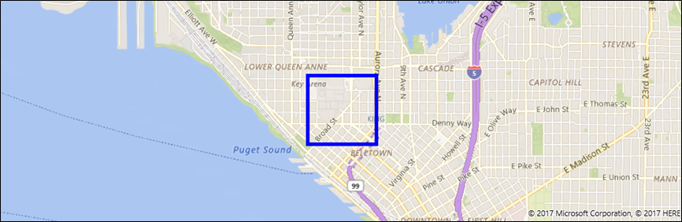

# Display points of interest on a map

> [!IMPORTANT]
> **Bing Maps for Enterprise service retirement**
>
> The UWP [**MapControl**](/uwp/api/Windows.UI.Xaml.Controls.Maps.MapControl) and map services from the [**Windows.Services.Maps**](/uwp/api/Windows.Services.Maps) namespace rely on Bing Maps. Bing Maps for Enterprise is deprecated and will be retired, at which point the MapControl and services will no longer receive data.
>
> For more information, see the [Bing Maps Developer Center](https://www.bingmapsportal.com/) and [Bing Maps documentation](/bingmaps/getting-started/).

> [!NOTE]
> [**MapControl**](/uwp/api/Windows.UI.Xaml.Controls.Maps.MapControl) and map services require a maps authentication key called a [**MapServiceToken**](/uwp/api/windows.ui.xaml.controls.maps.mapcontrol.mapservicetoken). For more info about getting and setting a maps authentication key, see [Request a maps authentication key](authentication-key.md).

Add points of interest (POI) to a map using pushpins, images, shapes, and XAML UI elements. A POI is a specific point on the map that represents something of interest. For example, the location of a business, city, or friend.

Display pushpins, images, and shapes on the map by adding [**MapIcon**](/uwp/api/Windows.UI.Xaml.Controls.Maps.MapIcon), [**MapBillboard**](/uwp/api/windows.ui.xaml.controls.maps.mapbillboard),  [**MapPolygon**](/uwp/api/Windows.UI.Xaml.Controls.Maps.MapPolygon), and [**MapPolyline**](/uwp/api/Windows.UI.Xaml.Controls.Maps.MapPolyline) objects to a [**MapElements**](/uwp/api/windows.ui.xaml.controls.maps.mapcontrol.MapElements) collection of a [**MapElementsLayer**](/uwp/api/windows.ui.xaml.controls.maps.mapelementslayer) object. Then, add that layer object to the **Layers** collection of a map control.

> [!NOTE]
> In previous releases, this guide showed you how to add map elements to the [**MapElements**](/uwp/api/windows.ui.xaml.controls.maps.mapcontrol.MapElements) collection. While you can still use this approach, you'll miss out on some of the advantages of the new map layer model. To learn more, see the [Working with layers](#layers) section of this guide.

You can also display XAML user interface elements such as a [**Button**](/uwp/api/Windows.UI.Xaml.Controls.Button), a [**HyperlinkButton**](/uwp/api/Windows.UI.Xaml.Controls.HyperlinkButton), or a [**TextBlock**](/uwp/api/Windows.UI.Xaml.Controls.TextBlock) on the map by adding them to the [**MapItemsControl**](/uwp/api/Windows.UI.Xaml.Controls.Maps.MapItemsControl) or as [**Children**](/uwp/api/windows.ui.xaml.controls.maps.mapcontrol.children) of the [**MapControl**](/uwp/api/Windows.UI.Xaml.Controls.Maps.MapControl).

If you have a large number of elements to place on the map, consider [overlaying tiled images on the map](overlay-tiled-images.md). To display roads on the map, see [Display routes and directions](routes-and-directions.md)

## Add a pushpin

Display an image such a pushpin, with optional text, on the map by using the [**MapIcon**](/uwp/api/Windows.UI.Xaml.Controls.Maps.MapIcon) class. You can accept the default image or provide a custom image by using the [**Image**](/uwp/api/windows.ui.xaml.controls.maps.mapicon.image) property. The following image displays the default image for a **MapIcon** with no value specified for the [**Title**](/uwp/api/windows.ui.xaml.controls.maps.mapicon.title) property, with a short title, with a long title, and with a very long title.


The following example shows a map of the city of Seattle and adds a [**MapIcon**](/uwp/api/Windows.UI.Xaml.Controls.Maps.MapIcon) with the default image and an optional title to indicate the location of the Space Needle. It also centers the map over the icon and zooms in. For general info about using the map control, see [Display maps with 2D, 3D, and Streetside views](display-maps.md).

```csharp
public void AddSpaceNeedleIcon()
{
    var MyLandmarks = new List<MapElement>();

    BasicGeoposition snPosition = new BasicGeoposition { Latitude = 47.620, Longitude = -122.349 };
    Geopoint snPoint = new Geopoint(snPosition);

    var spaceNeedleIcon = new MapIcon
    {
        Location = snPoint,
        NormalizedAnchorPoint = new Point(0.5, 1.0),
        ZIndex = 0,
        Title = "Space Needle"
    };

    MyLandmarks.Add(spaceNeedleIcon);

    var LandmarksLayer = new MapElementsLayer
    {
        ZIndex = 1,
        MapElements = MyLandmarks
    };

    myMap.Layers.Add(LandmarksLayer);

    myMap.Center = snPoint;
    myMap.ZoomLevel = 14;

}
```

This example displays the following POI on the map (the default image in the center).


The following line of code displays the [**MapIcon**](/uwp/api/Windows.UI.Xaml.Controls.Maps.MapIcon) with a custom image saved in the Assets folder of the project. The [**Image**](/uwp/api/windows.ui.xaml.controls.maps.mapicon.image) property of the **MapIcon** expects a value of type [**RandomAccessStreamReference**](/uwp/api/Windows.Storage.Streams.RandomAccessStreamReference). This type requires a **using** statement for the [**Windows.Storage.Streams**](/uwp/api/Windows.Storage.Streams) namespace.

> [!NOTE]
> If you use the same image for multiple map icons, declare the [**RandomAccessStreamReference**](/uwp/api/Windows.Storage.Streams.RandomAccessStreamReference) at the page or app level for the best performance.

```csharp
    MapIcon1.Image =
        RandomAccessStreamReference.CreateFromUri(new Uri("ms-appx:///Assets/customicon.png"));
```

Keep these considerations in mind when working with the [**MapIcon**](/uwp/api/Windows.UI.Xaml.Controls.Maps.MapIcon) class:

-   The [**Image**](/uwp/api/windows.ui.xaml.controls.maps.mapicon.image) property supports a maximum image size of 2048×2048 pixels.
-   By default, the map icon's image is not guaranteed to be shown. It may be hidden when it obscures other elements or labels on the map. To keep it visible, set the map icon's [**CollisionBehaviorDesired**](/uwp/api/windows.ui.xaml.controls.maps.mapicon.collisionbehaviordesired) property to [**MapElementCollisionBehavior.RemainVisible**](/uwp/api/Windows.UI.Xaml.Controls.Maps.MapElementCollisionBehavior).
-   The optional [**Title**](/uwp/api/windows.ui.xaml.controls.maps.mapicon.title) of the [**MapIcon**](/uwp/api/Windows.UI.Xaml.Controls.Maps.MapIcon) is not guaranteed to be shown. If you don't see the text, zoom out by decreasing the value of the [**ZoomLevel**](/uwp/api/windows.ui.xaml.controls.maps.mapcontrol.zoomlevel) property of the [**MapControl**](/uwp/api/Windows.UI.Xaml.Controls.Maps.MapControl).
-   When you display a [**MapIcon**](/uwp/api/Windows.UI.Xaml.Controls.Maps.MapIcon) image that points to a specific location on the map - for example, a pushpin or an arrow - consider setting the value of the [**NormalizedAnchorPoint**](/uwp/api/windows.ui.xaml.controls.maps.mapicon.normalizedanchorpoint) property to the approximate location of the pointer on the image. If you leave the value of **NormalizedAnchorPoint** at its default value of (0, 0), which represents the upper left corner of the image, changes in the [**ZoomLevel**](/uwp/api/windows.ui.xaml.controls.maps.mapcontrol.zoomlevel) of the map may leave the image pointing to a different location.
-   If you don't explicitly set an [Altitude](/uwp/api/windows.devices.geolocation.basicgeoposition) and [AltitudeReferenceSystem](/uwp/api/windows.devices.geolocation.geopoint.AltitudeReferenceSystem), the [**MapIcon**](/uwp/api/Windows.UI.Xaml.Controls.Maps.MapIcon) will be placed on the surface.

## Add a 3D pushpin

You can add three-dimensional objects to a map. Use the [MapModel3D](/uwp/api/windows.ui.xaml.controls.maps.mapmodel3d) class to import a 3D object from a [3D Manufacturing Format (3MF)](https://3mf.io/spec/) file.

This image uses 3D coffee cups to mark the locations of coffee shops in a neighborhood.


The following code adds a coffee cup to the map by using importing a 3MF file. To keep things simple, this code adds the image to the center of the map, but your code would likely add the image to a specific location.

```csharp
public async void Add3DMapModel()
{
    var mugStreamReference = RandomAccessStreamReference.CreateFromUri
        (new Uri("ms-appx:///Assets/mug.3mf"));

    var myModel = await MapModel3D.CreateFrom3MFAsync(mugStreamReference,
        MapModel3DShadingOption.Smooth);

    myMap.Layers.Add(new MapElementsLayer
    {
       ZIndex = 1,
       MapElements = new List<MapElement>
       {
          new MapElement3D
          {
              Location = myMap.Center,
              Model = myModel,
          },
       },
    });
}
```

## Add an image

Display large images that relate to map locations such as a picture of a restaurant or a landmark. As users zoom out, the image will shrink proportionally in size to enable the user to view more of the map. This is a bit different than a [**MapIcon**](/uwp/api/Windows.UI.Xaml.Controls.Maps.MapIcon) which marks a specific location, is typically small, and remains the same size as users zoom in and out of a map.


The following code shows the [**MapBillboard**](/uwp/api/windows.ui.xaml.controls.maps.mapbillboard) presented in the image above.

```csharp
public void AddLandmarkPhoto()
{
    // Create MapBillboard.

    RandomAccessStreamReference mapBillboardStreamReference =
        RandomAccessStreamReference.CreateFromUri(new Uri("ms-appx:///Assets/billboard.jpg"));

    var mapBillboard = new MapBillboard(myMap.ActualCamera)
    {
        Location = myMap.Center,
        NormalizedAnchorPoint = new Point(0.5, 1.0),
        Image = mapBillboardStreamReference
    };

    // Add MapBillboard to a layer on the map control.

    var MyLandmarkPhotos = new List<MapElement>();

    MyLandmarkPhotos.Add(mapBillboard);

    var LandmarksPhotoLayer = new MapElementsLayer
    {
        ZIndex = 1,
        MapElements = MyLandmarkPhotos
    };

    myMap.Layers.Add(LandmarksPhotoLayer);
}
```

There's three parts of this code worth examining a little closer: The image, the reference camera, and the [**NormalizedAnchorPoint**](/uwp/api/windows.ui.xaml.controls.maps.mapbillboard.NormalizedAnchorPoint) property.

### Image

This example shows a custom image saved in the **Assets** folder of the project. The [**Image**](/uwp/api/windows.ui.xaml.controls.maps.mapbillboard.Image) property of the [**MapBillboard**](/uwp/api/windows.ui.xaml.controls.maps.mapbillboard) expects a value of type [**RandomAccessStreamReference**](/uwp/api/Windows.Storage.Streams.RandomAccessStreamReference). This type requires a **using** statement for the [**Windows.Storage.Streams**](/uwp/api/Windows.Storage.Streams) namespace.

> [!NOTE]
> If you use the same image for multiple map icons, declare the [**RandomAccessStreamReference**](/uwp/api/Windows.Storage.Streams.RandomAccessStreamReference) at the page or app level for the best performance.

### Reference camera

 Because a [**MapBillboard**](/uwp/api/windows.ui.xaml.controls.maps.mapbillboard) image scales in and out as the [**ZoomLevel**](/uwp/api/windows.ui.xaml.controls.maps.mapcontrol.ZoomLevel) of the map changes, it's important to define where in that [**ZoomLevel**](/uwp/api/windows.ui.xaml.controls.maps.mapcontrol.ZoomLevel) the image appears at a normal 1x scale. That position is defined in the reference camera of the [**MapBillboard**](/uwp/api/windows.ui.xaml.controls.maps.mapbillboard), and to set it, you'll have to pass a [**MapCamera**](/uwp/api/windows.ui.xaml.controls.maps.mapcamera) object into the constructor of the [**MapBillboard**](/uwp/api/windows.ui.xaml.controls.maps.mapbillboard).

 You can define the position that you want in a [**Geopoint**](/uwp/api/windows.devices.geolocation.geopoint), and then use that [**Geopoint**](/uwp/api/windows.devices.geolocation.geopoint) to create a [**MapCamera**](/uwp/api/windows.ui.xaml.controls.maps.mapcamera) object.  However, in this example, we're just using the [**MapCamera**](/uwp/api/windows.ui.xaml.controls.maps.mapcamera) object returned by the [**ActualCamera**](/uwp/api/windows.ui.xaml.controls.maps.mapcontrol.ActualCamera) property of the map control. This is the map's internal camera. The current position of that camera becomes the reference camera position; the position where the [**MapBillboard**](/uwp/api/windows.ui.xaml.controls.maps.mapbillboard) image appears at 1x scale.

 If your app gives users the ability to zoom out on the map, the image decreases in size because the maps internal camera is rising in altitude while the image at 1x scale remains fixed at the reference camera's position.

### NormalizedAnchorPoint

The [**NormalizedAnchorPoint**](/uwp/api/windows.ui.xaml.controls.maps.mapbillboard.NormalizedAnchorPoint) is the point of the image that is anchored to the [**Location**](/uwp/api/windows.ui.xaml.controls.maps.mapbillboard.Location) property of the [**MapBillboard**](/uwp/api/windows.ui.xaml.controls.maps.mapbillboard). The point 0.5,1 is the bottom center of the image. Because we've set the [**Location**](/uwp/api/windows.ui.xaml.controls.maps.mapbillboard.Location) property of the [**MapBillboard**](/uwp/api/windows.ui.xaml.controls.maps.mapbillboard) to the center of the map's control, the bottom center of the image will be anchored at the center of the maps control. If you want your image to appear centered directly over a point, set the [**NormalizedAnchorPoint**](/uwp/api/windows.ui.xaml.controls.maps.mapbillboard.NormalizedAnchorPoint) to 0.5,0.5.  

## Add a shape

Display a multi-point shape on the map by using the [**MapPolygon**](/uwp/api/Windows.UI.Xaml.Controls.Maps.MapPolygon) class. The following example, from the [UWP map sample](https://github.com/Microsoft/Windows-universal-samples/tree/master/Samples/MapControl), displays a red box with blue border on the map.

```csharp
public void HighlightArea()
{
    // Create MapPolygon.

    double centerLatitude = myMap.Center.Position.Latitude;
    double centerLongitude = myMap.Center.Position.Longitude;

    var mapPolygon = new MapPolygon
    {
        Path = new Geopath(new List<BasicGeoposition> {
                    new BasicGeoposition() {Latitude=centerLatitude+0.0005, Longitude=centerLongitude-0.001 },
                    new BasicGeoposition() {Latitude=centerLatitude-0.0005, Longitude=centerLongitude-0.001 },
                    new BasicGeoposition() {Latitude=centerLatitude-0.0005, Longitude=centerLongitude+0.001 },
                    new BasicGeoposition() {Latitude=centerLatitude+0.0005, Longitude=centerLongitude+0.001 },
                }),
        ZIndex = 1,
        FillColor = Colors.Red,
        StrokeColor = Colors.Blue,
        StrokeThickness = 3,
        StrokeDashed = false,
    };

    // Add MapPolygon to a layer on the map control.
    var MyHighlights = new List<MapElement>();

    MyHighlights.Add(mapPolygon);

    var HighlightsLayer = new MapElementsLayer
    {
        ZIndex = 1,
        MapElements = MyHighlights
    };

    myMap.Layers.Add(HighlightsLayer);
}
```

## Add a line

Display a line on the map by using the [**MapPolyline**](/uwp/api/Windows.UI.Xaml.Controls.Maps.MapPolyline) class. The following example, from the [UWP map sample](https://github.com/Microsoft/Windows-universal-samples/tree/master/Samples/MapControl), displays a dashed line on the map.

```csharp
public void DrawLineOnMap()
{
    // Create Polyline.

    double centerLatitude = myMap.Center.Position.Latitude;
    double centerLongitude = myMap.Center.Position.Longitude;
    var mapPolyline = new MapPolyline
    {
        Path = new Geopath(new List<BasicGeoposition> {
                    new BasicGeoposition() {Latitude=centerLatitude-0.0005, Longitude=centerLongitude-0.001 },
                    new BasicGeoposition() {Latitude=centerLatitude+0.0005, Longitude=centerLongitude+0.001 },
                }),
        StrokeColor = Colors.Black,
        StrokeThickness = 3,
        StrokeDashed = true,
    };

   // Add Polyline to a layer on the map control.

   var MyLines = new List<MapElement>();

   MyLines.Add(mapPolyline);

   var LinesLayer = new MapElementsLayer
   {
       ZIndex = 1,
       MapElements = MyLines
   };

   myMap.Layers.Add(LinesLayer);

}
```

## Add XAML

Display custom UI elements on the map using XAML. Position XAML on the map by specifying the location and normalized anchor point of the XAML.

-   Set the location on the map where the XAML is placed by calling [**SetLocation**](/windows/desktop/tablet/icontextnode-setlocation).
-   Set the relative location on the XAML that corresponds to the specified location by calling [**SetNormalizedAnchorPoint**](/uwp/api/windows.ui.xaml.controls.maps.mapcontrol.setnormalizedanchorpoint).

The following example shows a map of the city of Seattle and adds a XAML [**Border**](/uwp/api/Windows.UI.Xaml.Controls.Border) control to indicate the location of the Space Needle. It also centers the map over the area and zooms in. For general info about using the map control, see [Display maps with 2D, 3D, and Streetside views](display-maps.md).

```csharp
private void displayXAMLButton_Click(object sender, RoutedEventArgs e)
{
   // Specify a known location.
   BasicGeoposition snPosition = new BasicGeoposition { Latitude = 47.620, Longitude = -122.349 };
   Geopoint snPoint = new Geopoint(snPosition);

   // Create a XAML border.
   Border border = new Border
   {
      Height = 100,
      Width = 100,
      BorderBrush = new SolidColorBrush(Windows.UI.Colors.Blue),
      BorderThickness = new Thickness(5),
   };

   // Center the map over the POI.
   MapControl1.Center = snPoint;
   MapControl1.ZoomLevel = 14;

   // Add XAML to the map.
   MapControl1.Children.Add(border);
   MapControl.SetLocation(border, snPoint);
   MapControl.SetNormalizedAnchorPoint(border, new Point(0.5, 0.5));
}
```

This example displays a blue border on the map.



The next examples show how to add XAML UI elements directly in the XAML markup of the page using data binding. As with other XAML elements that display content, [**Children**](/uwp/api/windows.ui.xaml.controls.maps.mapcontrol.children) is the default content property of the [**MapControl**](/uwp/api/Windows.UI.Xaml.Controls.Maps.MapControl) and does not have to be specified explicitly in XAML markup.

This example shows how to display two XAML controls as implicit children of the [**MapControl**](/uwp/api/Windows.UI.Xaml.Controls.Maps.MapControl). These controls appear on the map at the data bound locations.

```xaml
<maps:MapControl>
    <TextBox Text="Seattle" maps:MapControl.Location="{x:Bind SeattleLocation}"/>
    <TextBox Text="Bellevue" maps:MapControl.Location="{x:Bind BellevueLocation}"/>
</maps:MapControl>
```

Set these locations by using a properties in your code-behind file.

```csharp
public Geopoint SeattleLocation { get; set; }
public Geopoint BellevueLocation { get; set; }
```

This example shows how to display two XAML controls contained within a [**MapItemsControl**](/uwp/api/Windows.UI.Xaml.Controls.Maps.MapItemsControl).These controls appear on the map at the data bound locations.

```xaml
<maps:MapControl>
  <maps:MapItemsControl>
    <TextBox Text="Seattle" maps:MapControl.Location="{x:Bind SeattleLocation}"/>
    <TextBox Text="Bellevue" maps:MapControl.Location="{x:Bind BellevueLocation}"/>
  </maps:MapItemsControl>
</maps:MapControl>
```

This example displays a collection of XAML elements bound to a [**MapItemsControl**](/uwp/api/Windows.UI.Xaml.Controls.Maps.MapItemsControl).

```xaml
<maps:MapControl x:Name="MapControl" MapTapped="MapTapped" MapDoubleTapped="MapTapped" MapHolding="MapTapped">
  <maps:MapItemsControl ItemsSource="{x:Bind LandmarkOverlays}">
      <maps:MapItemsControl.ItemTemplate>
          <DataTemplate>
              <StackPanel Background="Black" Tapped ="Overlay_Tapped">
                  <TextBlock maps:MapControl.Location="{Binding Location}" Text="{Binding Title}"
                    maps:MapControl.NormalizedAnchorPoint="0.5,0.5" FontSize="20" Margin="5"/>
              </StackPanel>
          </DataTemplate>
      </maps:MapItemsControl.ItemTemplate>
  </maps:MapItemsControl>
</maps:MapControl>
```

The ``ItemsSource`` property in the example above is bound to a property of type [IList](/dotnet/api/system.collections.ilist) in the code-behind file.

```csharp
public sealed partial class Scenario1 : Page
{
    public IList LandmarkOverlays { get; set; }

    public MyClassConstructor()
    {
         SetLandMarkLocations();
         this.InitializeComponent();   
    }

    private void SetLandMarkLocations()
    {
        LandmarkOverlays = new List<MapElement>();

        var pikePlaceIcon = new MapIcon
        {
            Location = new Geopoint(new BasicGeoposition
            { Latitude = 47.610, Longitude = -122.342 }),
            Title = "Pike Place Market"
        };

        LandmarkOverlays.Add(pikePlaceIcon);

        var SeattleSpaceNeedleIcon = new MapIcon
        {
            Location = new Geopoint(new BasicGeoposition
            { Latitude = 47.6205, Longitude = -122.3493 }),
            Title = "Seattle Space Needle"
        };

        LandmarkOverlays.Add(SeattleSpaceNeedleIcon);
    }
}
```

<a id="layers"></a>

## Working with layers

The examples in this guide add elements to a [MapElementsLayer](/uwp/api/windows.ui.xaml.controls.maps.mapelementslayer) collection. Then they show how to add that collection to the **Layers** property of the map control. In previous releases, this guide showed you how to add map elements to the [**MapElements**](/uwp/api/windows.ui.xaml.controls.maps.mapcontrol.MapElements) collection as follows:

```csharp
var pikePlaceIcon = new MapIcon
{
    Location = new Geopoint(new BasicGeoposition
    { Latitude = 47.610, Longitude = -122.342 }),
    NormalizedAnchorPoint = new Point(0.5, 1.0),
    ZIndex = 0,
    Title = "Pike Place Market"
};

myMap.MapElements.Add(pikePlaceIcon);
```

While you can still use this approach, you'll miss out on some of the advantages of the new map layer model. By grouping your elements into layers, you can manipulate each layer independently from one another. For example, each layer has it's own set of events so you can respond to an event on a specific layer and perform an action specific to that event.

Also, you can bind XAML directly to a [MapLayer](/uwp/api/windows.ui.xaml.controls.maps.maplayer). This is something that you can't do by using the [MapElements](/uwp/api/windows.ui.xaml.controls.maps.mapcontrol.MapElements)  collection.

One way you could do this is by using a view model class, code-behind a XAML page, and a XAML page.

### View model class

```csharp
public class LandmarksViewModel
{
    public ObservableCollection<MapLayer> LandmarkLayer
        { get; } = new ObservableCollection<MapLayer>();

    public LandmarksViewModel()
    {
        var MyElements = new List<MapElement>();

        var pikePlaceIcon = new MapIcon
        {
            Location = new Geopoint(new BasicGeoposition
            { Latitude = 47.610, Longitude = -122.342 }),
            Title = "Pike Place Market"
        };

        MyElements.Add(pikePlaceIcon);

        var LandmarksLayer = new MapElementsLayer
        {
            ZIndex = 1,
            MapElements = MyElements
        };

        LandmarkLayer.Add(LandmarksLayer);         
    }

```

### Code-behind a XAML page

Connect the view model class to your code behind page.

```csharp
public LandmarksViewModel ViewModel { get; set; }

public myMapPage()
{
    this.InitializeComponent();
    this.ViewModel = new LandmarksViewModel();
}
```

### XAML page

In your XAML page, bind to the property in your view model class that returns the layer.

```xaml
<maps:MapControl
    x:Name="myMap" TransitFeaturesVisible="False" Loaded="MyMap_Loaded" Grid.Row="2"
    MapServiceToken="Your token" Layers="{x:Bind ViewModel.LandmarkLayer}"/>
```

## Related topics

* [Bing Maps Developer Center](https://www.bingmapsportal.com/)
* [UWP map sample](https://github.com/Microsoft/Windows-universal-samples/tree/master/Samples/MapControl)
* [Design guidelines for maps](./display-maps.md)
* [Build 2015 video: Leveraging Maps and Location Across Phone, Tablet, and PC in Your Windows Apps](https://channel9.msdn.com/Events/Build/2015/2-757)
* [UWP traffic app sample](https://github.com/Microsoft/Windows-appsample-trafficapp)
* [**MapIcon**](/uwp/api/Windows.UI.Xaml.Controls.Maps.MapIcon)
* [**MapPolygon**](/uwp/api/Windows.UI.Xaml.Controls.Maps.MapPolygon)
* [**MapPolyline**](/uwp/api/Windows.UI.Xaml.Controls.Maps.MapPolyline)
