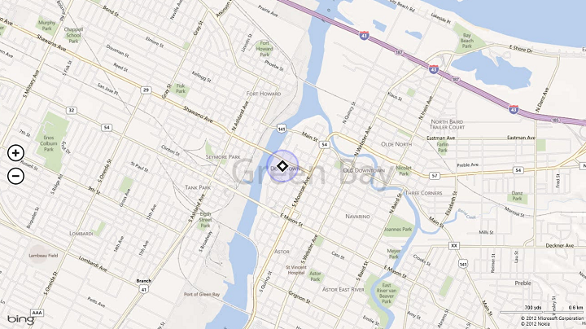
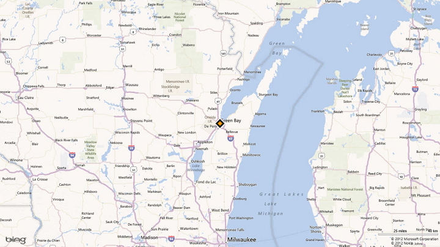

# Guidelines for location-aware apps

**Important APIs**

-   [**Geolocation**](/uwp/api/Windows.Devices.Geolocation)
-   [**Geolocator**](/uwp/api/Windows.Devices.Geolocation.Geolocator)

This topic describes performance guidelines for apps that require access to a user's location.

## Recommendations

-   Start using the location object only when the app requires location data.

    Call the [**RequestAccessAsync**](/uwp/api/windows.devices.geolocation.geolocator.requestaccessasync) before accessing the user’s location. At that time, your app must be in the foreground and **RequestAccessAsync** must be called from the UI thread. Until the user grants your app permission to their location, your app can't access location data.

-   If location isn't essential to your app, don't access it until the user tries to complete a task that requires it. For example, if a social networking app has a button for "Check in with my location," the app shouldn't access location until the user clicks the button. It's okay to immediately access location if it is required for your app's main function.

-   The first use of the [**Geolocator**](/uwp/api/Windows.Devices.Geolocation.Geolocator) object must be made on the main UI thread of the foreground app, to trigger the consent prompt to the user. The first use of the **Geolocator** can be either the first call to [**getGeopositionAsync**](/uwp/api/windows.devices.geolocation.geolocator.getgeopositionasync) or the first registration of a handler for the [**positionChanged**](/uwp/api/windows.devices.geolocation.geolocator.positionchanged) event.

-   Tell the user how location data will be used.
-   Provide UI to enable users to manually refresh their location.
-   Display a progress bar or ring while waiting to get location data. <!--For info on the available progress controls and how to use them, see [**Guidelines for progress controls**](guidelines-and-checklist-for-progress-controls.md).-->
-   Show appropriate error messages or dialogs when location services are disabled or not available.

    If the location settings don't allow your app to access the user's location, we recommend providing a convenient link to the **location privacy settings** in the **Settings** app. For example, you could use a Hyperlink control or call the [**LaunchUriAsync**](/uwp/api/windows.system.launcher.launchuriasync) method to launch the **Settings** app from code using the `ms-settings:privacy-location` URI. For more info, see [Launch the Windows Settings app](../launch-resume/launch-settings-app.md).

-   Clear cached location data and release the [**Geolocator**](/uwp/api/Windows.Devices.Geolocation.Geolocator) when the user disables access to location info.

    Release the [**Geolocator**](/uwp/api/Windows.Devices.Geolocation.Geolocator) object if the user turns off access to location info through Settings. The app will then receive **ACCESS\_DENIED** results for any location API calls. If your app saves or caches location data, clear any cached data when the user revokes access to location info. Provide an alternate way to manually enter location info when location data is not available via location services.

-   Provide UI for reenabling location services. For example, provide a refresh button that reinstantiates the [**Geolocator**](/uwp/api/Windows.Devices.Geolocation.Geolocator) object and tries to get location info again.

    Have your app provide UI for reenabling location services—

    -   If the user reenables location access after disabling it, there is no notification to the app. The [**status**](/uwp/api/windows.devices.geolocation.statuschangedeventargs.status) property does not change and there is no [**statusChanged**](/uwp/api/windows.devices.geolocation.geolocator.statuschanged) event. Your app should create a new [**Geolocator**](/uwp/api/Windows.Devices.Geolocation.Geolocator) object and call [**getGeopositionAsync**](/uwp/api/windows.devices.geolocation.geolocator.getgeopositionasync) to try to get updated location data, or subscribe again to [**positionChanged**](/uwp/api/windows.devices.geolocation.geolocator.positionchanged) events. If the status then indicates that location has been reenabled, clear any UI by which your app previously notified the user that location services were disabled, and respond appropriately to the new status.
    -   Your app should also try again to get location data upon activation, or when the user explicitly tries to use functionality that requires location info, or at any other scenario-appropriate time.

**Performance**

-   Use one-time location requests if your app doesn't need to receive location updates. For example, an app that adds a location tag to a photo doesn't need to receive location update events. Instead, it should request location using [**getGeopositionAsync**](/uwp/api/windows.devices.geolocation.geolocator.getgeopositionasync), as described in [Get current location](./get-location.md).

    When you make a one-time location request, you should set the following values.

    -   Specify the accuracy requested by your app by setting the [**DesiredAccuracy**](/uwp/api/windows.devices.geolocation.geolocator.desiredaccuracy) or the [**DesiredAccuracyInMeters**](/uwp/api/windows.devices.geolocation.geolocator.desiredaccuracyinmeters). See below for recommendations on using these parameters
    -   Set the max age parameter of [**GetGeopositionAsync**](/uwp/api/windows.devices.geolocation.geolocator.getgeopositionasync) to specify how long ago a location can have been obtained to be useful for your app. If your app can use a position that is a few seconds or minutes old, your app can receive a position almost immediately and contribute to saving device power.
    -   Set the timeout parameter of [**GetGeopositionAsync**](/uwp/api/windows.devices.geolocation.geolocator.getgeopositionasync). This is how long your app can wait for a position or an error to be returned. You will need to figure out the trade-offs between responsiveness to the user and accuracy your app needs.
-   Use continuous location session when frequent position updates are required. Use [**positionChanged**](/uwp/api/windows.devices.geolocation.geolocator.positionchanged) and [**statusChanged**](/uwp/api/windows.devices.geolocation.geolocator.statuschanged) events for detecting movement past a specific threshold or for continuous location updates as they occur.

    When requesting location updates, you may want to specify the accuracy requested by your app by setting the [**DesiredAccuracy**](/uwp/api/windows.devices.geolocation.geolocator.desiredaccuracy) or the [**DesiredAccuracyInMeters**](/uwp/api/windows.devices.geolocation.geolocator.desiredaccuracyinmeters). You should also set the frequency at which the location updates are needed, by using the [**MovementThreshold**](/uwp/api/windows.devices.geolocation.geolocator.movementthreshold) or the [**ReportInterval**](/uwp/api/windows.devices.geolocation.geolocator.reportinterval).

    -   Specify the movement threshold. Some apps need location updates only when the user has moved a large distance. For example, an app that provides local news or weather updates may not need location updates unless the user's location has changed to a different city. In this case, you adjust the minimum required movement for a location update event by setting the [**MovementThreshold**](/uwp/api/windows.devices.geolocation.geolocator.movementthreshold) property. This has the effect of filtering out [**PositionChanged**](/uwp/api/windows.devices.geolocation.geolocator.positionchanged) events. These events are raised only when the change in position exceeds the movement threshold.

    -   Use [**reportInterval**](/uwp/api/windows.devices.geolocation.geolocator.reportinterval) that aligns with your app experience and that minimizes the use of system resources. For example, a weather app may require a data update only every 15 minutes. Most apps, other than real-time navigation apps, don't require a highly accurate, constant stream of location updates. If your app doesn't require the most accurate stream of data possible, or requires updates infrequently, set the **ReportInterval** property to indicate the minimum frequency of location updates that your app needs. The location source can then conserve power by calculating location only when needed.

        Apps that do require real-time data should set [**ReportInterval**](/uwp/api/windows.devices.geolocation.geolocator.reportinterval) to 0, to indicate that no minimum interval is specified. The default report interval is 1 second or as frequent as the hardware can support – whichever is shorter.

        Devices that provide location data may track the report interval requested by different apps, and provide data reports at the smallest requested interval. The app with the greatest need for accuracy thus receives the data it needs. Therefore, it's possible that the location provider will generate updates at a higher frequency than your app requested, if another app has requested more frequent updates.

        **Note**  It isn't guaranteed that the location source will honor the request for the given report interval. Not all location provider devices track the report interval, but you should still provide it for those that do.

    -   To help conserve power, set the [**desiredAccuracy**](/uwp/api/windows.devices.geolocation.geolocator.desiredaccuracy) property to indicate to the location platform whether your app needs high-accuracy data. If no apps require high-accuracy data, the system can save power by not turning on GPS providers.

        -   Set [**desiredAccuracy**](/uwp/api/windows.devices.geolocation.geolocator.desiredaccuracy) to **HIGH** to enable the GPS to acquire data.
        -   Set [**desiredAccuracy**](/uwp/api/windows.devices.geolocation.geolocator.desiredaccuracy) to **Default** and use only a single-shot call pattern to minimize power consumption if your app uses location info solely for ad targeting.

        If your app has specific needs around accuracy, you may want to use the [**DesiredAccuracyInMeters**](/uwp/api/windows.devices.geolocation.geolocator.desiredaccuracyinmeters) property instead of using [**DesiredAccuracy**](/uwp/api/windows.devices.geolocation.geolocator.desiredaccuracy). This is particularly useful on Windows Phone, where position can usually be obtained based on cellular beacons, Wi-Fi beacons and satellites. Picking a more specific accuracy value will help the system identify the right technologies to use with the lowest power cost when providing a position.

        For example:

        -   If your app is obtaining location for ads tuning, weather, news, etc, an accuracy of 5000 meter is generally enough.
        -   If your app is displaying nearby deals in the neighborhood, an accuracy of 300 meter is generally good to provide results.
        -   If the user is looking for recommendations to nearby restaurants, we likely want to get a position within a block, so an accuracy of 100 meters is sufficient.
        -   If the user is trying to share his position, the app should request an accuracy of about 10 meters.
    -   Use the [**Geocoordinate.accuracy**](/uwp/api/windows.devices.geolocation.geocoordinate.accuracy) property if your app has specific accuracy requirements. For example, navigation apps should use the **Geocoordinate.accuracy** property to determine whether the available location data meets the app's requirements.

-   Consider start-up delay. The first time an app requests location data, there might be a short delay (1-2 seconds) while the location provider starts up. Consider this in the design of your app's UI. For instance, you may want to avoid blocking other tasks pending the completion of the call to [**GetGeopositionAsync**](/uwp/api/windows.devices.geolocation.geolocator.getgeopositionasync).

-   Consider background behavior. If your app doesn't have focus, it won't receive location update events while it's suspended in the background. If your app tracks location updates by logging them, be aware of this. When the app regains focus, it receives only new events. It does not get any updates that occurred when it was inactive.

-   Use raw and fusion sensors efficiently. There are two types of sensors: *raw* and *fusion*.

    -   Raw sensors include the accelerometer, gyrometer, and magnetometer.
    -   Fusion sensors include orientation, inclinometer, and compass. Fusion sensors get their data from combinations of the raw sensors.

    The Windows Runtime APIs can access all of these sensors except for the magnetometer. Fusion sensors are more accurate and stable than raw sensors, but they use more power. You should use the right sensors for the right purpose. For more info, see [Sensors](../devices-sensors/sensors.md).

**Connected standby**
- When the PC is in connected standby state, [**Geolocator**](/uwp/api/Windows.Devices.Geolocation.Geolocator) objects can always be instantiated. However, the **Geolocator** object will not find any sensors to aggregate and therefore calls to [**GetGeopositionAsync**](/uwp/api/windows.devices.geolocation.geolocator.getgeopositionasync) will time out after 7 seconds, [**PositionChanged**](/uwp/api/windows.devices.geolocation.geolocator.positionchanged) event listeners will never be called, and [**StatusChanged**](/uwp/api/windows.devices.geolocation.geolocator.statuschanged) event listeners will be called once with the **NoData** status.

## Additional usage guidance

### Detecting changes in location settings

The user can turn off location functionality by using the **location privacy settings** in the **Settings** app.

-   To detect when the user disables or reenables location services:
    -   Handle the [**StatusChanged**](/uwp/api/windows.devices.geolocation.geolocator.statuschanged) event. The [**Status**](/uwp/api/windows.devices.geolocation.statuschangedeventargs.status) property of the argument to the **StatusChanged** event has the value **Disabled** if the user turns off location services.
    -   Check the error codes returned from [**GetGeopositionAsync**](/uwp/api/windows.devices.geolocation.geolocator.getgeopositionasync). If the user has disabled location services, calls to **GetGeopositionAsync** fail with an **ACCESS\_DENIED** error and the [**LocationStatus**](/uwp/api/windows.devices.geolocation.geolocator.locationstatus) property has the value **Disabled**.
-   If you have an app for which location data is essential—for example, a mapping app—, be sure to do the following:
    -   Handle the [**PositionChanged**](/uwp/api/windows.devices.geolocation.geolocator.positionchanged) event to get updates if the user’s location changes.
    -   Handle the [**StatusChanged**](/uwp/api/windows.devices.geolocation.geolocator.statuschanged) event as described previously, to detect changes in location settings.

Note that the location service will return data as it becomes available. It may first return a location with a larger error radius and then update the location with more accurate information as it becomes available. Apps displaying the user's location would normally want to update the location as more accurate information becomes available.

### Graphical representations of location

Have your app use [**Geocoordinate.accuracy**](/uwp/api/windows.devices.geolocation.geocoordinate.accuracy) to denote the user’s current location on the map clearly. There are three main bands for accuracy—an error radius of approximately 10 meters, an error radius of approximately 100 meters, and an error radius of greater than 1 kilometer. By using the accuracy information, you can ensure that your app displays location accurately in the context of the data available. For general information about using the map control, see [Display maps with 2D, 3D, and Streetside views](./display-maps.md).

-   For accuracy approximately equal to 10 meters (GPS resolution), location can be denoted by a dot or pin on the map. With this accuracy, latitude-longitude coordinates and street address can be shown as well.

    

-   For accuracy between 10 and 500 meters (approximately 100 meters), location is generally received through Wi-Fi resolution. Location obtained from cellular has an accuracy of around 300 meters. In such a case, we recommend that your app show an error radius. For apps that show directions where a centering dot is required, such a dot can be shown with an error radius surrounding it.

    

-   If the accuracy returned is greater than 1 kilometer, you are probably receiving location info at IP-level resolution. This level of accuracy is often too low to pinpoint a particular spot on a map. Your app should zoom in to the city level on the map, or to the appropriate area based on the error radius (for example, region level).

    

When location accuracy switches from one band of accuracy to another, provide a graceful transition between the different graphical representations. This can be done by:

-   Making the transition animation smooth and keeping the transition fast and fluid.
-   Waiting for a few consecutive reports to confirm the change in accuracy, to help prevent unwanted and too-frequent zooms.

### Textual representations of location

Some types of apps—for example, a weather app or a local information app—need ways to represent location textually at the different bands of accuracy. Be sure to display the location clearly and only down to the level of accuracy provided in the data.

-   For accuracy approximately equal to 10 meters (GPS resolution), the location data received is fairly accurate and so can be communicated to the level of the neighborhood name. City name, state or province name, and country/region name can also be used.
-   For accuracy approximately equal to 100 meters (Wi-Fi resolution), the location data received is moderately accurate and so we recommend that you display information down to the city name. Avoid using the neighborhood name.
-   For accuracy greater than 1 kilometer (IP resolution), display only the state or province, or country/region name.

### Privacy considerations

A user's geographic location is personally identifiable information (PII). The following website provides guidance for protecting user privacy.

-   [Microsoft Privacy]( https://privacy.microsoft.com/privacystatement)

<!--For more info, see [Guidelines for privacy-aware apps](guidelines-for-enabling-sensitive-devices.md).-->

## Related topics

* [Set up a geofence](./set-up-a-geofence.md)
* [Get current location](./get-location.md)
* [Display maps with 2D, 3D, and Streetside views](./display-maps.md)
<!--* [Design guidelines for privacy-aware apps](guidelines-for-enabling-sensitive-devices.md)-->
* [UWP location sample (geolocation)](https://github.com/Microsoft/Windows-universal-samples/tree/master/Samples/Geolocation)
 

 
