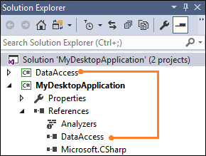
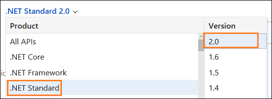
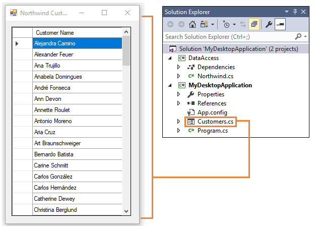
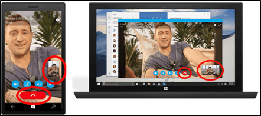
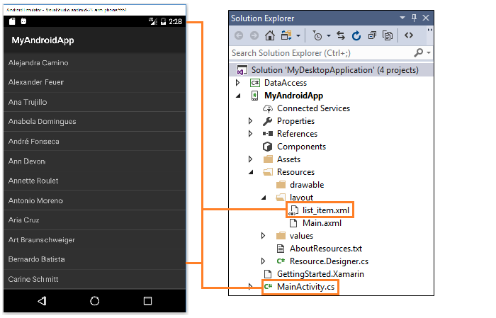

# Move from a desktop application to UWP

If you have an existing desktop application that was built using the .NET Framework (including WPF and Windows Forms) or C++ Win32 APIs, you have several options for moving to the Universal Windows Platform (UWP) and Windows 10/11.

## Package your desktop application in an MSIX package

You can package your desktop application in an MSIX package to get access to many more Windows 10 and Windows 11 features. MSIX is a modern Windows app package format that provides a universal packaging experience for all Windows apps, including UWP, WPF, Windows Forms and Win32 apps. Packaging your desktop Windows apps in MSIX packages gets you access to a robust installation and updating experience, a managed security model with a flexible capability system, support for the Microsoft Store, enterprise management, and many custom distribution models. You can package your application whether you have the source code or if you only have an existing installer file (such as an MSI or App-V installer). After you package your application, you can integrate UWP features such as package extensions and other UWP components.

For more information, see [Building an MSIX package from your code](/windows/msix/desktop/source-code-overview) and [Features that require package identity](/windows/apps/desktop/modernize/modernize-packaged-apps).

## Use Windows Runtime APIs

You can call many Windows Runtime APIs directly in your WPF, Windows Forms, or C++ Win32 desktop app to integrate modern experiences that light up for Windows 10 users. For example, you can call Windows Runtime APIs to add toast notifications to your desktop app.

For more information, see [Use Windows Runtime APIs in desktop apps](/windows/apps/desktop/modernize/desktop-to-uwp-enhance).

## Migrate a .NET Framework app to a UWP app

If your application runs on the .NET Framework, you can migrate it to a UWP app by leveraging .NET Standard 2.0. Move as much code as you can into .NET Standard 2.0 class libraries, and then create a UWP app that references your .NET Standard 2.0 libraries. 

### Share code in a .NET Standard 2.0 library

If your application runs on the .NET Framework, place as much code as you can into .NET Standard 2.0 class libraries. As long as your code uses APIs that are defined in the standard, you can reuse it in a UWP app. It's easier than it's ever been to share code in a .NET Standard library because so many more APIs are included in the .NET Standard 2.0.

Here's a video that tells you more about it.

> [!VIDEO https://www.youtube-nocookie.com/embed/YI4MurjfMn8?list=PLRAdsfhKI4OWx321A_pr-7HhRNk7wOLLY&amp;ecver=1]

#### Add .NET Standard libraries

First, add one or more .NET Standard class libraries to your solution.  


The number of libraries that you add to your solution depends on how you plan to organize your code.

Make sure that each class library targets the **.NET Standard 2.0**.


You can find this setting in the property pages of the class library project.

From your desktop application project, add a reference to the class library project.



Next, use tools to determine how much of your code conforms to the standard. That way, before you move code into the library, you can decide which parts you can reuse, which parts require minimal modification, and which parts will remain application-specific.

#### Check library and code compatibility

We'll start with Nuget Packages and other dll files that you obtained from a third party.

If your application uses any of them, determine if they are compatible with the .NET Standard 2.0. You can use a Visual Studio extension or a command-line utility to do that.

Use these same tools to analyze your code. Download the tools here ([dotnet-apiport](https://github.com/Microsoft/dotnet-apiport/releases)) and then watch this video to learn how to use them.
&nbsp;
> [!VIDEO https://www.youtube-nocookie.com/embed/rzs_FGPyAlY?list=PLRAdsfhKI4OWx321A_pr-7HhRNk7wOLLY&amp;ecver=2]

If your code isn't compatible with the standard, consider other ways that you could implement that code. Start by opening the [.NET API Browser](/dotnet/api/?view=netstandard-2.0&preserve-view=true). You can use that browser to review the API's that are available in the .NET Standard 2.0. Make sure to scope the list to the .NET Standard 2.0.



Some of your code will be platform-specific and will need to remain in your desktop application project.

#### Example: Migrating data access code to a .NET Standard 2.0 library

Let's assume that we have a very basic Windows Forms application that shows customers from our Northwind sample database.



The project contains a .NET Standard 2.0 class library with a static class named **Northwind**. If we move this code into the **Northwind** class, it won't compile because it uses the ``SQLConnection``, ``SqlCommand``, and ``SqlDataReader`` classes, and those classes that are not available in the .NET Standard 2.0.

```csharp
public static ArrayList GetCustomerNames()
{
    ArrayList customers = new ArrayList();

    using (SqlConnection conn = new SqlConnection())
    {
        conn.ConnectionString = ...; // Your connection string goes here.

        conn.Open();

        SqlCommand command = new SqlCommand("select ContactName from customers order by ContactName asc", conn);

        using (SqlDataReader reader = command.ExecuteReader())
        {
            while (reader.Read())
            {
                customers.Add(reader[0]);
            }
        }
    }

    return customers;
}

```
We can use the [.NET API Browser](/dotnet/api/?view=netstandard-2.0&preserve-view=true) to find an alternative though. The ``DbConnection``, ``DbCommand``, and ``DbDataReader`` classes are all available in the .NET Standard 2.0 so we can use them instead.  

This revised version uses those classes to get a list of customers, but to create a ``DbConnection`` class, we'll need to pass in a factory object that we create in the client application.

```csharp
public static ArrayList GetCustomerNames(DbProviderFactory factory)
{
    ArrayList customers = new ArrayList();

    using (DbConnection conn = factory.CreateConnection())
    {
        conn.ConnectionString = ...; // Your connection string goes here.

        conn.Open();

        DbCommand command = factory.CreateCommand();
        command.Connection = conn;
        command.CommandText = "select ContactName from customers order by ContactName asc";

        using (DbDataReader reader = command.ExecuteReader())
        {
            while (reader.Read())
            {
                customers.Add(reader[0]);
            }
        }
    }

    return customers;
}
```  

In the code-behind page of the Windows Form, we can just create factory instance and pass it into our method.

```csharp
public partial class Customers : Form
{
    public Customers()
    {
        InitializeComponent();

        dataGridView1.Rows.Clear();

        SqlClientFactory factory = SqlClientFactory.Instance;

        foreach (string customer in Northwind.GetCustomerNames(factory))
        {
            dataGridView1.Rows.Add(customer);
        }
    }
}
```

### Create a UWP app

Now you're ready to add a UWP app to your solution.



You'll still have to design UI pages in XAML and write any device or platform-specific code, but when you are done, you'll be able to reach the full breadth of Windows 10 and Windows 11 devices and your app pages will have a modern feel that adapts well to different screen sizes and resolutions.

Your app will respond to input mechanisms other than just a keyboard and mouse, and features and settings will be intuitive across devices. This means that users learn how to do things one time, and then it works in a very familiar way no matter the device.

These are just a few of the goodies that come with UWP. To learn more, see [Build great experiences with Windows](https://developer.microsoft.com/windows/why-build-for-uwp).

#### Add a UWP project

First, add a UWP project to your solution.


Then, from your UWP project, add a reference the .NET Standard 2.0 library project.


#### Build your pages

Add XAML pages and call the code in your .NET Standard 2.0 library.


```xml
<Grid Background="{ThemeResource ApplicationPageBackgroundThemeBrush}">
    <StackPanel x:Name="customerStackPanel">
        <ListView x:Name="customerList"/>
    </StackPanel>
</Grid>
```

```csharp
public sealed partial class MainPage : Page
{
    public MainPage()
    {
        this.InitializeComponent();

        SqlClientFactory factory = SqlClientFactory.Instance;

        customerList.ItemsSource = Northwind.GetCustomerNames(factory);
    }
}
```

To get started with UWP, see [What's a UWP app](../get-started/universal-application-platform-guide.md).

### Reach iOS and Android devices

You can reach Android and iOS devices by adding Xamarin projects.

> [!NOTE]
>For new cross-platform projects, please consider using .NET MAUI.


These projects let you use C# to build Android and iOS apps with full access to platform-specific and device-specific APIs. These apps leverage platform-specific hardware acceleration, and are compiled for native performance.

They have access to the full spectrum of functionality exposed by the underlying platform and device, including platform-specific capabilities like iBeacons and Android Fragments and you'll use standard native user interface controls to build UIs that look and feel the way that users expect them to.

Just like UWPs, the cost to add an Android or iOS app is lower because you can reuse business logic in a .NET Standard 2.0 class library. You'll have to design your UI pages in XAML and write any device or platform-specific code.

#### Add a Xamarin project

First, add an **Android**, **iOS**, or **Cross-Platform** project to your solution.

You can find these templates in the **Add New Project** dialog box under the **Visual C#** group.


>[!NOTE]
>Cross-platform projects are great for apps with little platform-specific functionality. You can use them to build one native XAML-based UI that runs on iOS, Android, and Windows. Learn more [here](/xamarin/xamarin-forms/).

Then, from your Android, iOS, or cross-platform project, add a reference the class library project.


#### Build your pages

Our example shows a list of customers in an Android app.



```xml
<?xml version="1.0" encoding="utf-8"?>
<TextView xmlns:android="http://schemas.android.com/apk/res/android"
    android:layout_width="fill_parent"
    android:layout_height="fill_parent"
    android:padding="10dp" android:textSize="16sp"
    android:id="@android:id/list">
</TextView>
```

```csharp
[Activity(Label = "MyAndroidApp", MainLauncher = true)]
public class MainActivity : ListActivity
{
    protected override void OnCreate(Bundle savedInstanceState)
    {
        base.OnCreate(savedInstanceState);

        SqlClientFactory factory = SqlClientFactory.Instance;

        var customers = (string[])Northwind.GetCustomerNames(factory).ToArray(typeof(string));

        ListAdapter = new ArrayAdapter<string>(this, Resource.Layout.list_item, customers);
    }
}
```

To get started with Android, iOS, and cross-platform projects, see the [Xamarin developer portal](/xamarin).

## Next steps

**Find answers to your questions**

Have questions? Ask us on Stack Overflow. Our team monitors these [tags](https://stackoverflow.com/questions/tagged/project-centennial+or+desktop-bridge). You can also ask us [here](https://social.msdn.microsoft.com/Forums/en-US/home?filter=alltypes&sort=relevancedesc&searchTerm=%5BDesktop%20Converter%5D).
