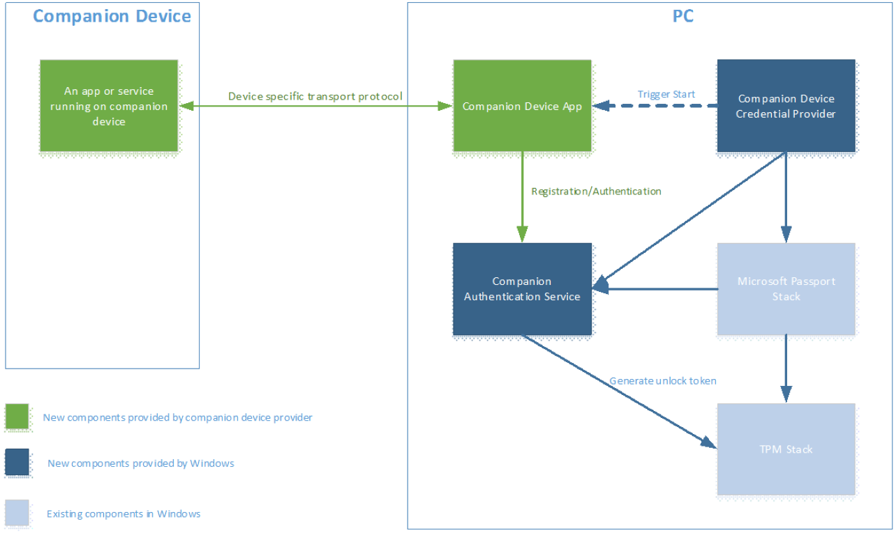
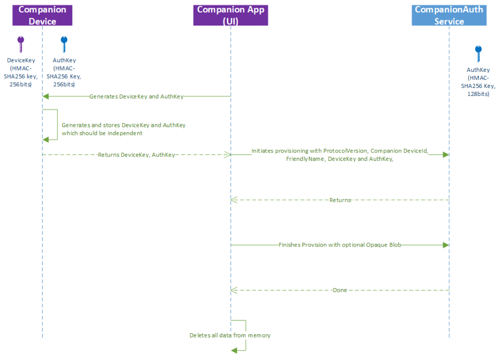
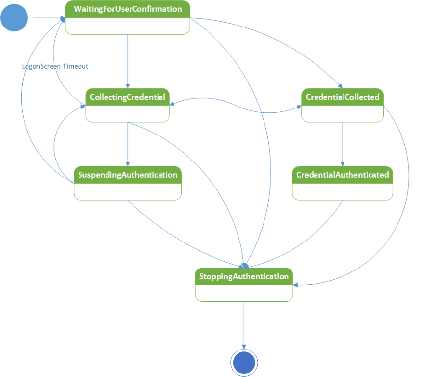
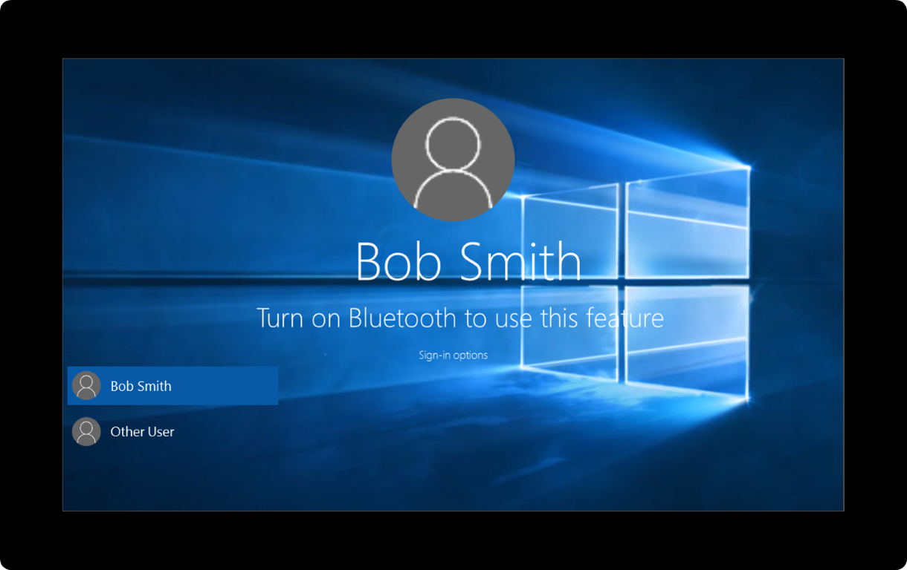

# Windows Unlock with Windows Hello companion (IoT) devices

A Windows Hello companion device is a device that can act in conjunction with your Windows 10 desktop to enhance the user authentication experience. Using the Windows Hello companion device framework, a companion device can provide a rich experience for Windows Hello even when biometrics are not available (for example, if the Windows 10 desktop lacks a camera for face authentication or fingerprint reader device, for example).

> [!NOTE]
> The API for the Windows Hello companion device framework is deprecated in Windows 10, version 2004.

## Introduction

> For code samples, see the [Windows Hello companion device framework Github repository](https://github.com/Microsoft/companion-device-framework).

### Use cases

There are numerous ways one can use the Windows Hello companion device framework to build a great Windows unlock experience with a companion device. For example, users could:

- Attach their companion device to PC via USB, touch the button on the companion device, and automatically unlock their PC.
- Carry a phone in their pocket that is already paired with PC over Bluetooth. Upon hitting the spacebar on their PC, their phone receives a notification. Approve it and the PC simply unlocks.
- Tap their companion device to an NFC reader to quickly unlock their PC.
- Wear a fitness band that has already authenticated the wearer. Upon approaching PC, and by performing a special gesture (like clapping), the PC unlocks.

### Biometric enabled Windows Hello companion devices

If the companion device supports biometrics, in some cases the [Windows Biometric framework](/windows-hardware/design/device-experiences/windows-hello) may be a better solution than the Windows Hello companion device framework.

### Components of the solution

The diagram below depicts the components of the solution and who is responsible for building them.



The Windows Hello companion device framework is implemented as a service running on Windows (called the Companion Authentication Service in this article). This service is responsible for generating an unlock token which needs to be protected by an HMAC key stored on the Windows Hello companion device. This guarantees that access to the unlock token requires Windows Hello companion device presence. Per each (PC, Windows user) tuple, there will be a unique unlock token.

Integration with the Windows Hello Companion Device Framework requires:

- A [Universal Windows Platform (UWP)](../get-started/universal-application-platform-guide.md) Windows Hello companion device app for the companion device, downloaded from the Windows app store. 
- The ability to create two 256 bit HMAC keys on the Windows Hello companion device and generate HMAC with it (using SHA-256).
- Security settings on the Windows 10 desktop properly configured. The Companion Authentication Service will require this PIN to be set up before any Windows Hello companion device can be plugged into it. The users must set up a PIN via Settings > Accounts > Sign-in options.

In addition to the above requirements, the Windows Hello companion device app is responsible for:

- User experience and branding of initial registration and later de-registration of the Windows Hello companion device.
- Running in the background, discovering the Windows Hello companion device, communicating to the Windows Hello companion device and also Companion Authentication Service.
- Error handling

Normally, companion devices ship with an app for initial setup, like setting up a fitness band for the first time. The functionality described in this document can be part of that app and a separate app should not be required.  

### User signals

Each Windows Hello companion device should be combined with an app that supports three user signals. These signals can be in form of an action or gesture.

- **Intent signal**: Allows the user to show his intent for unlock by, for example, hitting a button on the Windows Hello companion device. The intent signal must be collected on **Windows Hello companion device** side.
- **User presence signal**: Proves the presence of the user. The Windows Hello companion device might, for instance, require a PIN before it can be used for unlocking PC (not to be confused with PC PIN), or it might require press of a button.
- **Disambiguation signal**: Disambiguates which Windows 10 desktop the user wants to unlock when multiple options are available to the Windows Hello companion device.

Any number of these user signals can be combined into one. User presence and intent signals must be required on each use.

### Registration and future communication between a PC and Windows Hello companion devices

Before a Windows Hello companion device can be plugged into the Windows Hello companion device framework, it needs to be registered with the framework. The experience for registration is completely owned by the Windows Hello companion device app.

The relationship between the Windows Hello companion device and the Windows 10 desktop  device can be one to many (i.e., one companion device can be used for many Windows 10 desktop  devices). However, each Windows Hello companion device can only be used for one user on each Windows 10 desktop  device.   

Before a Windows Hello companion device can communicate with a PC, they need to agree on a transport to use. Such choice is left to the Windows Hello companion device app; the Windows Hello companion device framework does not impose any limitations on transport type (USB, NFC, WiFi, BT, BLE, etc) or protocol being used between the Windows Hello companion device and the Windows Hello companion device app on the Windows 10 desktop device side. It does, however, suggest certain security considerations for the transport layer as outlined in the "Security Requirements" section of this document. It is the device provider’s responsibility to provide those requirements. The framework does not provide them for you.


## User Interaction Model

### Windows Hello companion device app discovery, installation, and first-time registration

A typical user workflow is as follows:

- The user sets up the PIN on each of target Windows 10 desktop devices she wants to unlock with that Windows Hello companion device.
- The user runs the Windows Hello companion device app on their Windows 10 desktop device to register her Windows Hello companion device with Windows 10 desktop.

Notes:

- We recommend the discovery, download, and launch of the Windows Hello companion device app is streamlined and, if possible, automated (for example, the app can be downloaded upon tapping the Windows Hello companion device on an NFC reader on Windows 10 desktop device side). This is, however, the responsibility of the Windows Hello companion device and Windows Hello companion device app.
- In an enterprise environment, the Windows Hello companion device app can be deployed via MDM.
- The Windows Hello companion device app is responsible for showing the user any error messages that happen as part of registration.

### Registration and de-registration protocol

The following diagram illustrates how the Windows Hello companion device interacts with Companion Authentication Service during registration.  



There are two keys used in our protocol:

- Device key (**devicekey**): used to protect unlock tokens that the PC needs to unlock Windows.
- The authentication key (**authkey**): used to mutually authenticate the Windows Hello companion device and Companion Authentication Service.

The device key and authentication keys are exchanged at registration time between the Windows Hello companion device app and Windows Hello companion device. As a result, the Windows Hello companion device app and Windows Hello companion device must use a secure transport to protect keys.

Also, note that while the diagram above displays two HMAC keys generating on the Windows Hello companion device, it is also possible for the app to generate them and send them to the Windows Hello companion device for storage.

### Starting authentication flows

There are two ways for the user to start the signing in flow to Windows 10 desktop using Windows Hello companion device framework (i.e., provide intent signal):

- Open up the lid on laptop, or hit the space bar or swipe up on PC.
- Perform a gesture or an action on the Windows Hello companion device side.

It is the Windows Hello companion device's choice to select which one is the starting point. The Windows Hello companion device framework will inform companion device app when option one happens. For option two, the Windows Hello companion device app should query the companion device to see if that event has been captured. This ensures the Windows Hello companion device collects the intent signal before the unlock succeeds.

### Windows Hello companion device credential provider

There is a new credential provider in Windows 10 that handles all Windows Hello companion devices.

The Windows Hello companion device credential provider is responsible for launching the companion device background task via activating a trigger. The trigger is set the first time when the PC awakens and a lock screen is displayed. The second time is when the PC is entering logon UI and the Windows Hello companion device credential provider is the selected tile.

The helper library for the Windows Hello companion device app will listen to the lock screen status change and send the event corresponding to the Windows Hello companion device background task.

If there are multiple Windows Hello companion device background tasks, the first background task that has finished the authentication process will unlock the PC. The companion device authentication service will ignore any remaining authentication calls.

The experience on the Windows Hello companion device side is owned and managed by the Windows Hello companion device app. The Windows Hello companion device framework has no control over this part of the user experience. More specifically, the companion authentication provider informs the Windows Hello companion device app (via its background app) about state changes in logon UI (for example, lock screen just came down, or the user just dispelled lock screen by hitting spacebar), and it is the responsibility of the Windows Hello companion device app to build an experience around that (for example, upon user hitting spacebar and dispelling unlock screen, start looking for the device over USB).

The Windows Hello companion device Framework will provide a stock of (localized) text and error messages for the Windows Hello companion device app to choose from. These will be displayed on top of lock screen (or in logon UI). See the Dealing with Messages and Errors section for more details.

### Authentication protocol

Once the background task associated with a Windows Hello companion device app is trigger started, it is responsible for asking the Windows Hello companion device to validate an HMAC value computed by the Companion Authentication Service and help calculate two HMAC values:
- Validate Service HMAC = HMAC(authentication key, service nonce || device nonce || session nonce).
- Calculate the HMAC of the device key with a nonce.
- Calculate the HMAC of the authentication key with first HMAC value concatenated with a nonce generated by the Companion Authentication Service.

The second computed value is used by the service to authenticate the device and also prevent replay attack in transport channel.


## Lifecycle management

### Register once, use everywhere

Without a backend server, users must register their Windows Hello companion device with each Windows 10 desktop device separately.

A companion device vendor or OEM can implement a web service to roam the registration state across user Windows 10 desktops or mobile devices. For more details, see the Roaming, Revocation, and Filter Service section.

### PIN management

Before a companion device can be used, a PIN needs to be set up on Windows 10 desktop device. This ensures the user has a backup in case their Windows Hello companion device is not working. The PIN is something that Windows manages and that apps never see. To change it, the user navigates to Settings > Accounts > Sign-in options.

### Management and policy

Users can remove a Windows Hello companion device from a Windows 10 desktops by running the Windows Hello companion device app on that desktop device.

Enterprises have two options for controlling the Windows Hello companion device framework:

- Turn the feature on or off
- Define the allowlist of Windows Hello companion devices allowed using Windows app locker

The Windows Hello companion device framework does not support any centralized way to keep inventory of available companion devices, or a method to further filter which instances of a Windows Hello companion device type is allowed (for example, only a companion device with a serial number between X and Y are allowed). Apps developers can, however, build a service to provide such functionality. For more details, see the Roaming, Revocation, and Filter Service section.

### Revocation

The Windows Hello companion device framework does not support removing a companion device from a specific Windows 10 desktop device remotely. Instead, users can remove the Windows Hello companion device via the Windows Hello companion device app running on that Windows 10 desktop.

Companion device vendors, however, can build a service to provide remote revocation functionality. For more details, see Roaming, Revocation, and Filter Service section.

### Roaming and filter services

Companion device vendors can implement a web service that can be used for the following scenarios:

- A filter service for enterprise: An enterprise can limit the set of Windows Hello companion devices that can work in their environment to a select few from a specific vendor. For example, the company Contoso could order 10,000 Model Y companion devices from Vendor X and ensure only those devices will work in the Contoso domain (and not any other device model from Vendor X).
- Inventory:  An enterprise can determine the list of existing companion devices used in an enterprise environment.
- Real time revocation: If an employee reports that his companion device is lost or stolen, the web service can be used to revoke that device.
- Roaming: A user only has to register his companion device once and it works on all of his Windows 10 desktops and Mobile.

Implementing these features requires the Windows Hello companion device app to check with the web service at registration and usage time. The Windows Hello companion device app can optimize for cached logon scenarios like requiring checking with web service only once a day (at the cost of extending the revocation time to up to one day).  

## Windows Hello companion device framework API model

### Overview

A Windows Hello companion device app should contain two components: a foregroud app with UI responsible for registering and unregistering the device, and a background task that handles authentication.

The overall API flow is as follows:

1. Register the Windows Hello companion device
	* Make sure the device is nearby and query its capability (if required)
	* Generate two HMAC keys (either on the companion device side or the app side)
	* Call RequestStartRegisteringDeviceAsync
	* Call FinishRegisteringDeviceAsync
	* Make sure Windows Hello companion device app stores HMAC keys (if supported) and Windows Hello companion device app discards its copies
2. Register your background task
3. Wait for the right event in the background task
	* WaitingForUserConfirmation: Wait for this event if the user action/gesture on the Windows Hello companion device side is required to start authentication flow
	* CollectingCredential: Wait for this event if the Windows Hello companion device relies on user action/gesture on the PC side to start authentication flow (for example, by hitting spacebar)
	* Other trigger, like a smartcard: Make sure to query for current authentication state to call the right APIs.
4. Keep user informed about error messages or required next steps by calling ShowNotificationMessageAsync. Only call this API once an intent signal is collected
5. Unlock
	* Make sure intent and user presence signals were collected
	* Call StartAuthenticationAsync
	* Communicate with the companion device to perform required HMAC operations
	* Call FinishAuthenticationAsync
6. Un-register a Windows Hello companion device when the user requests it (for example, if they've lost their companion device)
	* Enumerate the Windows Hello companion device for logged in user via FindAllRegisteredDeviceInfoAsync
	* Un-register it using UnregisterDeviceAsync

### Registration and de-registration

Registration requires two API calls to the Companion Authentication Service: RequestStartRegisteringDeviceAsync and FinishRegisteringDeviceAsync.

Before any of these calls are made, the Windows Hello companion device app must make sure that the Windows Hello companion device is available. If the Windows Hello companion device is responsible for generating HMAC keys (authentication and device keys), then the Windows Hello companion device app should also ask the companion device to generate them before making any of the above two calls. If the Windows Hello companion device app is responsible for generating HMAC keys, then it should do so before calling the above two calls.

Additionally, as part of first API call (RequestStartRegisteringDeviceAsync), the Windows Hello companion device app must decide on device capability and be prepared to pass it as part of the API call; for example, whether the Windows Hello companion device supports secure storage for HMAC keys. If the same Windows Hello companion device app is used to manage multiple versions of the same companion device and those capabilities change (and requires a device query to decide), we recommend this queries occurs before first API call is made.   

The first API (RequestStartRegisteringDeviceAsync) will return a handle used by the second API (FinishRegisteringDeviceAsync). The first call for registration will launch the PIN prompt to make sure user is present. If no PIN is set up, this call will fail. The Windows Hello companion device app can query whether PIN is set up or not via KeyCredentialManager.IsSupportedAsync call as well. RequestStartRegisteringDeviceAsync call can also fail if policy has disabled the usage of the Windows Hello companion device.

The result of first call is returned via SecondaryAuthenticationFactorRegistrationStatus enum:

```C#
{
	Failed = 0, 		// Something went wrong in the underlying components
	Started,     		// First call succeeded
	CanceledByUser,  	// User cancelled PIN prompt
	PinSetupRequired,	// PIN is not set up
	DisabledByPolicy,	// Companion device framework or this app is disabled
}
```

The second call (FinishRegisteringDeviceAsync) finishes the registration. As part of registration process, the Windows Hello companion device app can store companion device configuration data with Companion Authentication Service. There is a 4K size limit for this data. This data will be available to the Windows Hello companion device app at authentication time. This data can be used, as an example, to connect to the Windows Hello companion device like a MAC address, or if the Windows Hello companion device does not have storage and companion device wants to use PC for storage, then configuration data can be used. Note that any sensitive data stored as part of configuration data must be encrypted with a key that only the Windows Hello companion device knows. Also, given that configuration data is stored by a Windows service, it is available to the Windows Hello companion device app across user profiles.

The Windows Hello companion device app can call AbortRegisteringDeviceAsync to cancel the registration and pass in an error code. The Companion Authentication Service will log the error in the telemetry data. A good example for this call would be when something went wrong with the Windows Hello companion device and it could not finish registration (for example, it cannot store HMAC keys or BT connection was lost).

The Windows Hello companion device app must provide an option for the user to de-register their Windows Hello companion device from their Windows 10 desktop (for example, if they lost their companion device or bought a newer version). When the user selects that option, then the Windows Hello companion device app must call UnregisterDeviceAsync. This call by the Windows Hello companion device app will trigger the companion device authentication service to delete all data (including HMAC keys) corresponding to the specific device Id and AppId of the caller app from PC side. This API call does not attempt to delete HMAC keys from either the Windows Hello companion device app or companion device side. That is left for the Windows Hello companion device app to implement.

The Windows Hello companion device app is responsible for showing any error messages that happen in registration and de-registration phase.

```C#
using System;
using Windows.Security.Authentication.Identity.Provider;
using Windows.Storage.Streams;
using Windows.Security.Cryptography;
using Windows.UI.Popups;

namespace SecondaryAuthFactorSample
{
	public class DeviceRegistration
	{

		public void async OnRegisterButtonClick()
		{
			//
			// Pseudo function, the deviceId should be retrieved by the application from the device
			//
			string deviceId = await ReadSerialNumberFromDevice();

			IBuffer deviceKey = CryptographicBuffer.GenerateRandom(256/8);
			IBuffer mutualAuthenticationKey = CryptographicBuffer.GenerateRandom(256/8);

			SecondaryAuthenticationFactorRegistration registrationResult =
				await SecondaryAuthenticationFactorRegistration.RequestStartRegisteringDeviceAsync(
					deviceId,  // deviceId: max 40 wide characters. For example, serial number of the device
					SecondaryAuthenticationFactorDeviceCapabilities.SecureStorage |
						SecondaryAuthenticationFactorDeviceCapabilities.HMacSha256 |
						SecondaryAuthenticationFactorDeviceCapabilities.StoreKeys,
					"My test device 1", // deviceFriendlyName: max 64 wide characters. For example: John's card
					"SAMPLE-001", // deviceModelNumber: max 32 wide characters. The app should read the model number from device.
					deviceKey,
					mutualAuthenticationKey);

			switch(registerResult.Status)
			{
			case SecondaryAuthenticationFactorRegistrationStatus.Started:
				//
				// Pseudo function:
				// The app needs to retrieve the value from device and set into opaqueBlob
				//
				IBuffer deviceConfigData = ReadConfigurationDataFromDevice();

				if (deviceConfigData != null)
				{
					await registrationResult.Registration.FinishRegisteringDeviceAsync(deviceConfigData); //config data limited to 4096 bytes
					MessageDialog dialog = new MessageDialog("The device is registered correctly.");
					await dialog.ShowAsync();
				}
				else
				{
					await registrationResult.Registration.AbortRegisteringDeviceAsync("Failed to connect to the device");
					MessageDialog dialog = new MessageDialog("Failed to connect to the device.");
					await dialog.ShowAsync();
				}
				break;

			case SecondaryAuthenticationFactorRegistrationStatus.CanceledByUser:
				MessageDialog dialog = new MessageDialog("You didn't enter your PIN.");
				await dialog.ShowAsync();
				break;

			case SecondaryAuthenticationFactorRegistrationStatus.PinSetupRequired:
				MessageDialog dialog = new MessageDialog("Please setup PIN in settings.");
				await dialog.ShowAsync();
				break;

			case SecondaryAuthenticationFactorRegistrationStatus.DisabledByPolicy:
				MessageDialog dialog = new MessageDialog("Your enterprise prevents using this device to sign in.");
				await dialog.ShowAsync();
				break;
			}
		}

		public void async UpdateDeviceList()
		{
			IReadOnlyList<SecondaryAuthenticationFactorInfo> deviceInfoList =
				await SecondaryAuthenticationFactorRegistration.FindAllRegisteredDeviceInfoAsync(
					SecondaryAuthenticationFactorDeviceFindScope.User);

			if (deviceInfoList.Count > 0)
			{
				foreach (SecondaryAuthenticationFactorInfo deviceInfo in deviceInfoList)
				{
					//
					// Add deviceInfo.FriendlyName and deviceInfo.DeviceId into a combo box
					//
				}
			}
		}

		public void async OnUnregisterButtonClick()
		{
			string deviceId;
			//
			// Read the deviceId from the selected item in the combo box
			//
			await SecondaryAuthenticationFactorRegistration.UnregisterDeviceAsync(deviceId);
		}
	}
}
```

### Authentication

Authentication requires two API calls to the Companion Authentication Service: StartAuthenticationAsync and FinishAuthencationAsync.

The first initiation API will return a handle used by the second API.  The first call returns, among other things, a nonce that – once concatenated with other things - needs to be HMAC'ed with the device key stored on the Windows Hello companion device. The second call returns the results of HMAC with device key and can potentially end in successful authentication (i.e., the user will see their desktop).

The first initiation API (StartAuthenticationAsync) can fail if policy has disabled that Windows Hello companion device after initial registration. It can also fail if the API call was made outside WaitingForUserConfirmation or CollectingCredential states (more on this later in this section). It can also fail if an unregistered companion device app calls it. SecondaryAuthenticationFactorAuthenticationStatus Enum summarizes the possible outcomes:

```C#
{
	Failed = 0, 					// Something went wrong in the underlying components
	Started,
	UnknownDevice,    				// Companion device app is not registered with framework
	DisabledByPolicy, 				// Policy disabled this device after registration
	InvalidAuthenticationStage,		// Companion device framework is not currently accepting
									// incoming authentication requests
}
```

The second API call (FinishAuthencationAsync) can fail if the nonce that was provided in the first call is expired (20 seconds). SecondaryAuthenticationFactorFinishAuthenticationStatus enum captures possible outcomes.

```C#
{
	Failed = 0, 	// Something went wrong in the underlying components
	Completed,   	// Success
	NonceExpired,   // Nonce is expired
}
```

The timing of two API calls (StartAuthenticationAsync and FinishAuthencationAsync) needs to align with how the Windows Hello companion device collects intent, user presence, and disambiguation signals (see User Signals for more details). For example, the second call must not be submitted until intent signal is available. In other words, the PC should not unlock if the user has not expressed intent for it. To make this more clear, assume that Bluetooth proximity is used for PC unlock, then an explicit intent signal must be collected, otherwise, as soon as user walks by his PC on the way to kitchen, the PC will unlock. Also, the nonce returned from the first call is time bound (20 seconds) and will expire after certain period. As a result, the first call only should be made when the Windows Hello companion device app has good indication of companion device presence, for example, the companion device is inserted into USB port, or tapped on NFC reader. With Bluetooth, care must be taken to avoid affecting battery on PC side or affecting other Bluetooth activities going on at that point when checking for Windows Hello companion device presence. Also, if a user presence signal needs to be provided (for example, by typing in PIN), it is recommended that the first authentication call is only made after that signal is collected.

The Windows Hello companion device framework helps the Windows Hello companion device app to make informed decision on when to make above two calls by providing a complete picture of where user is in authentication flow. Windows Hello companion device framework provides this functionality by providing lock state change notification to app background task.



Details of each of these states are as follows:

| State                      	| Description                                                                                                                                                                                                                                                                                                                                                                                                                                                                                                                                                                                                                                                                                                                                                                                                                                                                                                           	|
|----------------------------	|-----------------------------------------------------------------------------------------------------------------------------------------------------------------------------------------------------------------------------------------------------------------------------------------------------------------------------------------------------------------------------------------------------------------------------------------------------------------------------------------------------------------------------------------------------------------------------------------------------------------------------------------------------------------------------------------------------------------------------------------------------------------------------------------------------------------------------------------------------------------------------------------------------------------------	|
| WaitingForUserConfirmation 	| This state change notification event is fired when the lock screen comes down (for example, user pressed Windows + L). We recommend not to request any error messages relating to having difficulty finding a device in this state. In general, we recommend to only show messages when intent signal is available. The Windows Hello companion device app should make the first API call for authentication in this state if the companion device collects the intent signal (for example, tapping on NFC reader, press of a button on the companion device or a specific gesture, like clapping), and the Windows Hello companion device app background task receives indication from the companion device that intent signal was detected. Otherwise, if the Windows Hello companion device app relies on the PC to start authentication flow (by having user swipe up the unlock screen or hitting space bar), then the Windows Hello companion device app needs to wait for the next state (CollectingCredential). 	|
| CollectingCredential       	| This state change notification event is fired when the user either opens their laptop lid, hits any key on their keyboard, or swipes up to the unlock screen. If the Windows Hello companion device relies on the above actions to start collecting the intent signal, then the Windows Hello companion device app should start collecting it (for example, via a pop up on the companion device asking whether user wants to unlock the PC). This would be a good time to provide error cases if the Windows Hello companion device app needs the user to provide a user presence signal on the companion device (like typing in PIN on the Windows Hello companion device).                                                                                                                                                                                                                                                                                                                                           	|
| SuspendingAuthentication   	| When the Windows Hello companion device app receives this state, it means that the Companion Authentication Service has stopped accepting authentication requests.                                                                                                                                                                                                                                                                                                                                                                                                                                                                                                                                                                                                                                                                                                                                                                          	|
| CredentialCollected        	| This means that another Windows Hello companion device app has called the second API and that the Companion Authentication Service is verifying what was submitted. At this point, the Companion Authentication Service is not accepting any other authentication requests unless the currently submitted one does not pass verification. The Windows Hello companion device app should stay tuned until next state is reached.                                                                                                                                                                                                                                                                                                                                                                                                                                                                                                                                	|
| CredentialAuthenticated    	| This means that the submitted credential worked. The credentialAuthenticated has the device ID of the Windows Hello companion device that succeeded. The Windows Hello companion device app should make sure to check on that to see if its associated device was the winner. If not, then the Windows Hello companion device app should avoid showing any post authentication flows (like success message on the companion device or perhaps a vibration on that device). Note that if the submitted credential did not work, the state will change to CollectingCredential state.                                                                                                                                                                                                                                                                                                                                                                                    	|
| StoppingAuthentication    	| Authentication succeeded and user saw the desktop. Time to kill your background task. Before exiting the background task, explicitly unregister the StageEvent handler. This will help the background task exit quickly.                                                                                                                                                                                                                                                                                                                                                                                                                                                                                                                                                                                                                                                                                                                                                                                                                                      	|


Windows Hello companion device apps should only call the two authentication APIs in the first two states. Windows Hello companion device apps should check for what scenario this event is being fired. There are two possibilities: unlock or post unlock. Currently, only unlock is supported. In upcoming releases, post unlock scenarios may be supported. The SecondaryAuthenticationFactorAuthenticationScenario enum captures these two options:

```C#
{
	SignIn = 0,      	// Running under lock screen mode
	CredentialPrompt, 	// Running post unlock
}
```

Complete code sample:

```C#
using System;
using Windows.Security.Authentication.Identity.Provider;
using Windows.Storage.Streams;
using Windows.Security.Cryptography;
using System.Threading;
using Windows.ApplicationModel.Background;

namespace SecondaryAuthFactorSample
{
	public sealed class AuthenticationTask : IBackgroundTask
	{
		private string _deviceId;
		private static AutoResetEvent _exitTaskEvent = new AutoResetEvent(false);
		private static IBackgroundTaskInstance _taskInstance;
		private BackgroundTaskDeferral _deferral;

		private void Authenticate()
		{
			int retryCount = 0;

			while (retryCount < 3)
			{
				//
				// Pseudo code, the svcAuthNonce should be passed to device or generated from device
				//
				IBuffer svcAuthNonce = CryptographicBuffer.GenerateRandom(256/8);

				SecondaryAuthenticationFactorAuthenticationResult authResult = await
					SecondaryAuthenticationFactorAuthentication.StartAuthenticationAsync(
						_deviceId,
						svcAuthNonce);
				if (authResult.Status != SecondaryAuthenticationFactorAuthenticationStatus.Started)
				{
					SecondaryAuthenticationFactorAuthenticationMessage message;
					switch (authResult.Status)
					{
						case SecondaryAuthenticationFactorAuthenticationStatus.DisabledByPolicy:
							message = SecondaryAuthenticationFactorAuthenticationMessage.DisabledByPolicy;
							break;
						case SecondaryAuthenticationFactorAuthenticationStatus.InvalidAuthenticationStage:
							// The task might need to wait for a SecondaryAuthenticationFactorAuthenticationStageChangedEvent
							break;
						default:
							return;
					}

					// Show error message. Limited to 512 characters wide
					await SecondaryAuthenticationFactorAuthentication.ShowNotificationMessageAsync(null, message);
					return;
				}

				//
				// Pseudo function:
				// The device calculates and returns sessionHmac and deviceHmac
				//
				await GetHmacsFromDevice(
					authResult.Authentication.ServiceAuthenticationHmac,
					authResult.Authentication.DeviceNonce,
					authResult.Authentication.SessionNonce,
					out deviceHmac,
					out sessionHmac);
				if (sessionHmac == null ||
					deviceHmac == null)
				{
					await authResult.Authentication.AbortAuthenticationAsync(
						"Failed to read data from device");
					return;
				}

				SecondaryAuthenticationFactorFinishAuthenticationStatus status =
					await authResult.Authentication.FinishAuthencationAsync(deviceHmac, sessionHmac);
				if (status == SecondaryAuthenticationFactorFinishAuthenticationStatus.NonceExpired)
				{
					retryCount++;
					continue;
				}
				else if (status == SecondaryAuthenticationFactorFinishAuthenticationStatus.Completed)
				{
					// The credential data is collected and ready for unlock
					return;
				}
			}
		}

		public void OnAuthenticationStageChanged(
			object sender,
			SecondaryAuthenticationFactorAuthenticationStageChangedEventArgs args)
		{
			// The application should check the args.StageInfo.Stage to determine what to do in next. Note that args.StageInfo.Scenario will have the scenario information (SignIn vs CredentialPrompt).

			switch(args.StageInfo.Stage)
			{
			case SecondaryAuthenticationFactorAuthenticationStage.WaitingForUserConfirmation:
				// Show welcome message
				await SecondaryAuthenticationFactorAuthentication.ShowNotificationMessageAsync(
					null,
					SecondaryAuthenticationFactorAuthenticationMessage.WelcomeMessageSwipeUp);
				break;

			case SecondaryAuthenticationFactorAuthenticationStage.CollectingCredential:
				// Authenticate device
				Authenticate();
				break;

			case SecondaryAuthenticationFactorAuthenticationStage.CredentialAuthenticated:
				if (args.StageInfo.DeviceId = _deviceId)
				{
					// Show notification on device about PC unlock
				}
				break;

			case SecondaryAuthenticationFactorAuthenticationStage.StoppingAuthentication:
				// Quit from background task
				_exitTaskEvent.Set();
				break;
			}

			Debug.WriteLine("Authentication Stage = " + args.StageInfo.AuthenticationStage.ToString());
		}

		//
		// The Run method is the entry point of a background task.
		//
		public void Run(IBackgroundTaskInstance taskInstance)
		{
			_taskInstance = taskInstance;
			_deferral = taskInstance.GetDeferral();

			// Register canceled event for this task
			taskInstance.Canceled += TaskInstanceCanceled;

			// Find all device registred by this application
			IReadOnlyList<SecondaryAuthenticationFactorInfo> deviceInfoList =
				await SecondaryAuthenticationFactorRegistration.FindAllRegisteredDeviceInfoAsync(
					SecondaryAuthenticationFactorDeviceFindScope.AllUsers);

			if (deviceInfoList.Count == 0)
			{
				// Quit the task silently
				return;
			}
			_deviceId = deviceInfoList[0].DeviceId;
			Debug.WriteLine("Use first device '" + _deviceId + "' in the list to signin");

			// Register AuthenticationStageChanged event
			SecondaryAuthenticationFactorRegistration.AuthenticationStageChanged += OnAuthenticationStageChanged;

			// Wait the task exit event
			_exitTaskEvent.WaitOne();

			_deferral.Complete();
		}

		void TaskInstanceCanceled(IBackgroundTaskInstance sender, BackgroundTaskCancellationReason reason)
		{
			_exitTaskEvent.Set();
		}
	}
}
```

### Register a background task

When the Windows Hello companion device app registers the first companion device, it should also register its background task component which will pass authentication information between device and companion device authentication service.

```C#
using System;
using Windows.Security.Authentication.Identity.Provider;
using Windows.Storage.Streams;
using Windows.ApplicationModel.Background;

namespace SecondaryAuthFactorSample
{
	public class BackgroundTaskManager
	{
		// Register background task
		public static async Task<IBackgroundTaskRegistration> GetOrRegisterBackgroundTaskAsync(
			string bgTaskName,
			string taskEntryPoint)
		{
			// Check if there's an existing background task already registered
			var bgTask = (from t in BackgroundTaskRegistration.AllTasks
						  where t.Value.Name.Equals(bgTaskName)
						  select t.Value).SingleOrDefault();
			if (bgTask == null)
			{
				BackgroundAccessStatus status =
					BackgroundExecutionManager.RequestAccessAsync().AsTask().GetAwaiter().GetResult();

				if (status == BackgroundAccessStatus.Denied)
				{
					Debug.WriteLine("Background Execution is denied.");
					return null;
				}

				var taskBuilder = new BackgroundTaskBuilder();
				taskBuilder.Name = bgTaskName;
				taskBuilder.TaskEntryPoint = taskEntryPoint;
				taskBuilder.SetTrigger(new SecondaryAuthenticationFactorAuthenticationTrigger());
				bgTask = taskBuilder.Register();
				// Background task is registered
			}

			bgTask.Completed += BgTask_Completed;
			bgTask.Progress += BgTask_Progress;

			return bgTask;
		}
	}
}
```

### Errors and messages

The Windows Hello companion device framework is responsible for providing feedback to the user about success or failure of signing in. The Windows Hello companion device framework will provide a stock of (localized) text and error messages for the Windows Hello companion device app to choose from. These will be displayed in the logon UI.



Windows Hello companion device apps can use ShowNotificationMessageAsync to show messages to user as part of the logon UI. Call this API when an intent signal is available. Note that an intent signal must always be collected on the Windows Hello companion device side.

There are two types of messages: guidance and errors.

Guidance messages are designed to show the user how to start the unlock process. These messages are only shown to the user once on the lock screen, upon first device registration, and never shown there again. These messages will continue to be shown under the lock screen.

Error messages are always shown and will be shown after an intent signal is provided. Given that an intent signal must be collected before showing messages to the user, and the user will provide that intent only using one of the Windows Hello companion devices, there must not be a situation where multiple Windows Hello companion devices race for showing error messages. As a result, the Windows Hello companion device framework does not maintain any queue. When a caller asks for an error message, it will be shown for 5 seconds and all other requests for showing an error message in that 5 seconds are dropped. Once 5 seconds has passed, then the opportunity arises for another caller to show an error message. We prohibit any caller from jamming the error channel.

Guidance and error messages are as follows. Device name is a parameter passed by the companion device app as part of ShowNotificationMessageAsync.

**Guidance**

- "Swipe up or press space bar to sign in with *device name*."
- "Setting up your companion device. Please wait or use another sign-in option."
- "Tap *device name* to the NFC reader to sign in."
- "Looking for *device name* ..."
- "Plug *device name* into a USB port to sign in."

**Errors**

- "See *device name* for sign-in instructions."
- "Turn on Bluetooth to use *device name* to sign in."
- "Turn on NFC to use *device name* to sign in."
- "Connect to a Wi-Fi network to use *device name* to sign in."
- "Tap *device name* again."
- "Your enterprise prevents sign in with *device name*. Use another sign-in option."
- "Tap *device name* to sign in."
- "Rest your finger on *device name* to sign in."
- "Swipe your finger on *device name* to sign in."
- "Couldn’t sign in with *device name*. Use another sign-in option."
- "Something went wrong. Use another sign-in option, and then set up *device name* again."
- "Try again."
- "Say your Spoken Passphrase into *device name*."
- "Ready to sign in with *device name*."
- "Use another sign-in option first, then you can use *device name* to sign in."

### Enumerating registered devices

The Windows Hello companion device app can enumerate the list of registered companion devices via FindAllRegisteredDeviceInfoAsync call. This API supports two query types defined via enum SecondaryAuthenticationFactorDeviceFindScope:

```C#
{
	User = 0,
	AllUsers,
}
```

The first scope returns the list of devices for the logged on user. The second one returns the list for all users on that PC. The first scope must be used at un-registration time to avoid un-registering another user's Windows Hello companion device. The second one must be used at authentication or registration time: at registration time, this enumeration can help the app avoid trying to register the same Windows Hello companion device twice.

Note that even if the app does not perform this check, the PC does and will reject the same Windows Hello companion device from being registered more than once. At authentication time, using the AllUsers scope helps the Windows Hello companion device app support switch user flow: log on user A when user B is logged in (this requires that both users have installed the Windows Hello companion device app and user A has registered their companion devices with the PC and the PC is sitting on lock screen (or logon screen)).

## Security requirements

The Companion Authentication Service provides the following security protections.

- Malware on a Windows 10 desktop device running as a medium user or app container cannot use the Windows Hello companion device to access user credential keys (stored as part of Windows Hello) on a PC silently.
- A malicious user on a Windows 10 desktop device cannot use the Windows Hello companion device that belongs to another user on that Windows 10 desktop device to get silent access to his user credential keys (on the same Windows 10 desktop device).
- Malware on the Windows Hello companion device cannot silently get access to user credential keys on a Windows 10 desktop device, including leveraging functionality or code developed specifically for the Windows Hello companion device framework.
- A malicious user cannot unlock a Windows 10 desktop device by capturing traffic between the Windows Hello companion device and the Windows 10 desktop device and replaying it later. Usage of nonce, authkey, and HMAC in our protocol guarantees protection against a replay attack.
- Malware or a malicious user on a rouge PC cannot use Windows Hello companion device to get access to honest user PC. This is achieved through mutual authentication between Companion Authentication Service and Windows Hello companion device through usage of authkey and HMAC in our protocol.

The key to achieve the security protections enumerated above is to protect HMAC keys from unauthorized access and also verifying user presence. More specifically, it must satisfy these requirements:

- Provide protection against cloning the Windows Hello companion device
- Provide protection against eavesdropping when sending HMAC keys at registration time to the PC
- Make sure that user presence signal is available
