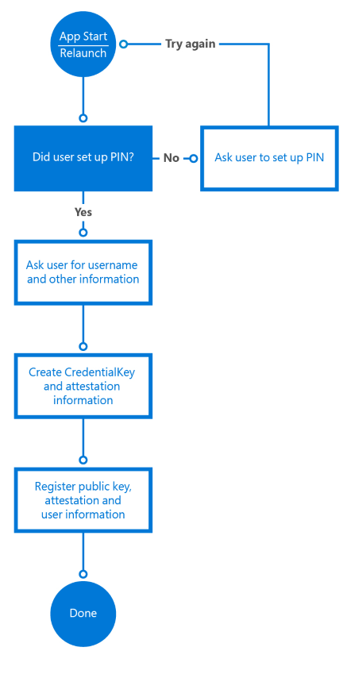
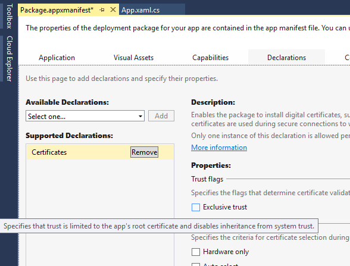
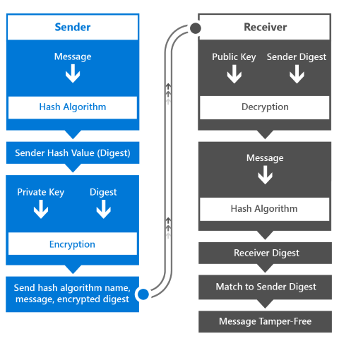

# Intro to secure Windows app development

This introductory article helps app architects and developers better understand the various Windows 10 platform capabilities that accelerate creating secure Universal Windows Platform (UWP) apps. It details how to use the Windows security features available at each of the following stages: authentication, data-in-flight, and data-at-rest. You can find more in-depth information on each topic by reviewing the additional resources included in each chapter.

## 1 Introduction

Developing a secure app can be a challenge. In today’s fast-paced world of mobile, social, cloud, and complex enterprise apps, customers expect apps to become available and updated faster than ever. They also use many types of devices, further adding to the complexity of creating app experiences. If you build for the Windows 10 and Windows 11 Universal Windows Platform (UWP), that could include the traditional list of desktops, laptops, tablets, and mobile devices; in addition to a growing list of new devices spanning the Internet of Things, Xbox One, Microsoft Surface Hub, and HoloLens. As the developer, you must ensure your apps communicate and store data securely, across all the platforms or devices involved.

Here are some of the benefits of utilizing Windows 10 and Windows 11 security features.

- You will have standardized security across all devices that support Windows 10 and Windows 11, by using consistent APIs for security components and technologies.
- You write, test, and maintain less code than you would if you implemented custom code to cover these security scenarios.
- Your apps become more stable and secure because you use the operating system to control how the app accesses its resources and local or remote system resources.

During authentication, the identity of a user requesting access to a particular service is validated. Windows Hello is the component in Windows 10 and Windows 11 that helps create a more secure authentication mechanism in Windows apps. With it, you can use a Personal Identification Number (PIN) or biometrics such as the user’s fingerprints, face, or iris to implement multi-factor authentication for your apps.

Data-in-flight refers to the connection and the messages transferred across it. An example of this is retrieving data from a remote server using web services. The use of Secure Sockets Layer (SSL) and Secure Hypertext Transfer Protocol (HTTPS) ensures the security of the connection. Preventing intermediary parties from accessing these messages, or unauthorized apps from communicating with the web services, is key to securing data in flight.

Lastly, data-at-rest relates to data residing in memory or on storage media. Windows 10 and Windows 11 have an app model that prevents unauthorized data access between apps, and offers encryption APIs to further secure data on the device. A feature called Credential Locker can be used to securely store user credentials on the device, with the operating system preventing other apps from accessing them.

## 2 Authentication Factors

To protect data, the person requesting access to it must be identified and authorized to access the data resources they request. The process of identifying a user is called authentication, and determining access privileges to a resource is called authorization. These are closely related operations, and to the user they might be indistinguishable. They can be relatively simple or complex operations, depending on many factors: for example, whether the data resides on one server or is distributed across many systems. The server providing the authentication and authorization services is referred to as the identity provider.

To authenticate themselves with a particular service and/or app, the user employs credentials made up of something they know, something they have, and/or something they are. Each of these are called authentication factors.

- **Something the user knows** is usually a password, but it can also be a personal identification number (PIN) or a “secret” question-and-answer pair.
- **Something the user has** is most often a hardware memory device such as a USB stick containing the authentication data unique to the user.
- **Something the user is** often encompasses their fingerprints, but there are increasingly popular factors like the user’s speech, facial, ocular (eye) characteristics, or patterns of behavior. When stored as data, these measurements are called biometrics.

A password created by the user is an authentication factor in itself, but it often isn’t sufficient; anyone who knows the password can impersonate the user who owns it. A smart card can provide a higher level of security, but it might be stolen, lost, or misplaced. A system that can authenticate a user by their fingerprint or by an ocular scan might provide the highest and most convenient level of security, but it requires expensive and specialized hardware (for example, an Intel RealSense camera for facial recognition) that might not be available to all users.

Designing the method of authentication used by a system is a complex and important aspect of data security. In general, the greater number of factors you use in authentication, the more secure the system is. At the same time, authentication must be usable. A user will usually log in many times a day, so the process must be fast. Your choice of authentication type is a trade-off between security and ease of use; single-factor authentication is the least secure and easiest to use, and multi-factor authentication becomes more secure, but more complex as more factors are added.

## 2.1 Single-factor authentication

This form of authentication is based on a single user credential. This is usually a password, but it could also be a personal identification number (PIN).

Here’s the process of single-factor authentication.

- The user provides their username and password to the identity provider. The identity provider is the server process that verifies the identity of the user.
- The identity provider checks whether the username and password are the same as those stored in the system. In most cases, the password will be encrypted, providing additional security so that others cannot read it.
- The identity provider returns an authentication status that indicates whether the authentication was successful.
- If successful, data exchange begins. If unsuccessful, the user must be re-authenticated.


Today, this method of authentication is the most commonly used one across services. It is also the least secure form of authentication when used as the only means of authentication. Password complexity requirements, "secret questions," and regular password changes can make using passwords more secure, but they put more burden on users and they’re not an effective deterrent against hackers.

The challenge with passwords is that it is easier to guess them successfully than systems that have more than one factor. If they steal a database with user accounts and hashed password from a little web shop, they can use the passwords used on other web sites. Users tend to reuse accounts all the time, because complex passwords are hard to remember. For an IT department, managing passwords also brings with it the complexity of having to offer reset mechanisms, requiring frequent updates to passwords, and storing them in a safe manner.

For all of its disadvantages, single-factor authentication gives the user control of the credential. They create it and modify it, and only a keyboard is needed for the authentication process. This is the main aspect that distinguishes single-factor from multi-factor authentication.

## 2.1.1 Web authentication broker

As previously discussed, one of the challenges with password authentication for an IT department is the added overhead of managing the base of usernames/passwords, reset mechanisms, etc. An increasingly popular option is to rely on third-party identity providers that offer authentication through OAuth, an open standard for authentication.

Using OAuth, IT departments can effectively "outsource" the complexity of maintaining a database with usernames and passwords, reset password functionality, etc. to a third party identity provider like Facebook, X or Microsoft.

Users have complete control over their identity on these platforms, but apps can request a token from the provider, after the user is authenticated and with their consent, which can be used to authorize authenticated users.

The web authentication broker in Windows 10 and Windows 11 provides a set of APIs and infrastructure for apps to use authentication and authorization protocols like OAuth and OpenID. Apps can initiate authentication operations through the [**WebAuthenticationBroker**](/uwp/api/Windows.Security.Authentication.Web.WebAuthenticationBroker) API, resulting in the return of a [**WebAuthenticationResult**](/uwp/api/Windows.Security.Authentication.Web.WebAuthenticationResult). An overview of the communication flow is illustrated in the following figure.


The app acts as the broker, initiating the authentication with the identity provider through a [**WebView**](/uwp/api/Windows.UI.Xaml.Controls.WebView) in the app. When the identity provider has authenticated the user, it returns a token to the app that can be used to request information about the user from the identity provider. As a security measure, the app must be registered with the identity provider before it can broker the authentication processes with the identity provider. This registration steps differ for each provider.

Here’s the general workflow for calling the [**WebAuthenticationBroker**](/uwp/api/Windows.Security.Authentication.Web.WebAuthenticationBroker) API to communicate with the provider.

- Construct the request strings to be sent to the identity provider. The number of strings, and the information in each string, is different for each web service but it usually includes two URI strings each containing a URL: one to which the authentication request is sent, and one to which the user is redirected after authorization is complete.
- Call [**WebAuthenticationBroker.AuthenticateAsync**](/uwp/api/windows.security.authentication.web.webauthenticationbroker.authenticateasync), passing in the request strings, and wait for the response from the identity provider.
- Call [**WebAuthenticationResult.ResponseStatus**](/uwp/api/windows.security.authentication.web.webauthenticationresult.responsestatus) to get the status when the response is received.
- If the communication is successful, process the response string returned by the identity provider. If unsuccessful, process the error.

If the communication is successful, process the response string returned by the identity provider. If unsuccessful, process the error.

Sample C# code that for this process is below. For information and a detailed walkthrough, see [WebAuthenticationBroker](web-authentication-broker.md). For a complete code sample, check out the [WebAuthenticationBroker sample on GitHub](https://github.com/Microsoft/Windows-universal-samples/tree/master/Samples/WebAuthenticationBroker).

```cs
string startURL = "https://<providerendpoint>?client_id=<clientid>";
string endURL = "http://<AppEndPoint>";

var startURI = new System.Uri(startURL);
var endURI = new System.Uri(endURL);

try
{
    WebAuthenticationResult webAuthenticationResult = 
        await WebAuthenticationBroker.AuthenticateAsync( 
            WebAuthenticationOptions.None, startURI, endURI);

    switch (webAuthenticationResult.ResponseStatus)
    {
        case WebAuthenticationStatus.Success:
            // Successful authentication. 
            break;
        case WebAuthenticationStatus.ErrorHttp:
            // HTTP error. 
            break;
        default:
            // Other error.
        break;
    }
}
catch (Exception ex)
{
    // Authentication failed. Handle parameter, SSL/TLS, and
    // Network Unavailable errors here. 
}
```

## 2.2 Multi-factor authentication

Multi-factor authentication makes use of more than one authentication factor. Usually, "something you know," such as a password, is combined with "something you have," which can be a mobile phone or a smart card. Even if an attacker discovers the user’s password, the account is still inaccessible without the device or card. And if only the device or card is compromised, it is not useful to the attacker without the password. Multi-factor authentication is therefore more secure, but also more complex, than single-factor authentication.

Services that use multi-factor authentication will often give the user a choice in how they receive the second credential. An example of this type of authentication is a commonly used process where a verification code is sent to the user’s mobile phone using SMS.

- The user provides their username and password to the identity provider.
- The identity provider verifies the username and password as in single-factor authorization, and then looks up the user’s mobile phone number stored in the system.
- The server sends an SMS message containing a generated verification code to the user’s mobile phone.
- The user provides the verification code to the identity provider; through a form presented to the user.
- The identity provider returns an authentication status that indicates whether the authentication of both credentials were successful.
- If successful, data exchange begins. Otherwise, the user must be re-authenticated.


As you can see, this process also differs from single-factor authentication in that the second user credential is sent to the user instead of being created or provided by the user. The user is therefore not in complete control of the necessary credentials. This also applies when a smart card is used as the second credential: the organization is in charge of creating and providing it to the user.

## 2.2.1 Azure Active Directory

Azure Active Directory (Azure AD) is a cloud-based identity and access management service that can serve as the identity provider in single-factor or multi-factor authentication. Azure AD authentication can be used with or without a verification code.

While Azure AD can also implement single-factor authentication, enterprises usually require the higher security of multi-factor authentication. In a multi-factor authentication configuration, a user authenticating with an Azure AD account has the option of having a verification code sent as an SMS message either to their mobile phone or the Azure Authenticator mobile app.

Additionally, Azure AD can be used as an OAuth provider, providing the standard user with an authentication and authorization mechanism to apps across various platforms. To learn more, see [Azure Active Directory](https://azure.microsoft.com/services/active-directory/) and [Multi-Factor Authentication on Azure](https://azure.microsoft.com/services/multi-factor-authentication/).

## 2.4 Windows Hello

In Windows 10 and Windows 11, a convenient multi-factor authentication mechanism is built into the operating system. Windows Hello is the new biometric sign-in system built into Windows 10 and Windows 11. Because it is built directly into the operating system, Windows Hello allows face or fingerprint identification to unlock users’ devices. The Windows secure credential store protects biometric data on the device.

Windows Hello provides a robust way for a device to recognize an individual user, which addresses the first part of the path between a user and a requested service or data item. After the device has recognized the user, it still must authenticate the user before determining whether to grant access to a requested resource. Windows Hello also provides strong two-factor authentication (2FA) that is fully integrated into Windows and replaces reusable passwords with the combination of a specific device, and a biometric gesture or PIN. The PIN is specified by the user as part of their Microsoft account enrollment.

Windows Hello isn’t just a replacement for traditional 2FA systems, though. It’s conceptually similar to smart cards: authentication is performed by using cryptographic primitives instead of string comparisons, and the user’s key material is secure inside tamper-resistant hardware. Microsoft Hello doesn't require the extra infrastructure components required for smart card deployment, either. In particular, you don’t need a Public Key Infrastructure (PKI) to manage certificates, if you don’t currently have one. Windows Hello combines the major advantages of smart cards—deployment flexibility for virtual smart cards and robust security for physical smart cards—without any of their drawbacks.

A device must be registered with Windows Hello before users can authenticate with it. Windows Hello uses asymmetric (public/private key) encryption in which one party uses a public key to encrypt the data that the other party can decrypt using a private key. In the case of Windows Hello, it creates a set of public/private key pairs and writes the private keys to the device’s Trusted Platform Module (TPM) chip. After a device has been registered, UWP apps can call system APIs to retrieve the user’s public key, which can be used to register the user on the server.

The registration workflow of an app might look like the following:



The registration information you collect may include a lot more identifying information than it does in this simple scenario. For example, if your app accesses a secured service such as one for banking, you’d need to request proof of identity and other things as part of the sign-up process. Once all the conditions are met, the public key of this user will be stored in the back-end and used to validate the next time the user uses the service.

For more information on Windows Hello, see the [Windows Hello guide](/windows/keep-secure/microsoft-passport-guide) and the [Windows Hello developer guide](microsoft-passport.md).

## 3 Data-in-flight security methods

Data-in-flight security methods apply to data in transit between devices connected to a network. The data may be transferred between systems on the high-security environment of a private corporate intranet, or between a client and web service in the non-secure environment of the web. Windows 10 and Windows 11 apps support standards such as SSL through their networking APIs, and work with technologies such as Azure API Management with which developers can ensure the appropriate level of security for their apps.

## 3.1 Remote system authentication

There are two general scenarios where communication occurs with a remote computer system.

- A local server authenticates a user over a direct connection. For example, when the server and the client are on a corporate intranet.
- A web service is communicated with over the Internet.

Security requirements for web service communication are higher than those in direct connection scenarios, as data is no longer only a part of a secure network and the likelihood of malicious attackers looking to intercept data is also higher. Because various types of devices will access the service, they will likely be built as RESTful services, as opposed to WCF, for instance, which means authentication and authorization to the service also introduces new challenges. We’ll discuss two requirements for secure remote system communication.

The first requirement is message confidentiality: The information passed between the client and the web services (for example, the identity of the user and other personal information) must not be readable by third parties while in transit. This is usually accomplished by encrypting the connection over which messages are sent and by encrypting the message itself. In private/public key encryption, the public key is available to anyone, and is used to encrypt messages to be sent to a specific receiver. The private key is only held by the receiver and is used to decrypt the message.

The second requirement is message integrity: The client and the web service must be able to verify that the messages they receive are the ones intended to be sent by the other party, and that the message has not been altered in transit. This is accomplished by signing messages with digital signatures and using certificate authentication.

## 3.2 SSL connections

To establish and maintain secure connections to clients, web services can use Secure Sockets Layer (SSL), which is supported by the Secure Hypertext Transfer Protocol (HTTPS). SSL provides message confidentiality and integrity by supporting public key encryption as well as server certificates. SSL is superseded by Transport Layer Security (TLS), but TLS is often casually referred to as SSL.

When a client requests access to a resource on a server, SSL starts a negotiation process with the server. This is called an SSL handshake. An encryption level, a set of public and private encryption keys, and the identity information in the client and server certificates are agreed upon as the basis of all communication for the duration of the SSL connection. The server may also require the client to be authenticated at this time. Once the connection is established, all messages are encrypted with the negotiated public key until the connection closes.

## 3.2.1 SSL pinning

While SSL can provide message confidentiality using encryption and certificates, it does nothing to verify that the server with which the client is communicating is the correct one. The server’s behavior can be mimicked by an unauthorized third-party, intercepting the sensitive data that the client transmits. To prevent this, a technique called SSL pinning is used to verify that the certificate on the server is the certificate that the client expects and trusts.

There are a few different ways to implement SSL pinning in apps, each with their own pros and cons. The easiest approach is via the Certificates declaration in the app’s package manifest. This declaration enables the app package to install digital certificates and specify exclusive trust in them. This results in SSL connections being allowed only between the app and servers that have the corresponding certificates in their certificate chain. This mechanism also enables the secure use of self-signed certificates, as no third party dependency is needed on trusted public certification authorities.



For more control over the validation logic, APIs are available to validate the certificate(s) returned by the server in response to an HTTPS request. Note that this method requires sending a request and inspecting the response, so be sure to add this as a validation before actually sending sensitive information in a request.

The following C# code illustrates this method of SSL pinning. The **ValidateSSLRoot** method uses the [**HttpClient**](/uwp/api/Windows.Web.Http.HttpClient) class to execute an HTTP request. After the client sends the response, it uses the [**RequestMessage.TransportInformation.ServerIntermediateCertificates**](/uwp/api/windows.web.http.httptransportinformation.serverintermediatecertificates) collection to inspect the certificates returned by the server. The client can then validate the entire certificate chain with the thumbprints it has included. This method does require the certificate thumbprints to be updated in the app when the server certificate expires and is renewed.

```cs
private async Task ValidateSSLRoot()
{
    // Send a get request to Bing
    var httpClient = new HttpClient();
    var bingUri = new Uri("https://www.bing.com");
    HttpResponseMessage response = 
        await httpClient.GetAsync(bingUri);

    // Get the list of certificates that were used to
    // validate the server's identity
    IReadOnlyList<Certificate> serverCertificates = response.RequestMessage.TransportInformation.ServerIntermediateCertificates;
  
    // Perform validation
    if (!ValidateCertificates(serverCertificates))
    {
        // Close connection as chain is not valid
        return;
    }
    // Validation passed, continue with connection to service
}

private bool ValidateCertificates(IReadOnlyList<Certificate> certs)
{
    // In this example, we iterate through the certificates
    // and check that the chain contains
    // one specific certificate we are expecting
    foreach (var cert in certs)
    {
        byte[] thumbprint = cert.GetHashValue();

        // Check if the thumbprint matches whatever you 
        // are expecting
        var expected = new byte[] { 212, 222, 32, 208, 94, 102, 
            252, 83, 254, 26, 80, 136, 44, 120, 219, 40, 82, 202, 
            228, 116 };

        // ThumbprintMatches does the byte[] comparison 
        if (ThumbprintMatches(thumbprint, expected))
        {
            return true;
        }
    }
    return false;
}
```

## 3.3 Publishing and securing access to REST APIs

To ensure authorized access to web services, they must require authentication every time an API call is made. Being able to control performance and scale is also something to consider when web services are exposed across the web. Azure API Management is a service that can help expose APIs across the web, while providing features on three levels.

**Publishers/Administrators** of the API can easily configure the API through the Publisher Portal of Azure API Management. Here, API sets can be created and access to them can be managed to control who has access to which APIs.

**Developers** wanting access to these APIs can make requests through the Developer Portal, which can either immediately provide access or require approval by the publisher/administrator. Developers can also view the API documentation and sample code in the Developer Portal, to rapidly adopt the APIs offered by the web service.

The **apps** that these developers create then access the API through the proxy offered by Azure API Management. The proxy both provides a layer of obscurity, hiding the actual end-point of the API on the publisher/administrator’s server and can also include additional logic like API translation to ensure the exposed API is kept consistent when a call to one API is redirected to another. It can also use IP filtering to block API calls originating from a specific IP domain or set of domains. Azure API Management also keeps its web services secure by using a set of public keys, called API keys, to authenticate and authorize each API call. When authorization fails, access to the API and the functionality it supports is blocked.

Azure API Management can also reduce the number of API calls to a service (a procedure called throttling) to optimizes the performance of the web service. To learn more, review [Azure API Management](https://azure.microsoft.com/services/api-management/) and Azure API Management at AzureCon 2015.

## 4 Data-at-rest security methods

When data arrives on a device, we refer to it as "data-at-rest." This data needs to be stored on the device in a secure manner, so that it cannot be accessed by unauthorized users or apps. The app model in Windows 10 and Windows 11 does a lot to ensure that the data stored by any app is only accessible to that app, while providing APIs to share the data when necessary. Additional APIs are also available to ensure that data can be encrypted and credentials can be stored safely.

## 4.1 Windows app model

Traditionally, Windows has never had a definition of an app. It was most commonly referred to as an executable (.exe), and this never included installation, storage of state, execution length, versioning, OS integration, or app-to-app communication. The Universal Windows Platform model defines an app model that covers installation, runtime environment, resource management, updates, data model, and uninstallation.

Windows 10 apps run in a container, which means that they have limited privileges by default (additional privileges can be requested and granted by the user). For example, if an app wants to access files on the system, a file picker from the [**Windows.Storage.Pickers**](/uwp/api/Windows.Storage.Pickers) namespace has to be used to let the user pick a file (no direct access to files is enabled). Another example is if an app wants to access the user’s location data, it needs to enable the location device capability needs to be declared, prompting the user at download time that this app will request access to the user’s location. On top of that, the first time the app wants to access the user’s location, an additional consent prompt is shown to the user, requesting permission to access the data.

Note that this app model acts as a "jail" for apps, meaning that they can’t reach out, but it is not a “castle” that cannot be reached from the outside (applications with administrator privileges can of course still reach in). Device Guard in Windows 10 and Windows 11, which enables organizations/IT to specify which (Win32) apps are allowed to execute, can further help limit this access.

The app model also manages the app lifecycle. It limits the background execution of apps by default, for example; as soon as an app goes into the background, the process is suspended – after giving the app a brief period to address app suspension in code – and its memory is frozen. The operating system does provide mechanisms for apps to ask for specific background task execution (on a schedule, triggered by various events such as Internet/Bluetooth connectivity, power changes, etc., and in specific scenarios such as music playing or GPS tracking).

When memory resources on the device are running low, Windows frees memory space by terminating apps. This lifecycle model forces apps to persist data whenever they’re suspended, because there is no additional time available between suspension and termination.

For more information, see [It's Universal: Understanding the Lifecycle of a Windows 10/11 Application](https://visualstudiomagazine.com/articles/2015/09/01/its-universal.aspx).

## 4.2 Stored credential protection

Windows apps that access authenticated services often provide the users the option of storing their credentials on the local device. This is a convenience for the users; when they provide their username and password, the app automatically uses them in subsequent launches of the app. Because this can be a security issue if an attacker gains access to this stored data, Windows 10 and Windows 11 provide the ability for Windows apps to store user credentials in a secure credential locker. The app calls the Credential Locker API to store and retrieve the credentials from the locker instead of storing them in the app’s storage container. The credential locker is managed by the operating system, but access is limited to the app that stores them, providing a securely managed solution for credential storage.

When a user supplies the credentials to be stored, the app gets a reference to the credential locker using the [**PasswordVault**](/uwp/api/Windows.Security.Credentials.PasswordVault) object in the [**Windows.Security.Credentials**](/uwp/api/Windows.Security.Credentials) namespace. It then creates a [**PasswordCredential**](/uwp/api/Windows.Security.Credentials.PasswordCredential) object containing an identifier for the Windows app and the username and password. This is passed to the [**PasswordVault.Add**](/uwp/api/windows.security.credentials.passwordvault.add) method to store the credentials in the locker. The following C# code example shows how this is done.

```cs
var vault = new PasswordVault();
vault.Add(new PasswordCredential("My App", username, password));
```

In the following C# code example, the app requests all of the credentials corresponding to the app by calling the [**FindAllByResource**](/uwp/api/windows.security.credentials.passwordvault.findallbyresource) method of the [**PasswordVault**](/uwp/api/Windows.Security.Credentials.PasswordVault) object. If more than one is returned, it prompts the user to enter their username. If the credentials are not in the locker, the app prompts the user for them. The user is then logged into the server using the credentials.

```cs
private string resourceName = "My App";
private string defaultUserName;

private void Login()
{
    PasswordCredential loginCredential = GetCredentialFromLocker();

    if (loginCredential != null)
    {
        // There is a credential stored in the locker.
        // Populate the Password property of the credential
        // for automatic login.
        loginCredential.RetrievePassword();
    }
    else
    {
        // There is no credential stored in the locker.
        // Display UI to get user credentials.
        loginCredential = GetLoginCredentialUI();
    }
    // Log the user in.
    ServerLogin(loginCredential.UserName, loginCredential.Password);
}

private PasswordCredential GetCredentialFromLocker()
{
    PasswordCredential credential = null;

    var vault = new PasswordVault();

    IReadOnlyList<PasswordCredential> credentialList = null;

    try
    {
        credentialList = vault.FindAllByResource(resourceName);
    }
    catch(Exception)
    {
        return null;
    }

    if (credentialList.Count == 1)
    {
        credential = credentialList[0];
    }
    else if (credentialList.Count > 0)
    {
        // When there are multiple usernames,
        // retrieve the default username. If one doesn't
        // exist, then display UI to have the user select
        // a default username.
        defaultUserName = GetDefaultUserNameUI();

        credential = vault.Retrieve(resourceName, defaultUserName);
    }
    return credential;
}
```

For more information, see [Credential locker](credential-locker.md).

## 4.3 Stored data protection

When you are dealing with stored data, commonly referred to as data-at-rest, encrypting it can prevent unauthorized users from accessing the stored data. The two common mechanisms to encrypt data are using either symmetric keys or using asymmetric keys. However, data encryption can’t ensure that the data is unaltered between the time it was sent and the time it was stored. In other words, the data integrity cannot be ensured. Using message authentication codes, hashes, and digital signing are common techniques to solve this problem.

## 4.3.1 Data encryption

With symmetric encryption, both the sender and recipient have the same key and use it to both encrypt and decrypt the data. The challenge with this approach is securely sharing the key so both parties are aware of it.

One answer to this is asymmetric encryption, in which a public/private key pair is used. The public key is shared freely with anyone who wants to encrypt a message. The private key is always kept secret so that only you can use it to decrypt the data. A common technique to allow for discovery of the public key is by using digital certificates, also simply referred to as certificates. The certificate holds information about the public key, in addition to information about the user or server such as the name, issuer, email address and country.

Windows app developers can use the [**SymmetricKeyAlgorithmProvider**](/uwp/api/Windows.Security.Cryptography.Core.SymmetricKeyAlgorithmProvider) and [**AsymmetricKeyAlgorithmProvider**](/uwp/api/Windows.Security.Cryptography.Core.AsymmetricKeyAlgorithmProvider) classes to implement symmetric and asymmetric encryption in their UWP apps. Additionally, the [**CryptographicEngine**](/uwp/api/Windows.Security.Cryptography.Core.CryptographicEngine) class can be used to encrypt and decrypt data, sign content and verify digital signatures. Apps can also use the [**DataProtectionProvider**](/uwp/api/Windows.Security.Cryptography.DataProtection.DataProtectionProvider) class in the [**Windows.Security.Cryptography.DataProtection**](/uwp/api/Windows.Security.Cryptography.DataProtection) namespace to encrypt and decrypt stored local data.

## 4.3.2 Detecting message tampering (MACs, hashes, and signatures)

A MAC is a code (or tag) that results from using a symmetric key (called the secret key) or a message as input to a MAC encryption algorithm. The secret key and the algorithm are agreed upon by the sender and receiver before the message transfer.

MACs verify messages like this.

- The sender derives the MAC tag by using the secret key as input to the MAC algorithm.
- The sender sends the MAC tag and the message to the receiver.
- The receiver derives the MAC tag by using the secret key and the message as inputs to the MAC algorithm.
- The receiver compares their MAC tag with the sender's MAC tag. If they are the same then we know that the message has not been tampered with.


Windows apps can implement MAC message verification by calling the [**MacAlgorithmProvider**](/uwp/api/Windows.Security.Cryptography.Core.MacAlgorithmProvider) class to generate the key and [**CryptographicEngine**](/uwp/api/Windows.Security.Cryptography.Core.CryptographicEngine) class to perform the MAC encryption algorithm.

## 4.3.3 Using hashes

A hash function is a cryptographic algorithm that takes an arbitrarily long block of data and returns a fixed-size bit string called a hash value. There is an entire family of hash functions that can do this.

A hash value can be used in place of a MAC in the message-transfer scenario above. The sender sends a hash value and a message, and the receiver derives their own hash value from the sender's hash value and message and compares the two hash values. Apps running on Windows 10 and Windows 11 can call the [**HashAlgorithmProvider**](/uwp/api/Windows.Security.Cryptography.Core.HashAlgorithmProvider) class to enumerate the hash algorithms that are available and run one of them. The [**CryptographicHash**](/uwp/api/Windows.Security.Cryptography.Core.CryptographicHash) class represents the hash value. The [**CryptographicHash.GetValueAndReset**](/uwp/api/windows.security.cryptography.core.cryptographichash.getvalueandreset) method can be used to repeatedly hash different data without having to re-create the object for each use. The Append method of the **CryptographicHash** class adds new data to a buffer to be hashed. This entire process is shown in the following C# code example.

```cs
public void SampleReusableHash()
{
    // Create a string that contains the name of the
    // hashing algorithm to use.
    string strAlgName = HashAlgorithmNames.Sha512;

    // Create a HashAlgorithmProvider object.
    HashAlgorithmProvider objAlgProv = HashAlgorithmProvider.OpenAlgorithm(strAlgName);

    // Create a CryptographicHash object. This object can be reused to continually
    // hash new messages.
    CryptographicHash objHash = objAlgProv.CreateHash();

    // Hash message 1.
    string strMsg1 = "This is message 1";
    IBuffer buffMsg1 = CryptographicBuffer.ConvertStringToBinary(strMsg1, BinaryStringEncoding.Utf16BE);
    objHash.Append(buffMsg1);
    IBuffer buffHash1 = objHash.GetValueAndReset();

    // Hash message 2.
    string strMsg2 = "This is message 2";
    IBuffer buffMsg2 = CryptographicBuffer.ConvertStringToBinary(strMsg2, BinaryStringEncoding.Utf16BE);
    objHash.Append(buffMsg2);
    IBuffer buffHash2 = objHash.GetValueAndReset();

    // Convert the hashes to string values (for display);
    string strHash1 = CryptographicBuffer.EncodeToBase64String(buffHash1);
    string strHash2 = CryptographicBuffer.EncodeToBase64String(buffHash2);
}
```

## 4.3.4 Digital signatures

The data integrity of a digitally signed stored message is verified in a similar way to MAC authentication. Here is the way the digital signature workflow operates.

- The sender derives a hash value (also known as a digest) by using the message as the input to a hash algorithm.
- The sender encrypts the digest using their private key.
- The sender sends the message, the encrypted digest, and the name of the hash algorithm that was used.
- The receiver uses the public key to decrypt the encrypted digest it received. It then uses the hash algorithm to hash the message to create a digest of its own. And finally the receiver compares the two digests (the one it received and decrypted, and the one it made). Only if the two match can the receiver be sure that the message was sent by the possessor of the private key, and therefore they are who they say they are, and that the message was not altered in transit.



Hashing algorithms are very fast, so hash values can be derived quickly from even large messages. The resulting hash value is an arbitrary length and can be shorter than the full message, so using public and private keys to encrypt and decrypt only the digest rather than the full message is an optimization.

For more information, take a look articles on [Digital signatures](/windows/desktop/SecCrypto/digital-signatures), [MACs, hashes, and signatures](macs-hashes-and-signatures.md), and [Cryptography.](cryptography.md)

## 5 Summary

The Universal Windows Platform in Windows 10 and Windows 11 offers a number of ways to leverage operating system capabilities to create more secure apps. In different authentication scenarios, such as single-factor, multi-factor, or brokered authentication with an OAuth identity provider, APIs exist to mitigate the most common challenges with authentication. Windows Hello provides a new biometric sign-in system that recognizes the user and actively defeats efforts to circumvent proper identification. It also delivers multiple layers of keys and certificates that can never be revealed or used outside the trusted platform module. Plus, a further layer of security is available through the optional use of attestation identity keys and certificates.

To secure data in flight, APIs exist to communicate with remote systems securely over SSL, while providing the possibility to validate the server’s authenticity with SSL pinning. Publishing APIs securely and in a controlled manner is something in which Azure API Management aids by providing powerful configuration options for exposing APIs across the web using a proxy that provides additional obfuscation of the API endpoint. Access to these APIs is secured by using API keys and API calls can be throttled to control performance.

When the data arrives on the device, the Windows app model provides more control over how the app is installed, updated and accesses it data, while keeping it from accessing data of other apps in an unauthorized manner. Credential locker can provide secure storage of user credentials that is managed by the operating system and other data can be protected on the device by using the encryption and hashing APIs offered by the Universal Windows Platform.

## 6 Resources

### 6.1 How-to articles

- [Authentication and user identity](authentication-and-user-identity.md)
- [Windows Hello](microsoft-passport.md)
- [Credential locker](credential-locker.md)
- [Web authentication broker](web-authentication-broker.md)
- [Fingerprint biometrics](fingerprint-biometrics.md)
- [Smart cards](smart-cards.md)
- [Shared certificates](share-certificates.md)
- [Cryptography](cryptography.md)
- [Certificates](certificates.md)
- [Cryptographic keys](cryptographic-keys.md)
- [Data protection](data-protection.md)
- [MACs, hashes, and signatures](macs-hashes-and-signatures.md)
- [Export restrictions on cryptography](export-restrictions-on-cryptography.md)
- [Common cryptography tasks](common-cryptography-tasks.md)

### 6.2 Code samples

- [Credential locker](https://github.com/microsoft/Windows-universal-samples/tree/main/Samples/PasswordVault)
- [Credential picker](https://github.com/microsoft/Windows-universal-samples/tree/main/Samples/CredentialPicker)
- [Device lockdown with Azure login](https://github.com/microsoft/Windows-universal-samples/tree/main/archived/DeviceLockdownAzureLogin)
- [Enterprise data protection](https://github.com/microsoft/Windows-universal-samples/tree/main/Samples/EnterpriseDataProtection)
- [KeyCredentialManager](https://github.com/microsoft/Windows-universal-samples/tree/main/Samples/KeyCredentialManager)
- [Smart cards](https://github.com/microsoft/Windows-universal-samples/tree/main/Samples/SmartCard)
- [Web account management](https://github.com/microsoft/Windows-universal-samples/tree/main/Samples/WebAccountManagement)
- [WebAuthenticationBroker](https://github.com/microsoft/Windows-universal-samples/tree/main/Samples/WebAuthenticationBroker)

### 6.3 API reference

- [**Windows.Security.Authentication.OnlineId**](/uwp/api/Windows.Security.Authentication.OnlineId)
- [**Windows.Security.Authentication.Web**](/uwp/api/Windows.Security.Authentication.Web)
- [**Windows.Security.Authentication.Web.Core**](/uwp/api/Windows.Security.Authentication.Web.Core)
- [**Windows.Security.Authentication.Web.Provider**](/uwp/api/Windows.Security.Authentication.Web.Provider)
- [**Windows.Security.Credentials**](/uwp/api/Windows.Security.Credentials)
- [**Windows.Security.Credentials**](/uwp/api/Windows.Security.Credentials)
- [**Windows.Security.Credentials.UI**](/uwp/api/Windows.Security.Credentials.UI)
- [**Windows.Security.Cryptography**](/uwp/api/Windows.Security.Cryptography)
- [**Windows.Security.Cryptography.Certificates**](/uwp/api/Windows.Security.Cryptography.Certificates)
- [**Windows.Security.Cryptography.Core**](/uwp/api/Windows.Security.Cryptography.Core)
- [**Windows.Security.Cryptography.DataProtection**](/uwp/api/Windows.Security.Cryptography.DataProtection)
- [**Windows.Security.ExchangeActiveSyncProvisioning**](/uwp/api/Windows.Security.ExchangeActiveSyncProvisioning)
- [**Windows.Security.EnterpriseData**](/uwp/api/Windows.Security.EnterpriseData)
