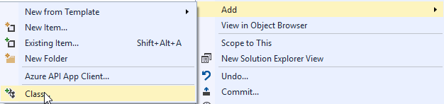
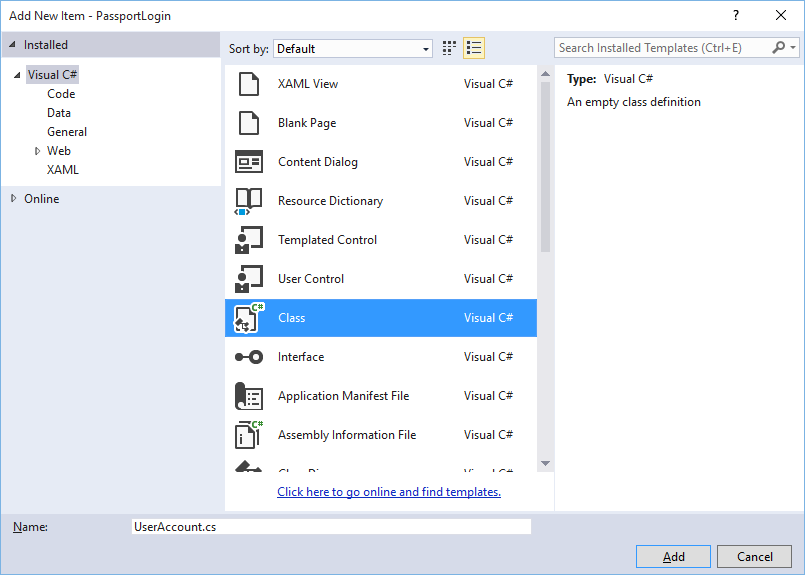
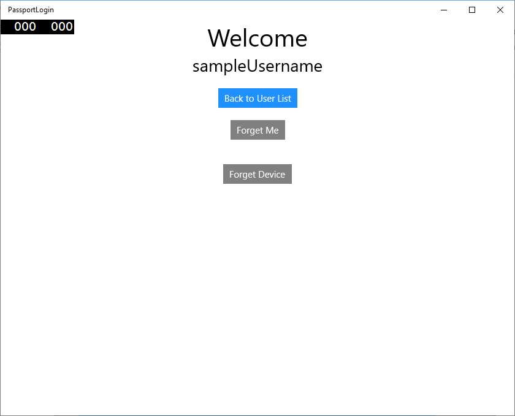

# Create a Windows Hello login service

This is Part 2 of a complete walkthrough on how to use Windows Hello as an alternative to traditional username and password authentication systems in Windows 10 and Windows 11 Universal Windows Platform (UWP) apps. This article picks up where Part 1, [Windows Hello login app](microsoft-passport-login.md), left off and extends the functionality to demonstrate how you can integrate Windows Hello into your existing application.

In order to build this project, you'll need some experience with C#, and XAML. You'll also need to be using Visual Studio 2015 (Community Edition or greater) on a Windows 10 or Windows 11 machine.

## Exercise 1: Server Side Logic

In this exercise you will be starting with the Windows Hello application built in the first lab and creating a local mock server and database. This hands on lab is designed to teach how Windows Hello could be integrated into an existing system. By using a mock server and mock database a lot of unrelated setup is eliminated. In your own applications you will need to replace the mock objects with the real services and databases.

- To begin, open up the PassportLogin solution from the first Passport Hands On Lab.
- You will start by implementing the mock server and mock database. Create a new folder called "AuthService". In solution explorer right click on the solution "PassportLogin (Universal Windows)" and select Add > New Folder.
- Create UserAccount and PassportDevices classes that will act as models for data to be saved in the mock database. The UserAccount will be similar to the user model implemented on a traditional authentication server. Right click on the AuthService folder and add a new class called "UserAccount.cs."

    

    

- Change the class definition to be public and then add the following public properties. You will need the following reference.

    ```cs
    using System.ComponentModel.DataAnnotations;
     
    namespace PassportLogin.AuthService
    {
        public class UserAccount
        {
            [Key, Required]
            public Guid UserId { get; set; }
            [Required]
            public string Username { get; set; }
            public string Password { get; set; }
            // public List<PassportDevice> PassportDevices = new List<PassportDevice>();
        }
    }
    ```

    You may have noticed the commented out list of PassportDevices. This is a modification you will need to make to an existing user model in your current implementation. The list of PassportDevices will contain a deviceID, the public key made from Windows Hello, and a [**KeyCredentialAttestationResult**](/uwp/api/Windows.Security.Credentials.KeyCredentialAttestationResult). For this hands on lab you will need to implement the keyAttestationResult as they are only provided by Windows Hello on devices that have a TPM (Trusted Platform Modules) chip. The **KeyCredentialAttestationResult** is a combination of multiple properties and would need to be split in order to save and load them with a database.

- Create a new class in the AuthService folder called "PassportDevice.cs". This is the model for the Windows Hello devices as discussed above. Change the class definition to be public and add the following properties.

    ```cs
    namespace PassportLogin.AuthService
    {
        public class PassportDevice
        {
            // These are the new variables that will need to be added to the existing UserAccount in the Database
            // The DeviceName is used to support multiple devices for the one user.
            // This way the correct public key is easier to find as a new public key is made for each device.
            // The KeyAttestationResult is only used if the User device has a TPM (Trusted Platform Module) chip, 
            // in most cases it will not. So will be left out for this hands on lab.
            public Guid DeviceId { get; set; }
            public byte[] PublicKey { get; set; }
            // public KeyCredentialAttestationResult KeyAttestationResult { get; set; }
        }
    }
    ```

- Return to in UserAccount.cs and uncomment the list of Windows Hello devices.

    ```cs
    using System.Collections.Generic;
     
    namespace PassportLogin.AuthService
    {
        public class UserAccount
        {
            [Key, Required]
            public Guid UserId { get; set; }
            [Required]
            public string Username { get; set; }
            public string Password { get; set; }
            public List<PassportDevice> PassportDevices = new List<PassportDevice>();
        }
    }
    ```

- With the model for the UserAccount and the PassportDevice created, you need to create another new class in the AuthService that will act as the mock database. As this is a mock database from where you will be saving and loading a list of user accounts locally. In the real world this would be your database implementation. Create a new class in AuthService called "MockStore.cs". Change the class definition to public.
- As the mock store will save and load a list of user accounts locally you can implement the logic to save and load that list using an XmlSerializer. You will also need to remember the filename and save location. In MockStore.cs implement the following:

```cs
    using System.IO;
    using System.Linq;
    using System.Xml.Serialization;
    using Windows.Storage;

    namespace PassportLogin.AuthService
    {
        public class MockStore
        {
            private const string USER_ACCOUNT_LIST_FILE_NAME = "userAccountsList.txt";
            // This cannot be a const because the LocalFolder is accessed at runtime
            private string _userAccountListPath = Path.Combine(
                ApplicationData.Current.LocalFolder.Path, USER_ACCOUNT_LIST_FILE_NAME);
            private List<UserAccount> _mockDatabaseUserAccountsList;
     
    #region Save and Load Helpers
            /// <summary>
            /// Create and save a useraccount list file. (Replacing the old one)
            /// </summary>
            private async void SaveAccountListAsync()
            {
                string accountsXml = SerializeAccountListToXml();
     
                if (File.Exists(_userAccountListPath))
                {
                    StorageFile accountsFile = await StorageFile.GetFileFromPathAsync(_userAccountListPath);
                    await FileIO.WriteTextAsync(accountsFile, accountsXml);
                }
                else
                {
                    StorageFile accountsFile = await ApplicationData.Current.LocalFolder.CreateFileAsync(USER_ACCOUNT_LIST_FILE_NAME);
                    await FileIO.WriteTextAsync(accountsFile, accountsXml);
                }
            }
     
            /// <summary>
            /// Gets the useraccount list file and deserializes it from XML to a list of useraccount objects.
            /// </summary>
            /// <returns>List of useraccount objects</returns>
            private async void LoadAccountListAsync()
            {
                if (File.Exists(_userAccountListPath))
                {
                    StorageFile accountsFile = await StorageFile.GetFileFromPathAsync(_userAccountListPath);
     
                    string accountsXml = await FileIO.ReadTextAsync(accountsFile);
                    DeserializeXmlToAccountList(accountsXml);
                }
     
                // If the UserAccountList does not contain the sampleUser Initialize the sample users
                // This is only needed as it in a Hand on Lab to demonstrate a user migrating
                // In the real world user accounts would just be in a database
                if (!_mockDatabaseUserAccountsList.Any(f => f.Username.Equals("sampleUsername")))
                {
                    //If the list is empty InitializeSampleAccounts and return the list
                    //InitializeSampleUserAccounts();
                }
            }
     
            /// <summary>
            /// Uses the local list of accounts and returns an XML formatted string representing the list
            /// </summary>
            /// <returns>XML formatted list of accounts</returns>
            private string SerializeAccountListToXml()
            {
                XmlSerializer xmlizer = new XmlSerializer(typeof(List<UserAccount>));
                StringWriter writer = new StringWriter();
                xmlizer.Serialize(writer, _mockDatabaseUserAccountsList);
                return writer.ToString();
            }
     
            /// <summary>
            /// Takes an XML formatted string representing a list of accounts and returns a list object of accounts
            /// </summary>
            /// <param name="listAsXml">XML formatted list of accounts</param>
            /// <returns>List object of accounts</returns>
            private List<UserAccount> DeserializeXmlToAccountList(string listAsXml)
            {
                XmlSerializer xmlizer = new XmlSerializer(typeof(List<UserAccount>));
                TextReader textreader = new StreamReader(new MemoryStream(Encoding.UTF8.GetBytes(listAsXml)));
                return _mockDatabaseUserAccountsList = (xmlizer.Deserialize(textreader)) as List<UserAccount>;
            }
    #endregion
        }
    }
```

- In the load method you may have noticed that an InitializeSampleUserAccounts method was commented out. You will need to create this method in the MockStore.cs. This method will populate the user accounts list so that a login can take place. In the real world the user database would already be populated. In this step you will also be creating a constructor that will initialise the user list and call load.

    ```cs
    namespace PassportLogin.AuthService
    {
        public class MockStore
        {
            private const string USER_ACCOUNT_LIST_FILE_NAME = "userAccountsList.txt";
            // This cannot be a const because the LocalFolder is accessed at runtime
            private string _userAccountListPath = Path.Combine(
                ApplicationData.Current.LocalFolder.Path, USER_ACCOUNT_LIST_FILE_NAME);
            private List<UserAccount> _mockDatabaseUserAccountsList;
     
            public MockStore()
            {
                _mockDatabaseUserAccountsList = new List<UserAccount>();
                LoadAccountListAsync();
            }

            private void InitializeSampleUserAccounts()
            {
                // Create a sample Traditional User Account that only has a Username and Password
                // This will be used initially to demonstrate how to migrate to use Windows Hello

                UserAccount sampleUserAccount = new UserAccount()
                {
                    UserId = Guid.NewGuid(),
                    Username = "sampleUsername",
                    Password = "samplePassword",
                };

                // Add the sampleUserAccount to the _mockDatabase
                _mockDatabaseUserAccountsList.Add(sampleUserAccount);
                SaveAccountListAsync();
            }
        }
    }
    ```

- Now that the InitalizeSampleUserAccounts method exists uncomment the method call in the LoadAccountListAsync method.

    ```cs
    private async void LoadAccountListAsync()
    {
        if (File.Exists(_userAccountListPath))
        {
            StorageFile accountsFile = await StorageFile.GetFileFromPathAsync(_userAccountListPath);

            string accountsXml = await FileIO.ReadTextAsync(accountsFile);
            DeserializeXmlToAccountList(accountsXml);
        }

        // If the UserAccountList does not contain the sampleUser Initialize the sample users
        // This is only needed as it in a Hand on Lab to demonstrate a user migrating
        // In the real world user accounts would just be in a database
        if (!_mockDatabaseUserAccountsList.Any(f = > f.Username.Equals("sampleUsername")))
                {
            //If the list is empty InitializeSampleAccounts and return the list
            InitializeSampleUserAccounts();
        }
    }
    ```

- The user accounts list in mock store can now be saved and loaded. Other parts of the application will need to have access to this list so there will need to be some methods to retrieve this data. Underneath the InitializeSampleUserAccounts method, add the following get methods. They will allow you to get a userid, a single user, a list of users for a specific Windows Hello device, and also get the public key for the user on a specific device.

    ```cs
    public Guid GetUserId(string username)
    {
        if (_mockDatabaseUserAccountsList.Any())
        {
            UserAccount account = _mockDatabaseUserAccountsList.FirstOrDefault(f => f.Username.Equals(username));
            if (account != null)
            {
                return account.UserId;
            }
        }
        return Guid.Empty;
    }

    public UserAccount GetUserAccount(Guid userId)
    {
        return _mockDatabaseUserAccountsList.FirstOrDefault(f => f.UserId.Equals(userId));
    }

    public List<UserAccount> GetUserAccountsForDevice(Guid deviceId)
    {
        List<UserAccount> usersForDevice = new List<UserAccount>();

        foreach (UserAccount account in _mockDatabaseUserAccountsList)
        {
            if (account.PassportDevices.Any(f => f.DeviceId.Equals(deviceId)))
            {
                usersForDevice.Add(account);
            }
        }

        return usersForDevice;
    }

    public byte[] GetPublicKey(Guid userId, Guid deviceId)
    {
        UserAccount account = _mockDatabaseUserAccountsList.FirstOrDefault(f => f.UserId.Equals(userId));
        if (account != null)
        {
            if (account.PassportDevices.Any())
            {
                return account.PassportDevices.FirstOrDefault(p => p.DeviceId.Equals(deviceId)).PublicKey;
            }
        }
        return null;
    }
    ```

- The next methods to implement will handle simple operations to add account, remove account, and also remove device. Remove device is needed as Windows Hello is device specific. For each device to which you log in, a new public and private key pair will be created by Windows Hello. It is like having a different password for each device you sign in on, the only thing is you don’t need to remember all those passwords the server does. Add the following methods into the MockStore.cs

    ```cs
    public UserAccount AddAccount(string username)
    {
        UserAccount newAccount = null;
        try
        {
            newAccount = new UserAccount()
            {
                UserId = Guid.NewGuid(),
                Username = username,
            };

            _mockDatabaseUserAccountsList.Add(newAccount);
            SaveAccountListAsync();
        }
        catch (Exception)
        {
            throw;
        }
        return newAccount;
    }

    public bool RemoveAccount(Guid userId)
    {
        UserAccount userAccount = GetUserAccount(userId);
        if (userAccount != null)
        {
            _mockDatabaseUserAccountsList.Remove(userAccount);
            SaveAccountListAsync();
            return true;
        }
        return false;
    }

    public bool RemoveDevice(Guid userId, Guid deviceId)
    {
        UserAccount userAccount = GetUserAccount(userId);
        PassportDevice deviceToRemove = null;
        if (userAccount != null)
        {
            foreach (PassportDevice device in userAccount.PassportDevices)
            {
                if (device.DeviceId.Equals(deviceId))
                {
                    deviceToRemove = device;
                    break;
                }
            }
        }

        if (deviceToRemove != null)
        {
            //Remove the PassportDevice
            userAccount.PassportDevices.Remove(deviceToRemove);
            SaveAccountListAsync();
        }

        return true;
    }
    ```

- In the MockStore class add a method that will add Windows Hello related information to an existing UserAccount. This method will be called PassportUpdateDetails and will take parameters to identify the user, and the Windows Hello details. The KeyAttestationResult has been commented out when creating a PassportDevice, in a real world application you would require this.

    ```cs
    using Windows.Security.Credentials;

    public void PassportUpdateDetails(Guid userId, Guid deviceId, byte[] publicKey, 
        KeyCredentialAttestationResult keyAttestationResult)
    {
        UserAccount existingUserAccount = GetUserAccount(userId);
        if (existingUserAccount != null)
        {
            if (!existingUserAccount.PassportDevices.Any(f => f.DeviceId.Equals(deviceId)))
            {
                existingUserAccount.PassportDevices.Add(new PassportDevice()
                {
                    DeviceId = deviceId,
                    PublicKey = publicKey,
                    // KeyAttestationResult = keyAttestationResult
                });
            }
        }
        SaveAccountListAsync();
    }
    ```

- The MockStore class is now complete, as this represents the database it should be considered private. In order to access the MockStore an AuthService class is needed to manipulate the database data. In the AuthService folder create a new class called "AuthService.cs". Change the class definition to public and add a singleton instance pattern to make sure only one instance is ever created.

    ```cs
    namespace PassportLogin.AuthService
    {
        public class AuthService
        {
            // Singleton instance of the AuthService
            // The AuthService is a mock of what a real world server and service implementation would be
            private static AuthService _instance;
            public static AuthService Instance
            {
                get
                {
                    if (null == _instance)
                    {
                        _instance = new AuthService();
                    }
                    return _instance;
                }
            }

            private AuthService()
            { }
        }
    }
    ```

- The AuthService class will need to create an instance of the MockStore class and provide access to the properties of the MockStore object.

    ```cs
    namespace PassportLogin.AuthService
    {
        public class AuthService
        {
            //Singleton instance of the AuthService
            //The AuthService is a mock of what a real world server and database implementation would be
            private static AuthService _instance;
            public static AuthService Instance
            {
                get
                {
                    if (null == _instance)
                    {
                        _instance = new AuthService();
                    }
                    return _instance;
                }
            }
     
            private AuthService()
            { }

            private MockStore _mockStore = new MockStore();
     
            public Guid GetUserId(string username)
            {
                return _mockStore.GetUserId(username);
            }
     
            public UserAccount GetUserAccount(Guid userId)
            {
                return _mockStore.GetUserAccount(userId);
            }
     
            public List<UserAccount> GetUserAccountsForDevice(Guid deviceId)
            {
                return _mockStore.GetUserAccountsForDevice(deviceId);
            }
        }
    }
    ```

- You need methods in the AuthService class to access add, remove, and update passport details methods in the MockStore object. At the end of the AuthService class file add the following methods.

    ```cs
    using Windows.Security.Credentials;

    public void Register(string username)
    {
        _mockStore.AddAccount(username);
    }

    public bool PassportRemoveUser(Guid userId)
    {
        return _mockStore.RemoveAccount(userId);
    }

    public bool PassportRemoveDevice(Guid userId, Guid deviceId)
    {
        return _mockStore.RemoveDevice(userId, deviceId);
    }

    public void PassportUpdateDetails(Guid userId, Guid deviceId, byte[] publicKey, 
        KeyCredentialAttestationResult keyAttestationResult)
    {
        _mockStore.PassportUpdateDetails(userId, deviceId, publicKey, keyAttestationResult);
    }
    ```

- The AuthService class will need to provide a method to validate credentials. This method will take a username and password and make sure that account exists and the password is valid. An existing system would have an equivalent method to this that checks the user is authorized. Add the following ValidateCredentials to the AuthService.cs file.

    ```cs
    public bool ValidateCredentials(string username, string password)
    {
        if (!string.IsNullOrEmpty(username) && !string.IsNullOrEmpty(password))
        {
            // This would be used for existing accounts migrating to use Passport
            Guid userId = GetUserId(username);
            if (userId != Guid.Empty)
            {
                UserAccount account = GetUserAccount(userId);
                if (account != null)
                {
                    if (string.Equals(password, account.Password))
                    {
                        return true;
                    }
                }
            }
        }
        return false;
    }
    ```

- The AuthService class needs a request challenge method that will return a challenge to the client to validate the user is who they claim to be. Then a method is needed in the AuthService class to receive the signed challenge back from the client. For this hands on lab the method of how you determine if the signed challenge has been completed has been left incomplete. Every implementation of Windows Hello into an existing authentication system will be slightly different. The public key stored on the server needs to match with the result the client returned to the server. Add these two methods to AuthService.cs.

    ```cs
    using Windows.Security.Cryptography;
    using Windows.Storage.Streams;

    public IBuffer PassportRequestChallenge()
    {
        return CryptographicBuffer.ConvertStringToBinary("ServerChallenge", BinaryStringEncoding.Utf8);
    }

    public bool SendServerSignedChallenge(Guid userId, Guid deviceId, byte[] signedChallenge)
    {
        // Depending on your company polices and procedures this step will be different
        // It is at this point you will need to validate the signedChallenge that is sent back from the client.
        // Validation is used to ensure the correct user is trying to access this account. 
        // The validation process will use the signedChallenge and the stored PublicKey 
        // for the username and the specific device signin is called from.
        // Based on the validation result you will return a bool value to allow access to continue or to block the account.

        // For this sample validation will not happen as a best practice solution does not apply and will need to 
           // be configured for each company.
        // Simply just return true.

        // You could get the User's Public Key with something similar to the following:
        byte[] userPublicKey = _mockStore.GetPublicKey(userId, deviceId);
        return true;
    }
    ```

## Exercise 2: Client Side Logic

In this exercise you will be changing the client side views and helper classes from the first lab to use the AuthService class. In the real world the AuthService would be the authentication server and you would need to use Web API’s to send and receive data from the server. For this hands on lab client and server are all local to keep things simple. The objective is to learn how to use the Windows Hello APIs.

- In the MainPage.xaml.cs you can remove the AccountHelper.LoadAccountListAsync method call in the loaded method as the AuthService class creates an instance of the MockStore which loads the accounts list. The loaded method should now look like below. Note the async method definition is removed as nothing is being awaiting.

    ```cs
    private void MainPage_Loaded(object sender, RoutedEventArgs e)
    {
        Frame.Navigate(typeof(UserSelection));
    }
    ```

- Update the Login page interface to require a passport be entered. This hands on lab demonstrates how an existing system could be migrated to use Windows Hello and existing accounts will have a username and a password. Also update the explanation at the bottom of the XAML to include the default password. Update the following XAML in Login.xaml

    ```xml
    <Grid Background="{ThemeResource ApplicationPageBackgroundThemeBrush}">
      <StackPanel Orientation="Vertical">
        <TextBlock Text="Login" FontSize="36" Margin="4" TextAlignment="Center"/>

        <TextBlock x:Name="ErrorMessage" Text="" FontSize="20" Margin="4" Foreground="Red" TextAlignment="Center"/>

        <TextBlock Text="Enter your credentials below" Margin="0,0,0,20"
                   TextWrapping="Wrap" Width="300"
                   TextAlignment="Center" VerticalAlignment="Center" FontSize="16"/>

        <StackPanel Orientation="Horizontal" HorizontalAlignment="Center">
          <!-- Username Input -->
          <TextBlock x:Name="UserNameTextBlock" Text="Username: "
                 FontSize="20" Margin="4" Width="100"/>
          <TextBox x:Name="UsernameTextBox" PlaceholderText="sampleUsername" Width="200" Margin="4"/>
        </StackPanel>

        <StackPanel Orientation="Horizontal" HorizontalAlignment="Center">
          <!-- Password Input -->
          <TextBlock x:Name="PasswordTextBlock" Text="Password: "
                 FontSize="20" Margin="4" Width="100"/>
          <PasswordBox x:Name="PasswordBox" PlaceholderText="samplePassword" Width="200" Margin="4"/>
        </StackPanel>

        <Button x:Name="PassportSignInButton" Content="Login" Background="DodgerBlue" Foreground="White"
            Click="PassportSignInButton_Click" Width="80" HorizontalAlignment="Center" Margin="0,20"/>

        <TextBlock Text="Don't have an account?"
                    TextAlignment="Center" VerticalAlignment="Center" FontSize="16"/>
        <TextBlock x:Name="RegisterButtonTextBlock" Text="Register now"
                   PointerPressed="RegisterButtonTextBlock_OnPointerPressed"
                   Foreground="DodgerBlue"
                   TextAlignment="Center" VerticalAlignment="Center" FontSize="16"/>

        <Border x:Name="PassportStatus" Background="#22B14C"
                   Margin="0,20" Height="100">
          <TextBlock x:Name="PassportStatusText" Text="Windows Hello is ready to use!"
                 Margin="4" TextAlignment="Center" VerticalAlignment="Center" FontSize="20"/>
        </Border>

        <TextBlock x:Name="LoginExplaination" FontSize="24" TextAlignment="Center" TextWrapping="Wrap" 
            Text="Please Note: To demonstrate a login, validation will only occur using the default username 
            'sampleUsername' and default password 'samplePassword'"/>

      </StackPanel>
    </Grid>
    ```

- In the Login class code behind you will need to change the Account private variable at the top of the class to be a UserAccount. Change the OnNavigateTo event to cast the type to be a UserAccount. Also update calls to SignInPassport to make async calls to SignInPassportAsync instead. You will need the following reference.

    ```cs
    using PassportLogin.AuthService;

    namespace PassportLogin.Views
    {
        public sealed partial class Login : Page
        {
            private UserAccount _account;
            private bool _isExistingAccount;

            public Login()
            {
                this.InitializeComponent();
            }

            protected override async void OnNavigatedTo(NavigationEventArgs e)
            {
                //Check Windows Hello is setup and available on this machine
                if (await MicrosoftPassportHelper.MicrosoftPassportAvailableCheckAsync())
                {
                    if (e.Parameter != null)
                    {
                        _isExistingAccount = true;
                        //Set the account to the existing account being passed in
                        _account = (UserAccount)e.Parameter;
                        UsernameTextBox.Text = _account.Username;
                        await SignInPassportAsync();
                    }
                }
            }

            private async void PassportSignInButton_Click(object sender, RoutedEventArgs e)
            {
                ErrorMessage.Text = "";
                await SignInPassportAsync();
            }
        }
    }
    ```

- As the Login page is using a UserAccount object instead of the previous Account object the MicrosoftPassportHelper.cs will need to be updated to use a UserAccount as a parameter for some methods. You will need to change the following parameters for the CreatePassportKeyAsync, RemovePassportAccountAsync and GetPassportAuthenticationMessageAsync methods. As the UserAccount class has a Guid for a UserId you will start using the Id in more places to be more specific.

    ```cs
    public static async Task<bool> CreatePassportKeyAsync(Guid userId, string username)
    {
        KeyCredentialRetrievalResult keyCreationResult = await KeyCredentialManager.RequestCreateAsync(username, KeyCredentialCreationOption.ReplaceExisting);

        return true;
    }

    public static async void RemovePassportAccountAsync(UserAccount account)
    {

    }
    public static async Task<bool> GetPassportAuthenticationMessageAsync(UserAccount account)
    {
        KeyCredentialRetrievalResult openKeyResult = await KeyCredentialManager.OpenAsync(account.Username);
        //Calling OpenAsync will allow the user access to what is available in the app and will not require user credentials again.
        //If you wanted to force the user to sign in again you can use the following:
        //var consentResult = await Windows.Security.Credentials.UI.UserConsentVerifier.RequestVerificationAsync(account.Username);
        //This will ask for the either the password of the currently signed in Microsoft Account or the PIN used for Windows Hello.

        if (openKeyResult.Status == KeyCredentialStatus.Success)
        {
            //If OpenAsync has succeeded, the next thing to think about is whether the client application requires access to backend services.
            //If it does here you would Request a challenge from the Server. The client would sign this challenge and the server
            //would check the signed challenge. If it is correct it would allow the user access to the backend.
            //You would likely make a new method called RequestSignAsync to handle all this
            //for example, RequestSignAsync(openKeyResult);
            //Refer to the second Windows Hello sample for information on how to do this.

            //For this sample there is not concept of a server implemented so just return true.
            return true;
        }
        else if (openKeyResult.Status == KeyCredentialStatus.NotFound)
        {
            //If the _account is not found at this stage. It could be one of two errors. 
            //1. Windows Hello has been disabled
            //2. Windows Hello has been disabled and re-enabled cause the Windows Hello Key to change.
            //Calling CreatePassportKey and passing through the account will attempt to replace the existing Windows Hello Key for that account.
            //If the error really is that Windows Hello is disabled then the CreatePassportKey method will output that error.
            if (await CreatePassportKeyAsync(account.UserId, account.Username))
            {
                //If the Passport Key was again successfully created, Windows Hello has just been reset.
                //Now that the Passport Key has been reset for the _account retry sign in.
                return await GetPassportAuthenticationMessageAsync(account);
            }
        }

        // Can't use Passport right now, try again later
        return false;
    }
    ```

- The SignInPassport method in Login.xaml.cs file will need to be updated to use the AuthService instead of the AccountHelper. Validation of credentials will happen through the AuthService. For this hands on lab the only configured account is "sampleUsername". This account is created in the InitializeSampleUserAccounts method in MockStore.cs. Update the SignInPassport method in Login.xaml.cs now to reflect the code snippet below.

    ```cs
    private async void SignInPassportAsync()
    {
        if (_isExistingAccount)
        {
            if (await MicrosoftPassportHelper.GetPassportAuthenticationMessageAsync(_account))
            {
                Frame.Navigate(typeof(Welcome), _account);
            }
        }
        else if (AuthService.AuthService.Instance.ValidateCredentials(UsernameTextBox.Text, PasswordBox.Password))
        {
            Guid userId = AuthService.AuthService.Instance.GetUserId(UsernameTextBox.Text);

            if (userId != Guid.Empty)
            {
                //Now that the account exists on server try and create the necessary passport details and add them to the account
                bool isSuccessful = await MicrosoftPassportHelper.CreatePassportKeyAsync(userId, UsernameTextBox.Text);
                if (isSuccessful)
                {
                    Debug.WriteLine("Successfully signed in with Windows Hello!");
                    //Navigate to the Welcome Screen. 
                    _account = AuthService.AuthService.Instance.GetUserAccount(userId);
                    Frame.Navigate(typeof(Welcome), _account);
                }
                else
                {
                    //The passport account creation failed.
                    //Remove the account from the server as passport details were not configured
                    AuthService.AuthService.Instance.PassportRemoveUser(userId);

                    ErrorMessage.Text = "Account Creation Failed";
                }
            }
        }
        else
        {
            ErrorMessage.Text = "Invalid Credentials";
        }
    }
    ```

- As Windows Hello will create a different public and private key pair for each account on each device the Welcome page will need to display a list of registered devices for the logged in account, and allow each one to be forgotten. In Welcome.xaml add in the following XAML underneath the ForgetButton. This will implement a forget device button, an error text area and a list to display all devices.

    ```xml
    <Grid Background="{ThemeResource ApplicationPageBackgroundThemeBrush}">
      <StackPanel Orientation="Vertical">
        <TextBlock x:Name="Title" Text="Welcome" FontSize="40" TextAlignment="Center"/>
        <TextBlock x:Name="UserNameText" FontSize="28" TextAlignment="Center"/>

        <Button x:Name="BackToUserListButton" Content="Back to User List" Click="Button_Restart_Click"
               HorizontalAlignment="Center" Margin="0,20" Foreground="White" Background="DodgerBlue"/>

        <Button x:Name="ForgetButton" Content="Forget Me" Click="Button_Forget_User_Click"
               Foreground="White"
               Background="Gray"
               HorizontalAlignment="Center"/>

        <Button x:Name="ForgetDeviceButton" Content="Forget Device" Click="Button_Forget_Device_Click"
               Foreground="White"
               Background="Gray"
               Margin="0,40,0,20"
               HorizontalAlignment="Center"/>

        <TextBlock x:Name="ForgetDeviceErrorTextBlock" Text="Select a device first"
                  TextWrapping="Wrap" Width="300" Foreground="Red"
                  TextAlignment="Center" VerticalAlignment="Center" FontSize="16" Visibility="Collapsed"/>

        <ListView x:Name="UserListView" MaxHeight="500" MinWidth="350" Width="350" HorizontalAlignment="Center">
          <ListView.ItemTemplate>
            <DataTemplate>
              <Grid Background="Gray" Height="50" Width="350" HorizontalAlignment="Center" VerticalAlignment="Stretch" >
                <TextBlock Text="{Binding DeviceId}" HorizontalAlignment="Center" TextAlignment="Center" VerticalAlignment="Center"
                          Foreground="White"/>
              </Grid>
            </DataTemplate>
          </ListView.ItemTemplate>
        </ListView>
      </StackPanel>
    </Grid>
    ```

- In the Welcome.xaml.cs file you will need to change the private Account variable at the top of the class to be a private UserAccount variable. Then update the OnNavigatedTo method to use the AuthService and retrieve information for the current account. When you have the account information you can set the ItemsSource of the list to display the devices. You will need to add a reference to the AuthService namespace.

    ```cs
    using PassportLogin.AuthService;

    namespace PassportLogin.Views
    {
        public sealed partial class Welcome : Page
        {
            private UserAccount _activeAccount;

            public Welcome()
            {
                InitializeComponent();
            }

            protected override void OnNavigatedTo(NavigationEventArgs e)
            {
                _activeAccount = (UserAccount)e.Parameter;
                if (_activeAccount != null)
                {
                    UserAccount account = AuthService.AuthService.Instance.GetUserAccount(_activeAccount.UserId);
                    if (account != null)
                    {
                        UserListView.ItemsSource = account.PassportDevices;
                        UserNameText.Text = account.Username;
                    }
                }
            }
        }
    }
    ```

- As you will be using the AuthService when removing an account the reference to the AccountHelper in the Button\_Forget\_User\_Click method can be removed. The method should now look as below.

    ```cs
    private void Button_Forget_User_Click(object sender, RoutedEventArgs e)
    {
        //Remove it from Windows Hello
        MicrosoftPassportHelper.RemovePassportAccountAsync(_activeAccount);

        Debug.WriteLine("User " + _activeAccount.Username + " deleted.");

        //Navigate back to UserSelection page.
        Frame.Navigate(typeof(UserSelection));
    }
    ```

- The MicrosoftPassportHelper method is not using the AuthService to remove the account. You need to make a call to the AuthService and pass the userId.

    ```cs
    public static async void RemovePassportAccountAsync(UserAccount account)
    {
        //Open the account with Windows Hello
        KeyCredentialRetrievalResult keyOpenResult = await KeyCredentialManager.OpenAsync(account.Username);

        if (keyOpenResult.Status == KeyCredentialStatus.Success)
        {
            // In the real world you would send key information to server to unregister
            AuthService.AuthService.Instance.PassportRemoveUser(account.UserId);
        }

        //Then delete the account from the machines list of Passport Accounts
        await KeyCredentialManager.DeleteAsync(account.Username);
    }
    ```

- Before you can finish implementing the Welcome page class, you need to create a method in MicrosoftPassportHelper.cs that will allow a device to be removed. Create a new method that will call PassportRemoveDevice in AuthService.

    ```cs
    public static void RemovePassportDevice(UserAccount account, Guid deviceId)
    {
        AuthService.AuthService.Instance.PassportRemoveDevice(account.UserId, deviceId);
    }
    ```

- In Welcome.xaml.cs implement the Forget Device click event. This will use the selected device from the list of devices and use the passport helper to call remove device.

    ```cs
    private void Button_Forget_Device_Click(object sender, RoutedEventArgs e)
    {
        PassportDevice selectedDevice = UserListView.SelectedItem as PassportDevice;
        if (selectedDevice != null)
        {
            //Remove it from Windows Hello
            MicrosoftPassportHelper.RemovePassportDevice(_activeAccount, selectedDevice.DeviceId);

            Debug.WriteLine("User " + _activeAccount.Username + " deleted.");

            if (!UserListView.Items.Any())
            {
                //Navigate back to UserSelection page.
                Frame.Navigate(typeof(UserSelection));
            }
        }
        else
        {
            ForgetDeviceErrorTextBlock.Visibility = Visibility.Visible;
        }
    }
    ```

- The next page you will update is the UserSelection page. The UserSelection page will need to use the AuthService to retrieve all user accounts for the current device. Currently there is no way for you get a device id to pass to the AuthService so it can return user accounts for that device. In the Utils folder create a new class called "Helpers.cs". Change the class definition to be public static and then add the following method that will allow you to retrieve the current device id.

    ```cs
    using System;
    using Windows.Security.ExchangeActiveSyncProvisioning;

    namespace PassportLogin.Utils
    {
        public static class Helpers
        {
            public static Guid GetDeviceId()
            {
                //Get the Device ID to pass to the server
                EasClientDeviceInformation deviceInformation = new EasClientDeviceInformation();
                return deviceInformation.Id;
            }
        }
    }
    ```

- In the UserSelection page class only the code behind needs to change, not the user interface. In UserSelection.xaml.cs update the loaded method and the user selection method to use the UserAccount class instead of the Account class. You will also need to get all users for this device through the AuthService.

    ```cs
    using System.Linq;
    using PassportLogin.AuthService;

    namespace PassportLogin.Views
    {
        public sealed partial class UserSelection : Page
        {
            public UserSelection()
            {
                InitializeComponent();
                Loaded += UserSelection_Loaded;
            }

            private void UserSelection_Loaded(object sender, RoutedEventArgs e)
            {
                List<UserAccount> accounts = AuthService.AuthService.Instance.GetUserAccountsForDevice(Helpers.GetDeviceId());

                if (accounts.Any())
                {
                    UserListView.ItemsSource = accounts;
                    UserListView.SelectionChanged += UserSelectionChanged;
                }
                else
                {
                    //If there are no accounts navigate to the LoginPage
                    Frame.Navigate(typeof(Login));
                }
            }

            /// <summary>
            /// Function called when an account is selected in the list of accounts
            /// Navigates to the Login page and passes the chosen account
            /// </summary>
            private void UserSelectionChanged(object sender, RoutedEventArgs e)
            {
                if (((ListView)sender).SelectedValue != null)
                {
                    UserAccount account = (UserAccount)((ListView)sender).SelectedValue;
                    if (account != null)
                    {
                        Debug.WriteLine("Account " + account.Username + " selected!");
                    }
                    Frame.Navigate(typeof(Login), account);
                }
            }
        }
    }
    ```

- The PassportRegister page needs to update the code behind, the user interface does not need changing. In PassportRegister.xaml.cs remove the private Account variable at the top of the class as it is no longer needed. Update the RegisterButton click event to use the AuthService. This method will create a new UserAccount and then try and update its passport details. If passport fails to create a passport key the account will be removed as the registration process failed.

    ```cs
    private async void RegisterButton_Click_Async(object sender, RoutedEventArgs e)
    {
        ErrorMessage.Text = "";

        //Validate entered credentials are acceptable
        if (!string.IsNullOrEmpty(UsernameTextBox.Text))
        {
            //Register an Account on the AuthService so that we can get back a userId
            AuthService.AuthService.Instance.Register(UsernameTextBox.Text);
            Guid userId = AuthService.AuthService.Instance.GetUserId(UsernameTextBox.Text);

            if (userId != Guid.Empty)
            {
                //Now that the account exists on server try and create the necessary passport details and add them to the account
                bool isSuccessful = await MicrosoftPassportHelper.CreatePassportKeyAsync(userId, UsernameTextBox.Text);
                if (isSuccessful)
                {
                    //Navigate to the Welcome Screen. 
                    Frame.Navigate(typeof(Welcome), AuthService.AuthService.Instance.GetUserAccount(userId));
                }
                else
                {
                    //The passport account creation failed.
                    //Remove the account from the server as passport details were not configured
                    AuthService.AuthService.Instance.PassportRemoveUser(userId);

                    ErrorMessage.Text = "Account Creation Failed";
                }
            }
        }
        else
        {
            ErrorMessage.Text = "Please enter a username";
        }
    }
    ```

- Build and run the application (F5). Sign into the sample user account, with the credentials "sampleUsername" and "samplePassword". On the welcome screen you may notice the Forget devices button is displayed but there are no devices. When you are creating or migrating a user to work with Windows Hello the passport information is not being pushed to the AuthService.

    

    

- To get the passport information to the AuthService the MicrosoftPassportHelper.cs will need to be updated. In the CreatePassportKeyAsync method, instead of only returning true in the case that it is successful, you will need to call a new method which will try to get the KeyAttestation. While this hands on lab is not recording this information in the AuthService you will learn how you would get it this information on the client side. Update the CreatePassportKeyAsync method.

    ```cs
    public static async Task<bool> CreatePassportKeyAsync(Guid userId, string username)
    {
        KeyCredentialRetrievalResult keyCreationResult = await KeyCredentialManager.RequestCreateAsync(username, KeyCredentialCreationOption.ReplaceExisting);

        switch (keyCreationResult.Status)
        {
            case KeyCredentialStatus.Success:
                Debug.WriteLine("Successfully made key");
                await GetKeyAttestationAsync(userId, keyCreationResult);
                return true;
            case KeyCredentialStatus.UserCanceled:
                Debug.WriteLine("User cancelled sign-in process.");
                break;
            case KeyCredentialStatus.NotFound:
                // User needs to setup Windows Hello
                Debug.WriteLine("Windows Hello is not setup!\nPlease go to Windows Settings and set up a PIN to use it.");
                break;
            default:
                break;
        }

        return false;
    }
    ```

- Create this GetKeyAttestationAsync method in MicrosoftPassportHelper.cs. This method will demonstrate how to obtain all the necessary information that can be provided by Windows Hello for each account on a specific device.

    ```cs
    using Windows.Storage.Streams;

    private static async Task GetKeyAttestationAsync(Guid userId, KeyCredentialRetrievalResult keyCreationResult)
    {
        KeyCredential userKey = keyCreationResult.Credential;
        IBuffer publicKey = userKey.RetrievePublicKey();
        KeyCredentialAttestationResult keyAttestationResult = await userKey.GetAttestationAsync();
        IBuffer keyAttestation = null;
        IBuffer certificateChain = null;
        bool keyAttestationIncluded = false;
        bool keyAttestationCanBeRetrievedLater = false;
        KeyCredentialAttestationStatus keyAttestationRetryType = 0;

        if (keyAttestationResult.Status == KeyCredentialAttestationStatus.Success)
        {
            keyAttestationIncluded = true;
            keyAttestation = keyAttestationResult.AttestationBuffer;
            certificateChain = keyAttestationResult.CertificateChainBuffer;
            Debug.WriteLine("Successfully made key and attestation");
        }
        else if (keyAttestationResult.Status == KeyCredentialAttestationStatus.TemporaryFailure)
        {
            keyAttestationRetryType = KeyCredentialAttestationStatus.TemporaryFailure;
            keyAttestationCanBeRetrievedLater = true;
            Debug.WriteLine("Successfully made key but not attestation");
        }
        else if (keyAttestationResult.Status == KeyCredentialAttestationStatus.NotSupported)
        {
            keyAttestationRetryType = KeyCredentialAttestationStatus.NotSupported;
            keyAttestationCanBeRetrievedLater = false;
            Debug.WriteLine("Key created, but key attestation not supported");
        }

        Guid deviceId = Helpers.GetDeviceId();
        //Update the Pasport details with the information we have just gotten above.
        //UpdatePassportDetails(userId, deviceId, publicKey.ToArray(), keyAttestationResult);
    }
    ```

- You may have noticed in the GetKeyAttestationAsync method that you just added the last line was commented out. This last line will be a new method you create that will send all the Windows Hello information to the AuthService. In the real world you would need to send this to an actual server with a Web API.

    ```cs
    using System.Runtime.InteropServices.WindowsRuntime;

    public static bool UpdatePassportDetails(Guid userId, Guid deviceId, byte[] publicKey, KeyCredentialAttestationResult keyAttestationResult)
    {
        //In the real world you would use an API to add Passport signing info to server for the signed in _account.
        //For this tutorial we do not implement a WebAPI for our server and simply mock the server locally 
        //The CreatePassportKey method handles adding the Windows Hello account locally to the device using the KeyCredential Manager

        //Using the userId the existing account should be found and updated.
        AuthService.AuthService.Instance.PassportUpdateDetails(userId, deviceId, publicKey, keyAttestationResult);
        return true;
    }
    ```

- Uncomment the last line in the GetKeyAttestationAsync method so that the Windows Hello information is being sent to the AuthService.
- Build and run the application and sign in with the default credentials as before. On the welcome screen you will now see that the device Id is displayed. If you signed in on another device that would also be displayed here (if you had a cloud hosted auth service). For this hands on lab the actual device Id is being displayed. In a real implementation you would want to display a friendly name that a person could understand and use to determine each device.

    

- 21. To complete this hands on lab you need a request and challenge for the user when they select from the user selection page and sign back in. The AuthService has two methods that you created to request a challenge, one that uses a signed challenge. In MicrosoftPassportHelper.cs create a new method called "RequestSignAsync" This will request a challenge from the AuthService, locally sign that challenge using a Passport API and send the signed challenge to the AuthService. In this hands on lab the AuthService will receive the signed challenge and return true. In an actual implementation you would need to implement a verification mechanism to determine is the challenge was signed by the correct user on the correct device. Add the method below to the MicrosoftPassportHelper.cs

    ```cs
    private static async Task<bool> RequestSignAsync(Guid userId, KeyCredentialRetrievalResult openKeyResult)
    {
        // Calling userKey.RequestSignAsync() prompts the uses to enter the PIN or use Biometrics (Windows Hello).
        // The app would use the private key from the user account to sign the sign-in request (challenge)
        // The client would then send it back to the server and await the servers response.
        IBuffer challengeMessage = AuthService.AuthService.Instance.PassportRequestChallenge();
        KeyCredential userKey = openKeyResult.Credential;
        KeyCredentialOperationResult signResult = await userKey.RequestSignAsync(challengeMessage);

        if (signResult.Status == KeyCredentialStatus.Success)
        {
            // If the challenge from the server is signed successfully
            // send the signed challenge back to the server and await the servers response
            return AuthService.AuthService.Instance.SendServerSignedChallenge(
                userId, Helpers.GetDeviceId(), signResult.Result.ToArray());
        }
        else if (signResult.Status == KeyCredentialStatus.UserCanceled)
        {
            // User cancelled the Windows Hello PIN entry.
        }
        else if (signResult.Status == KeyCredentialStatus.NotFound)
        {
            // Must recreate Windows Hello key
        }
        else if (signResult.Status == KeyCredentialStatus.SecurityDeviceLocked)
        {
            // Can't use Windows Hello right now, remember that hardware failed and suggest restart
        }
        else if (signResult.Status == KeyCredentialStatus.UnknownError)
        {
            // Can't use Windows Hello right now, try again later
        }

        return false;
    }
    ```

- 22. In the MicrosoftPassportHelper class call the RequestSignAsync method from the GetPassportAuthenticationMessageAsync method.

    ```cs
    public static async Task<bool> GetPassportAuthenticationMessageAsync(UserAccount account)
    {
        KeyCredentialRetrievalResult openKeyResult = await KeyCredentialManager.OpenAsync(account.Username);
        // Calling OpenAsync will allow the user access to what is available in the app and will not require user credentials again.
        // If you wanted to force the user to sign in again you can use the following:
        // var consentResult = await Windows.Security.Credentials.UI.UserConsentVerifier.RequestVerificationAsync(account.Username);
        // This will ask for the either the password of the currently signed in Microsoft Account or the PIN used for Windows Hello.

        if (openKeyResult.Status == KeyCredentialStatus.Success)
        {
            //If OpenAsync has succeeded, the next thing to think about is whether the client application requires access to backend services.
            //If it does here you would Request a challenge from the Server. The client would sign this challenge and the server
            //would check the signed challenge. If it is correct it would allow the user access to the backend.
            //You would likely make a new method called RequestSignAsync to handle all this
            //for example, RequestSignAsync(openKeyResult);
            //Refer to the second Windows Hello sample for information on how to do this.

            return await RequestSignAsync(account.UserId, openKeyResult);
        }
        else if (openKeyResult.Status == KeyCredentialStatus.NotFound)
        {
            //If the _account is not found at this stage. It could be one of two errors. 
            //1. Windows Hello has been disabled
            //2. Windows Hello has been disabled and re-enabled cause the Windows Hello Key to change.
            //Calling CreatePassportKey and passing through the account will attempt to replace the existing Windows Hello Key for that account.
            //If the error really is that Windows Hello is disabled then the CreatePassportKey method will output that error.
            if (await CreatePassportKeyAsync(account.UserId, account.Username))
            {
                //If the Passport Key was again successfully created, Windows Hello has just been reset.
                //Now that the Passport Key has been reset for the _account retry sign in.
                return await GetPassportAuthenticationMessageAsync(account);
            }
        }

        // Can't use Windows Hello right now, try again later
        return false;
    }
    ```

- Throughout this exercise, you have updated the client side application to use the AuthService. By doing this you have been able to eliminate the need for the Account class and the AccountHelper class. Delete the Account class, the Models folder, and the AccountHelper class in the Utils folder. You will need to remove all reference to the Models namespace throughout the application before the solution will successfully build.
- Build and run the application and enjoy using Windows Hello with the mock service and database.

In this hands on lab you have learned how to use the Windows Hello APIs to replace the need for passwords when using authenticate from a Windows 10 or Windows 11 machine. When you consider how much energy is expended by people maintaining passwords and supporting lost passwords in existing systems, you should see the benefit of moving to this new Windows Hello system of authentication.

We have left as an exercise for you the details of how you will implement the authentication on the service and server side. It is expected that most of you will have existing systems that will need to be migrated to start working with Windows Hello and the details of each system will differ.

## Related topics

- [Windows Hello](microsoft-passport.md)
- [Windows Hello login app](microsoft-passport-login.md)
