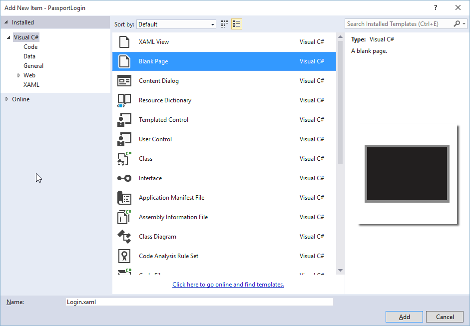
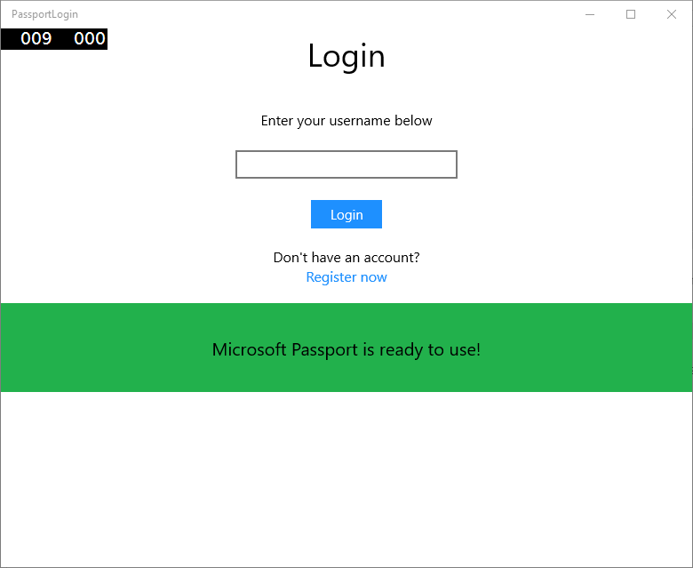
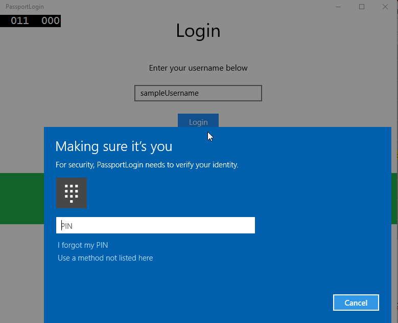

# Create a Windows Hello login app

This is Part 1 of a complete walkthrough on how to create a Windows 10 and Windows 11 UWP (Universal Windows Platform) app that uses Windows Hello as an alternative to traditional username and password authentication systems. The app uses a username for sign-in and create a Hello Key for each account. These accounts will be protected by the PIN that is setup in Windows Settings on configuration of Windows Hello.

This walkthrough is split into two parts: building the app and connecting the backend service. When you're finished with this article, continue on to Part 2: [Windows Hello login service](microsoft-passport-login-auth-service.md).

Before you begin, you should read the [Windows Hello](microsoft-passport.md) overview for a general understanding of how Windows Hello works.

## Get started


In order to build this project, you'll need some experience with C#, and XAML. You'll also need to be using Visual Studio 2015 (Community Edition or greater), or a later release of Visual Studio, on a Windows 10 or Windows 11 machine. While Visual Studio 2015 is the minimum required version, we recommend that you use the latest version of Visual Studio for the latest developer and security updates.

-   Open Visual Studio and select File > New > Project.
-   This will open a “New Project” window. Navigation to Templates > Visual C#.
-   Choose Blank App (Universal Windows) and name your application "PassportLogin".
-   Build and Run the new application (F5), you should see a blank window shown on the screen. Close the application.


## Exercise 1: Login with Microsoft Passport


In this exercise you will learn how to check if Windows Hello is setup on the machine, and how to sign into an account using Windows Hello.

-   In the new project create a new folder in the solution called "Views". This folder will contain the pages that will be navigated to in this sample. Right click on the project in solution explorer, select Add > New Folder, then rename the folder to Views.

    

-   Right click on the new Views folder, select Add > New Item and select Blank Page. Name this page "Login.xaml".

    

-   To define the user interface for the new login page, add the following XAML. This XAML defines a StackPanel to align the following children:

    -   TextBlock that will contain a title.
    -   TextBlock for error messages.
    -   TextBox for the username to input.
    -   Button to navigate to a register page.
    -   TextBlock to contain the status of Windows Hello.
    -   TextBlock to explain the Login page as there is no backend or configured users.

    ```xml
    <Grid Background="{ThemeResource ApplicationPageBackgroundThemeBrush}">
      <StackPanel Orientation="Vertical">
        <TextBlock Text="Login" FontSize="36" Margin="4" TextAlignment="Center"/>
        <TextBlock x:Name="ErrorMessage" Text="" FontSize="20" Margin="4" Foreground="Red" TextAlignment="Center"/>
        <TextBlock Text="Enter your username below" Margin="0,0,0,20"
                   TextWrapping="Wrap" Width="300"
                   TextAlignment="Center" VerticalAlignment="Center" FontSize="16"/>
        <TextBox x:Name="UsernameTextBox" Margin="4" Width="250"/>
        <Button x:Name="PassportSignInButton" Content="Login" Background="DodgerBlue" Foreground="White"
            Click="PassportSignInButton_Click" Width="80" HorizontalAlignment="Center" Margin="0,20"/>
        <TextBlock Text="Don't have an account?"
                    TextAlignment="Center" VerticalAlignment="Center" FontSize="16"/>
        <TextBlock x:Name="RegisterButtonTextBlock" Text="Register now"
                   PointerPressed="RegisterButtonTextBlock_OnPointerPressed"
                   Foreground="DodgerBlue"
                   TextAlignment="Center" VerticalAlignment="Center" FontSize="16"/>
        <Border x:Name="PassportStatus" Background="#22B14C"
                   Margin="0,20" Height="100" >
          <TextBlock x:Name="PassportStatusText" Text="Microsoft Passport is ready to use!"
                 Margin="4" TextAlignment="Center" VerticalAlignment="Center" FontSize="20"/>
        </Border>
        <TextBlock x:Name="LoginExplaination" FontSize="24" TextAlignment="Center" TextWrapping="Wrap" 
            Text="Please Note: To demonstrate a login, validation will only occur using the default username 'sampleUsername'"/>
      </StackPanel>
    </Grid>
    ```

-   A few methods need to be added to the code behind to get the solution building. Either press F7 or use the Solution Explorer to get to the Login.xaml.cs. Add in the following two event methods to handle the Login and Register events. For now these methods will set the ErrorMessage.Text to an empty string.

    ```cs
    namespace PassportLogin.Views
    {
        public sealed partial class Login : Page
        {
            public Login()
            {
                this.InitializeComponent();
            }
     
            private void PassportSignInButton_Click(object sender, RoutedEventArgs e)
            {
                ErrorMessage.Text = "";
            }
            private void RegisterButtonTextBlock_OnPointerPressed(object sender, PointerRoutedEventArgs e)
            {
                ErrorMessage.Text = "";
            }
        }
    }
    ```

-   In order to render the Login page, edit the MainPage code to navigate to the Login page when the MainPage is loaded. Open the MainPage.xaml.cs file. In the solution explorer double click on MainPage.xaml.cs. If you can’t find this click the little arrow next to MainPage.xaml to show the code behind. Create a loaded event handler method that will navigate to the login page. You will need to add a reference to the Views namespace.

    ```cs
    using PassportLogin.Views;
     
    namespace PassportLogin
    {
        public sealed partial class MainPage : Page
        {
            public MainPage()
            {
                this.InitializeComponent();
                Loaded += MainPage_Loaded;
            }
     
            private void MainPage_Loaded(object sender, RoutedEventArgs e)
            {
                Frame.Navigate(typeof(Login));
            }
        }
    }
    ```

-   In the Login page you need to handle the OnNavigatedTo event to validate if Windows Hello is available on this machine. In Login.xaml.cs implement the following. You will notice that the MicrosoftPassportHelper object flags an error. This is because we have not implement it yet.

    ```cs
    public sealed partial class Login : Page
    {
        public Login()
        {
            this.InitializeComponent();
        }
     
        protected override async void OnNavigatedTo(NavigationEventArgs e)
        {
            // Check Microsoft Passport is setup and available on this machine
            if (await MicrosoftPassportHelper.MicrosoftPassportAvailableCheckAsync())
            {
            }
            else
            {
                // Microsoft Passport is not setup so inform the user
                PassportStatus.Background = new SolidColorBrush(Windows.UI.Color.FromArgb(255, 50, 170, 207));
                PassportStatusText.Text = "Microsoft Passport is not setup!\n" + 
                    "Please go to Windows Settings and set up a PIN to use it.";
                PassportSignInButton.IsEnabled = false;
            }
        }
    }
    ```

-   To create the MicrosoftPassportHelper class, right click on the solution PassportLogin (Universal Windows) and click Add > New Folder. Name this folder Utils.

    

-   Right click on the Utils folder and click Add > Class. Name this class "MicrosoftPassportHelper.cs".
-   Change the class definition of MicrosoftPassportHelper to public static, then add the following method that to inform the user if Windows Hello is ready to be used or not. You will need to add the required namespaces.

    ```cs
    using System;
    using System.Diagnostics;
    using System.Threading.Tasks;
    using Windows.Security.Credentials;
     
    namespace PassportLogin.Utils
    {
        public static class MicrosoftPassportHelper
        {
            /// <summary>
            /// Checks to see if Passport is ready to be used.
            /// 
            /// Passport has dependencies on:
            ///     1. Having a connected Microsoft Account
            ///     2. Having a Windows PIN set up for that _account on the local machine
            /// </summary>
            public static async Task<bool> MicrosoftPassportAvailableCheckAsync()
            {
                bool keyCredentialAvailable = await KeyCredentialManager.IsSupportedAsync();
                if (keyCredentialAvailable == false)
                {
                    // Key credential is not enabled yet as user 
                    // needs to connect to a Microsoft Account and select a PIN in the connecting flow.
                    Debug.WriteLine("Microsoft Passport is not setup!\nPlease go to Windows Settings and set up a PIN to use it.");
                    return false;
                }
     
                return true;
            }
        }
    }
    ```

-   In Login.xaml.cs add a reference to the Utils namespace. This will resolve the error in the OnNavigatedTo method.

    ```cs
    using PassportLogin.Utils;
    ```

-   Build and run the application (F5). You will be navigated to the login page and the Windows Hello banner will indicate to you if Hello is ready to be used. You should see either the green or blue banner indicating the Windows Hello status on your machine.

    

    

-   The next thing you need to do is build the logic for signing in. Create a new folder called "Models".
-   In the Models folder create a new class called "Account.cs". This class will act as your account model. As this is a sample it will only contain a username. Change the class definition to public and add the Username property.
    
    ```cs
    namespace PassportLogin.Models
    {
        public class Account
        {
            public string Username { get; set; }
        }
    }
    ```

-   You will need a way to handle accounts. For this hands on lab as there is no server, or a database, a list of users will be saved and loaded locally. Right click on the Utils folder and add a new class called "AccountHelper.cs". Change the class definition to be public static. The AccountHelper is a static class that will contain all the necessary methods to save and load the list of accounts locally. Saving and loading will work by using an XmlSerializer. You will also need to remember the file you saved and where you saved it.
    
    ```cs
    using System;
    using System.Collections.Generic;
    using System.IO;
    using System.Text;
    using System.Threading.Tasks;
    using System.Xml.Serialization;
    using Windows.Storage;
    using PassportLogin.Models;

    namespace PassportLogin.Utils
    {
        public static class AccountHelper
        {
            // In the real world this would not be needed as there would be a server implemented that would host a user account database.
            // For this tutorial we will just be storing accounts locally.
            private const string USER_ACCOUNT_LIST_FILE_NAME = "accountlist.txt";
            private static string _accountListPath = Path.Combine(ApplicationData.Current.LocalFolder.Path, USER_ACCOUNT_LIST_FILE_NAME);
            public static List<Account> AccountList = new List<Account>();
     
            /// <summary>
            /// Create and save a useraccount list file. (Updating the old one)
            /// </summary>
            private static async void SaveAccountListAsync()
            {
                string accountsXml = SerializeAccountListToXml();
     
                if (File.Exists(_accountListPath))
                {
                    StorageFile accountsFile = await StorageFile.GetFileFromPathAsync(_accountListPath);
                    await FileIO.WriteTextAsync(accountsFile, accountsXml);
                }
                else
                {
                    StorageFile accountsFile = await ApplicationData.Current.LocalFolder.CreateFileAsync(USER_ACCOUNT_LIST_FILE_NAME);
                    await FileIO.WriteTextAsync(accountsFile, accountsXml);
                }
            }
     
            /// <summary>
            /// Gets the useraccount list file and deserializes it from XML to a list of useraccount objects.
            /// </summary>
            /// <returns>List of useraccount objects</returns>
            public static async Task<List<Account>> LoadAccountListAsync()
            {
                if (File.Exists(_accountListPath))
                {
                    StorageFile accountsFile = await StorageFile.GetFileFromPathAsync(_accountListPath);
     
                    string accountsXml = await FileIO.ReadTextAsync(accountsFile);
                    DeserializeXmlToAccountList(accountsXml);
                }
     
                return AccountList;
            }
     
            /// <summary>
            /// Uses the local list of accounts and returns an XML formatted string representing the list
            /// </summary>
            /// <returns>XML formatted list of accounts</returns>
            public static string SerializeAccountListToXml()
            {
                XmlSerializer xmlizer = new XmlSerializer(typeof(List<Account>));
                StringWriter writer = new StringWriter();
                xmlizer.Serialize(writer, AccountList);
     
                return writer.ToString();
            }
     
            /// <summary>
            /// Takes an XML formatted string representing a list of accounts and returns a list object of accounts
            /// </summary>
            /// <param name="listAsXml">XML formatted list of accounts</param>
            /// <returns>List object of accounts</returns>
            public static List<Account> DeserializeXmlToAccountList(string listAsXml)
            {
                XmlSerializer xmlizer = new XmlSerializer(typeof(List<Account>));
                TextReader textreader = new StreamReader(new MemoryStream(Encoding.UTF8.GetBytes(listAsXml)));
     
                return AccountList = (xmlizer.Deserialize(textreader)) as List<Account>;
            }
        }
    }
    ```

-   Next, implement a way to add and remove an account from the local list of accounts. These actions will each save the list. The final method that you will need for this hands on lab is a validation method. As there is no auth server or database of users, this will validate against a single user which is hard coded. These methods should be added to the AccountHelper class.
    
    ```cs
    public static Account AddAccount(string username)
            {
                // Create a new account with the username
                Account account = new Account() { Username = username };
                // Add it to the local list of accounts
                AccountList.Add(account);
                // SaveAccountList and return the account
                SaveAccountListAsync();
                return account;
            }
     
            public static void RemoveAccount(Account account)
            {
                // Remove the account from the accounts list
                AccountList.Remove(account);
                // Re save the updated list
                SaveAccountListAsync();
            }
     
            public static bool ValidateAccountCredentials(string username)
            {
                // In the real world, this method would call the server to authenticate that the account exists and is valid.
                // For this tutorial however we will just have an existing sample user that is just "sampleUsername"
                // If the username is null or does not match "sampleUsername" it will fail validation. In which case the user should register a new passport user
     
                if (string.IsNullOrEmpty(username))
                {
                    return false;
                }
     
                if (!string.Equals(username, "sampleUsername"))
                {
                    return false;
                }
     
                return true;
            }
    ```

-   The next thing you need to do is handle a sign in request from the user. In Login.xaml.cs create a new private variable that will hold the current account logging in. Then add a new method call SignInPassport. This will validate the account credentials using the AccountHelper.ValidateAccountCredentials method. This method will return a Boolean value if the entered user name is the same as the hard coded string value you set in the previous step. The hard coded value for this sample is "sampleUsername".

    ```cs
    using PassportLogin.Models;
    using PassportLogin.Utils;
    using System.Diagnostics;
     
    namespace PassportLogin.Views
    {
        public sealed partial class Login : Page
        {
            private Account _account;
     
            public Login()
            {
                this.InitializeComponent();
            }
     
            protected override async void OnNavigatedTo(NavigationEventArgs e)
            {
                // Check Microsoft Passport is setup and available on this machine
                if (await MicrosoftPassportHelper.MicrosoftPassportAvailableCheckAsync())
                {
                }
                else
                {
                    // Microsoft Passport is not setup so inform the user
                    PassportStatus.Background = new SolidColorBrush(Windows.UI.Color.FromArgb(255, 50, 170, 207));
                    PassportStatusText.Text = "Microsoft Passport is not setup!\nPlease go to Windows Settings and set up a PIN to use it.";
                    PassportSignInButton.IsEnabled = false;
                }
            }
     
            private void PassportSignInButton_Click(object sender, RoutedEventArgs e)
            {
                ErrorMessage.Text = "";
                SignInPassport();
            }
     
            private void RegisterButtonTextBlock_OnPointerPressed(object sender, PointerRoutedEventArgs e)
            {
                ErrorMessage.Text = "";
            }
     
            private async void SignInPassport()
            {
                if (AccountHelper.ValidateAccountCredentials(UsernameTextBox.Text))
                {
                    // Create and add a new local account
                    _account = AccountHelper.AddAccount(UsernameTextBox.Text);
                    Debug.WriteLine("Successfully signed in with traditional credentials and created local account instance!");
     
                    //if (await MicrosoftPassportHelper.CreatePassportKeyAsync(UsernameTextBox.Text))
                    //{
                    //    Debug.WriteLine("Successfully signed in with Microsoft Passport!");
                    //}
                }
                else
                {
                    ErrorMessage.Text = "Invalid Credentials";
                }
            }
        }
    }
    ```

-   You may have noticed the commented code that was referencing a method in MicrosoftPassportHelper. In MicrosoftPassportHelper.cs add in a new method called CreatePassportKeyAsync. This method uses the Windows Hello API in the [**KeyCredentialManager**](/uwp/api/Windows.Security.Credentials.KeyCredentialManager). Calling [**RequestCreateAsync**](/previous-versions/windows/dn973048(v=win.10)) will create a Passport key that is specific to the *accountId* and the local machine. Please note the comments in the switch statement if you are interested in implementing this in a real world scenario.

    ```cs
    /// <summary>
    /// Creates a Passport key on the machine using the _account id passed.
    /// </summary>
    /// <param name="accountId">The _account id associated with the _account that we are enrolling into Passport</param>
    /// <returns>Boolean representing if creating the Passport key succeeded</returns>
    public static async Task<bool> CreatePassportKeyAsync(string accountId)
    {
        KeyCredentialRetrievalResult keyCreationResult = await KeyCredentialManager.RequestCreateAsync(accountId, KeyCredentialCreationOption.ReplaceExisting);

        switch (keyCreationResult.Status)
        {
            case KeyCredentialStatus.Success:
                Debug.WriteLine("Successfully made key");

                // In the real world authentication would take place on a server.
                // So every time a user migrates or creates a new Microsoft Passport account Passport details should be pushed to the server.
                // The details that would be pushed to the server include:
                // The public key, keyAttesation if available, 
                // certificate chain for attestation endorsement key if available,  
                // status code of key attestation result: keyAttestationIncluded or 
                // keyAttestationCanBeRetrievedLater and keyAttestationRetryType
                // As this sample has no concept of a server it will be skipped for now
                // for information on how to do this refer to the second Passport sample

                //For this sample just return true
                return true;
            case KeyCredentialStatus.UserCanceled:
                Debug.WriteLine("User cancelled sign-in process.");
                break;
            case KeyCredentialStatus.NotFound:
                // User needs to setup Microsoft Passport
                Debug.WriteLine("Microsoft Passport is not setup!\nPlease go to Windows Settings and set up a PIN to use it.");
                break;
            default:
                break;
        }

        return false;
    }
    ```

-   Now you have created the CreatePassportKeyAsync method, return to the Login.xaml.cs file and uncomment the code inside the SignInPassport method.

    ```cs
    private async void SignInPassport()
    {
        if (AccountHelper.ValidateAccountCredentials(UsernameTextBox.Text))
        {
            //Create and add a new local account
            _account = AccountHelper.AddAccount(UsernameTextBox.Text);
            Debug.WriteLine("Successfully signed in with traditional credentials and created local account instance!");

            if (await MicrosoftPassportHelper.CreatePassportKeyAsync(UsernameTextBox.Text))
            {
                Debug.WriteLine("Successfully signed in with Microsoft Passport!");
            }
        }
        else
        {
            ErrorMessage.Text = "Invalid Credentials";
        }
    }
    ```

-   Build and run the application. You will be taken to the Login page. Type in "sampleUsername" and click login. You will be prompted with a Windows Hello prompt asking you to enter your PIN. Upon entering your PIN correctly the CreatePassportKeyAsync method will be able to create a Windows Hello key. Monitor the output windows to see if the messages indicating success are shown.

    

## Exercise 2: Welcome and User Selection Pages


In this exercise, you will continue from the previous exercise. When a person successfully logs in they should be taken to a welcome page where they can sign out or delete their account. As Windows Hello creates a key for every machine, a user selection screen can be created, which displays all users that have been signed in on that machine. A user can then select one of these accounts and go directly to the welcome screen without needed to re-enter a password as they have already authenticated to access the machine.

-   In the Views folder add a new blank page called "Welcome.xaml". Add the following XAML to complete the user interface. This will display a title, the logged in username, and two buttons. One of the buttons will navigate back to a user list (that you will create later), and the other button will handle forgetting this user.

    ```xml
    <Grid Background="{ThemeResource ApplicationPageBackgroundThemeBrush}">
      <StackPanel Orientation="Vertical">
        <TextBlock x:Name="Title" Text="Welcome" FontSize="40" TextAlignment="Center"/>
        <TextBlock x:Name="UserNameText" FontSize="28" TextAlignment="Center" Foreground="Black"/>

        <Button x:Name="BackToUserListButton" Content="Back to User List" Click="Button_Restart_Click"
                HorizontalAlignment="Center" Margin="0,20" Foreground="White" Background="DodgerBlue"/>

        <Button x:Name="ForgetButton" Content="Forget Me" Click="Button_Forget_User_Click"
                Foreground="White"
                Background="Gray"
                HorizontalAlignment="Center"/>
      </StackPanel>
    </Grid>
    ```

-   In the Welcome.xaml.cs code behind file, add a new private variable that will hold the account that is logged in. You will need to implement a method to override the OnNavigateTo event, this will store the account passed to the welcome page. You will also need to implement the click event for the two buttons defined in the XAML. You will need a reference to the Models and Utils folders.

    ```cs
    using PassportLogin.Models;
    using PassportLogin.Utils;
    using System.Diagnostics;
     
    namespace PassportLogin.Views
    {
        public sealed partial class Welcome : Page
        {
            private Account _activeAccount;
     
            public Welcome()
            {
                InitializeComponent();
            }
     
            protected override void OnNavigatedTo(NavigationEventArgs e)
            {
                _activeAccount = (Account)e.Parameter;
                if (_activeAccount != null)
                {
                    UserNameText.Text = _activeAccount.Username;
                }
            }
     
            private void Button_Restart_Click(object sender, RoutedEventArgs e)
            {
            }
     
            private void Button_Forget_User_Click(object sender, RoutedEventArgs e)
            {
                // Remove it from Microsoft Passport
                // MicrosoftPassportHelper.RemovePassportAccountAsync(_activeAccount);
     
                // Remove it from the local accounts list and resave the updated list
                AccountHelper.RemoveAccount(_activeAccount);
     
                Debug.WriteLine("User " + _activeAccount.Username + " deleted.");
            }
        }
    }
    ```

-   You may have noticed a line commented out in the forget user click event. The account is being removed from your local list but currently there is no way to be removed from Windows Hello. You need to implement a new method in MicrosoftPassportHelper.cs that will handle removing a Windows Hello user. This method will use other Windows Hello APIs to open and delete the account. In the real world when you delete an account the server or database should be notified so the user database remains valid. You will need a reference to the Models folder.

    ```cs
    using PassportLogin.Models;

    /// <summary>
    /// Function to be called when user requests deleting their account.
    /// Checks the KeyCredentialManager to see if there is a Passport for the current user
    /// Then deletes the local key associated with the Passport.
    /// </summary>
    public static async void RemovePassportAccountAsync(Account account)
    {
        // Open the account with Passport
        KeyCredentialRetrievalResult keyOpenResult = await KeyCredentialManager.OpenAsync(account.Username);

        if (keyOpenResult.Status == KeyCredentialStatus.Success)
        {
            // In the real world you would send key information to server to unregister
            //for example, RemovePassportAccountOnServer(account);
        }

        // Then delete the account from the machines list of Passport Accounts
        await KeyCredentialManager.DeleteAsync(account.Username);
    }
    ```

-   Back in Welcome.xaml.cs, uncomment the line that calls RemovePassportAccountAsync.

    ```cs
    private void Button_Forget_User_Click(object sender, RoutedEventArgs e)
    {
        // Remove it from Microsoft Passport
        MicrosoftPassportHelper.RemovePassportAccountAsync(_activeAccount);
     
        // Remove it from the local accounts list and resave the updated list
        AccountHelper.RemoveAccount(_activeAccount);
     
        Debug.WriteLine("User " + _activeAccount.Username + " deleted.");
    }
    ```

-   In the SignInPassport method (of Login.xaml.cs), once the CreatePassportKeyAsync is successful it should navigate to the Welcome screen and pass the Account.

    ```cs
    private async void SignInPassport()
    {
        if (AccountHelper.ValidateAccountCredentials(UsernameTextBox.Text))
        {
            // Create and add a new local account
            _account = AccountHelper.AddAccount(UsernameTextBox.Text);
            Debug.WriteLine("Successfully signed in with traditional credentials and created local account instance!");

            if (await MicrosoftPassportHelper.CreatePassportKeyAsync(UsernameTextBox.Text))
            {
                Debug.WriteLine("Successfully signed in with Microsoft Passport!");
                Frame.Navigate(typeof(Welcome), _account);
            }
        }
        else
        {
            ErrorMessage.Text = "Invalid Credentials";
        }
    }
    ```

-   Build and run the application. Login with "sampleUsername" and click login. Enter your PIN and if successful you should be navigated to the welcome screen. Try clicking forget user and monitor the output window to see if the user was deleted. Notice that when the user is deleted you remain on the welcome page. You will need to create a user selection page that the app can navigate to.

    

-   In the Views folder create a new blank page called "UserSelection.xaml" and add the following XAML to define the user interface. This page will contain a [**ListView**](/uwp/api/Windows.UI.Xaml.Controls.ListView) that displays all the users in the local accounts list, and a Button that will navigate to the login page to allow the user to add another account.

    ```xml
    <Grid Background="{ThemeResource ApplicationPageBackgroundThemeBrush}">
      <StackPanel Orientation="Vertical">
        <TextBlock x:Name="Title" Text="Select a User" FontSize="36" Margin="4" TextAlignment="Center" HorizontalAlignment="Center"/>

        <ListView x:Name="UserListView" Margin="4" MaxHeight="200" MinWidth="250" Width="250" HorizontalAlignment="Center">
          <ListView.ItemTemplate>
            <DataTemplate>
              <Grid Background="DodgerBlue" Height="50" Width="250" HorizontalAlignment="Stretch" VerticalAlignment="Stretch">
                <TextBlock Text="{Binding Username}" HorizontalAlignment="Center" TextAlignment="Center" VerticalAlignment="Center" Foreground="White"/>
              </Grid>
            </DataTemplate>
          </ListView.ItemTemplate>
        </ListView>

        <Button x:Name="AddUserButton" Content="+" FontSize="36" Width="60" Click="AddUserButton_Click" HorizontalAlignment="Center"/>
      </StackPanel>
    </Grid>
    ```

-   In UserSelection.xaml.cs implement the loaded method that will navigate to the login page if there are no accounts in the local list. Also implement the SelectionChanged event for the ListView and a click event for the Button.

    ```cs
    using System.Diagnostics;
    using PassportLogin.Models;
    using PassportLogin.Utils;

    namespace PassportLogin.Views
    {
        public sealed partial class UserSelection : Page
        {
            public UserSelection()
            {
                InitializeComponent();
                Loaded += UserSelection_Loaded;
            }

            private void UserSelection_Loaded(object sender, RoutedEventArgs e)
            {
                if (AccountHelper.AccountList.Count == 0)
                {
                    //If there are no accounts navigate to the LoginPage
                    Frame.Navigate(typeof(Login));
                }


                UserListView.ItemsSource = AccountHelper.AccountList;
                UserListView.SelectionChanged += UserSelectionChanged;
            }

            /// <summary>
            /// Function called when an account is selected in the list of accounts
            /// Navigates to the Login page and passes the chosen account
            /// </summary>
            private void UserSelectionChanged(object sender, RoutedEventArgs e)
            {
                if (((ListView)sender).SelectedValue != null)
                {
                    Account account = (Account)((ListView)sender).SelectedValue;
                    if (account != null)
                    {
                        Debug.WriteLine("Account " + account.Username + " selected!");
                    }
                    Frame.Navigate(typeof(Login), account);
                }
            }

            /// <summary>
            /// Function called when the "+" button is clicked to add a new user.
            /// Navigates to the Login page with nothing filled out
            /// </summary>
            private void AddUserButton_Click(object sender, RoutedEventArgs e)
            {
                Frame.Navigate(typeof(Login));
            }
        }
    }
    ```

<!-- -->

-   There are a few places in the app where you want to navigated to the UserSelection page. In MainPage.xaml.cs you should navigate to the UserSelection page instead of the Login page. While you are in the loaded event in MainPage you will need to load the accounts list so that the UserSelection page can check if there are any accounts. This will require changing the loaded method to be async and also adding a reference to the Utils folder.

    ```cs
    using PassportLogin.Utils;

    private async void MainPage_Loaded(object sender, RoutedEventArgs e)
    {
        // Load the local Accounts List before navigating to the UserSelection page
        await AccountHelper.LoadAccountListAsync();
        Frame.Navigate(typeof(UserSelection));
    }
    ```

-   Next you will want to navigate to the UserSelection page from the Welcome page. In both click events you should navigate back to the UserSelection page.

    ```cs
    private void Button_Restart_Click(object sender, RoutedEventArgs e)
    {
        Frame.Navigate(typeof(UserSelection));
    }

    private void Button_Forget_User_Click(object sender, RoutedEventArgs e)
    {
        // Remove it from Microsoft Passport
        MicrosoftPassportHelper.RemovePassportAccountAsync(_activeAccount);

        // Remove it from the local accounts list and resave the updated list
        AccountHelper.RemoveAccount(_activeAccount);

        Debug.WriteLine("User " + _activeAccount.Username + " deleted.");

        // Navigate back to UserSelection page.
        Frame.Navigate(typeof(UserSelection));
    }
    ```

-   In the Login page you need code to log in to the account selected from the list in the UserSelection page. In OnNavigatedTo event store the account passed to the navigation. Start by adding a new private variable that will identify if the account is an existing account. Then handle the OnNavigatedTo event.

    ```cs
    namespace PassportLogin.Views
    {
        public sealed partial class Login : Page
        {
            private Account _account;
            private bool _isExistingAccount;

            public Login()
            {
                InitializeComponent();
            }

            /// <summary>
            /// Function called when this frame is navigated to.
            /// Checks to see if Microsoft Passport is available and if an account was passed in.
            /// If an account was passed in set the "_isExistingAccount" flag to true and set the _account
            /// </summary>
            protected override async void OnNavigatedTo(NavigationEventArgs e)
            {
                // Check Microsoft Passport is setup and available on this machine
                if (await MicrosoftPassportHelper.MicrosoftPassportAvailableCheckAsync())
                {
                    if (e.Parameter != null)
                    {
                        _isExistingAccount = true;
                        // Set the account to the existing account being passed in
                        _account = (Account)e.Parameter;
                        UsernameTextBox.Text = _account.Username;
                        SignInPassport();
                    }
                }
                else
                {
                    // Microsoft Passport is not setup so inform the user
                    PassportStatus.Background = new SolidColorBrush(Windows.UI.Color.FromArgb(255, 50, 170, 207));
                    PassportStatusText.Text = "Microsoft Passport is not setup!\n" + 
                        "Please go to Windows Settings and set up a PIN to use it.";
                    PassportSignInButton.IsEnabled = false;
                }
            }
        }
    }
    ```

-   The SignInPassport method will need to be updated to sign in to the selected account. The MicrosoftPassportHelper will need another method to open the account with Passport, as the account already has a Passport key created for it. Implement the new method in MicrosoftPassportHelper.cs to sign in an existing user with passport. For information on each part of the code please read through the code comments.

    ```cs
    /// <summary>
    /// Attempts to sign a message using the Passport key on the system for the accountId passed.
    /// </summary>
    /// <returns>Boolean representing if creating the Passport authentication message succeeded</returns>
    public static async Task<bool> GetPassportAuthenticationMessageAsync(Account account)
    {
        KeyCredentialRetrievalResult openKeyResult = await KeyCredentialManager.OpenAsync(account.Username);
        // Calling OpenAsync will allow the user access to what is available in the app and will not require user credentials again.
        // If you wanted to force the user to sign in again you can use the following:
        // var consentResult = await Windows.Security.Credentials.UI.UserConsentVerifier.RequestVerificationAsync(account.Username);
        // This will ask for the either the password of the currently signed in Microsoft Account or the PIN used for Microsoft Passport.

        if (openKeyResult.Status == KeyCredentialStatus.Success)
        {
            // If OpenAsync has succeeded, the next thing to think about is whether the client application requires access to backend services.
            // If it does here you would Request a challenge from the Server. The client would sign this challenge and the server
            // would check the signed challenge. If it is correct it would allow the user access to the backend.
            // You would likely make a new method called RequestSignAsync to handle all this
            // for example, RequestSignAsync(openKeyResult);
            // Refer to the second Microsoft Passport sample for information on how to do this.

            // For this sample there is not concept of a server implemented so just return true.
            return true;
        }
        else if (openKeyResult.Status == KeyCredentialStatus.NotFound)
        {
            // If the _account is not found at this stage. It could be one of two errors. 
            // 1. Microsoft Passport has been disabled
            // 2. Microsoft Passport has been disabled and re-enabled cause the Microsoft Passport Key to change.
            // Calling CreatePassportKey and passing through the account will attempt to replace the existing Microsoft Passport Key for that account.
            // If the error really is that Microsoft Passport is disabled then the CreatePassportKey method will output that error.
            if (await CreatePassportKeyAsync(account.Username))
            {
                // If the Passport Key was again successfully created, Microsoft Passport has just been reset.
                // Now that the Passport Key has been reset for the _account retry sign in.
                return await GetPassportAuthenticationMessageAsync(account);
            }
        }

        // Can't use Passport right now, try again later
        return false;
    }
    ```

-   Update the SignInPassport method in Login.xaml.cs to handle the existing account. This will use the new method in the MicrosoftPassportHelper.cs. If successful the account will be signed in and the user navigated to the welcome screen.

    ```cs
    private async void SignInPassport()
    {
        if (_isExistingAccount)
        {
            if (await MicrosoftPassportHelper.GetPassportAuthenticationMessageAsync(_account))
            {
                Frame.Navigate(typeof(Welcome), _account);
            }
        }
        else if (AccountHelper.ValidateAccountCredentials(UsernameTextBox.Text))
        {
            //Create and add a new local account
            _account = AccountHelper.AddAccount(UsernameTextBox.Text);
            Debug.WriteLine("Successfully signed in with traditional credentials and created local account instance!");

            if (await MicrosoftPassportHelper.CreatePassportKeyAsync(UsernameTextBox.Text))
            {
                Debug.WriteLine("Successfully signed in with Microsoft Passport!");
                Frame.Navigate(typeof(Welcome), _account);
            }
        }
        else
        {
            ErrorMessage.Text = "Invalid Credentials";
        }
    }
    ```

-   Build and run the application. Login with "sampleUsername". Type in your PIN and if successful you will be navigated to the Welcome screen. Click back to user list. You should now see a user in the list. If you click on this Passport enables you to sign back in without having to re-enter any passwords etc.

    

## Exercise 3: Registering a new Windows Hello user


In this exercise you will be creating a new page that will create a new account with Windows Hello. This will work similarly to how the Login page works. The Login page is implemented for an existing user that is migrating to use Windows Hello. A PassportRegister page will create Windows Hello registration for a new user.

-   In the views folder create a new blank page called "PassportRegister.xaml". In the XAML add in the following to setup the user interface. The interface here is similar to the Login page.

    ```xml
    <Grid Background="{ThemeResource ApplicationPageBackgroundThemeBrush}">
      <StackPanel Orientation="Vertical">
        <TextBlock x:Name="Title" Text="Register New Passport User" FontSize="24" Margin="4" TextAlignment="Center"/>

        <TextBlock x:Name="ErrorMessage" Text="" FontSize="20" Margin="4" Foreground="Red" TextAlignment="Center"/>

        <TextBlock Text="Enter your new username below" Margin="0,0,0,20"
                   TextWrapping="Wrap" Width="300"
                   TextAlignment="Center" VerticalAlignment="Center" FontSize="16"/>

        <TextBox x:Name="UsernameTextBox" Margin="4" Width="250"/>

        <Button x:Name="PassportRegisterButton" Content="Register" Background="DodgerBlue" Foreground="White"
            Click="RegisterButton_Click_Async" Width="80" HorizontalAlignment="Center" Margin="0,20"/>

        <Border x:Name="PassportStatus" Background="#22B14C"
                   Margin="4" Height="100">
          <TextBlock x:Name="PassportStatusText" Text="Microsoft Passport is ready to use!" FontSize="20"
                 Margin="4" TextAlignment="Center" VerticalAlignment="Center"/>
        </Border>
      </StackPanel>
    </Grid>
    ```

-   In the PassportRegister.xaml.cs code behind file implement a private Account variable and a click event for the register Button. This will add a new local account and create a Passport key.

    ```cs
    using PassportLogin.Models;
    using PassportLogin.Utils;

    namespace PassportLogin.Views
    {
        public sealed partial class PassportRegister : Page
        {
            private Account _account;

            public PassportRegister()
            {
                InitializeComponent();
            }

            private async void RegisterButton_Click_Async(object sender, RoutedEventArgs e)
            {
                ErrorMessage.Text = "";

                //In the real world you would normally validate the entered credentials and information before 
                //allowing a user to register a new account. 
                //For this sample though we will skip that step and just register an account if username is not null.

                if (!string.IsNullOrEmpty(UsernameTextBox.Text))
                {
                    //Register a new account
                    _account = AccountHelper.AddAccount(UsernameTextBox.Text);
                    //Register new account with Microsoft Passport
                    await MicrosoftPassportHelper.CreatePassportKeyAsync(_account.Username);
                    //Navigate to the Welcome Screen. 
                    Frame.Navigate(typeof(Welcome), _account);
                }
                else
                {
                    ErrorMessage.Text = "Please enter a username";
                }
            }
        }
    }
    ```

-   You need to navigate to this page from the Login page when register is clicked.

    ```cs
    private void RegisterButtonTextBlock_OnPointerPressed(object sender, PointerRoutedEventArgs e)
    {
        ErrorMessage.Text = "";
        Frame.Navigate(typeof(PassportRegister));
    }
    ```

-   Build and run the application. Try to register a new user. Then return to the user list and validate that you can select that user and login.

    

In this lab you have learned the essential skills you need to use the new Windows Hello API to authenticate existing users and create accounts for new users. With this new knowledge you can start removing the need for users to remember passwords for your application, yet remain confident that your applications remain protected by user authentication. Windows 10 and Windows 11 use Windows Hello's new authentication technology to support its biometrics login options.

## Related topics

- [Windows Hello](microsoft-passport.md)
- [Windows Hello login service](microsoft-passport-login-auth-service.md)
