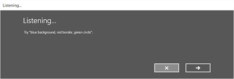
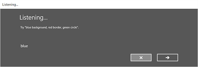
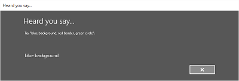

# Speech interactions

Integrate speech recognition and text-to-speech (also known as TTS, or speech synthesis) directly into the user experience of your app.

**Speech recognition**
Speech recognition converts words spoken by the user into text for form input, for text dictation, to specify an action or command, and to accomplish tasks. It supports both predefined grammars for free-text dictation and web search, and custom grammars authored using Speech Recognition Grammar Specification (SRGS) Version 1.0.

**Speech synthesis/Text to Speech (TTS)**
TTS uses a speech synthesis engine (voice) to convert a text string into spoken words. The input string can be either basic, unadorned text or more complex Speech Synthesis Markup Language (SSML). SSML provides a standard way to control characteristics of speech output, such as pronunciation, volume, pitch, rate or speed, and emphasis.

## Speech interaction design

When you design and implement speech thoughtfully, it can be an effective, accessible, and natural way for people to interact with your Windows applications, complementing or even replacing traditional interaction experiences based on a mouse, keyboard, controller, or touch.

These guidelines and recommendations describe how to best integrate both speech recognition and TTS into the interaction experience of your app.

If you're considering supporting speech interactions in your app, ask yourself the following questions:

- What actions can users take through speech? Can they navigate between pages, invoke commands, or enter data as text fields, brief notes, or long messages?
- Is speech input a good option for completing a task?
- How does a user know when speech input is available?
- Is the app always listening, or does the user need to take an action for the app to enter listening mode?
- What phrases initiate an action or behavior? Do the phrases and actions need to be enumerated on screen?
- Are prompt, confirmation, and disambiguation screens or TTS required?
- What is the interaction dialog between app and user?
- Is a custom or constrained vocabulary required (such as medicine, science, or locale) for the context of your app?
- Is network connectivity required?

## Text input

Text input can range from short form input, such as a single word or phrase, to long form input, such as multiple phrases, paragraphs, or continuous dictation. Short form input is typically less than 10 seconds in length, while long form input sessions can be up to two minutes in length. Long form input can restart without user intervention to give the impression of continuous dictation.

Provide a visual cue to indicate that speech recognition is supported and available to the user and whether the user needs to turn it on. For example, use a command bar button with a microphone glyph (see [Command bars](/windows/apps/develop/ui/controls/command-bar)) to show both availability and state.

Provide ongoing recognition feedback to minimize any apparent lack of response while recognition is being performed.

Let users revise recognition text by using keyboard input, disambiguation prompts, suggestions, or additional speech recognition.

Stop recognition if input is detected from a device other than speech recognition, such as touch or keyboard. This input probably indicates that the user moved on to another task, such as correcting the recognition text or interacting with other form fields.

Specify the length of time for which no speech input indicates that recognition is over. Don't automatically restart recognition after this period of time, as it typically indicates the user stopped engaging with your app.

In some cases, a network connection might be required to support speech recognition. If one isn't available, disable all continuous recognition UI and terminate the recognition session.

## Commanding

Speech input can initiate actions, invoke commands, and accomplish tasks.

If space permits, consider displaying the supported responses for the current app context, with examples of valid input. This approach reduces the potential responses your app needs to process and also eliminates confusion for the user.

Try to frame your questions to elicit as specific a response as possible. For example, "What do you want to do today?" is very open ended and requires a very large grammar definition due to how varied the responses could be. Alternatively, "Would you like to play a game or listen to music?" constrains the response to one of two valid answers with a correspondingly small grammar definition. A small grammar is much easier to author and results in much more accurate recognition results.

Request confirmation from the user when speech recognition confidence is low. If the user's intent is unclear, it's better to get clarification than to initiate an unintended action.

Provide a visual cue to indicate that speech recognition is supported and available to the user and whether the user needs to turn it on. For example, use a command bar button with a microphone glyph (see [Guidelines for command bars](/windows/apps/develop/ui/controls/command-bar)) to show both availability and state.

If the speech recognition switch is typically out of view, consider displaying a state indicator in the content area of the app.

If the user initiates recognition, consider using the built-in recognition experience for consistency. The built-in experience includes customizable screens with prompts, examples, disambiguations, confirmations, and errors.

The screens vary depending on the specified constraints:

- Predefined grammar (dictation or web search)
  - The **Listening** screen.
  - The **Thinking** screen.
  - The **Heard you say** screen or the error screen.

- List of words or phrases, or a SRGS grammar file
  - The **Listening** screen.
  - The **Did you say** screen, if what the user said could be interpreted as more than one potential result.
  - The **Heard you say** screen or the error screen.

On the **Listening** screen, you can:

- Customize the heading text.
- Provide example text of what the user can say.
- Specify whether the **Heard you say** screen is shown.
- Read the recognized string back to the user on the **Heard you say** screen.

The following images show an example of the built-in recognition flow for a speech recognizer that uses a SRGS-defined constraint. In this example, speech recognition is successful.

## Always listening

Your app can listen for and recognize speech input as soon as the app launches, without user intervention.

Customize the grammar constraints based on the app context. This approach keeps the speech recognition experience very targeted and relevant to the current task, and minimizes errors.

## "What can I say?"

When you enable speech input, help users discover what the app can understand and what actions it can perform.

If users enable speech recognition, consider using the command bar or a menu command to show all words and phrases supported in the current context.

If speech recognition is always on, consider adding the phrase "What can I say?" to every page. When the user says this phrase, display all words and phrases supported in the current context. Using this phrase provides a consistent way for users to discover speech capabilities across the system.

## Recognition failures

Speech recognition can fail. Failures happen when audio quality is poor, when the recognizer detects only part of a phrase, or when the recognizer detects no input at all.

Handle failure gracefully, help the user understand why recognition failed, and recover.

Your app should inform the user that the recognizer didn't understand them and that they need to try again.

Consider providing examples of one or more supported phrases. The user is likely to repeat a suggested phrase, which increases recognition success.

Display a list of potential matches for the user to select from. This approach can be far more efficient than going through the recognition process again.

Always support alternative input types, which is especially helpful for handling repeated recognition failures. For example, you could suggest that the user try to use a keyboard, or use touch or a mouse to select from a list of potential matches.

Use the built-in speech recognition experience as it includes screens that inform the user that recognition wasn't successful and lets the user make another recognition attempt.

Listen for and try to correct problems in the audio input. The speech recognizer can detect problems with the audio quality that might adversely affect speech recognition accuracy. You can use the information provided by the speech recognizer to inform the user of the problem and let them take corrective action, if possible. For example, if the volume setting on the microphone is too low, you can prompt the user to speak louder or turn the volume up.

## Constraints

Constraints, or grammars, define the spoken words and phrases that the speech recognizer can match. You can specify one of the predefined web service grammars or you can create a custom grammar that you install with your app.

### Predefined grammars

Predefined dictation and web-search grammars provide speech recognition for your app without requiring you to create a grammar. When you use these grammars, a remote web service performs speech recognition and returns the results to the device.

- The default free-text dictation grammar recognizes most words and phrases that a user can say in a particular language. It's optimized to recognize short phrases. Use free-text dictation when you don't want to limit the kinds of things a user can say. Typical uses include creating notes or dictating the content for a message.
- The web-search grammar, like a dictation grammar, contains a large number of words and phrases that a user might say. However, it's optimized to recognize terms that people typically use when searching the web.

> [!NOTE]
> Because predefined dictation and web-search grammars can be large, and because they're online (not on the device), performance might not be as fast as with a custom grammar installed on the device.

These predefined grammars can recognize up to 10 seconds of speech input and require no authoring effort. However, they do require connection to a network.

### Custom grammars

Design and author a custom grammar, and install it with your app. The device performs speech recognition by using a custom constraint.

- Programmatic list constraints provide a lightweight approach to creating simple grammars by using a list of words or phrases. A list constraint works well for recognizing short, distinct phrases. Explicitly specifying all words in a grammar also improves recognition accuracy, as the speech recognition engine must only process speech to confirm a match. You can also update the list programmatically.
- An SRGS grammar is a static document that, unlike a programmatic list constraint, uses the XML format defined by the [SRGS Version 1.0](https://www.w3.org/TR/speech-grammar/). An SRGS grammar provides the greatest control over the speech recognition experience by letting you capture multiple semantic meanings in a single recognition.

  Here are some tips for authoring SRGS grammars:

  - Keep each grammar small. Grammars that contain fewer phrases tend to provide more accurate recognition than larger grammars that contain many phrases. It's better to have several smaller grammars for specific scenarios than to have a single grammar for your entire app.
  - Let users know what to say for each app context and enable and disable grammars as needed.
  - Design each grammar so users can speak a command in a variety of ways. For example, use the **GARBAGE** rule to match speech input that your grammar doesn't define. This rule lets users speak additional words that have no meaning to your app. For example, "give me", "and", "uh", "maybe", and so on.
  - Use the [sapi:subset](/previous-versions/office/developer/speech-technologies/jj572474(v=office.14)) element to help match speech input. This element is a Microsoft extension to the SRGS specification to help match partial phrases.
  - Try to avoid defining phrases in your grammar that contain only one syllable. Recognition tends to be more accurate for phrases containing two or more syllables.
  - Avoid using phrases that sound similar. For example, phrases such as "hello", "bellow", and "fellow" can confuse the recognition engine and result in poor recognition accuracy.

> [!NOTE]
> Which type of constraint you use depends on the complexity of the recognition experience you want to create. Any type could be the best choice for a specific recognition task, and you might find uses for all types of constraints in your app.

### Custom pronunciations

If your app contains specialized vocabulary with unusual or fictional words, or words with uncommon pronunciations, you might be able to improve recognition performance for those words by defining custom pronunciations.

For a small list of words and phrases, or a list of infrequently used words and phrases, create custom pronunciations in an SRGS grammar. See [token Element](/previous-versions/office/developer/speech-technologies/hh361600(v=office.14)) for more info.

For larger lists of words and phrases, or frequently used words and phrases, create separate pronunciation lexicon documents. See [About Lexicons and Phonetic Alphabets](/previous-versions/office/developer/speech-technologies/hh361646(v=office.14)) for more info.

## Testing

Test speech recognition accuracy and any supporting UI with your app's target audience. This approach helps you determine how effective the speech interaction experience is in your app. For example, are users getting poor recognition results because your app doesn't listen for a common phrase?

Either modify the grammar to support this phrase or provide users with a list of supported phrases. If you already provide the list of supported phrases, make sure users can easily find it.

## Text-to-speech (TTS)

TTS generates speech output from plain text or SSML.

Try to design prompts that are polite and encouraging.

Consider whether you should read long strings of text. It's one thing to listen to a text message, but quite another to listen to a long list of search results that are difficult to remember.

Provide media controls to let users pause or stop TTS.

Listen to all TTS strings to ensure they're intelligible and sound natural.

- Stringing together an unusual sequence of words or speaking part numbers or punctuation might cause a phrase to become unintelligible.
- Speech can sound unnatural when the prosody or cadence is different from how a native speaker would say a phrase.

You can address both issues by using SSML instead of plain text as input to the speech synthesizer. For more info about SSML, see [Use SSML to Control Synthesized Speech](/previous-versions/office/developer/speech-technologies/hh378454(v=office.14)) and [Speech Synthesis Markup Language Reference](/previous-versions/office/developer/speech-technologies/hh378377(v=office.14)).

## Samples

- [Speech recognition and speech synthesis sample](https://github.com/Microsoft/Windows-universal-samples/tree/master/Samples/SpeechRecognitionAndSynthesis)
