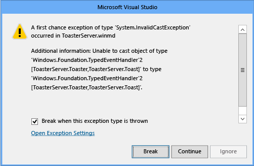

# Raising events in Windows Runtime components

> [!NOTE]
> For more info about raising events in a [C++/WinRT](../cpp-and-winrt-apis/intro-to-using-cpp-with-winrt.md) Windows Runtime Component, see [Author events in C++/WinRT](../cpp-and-winrt-apis/author-events.md).

If your Windows Runtime component raises an event of a user-defined delegate type on a background thread (worker thread), and you want JavaScript to be able to receive the event, then you can implement and/or raise it in any one of these ways.

-   (Option 1) Raise the event through the [**Windows.UI.Core.CoreDispatcher**](/uwp/api/windows.ui.core.coredispatcher) to marshal the event to the JavaScript thread context. Although typically this is the best option, in some scenarios it might not provide the fastest performance.
-   (Option 2) Use **[Windows.Foundation.EventHandler](/uwp/api/windows.foundation.eventhandler-1)\<Object\>** (but lose the event type information). If Option 1 is not feasible, or if its performance is not adequate, then this is a good second choice provided that loss of type information is acceptable. If you're authoring a C# Windows Runtime Component, then the **Windows.Foundation.EventHandler\<Object\>** type is not available; instead, that type is projected to [**System.EventHandler**](/dotnet/api/system.eventhandler), so you should use that instead.
-   (Option 3) Create your own proxy and stub for the component. This option is the most difficult to implement, but it preserves type information and might provide better performance compared to Option 1 in demanding scenarios.

If you just raise an event on a background thread without using one of these options, a JavaScript client will not receive the event.

## Background

All Windows Runtime components and apps are fundamentally COM objects, no matter what language you use to create them. In the Windows API, most of the components are agile COM objects that can communicate equally well with objects on the background thread and on the UI thread. If a COM object can’t be made agile, then it requires helper objects known as proxies and stubs to communicate with other COM objects across the UI thread-background thread boundary. (In COM terms, this is known as communication between thread apartments.)

Most of the objects in the Windows API are either agile or have proxies and stubs built in. However, proxies and stubs can’t be created for generic types such as Windows.Foundation.[TypedEventHandler&lt;TSender, TResult&gt;](/uwp/api/windows.foundation.typedeventhandler-2) because they are not complete types until you provide the type argument. It's only with JavaScript clients that the lack of proxies or stubs becomes an issue, but if you want your component to be usable from JavaScript as well as from C++ or a .NET language, then you must use one of the following three options.

## (Option 1) Raise the event through the CoreDispatcher

You can send events of any user-defined delegate type by using the [Windows.UI.Core.CoreDispatcher](/uwp/api/windows.ui.core.coredispatcher), and JavaScript will be able to receive them. If you are unsure which option to use, try this one first. If latency between the event firing and the event handling becomes an issue, then try one of the other options.

The following example shows how to use the CoreDispatcher to raise a strongly-typed event. Notice that the type argument is Toast, not Object.

```csharp
public event EventHandler<Toast> ToastCompletedEvent;
private void OnToastCompleted(Toast args)
{
    var completedEvent = ToastCompletedEvent;
    if (completedEvent != null)
    {
        completedEvent(this, args);
    }
}

public void MakeToastWithDispatcher(string message)
{
    Toast toast = new Toast(message);
    // Assume you have a CoreDispatcher at class scope.
    // Initialize it here, then use it from the background thread.
    var window = Windows.UI.Core.CoreWindow.GetForCurrentThread();
    m_dispatcher = window.Dispatcher;

    Task.Run( () =>
    {
        if (ToastCompletedEvent != null)
        {
            m_dispatcher.RunAsync(CoreDispatcherPriority.Normal,
            new DispatchedHandler(() =>
            {
                this.OnToastCompleted(toast);
            })); // end m_dispatcher.RunAsync
         }
     }); // end Task.Run
}
```

## (Option 2) Use EventHandler&lt;Object&gt; but lose type information

> [!NOTE]
> If you're authoring a C# Windows Runtime Component, then the **Windows.Foundation.EventHandler\<Object\>** type is not available; instead, that type is projected to [**System.EventHandler**](/dotnet/api/system.eventhandler), so you should use that instead.

Another way to send an event from a background thread is to use [Windows.Foundation.EventHandler](/uwp/api/windows.foundation.eventhandler-1)&lt;Object&gt; as the type of the event. Windows provides this concrete instantiation of the generic type and provides a proxy and stub for it. The downside is that the type information of your event args and sender is lost. C++ and .NET clients must know through documentation what type to cast back to when the event is received. JavaScript clients don’t need the original type information. They find the arg properties, based on their names in the metadata.

This example shows how to use Windows.Foundation.EventHandler&lt;Object&gt; in C#:

```csharp
public sealed Class1
{
// Declare the event
public event EventHandler<Object> ToastCompletedEvent;

    // Raise the event
    public async void MakeToast(string message)
    {
        Toast toast = new Toast(message);
        // Fire the event from a background thread to allow this thread to continue
        Task.Run(() =>
        {
            if (ToastCompletedEvent != null)
            {
                OnToastCompleted(toast);
            }
        });
    }

    private void OnToastCompleted(Toast args)
    {
        var completedEvent = ToastCompletedEvent;
        if (completedEvent != null)
        {
            completedEvent(this, args);
        }
    }
}
```

You consume this event on the JavaScript side like this:

```javascript
toastCompletedEventHandler: function (event) {
   var toastType = event.toast.toastType;
   document.getElementById("toasterOutput").innerHTML = "<p>Made " + toastType + " toast</p>";
}
```

## (Option 3) Create your own proxy and stub

For potential performance gains on user-defined event types that have fully-preserved type information, you have to create your own proxy and stub objects and embed them in your app package. Typically, you have to use this option only in rare situations where neither of the other two options are adequate. Also, there is no guarantee that this option will provide better performance than the other two options. Actual performance depends on many factors. Use the Visual Studio profiler or other profiling tools to measure actual performance in your application and determine whether the event is in fact a bottleneck.

The rest of this article shows how to use C# to create a basic Windows Runtime component, and then use C++ to create a DLL for the proxy and stub that will enable JavaScript to consume a Windows.Foundation.TypedEventHandler&lt;TSender, TResult&gt; event that's raised by the component in an async operation. (You can also use C++ or Visual Basic to create the component. The steps that are related to creating the proxies and stubs are the same.) This walkthrough is based on Creating a Windows Runtime in-process component sample (C++/CX) and helps explain its purposes.

This walkthrough has these parts.

-   Here you will create two basic Windows Runtime classes. One class exposes an event of type [Windows.Foundation.TypedEventHandler&lt;TSender, TResult&gt;](/uwp/api/windows.foundation.typedeventhandler-2) and the other class is the type that's returned to JavaScript as the argument for TValue. These classes can't communicate with JavaScript until you complete the later steps.
-   This app activates the main class object, calls a method, and handles an event that's raised by the Windows Runtime component.
-   These are required by the tools that generate the proxy and stub classes.
-   You then use the IDL file to generate the C source code for the proxy and stub.
-   Register the proxy-stub objects so that the COM runtime can find them, and reference the proxy-stub DLL in the app project.

## To create the Windows Runtime component

In Visual Studio, on the menu bar, choose **File &gt; New Project**. In the **New Project** dialog box, expand **JavaScript &gt; Universal Windows** and then select **Blank App**. Name the project ToasterApplication and then choose the **OK** button.

Add a C# Windows Runtime component to the solution: In Solution Explorer, open the shortcut menu for the solution and then choose **Add &gt; New Project**. Expand **Visual C# &gt; Microsoft Store** and then select **Windows Runtime Component**. Name the project ToasterComponent and then choose the **OK** button. ToasterComponent will be the root namespace for the components you will create in later steps.

In Solution Explorer, open the shortcut menu for the solution and then choose **Properties**. In the **Property Pages** dialog box, select **Configuration Properties** in the left pane, and then at the top of the dialog box, set **Configuration** to **Debug** and **Platform** to x86, x64, or ARM. Choose the **OK** button.

**Important** Platform = Any CPU won’t work because it's not valid for the native-code Win32 DLL that you'll add to the solution later.

In Solution Explorer, rename class1.cs to ToasterComponent.cs so that it matches the name of the project. Visual Studio automatically renames the class in the file to match the new file name.

In the .cs file, add a using directive for the Windows.Foundation namespace to bring TypedEventHandler into scope.

When you require proxies and stubs, your component must use interfaces to expose its public members. In ToasterComponent.cs, define an interface for the toaster, and another one for the Toast that the toaster produces.

**Note** In C# you can skip this step. Instead, first create a class, and then open its shortcut menu and choose **Refactor &gt; Extract Interface**. In the code that's generated, manually give the interfaces public accessibility.

```csharp
	public interface IToaster
        {
            void MakeToast(String message);
            event TypedEventHandler<Toaster, Toast> ToastCompletedEvent;

        }
        public interface IToast
        {
            String ToastType { get; }
        }
```

The IToast interface has a string that can be retrieved to describe the type of toast. The IToaster interface has a method to make toast, and an event to indicate that the toast is made. Because this event returns the particular piece (that is, type) of toast, it's known as a typed event.

Next, we need classes that implement these interfaces, and are public and sealed so that they are accessible from the JavaScript app that you'll program later.

```csharp
	public sealed class Toast : IToast
        {
            private string _toastType;

            public string ToastType
            {
                get
                {
                    return _toastType;
                }
            }
            internal Toast(String toastType)
            {
                _toastType = toastType;
            }

        }
        public sealed class Toaster : IToaster
        {
            public event TypedEventHandler<Toaster, Toast> ToastCompletedEvent;

            private void OnToastCompleted(Toast args)
            {
                var completedEvent = ToastCompletedEvent;
                if (completedEvent != null)
                {
                    completedEvent(this, args);
                }
            }

            public void MakeToast(string message)
            {
                Toast toast = new Toast(message);
                // Fire the event from a thread-pool thread to enable this thread to continue
                Windows.System.Threading.ThreadPool.RunAsync(
                (IAsyncAction action) =>
                {
                    if (ToastCompletedEvent != null)
                    {
                        OnToastCompleted(toast);
                    }
                });
           }
        }
```

In the preceding code, we create the toast and then spin up a thread-pool work item to fire the notification. Although the IDE might suggest that you apply the await keyword to the async call, it isn’t necessary in this case because the method doesn’t do any work that depends on the results of the operation.

**Note** The async call in the preceding code uses ThreadPool.RunAsync solely to demonstrate a simple way to fire the event on a background thread. You could write this particular method as shown in the following example, and it would work fine because the .NET Task scheduler automatically marshals async/await calls back to the UI thread.
  
```csharp
	public async void MakeToast(string message)
    {
        Toast toast = new Toast(message)
        await Task.Delay(new Random().Next(1000));
        OnToastCompleted(toast);
    }
```

If you build the project now, it should build cleanly.

## To program the JavaScript app

Now we can add a button to the JavaScript app to cause it to use the class we just defined to make toast. Before we do this, we must add a reference to the ToasterComponent project we just created. In Solution Explorer, open the shortcut menu for the ToasterApplication project, choose **Add &gt; References**, and then choose the **Add New Reference** button. In the Add Reference dialog box, in the left pane under Solution, select the component project, and then in the middle pane, select ToasterComponent. Choose the **OK** button.

In Solution Explorer, open the shortcut menu for the ToasterApplication project and then choose **Set as Startup Project**.

At the end of the default.js file, add a namespace to contain the functions to call the component and be called back by it. The namespace will have two functions, one to make toast and one to handle the toast-complete event. The implementation of makeToast creates a Toaster object, registers the event handler, and makes the toast. So far, the event handler doesn’t do much, as shown here:

```javascript
	WinJS.Namespace.define("ToasterApplication"), {
       makeToast: function () {

          var toaster = new ToasterComponent.Toaster();
          //toaster.addEventListener("ontoastcompletedevent", ToasterApplication.toastCompletedEventHandler);
          toaster.ontoastcompletedevent = ToasterApplication.toastCompletedEventHandler;
          toaster.makeToast("Peanut Butter");
       },

       toastCompletedEventHandler: function(event) {
           // The sender of the event (the delegate's first type parameter)
           // is mapped to event.target. The second argument of the delegate
           // is contained in event, which means in this case event is a
           // Toast class, with a toastType string.
           var toastType = event.toastType;

           document.getElementById('toastOutput').innerHTML = "<p>Made " + toastType + " toast</p>";
        },
    });
```

The makeToast function must be hooked up to a button. Update default.html to include a button and some space to output the result of making toast:

```html
    <body>
        <h1>Click the button to make toast</h1>
        <button onclick="ToasterApplication.makeToast()">Make Toast!</button>
        <div id="toasterOutput">
            <p>No Toast Yet...</p>
        </div>
    </body>
```

If we weren’t using a TypedEventHandler, we would now be able to run the app on the local machine and click the button to make toast. But in our app, nothing happens. To find out why, let’s debug the managed code that fires the ToastCompletedEvent. Stop the project, and then on the menu bar, choose **Debug &gt; Toaster Application properties**. Change **Debugger Type** to **Managed Only**. Again on the menu bar, choose **Debug &gt; Exceptions**, and then select **Common Language Runtime Exceptions**.

Now run the app and click the make-toast button. The debugger catches an invalid cast exception. Although it’s not obvious from its message, this exception is occurring because proxies are missing for that interface.



The first step in creating a proxy and stub for a component is to add a unique ID or GUID to the interfaces. However, the GUID format to use differs depending on whether you're coding in C#, Visual Basic, or another .NET language, or in C++.

## To generate GUIDs for the component's interfaces (C# and other .NET languages)

On the menu bar, choose Tools &gt; Create GUID. In the dialog box, select 5. \[Guid("xxxxxxxx-xxxx...xxxx")\]. Choose the New GUID button and then choose the Copy button.


Go back to the interface definition, and then paste the new GUID just before the IToaster interface, as shown in the following example. (Don't use the GUID in the example. Every unique interface should have its own GUID.)

```cpp
[Guid("FC198F74-A808-4E2A-9255-264746965B9F")]
        public interface IToaster...
```

Add a using directive for the System.Runtime.InteropServices namespace.

Repeat these steps for the IToast interface.

## To generate GUIDs for the component's interfaces (C++)

On the menu bar, choose Tools &gt; Create GUID. In the dialog box, select 3. static const struct GUID = {...}. Choose the New GUID button and then choose the Copy button.

Paste the GUID just before the IToaster interface definition. After you paste, the GUID should resemble the following example. (Don't use the GUID in the example. Every unique interface should have its own GUID.)
```cpp
// {F8D30778-9EAF-409C-BCCD-C8B24442B09B}
    static const GUID <<name>> = { 0xf8d30778, 0x9eaf, 0x409c, { 0xbc, 0xcd, 0xc8, 0xb2, 0x44, 0x42, 0xb0, 0x9b } };
```
Add a using directive for Windows.Foundation.Metadata to bring GuidAttribute into scope.

Now manually convert the const GUID to a GuidAttribute so that it's formatted as shown in the following example. Notice that the curly braces are replaced with brackets and parentheses, and the trailing semicolon is removed.
```cpp
// {E976784C-AADE-4EA4-A4C0-B0C2FD1307C3}
    [GuidAttribute(0xe976784c, 0xaade, 0x4ea4, 0xa4, 0xc0, 0xb0, 0xc2, 0xfd, 0x13, 0x7, 0xc3)]
    public interface IToaster
    {...
```
Repeat these steps for the IToast interface.

Now that the interfaces have unique IDs, we can create an IDL file by feeding the .winmd file into the winmdidl command-line tool, and then generate the C source code for the proxy and stub by feeding that IDL file into the MIDL command-line tool. Visual Studio do this for us if we create post-build events as shown in the following steps.

## To generate the proxy and stub source code

To add a custom post-build event, in Solution Explorer, open the shortcut menu for the ToasterComponent project and then choose Properties. In the left pane of the property pages, select Build Events, and then choose the Edit Post-build button. Add the following commands to the post-build command line. (The batch file must be called first to set the environment variables to find the winmdidl tool.)

```cpp
call "$(DevEnvDir)..\..\vc\vcvarsall.bat" $(PlatformName)
winmdidl /outdir:output "$(TargetPath)"
midl /metadata_dir "%WindowsSdkDir%References\CommonConfiguration\Neutral" /iid "$(ProjectDir)$(TargetName)_i.c" /env win32 /h "$(ProjectDir)$(TargetName).h" /winmd "Output\$(TargetName).winmd" /W1 /char signed /nologo /winrt /dlldata "$(ProjectDir)dlldata.c" /proxy "$(ProjectDir)$(TargetName)_p.c" "Output\$(TargetName).idl"
```

**Important**  For an ARM or x64 project configuration, change the MIDL /env parameter to x64 or arm32.

To make sure the IDL file is regenerated every time the .winmd file is changed, change **Run the post-build event** to **When the build updates the project output.**
The Build Events property page should resemble this:


Rebuild the solution to generate and compile the IDL.

You can verify that MIDL correctly compiled the solution by looking for ToasterComponent.h, ToasterComponent_i.c, ToasterComponent_p.c, and dlldata.c in the ToasterComponent project directory.

## To compile the proxy and stub code into a DLL

Now that you have the required files, you can compile them to produce a DLL, which is a C++ file. To make this as easy as possible, add a new project to support building the proxies. Open the shortcut menu for the ToasterApplication solution and then choose **Add > New Project**. In the left pane of the **New Project** dialog box, expand **Visual C++ &gt; Windows &gt; Universal Windows**, and then in the middle pane, select **DLL (UWP apps)**. (Notice that this is NOT a C++ Windows Runtime Component project.) Name the project Proxies and then choose the **OK** button. These files will be updated by the post-build events when something changes in the C# class.

By default, the Proxies project generates header .h files and C++ .cpp files. Because the DLL is built from the files produced from MIDL, the .h and .cpp files are not required. In Solution Explorer, open the shortcut menu for them, choose **Remove**, and then confirm the deletion.

Now that the project is empty, you can add back the MIDL-generated files. Open the shortcut menu for the Proxies project, and then choose **Add > Existing Item.** In the dialog box, navigate to the ToasterComponent project directory and select these files: ToasterComponent.h, ToasterComponent_i.c, ToasterComponent_p.c, and dlldata.c files. Choose the **Add** button.

In the Proxies project, create a .def file to define the DLL exports described in dlldata.c. Open the shortcut menu for the project, and then choose **Add > New Item**. In the left pane of the dialog box, select Code and then in the middle pane, select Module-Definition File. Name the file proxies.def and then choose the **Add** button. Open this .def file and modify it to include the EXPORTS that are defined in dlldata.c:

```cpp
EXPORTS
    DllCanUnloadNow         PRIVATE
    DllGetClassObject       PRIVATE
```

If you build the project now, it will fail. To correctly compile this project, you have to change how the project is compiled and linked. In Solution Explorer, open the shortcut menu for the Proxies project and then choose **Properties**. Change the property pages as follows.

In the left pane, select **C/C++ > Preprocessor**, and then in the right pane, select **Preprocessor Definitions**, choose the down-arrow button, and then select **Edit**. Add these definitions in the box:

```cpp
WIN32;_WINDOWS
```
Under **C/C++ > Precompiled Headers**, change **Precompiled Header** to **Not Using Precompiled Headers**, and then choose the **Apply** button.

Under **Linker > General**, change **Ignore Import Library** to **Ye**s, and then choose the **Apply** button.

Under **Linker > Input**, select **Additional Dependencies**, choose the down-arrow button, and then select **Edit**. Add this text in the box:

```cpp
rpcrt4.lib;runtimeobject.lib
```

Do not paste these libs directly into the list row. Use the **Edit** box to ensure that MSBuild in Visual Studio will maintain the correct additional dependencies.

When you have made these changes, choose the **OK** button in the **Property Pages** dialog box.

Next, take a dependency on the ToasterComponent project. This ensures that the Toaster will build before the proxy project builds. This is required because the Toaster project is responsible for generating the files to build the proxy.

Open the shortcut menu for the Proxies project and then choose Project Dependencies. Select the check boxes to indicate that the Proxies project depends on the ToasterComponent project, to ensure that Visual Studio builds them in the correct order.

Verify that the solution builds correctly by choosing **Build > Rebuild Solution** on the Visual Studio menu bar.


## To register the proxy and stub

In the ToasterApplication project, open the shortcut menu for package.appxmanifest and then choose **Open With**. In the Open With dialog box, select **XML Text Editor** and then choose the **OK** button. We're going to paste in some XML that provides a windows.activatableClass.proxyStub extension registration and which are based on the GUIDs in the proxy. To find the GUIDs to use in the .appxmanifest file, open ToasterComponent_i.c. Find entries that resemble the ones in the following example. Also notice the definitions for IToast, IToaster, and a third interface—a typed event handler that has two parameters: a Toaster and Toast. This matches the event that's defined in the Toaster class. Notice that the GUIDs for IToast and IToaster match the GUIDs that are defined on the interfaces in the C# file. Because the typed event handler interface is autogenerated, the GUID for this interface is also autogenerated.

```cpp
MIDL_DEFINE_GUID(IID, IID___FITypedEventHandler_2_ToasterComponent__CToaster_ToasterComponent__CToast,0x1ecafeff,0x1ee1,0x504a,0x9a,0xf5,0xa6,0x8c,0x6f,0xb2,0xb4,0x7d);

MIDL_DEFINE_GUID(IID, IID___x_ToasterComponent_CIToast,0xF8D30778,0x9EAF,0x409C,0xBC,0xCD,0xC8,0xB2,0x44,0x42,0xB0,0x9B);

MIDL_DEFINE_GUID(IID, IID___x_ToasterComponent_CIToaster,0xE976784C,0xAADE,0x4EA4,0xA4,0xC0,0xB0,0xC2,0xFD,0x13,0x07,0xC3);
```

Now we copy the GUIDs, paste them in package.appxmanifest in a node that we add and name Extensions, and then reformat them. The manifest entry resembles the following example—but again, remember to use your own GUIDs. Notice that the ClassId GUID in the XML is the same as ITypedEventHandler2. This is because that GUID is the first one that's listed in ToasterComponent_i.c. The GUIDs here are case-insensitive. Instead of manually reformatting the GUIDs for IToast and IToaster, you can go back into the interface definitions and get the GuidAttribute value, which has the correct format. In C++, there is a correctly-formatted GUID in the comment. In any case, you must manually reformat the GUID that's used for both the ClassId and the event handler.

```cpp
	  <Extensions> <!--Use your own GUIDs!!!-->
        <Extension Category="windows.activatableClass.proxyStub">
          <ProxyStub ClassId="1ecafeff-1ee1-504a-9af5-a68c6fb2b47d">
            <Path>Proxies.dll</Path>
            <Interface Name="IToast" InterfaceId="F8D30778-9EAF-409C-BCCD-C8B24442B09B"/>
            <Interface Name="IToaster"  InterfaceId="E976784C-AADE-4EA4-A4C0-B0C2FD1307C3"/>  
            <Interface Name="ITypedEventHandler_2_ToasterComponent__CToaster_ToasterComponent__CToast" InterfaceId="1ecafeff-1ee1-504a-9af5-a68c6fb2b47d"/>
          </ProxyStub>      
        </Extension>
      </Extensions>
```

Paste the Extensions XML node as a direct child of the Package node, and a peer of, for example, the Resources node.

Before moving on, it’s important to ensure that:

-   The ProxyStub ClassId is set to the first GUID in the ToasterComponent\_i.c file. Use the first GUID that's defined in this file for the classId. (This might be the same as the GUID for ITypedEventHandler2.)
-   The Path is the package relative path of the proxy binary. (In this walkthrough, proxies.dll is in the same folder as ToasterApplication.winmd.)
-   The GUIDs are in the correct format. (This is easy to get wrong.)
-   The interface IDs in the manifest match the IIDs in ToasterComponent\_i.c file.
-   The interface names are unique in the manifest. Because these are not used by the system, you can choose the values. It is a good practice to choose interface names that clearly match interfaces that you have defined. For generated interfaces, the names should be indicative of the generated interfaces. You can use the ToasterComponent\_i.c file to help you generate interface names.

If you try to run the solution now, you will get an error that proxies.dll is not part of the payload. Open the shortcut menu for the **References** folder in the ToasterApplication project and then choose **Add Reference**. Select the check box next to the Proxies project. Also, make sure that the check box next to ToasterComponent is also selected. Choose the **OK** button.

The project should now build. Run the project and verify that you can make toast.

## Related topics

* [Windows Runtime components with C++/CX](creating-windows-runtime-components-in-cpp.md)
