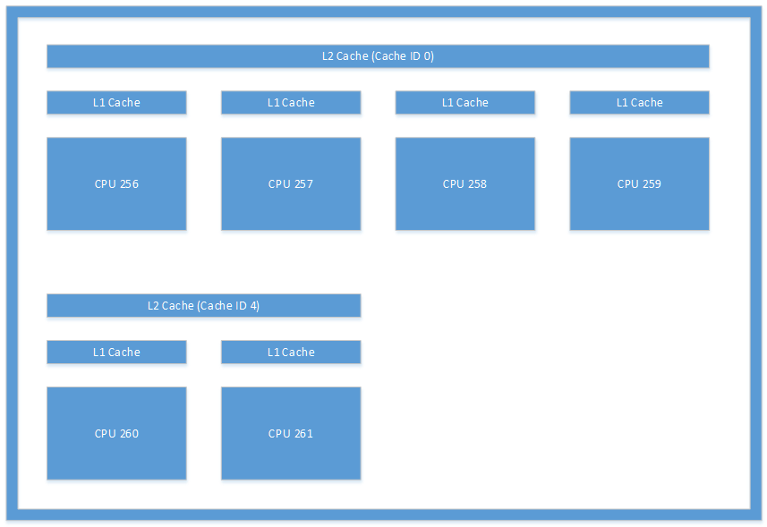

# CPUSets for game development

## Introduction

The Universal Windows Platform (UWP) is at the core of a wide range of consumer electronic devices. As such, it requires a general purpose API to address the needs of all types of applications from games to embedded apps to enterprise software running on servers. By leveraging the right information provided by the API, you can ensure your game runs at its best on any hardware.

## CPUSets API

The CPUSets API provides control over which CPU sets are available for threads to be scheduled on. Two functions are available to control where threads are scheduled:
- **SetProcessDefaultCpuSets** – This function can be used to specify which CPU sets new threads may run on if they are not assigned to specific CPU sets.
- **SetThreadSelectedCpuSets** – This function allows you to limit the CPU sets a specific thread may run on.

If the **SetProcessDefaultCpuSets** function is never used, newly created threads may be scheduled on any CPU set available to your process. This section goes over the basics of the CPUSets API.

### GetSystemCpuSetInformation

The first API used for gathering information is the **GetSystemCpuSetInformation** function. This function populates information in an array of **SYSTEM_CPU_SET_INFORMATION** objects provided by title code. The memory for the destination must be allocated by game code, the size of which is determined by calling **GetSystemCpuSetInformation** itself. This requires two calls to **GetSystemCpuSetInformation** as demonstrated in the following example.

```
unsigned long size;
HANDLE curProc = GetCurrentProcess();
GetSystemCpuSetInformation(nullptr, 0, &size, curProc, 0);

std::unique_ptr<uint8_t[]> buffer(new uint8_t[size]);

PSYSTEM_CPU_SET_INFORMATION cpuSets = reinterpret_cast<PSYSTEM_CPU_SET_INFORMATION>(buffer.get());
  
GetSystemCpuSetInformation(cpuSets, size, &size, curProc, 0);
```

Each instance of **SYSTEM_CPU_SET_INFORMATION** returned contains information about one unique processing unit, also known as a CPU set. This does not necessarily mean that it represents a unique physical piece of hardware. CPUs that utilize hyperthreading will have multiple logical cores running on a single physical processing core. Scheduling multiple threads on different logical cores that reside on the same physical core allows hardware-level resource optimization that would otherwise require extra work to be done at the kernel level. Two threads scheduled on separate logical cores on the same physical core must share CPU time, but would run more efficiently than if they were scheduled to the same logical core.

### SYSTEM_CPU_SET_INFORMATION

The information in each instance of this data structure returned from **GetSystemCpuSetInformation** contains information about a unique processing unit that threads may be scheduled on. Given the possible range of target devices, a lot of the information in the **SYSTEM_CPU_SET_INFORMATION** data structure may not applicable for game development. Table 1 provides an explanation of data members that are useful for game development.

 **Table 1. Data members useful for game development.**

| Member name  | Data type | Description |
| ------------- | ------------- | ------------- |
| Type  | CPU_SET_INFORMATION_TYPE  | The type of information in the structure. If the value of this is not **CpuSetInformation**, it should be ignored.  |
| Id  | unsigned long  | The ID of the specified CPU set. This is the ID that should be used with CPU set functions such as **SetThreadSelectedCpuSets**.  |
| Group  | unsigned short  | Specifies the “processor group” of the CPU set. Processor groups allow a PC to have more than 64 logical cores, and allow for hot swapping of CPUs while the system is running. It is uncommon to see a PC that is not a server with more than one group. Unless you are writing applications meant to run on large servers or server farms, it is best to use CPU sets in a single group because most consumer PCs will only have one processor group. All other values in this structure are relative to the Group.  |
| LogicalProcessorIndex  | unsigned char  | Group relative index of the CPU set  |
| CoreIndex  | unsigned char  | Group relative index of the physical CPU core where the CPU set is located  |
| LastLevelCacheIndex  | unsigned char  | Group relative index of the last cache associated with this CPU set. This is the slowest cache unless the system utilizes NUMA nodes, usually the L2 or L3 cache.  |

<br />

The other data members provide information that is unlikely to describe CPUs in consumer PCs or other consumer devices and is unlikely to be useful. The information provided by the data returned can then be used to organize threads in various ways. The [Considerations for game development](#considerations-for-game-development) section of this white paper details a few ways to leverage this data to optimize thread allocation.

The following are some examples of the type of information gathered from UWP applications running on various types of hardware.

**Table 2. Information returned from a UWP app running on a Microsoft Lumia 950. This is an example of a system that has multiple last level caches. The Lumia 950 features a Qualcomm 808 Snapdragon process that contains a dual core Arm Cortex A57 and quad core Arm Cortex A53 CPUs.**

  

**Table 3. Information returned from a UWP app running on a typical PC. This is an example of a system that uses hyperthreading; each physical core has two logical cores onto which threads can be scheduled. In this case, the system contained an Intel Xenon CPU E5-2620.**

  

**Table 4. Information returned from a UWP app running on a quad core Microsoft Surface Pro 4. This system had an Intel Core i5-6300 CPU.**

  

### SetThreadSelectedCpuSets

Now that information about the CPU sets is available, it can be used to organize threads. The handle of a thread created with **CreateThread** is passed to this function along with an array of IDs of the CPU sets that the thread can be scheduled on. One example of its usage is demonstrated in the following code.

```
HANDLE audioHandle = CreateThread(nullptr, 0, AudioThread, nullptr, 0, nullptr);

unsigned long retsize = 0;
(void)GetSystemCpuSetInformation( nullptr, 0, &retsize,
    GetCurrentProcess(), 0);
 
std::unique_ptr<uint8_t[]> data( new uint8_t[retsize] );
if ( !GetSystemCpuSetInformation(
    reinterpret_cast<PSYSTEM_CPU_SET_INFORMATION>( data.get() ),
    retsize, &retsize, GetCurrentProcess(), 0) )
{
    // Error!
}
 
std::vector<DWORD> cores;
uint8_t const * ptr = data.get();
for( DWORD size = 0; size < retsize; ) {
    auto info = reinterpret_cast<const SYSTEM_CPU_SET_INFORMATION*>( ptr );
    if ( info->Type == CpuSetInformation ) {
         cores.push_back( info->CpuSet.Id );
    }
    ptr += info->Size;
    size += info->Size;
}

if ( cores.size() >= 2 ) {
   SetThreadSelectedCpuSets(audioHandle, cores.data(), 2);
}
```
In this example, a thread is created based on a function declared as **AudioThread**. This thread is then allowed to be scheduled on one of two CPU sets. Thread ownership of the CPU set is not exclusive. Threads that are created without being locked to a specific CPU set may take time from the **AudioThread**. Likewise, other threads created may also be locked to one or both of these CPU sets at a later time.

### SetProcessDefaultCpuSets

The converse to **SetThreadSelectedCpuSets** is **SetProcessDefaultCpuSets**. When threads are created, they do not need to be locked into certain CPU sets. If you do not want these threads to run on specific CPU sets (those used by your render thread or audio thread for example), you can use this function to specify which cores these threads are allowed to be scheduled on.

## Considerations for game development

As we've seen, the CPUSets API provides a lot of information and flexibility when it comes to scheduling threads. Instead of taking the bottom-up approach of trying to find uses for this data, it is more effective to take the top-down approach of finding how the data can be used to accommodate common scenarios.

### Working with time critical threads and hyperthreading

This method is effective if your game has a few threads that must run in real time along with other worker threads that require relatively little CPU time. Some tasks, like continuous background music, must run without interruption for an optimal gaming experience. Even a single frame of starvation for an audio thread may cause popping or glitching, so it is critical that it receives the necessary amount of CPU time every frame.

Using **SetThreadSelectedCpuSets** in conjunction with **SetProcessDefaultCpuSets** can ensure your heavy threads remain uninterrupted by any worker threads. **SetThreadSelectedCpuSets** can be used to assign your heavy threads to specific CPU sets. **SetProcessDefaultCpuSets** can then be used to make sure any unassigned threads created are put on other CPU sets. In the case of CPUs that utilize hyperthreading, it's also important to account for logical cores on the same physical core. Worker threads should not be allowed to run on logical cores that share the same physical core as a thread that you want to run with real time responsiveness. The following code demonstrates how to determine whether a PC uses hyperthreading.

```
unsigned long retsize = 0;
(void)GetSystemCpuSetInformation( nullptr, 0, &retsize,
    GetCurrentProcess(), 0);
 
std::unique_ptr<uint8_t[]> data( new uint8_t[retsize] );
if ( !GetSystemCpuSetInformation(
    reinterpret_cast<PSYSTEM_CPU_SET_INFORMATION>( data.get() ),
    retsize, &retsize, GetCurrentProcess(), 0) )
{
    // Error!
}
 
std::set<DWORD> cores;
std::vector<DWORD> processors;
uint8_t const * ptr = data.get();
for( DWORD size = 0; size < retsize; ) {
    auto info = reinterpret_cast<const SYSTEM_CPU_SET_INFORMATION*>( ptr );
    if ( info->Type == CpuSetInformation ) {
         processors.push_back( info->CpuSet.Id );
         cores.insert( info->CpuSet.CoreIndex );
    }
    ptr += info->Size;
    size += info->Size;
}
 
bool hyperthreaded = processors.size() != cores.size();
```

If the system utilizes hyperthreading, it is important that the set of default CPU sets does not include any logical cores on the same physical core as any real time threads. If the system is not hyperthreading, it is only necessary to make sure that the default CPU sets do not include the same core as the CPU set running your audio thread.

An example of organizing threads based on physical cores can be found in the CPUSets sample available on the GitHub repository linked in the [Additional resources](#additional-resources) section.

### Reducing the cost of cache coherence with last level cache

Cache coherency is the concept that cached memory is the same across multiple hardware resources that act on the same data. If threads are scheduled on different cores, but work on the same data, they may be working on separate copies of that data in different caches. In order to get correct results, these caches must be kept coherent with each other. Maintaining coherency between multiple caches is relatively expensive, but necessary for any multi-core system to operate. Additionally, it is completely out of the control of client code; the underlying system works independently to keep caches up to date by accessing shared memory resources between cores.

If your game has multiple threads that share an especially large amount of data, you can minimize the cost of cache coherency by ensuring that they are scheduled on CPU sets that share a last level cache. The last level cache is the slowest cache available to a core on systems that do not utilize NUMA nodes. It is extremely rare for a gaming PC to utilize NUMA nodes. If cores do not share a last level cache, maintaining coherency would require accessing higher level, and therefore slower, memory resources. Locking two threads to separate CPU sets that share a cache and a physical core may provide even better performance than scheduling them on separate physical cores if they do not require more than 50% of the time in any given frame. 

This code example shows how to determine whether threads that communicate frequently can share a last level cache.

```
unsigned long retsize = 0;
(void)GetSystemCpuSetInformation(nullptr, 0, &retsize,
    GetCurrentProcess(), 0);
 
std::unique_ptr<uint8_t[]> data(new uint8_t[retsize]);
if (!GetSystemCpuSetInformation(
    reinterpret_cast<PSYSTEM_CPU_SET_INFORMATION>(data.get()),
    retsize, &retsize, GetCurrentProcess(), 0))
{
    // Error!
}

bool sharedcache = false;
 
std::map<unsigned char, std::vector<const SYSTEM_CPU_SET_INFORMATION*>> cachemap;
uint8_t const * ptr = data.get();
for(DWORD size = 0; size < retsize;)
{
    auto cpuset = reinterpret_cast<const SYSTEM_CPU_SET_INFORMATION*>(ptr);
    if (cpuset->Type == CpuSetInformation)
    {
        if (cachemap.find(cpuset->CpuSet.LastLevelCacheIndex) == cachemap.end())
        {
            std::pair<unsigned char, std::vector<const SYSTEM_CPU_SET_INFORMATION*>> newvalue;
            newvalue.first = cpuset->CpuSet.LastLevelCacheIndex;
            newvalue.second.push_back(cpuset);
            cachemap.insert(newvalue);
        }
        else
        {
            sharedcache = true;
            cachemap[cpuset->CpuSet.LastLevelCacheIndex].push_back(cpuset);
        }
    }
    ptr += cpuset->Size;
    size += cpuset->Size;
}
```

The cache layout illustrated in Figure 1 is an example of the type of layout you might see from a system. This figure is an illustration of the caches found in a Microsoft Lumia 950. Inter-thread communication occurring between CPU 256 and CPU 260 would incur significant overhead because it would require the system to keep their L2 caches coherent.

**Figure 1. Cache architecture found on a Microsoft Lumia 950 device.**



## Summary

The CPUSets API available for UWP development provides a considerable amount of information and control over your multithreading options. The added complexities compared to previous multithreaded APIs for Windows development has some learning curve, but the increased flexibility ultimately allows for better performance across a range of consumer PCs and other hardware targets.

## Additional resources
- [CPU Sets (MSDN)](/windows/desktop/ProcThread/cpu-sets)
- [CPUSets sample provided by ATG](https://github.com/microsoft/Xbox-ATG-Samples/tree/master/UWPSamples/System/CPUSets)
- [UWP on Xbox One](index.md)
