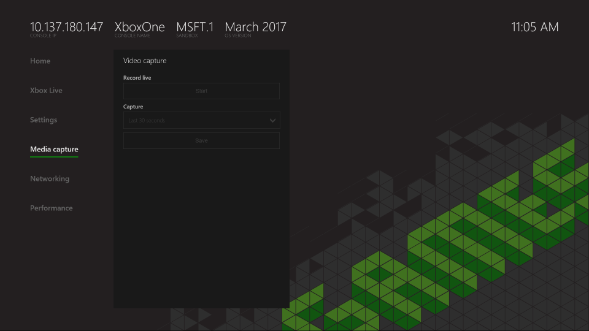

# Media Capture Page (Dev Home)
   
  
The **Media capture** page of Dev Home captures video of the title that is currently running on the console.   
    
  
The **Media capture** page contains the following panes:   
 
   *  [Video capture](#ID4EHB)  

 

   

## Video capture  
   
  
The **Video capture** pane contains tools that record a video stream from the developer console. You can also capture video of the last few seconds from the console.   
  

   

## See also  
 [Developer Home on the Console (Dev Home)](dev-home.md)

  