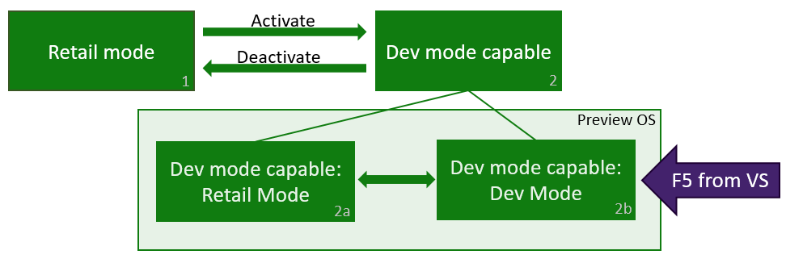
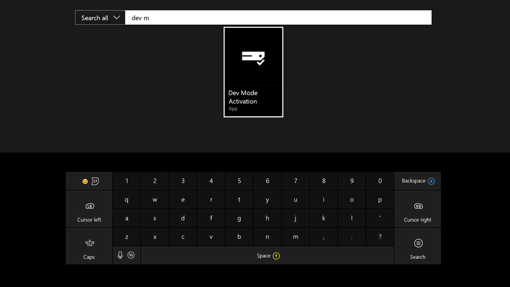
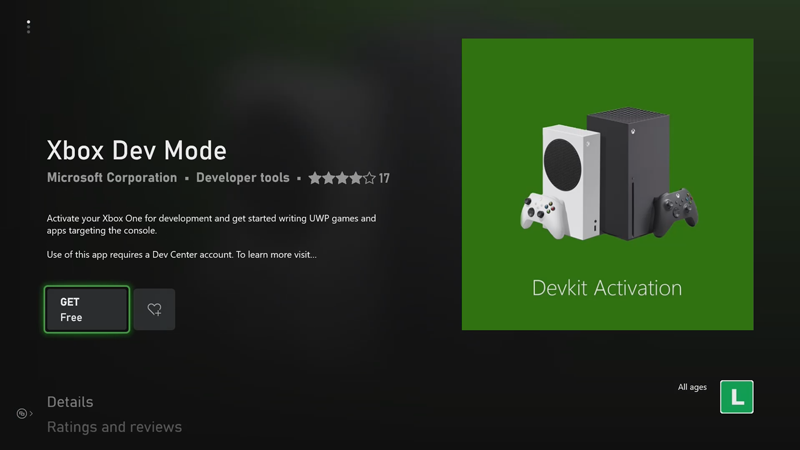
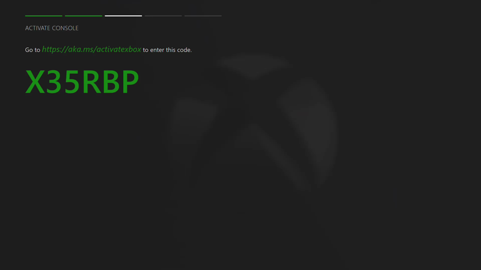
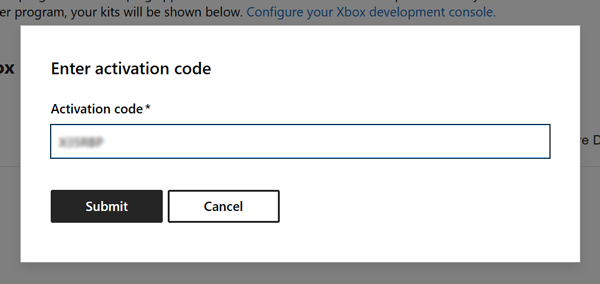
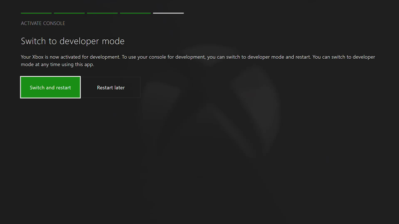
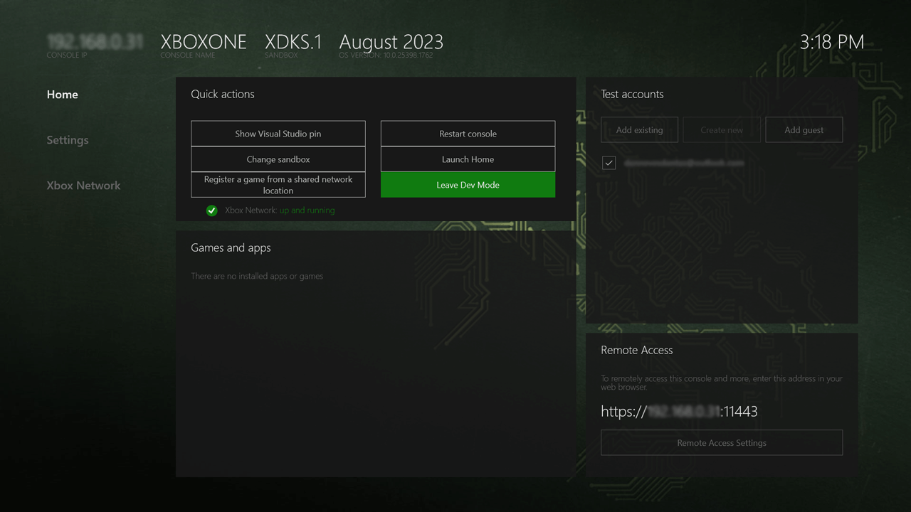
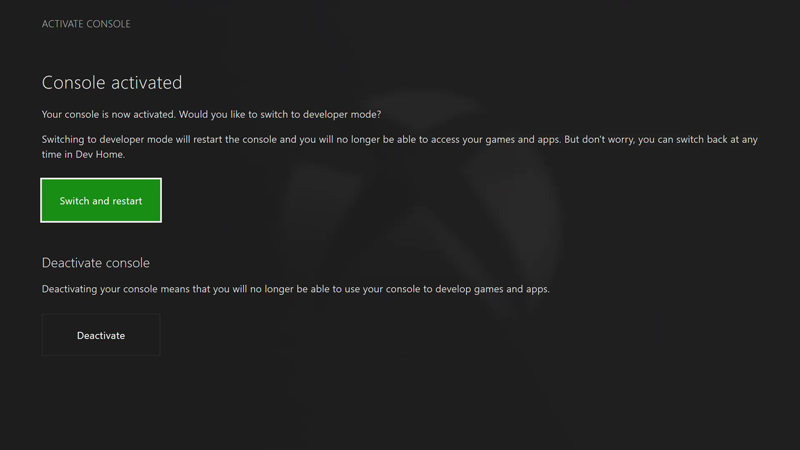

# Xbox Developer Mode activation

## How Developer Mode works
This article only applies to Xbox One and Xbox Series X|S consoles acquired through retail channels. For development kit HW acquired via a managed development program, see the note at the end of the article.

Xbox retail consoles can have two modes, Retail Mode (1) and Developer Mode (2). In Retail Mode, the console is in its normal state: you can play games and run apps acquired through the Microsoft Store. In Developer Mode, you can develop and test software for the console, but you cannot play retail games or run retail apps.

Developer Mode can be enabled on any retail Xbox console, via the [Xbox Dev Mode](https://www.microsoft.com/p/xbox-dev-mode/9nljhzjrn0f4) app found in the Microsoft Store. After Developer Mode is enabled on your retail console, you can switch back and forth between Retail (2a) and Developer Modes (2b).

> [!NOTE]
> Do not run the Xbox Dev Mode app on any Xbox development hardware acquired through an Xbox managed program (for example, ID@Xbox) or you may introduce errors and delays while developing your game. If you're a managed partner, you can get more information on activating development hardware. Go to https://developer.microsoft.com/games/xbox/docs/gdk/provisioning-role.

  

## Activate Developer Mode on your retail Xbox console

1.	Start your Xbox console.

2.	Search for and install the **Xbox Dev Mode** app from the Microsoft Store.

    

3.	Launch the app from the Store page.

    

4.	Note the code displayed in the Xbox Dev Mode app.

    
    
5.	[Register an app developer account in Partner Center](https://developer.microsoft.com/store/register). This is also the first step towards publishing your game.

6.	Sign in to [Partner Center](https://partner.microsoft.com/dashboard) with your valid, current Partner Center app developer account. If you don't see multiple options in the left hand navigation pane, or don't see the **Create a new app** option in the **Overview** section, the following steps and activation links _will not work_; make sure you fully registered your app developer account from the previous step.

7.	Go to [partner.microsoft.com/xboxconfig/devices](https://partner.microsoft.com/xboxconfig/devices).

8.	Enter the activation code displayed in the Xbox Dev Mode app. You have a limited number of activations associated with your account. After Developer Mode has been activated, Partner Center will indicate you have used one of the activations associated with your account.

    

9.	Click **Agree and activate**. This will cause the page to reload, and you will see your device populate in the table. Terms for the Xbox Developer Mode Activation Program agreement can be found at [Xbox Developer Mode Activation Program](/legal/windows/agreements/xbox-one-developer-mode-activation).

10.	After you’ve entered your activation code, your console will display a progress screen for the activation process.

11.	After activation has completed, open the Xbox Dev Mode app and click **Switch and restart** to go to Developer Mode. Note that this will take longer than usual.

    

## Switch between Retail and Developer Mode
After Developer Mode has been enabled on your console, use **Dev Home** to switch between Retail Mode and Developer Mode. To learn more about starting and using Dev Home, see [Introduction to Xbox tools](introduction-to-xbox-tools.md).

* To switch to Retail Mode, open **Dev Home**. Under **Quick Actions**, select **Leave Dev Mode**. This will restart your console in Retail Mode.

  

* To switch to Developer Mode, use the Xbox Dev Mode app. Open the app and select **Switch and restart**. This will restart your console in Developer Mode.

  

## See also
- [Xbox Developer Mode deactivation](devkit-deactivation.md)
- [UWP on Xbox One](index.md)
