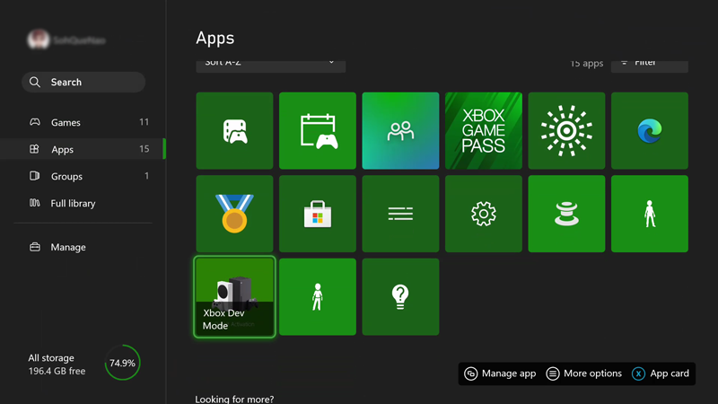
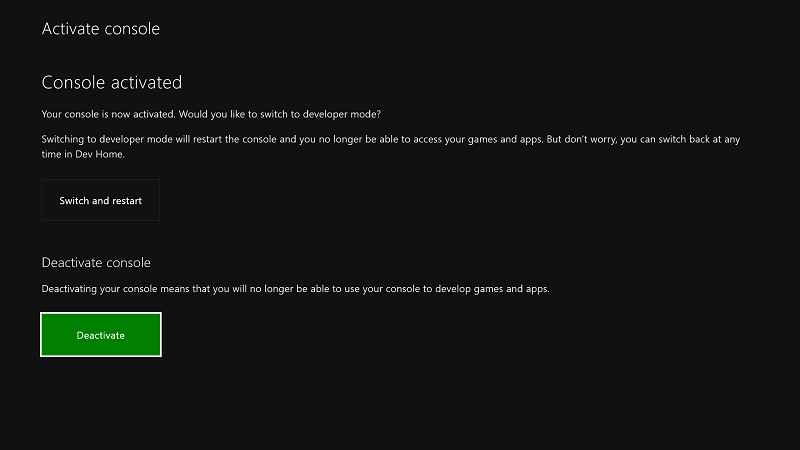
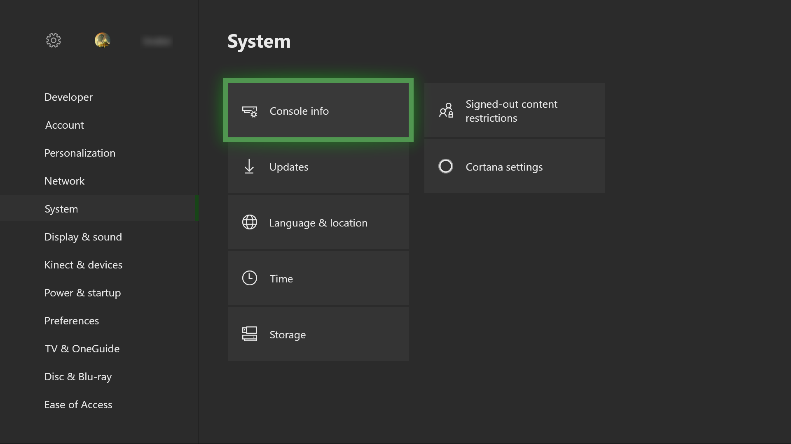
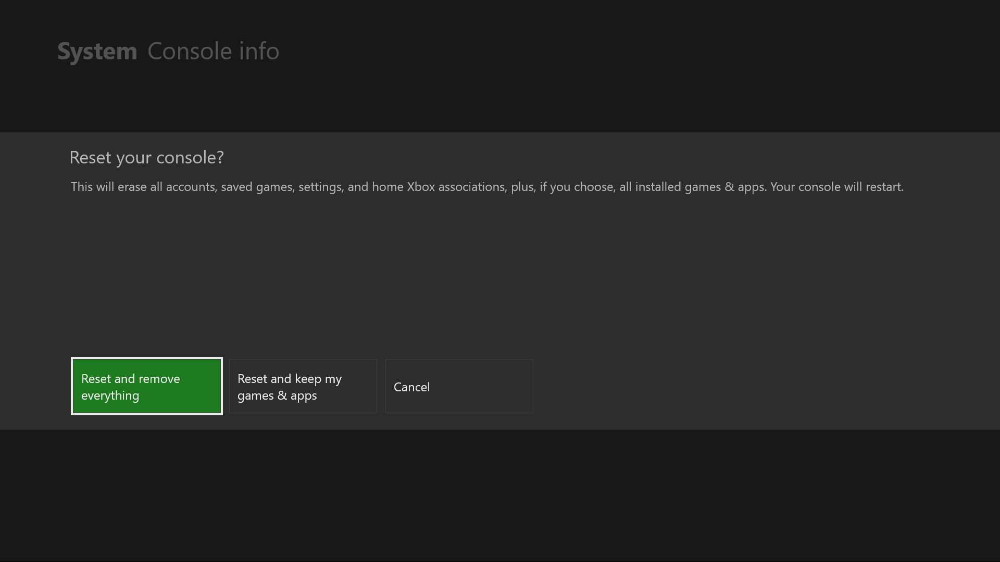
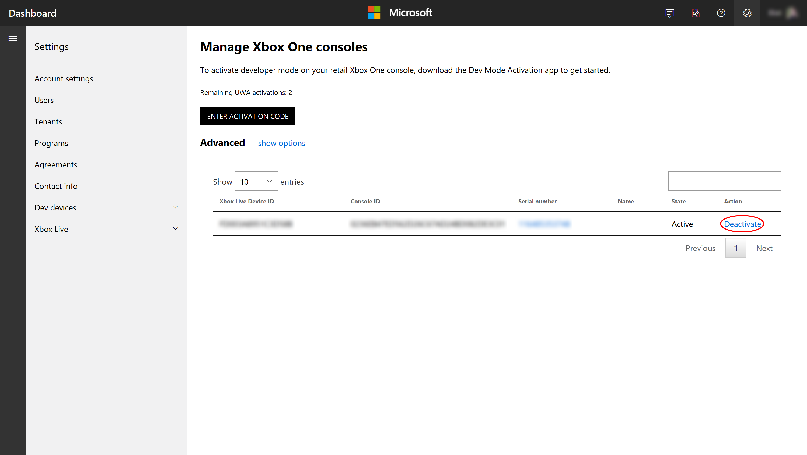

# Xbox Developer Mode deactivation

If you decide you no longer want to use your console for development, use the following steps to deactivate Developer Mode.

## Switch to Retail Mode

First, return your Xbox console to Retail Mode.

1. Open **Dev Home**.

2. Select **Leave Dev Mode**. Your console will restart in Retail Mode.

   

Now deactivate your console by using one of the following methods.

## Deactivate your console using the Xbox Dev Mode app

The preferred method of deactivating Developer Mode on your console is to use the [Xbox Dev Mode](https://www.microsoft.com/p/xbox-dev-mode/9nljhzjrn0f4) app. 

1. Navigate to **My Games & apps** > **Apps**.
  
   
   
2.  Open the Xbox Dev Mode app.

3.  Select **Deactivate**.
  
    

See [Xbox Developer Mode activation](devkit-activation.md) for more information about the [Xbox Dev Mode](https://www.microsoft.com/p/xbox-dev-mode/9nljhzjrn0f4) app. 

## Reset your console

You can also deactivate Developer Mode by resetting your console.  

> [!NOTE]
> When you reset your console, all local save game data will be lost.

To reset your console perform the following steps:

1.  Go to **My Games & apps**.

2.  Select **Apps**, and then select **Settings**.

3.  Go to **System** in the left pane, and then select **Console info** in the right pane.   
   
    
    
4.  Select **Reset console**.
    
    
    
5.  Next, select **RESET AND REMOVE EVERYTHING**. This option resets the console to its original retail state.  All of your apps, games, and local save data will be deleted. Note that choosing the other option, **Reset and keep my games & apps**, will not remove your console from the developer program.
   
    

## Deactivate your console using Partner Center

If you are unable to access your console for any reason, you can also deactivate Developer Mode on your console by using Partner Center.

1. Navigate to the [Manage Xbox devices](https://partner.microsoft.com/xboxconfig/devices) page in Partner Center. You may be prompted to sign in.

2. Find the console that you want to deactivate in the list of consoles by matching the serial number, console ID, or the device ID.  

3. Click the **X** button under "Actions" to Deactivate.
  

If you didn't previously return your Xbox console to Retail Mode, do so now, as described in [Switch to Retail Mode](#switch-to-retail-mode).

## See also
- [Xbox Developer Mode activation](devkit-activation.md)
- [UWP on Xbox One](index.md)
