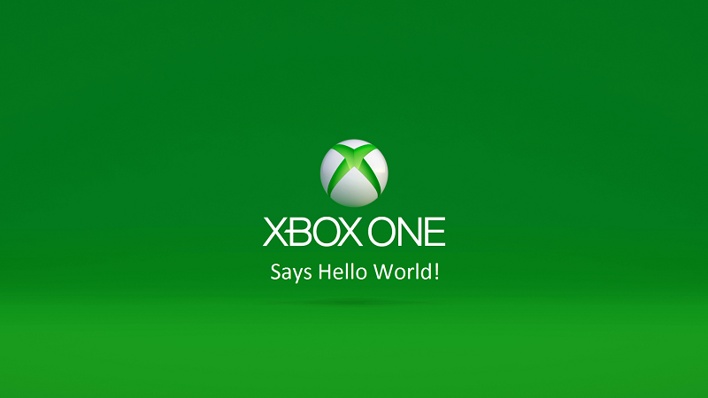

# Getting started with UWP app development on Xbox One

**Carefully** follow these steps to successfully set up your PC and Xbox One for Universal Windows Platform (UWP) development. After you’ve got things set up, you can learn more about Developer Mode on Xbox One and building UWP apps on the [UWP for Xbox One](index.md) page. 

## Before you start

Before you start you will need to do the following:
-	Set up a PC with the latest version of Windows 10.
<!-- -	Install Microsoft Visual Studio 2015 Update 3 or Microsoft Visual Studio 2019.

    > [!NOTE]
    > Visual Studio 2019 is required if you are using the Windows 10, build 15063 SDK. -->

- Have at least five gigabytes of free space on your Xbox One console.

## Setting up your development PC

1.	Install Visual Studio 2015 Update 3, Visual Studio 2017, or Visual Studio 2019.

    If you're installing Visual Studio 2015 Update 3, make sure that you choose **Custom** install and select the **Universal Windows App Development Tools** check box – it's not part of the default install. If you are a C++ developer, make sure that you choose **Custom install** and select **C++**.

    If you're installing Visual Studio 2017 or Visual Studio 2019, make sure that you choose the **Universal Windows Platform development** workload. If you're a C++ developer, in the **Summary** pane on the right, under **Universal Windows Platform development**, make sure that you select the **C++ Universal Windows Platform tools** checkbox. It's not part of the default install.

    For more information, see [Set up your UWP on Xbox development environment](development-environment-setup.md).

2.	Install the latest [Windows 10 SDK](https://developer.microsoft.com/windows/downloads/windows-10-sdk).

3.  Enable Developer Mode for your development PC (**Settings / Update & Security / For developers / Use developer features / Developer mode**).

Now that your development PC is ready, continue reading to see how to set up your Xbox One for development and create and deploy a UWP app to it.
 
 

## Setting up your Xbox One console

1.	Activate Developer Mode on your Xbox One. Download the app, get the activation code, and then enter it into the **Manage Xbox One consoles** page in your Partner Center app developer account. For more information, see [Xbox One Developer Mode activation](devkit-activation.md). 

2.	Open the **Dev Mode Activation** app and select **Switch and restart**. Congratulations, you now have an Xbox One in Developer Mode!
  
  > [!NOTE]
  > Your retail games and apps won’t run in Developer Mode, but the apps or games you create will. Switch back to Retail Mode to run your favorite games and apps.
    
  > [!NOTE]
  > Before you can deploy an app to your Xbox One in Developer Mode, you must have a user signed in on the console. You can either use your existing Xbox Live account or create a new account for your console in Developer Mode. 

## Creating your first project in Visual Studio

For more detailed information, see [Set up your UWP on Xbox development environment](development-environment-setup.md).

1.	**For C#**: Create a new Universal Windows project, and in the **Solution Explorer**, right-click the project and select **Properties**. Select the **Debug** tab, change **Target device** to **Remote Machine**, type the IP address or hostname of your Xbox One console into the **Remote machine** field, and select **Universal (Unencrypted Protocol)** in the **Authentication Mode** drop-down list.   

    You can find your Xbox One IP address by starting Dev Home on your console (the big tile on the right side of Home) and looking at the top left corner. For more information about Dev Home, see [Introduction to Xbox One tools](introduction-to-xbox-tools.md).  

2.	**For C++ and HTML/JavaScript projects**: You follow a path similar to C# projects, but in the project properties go to the **Debugging** tab, select **Remote Machine** in the Debugger to open the drop-down list, type the IP address or hostname of the console into the **Machine Name** field, and select **Universal (Unencrypted Protocol)** in the **Authentication Type** field.

3. Select **x64** from the dropdown to the left of the green play button in the top menu bar.
   
4.	When you press F5, your app will build and start to deploy on your Xbox One.
  
5.	The first time you do this, Visual Studio will prompt you for a PIN for your Xbox One. You can get a PIN by starting Dev Home on your Xbox One and selecting the **Show Visual Studio pin** button.
  
6.	After you have paired, your app will start to deploy. The first time you do this it might be a bit slow (we have to copy all the tools over to your Xbox), but if it takes more than a few minutes, something is probably wrong. Make sure that you have followed all of the steps above (particularly, did you set the **Authentication Mode** to **Universal**?) and that you are using a wired network connection to your Xbox One.  

7. Sit back and relax. Enjoy your first app running on the console!  

## That's it!

## See also  
- [Frequently asked questions](frequently-asked-questions.yml)  
- [Known issues with UWP on Xbox Developer Program](known-issues.md)
- [UWP on Xbox One](index.md) 
