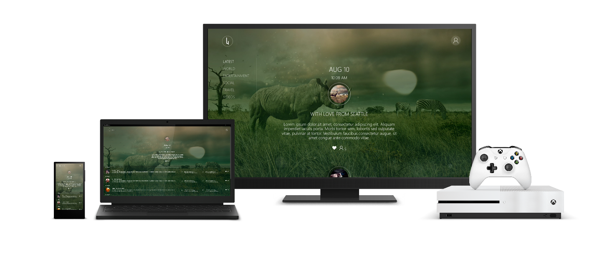

# UWP on Xbox samples

There are several cross-platform UWP samples that have been optimized for Xbox when running on that platform. You can browse the code on GitHub, read through the readme's and wiki's, and clone the projects to your machine.

## TVHelpers

TVHelpers is a set of JavaScript and XAML/C# samples and libraries to help you build great Xbox and TV experiences in JavaScript and C#. TVJS is a library that helps you build premium Universal Windows Platform (UWP) apps for Xbox.

TVJS includes support for automatic controller navigation, rich media playback, search, and more. You can use TVJS with your hosted web app just as easily as with a packaged web UWP app with full access to the Windows Runtime APIs.

For more information, see the [TVHelpers](https://github.com/Microsoft/TVHelpers) project and the project [wiki](https://github.com/Microsoft/TVHelpers/wiki).

## The News Experience

[The News Experience](https://github.com/Microsoft/uwp-experiences/tree/news/apps/News), Fourth Coffee, is a sample news app that works across desktop, phone, and Xbox and offers a premium experience that takes advantage of each device's strengths. On Xbox, it's optimized for gamepad, the UI is tailored to the 10-foot experience, and it keeps content in the TV-safe area, among other optimizations. See [the blog post](https://blogs.windows.com/buildingapps/2016/09/09/tailoring-your-app-for-xbox-and-the-tv-app-dev-on-xbox-series/) for more information.

## Gamepad-style navigation (XAML) sample

The [Gamepad-style navigation (XAML) sample](https://github.com/Microsoft/Windows-universal-samples/tree/master/Samples/XamlGamepadNavigation) is a UWP sample that shows ways of improving directional navigation in your app. While this is also applicable to desktop applications, where a customer may want to be able to use a keyboard to navigate the app, it's especially relevant to Xbox applications, where the main method of input is gamepad or remote control.

## WebView-based media app samples

The [Media App Samples for Xbox](https://github.com/microsoft/Media-App-Samples-for-Xbox) show how to build both music and video media apps hosted inside of a WebView control for the Xbox platform. This can be a helpful architecture if you already have an app that runs in a browser that you want to bring to console, or if you prefer to work primarily in web technologies like JavaScript.

## See also

- [UWP on Xbox One](index.md)
