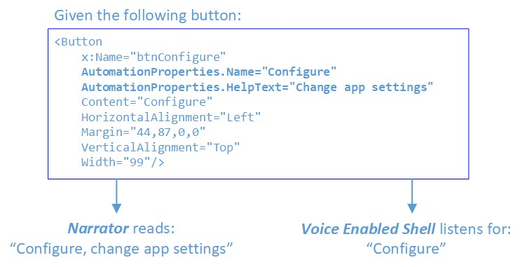

# Using Speech to Invoke UI Elements

Voice Enabled Shell (VES) is an extension to the Windows Speech Platform that enables a first-class speech experience inside apps, allowing users to use speech for invoking on-screen controls and to insert text via dictation. VES strives to provide a common end-to-end see-it-say-it experience on all Windows Shells and devices, with minimum effort required from app developers.  To achieve this, it leverages the Microsoft Speech Platform  and the UI Automation (UIA) framework.

## User experience walkthrough ##
The following is an overview of what a user would experience when using VES on Xbox, and it should help set the context before diving into the details of how VES works.

- User turns on the Xbox console and wants to browse through their apps to find something of interest:

    > User: "Hey Cortana, open My Games and Apps"

- User is left in Active Listening Mode (ALM), meaning the console is now listening for the user to invoke a control that's visible on the screen, without needing to say, "Hey Cortana" each time.  User can now switch to view apps and scroll through the app list:

    > User: "applications"

- To scroll the view, user can simply say:

    > User: "scroll down"

- User sees the box art for the app they are interested in but forgot the name.  User asks for voice tip labels to be displayed:

    > User: "show labels"

- Now that it's clear what to say, the app can be launched:

    > User: "movies and TV"

- To exit active listening mode, user tells Xbox to stop listening:

    > User: "stop listening"

- Later on, a new active listening session can be started with:

    > User: "Hey Cortana, make a selection" or "Hey Cortana, select"

## UI automation dependency ##
VES is a UI Automation client and relies on information exposed by the app through its UI Automation providers. This is the same infrastructure already being used by the Narrator feature on Windows platforms.  UI Automation enables programmatic access to user interface elements, including the name of the control, its type and what control patterns it implements.  As the UI changes in the app, VES will react to UIA update events and re-parse the updated UI Automation tree to find all the actionable items, using this information to build a speech recognition grammar. 

All UWP apps have access to the UI Automation framework and can expose information about the UI independent of which graphics framework they are built upon (XAML, DirectX/Direct3D, etc.).  In some cases, like XAML, most of the heavy lifting is done by the framework, greatly reducing the work required to support Narrator and VES.

For more info on UI Automation see [UI Automation Fundamentals](/dotnet/framework/ui-automation/ui-automation-fundamentals "UI Automation Fundamentals").

## Control invocation name ##
VES employs the following heuristic for determining what phrase to register with the speech recognizer as the control's name (ie. what the user needs to speak to invoke the control).  This is also the phrase that will show up in the voice tip label.

Source of Name in order of priority:

1. If the element has a `LabeledBy` attached property, VES will use the `AutomationProperties.Name` of this text label.
2. `AutomationProperties.Name` of the element.  In XAML, the text content of the control will be used as the default value for `AutomationProperties.Name`.
3. If the control is a ListItem or Button, VES will look for the first child element with a valid `AutomationProperties.Name`.

## Actionable controls ##
VES considers a control actionable if it implements one of the following Automation control patterns:

- **InvokePattern** (eg. Button)- Represents controls that initiate or perform a single, unambiguous action and do not maintain state when activated.

- **TogglePattern** (eg. Check Box) - Represents a control that can cycle through a set of states and maintain a state once set.

- **SelectionItemPattern** (eg. Combo Box) - Represents a control that acts as a container for a collection of selectable child items.

- **ExpandCollapsePattern** (eg. Combo Box) - Represents controls that visually expand to display content and collapse to hide content.

- **ScrollPattern** (eg. List) - Represents controls that act as scrollable containers for a collection of child elements.

## Scrollable containers ##
For scrollable containers that support the ScrollPattern, VES will listen for voice commands like "scroll left", "scroll right", etc. and will invoke Scroll with the appropriate parameters when the user triggers one of these commands.  Scroll commands are injected based on the value of the `HorizontalScrollPercent` and `VerticalScrollPercent` properties.  For instance, if `HorizontalScrollPercent` is greater than 0, "scroll left" will be added, if it's less than 100, "scroll right" will be added, and so on.

## Narrator overlap ##
The Narrator application is also a UI Automation client and uses the `AutomationProperties.Name` property as one of the sources for the text it reads for the currently selected UI element.  To provide a better accessibility experience many app developers have resorted to overloading the `Name` property with long descriptive text with the goal of providing more information and context when read by Narrator.  However, this causes a conflict between the two features: VES needs short phrases that match or closely match the visible text of the control, while Narrator benefits from longer, more descriptive phrases to give better context.

To resolve this, starting with Windows 10 Creators Update, Narrator was updated to also look at the `AutomationProperties.HelpText` property.  If this property is not empty, Narrator will speak its contents in addition to `AutomationProperties.Name`.  If `HelpText` is empty, Narrator will only read the contents of Name.  This will enable longer descriptive strings to be used where needed, but maintains a shorter, speech recognition friendly phrase in the `Name` property.



For more info see [Automation Properties for Accessibility Support in UI](/previous-versions/windows/silverlight/dotnet-windows-silverlight/ff400332(v=vs.95) "Automation Properties for Accessibility Support in UI").

## Active Listening Mode (ALM) ##
### Entering ALM ###
On Xbox, VES is not constantly listening for speech input.  The user needs to enter Active Listening Mode explicitly by saying:

- "Hey Cortana, select", or
- "Hey Cortana, make a selection"

There are several other Cortana commands that also leave the user in active listening upon completion, for example "Hey Cortana, sign in" or "Hey Cortana, go home". 

Entering ALM will have the following effect:

- The Cortana overlay will be shown in the top right corner, telling the user they can say what they see.  While the user is speaking, phrase fragments that are recognized by the speech recognizer will also be shown in this location.
- VES parses the UIA tree, finds all actionable controls, registers their text in the speech recognition grammar and starts a continuous listening session.

    

### Exiting ALM ###
The system will remain in ALM while the user is interacting with the UI using voice.  There are two ways to exit ALM:

- User explicitly says, "stop listening", or
- A timeout will occur If there isn't a positive recognition within 17 seconds of entering ALM or since the last positive recognition

## Invoking controls ##
When in ALM the user can interact with the UI using voice.  If the UI is configured correctly (with Name properties matching the visible text), using voice to perform actions should be a seamless, natural experience.  The user should be able to just say what they see on the screen.

## Overlay UI on Xbox ##
The name VES derives for a control may be different than the actual visible text in the UI.  This can be due to the `Name` property of the control or the attached `LabeledBy` element being explicitly set to different string.  Or, the control does not have GUI text but only an icon or image element.

In these cases, users need a way to see what needs to be said in order to invoke such a control.  Therefore, once in active listening, voice tips can be displayed by saying "show labels".  This causes voice tip labels to appear on top of every actionable control.

There is a limit of 100 labels, so if the app's UI has more actionable controls than 100 there will be some that will not have voice tip labels shown.  Which labels are chosen in this case is not deterministic, as it depends on the structure and composition of the current UI as first enumerated in the UIA tree.

Once voice tip labels are shown there is no command to hide them, they will remain visible until one of the following events occur:

- user invokes a control
- user navigates away from the current scene
- user says, "stop listening"
- active listening mode times out

## Location of voice tip labels ##
Voice tip labels are horizontally and vertically centered within the control's BoundingRectangle.  When controls are small and tightly grouped, the labels can overlap/become obscured by others and VES will try to push these labels apart to separate them and ensure they are visible.  However, this is not guaranteed to work 100% of the time.  If there is a very crowded UI, it will likely result in some labels being obscured by others. Please review your UI with "show labels" to ensure there is adequate room for voice tip visibility.


## Combo boxes ##
When a combo box is expanded each individual item in the combo box gets its own voice tip label and often these will be on top of existing controls behind drop down list.  To avoid presenting a cluttered and confusing muddle of labels (where combo box item labels are intermixed with the labels of controls behind the combo box) when a combo box is expanded only the labels for its child items will be shown;  all other voice tip labels will be hidden.  The user can then either select one of the drop-down items or "close" the combo box.

- Labels on collapsed combo boxes:

    

- Labels on expanded combo box:

    


## Scrollable controls ##
For scrollable controls, the voice tips for the scroll commands will be centered on each of the edges of the control.  Voice tips will only be shown for the scroll directions that are actionable, so for example if vertical scrolling is not available, "scroll up" and "scroll down" will not be shown.  When multiple scrollable regions are present VES will use ordinals to differentiate between them (eg. "Scroll right 1", "Scroll right 2", etc.).

 

## Disambiguation ##
When multiple UI elements have the same Name, or the speech recognizer matched multiple candidates, VES will enter disambiguation mode.  In this mode voice tip labels will be shown for the elements involved so that the user can select the right one. The user can cancel out of disambiguation mode by saying "cancel".

For example:

- In Active Listening Mode, before disambiguation; user says, "Am I Ambiguous":

     

- Both buttons matched; disambiguation started:

     

- Showing click action when "Select 2" was chosen:

     
 
## Sample UI ##
Here's an example of a XAML based UI, setting the AutomationProperties.Name in various ways:

```xaml
<Page
    x:Class="VESSampleCSharp.MainPage"
    xmlns="http://schemas.microsoft.com/winfx/2006/xaml/presentation"
    xmlns:x="http://schemas.microsoft.com/winfx/2006/xaml"
    xmlns:local="using:VESSampleCSharp"
    xmlns:d="http://schemas.microsoft.com/expression/blend/2008"
    xmlns:mc="http://schemas.openxmlformats.org/markup-compatibility/2006"
    mc:Ignorable="d">
    <Grid Background="{ThemeResource ApplicationPageBackgroundThemeBrush}">
        <Button x:Name="button1" Content="Hello World" HorizontalAlignment="Left" Margin="44,56,0,0" VerticalAlignment="Top"/>
        <Button x:Name="button2" AutomationProperties.Name="Launch Game" Content="Launch" HorizontalAlignment="Left" Margin="44,106,0,0" VerticalAlignment="Top" Width="99"/>
        <TextBlock AutomationProperties.Name="Day of Week" x:Name="label1" HorizontalAlignment="Left" Height="22" Margin="168,62,0,0" TextWrapping="Wrap" Text="Select Day of Week:" VerticalAlignment="Top" Width="137"/>
        <ComboBox AutomationProperties.LabeledBy="{Binding ElementName=label1}" x:Name="comboBox" HorizontalAlignment="Left" Margin="310,57,0,0" VerticalAlignment="Top" Width="120">
            <ComboBoxItem Content="Monday" IsSelected="True"/>
            <ComboBoxItem Content="Tuesday"/>
            <ComboBoxItem Content="Wednesday"/>
            <ComboBoxItem Content="Thursday"/>
            <ComboBoxItem Content="Friday"/>
            <ComboBoxItem Content="Saturday"/>
            <ComboBoxItem Content="Sunday"/>
        </ComboBox>
        <Button x:Name="button3" HorizontalAlignment="Left" Margin="44,156,0,0" VerticalAlignment="Top" Width="213">
            <Grid>
                <TextBlock AutomationProperties.Name="Accept">Accept Offer</TextBlock>
                <TextBlock Margin="0,25,0,0" Foreground="#FF5A5A5A">Exclusive offer just for you</TextBlock>
            </Grid>
        </Button>
    </Grid>
</Page>
```

Using the above sample here is what the UI will look like with and without voice tip labels.
 
- In Active Listening Mode, without labels shown:

     

- In Active Listening Mode, after user says "show labels":

     

In the case of `button1`, XAML auto populates the `AutomationProperties.Name` property using text from the control's visible text content.  This is why there is a voice tip label even though there isn't an explicit `AutomationProperties.Name` set.

With `button2`, we explicitly set the `AutomationProperties.Name` to something other than the text of the control.

With `comboBox`, we used the `LabeledBy` property to reference `label1` as the source of the automation `Name`, and in `label1` we set the `AutomationProperties.Name` to a more natural phrase than what is rendered on screen ("Day of Week" rather than "Select Day of Week").

Finally, with `button3`, VES grabs the `Name` from the first child element since `button3` itself does not have an `AutomationProperties.Name` set.

## See also
- [UI Automation Fundamentals](/dotnet/framework/ui-automation/ui-automation-fundamentals "UI Automation Fundamentals")
- [Automation Properties for Accessibility Support in UI](/previous-versions/windows/silverlight/dotnet-windows-silverlight/ff400332(v=vs.95) "Automation Properties for Accessibility Support in UI")
- [Frequently asked questions](frequently-asked-questions.yml)
- [UWP on Xbox One](index.md)